# พิมพ์เขียวเกม H5 MMORPG สามก๊ก

Sep 27, 2026 · @รอนอริ

## 1. ภาพรวมเกม

เกม MMORPG สามก๊กบนเว็บมือถือ (H5) เล่นผ่านลิงก์ได้ทันทีไม่ต้องติดตั้ง ผู้เล่นเลือกสังกัด 1 ใน 3 ก๊ก เก็บเลเวลจากมอนสเตอร์ ตีบอสหาของ รวมพันธมิตร แล้วยกทัพตีเมืองชิงแผ่นดิน รายได้หลักมาจากระบบเติมเงินที่ผูกกับการแข่งขันระหว่างผู้เล่น

- **ชื่อชั่วคราว:** "ศึกสามก๊ก: ยึดแผ่นดิน" (ตั้งชื่อจริงภายหลัง)
- **แพลตฟอร์ม:** เบราว์เซอร์มือถือ (Chrome/Safari) จอแนวนอน Android ขอ fullscreen แล้วล็อกจอตอนแตะเริ่ม ส่วน iOS ถ้าถือแนวตั้งให้ขึ้นหน้าบอกให้หมุนจอ (ข้อ 10) ภาพโลกเป็นพิกเซลอาร์ตฐาน 640×360 ขยายเป็นจำนวนเท่าเต็มตามจอ (ข้อ 2) ต่อยอดเป็นแอปห่อด้วย WebView ได้
- **กลุ่มเป้าหมาย:** ผู้ชายไทยและ SEA อายุ 25–45 ที่เคยเล่นเกมแนวออโต้/สามก๊ก ชอบแข่งอันดับ มีกำลังจ่าย
- **เซสชันเล่น:** 5–15 นาทีต่อครั้ง หลายรอบต่อวัน + อีเวนต์สงครามช่วงค่ำ
- **ภาพ:** พิกเซลอาร์ต 2D มุมบนเฉียง 3/4 กริด 16 px = 1 ม. ฐาน 640×360 ขยายขึ้นจอเป็นจำนวนเต็มเท่า ตัวละครพรีเรนเดอร์จาก 3D จึงเห็นของที่ใส่บนตัวทันที ส่วน UI และพอร์เทรตเป็นภาพ HD (ข้อ 2)

**จุดขาย 4 ข้อ**

1. เปิดลิงก์แล้วเล่นได้ใน 10 วินาที แชร์ชวนเพื่อนผ่าน LINE/Facebook/TikTok ได้ทันที
2. คอมโบกดเองข้ามประเภทดาเมจ ทุบ แทง ฟัน ยิงไกล เวท พร้อมเอฟเฟกต์อลังการ ส่วนงานซ้ำๆ ใช้ออโต้และฟาร์มออฟไลน์ได้ (ได้ผลน้อยกว่าเล่นเอง) เหมาะคนทำงาน
3. สงครามตีเมืองสดทุกสัปดาห์ ฝ่ายละ 60–150 คน พร้อมเครื่องตีเมือง การ์ดกลศึก และทัพจำลองหลายร้อยตัวบนจอ เมืองแตกด้วยทีม ไม่ใช่ด้วย BP
4. ยศ บรรดาศักดิ์ อาวุธ ม้า และค่ายกลอิงบันทึกสามก๊กจริง ทุกชิ้นติดป้าย ประวัติศาสตร์ / นิยาย / ตำนาน / แต่งใหม่

## 2. มุมมองภาพและอาร์ต

ใช้ **ภาพพิกเซล 2D มุมบนเฉียง 3/4 แบบ orthographic กริด 16 px = 1 ม. ฐาน 640×360 px native แล้วขยายขึ้นจอเป็นจำนวนเต็มเท่า** ตามภาพอ้างอิงที่ผู้ใช้แนบ อาร์ตเป็นแบบผสม ฉากวาดพิกเซลแบบ native ทุกอย่างที่ขยับหรือสวมของได้เป็นโมเดล 3D ที่พรีเรนเดอร์เป็นสไปรต์ใน Blender ส่วน UI และพอร์เทรตเป็นภาพ HD (พอร์เทรตแนววาดกึ่งเหมือนจริง ข้อ 2.2) โทน 「รักดำ-หมึก」 ยังอยู่ในรูปพาเลตและขอบหมึกของ VFX กับ UI ตัวเลขในข้อนี้เป็นค่าตั้งต้นสำหรับทดสอบ เก็บในแท็บ gfx ของ Google Sheets แล้ว export เป็น `style_bible.json`

**สิ่งที่รับจากภาพอ้างอิง (วัดจาก JPEG 1019×915 ด้วยสคริปต์)**

| เรื่อง | ค่าที่วัดได้ | เกมเรา |
| --- | --- | --- |
| มุมมอง | พื้นเป็นแปลนตรง หินปูพื้นเป็นสี่เหลี่ยมขนานขอบจอ เห็นหน้าอาคารตรง หลังคาเห็นจากด้านบน ไม่มีจุดลู่หาย | ใช้ตาม ไม่ใช่ isometric |
| ความหนาแน่นพิกเซล | ลายพื้นซ้ำทุก 14–16 px ขอบภาพเข้าจังหวะ mod 2 จึงประเมินว่าเป็นพิกเซล ×2 บนกริด 16 px | กริด 16 px เหมือนกัน |
| ตัวละคร | สูง 47–61 px บนภาพ หรือราว 24–30 px native หัวต่อตัว 1:2–2.5 | สูง 32 px ใหญ่กว่าเล็กน้อยเพื่อให้เห็นอุปกรณ์ |
| ค่าน้ำหนักพื้น | L\* ควอร์ไทล์ 60–70 chroma มัธยฐาน 20 | พื้นจางกว่าเล็กน้อย (C\* ≤18) เผื่อสีก๊ก |
| เส้นขอบฉาก | น้ำตาลเข้ม L\*≈28 ไม่ใช่ดำ | ใช้สีเข้มสุดของวัสดุ |
| ความละเอียดฉากกับตัวละคร | ฉากมีเส้น 1 px และไล่สีนุ่มกว่าตัวละคร | ไม่ทำตาม ล็อกความหนาแน่นพิกเซลเดียวทั้งโลก |
| UI | แผงรักดำขอบทอง ตัวอักษรคม ไม่เป็นพิกเซล | ตรงกับโทเคนรักดำ-ทองในข้อ 2.2 วาดบนชั้น HD |
| ฉาก | เมืองทะเลทราย อาคารดินหลังคาแบน ต้นปาล์ม | ไม่ใช้ เปลี่ยนเป็นเมืองดินเหลืองยุคฮั่น หลังคากระเบื้อง |

- ภาพอ้างอิงเป็นแนวสไตล์เท่านั้น ห้ามลอกภาพ ตัวละคร UI หรือชื่อเรียกจากภาพนั้น และห้ามคล้ายงานของ Koei และ Ragnarok/Gravity
- ตลาดมีหลักฐานว่าแนวนี้ไปได้ Fantasy Online 2 เป็น MMO พิกเซล 2D ต่อสู้แบบบังคับเอง เล่นบนเว็บ Steam และ Android ในโลกเดียวกัน ลง Android 2 ก.ย. 2026
- Soulbound เป็น MMO พิกเซลบนเบราว์เซอร์และ Discord มีผู้เล่นสะสมเกิน 1 ล้านคน (ยอดสะสมหลายปี ไม่ใช่คนออนไลน์พร้อมกัน)

**มุมมองและกริด**

| ค่า | ค่าตั้งต้น | หมายเหตุ |
| --- | --- | --- |
| จอ | แนวนอน | UI ออกแบบที่ 1280×720 แบบ Fit Height ตามข้อ 2.2 |
| ประเภทภาพ | top-down oblique 3/4 แบบ orthographic | แนวเดียวกับ RPG Maker, Stardew Valley, Eastward |
| กริด | 1 ช่อง = 16 px native = 1 ม. ทั้งแกน X และ Y | พื้นไม่ย่อส่วน ระยะเกมคิดบนพื้น 2D ตรงกับเซิร์ฟเวอร์ |
| ความสูงวัตถุ | วาดขึ้นด้านบนจอ ไม่นับเป็นระยะบนพื้น | คนสูง 32 px ไม่ได้กินพื้น 2 ม. |
| ผนังเมือง | หน้าสูง 3–4 ช่อง (48–64 px) ทางเดินบนลึก 2 ช่อง (32 px) | ขึ้นเชิงเทินผ่านบันไดหรือทางลาด |
| ทิศ | เหนืออยู่บนจอเสมอ | ไม่มี pitch หรือ yaw ให้ตั้งอีก |
| ลำดับความลึก | y-sort ที่เท้า | อาคารและกำแพงใช้จุด sort ที่ฐานด้านหน้า |
| ชั้นบัง | หลังคาและเรือนยอดไม้เป็นชั้น overhead | จาง dither เหลือ 30% เมื่อเท้าผู้เล่นอยู่ในกรอบบัง ตัวที่ถูกบังแสดงเงาโครงร่างสีก๊ก |
| ศึกตีเมือง | ฝ่ายบุกเดินจากล่างขึ้นบน กำแพงวางแนวนอนด้านบนจอ | ตัดตัวเลือกกลับกล้อง 180° ของฝ่ายรับ เพราะฉาก 2D วาดด้านเดียว |
| อาคาร | วาดด้านหน้า หลังคา และด้านข้างที่เห็นเท่านั้น | งบรายละเอียดลงที่หลังคา เพราะกินพื้นที่จอมากสุดในมุม 3/4 |

**ความละเอียดและการขยายเป็นจำนวนเต็ม** ฐานคือ 640×360 native (40×22.5 ช่อง) เพราะ 360 หาร 720, 1080 และ 1440 ลงตัว เครื่องทดสอบ Redmi 14C (720×1640) จึงได้ ×2 พอดี ตัวอย่างที่ต้องเลี่ยงคือ CrossCode ซึ่งใช้ 568×320 แล้วขยายบนจอ 1080p ได้ 3.375 เท่า ภาพจึงเบลอ

- scale `s = max(1, min(floor(H/300), floor(W/480)))` โดย W และ H เป็น px จริงของ canvas
- อ่าน W และ H จาก `ResizeObserver` แบบ `devicePixelContentBoxSize` ถ้าเบราว์เซอร์มี Safari และ Safari iOS ยังไม่รองรับ (caniuse ถึงรุ่น 27.2) จึงใช้ `round(ขนาด CSS × devicePixelRatio)` แทน
- วิวโลก native = `min(floor(W/s), 864) × min(floor(H/s), 432)`
- ขยายวิวแทน letterbox ตราบที่วิวอยู่ในกรอบกว้าง 480–864 สูง 300–432 ส่วนที่เกินกรอบเติมขอบลายรักดำ-ทอง เศษที่น้อยกว่า s px จัดไว้กลางจอ

| จอ (px จริง) | scale | วิว native (px) | วิว (ม.) |
| --- | --- | --- | --- |
| Redmi 14C 1640×720 | ×2 | 820×360 | 51×22.5 |
| Android 2400×1080 | ×3 | 800×360 | 50×22.5 |
| iPhone 2532×1170 | ×3 | 844×390 | 53×24 |
| iPhone 2796×1290 | ×4 | 699×322 | 44×20 |
| Android มีแถบที่อยู่ 1640×608 | ×2 | 820×304 | 51×19 |
| เดสก์ท็อป 1920×1080 | ×3 | 640×360 | 40×22.5 |
| iPad 2048×1536 | ×4 | 512×384 | 32×24 |

- Android ขอ fullscreen ตอนแตะเริ่มเกม Safari บน iPhone รองรับ Fullscreen API แค่บางส่วน (caniuse ระบุ partial) จึงต้องเล่นได้ในความสูงที่เหลือหลังแถบเบราว์เซอร์ ซึ่งกติกา H/300 รองรับแล้ว
- เรนเดอร์ 2D ที่ 820×360 ถูกกว่าฉาก 3D เดิมมาก จึงไม่มีระดับกราฟิกที่ลดความละเอียดอีก
- **ความเป็นธรรมใน PvP:** ระยะที่ต้องเห็นเพื่อเล่น (ล็อกเป้า ระยะสกิล วงเตือน) ออกแบบภายใน safe area 480×300 (30×18.75 ม.) ที่ทุกเครื่องเห็นเท่ากัน ศัตรูนอกจอที่เล็งเราแสดงเป็นลูกศรเตือนที่ขอบจอ
- สกิลยิงไกลไม่เกิน 18 ม. (ท่าพิเศษสายซุ่มยิงไม่เกิน 20 ม.) นอกศึกแนวขึ้นลงของจอไม่เกิน 16 ม. จึงเห็นผู้ยิงใน safe area เมื่อเลื่อนกล้อง ตามกติกาข้อ 4.1

**กล้อง (ผู้เล่นหมุนกล้องไม่ได้)**

| ค่า | ค่าตั้งต้น | หมายเหตุ |
| --- | --- | --- |
| การตาม | สปริงหน่วงวิกฤต ราว 0.15 วิ | ตำแหน่งกล้องปัดเป็น px native ทุกเฟรม |
| deadzone | 8×6 px native รอบจุดโฟกัสกลางลำตัว (สูงจากเท้า 16 px) | กล้องไม่ส่ายตอนหันตัวอยู่กับที่ |
| มองนำหน้า | 24–32 px ตามทิศวิ่ง | – |
| ลากเล็ง | ไกลสุด 128 px (8 ม.) | กลับเข้าที่ใน 0.3 วิหลังปล่อยนิ้ว |
| ขั้นปกติ | วิวตามสูตรข้างบน (ราว 40–53 × 19–24 ม.) | ใช้ทุกโหมด |
| มุมแม่ทัพ | วิว ×1.5 (เช่น 1230×540 บน Redmi 14C) | เฉพาะสงครามและโหมดชม บีบนิ้วสลับกับขั้นปกติ |
| ขั้นใกล้ | scale +1 เมื่อ H/(s+1) ≥270 | เปิดเองตอนบอสเปิดตัวและดวล จอ 720p ไม่ถึงจึงใช้ขั้นปกติ |
| สลับขั้น | ตัดภาพหรือเฟด 0.2 วิ | ไม่มีซูมต่อเนื่อง |
| ฉากกล้องสั้น | ขั้นสุด push-in ≤0.6 วิ (อารีนาและศึกไม่ push-in ตามข้อ 4.1) และบอสเปิดตัว 2–3 วิ กดข้ามได้ ประตูเมืองแตกไม่ขยับกล้อง (ข้อ 7.4) | เล่นเฉพาะเครื่องเรา ห้ามหยุดเกมหรือหยุดรับคำสั่ง |
| จอสั่น | โมเดล trauma เลื่อนอย่างเดียว | สูงสุด 4 px native ในขั้นปกติและขั้นใกล้ 2 px ในมุมแม่ทัพ ไม่หมุนจอ |

**ลำดับการวาดต่อเฟรม (กันพิกเซลเพี้ยน หรือ mixel)**

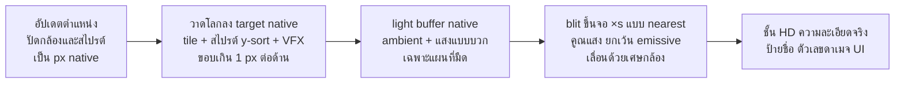

- ปัดตำแหน่งกล้องและสไปรต์ทุกตัวเป็นจำนวนเต็ม px native แล้ววาดลง target native
- ตอน blit ให้เลื่อนภาพกลับด้วยเศษ subpixel ของกล้อง × s กล้องจึงเลื่อนลื่นแม้พิกเซลตรงกริด (เทคนิคของ David Holland ที่ snap กล้องแล้วเลื่อนกลับด้วยค่าคลาดเคลื่อน)
- จอสั่นบวกเข้าตำแหน่งกล้องเป็นจำนวนเต็ม px native ก่อนวาดโลก ภาพโลกทั้งภาพเลื่อนพร้อมกันจึงไม่เกิด mixel และป้ายกับตัวเลขที่ยึดกับโลกในชั้น HD สั่นตามเพราะใช้ตำแหน่งกล้องเดียวกัน
- ขอบเกิน 1 px ต่อด้านพอสำหรับเศษกล้อง เพราะจอสั่นขยับกล้องเอง ขอบจอจึงไม่โหว่ (render target = วิว + 2 ตามข้อ 10)
- ห้ามหมุน ย่อ หรือวางสไปรต์ในโลกที่ตำแหน่งเศษส่วน เอฟเฟกต์ทุกตัววาดลง target native
- เท็กซ์เจอร์โลกทุกตัวใช้ nearest และปิด mipmap
- ข้อยกเว้นมี 2 จุด: มุมแม่ทัพบนจอที่หารไม่ลงตัว (720p ได้ ×1.333) และ push-in ขั้นสุด ทั้งสองใช้ sharp-bilinear คือขยายด้วย nearest ถึงจำนวนเท่าเต็มก่อนแล้วเกลี่ยเฉพาะส่วนเศษ ตรงกับพฤติกรรมของ `image-rendering: pixelated` ที่ MDN อธิบาย

**ขนาดสไปรต์ (px native)**

| ประเภท | สูง (px) | ช่องเฟรม (px) | หมายเหตุ |
| --- | --- | --- | --- |
| ผู้เล่น ขุนพล NPC | 32 จากเท้าถึงกระหม่อม ไม่นับพู่และธงหลัง | 64×64 ท่าตีอาวุธยาวและขั้นสุด 96×96 | ลำตัวกว้าง 14–16 หัว 12–13 หัว:ตัว ≈1:2.5 จุดยึดที่เท้า (32,56) |
| ม้า + ผู้ขี่ | 50–52 (ม้ายาว 44 เมื่อหันข้าง สูงไหล่ 22 หัวม้าราว 30) | 96×80 | ม้าแยกเป็นส่วนหน้าและส่วนหลังของผู้ขี่ |
| ทหารในกอง | 28 (0.875 เท่าของฮีโร่) | 48×48 | อบเป็นชั้นเดียว ไม่แยกชิ้น |
| ทหารม้า | ราว 44 (ม้ายาว 40) | 64×64 | อบเป็นชั้นเดียว |
| มอนทั่วไป / อีลิต | 24–32 / 40–48 | 48×48 / 64×64 | – |
| บอส | 64–96 (2–3 เท่าของผู้เล่น) | 128²–192² | – |
| บอสโลก ช้าง เครื่องตีเมือง | ≤128 | ≤192² | – |

- ช่องเฟรมทุกแบบตัดที่ว่างทิ้งใน atlas และเก็บ pivot ต่อเฟรมใน JSON
- รายละเอียดเล็กสุด 2 px native ตรวจภาพเงาดำที่ 32 px ×1 แทนการตรวจ 60/42/27 px เดิม

| ชิ้นที่ต้องอ่านออก | ขนาด (px) |
| --- | --- |
| ทวน / ง้าว | ยาว 36–44 |
| ดาบ | ยาว 12–16 |
| คันธนู | สูง 18–20 |
| กระบอง + โล่ | 10 + 12 |
| พัด (ขยาย ×1.3 ตามกฎรูปทรงเงา) | 8–10 |
| หมวกและพู่ | เพิ่มความสูง 4–8 |
| ธงหลังหรือปีกเหนือหัว | เพิ่มความสูง 10–14 |

| ขั้น | ขนาดบนจอ 720p (×2) | ขนาดบนจอ 1080p (×3) |
| --- | --- | --- |
| ปกติ: ผู้เล่น 32 px | 64 px (ราว 6 มม. บนจอ 260 ppi) | 96 px |
| มุมแม่ทัพ: ผู้เล่น / ทหาร | ราว 43 / 37 px | 64 / 56 px |
| ใกล้: ผู้เล่น | ไม่มี (ไม่ถึง 270 แถว) | 128 px |

- ในสนาม ความสวยมาจากสิ่งเหล่านี้ตามลำดับ: รูปทรงเงา > บล็อกสีและค่าน้ำหนัก > แถวพาเลตเวลาและแสง > เอฟเฟกต์ > ลายพิกเซล
- มุม 3/4 เห็นหมวก บ่า ธงหลัง อาวุธ หลังม้า และหลังคาชัดที่สุด ใส่รายละเอียดตรงนี้ ส่วนต่ำกว่าเอวลดลงได้
- ห้องแต่งตัว ปุ่มลองสวม โปรไฟล์ และกาชา ใช้สไปรต์ตัวเดียวกันขยาย ×4–×6 บนพื้นหลัง HD คู่กับพอร์เทรต HD แทนโหมดโชว์ 3D

**ทิศและการ mirror** ทุกอย่างที่มาจาก 3D มี **8 ทิศ ช่องละ 45°** ได้แก่ ผู้เล่น ขุนพล ม้า ทหาร มอน บอส และเครื่องตีเมือง

- เรนเดอร์จริง 5 ทิศ (S, SE, E, NE, N) แล้ว mirror แนวนอนเป็น SW, W, NW ใช้พื้นที่ atlas 5/8 ไฟล์ ACT ของ Ragnarok Online ก็มีธง mirror ต่อชั้นแบบนี้
- เหตุผล: จอยสติ๊กหมุนได้ 360° ท่าคอมโบ การยิงแนวทแยง และม้าวิ่งทแยงจะดูผิดชัดถ้ามีแค่ 4 ทิศ การพรีเรนเดอร์ทำให้เพิ่มทิศได้โดยเสียแค่พื้นที่ atlas
- การเล็ง: เซิร์ฟเวอร์คำนวณการโดนด้วยมุมต่อเนื่อง ภาพหันไปทิศที่ใกล้ที่สุดใน 8 ทิศ ลูกธนูวาดไว้ 16 ทิศ
- ของที่วาดมือแบบ native (สัตว์เล็ก NPC ประจำจุด ของบนพื้น) ใช้ 4 ทิศ (วาด 3 + mirror 1) หรือทิศเดียว

**กติกา mirror**

1. อาวุธสลับมือเมื่อ mirror ยอมรับได้แบบเกมพิกเซลทั่วไป
2. ห้าม mirror อักษรหรือตรา (ธงหลัง ตราก๊ก อักษรที่นั่งข้อ 4.3.9) ให้วาดเป็นชั้นซ้อนแยกที่ไม่ mirror
3. ไฟหลักตอนเรนเดอร์ต้องอยู่ในระนาบกล้อง (บน-หน้า) แสงจึงไม่กลับด้านเมื่อ mirror ถ้าใช้ normal map ต้องกลับค่า X ใน shader
4. ชิ้นที่ไม่สมมาตรมากติดป้าย `asym` ในชีต แล้วเรนเดอร์ครบ 8 ทิศเฉพาะชิ้นนั้น
5. ลำดับชั้นต่อทิศต่อเฟรม เช่น ธงหลังหรืออาวุธอยู่หน้าหรือหลังตัว เก็บใน JSON แบบไฟล์ COF ของ Diablo II ซึ่งเป็นตารางลำดับชั้นของทุกทิศและทุกเฟรม

**เลือกแนวทางอาร์ต**

| ตัวเลือก | ข้อดี | ปัญหา | ผล |
| --- | --- | --- | --- |
| พิกเซล native ล้วนด้วย AI | เป็นพิกเซลแท้ทั้งเกม | ชั้นอุปกรณ์หลายสิบชิ้น × ราว 129 คลิป × 5 ทิศต้องตรงกันทุกพิกเซล AI คุมข้ามหลายพันเฟรมไม่ได้ และทำท่าสัตว์สี่ขาไม่ดี | ใช้กับฉากและของนิ่ง |
| 3D เรียลไทม์ + shader พิกเซล | ใช้โมเดลเดิมตรงๆ | แบกรันไทม์ 3D บน Mali-G52 พิกเซลคลานเมื่อโมเดลหมุน เส้นขอบไม่สม่ำเสมอที่ความละเอียดต่ำ (David Holland ยอมรับเอง) | ไม่เลือก |
| พรีเรนเดอร์ทั้งหมดรวมฉาก | สายผลิตเดียว | ฉากดูเป็น 3D แข็ง เสียลุคงานวาด | ไม่เลือก |
| **แบบผสม** | ฉากได้ลุคงานวาดใกล้ภาพอ้างอิง ของที่ใส่เปลี่ยนบนตัวทันทีด้วยการเรนเดอร์ซ้ำ | ตัวละครเสี่ยงดูเป็น 3D และพิกเซลกะพริบ | **เลือก** |

**สายผลิตตามประเภทงาน (เครื่องมือ ราคา และลิขสิทธิ์อยู่ในข้อ 2.1)**

| งาน | วิธี | ผลลัพธ์ |
| --- | --- | --- |
| ฉาก: tile 16 อาคาร พร็อพ กำแพง ต้นไม้ น้ำ | AI พิกเซล (PixelLab, Retro Diffusion) แล้วเก็บงานใน Aseprite ที่ Claude Code สั่งผ่าน CLI (`--batch --script`, `--sheet/--data`, `--color-mode indexed`, `--palette`) | tileset ดัชนีสี + autotile 47 ชิ้น |
| ตัวละคร อุปกรณ์ ม้า ทหาร มอน บอส เครื่องตีเมือง | สายผลิต 3D เดิมใน Blender headless (ตัวสร้างเกราะพาราเมตริก โครงกระดูกร่วม socket ม้าโครงเดียว คลิปท่าที่มีใบอนุญาต) | PNG ดัชนีสี + JSON ต่อชั้น |
| VFX | flipbook native วาดเองหรือ AI แล้วเก็บใน Aseprite ฝุ่นใหญ่ ประตูแตก และเครื่องตีเมืองพรีเรนเดอร์ได้ | flipbook ดัชนีสี |
| UI พอร์เทรต กาชา | Nano Banana Pro | ภาพ HD แนววาดกึ่งเหมือนจริงตามข้อ 2.2 |

**สคริปต์พรีเรนเดอร์ `blender -b -P` (Claude Code เขียน เก็บใน repo)**

1. ตั้งกล้อง orthographic มองลง 30° จากแนวราบ ใช้มุมเดียวนี้กับทุกสไปรต์ เรนเดอร์ 5 ทิศที่ขนาด native โดยไม่มี AA
2. ลงสีด้วย toon ramp 3 ขั้นตามวัสดุ 6 ตระกูล เรนเดอร์ pass รหัสวัสดุกับ pass ขั้นแสง แล้วรวมเป็นดัชนีช่องวัสดุ (ช่อง × 4 + ขั้น ตามข้อ 6.1) ตรงๆ ไม่ต้องดูดสีภายหลัง
3. ใช้ Z-pass แยกแต่ละชิ้นเป็นส่วนหน้าและส่วนหลังเทียบกับร่าง ลำดับวาดคือ อาวุธส่วนหลัง → ร่าง → เกราะ → หัว → อาวุธส่วนหน้า
4. ใส่เส้นขอบ 1 px ด้วยสีเข้มสุดของรามป์ ลบพิกเซลกำพร้า
5. จองสีก๊กเป็นช่องวัสดุ 「ก๊ก」 3 ช่องตามข้อ 6.1 แล้วแถว remap ต่อตัวชี้ไปที่รามป์สีทีมของฝ่ายนั้นในผังพาเลตโลก
6. ส่งออก PNG ดัชนีสี + JSON (pivot ลำดับชั้นต่อเฟรม event เฟรมโดน) และ normal map สำรองไว้สำหรับแสง 2D รุ่นหลัง

- Dead Cells ใช้วิธีเดียวกัน เรนเดอร์ขนาดเล็กไม่มี AA ด้วย toon shader ใส่ของบนโมเดลเดิมโดยไม่ต้องวาดใหม่ ประหยัดงานหลายร้อยชั่วโมง และแก้จังหวะท่าแค่ขยับคีย์
- Dead Cells ยอมรับว่ายังมีพิกเซลกะพริบและรายละเอียดน้อย ตัวละครของเขาสูงราว 50 px ตัวเราสูง 32 px จึงเสี่ยงกว่า ต้องมีสคริปต์ `flicker_check`
- ไฟล์ Blender ต้นทางใช้มาตรฐานเดิม: กระดูกคนหลัก ≤40 + รอง ≤12 กระดูกม้า ≤35 + หาง 3 + แผงคอ 2 socket มือ หลัง หัว อาน ส่งออกเป็นสไปรต์เท่านั้น ไม่ส่ง glTF เข้าเกม
- Diablo II ใช้สไปรต์พรีเรนเดอร์แยกชั้น (หัว ลำตัว ขา แขน มือ โล่) ให้ของที่ใส่เปลี่ยนบนตัวทันที ตรงกับกฎเหล็กข้อ 6.1
- ท่าคีย์แบบ 2D ด้วยเฟรมน้อยก่อนแล้วค่อยเติม (pose-to-pose แบบ Dead Cells) ยืนและเดิน 10–12 fps คลิปละ 4–6 เฟรม ท่าตีและสกิล 16–24 fps คลิปละ 6–10 เฟรม หน้าต่างคอมโบในข้อ 4.1 จึงตรงกับภาพ

**พาเลตและผังดัชนี (R8 + LUT)** ภาพโลกทุกชิ้นเก็บเป็นดัชนีสี 8 บิต (R8) เล็กกว่า RGBA 4 เท่า และสลับสีก๊ก เวลาในวัน วนสี และสถานะได้โดยไม่วาดภาพเพิ่ม พาเลตหลักมี 64 สี เพราะ Derek Yu ระบุว่า 16–32 สีเป็นค่าที่นิยม แต่เกมเรามีวัสดุ 6 ตระกูลและต้องรวมงาน AI หลายเครื่องมือให้เป็นสไตล์เดียว

| ดัชนี | จำนวน | ใช้ |
| --- | --- | --- |
| 0 | 1 | โปร่งใส |
| 1–64 | 64 | พาเลตหลัก 「漆畫64」 ใช้ร่วมทั้งฉากและตัวละคร ราว 12 รามป์: รักดำ/หมึก เทาอุ่น ดินเหลือง ไม้ หิน/อิฐเทา ใบไม้มะกอก เขียวหยก น้ำเงินคราม ผิว ชาด สำริด/ทอง ม่วงเวท (รามป์ชาดและเขียวหยกของฉากเป็นคนละชุดกับรามป์สีทีม ใช้กับของชิ้นเล็กอย่างเสาและตราได้ แต่ห้ามกินพื้นที่ ≥10% ของแผนที่ ส่วนรามป์น้ำเงินครามใช้ทำน้ำได้เฉพาะขั้นที่ L\* ≤50) |
| 65–72 | 8 | สีทีม: รามป์ 4 + ขลิบ 2 + พื้นธงและอักษรธง 2 สลับต่อสไปรต์ด้วยแถว remap |
| 73–76 | 4 | สีขนม้า สลับเป็นแถว (น้ำตาลแดง เกาลัด ดำ เทาขาว เซ็กเธาว์) |
| 77–92 | 16 | วนสี 3 ชุด: น้ำ 4 · ไฟ/ถ่าน 4 · วงยันต์และประกายอาวุธ 8 หมุนค่าในแถวพาเลตแล้วอัปโหลดใหม่ |
| 93–108 | 16 | สีร้อนของ VFX: ขาวร้อน เหลืองประกาย ส้มถ่าน แดงหมึก ม่วงอสนี ฟ้าลม หมึกดำ **ห้ามใช้ในฉาก** |
| 109–116 | 8 | emissive (หน้าต่างมีไฟ โคม ถ่าน) ไม่ถูกทำให้มืดตอนกลางคืน |
| 117–255 | 139 | ปลายทางของแถว remap: รามป์สีทีมทุกฝ่าย (วุย จ๊ก ง่อ ขุนศึกอิสระ โพกผ้าเหลือง และทัพ NPC) สีสายตรา (ข้อ 4.3.9) สีย้อม และสีระดับของ ที่เหลือเป็น overlay ต่อแผนที่ เช่น ฝน ดาว ไฟลาม |

- ผังนี้คือผังพาเลตโลก ฉาก พร็อพ VFX NPC วาดมือ และไอคอนเก็บดัชนีตามผังนี้ตรงๆ ส่วนสไปรต์จาก 3D เก็บดัชนีช่องวัสดุ (ช่อง × 4 + ขั้น) ตามข้อ 6.1 แล้วแถว remap ต่อตัวแปลงเข้าผังนี้ ทุกภาพจึงใช้แถวพาเลตเวลาเดียวกัน
- ผังแบบนี้ตามต้นแบบ 2 ชิ้น AoE2 จองดัชนีสีผู้เล่นเป็นช่วงต่อผู้เล่น (ฐาน + ผู้เล่น×16) ส่วน Mark Ferrari ทำภาพเดียวที่เปลี่ยนได้หลายฉากโดยพาเลต 256 ยังว่างเกือบครึ่ง และให้ overlay ที่ไม่เคยขึ้นพร้อมกันใช้ช่องพาเลตร่วมกัน
- สัปดาห์แรกใช้ Resurrect 64 (64 สี ดาวน์โหลดราว 360,000 ครั้ง ผู้สร้างตอบในหน้า Lospec ว่าใช้ในเกมเชิงพาณิชย์ได้) แล้วแทนด้วย 「漆畫64」 ที่เริ่มจากโทเคน UI เดิม (lacquer, vermilion, gilt, bronze, verdigris, slip, ink)
- วิธีทำรามป์ตาม Slynyrd: ความสว่างไล่ขึ้น ความสดสูงสุดที่ช่องกลาง ขยับ hue ไม่เกินราว 20° ต่อช่อง ด้านเงาเลื่อนไปทางน้ำเงินหรือม่วง ด้านไฮไลต์เลื่อนไปทางเหลือง
- พื้นใช้รามป์ 5–6 ช่อง ต่างกันช่องละ ΔL\* 5–7 ให้นุ่มแบบภาพอ้างอิง วัสดุบนตัวละครใช้ 4 ช่อง ต่างกันช่องละ ΔL\* 10–14 (toon 3 ขั้น + ไฮไลต์โลหะ 1)

**กติกาค่าน้ำหนัก (สคริปต์ตรวจได้)**

| ชั้น | L\* | C\* | หมายเหตุ |
| --- | --- | --- | --- |
| พื้นผืนใหญ่ (กลางวัน) | 45–72 | ≤18 | ภาพอ้างอิงมี IQR 60–70 และ C\* 20 เกมเราจางกว่าเล็กน้อยเผื่อสีก๊ก |
| พร็อพและอาคาร | 25–80 | ≤30 | เส้นขอบ L\* 25–35 |
| ตัวละคร | เส้นขอบ ≤20 | สีหลัก ≥35 | ต้องเข้มที่สุดและสดที่สุดในจอเสมอ |
| VFX และไฮไลต์ร้อน | 85–100 | ≥50 | สงวนไว้ ห้ามใช้ในฉาก เอฟเฟกต์จึงเด่นทุกแผนที่ |

**สีประจำก๊ก** ใช้ชุดสีที่ผู้ใช้เลือก ตรงกับข้อ 2.2 คือ วุยแดงครั่ง ◆ จ๊กเขียวมรกต ● ง่อฟ้าใส ▲ (เฉดแต่งใหม่ ไม่ลอกเฉดของ Koei) และป้ายทัพทุกป้ายต้องมีรูปตราและลายพื้นคู่กับสีเสมอ ส่วนอักษรก๊กใส่เฉพาะตราขนาดใหญ่ (ดูตราประจำก๊ก)

| ก๊ก | สีหลัก (ชุด/ธง) | สีรอง | สีขลิบ | สีสัญญาณทัพ | รูปตรา | ที่มา | ชั้นข้อมูล |
| --- | --- | --- | --- | --- | --- | --- | --- |
| วุย (魏) | แดงครั่ง #BC1A3C | รักดำ #15161A | ทอง #C9A04A | #D02A45 | ◆ | ผู้ใช้เลือก ไม่อิงประวัติศาสตร์ (บันทึกว่าวุยถือธาตุดิน 「服色尚黃」 ตัวบท 三國志·明帝紀 ปี 237) | แต่งใหม่ |
| จ๊ก (漢) | เขียวมรกต #4DA469 | เขียวสนเข้ม #2E5A45 | สำริด #B08D57 | #5DBE7A | ● | ผู้ใช้เลือก ไม่อิงประวัติศาสตร์ (บันทึกว่าฮั่นตะวันออกถือธาตุไฟ และจ๊กใช้ชื่อรัฐว่า 漢) | แต่งใหม่ |
| ง่อ (吳) | ฟ้าใส #3BC1FA (ค่าเดียวทั้ง UI และสไปรต์) | กรมท่า #1F3A5C | เงิน #C8CDD2 | #8FE0FF | ▲ | ผู้ใช้เลือก ไม่อิงประวัติศาสตร์ (บันทึกว่าง่อถือธาตุดินเหมือนวุย 「以爲土行」 裴注 ยก 江表傳) | แต่งใหม่ |
| ขุนศึกอิสระ (NPC) | เทาเถ้า #8A8A80 | – | – | #B0B0B0 | ■ | – | แต่งใหม่ |
| โจรโพกผ้าเหลือง (黃巾) มอน | มัสตาร์ดหม่น #A89B4A | – | – | – | – | หม่นไว้เพื่อไม่ให้ชนทองของ UI และสีตัวเรา (ห่าง gilt-400 12.9) และอยู่แค่ผ้าโพกบนหัว | ประวัติศาสตร์ + นิยาย |

- ใช้สีสัญญาณทัพกับข้อมูลทัพเท่านั้น ได้แก่ เงาโครงร่างหลังสิ่งบัง แผ่นรองพื้นกอง พื้นที่ครองบนมินิแมป แถบยึดธง และตราก๊กบนป้ายชื่อ (ตัวชื่อ แถบเลือด และจุดคนใช้สีความสัมพันธ์ตามข้อ 2.2 ส่วนแผนที่แผ่นดินใช้สีเติมตามข้อ 2.2) ห้ามใช้บอกระดับของ
- สีระดับของ (แดง เขียว ฟ้า) ชนกับวุย จ๊ก และง่อ จึงบอกระดับด้วยเครื่องประดับมุมกรอบและเอฟเฟกต์ตามข้อ 2.2 ก่อน สีเป็นแค่ตัวเสริม บนสไปรต์สีระดับลงได้แค่ขอบโลหะและอัญมณีไม่เกินราว 5% ของพิกเซล ห้ามลงผ้า และชื่อของในแชตอยู่ใน 「」 เสมอ
- ตรวจด้วยสคริปต์จำลองตาบอดสี (Machado 2009) แล้ว คู่ที่ใกล้สุดคือวุยกับจ๊กในตาบอดสีเขียว ΔE 14.8 (ตาบอดสีแดง 31.9) และจ๊กกับง่อในตาบอดสีน้ำเงิน ΔE 14.2 คู่อื่นทุกแบบ ≥40 เพราะแยกด้วยความสว่าง วุย L\* 41 < จ๊ก 61 < ง่อ 74 ห้ามปรับจนลำดับนี้เปลี่ยน และยังต้องมีรูปตราและลายพื้นคู่เสมอ (อักษรก๊กมีเฉพาะตราขนาดใหญ่) สีวุยห่างทอง gilt-500 ΔE 46 แต่ห่างปุ่มชาด vermilion-500 แค่ ΔE 8.3
- ไม่มีมาตรฐานสีเดียวให้ต้องตาม เกม Koei ใช้วุยน้ำเงิน จ๊กเขียว ง่อแดง ส่วน 三國殺 ใช้จ๊กแดงกับง่อเขียว ชุดของเราซ้ำ Koei แค่จ๊กเขียว (คนละเฉด) ส่วนวุยกับง่อสลับกับ Koei

**ตราประจำก๊ก** ใช้ ◆ วุย ● จ๊ก ▲ ง่อ เป็นตราก๊กต่อไป แบ่ง 3 ขนาด และใส่อักษรจีนเฉพาะขนาดใหญ่

| ขนาด | ใช้ที่ไหน | รูปแบบ |
| --- | --- | --- |
| จิ๋ว: สไปรต์ 8×8 native × k ในช่อง 16 design px (k ตามข้อ 2.2) | หมุดก๊กบนมินิแมพ (จุดคนยังใช้สีความสัมพันธ์) | รูปทรงล้วน 7×7 รวมขอบ 1 px สีหมึก #120E0C (บนพื้นมืดใช้ขอบสีอ่อน) เติมสีสัญญาณทัพ ไม่มีอักษร |
| เล็ก: ในโลกไม่เกิน 15×15 native · บน UI HD ต่ำกว่า 48 design px | ธงหลัง 7×7 native · ชิปป้ายชื่อในสงคราม 9×9 native · ตราบนป้ายชื่อไม่เกิน 12 native · ธงแม่ทัพ · ตราการ์ดนาม 28 design px | พื้นสีก๊ก (ป้ายชื่อและชิปใช้สีสัญญาณทัพ) + รูปทรงกลางตรา วุยสีขาว จ๊กและง่อสีหมึก #120E0C (ขาวบนเขียวหรือฟ้าได้แค่ 1.5–3.1:1) ไม่มีอักษร ถ้าต้องมีชื่อให้วางชื่อไทยข้างตรา |
| ใหญ่: 48 design px ขึ้นไป (ชั้น HD) | หน้าสร้างตัวละคร (เลือกก๊ก) · ธงใหญ่บน UI · ประกาศสงคราม · หน้า codex | รูปทรงเป็นกรอบนอก อักษรตราประทับอยู่ข้างใน: 魏 ใน ◆, 漢 ใน ●, 吳 ใน ▲ ใช้คู่สีเดียวกับขนาดเล็ก ป้ายไทย "วุย" "จ๊ก (ฮั่น)" "ง่อ" ต้นฉบับ 256×256 ใน atlas HD |

- **วาด:** วาดรูปทรงเป็นพิกเซลเอง ห้ามใช้ glyph จากฟอนต์ (ทดสอบที่ 8 px บางฟอนต์ทำ ◆ กับ ● เป็นก้อนคล้ายกัน) ◆ ปลายแหลมชนขอบ ● เป็นแปดเหลี่ยมมน ▲ ฐานเต็มกว้าง ตราที่ลอยบนฉาก (ชิปและป้ายชื่อ) มีขอบหมึก 1 px เหมือนหมุดมินิแมพ เพราะในตาบอดสี จ๊กกับดินและวุยกับหญ้าห่างแค่ ΔE 1–8 ถ้าภาพขาวดำยังแยก ◆ กับ ● ไม่ออก ให้ทำ ● เป็นวงแหวนกลวงทุกขนาด ขนาดใหญ่เริ่มที่ 48 เพราะช่องใน ◆ และ ▲ เหลือราวครึ่งหนึ่ง คือ 24 design px ซึ่งพอให้ 魏 18 ขีด (ทดสอบแล้วต้อง ≥16 px)
- **ลายประกอบ (ตกแต่งเท่านั้น):** ง่อ ธงมังกรเหลือง 黃龍大牙 หรืออีกาแดง 赤烏 · วุย มังกรเขียว 青龍 หรือธงเหลือง 黃幢 · จ๊ก เปลวไฟจากศักราช 炎興 หรือตราหยกจากแม่น้ำฮั่น ห้ามใช้มังกรเป็นตัวแยกก๊กหลัก (มังกรเหลืองเป็นลางของทั้งสามก๊ก) และห้ามใช้ขนขาว 白毦 เป็นสัญลักษณ์จ๊ก (เคยส่งไปง่อด้วย)
- **หมายเหตุประวัติศาสตร์:** ไม่พบหลักฐานว่าก๊กใดใช้โลโก้หรือตรารูปทรง สิ่งที่มีหลักฐานว่าใช้แสดงตัวคือ (1) สีตามห้าธาตุ วุยเหลือง (ประวัติศาสตร์ ประกาศปี 237) ง่อเหลืองและจ๊กแดง (อนุมาน) (2) ชื่อรัฐบนตรา 魏 มีตราขุดพบ และ 吳 อยู่ในชื่อตำแหน่งบนตรา (ประวัติศาสตร์) ส่วน 漢 ของจ๊กยังไม่พบตรา (อนุมาน) (3) ชื่อรัชศกจากลางมงคล (4) ธงบัญชาการของแม่ทัพ ส่วนสีแดง เขียว ฟ้า และ ◆●▲ เป็นธรรมเนียมเกม (แต่งใหม่)
- **จ๊กใช้ 漢:** รัฐของเล่าปี่เรียกตัวเองว่า 漢 ส่วน 蜀 เป็นคำที่ฝ่ายวุยและตันซิ่วใช้ ชื่อไทยยังเป็นจ๊กก๊กตามฉบับหน (จ๊ก คือเสียงอ่านของ 蜀) ป้ายไทยของตราจึงเขียน "จ๊ก (ฮั่น)"
- **ช่วงเวลา:** 魏 เพิ่งมีปี 213 (โจโฉเป็น 魏公) และ 漢 ของเล่าปี่ก่อนปี 221 ชนกับราชสำนักฮั่น ในเกมแสดงตราทั้งสามตั้งแต่เริ่มเป็นธรรมเนียมเกม (ป้าย 創) และอธิบายในหน้า codex ธง 漢 ของราชสำนักในฉากยุคตั๋งโต๊ะเป็นธงผ้าในโลก ไม่มีกรอบ ● จึงไม่ปนกับตราจ๊ก

**ที่มา:** [三國志·明帝紀](https://zh.wikisource.org/wiki/三國志/卷03) · [先主傳](https://zh.wikisource.org/wiki/三國志/卷32) · [吳主傳](https://zh.wikisource.org/wiki/三國志/卷47) · [胡綜傳](https://zh.wikisource.org/wiki/三國志/卷62) · [รายการตราทองยุคฮั่นถึงจิ้น](https://zh.wikipedia.org/zh-hans/两汉及魏晋南北朝时期金质官印列表) · [ตรา 輔吳將軍章](http://www.news.cn/20241107/ab9706fffab34b7098879b905136d8f6/c.html)

**สีก๊กในโลกพิกเซล (ΔE2000 คำนวณด้วยสคริปต์)**

| สีก๊ก | L\*/C\* | ดินเหลือง C25 #BCA27A | ดินเหลือง C15 #B4A48C | หญ้าหม่น #6E7A56 | น้ำเขียวคราม #2F7F86 | น้ำน้ำเงินคราม #3A5A8C | ไฟ #F08A3A |
| --- | --- | --- | --- | --- | --- | --- | --- |
| วุย #BC1A3C | 41/66 | 40.6 | 39.2 | 45.2 | 58.1 | 39.0 | 36.1 |
| จ๊ก #4DA469 | 61/46 | 27.1 | 25.3 | **17.4** | 25.1 | 45.5 | 47.3 |
| ง่อ #3BC1FA | 74/42 | 40.5 | 34.9 | 42.8 | 25.5 | 36.9 | 51.3 |

- ทุกก๊กห่างทุกช่องในตาราง ≥17 คู่ที่ต้องคุมคือจ๊กกับหญ้า ง่อกับน้ำ และวุยกับผาแดงและไฟ ส่วนในจำลองตาบอดสีแดงหรือเขียว จ๊กกับดินเหลืองเหลือ ΔE 1–8 (ทั้ง base และสีสัญญาณ) และวุยกับหญ้าหม่นเหลือ 7.6 จึงแยกฝ่ายในโลกด้วยรูปตราบนธงแซ่และธงหลังเป็นหลัก สีผ้าและแผ่นรองพื้นเป็นแค่ตัวเสริม
- พื้นผืนใหญ่ต้องมี C\* ≤18 (hue 60–100) แล้วทุกก๊กจะห่างทุกพื้นในแถบ L\* 45–72 อย่างน้อย ΔE 19.5 หญ้าผืนใหญ่ใช้ hue 95–115 C\* ≤18 จ๊กจึงห่าง ≥15.7 (ขั้นมืดของรามป์จ๊ก #266546 เหลือ 13.6 จึงใช้แค่เงาพับผ้า)
- น้ำทุกแผนที่ใช้น้ำเงินครามเข้ม (Lab hue 245–285, L\* ≤50) หรือสีขุ่นตามแม่น้ำ ไม่ใช้เขียวครามและห้ามน้ำฟ้าสว่าง กรณีแย่สุดในกรอบนี้ง่อยังห่าง ≥20 และน้ำ #3A5A8C ห่าง 36.9 (ถ้าสว่างถึง L\* 55 ต้องมี C\* ≤30 จึงห่าง ≥16) ขั้นมืดของรามป์ง่อ #0F7EB6 (L\* 50) อยู่ในกรอบน้ำนี้เอง จึงใช้แค่เงาพับผ้า และผ้าง่อต้องเป็นขั้น base เป็นหลัก
- ทุกก๊กใช้ base ค่าเดียวกันทั้ง UI สไปรต์ และแผนที่ ส่วนเส้นขอบ แผ่นรองพื้น และตัวอักษรใช้สีสัญญาณและสีตัวอักษรตามข้อ 2.2
- วุยต้องมาเป็นคู่ 「แดงครั่ง+รักดำ ขลิบทอง」 เสมอ (ธงแดงขลิบทอง เกราะลงรักดำ) เพราะแดงครั่งมืดที่สุดในสามก๊กและบนรักดำได้แค่ 3.1:1 ขอบทองจึงเป็นตัวบอกรูป
- เกณฑ์สคริปต์: base สีก๊กห่างดัชนีฉากที่กินพื้นที่ ≥10% ของแผนที่อย่างน้อย ΔE00 15 ในทุกแถวเวลา
- เกณฑ์สคริปต์: พิกเซลสีทีมเป็น ≥15% ของพิกเซลทึบของทหาร และ ≥8% ของฮีโร่ (ไม่นับธงหลัง)

| รามป์ทีม (สคริปต์สร้าง รอตาคนปรับในฉากทดสอบ) | มืด | base | สว่าง | ไฮไลต์ |
| --- | --- | --- | --- | --- |
| วุย | #710626 | #BC1A3C | #E3575F | #F19D9B |
| จ๊ก | #266546 | #4DA469 | #83C97E | #D0E5A8 |
| ง่อ | #0F7EB6 | #3BC1FA | #90DCFD | #D8F2FB |
| ขุนศึกอิสระ | #514E47 | #8A8A80 | #ABADA3 | #CCCDC8 |
| โพกผ้าเหลือง | #76581E | #A89B4A | #C1C176 | #DEE1BB |

ทัพ NPC อย่างตั๋งโต๊ะและอ้วนเสี้ยวมีแถวของตัวเอง (แต่งใหม่) ใช้โทนที่ไม่ใช่แดง เขียว หรือฟ้า เช่น ม่วงหม่นหรือน้ำตาลเหล็ก และห่างสีก๊กทั้งสาม ΔE00 ≥15

**วัสดุ 6 ตระกูล (ของทุกชิ้นต้องอยู่ในตระกูลใดตระกูลหนึ่ง)**

| ตระกูล | ใช้กับ | รามป์ในพาเลต | กติกาพิกเซล |
| --- | --- | --- | --- |
| เหล็กแผ่นร้อยและเกล็ด | เกราะแผ่นร้อย เกราะเกล็ดปลา หมวก | เทาเหล็ก 4 ช่อง + ไฮไลต์ 1 | แถวแผ่นทุก 2 px จุดไฮไลต์ 1 px |
| สำริดและทองเหลือง | ขอบเกราะ หัวหอก แผ่นอกหมิงกวง | สำริด/ทอง 4 ช่อง ระดับสูงใช้ช่อง emissive | ขอบ 1 px ตามขอบเกราะ |
| หนังลงรัก | เกราะหนัง เกราะม้า ฝักดาบ | รักดำ 4 ช่อง กึ่งเงา | ไฮไลต์แถบเดียว 1 px |
| ผ้าไหมและป่าน | เสื้อคลุม ผ้าโพก ธง | ผ้าประจำก๊กใช้ช่องวัสดุก๊ก (สไปรต์ ข้อ 6.1) หรือช่องสีทีม 65–72 (งานวาดมือ) | ลายเมฆ (雲紋) เฉพาะชายผ้ากว้าง ≥4 px |
| ไม้และไผ่ | ด้ามทวน คันธนู เครื่องยิงหิน | ไม้ 4 ช่อง | ด้ามหนา 2 px |
| ผิวคนและขนม้า | หน้า ม้า | ผิว 4 ช่อง โทนอุ่น / ช่องขนม้า 73–76 | – |

วัสดุใน Blender ติดรหัสรามป์เป็น custom property สคริปต์จึงแปลงเป็นดัชนีได้ตรง

**เส้นขอบและการลงเงา**

- **ตัวละคร:** ขอบนอกหนา 1 px ใช้สีเข้มสุดของรามป์วัสดุที่ติดขอบ (L\* ≤20) ไม่ใช้ #000 ขอบด้านบนที่รับไฟเข้มกว่าเนื้อแค่ 1 ขั้น (selout ตาม Derek Yu)
- ขอบในใช้เฉพาะแยกชิ้นใหญ่ (ลำตัว แขน อาวุธ) เพราะขอบในทุกชิ้นที่ 32 px ทำให้ภาพเป็นหย่อม
- ห้าม AA ขอบนอก เพราะไม่รู้ว่าพื้นหลังจะเป็นสีอะไร (Derek Yu) ภายในทำ AA ได้ 1 สี
- กลุ่มพิกเซลต้องกว้าง ≥2 px ห้าม dither บนตัวละคร เพราะจะกะพริบเวลาขยับ
- **ไฟหลักอยู่บน-หน้าในระนาบกล้องทั้งสไปรต์และฉาก** ห้ามจัดแสงจากซ้ายหรือขวา เพราะมีการ mirror เงาจึงตกใต้คาง ใต้แขน และขอบล่างของเกราะ
- **ฉาก:** ใส่ขอบเฉพาะรอบนอกของวัตถุที่ชนพื้นและรอยต่อหลังคากับผนัง สีขอบคือสีเข้มสุดของวัสดุ (L\* 25–35) ด้านรับแสงไม่ต้องมีขอบ
- เงาตกจากไฟบน-หน้าไปอยู่หลังวัตถุ จึงใช้ contact shadow แทน คือแถบเข้ม 1–2 px ที่โคนผนัง และแถบเงาใต้ชายคา 3–6 px บนผนัง
- dither ใช้ได้เฉพาะผิวหยาบ (ดิน หิน กำแพงดินอัด) และรอยต่อพื้นต่างชนิด
- **เงาใต้ตัว:** วงรีทับแบบ multiply 50% ฮีโร่ 14×5 px ม้า 30×8 px ทหาร 12×4 px

**รูปทรงเงาต่ออาชีพ (ต้องบอกอาชีพได้ที่ 32 px โดยไม่ดูสี)**

| อาชีพ | รูปทรงหลัก | อาวุธ (ม. ในเกม) | อาวุธบนสไปรต์ (px) | ส่วนที่ขยายเกินจริง |
| --- | --- | --- | --- | --- |
| ขุนศึก | บ่ากว้าง เกราะเต็มตัว ธงหลังสูง | ทวน 2.8 (ทะลวงทัพ) หรือกระบองเหล็ก 0.9 + โล่ (ป้อมปราการ) | ทวน 36–44 / กระบอง 10 + โล่ 12 | บ่า ×1.2 โล่ ×1.15 |
| จอมดาบ | ช่วงตัวแคบ เกราะอกหลัง แขนเปิด ผ้าคาดเอวพลิ้ว | ดาบคู่ 0.9 (ดวลเดี่ยว) หรือง้าว 2.6 (กวาดล้าง) | ดาบ 12–16 / ง้าว 36–44 | ดาบ ×1.15 |
| นักธนู | ไม่สมมาตร ซองธนูพาดเฉียงหลัง หมวกทรงแบน | คันธนู 1.4 | 18–20 | – |
| กุนซือ | เสื้อคลุมบานทรงสามเหลี่ยม ผ้าโพกป่าน | พัด 0.4 | 8–10 | พัด ×1.3 |

สัดส่วนหัว 1:2.5 รวมการขยายหัวแล้ว อาวุธขยาย ×1.15–1.3 ของทุกชิ้นต้องผ่านการตรวจภาพเงาดำที่ 32 px (ข้อ 2.1)

**แคตตาล็อกอ้างอิง: เกราะและม้า**

| ชื่อไทย (จีน) | ชั้นข้อมูล | หลักฐาน | ใช้ในเกม |
| --- | --- | --- | --- |
| เกราะแผ่นร้อย (札甲) | ประวัติศาสตร์ | แผ่นเหล็ก หนัง หรือสำริด ร้อยด้วยเชือกป่านหรือสายหนัง เกราะเหล็กแบบนี้เป็นกระแสหลักตั้งแต่ฮั่นตะวันตก | เกราะระดับขาว–ฟ้าของทุกอาชีพ สร้างแบบพาราเมตริกแล้วพรีเรนเดอร์ แถวแผ่นทุก 2 px |
| เกราะเกล็ดปลา (魚鱗甲) | ประวัติศาสตร์ | สุสานไห่ฮุ่นโหว (海昏侯) พบแผ่นเกราะราว 6,000 แผ่น แผ่นเล็กสุดกว้าง 1 ซม. ผสมเหล็ก สำริด และหนัง ลงรักทั้งหมด | ระดับม่วง ลายเกล็ดเป็นจุดสลับแถว 2 px |
| เกราะอกหลัง (兩當鎧) | ประวัติศาสตร์ | อยู่ในรายการเกราะที่โจโฉพระราชทานโจสิด (曹植) ตาม 北堂書鈔 แผ่นอกกับแผ่นหลังต่อกันที่บ่า | เกราะเบาของนักธนูและจอมดาบ |
| เกราะดำเงา (黑光鎧) | ประวัติศาสตร์ | อยู่ในรายการเดียวกัน ตีความว่าเป็นรุ่นแผ่นอกผิวด้าน | ชุดระดับส้มของวุย ลงรักดำ ขลิบทองเหลือง |
| เกราะหมิงกวง (明光鎧) | ประวัติศาสตร์ (รูปทรงยุคหลัง) | ชื่อปรากฏตั้งแต่ปลายฮั่น แผ่นอกขัดเงารูปวงรีแพร่หลายในยุคหนานเป่ย์เฉาถึงถัง | ระดับตำนาน ติดป้าย 「รูปทรงแพร่หลายหลังยุคสามก๊ก」 |
| เกราะห่วงโซ่ (環鎖鎧) | ประวัติศาสตร์ (รูปทรงไม่ทราบ) | มีแค่ชื่อในรายการของโจสิด ไม่เหลือของจริงหรือภาพสมัยวุย | ไม่ทำในเวอร์ชันแรก |
| เกราะม้า (馬鎧) | ประวัติศาสตร์ | โจสิดได้รับพระราชทาน 「馬鎧一領」 | เกราะม้าเป็นหน้าตาล้วน ระดับตามตารางเครื่องม้าในข้อ 6.3 |
| โกลน (馬鐙) | ประวัติศาสตร์ (ยุคนั้นยังไม่มี) | โกลนคู่สำหรับขี่ที่มีภาพเก่าสุดมาจากปี 322 ของจริงเก่าสุดมาจากสุสาน馮素弗 (ปี 415) | ไม่ใส่โกลน ถูกตามยุค |
| ม้าเซ็กเธาว์ (赤兔) | ประวัติศาสตร์ + นิยาย | 三國志 เขียนว่า 「布有良馬曰赤兔」 ในนิยายตอนที่ 25 โจโฉยกให้กวนอู ฉบับไทยตอนที่ ๕ เรียก 「เซ็กเธาว์」 | ม้าตำนานชั้น 5 แดงถ่านไฟทั้งตัว แผงคอเป็นประกายไฟ ตามข้อ 6.3 (แต่งใหม่) |
| ม้าเต๊กเลา (的盧) | ประวัติศาสตร์ (注 ถูกแย้ง) + นิยาย | เรื่องกระโดดข้ามลำธารมาจาก 世語 ในคำอธิบาย ซึ่ง 孫盛 ค้านว่าเป็นเรื่องเล่าลือ ฉบับไทยตอนที่ ๓๑ สะกด 「เต๊กเลา」 | ม้ามีชื่อชั้น 4 ขนสีเข้ม แถบขาวหน้าผากลงถึงปาก (ไม่ใช่ม้าขาว) ท่าโจน 0.8 วิ ตามข้อ 6.3 |

**ตระกูลอาวุธกับประเภทดาเมจ**

| ตระกูล (จีน) | ท่าปิดหนักและสถานะ | อาชีพ | ชั้นข้อมูลรุ่นพื้นฐาน | หลักฐาน | รุ่นตำนาน (ชั้นข้อมูล) |
| --- | --- | --- | --- | --- | --- |
| ทวน (矛/槊) | แทงทะลุแนว ทำให้เกราะแตก | ขุนศึก (ทะลวงทัพ) | ประวัติศาสตร์ | เตียวหุย 「瞋目橫矛」 ที่สะพาน, 英雄記 เล่าว่าลิโป้ 「以矛刺」 | ทวนเตียวหุย (丈八點鋼矛) ฉบับไทย 「ยาวสิบศอกหนักแปดสิบห้าชั่ง」 (นิยาย) |
| ง้าว: ง้าวเกี่ยว (戟) และใบมีดด้ามยาว (大刀) | กวาดเกี่ยว ฟันแล้วดึงเข้า | จอมดาบ (กวาดล้าง) | ประวัติศาสตร์ | เตียนอุย (典韋) 「提一雙戟八十斤」 ลิโป้ยิงธนูถูก 「小支」 (กิ่งข้าง) ของ戟 | ง้าวกวนอู (青龍偃月刀) หนัก 82 ชั่ง และทวนลิโป้ (方天畫戟) ซึ่งฉบับไทยเรียก 「ทวน」 (นิยาย) |
| ดาบหัวแหวน (環首刀) ถือคู่ | ฟัน ทำให้เลือดออก | จอมดาบ (ดวลเดี่ยว) | ประวัติศาสตร์ | ดาบคมเดียว ด้ามปลายเป็นห่วง ปลายฮั่นตะวันออกใช้แทนกระบี่ทั้งกองทัพ | กระบี่สองเล่มของเล่าปี่ (雙股劍) (นิยาย) |
| กระบองเหล็ก (鐵鞭) + โล่ (楨) | ทุบพื้น ทำให้ล้ม | ขุนศึก (ป้อมปราการ) | นิยาย (กระบอง) + ประวัติศาสตร์ (โล่) | ฉบับไทยตอนที่ ๔ "อุยกายถือกระบองเหล็กสี่เหลี่ยม" ทรงใกล้กันที่มีของจริงพบหลังยุคสามก๊ก (ข้อ 6.2) | กระบองเหล็กสี่เหลี่ยมของอุยกาย (นิยาย) |
| ธนูและหน้าไม้ (弓/弩) | ยิงชาร์จทะลุ | นักธนู | ประวัติศาสตร์ | ลิโป้ 「便弓馬，膂力過人」, ขงเบ้งปรับปรุงหน้าไม้กลที่ยิงได้ 10 ดอกพร้อมกัน (元戎) | – |
| พัด (羽扇) | ร่ายเวทต่อเนื่อง | กุนซือ | ตำนาน | 裴子語林 (สมัยจิ้น) เล่าว่าขงเบ้ง 「著葛巾，持白羽扇，指麾三軍」 | เวททั้งหมดเป็นชั้นนิยาย |

**แคตตาล็อกอ้างอิง: ฉากศึก เครื่องจักร ธง และเครื่องแต่งกาย**

| ชื่อไทย (จีน) | ชั้นข้อมูล | หลักฐาน | ใช้ในเกม |
| --- | --- | --- | --- |
| จักรยนตร์ (霹靂車) | ประวัติศาสตร์ | ที่กัวต๋อ โจโฉสร้างรถยิงหิน (發石車) ทำลายหอสูงของอ้วนเสี้ยว ทหารอ้วนเสี้ยวเรียกว่า 霹靂車 | จักรยนตร์ในสงคราม (ข้อ 7.2) คำสั่งจักรยนตร์ของกุนซือ และกองจักรยนตร์ทหารเอกวุย |
| หน้าไม้สิบลูก (元戎) | ประวัติศาสตร์ | 裴注 ยก 魏氏春秋 มาว่า 「以鐵為矢，矢長八寸，一弩十矢俱發」 | สกิลหน้าไม้สิบลูกของนักธนูสายห่าธนู หน้าไม้สิบลูกประจำหอรบ (ข้อ 7.2) และคำสั่งพลหน้าไม้กลของจ๊ก |
| โคไม้ม้ากล (木牛流馬) | ประวัติศาสตร์ (กลไกเป็นการตีความ) | 三國志 บันทึกว่าขงเบ้งคิดขึ้น ส่วนขนาดชิ้นส่วนมาจาก 亮集 ในคำอธิบาย | ขบวนขนเสบียงพันธมิตร พร็อพพรีเรนเดอร์ 5 ทิศ |
| ค่ายกลแปดทิศ (八陣圖) | ประวัติศาสตร์ + นิยาย | 三國志 บันทึกแค่ 「作八陣圖」 นิยายตอนที่ 84 เล่าว่าลกซุนหลงในกองหินที่ 魚腹浦 ฉบับไทยตอนที่ ๖๕ เขียนว่า 「ศิลากองไว้ประมาณแปดสิบเก้าสิบกอง」 | สกิลค่ายศิลาแปดประตูของกุนซือ (นิยาย) และค่ายกลแปดทิศ (八陣) ของกองทหารในข้อ 4.4 (ชื่อประวัติศาสตร์ กลไกแต่งใหม่) |
| เรือไฟศึกเซ็กเพ็ก (赤壁火攻) | ประวัติศาสตร์ | 周瑜傳 บันทึกว่าบรรจุฟืนในเรือ 蒙衝鬥艦 ราดน้ำมัน ปักธง 牙旗 แล้ว 「時風盛猛…煙炎張天」 | แผนที่ผาแดง Lv80–100 ขั้นสุดเรือเชื้อเพลิงเซ็กเพ็กของกุนซือ และเรือไฟมงชงทหารเอกง่อ |
| ลมสลาตัน (七星壇祭風) | นิยาย | นิยายตอนที่ 49 ฉบับไทยตอนที่ ๔๑ เรียก 「ลมสลาตัน」 ส่วนประวัติศาสตร์บันทึกแค่ว่าลมแรงตามธรรมชาติ | สกิลขั้นสุดขงเบ้งขอลมสลาตัน และการ์ด A3 ในข้อ 7.3 |
| เผาค่ายเล่าปี่ (夷陵火攻) | ประวัติศาสตร์ | ลกซุนให้ทหาร 「各持一把茅，以火攻」 ตีแตก 「四十餘營」 | กลไกไฟลามจากค่ายหนึ่งไปอีกค่ายในสงคราม |
| ธงแม่ทัพ (牙旗) | ประวัติศาสตร์ | ปักบนเรือไฟที่เซ็กเพ็ก | ธงที่ผู้ถือ 持節 ปักในสงคราม (ข้อ 4.3.6) ขอบธงเป็นฟันเลื่อย 2 px |
| ธงอักษรแซ่ (字旗) | นิยาย | นิยายตอนที่ 1 เขียนว่า 「旗上大書『天公將軍』」 | ธงของขุนพล NPC บอส และธงประจำกองทหาร |
| ธงหลังผู้เล่น (背旗) | แต่งใหม่ | – | ลายพันธมิตร 2 สีจากแถว remap + ตราก๊กขนาดเล็ก 7×7 px (พื้นสีก๊กกับรูปทรง ◆●▲ 5×5 ไม่มีอักษร) เป็นชั้นซ้อนที่ไม่ mirror ตราพันธมิตรอักษร 2 ตัวอยู่บนป้ายชื่อ HD และผู้ถือที่นั่งใช้ธงคู่ขอบทองแทน (ข้อ 4.3.9) ช่วยให้ดูออกว่าใครพวกไหนในมุมแม่ทัพ |
| ผ้าเหลืองโพกหัว (黃巾) | ประวัติศาสตร์ + นิยาย | ฉบับไทยตอนที่ ๑ เขียนว่า 「กระจายผมเอาแต่ผ้าเหลืองโพกสีสะทั้งสิ้น」 | มอนแผนที่ Lv1–20 รูปทรงเงาคือผ้าโพกกับผมกระเซิง |
| ผ้าโพกป่านและพัดขนนกขาว (葛巾・白羽扇) | ตำนาน | 裴子語林 สมัยจิ้น ส่วนคำว่า 羽扇綸巾 มาจากบทกวีสมัยซ่ง | รูปทรงประจำกุนซือ |
| ผ้าโพกแดงของขุนนางทหาร (赤幘) | ประวัติศาสตร์ | 後漢書·輿服志 「武吏常赤幘，成其威也」 | NPC ขุนนางทหารราชสำนักฮั่นเท่านั้น ผ้าโพกทหารผู้เล่นเป็นแถบ 2–3 px สีก๊ก (แต่งใหม่) เพื่อไม่กลบสัญญาณวุย |
| หมวกขนไก่ฟ้า (鶍冠) | ประวัติศาสตร์ | 輿服志 「加雙鶍尾，豎左右」 และ 虎賁 羽林 สวม 鶍冠 | ยศ 8 ตามข้อ 4.3.9 และ NPC องครักษ์ 虎賁/羽林 ขนคู่เพิ่มความสูงเงา 6–8 px |

**ระดับของผูกกับชั้นข้อมูล (ภาพบนตัวละครตามตารางความหายากในข้อ 6.1)**

| ระดับของ | ชั้นข้อมูล | รูปแบบ | สิ่งที่บอกระดับบนตัวละครโดยไม่ต้องดูสี (กรอบไอคอนใช้เครื่องประดับมุมตามข้อ 2.2 ไม่ใช้จำนวนเม็ด) |
| --- | --- | --- | --- |
| ขาว–ฟ้า | ประวัติศาสตร์ | เกราะแผ่นร้อยหนังหรือเหล็กเรียบ, ทวนตรง, ดาบหัวแหวน | ทรงเรียบ ไม่มีเอฟเฟกต์ |
| ม่วง | ประวัติศาสตร์ | เกราะเกล็ดปลาลงรัก ขอบสำริด | ชิ้นประดับเพิ่ม ขอบโลหะ 1 px |
| ส้ม | ประวัติศาสตร์ (ตีความ) | เกราะอกหลัง, เกราะดำเงา | ทรงใหญ่ขึ้น 2–4 px ดัชนี emissive ที่ขอบเกราะ |
| แดง | แต่งใหม่ (ทรงยุคฮั่น) | อาวุธและเกราะดรอปขั้นสูง เรืองตามธาตุ | ชีตเฉพาะ ประกาย 1–2 px วนรอบอาวุธ |
| ตำนาน | ตำนาน/แต่งใหม่ | เกราะหมิงกวงแผ่นอกกลม ศาสตรานามจากนิยายและตำนานใช้ภาพระดับนี้เป็นรูปลักษณ์สวมทับ (ข้อ 6.2) | ซิลูเอตเฉพาะ ประกายรอบตัว + รอยแสงตอนเหวี่ยง |

คำอธิบายของในเกมติดป้าย 「ประวัติศาสตร์ / นิยาย / ตำนาน / แต่งใหม่」 ทุกชิ้น ตีบวก +10/+15/+20 เพิ่มชั้นเอฟเฟกต์เรืองอาวุธ 3 ระดับตามข้อ 6.1 วาดเป็น flipbook ชั้นบนแบบบวกแสง

**สถาปัตยกรรมและเครื่องแต่งกายฮั่นเป็น tile (1 ช่อง = 16 px = 1 ม.)** หลักฐานที่ใช้ได้ตรง: โมเดลหอดินเผายุคฮั่นของ Penn Museum มีหลังคาหน้าจั่วลาดตรงชายคายื่น bracket ยื่นชั้นเดียว ปลายกระเบื้องกลมลายม้วน หน้าต่างลูกกรง และสูง 3 ชั้น กำแพงลกเอี๋ยงฮั่น-เว่ยยาวด้านละ 3,700–4,290 ม. หนา 14–30 ม. มี 12 ประตูและถนน 24 สาย กว้าง 20–40 ม.

| ชิ้น | ขนาด (px native) | กติกาวาด | ชั้นข้อมูล |
| --- | --- | --- | --- |
| กำแพงดินอัด 奂土 | หน้าสูง 48–64 ทางเดินบน 32 | ชั้นอัดแนวนอนทุก 2 px สลับ ΔL\* 3–4 รอยแบบไม้แนวตั้งทุก 24–32 px ใบเสมากว้าง 8 เว้น 8 | ประวัติศาสตร์ (ความหนาย่อลงเพื่อการเล่น) |
| ประตูเมือง | ช่องกว้าง 48 สูง 48 | บานไม้มีหมุดสำริดเป็นจุด 1 px ห่าง 3 px ภาพประตูแตกเป็นชุดพรีเรนเดอร์ | ตีความ |
| หอประตู 城樓 | 2 ชั้น ฐาน 8×3 ช่อง สูงรวม ≤128 | หลังคาลาดตรง ชายคายื่น 8–12 px ปลายยกได้ ≤2 px **ห้ามชายคางอนแบบหมิง-ชิง** bracket ชั้นเดียวเป็นบล็อก 2 px ทุก 8 px เป็นชั้น overhead | ประวัติศาสตร์ + ตีความ |
| 闕 คู่ขนาบทาง | ฐาน 2×2 ช่อง สูง 80–96 | ตั้งเป็นคู่สองข้างทาง ของจริงเหลือราว 30 แห่ง ส่วนใหญ่ในเสฉวน ตัวอย่างหนึ่งสูง 6 ม. หลังคาซ้อนและ闕ลูกด้านข้างเป็นการตีความ | ประวัติศาสตร์ + ตีความ |
| หลังคากระเบื้อง 瓦 | ร่องกระเบื้องทุก 3 px | ร่องตามลาด ปลายกระเบื้องกลม 2×2 px ที่ชายคา สันหนา 2 px สีเทาดินเผา | ประวัติศาสตร์ (สีเป็นการตีความ) |
| บ้านโครงไม้ | ผนังสูง 40–48 | หน้าต่างลูกกรง 6×6 px เส้นกรง 1 px เสาและคาน 2 px | ประวัติศาสตร์ |
| หอสังเกต 望樓 | ฐาน 3×3 ช่อง สูง ≤128 | ระเบียงทุกชั้น พลธนู NPC 1–2 ตัว บางโมเดลยุคฮั่นมีบ่อน้ำล้อมฐาน ใช้ในป้อมบ้าน (塢堡) | ประวัติศาสตร์ |
| ตลาด 市 | แผง 2×1 ช่อง แถวละ 6–10 แผง | ผ้าบังแดดสีย้อมธรรมชาติ C\* ≤30 อิฐภาพเสฉวนมีอาคารตลาดที่มีบันไดขึ้น จึงวาง 市樓 2 ชั้นกลางตลาด | ประวัติศาสตร์ + ตีความ |
| ยุ้งฉาง / บ่อน้ำ | 2×2 ยกพื้น 8 px / 1×1 + โครงรอก | ยุ้งฉางตามอิฐภาพเสฉวน ยกพื้นมีขั้นบันได ประตู 2 บาน ช่องระบาย 2 ช่องบนหลังคา | ประวัติศาสตร์ |
| นาและไร่ | ช่อง 16 | ภาคเหนือ (涿 虎牢 洛陽 官渡 五丈原) เป็นไร่ข้าวฟ่างหรือข้าวสาลี แถวทุก 4 px ภาคใต้ (赤壁) เป็นนาข้าว คันนา 1 px น้ำใช้วนสี | ตีความ |
| เรือ | 蒙衝 64×24, 鬥艦 96×32, 樓船 ≤128×64 | ยังไม่พบซากเรือรบพายของจีนเลย รูปทรงจึงเป็นการตีความ 樓船 ทำตามบันทึกคือ 3 ชั้น มีกำแพงกัน หุ้มสักหลาดกับหนังกันไฟ ปักธง | แต่งใหม่ (อิงบันทึก) |
| ธงอักษรแซ่ 字旗 | ผืน 16×24 ถึง 20×28 อักษร 12×12 | ใช้ Fusion Pixel Font 12 px รุ่น zh-Hant (OFL 1.1 ชุดเดียวกับข้อ 2.2) เป็นฐานแล้วเก็บด้วยมือ ชั้นอักษรไม่ mirror ปลิว 4 เฟรมที่ 8 fps | – |

- **เครื่องแต่งกายที่ 32 px:** เกราะแผ่นร้อยเป็นแถวแผ่นทุก 2 px + จุดไฮไลต์ 1 px เสื้อ 袍 ยาวถึงเข่า ช่วงล่างบานทรงคางหมู แข้งพันผ้า
- ผ้าโพก 幘 เป็นแถบ 2–3 px บนหัวใช้สีก๊ก ให้อ่านฝ่ายได้จากด้านบน

**แสงและบรรยากาศ (ไม่ใช้ normal map ในรุ่นแรก)**

1. **แถวพาเลตต่อแผนที่:** แต่ละแผนที่มีได้ ≤8 แถว เช่น กลางวัน เย็น ค่ำ รุ่ง ครึ้ม ฝน shader ผสม 2 แถวด้วยค่า t ต้นทุนแค่เท็กซ์เจอร์ 256×8 (8 KB)
   - Mark Ferrari ใช้วิธีนี้พาภาพเดียวผ่านรอบ 24 ชั่วโมงและเปลี่ยนอากาศได้ แสงเงาเคลื่อนเพราะไล่ผ่านชุดพาเลตที่ออกแบบไว้ และอบ overlay อย่างฝนหรือหน้าต่างมีไฟไว้ในภาพ
   - Claude เขียนสคริปต์สร้างแถวร่างด้วยการแปลงใน Lab แล้วคนปรับใน Aseprite
2. **วนสี:** น้ำ 4 ดัชนีที่ 6–8 Hz ไฟ 4 ดัชนีที่ 10–12 Hz วงยันต์ 8 ดัชนีที่ 12 Hz โดยหมุนค่าในแถวพาเลตแล้วอัปโหลดใหม่ ไม่ต้องมีเฟรมภาพเพิ่ม
3. **light buffer:** render target ขนาดเท่าโลก native ล้างด้วยสี ambient (กลางคืนราว 0.25–0.4) วาดสไปรต์แสงแบบบวก แล้วคูณกับโลกตอน blit ดัชนี emissive ไม่ถูกคูณ
   - สไปรต์แสงเป็นวงไล่ 3 ขั้น (100/66/33%) ขอบ dither 1 px แสงจึงยังเป็นพิกเซล
   - รัศมี (px): คบไฟ 32 โคม 24 กระถางไฟ 48 บ้านไหม้ 96 เรือไฟ 96 แฟลชขั้นสุด 128
   - Godot ทำแบบเดียวกัน (CanvasModulate เป็นสี ambient แสงเป็นเท็กซ์เจอร์) และระบุว่าสไปรต์แบบบวกเรนเดอร์เร็วกว่าระบบแสงเต็มมาก
4. **rim แบบไม่ใช้ normal (P2 เฉพาะตัวเรา):** พิกเซลเส้นขอบที่หันเข้าหาแสงในรัศมีเปลี่ยนเป็นสีแสง คำนวณจากตำแหน่งพิกเซลเทียบกับจุดกลางสไปรต์
5. **หมอก ควัน ฝุ่น:** สไปรต์ dither Bayer 4×4 ความหนา 25/50% เลื่อนด้วยความเร็วเป็นจำนวนเต็ม px ต่อวินาที ภายใน safe area ทับตัวละครได้ไม่เกิน 25%
6. **จังหวะเวลา:** แผนที่ต่อสู้ใช้อารมณ์คงที่ตามตารางล่าง เหตุการณ์อากาศในสงคราม (นาทีที่ 15 และ 35) crossfade 5 วิ เมืองใช้เวลาจริงของไทยแบ่ง 4 แถว crossfade 60 วิ (ข้อเสนอใหม่ รอผู้ใช้ตัดสิน)
7. **ไม่ใช้แสงแบบ Eastward หรือ Sea of Stars:** Eastward ทีม 2 คนทำนานกว่า 6 ปี แยกหลังคากับผนัง สร้างเป็น 3D ในเอนจินของตัวเอง และวาด bump map ทีละชิ้น Sea of Stars เขียน render pipeline เองเพื่อทำแสงไดนามิกเต็มรูปแบบ ทั้งสองหนักเกินสำหรับเว็บบน Mali-G52

| แผนที่ (Lv) | ภูมิประเทศและสถาปัตยกรรม | อารมณ์และแถวพาเลตหลัก | จุดเด่นพิกเซล | ความเสี่ยงสีและวิธีแก้ |
| --- | --- | --- | --- | --- |
| เมืองตุ้นก้วน (涿) บ้านเล่าซองฉุน (1–20) | ที่ราบภาคเหนือ ดินเหลือง ไร่ข้าวฟ่าง หมู่บ้านกำแพงดินอัด ป้อมบ้าน 塢堡 + หอสังเกต สวนท้อ (นิยาย) | บ่ายฝุ่นแห้ง ไฮไลต์อุ่น เงาม่วงอ่อน | กลีบท้อร่วงด้วยวนสี ค่ายโพกผ้าเหลือง | พื้น C\* ≤18 ให้ทุกก๊กห่าง ≥15 สีมัสตาร์ดอยู่แค่ผ้าโพกบนหัว |
| ด่านเฮาโลก๋วน (20–40) | ช่องทางระหว่างเขาซงซานทางใต้กับแม่น้ำเหลืองทางเหนือ ป้อมด่านมีกำแพงขวางหุบ | รุ่งเช้าหนาว เงาฟ้าเทา ไฮไลต์ส้มอ่อน | หมอก dither 2 ชั้น แม่น้ำเหลืองขุ่นที่ขอบบนจอ | หมอกใน safe area ≤25% |
| ลกเอี๋ยง (40–60) | เมืองหลวงฮั่น กำแพงดินอัดหนา 12 ประตู ถนนกว้าง 闕 วัง ตลาด ช่วงตั๋งโต๊ะเผาเมือง | เย็นย่ำไปค่ำ แดงส้ม + ม่วงควัน + light buffer | ไฟลามเป็น tile ควัน dither โคม emissive | ไฟชนสีวุย: แกนไฟเหลืองขาว ขอบส้ม (Lab hue ≥50) ห้ามแดงชาด |
| ทุ่งกัวต๋อ (60–80) | ที่ราบริมแม่น้ำ ค่ายไม้ เนินดินและหอยิงของอ้วนเสี้ยว จักรยนตร์ ยุ้งฉางอูเจา | ฟ้าครึ้ม C\* ×0.7 ปิดเงาตก | ธง 袁 จำนวนมาก อีเวนต์เผาอูเจา | หญ้าต้องห่างจ๊ก ≥15 ใช้ hue เหลืองเขียว 95–115 C\* ≤18 |
| ผาแดง เซ็กเพ็ก (80–100) | แม่น้ำแยงซีขวางจอ ทัพเรือโจโฉอยู่ฝั่งเหนือที่ 烏林 ด้านบนจอ ฝ่ายพันธมิตรอยู่ฝั่งใต้ ผาสีแดงเป็นการตีความ | กลางคืนไฟลุก น้ำเงินเข้ม + ส้มเพลิง | เรือไฟแล่นจากล่างขึ้นบนตามลมตะวันออกเฉียงใต้ เปลวเอนซ้ายบน แสงสะท้อนในน้ำด้วยวนสี | น้ำเป็นน้ำเงินครามเข้ม L\* ≤50 ให้ห่างง่อ ผาแดงเป็นสีสนิม hue 50–65 C\* ≤25 ให้ห่างวุย |
| ที่ราบอู่จั้งหยวน (100+) | ฝั่งใต้แม่น้ำเว่ย ค่ายถาวร นาทหาร 屯田 โคไม้ม้ากล | ใบไม้ร่วงยามค่ำ แสงจันทร์เย็น + โคมอำพัน | ดาวตก (จาก 晉書 ซึ่งนักประวัติศาสตร์แย้ง) ศิลาแปดทิศ | ดินแดนปีศาจใช้แถวพาเลตหมึกม่วงแยก ให้เห็นชัดว่าเป็นชั้นแฟนตาซี |

**Shader 2D (≤5 ตัว Claude เขียนเป็น GLSL ของเอนจิน 2D ที่เลือกในข้อ 10)**

| Shader | ใช้กับ | ส่วนประกอบ | กติกา |
| --- | --- | --- | --- |
| โลกพาเลต | tile สไปรต์ VFX ทึบ | อ่าน atlas R8 → ตาราง remap ดัชนี (สีทีม ขนม้า สถานะ) → ผสมแถวพาเลต 2 แถวด้วย t → dither Bayer ตอนจาง → ธง emissive ลง alpha | nearest ไม่มี mipmap dither อิงพิกัด target native จึงไม่คลาน |
| แสงแบบบวก | สไปรต์แสง glow วาดมือ VFX ร้อน | additive บน light buffer หรือบนโลก | ไม่มี blur |
| เงาใต้ตัว | วงรีใต้ตัวละคร ม้า ทหาร | multiply 50% | batch เดียวต่อชั้น |
| โครงร่างที่ถูกบัง | ตัวเรา ปาร์ตี้ 5 และเป้าที่ล็อก รวม ≤7 | stencil จากชั้นบัง เส้นขอบ 1 px สีก๊ก + เติม dither 25% | AoE2 ก็วาดเส้นขอบสีผู้เล่นทับอาคารหรือต้นไม้ที่บัง |
| blit | ขึ้นจอ | nearest ×s หรือ sharp-bilinear, คูณ light buffer ยกเว้น emissive, offset เศษกล้อง (จอสั่นรวมอยู่ในตำแหน่งกล้องแล้ว) | 1 pass เต็มจอ |

- ตาราง remap เป็น R8 ขนาด 256 × ≤256 แถว (1 แถวต่อตัวละครหรือชุดสีตามข้อ 6.1) สไปรต์ส่งเลขแถวเป็น attribute แถวพาเลตเป็น RGBA 256 × ≤8 ต่อแผนที่
- ไม่มี bloom, FXAA, FSR, tone mapping หรือระดับกราฟิกด้านความละเอียด ความงามหลังภาพมาจากแถวพาเลต light buffer และ glow วาดมือ
- ในโลกห้ามใช้ alpha ยกเว้นแสงแบบบวกและเงาใต้ตัว การจาง หมอก ควัน ฝุ่น การตาย และแผ่นรองพื้นกอง ใช้ dither ทั้งหมด

**เอฟเฟกต์ตามประเภทดาเมจ** กติการ่วม:

- วาดลง target native flipbook ตอนโดนเล่น 20 fps (เฟรมละ 50 ms) ส่วนที่วนซ้ำเล่น 10–12 fps ทุกประเภทต้องอ่านออกภายใน 3 เฟรม (150 ms)
- ห้ามหมุนหรือย่อสไปรต์ ส่วนโค้งทำ 5 ทิศ + mirror ลูกธนูวาดไว้ 16 ทิศ เฟรมแรกของทุกเอฟเฟกต์ตอนโดนใช้สีร้อนที่สงวนไว้
- การหายใช้ dither threshold glow เป็นขอบวาดมือ 1–2 px ผสมแบบบวก ไม่ใช้ blur
- ให้ Blender เรนเดอร์รอยตามปลายอาวุธเป็นชั้นแยกของแต่ละท่า ส่วนโค้งจึงตรงกับท่าเหวี่ยงเสมอ
- **วงที่บอกระยะหรือพื้นที่โดนต้องเป็นวงกลมจริง รัศมี = ม. × 16 px** เพราะพื้นไม่ย่อส่วน เงาและวงตกแต่งที่เท้าใช้วงรีได้

| ประเภท | รูปทรงและขนาด (px native) | สี | ตอนโดน | รอยบนพื้น | hit-stop | จอสั่นสูงสุด (px native) |
| --- | --- | --- | --- | --- | --- | --- |
| ฟัน (ดาบ) | ส่วนโค้งรัศมี 20–24 3 เฟรม แกนขาว 2 px | แกนขาว ขอบตามระดับของ 1 px | ประกาย 4 เฟรม ดาว 9–13 px → เส้น → จุด 1 px + หมึกสาด 6–8 px 1 หยด | – | 40 ms | 0 (ท่าปิดหนัก 2) |
| แทง (ทวน) | เส้นตรง 24–32 (1.5–2 ม.) หนา 2 px 2 เฟรม | ขาวอมฟ้า | กรวยเส้น 5–8 เส้น ยาว 6–12 px ทะลุหลังเป้า ท่าปิดดันกล้อง 2 px | – | 60 ms | 2 |
| กวาดเกี่ยว (ง้าวกิ่ง) | ส่วนโค้งรัศมี 36–48 4 เฟรม + เส้นดึงกลับ 3 เฟรม | ขาวทอง | ประกาย + เส้นลมดึงเข้า | – | 40 ms (ง้าวใช้แถวฟัน) | 0 (ท่าปิดหนัก 2) |
| ทุบ (กระบอง) | วงคลื่นกลมขยายถึงรัศมีโดน (2–3 ม. = 32–48 px) ใน 4 เฟรม | ส้มฝุ่น | ฝุ่น 6 ก้อน + เศษหิน 6 ชิ้น 2×2 มีจุดเงาใต้ | รอยร้าว 32–48 px อยู่ 1.5 วิ แล้ว dither หาย 0.3 วิ | 100 ms (H4 140) | 4 นาน 150 ms |
| ยิงไกล (ธนู หน้าไม้) | ลูกธนู 8×2 มี 16 ทิศ รอยตาม 3–5 px | ขาวเหลือง | ประกาย 3 เฟรม 5–7 px ธนูปักตัวเห็นได้ ≤3 ดอก นาน 2 วิ ชาร์จเต็มมีวงที่ปลายธนูขยาย 12→20 px 2 เฟรม | – | 0 (ชาร์จเต็ม 50 ms) เป้ากะพริบ 40 ms | 0 |
| เวท (พัด) | วงยันต์กลมบนพื้นขนาดเท่าพื้นที่สกิล หมุนด้วยวนสี 8 ดัชนี (ไม่หมุนสไปรต์) | ไฟส้มแดง / ลมขาวฟ้า / อสนีม่วง | ระเบิดหมึก 6 เฟรม 32–48 px ต่อด้วยธาตุ: ไฟ 16×24 ลมเป็นเส้นโค้งขาว 1 px อสนีหยัก 1–2 px 3 เฟรม | วงยันต์ | 0 (เป้ากะพริบ 60 ms) | 2 ตอนระเบิด |

- เวทเป็นชั้นนิยาย จึงใช้ลายหมึกกับยันต์ ส่วนสายอาวุธเป็นชั้นประวัติศาสตร์ จึงใช้ประกายโลหะกับฝุ่น
- ธนูปักตัวลดจาก 10 ดอกเหลือ 3 เพราะที่ 32 px จะกลายเป็นก้อน
- **กันแสงวาบ:** แฟลชเต็มจอหรือแฟลชใหญ่เกิดได้ไม่เกิน 3 ครั้งต่อวินาทีตาม WCAG 2.3.1 ถ้าเกินให้รวบเป็นครั้งเดียว

**เอฟเฟกต์สถานะ (ใช้คู่กับป้ายสถานะในข้อ 4.1 ส่วนใหญ่ทำด้วยการ remap ดัชนี ไม่ต้องวาดเพิ่ม)**

| สถานะ | ภาพบนตัว (px native) | ไอคอน 24 px |
| --- | --- | --- |
| แฟลชตอนโดน | remap เป็นแถวขาว 60 ms | – |
| ล้ม | ท่าล้มพรีเรนเดอร์ + วงฝุ่น 24×8 4 เฟรม | ▼ น้ำตาลดิน |
| ลอย | ร่างลอยขึ้น 8–16 px เงายังอยู่ที่พื้นและหด 2 px ทุกความสูง 8 px + เส้นขาวแนวตั้ง 2 เส้นยาว 6 + วงลม 16×6 | ⇑ ขาวเมฆ (ไม่ใช้ ▲ เพราะเป็นตราง่อ) |
| เกราะแตก | เศษ 5 ชิ้น 2×3 ปลิว 3 เฟรม + ดัชนีเกราะ remap เป็นแถวหมอง (C\* −20% L\* −10) | แผ่นแตก เทาเหล็ก |
| ติดไฟ | เปลว 8×12 ที่จุดยึดอกและสะโพกจาก JSON 6 เฟรมที่ 12 fps + เส้นขอบ remap เป็นส้มแดงกะพริบ 2 Hz กลางคืนมีแสงรัศมี 24 | เปลวไฟ ส้ม |
| ตรึง | หมุด 6×8 ที่เท้า + วงโซ่วงรี 20×8 เส้นประ 1 px | หมุด เทาเขียวหิน |
| เลือดออก | หยดหมึกแดง 2×3 ทุก 0.5 วิ ตกลง 6 px ไม่มีเลือดสาด | หยด แดงเลือดสด |
| มึน (ผลคุม) | ดาว 3 ดวง 3×3 วิ่งบนทางวงรีเหนือหัว กะพริบ 2 เฟรม | ตามข้อ 2.2 |
| ชะลอ (ผลคุม) | ฝุ่นหนืด 16×6 ที่เท้า 4 เฟรม | ตามข้อ 2.2 |
| ตั้งหลัก | วงขาว 1 px 24×10 รอบเท้า | – |

ปุ่มสกิลที่ต่อสถานะได้เรืองเป็นวงทอง #F2C14E นับถอยหลัง 1.5 วิ ทองสีนี้ใช้สื่อ 「จังหวะคอมโบ」 อย่างเดียวทั้งเกม

**hit-stop และจอสั่น**

| ระดับ | hit-stop (ms) | เฟรมที่ 60 fps | ใช้กับ |
| --- | --- | --- | --- |
| เบา | 40 | ราว 2 | ตระกูลฟัน (ดาบและง้าว) ส่วนยิงไกลและเวทไม่หยุดภาพผู้ยิง เป้ากะพริบ 40–60 ms |
| กลาง | 60 | ราว 4 | ตระกูลแทง และสกิลทั่วไป |
| หนัก | 100 | ราว 6 | ตระกูลทุบ และ H4 ของตระกูลประชิดอื่น |
| ใหญ่ | 140 (เพดาน) | ราว 8 | H4 ตระกูลทุบ สกิลขั้นสุด และฆ่าบอส |

- ระหว่างหยุดให้ค้างเฟรมสไปรต์ไว้ แต่เฟรมแรกของ VFX ยังแสดง
- ผู้ถูกตีสั่น 1 px (ทุบและ H4 สั่น 2 px) สลับซ้ายขวาทุก 33 ms ตามข้อ 4.1 ถ้าลอยอยู่สั่นแนวตั้ง
- ตีโดนหลายเป้าในครั้งเดียวนับ hit-stop แค่ครั้งเดียว
- PvP คูณ 0.6 เพดาน 70 ms เป็นแค่ภาพ และไม่ล็อกการควบคุมของผู้ถูกตี
- เรื่องเน็ต: hit-stop เล่นบนไคลเอนต์เท่านั้น ช่วงรับคอมโบเริ่มนับหลัง hit-stop จบ เซิร์ฟเวอร์ขยายช่วงรับเท่ากับค่าในตารางนี้ ไม่รับค่าจากไคลเอนต์
- จอสั่นใช้โมเดล trauma (0–1): ระยะสั่น = ค่าสูงสุด × trauma² ใช้ Perlin noise ไม่ใช้สุ่มธรรมดา ลดลง 1.5 ต่อวิ เลื่อนอย่างเดียวไม่หมุน
- สั่นเฉพาะตอนเราตี ตอนประตูเมืองแตก และตอนบอสกระแทกพื้น ในตั้งค่ามีตัวเลื่อนลดการสั่น 0/50/100% HUD และแผงไม่สั่น ส่วนป้ายและตัวเลขที่ยึดกับโลก (L1) สั่นตามโลกตามข้อ 2.2
- **ตัวเลขดาเมจ:** ฟอนต์ตัวเลขพิกเซล (0–9 . , + K M × /) วาดใน Aseprite glyph สูง 12 native (คริ 16 ขั้นสุด 22 ท่าจากจังหวะเรือง 14) ขอบ 1 px วางบนชั้น HD ขยาย × s ของขั้นปกติตามข้อ 2.2 บนจอ 720p จึงสูง 28 / 36 / 48 px และบนจอ 1080p สูง 42 / 54 / 72 px
- สี ทิศการเคลื่อนที่ และการรวมยอดใช้ตารางข้อ 2.2 เฟรมแรกตัวเลขขาวทั้งตัว คริเด้งด้วยการสลับเป็น s+1 นาน 60 ms แล้วกลับ ดาเมจที่เราโดนสีแดง บนจอไม่เกิน 24 ตัว (สงคราม 12) เกินนี้รวมยอด

**ฉากอลังการและงบ**

| ฉาก | ชั้นข้อมูล | ส่วนประกอบ (px native) | งบ |
| --- | --- | --- | --- |
| สกิลขั้นสุด | แต่งใหม่ | push-in ≤0.6 วิ + ฉากหลังเป็นแถวพาเลตมืด (L\* −30% C\* −40%) ยกเว้นผู้ร่ายและเป้า + คัตอินพอร์เทรต HD 0.5–0.8 วิ + ขอบหมึก HD + วงคลื่นกระแทก native + แฟลชขาว 1 เฟรม | ≤120 อนุภาค ≤4 flipbook ขั้นสุดของคนอื่นใช้รุ่น lite (flipbook 1 + วง ไม่มืด) |
| กลยุทธ์เพลิง (เซ็กเพ็ก อิเหลง) | ประวัติศาสตร์ | สถานะไหม้ต่อช่อง 16 px ชั้นช่องไหม้เป็น tilemap เดียวที่มี 4 ดัชนีวนสี + ถ่านลอย ≤2 ต่อช่อง | ≤200 ช่องไหม้บนจอ |
| เรือไฟ | ประวัติศาสตร์ | ต่อลำ: ตัวเรือ 64×24 + เปลว 6 ดวง 12×16 (flipbook 8 เฟรมร่วมกัน สุ่มจุดเริ่ม) + เสาควัน dither 24×64 + แสงรัศมี 96 + แสงสะท้อนเป็นดัชนีส้มวนสีในน้ำ | 10 ลำ = เปลว 60 quad + ควัน 10 + แสง 10 |
| ลมสลาตัน | นิยาย | เปลวทั้งฉากสลับเป็นชุดเอน (ตรง NW NE N) ธงสลับชุดปลิว เส้นลม 20 เส้นยาว 1×16–40 แถวเวลาเย็นลงเล็กน้อย + วงเจ็ดดาว | +20 |
| ค่ายศิลาแปดประตู (สกิล) | นิยาย | วงกลมบนพื้น Ø 192 (12 ม.) + เสาหิน 8 ต้น + พายุทราย dither 2 แผ่น | ≤60 |
| ห่าธนู / หน้าไม้กล | ประวัติศาสตร์ | 3 ระลอก ลูกธนูตก 1×6 2 เฟรม ดอกที่ปักแล้วรวมเป็น decal เดียว | ≤120 ดอกบนจอ |
| จักรยนตร์ | ประวัติศาสตร์ | วงเตือนเส้นประ 1.5 วิ (วงกลมจริง) ก้อนหิน 8×8 มีเงา ฝุ่น 64 px 6 เฟรม + รอยร้าว | ≤40 ต่อลูก |
| ประตูเมืองแตก | แต่งใหม่ (อิงการตีเมืองจริง) | Blender พรีเรนเดอร์ 10 ชิ้น 14 เฟรม + ฝุ่น 96 px 2 ชุด + แบนเนอร์ HD ไม่ขยับกล้อง (ข้อ 7.4) | ≤300 |
| ม้าพุ่งทะลวง | แต่งใหม่ | ฝุ่นรูปลิ่มด้านหน้า + เส้นความเร็ว 12 เส้น + มองนำหน้าเพิ่ม 16 px แทน FOV เดิม | ≤40 |
| การ์ดอื่น | ตามข้อ 7.3 | A1 ฝ่ายรับเห็นกองนั้นเป็นแถวสีทีมตัวเอง, A2 ห่วงโซ่ 3×2 ลากตามเส้น Bresenham, A5 น้ำขยายทีละช่องทุก 0.5 วิ, D6 ลูกธนูปลายไฟ 2 px + แสงรัศมี 12 | – |

**งบต่อเฟรม (มือถือ 3,000–5,000 บาท)**

| รายการ | เมือง (เป้า 60 fps) | ฟาร์ม/ดันเจี้ยน (60 ต่ำสุด 30) | สงคราม (ล็อก 30) |
| --- | --- | --- | --- |
| render target โลก (px) | ≤864×432 | ≤864×432 | มุมแม่ทัพ ≤1296×648 (Redmi 14C 1230×540) |
| สไปรต์โลกบนจอ (quad) | ≤400 | ≤600 | ≤1,200 + ชั้นฝูงชน ≤600 |
| draw call โลก / HUD และชั้น HD ในเอนจิน | ≤25 / ≤12 | ≤30 / ≤12 | ≤30 / ≤12 |
| อนุภาคมีชีวิต (1–4 px) | ≤200 | ≤400 | ≤800 |
| flipbook VFX พร้อมกัน | ≤16 | ≤32 | ≤48 เกินนี้ P3 ใช้รุ่น lite |
| สไปรต์แสง (แผนที่มืด) | ≤24 | ≤32 | ≤64 |
| overdraw เฉลี่ยบน target native | ≤2.5 | ≤2.5 | ≤3.0 |
| พื้นที่ alpha-blend ในโลก (เท่าของจอ native) | ≤0.5 | ≤0.8 | ≤1.0 |
| พื้นที่ blend ชั้น HD ระหว่างสู้ | ≤35% ของจอ | ≤35% | ≤35% |
| อัปโหลดแถวพาเลตต่อเฟรม | ≤4 | ≤4 | ≤8 |
| เท็กซ์เจอร์ GPU (MB) | ≤48 | ≤56 | ≤70 |
| ตัวเลขดาเมจบนจอ | ≤24 | ≤24 | ≤12 |

- **ที่มาของงบ GPU:** สูตรของ Arm คือ cycle ที่ใช้ได้ = จำนวนคอร์ × clock × 0.8 และ fragment ที่ต้องวาด = กว้าง × สูง × fps × 2.5 (overdraw เฉลี่ย)
- Redmi 14C ใช้ Helio G81-Ultra ซึ่ง MediaTek ระบุ GPU เป็น Mali-G52 MC2 สูงสุด 820 MHz จึงได้ราว 2 × 820 M × 0.8 = 1.31 G cycle ต่อวินาที
- เมือง 60 fps: โลก 820×360×60×2.5 = 44 M + blit 1640×720×60 = 71 M + ชั้น HD 35% = 25 M รวมราว 140 M เหลือราว 9 cycle ต่อ fragment (30 fps ราว 19)
- สงคราม 30 fps มุมแม่ทัพ 1230×540 overdraw 3: โลก 60 M + blit 35 M + ชั้น HD 12 M รวมราว 108 M เหลือราว 12 cycle ต่อ fragment
- GPU พอแต่ไม่เหลือเฟือ shader โลกอ่านเท็กซ์เจอร์ 3 ครั้ง ต้องวัดด้วย Mali Offline Compiler ต้นทุนใหญ่อยู่ที่ blit และชั้น HD ความละเอียดจริง ไม่ใช่โลกพิกเซล
- Arm ระบุว่า blending ปิดการตัด overdraw ของ GPU และแนะนำให้นับชั้น blend ต่อพิกเซล กับแยก UI ชิ้นใหญ่เป็นส่วนทึบและส่วนโปร่ง
- เวลาต่อเฟรม: เมือง 60 fps JS และลอจิก ≤5 ms เรียงและส่งคำสั่งวาด ≤4 ms GPU ≤12 ms สงคราม 30 fps JS ≤10 ms ส่งคำสั่งวาด ≤6 ms GPU ≤25 ms
- หน่วยความจำสงคราม ≤250 MB: เท็กซ์เจอร์ GPU ≤70 เสียง ≤25 JS heap ≤70 (MB) ต้องรับมือ `webglcontextlost` ด้วยการโหลด atlas คืนจากแคช
- ในสงครามจัดลำดับเอฟเฟกต์: P0 สกิลของเรา, P1 ปาร์ตี้และแม่ทัพพวกเดียวกัน, P2 ศัตรูในระยะ 15 ม., P3 ที่เหลือ ถ้าเกินงบ P3 ใช้รุ่น lite และคนอื่นใช้อนุภาคได้ไม่เกิน 40 ต่อคน
- ออร่าและปีกในสนาม ≤30 อนุภาคต่อคน ในสงครามปิดของคนอื่น เหลือแค่ดัชนี emissive บนตัว
- ถ้า p95 ของเวลาเฟรมเกินงบ 5 วิติดกัน ระบบลดเองตามลำดับ: สไปรต์แสง → อนุภาค P3 → ชั้นฝูงชน

**การแสดงผลในสงคราม (ห้องละ 120–300 คนตามข้อ 7.1, AOI ≤80 entity ต่อเครื่อง, ทหารหนึ่งกอง = หนึ่ง entity)**

| ชั้น | ใคร | จำนวนสูงสุด | ภาพ | วิธีเรนเดอร์ |
| --- | --- | --- | --- | --- |
| เต็มชุด | ตัวเรา | 1 | paper-doll ครบทุกชั้น ท่าครบ | สไปรต์ต่อชั้นตามลำดับใน JSON |
| ร่างสงคราม | ผู้เล่นและขุนพลอื่น | 60 | อบรวมชั้นเดียวต่อ อาชีพ × ตระกูลอาวุธ × รูปทรงเกราะ 3 ขั้น × 2 เพศ = 48 แผ่น (ข้อ 6.1) + ชั้นธงหลัง + ม้า สีระดับของมาจากแถว remap | สลับสีก๊กด้วยแถว remap เห็นตระกูลอาวุธ สีก๊ก ม้า และธงหลัง |
| ทหาร | ในกอง | 300 ตัว | 28 px ชั้นเดียว ท่า ≤8 ชุด จำนวนตัวต่อกองตามข้อ 4.3.1 | batch ตาม atlas ประเภททหาร เล่น 8–10 fps สุ่มจุดเริ่มต่อตัว |
| ชั้นฝูงชน (ข้อ 7.5) | ทหารจำลอง | 600 ตัว | เดิน วิ่ง ตี ตาย | สไปรต์ instanced บน GPU เป็นเป้าไม่ได้ |

- ร่างสงครามแทน LOD เดิม กฎ 6.1 ยังผ่านเพราะระดับของและตระกูลอาวุธเห็นบนตัวทันที ตัวเราและแม่ทัพแสดงเต็มชุด
- ชั้นฝูงชนใช้ ParticleContainer ของ PixiJS 8 ที่ข้อ 10 เลือก ทุกตัวใช้ texture ฐานเดียวและรับ shader เองได้ วาด 1 draw call ต่อหน้า atlas เหมาะกับฝูงชน ไม่เหมาะกับตัวละครที่มีลอจิก ถ้าย้ายไป Phaser 4 ตามแผนสำรองใช้ SpriteGPULayer แทน
- **อ่านฝ่ายของกอง:** ธงแซ่ 1 ผืนต่อกองขนาด 16×24 บนเสา 40 px สีทีม ≥15% ของพิกเซล (ข้อ 4.4 ใช้ขนาดเดียวกัน) แผ่นรองพื้นเป็นเส้นรูปค่ายกลสีก๊กตามข้อ 4.4 แบบ dither 50% แทน alpha 40% เดิม เท้าทหารห่างกัน ≥10 px ให้เงาแต่ละตัวยังอ่านออก
- **ฝุ่นศึก:** ก้อนฝุ่นเดิน 12×8 4 เฟรม ปล่อยทุก 0.3 วิต่อกองที่เดิน ม้าชาร์จใช้ก้อน 16×10 ต่อม้า 2 ตัว หมอกฝุ่นแนวหน้า dither 25% ขนาด 128×32 จำนวน 2–3 แผ่น ลอย 2 px/วิ
- ทหารตาย 4 เฟรม แล้วละลายเป็นหมึกด้วย dither

**มาตรฐานสไปรต์และ atlas (แทนงบโมเดลเดิม)**

| ชั้นบนตัว | ช่องเฟรม (px) | ชุดท่าที่ต้องเรนเดอร์ | หมายเหตุ |
| --- | --- | --- | --- |
| ร่าง + ผม | 64² / 96² | ทุกชุดท่าของเพศนั้น | ต่อเพศ |
| ชุดเกราะ (รวมถุงมือ รองเท้า เข็มขัด) | 64² / 96² | ชุดท่าของอาชีพที่ใส่ได้ | ถุงมือ เข็มขัด รองเท้าเล็กเกินที่ 32 px จึงรวมเข้าชุด |
| หมวก | 64² / 96² | เหมือนเกราะ | ซ่อนผมเมื่อเป็นหมวกเต็ม |
| อาวุธหลัก | 64² / 96² | ท่าตีของตระกูลนั้น + ท่าเคลื่อนที่ของท่าจับ | แยกส่วนหน้าและส่วนหลังของร่าง |
| มือรอง / โล่ | 64² | ชุดท่าของท่าจับมือเดียว+โล่ | – |
| ของหลัง (ธงหลัง ผ้าคลุม ปีก) | 64² / 96² | ทุกชุดท่า | ชั้นอักษรแยกที่ไม่ mirror |
| ม้า | 96×80 | ท่าม้า 9 คลิป + ท่าผู้ขี่ 11 คลิป (ข้อ 6.3) | แยกส่วนหน้าและส่วนหลังของผู้ขี่ |
| ชุดแฟชั่น | 64² / 96² | เหมือนเกราะ | แทนชั้นเกราะและหมวก ค่าพลังยังมาจากเกราะจริง |
| เอฟเฟกต์ระดับและตีบวก | ตามอาวุธ | flipbook วนซ้ำ | ชั้นบนสุด แบบบวกแสง |

- แยก atlas ตามกลุ่มท่า ได้แก่ ชุดเดิน ชุดตีตามตระกูลอาวุธ ชุดสกิลตามสาย และชุดบนม้า แล้วโหลดเฉพาะกลุ่มที่ใช้
- ในเมือง ผู้เล่นคนอื่นโหลดแค่ชุดเดิน (ยืน เดิน วิ่ง หลบ) คนละไม่ถึง 1 MB ตัวเราครบทุกท่าราว 9 MB บน GPU งบ ≤12 MB ตามการคำนวณ R8 ในข้อ 6.1 (ต้องวัด)
- atlas R8 ขนาด 2048² ใช้ 4 MiB ถ้าเป็น RGBA จะใช้ 16 MiB render target โลกกับ light buffer ที่ 864×432 RGBA8 ใช้แผ่นละราว 1.5 MB
- ชุดเริ่ม (ฉากแรก + ชุดเดิน) ≤8 MB ตามเป้าโหลดครั้งแรก PNG ดัชนีสีบีบได้ดีเพราะมีสีไม่เกิน 256
- ชื่อเฟรมใน atlas: `ชั้น_รหัสชิ้น_เพศ_คลิป_ทิศ_เฟรม` เช่น `ARM_T3AR01_M_spearA1_SE_03`
- ส่งรูปลักษณ์ผ่านเน็ตเป็นรหัสชิ้นตามเดิม ไคลเอนต์ประกอบชั้นเอง

**ฉากทดสอบมาตรฐาน 「ลานประตูเมืองลกเอี๋ยงยามเย็น」 (ต้องผ่านก่อนผลิตอาร์ตจำนวนมาก)**

- แผนที่ 64×48 ช่อง (1,024×768 px native) ใหญ่กว่าวิวทั้งสองแกน จึงทดสอบการเลื่อนกล้องและ y-sort ได้
- ของในฉาก: กำแพงดินอัดยาว 64 ช่อง หน้าสูง 4 ช่อง ทางเดินบน 2 ช่อง ประตูกว้าง 3 ช่อง + หอประตู 2 ชั้น (overhead) + 闕 1 คู่ คูน้ำกว้าง 4 ช่องพร้อมสะพาน น้ำวนสี 4 ดัชนี
- ตลาด 8 แผง + 市樓 บ่อน้ำ ยุ้งฉาง บ้าน 2 หลัง ต้นไม้ใหญ่ 6 ต้น (overhead) ธงแซ่ 12 ผืน (曹 董 漢) โคมและคบไฟ 40 จุด + หน้าต่าง emissive
- **ค่าตั้ง A (เมือง):** ขุนศึก 1 ชุด 5 ทิศ + mirror ครบท่าเดิน วิ่ง ตี 4 จังหวะ และขี่ม้า ผู้เล่นอื่น 20 คน (ชุดเดิน) NPC 6 ตัว ทหาร 40 ตัว
- **ค่าตั้ง B (สงคราม มุมแม่ทัพ):** ร่างสงคราม 60 คน ทหารจริง 300 ตัว (กองละ 3–6 ตัวตามข้อ 4.3.1) ชั้นฝูงชน 600 ม้า 20
- สคริปต์กล้อง 3 นาที: พาเลตไล่จากกลางวันไปเย็นไปค่ำ ช่วงละ crossfade 10 วิ ไฟลาม 20×10 ช่อง ห่าธนู 120 ดอก จักรยนตร์ 3 ลูก + รอยร้าว ประตูแตก 14 เฟรม ขั้นสุด 3 ท่าพร้อมกัน (ของเรา 1 + lite 2) ตัวเลขดาเมจ 24 ตัว สิ่งบังจาง และจอสั่นสูงสุด
- เครื่องทดสอบ: Redmi 14C (×2), Samsung Galaxy A06, vivo Y03t, iPhone RAM 3 GB บน Safari (×3), เดสก์ท็อป 1080p (×3) และ Android ที่มีแถบที่อยู่ (1640×608)

| เกณฑ์ผ่าน | ค่า |
| --- | --- |
| เวลาเฟรม ค่าตั้ง A | p95 ≤16.7 ms บน Redmi 14C ถ้าไม่ได้ให้ล็อก 30 fps ที่ p95 ≤33.3 ms |
| เวลาเฟรม ค่าตั้ง B | p95 ≤33.3 ms ทุกเครื่อง |
| draw call โลก | A ≤25, B ≤30 |
| ไม่มี mixel | ปิดชั้น HD แล้วจับภาพ canvas หาเฟสของบล็อกก่อน แล้วตรวจว่าบล็อก s×s เป็นสีเดียว ≥99.9% (ยกเว้นมุมแม่ทัพที่ ×1.333) |
| สี | ทุกพิกเซลโลกเป็นดัชนีที่ถูกต้อง สีก๊กห่างพื้น ΔE00 ≥15 ในทุกแถวเวลา |
| อ่านออก | ผู้ทดสอบ 5 คนบอกฝ่ายของกองถูก ≥95% ภายใน 1 วิที่มุมแม่ทัพบน 720p และบอกอาชีพจากเงาดำ 32 px ถูก ≥90% |
| หน่วยความจำและความนิ่ง | JS heap ≤70 MB เท็กซ์เจอร์ ≤70 MB ไม่มี context loss ใน 20 นาที fps ตกไม่เกิน 20% หลัง 20 นาที |
| โหลด | ฉาก ≤15 วิบน 4G ชุดเริ่ม ≤8 MB |

ถ้าไม่ผ่าน ลดตามลำดับนี้: สไปรต์แสง → อนุภาค P3 → ชั้นฝูงชน → ทหาร → ขนาดวิว (ต่ำสุด 480×300) ห้ามลดงบของตัวเรา

**สคริปต์ตรวจที่ Claude Code เขียน (รันทุกครั้งที่เพิ่มงาน)**

| สคริปต์ | ตรวจอะไร |
| --- | --- |
| `palette_check` | ทุกพิกเซลอยู่ในผังดัชนี และไม่มีสีร้อนของ VFX หลุดเข้าฉาก |
| `mixel_check` | บล็อก s×s จากภาพ canvas ที่จับมา |
| `contrast_check` | ΔE00 ระหว่างสีก๊กกับพื้นทุกแถวเวลา + แถบ L\*/C\* ของพื้น + ΔE00 ระหว่างสีก๊กด้วยกันและกับสีความหมาย ทั้งตาปกติ (≥20) และจำลองตาบอดสี 3 แบบ Machado 2009 (≥12) |
| `team_share` | สัดส่วนพิกเซลสีทีม ทหาร ≥15% ฮีโร่ ≥8% |
| `silhouette_32` | ภาพเงาดำ 32 px ให้คน 3 คนบอกอาชีพหรือตระกูลอาวุธถูกภายใน 3 วิ |
| `outline_check` | พิกเซลขอบตัวละครมี L\* ≤20 และ alpha มีแค่ 0 หรือ 255 |
| `flicker_check` | นับพิกเซลเดี่ยวที่สลับไปมาระหว่างเฟรมในท่าเดียวกัน |
| `flash_check` | แฟลช ≤3 ครั้งต่อวินาทีในไทม์ไลน์ VFX |
| `overdraw_debug` | shader นับชั้นต่อพิกเซล รายงานค่าเฉลี่ยและ p95 |

**ภาษาภาพของ UI (ให้เข้ากับอาร์ต)**

- UI ทั้งหมดอยู่บนชั้น HD ความละเอียดจริง แบบแผงรักดำขอบทอง (ไม่ใช้กรมท่าของภาพอ้างอิง) วัสดุและสีใช้โทเคนในข้อ 2.2 (lacquer, gilt, bronze, slip, ink) ข้อนี้ไม่กำหนด hex ซ้ำ
- ปุ่มสกิล: ภาพ 192² ลายเงาพู่กันหมึก มุมซ้ายบนมีสัญลักษณ์ประเภทดาเมจ (ฟัน แทง ทุบ ยิงไกล เวท ไฟ) ตามผังมุมปุ่มในข้อ 2.2 และ 6.2
- ข้อมูลทัพใช้สีสัญญาณทัพคู่รูปตรา ◆●▲ ส่วนระดับของใช้เครื่องประดับมุมกรอบตามข้อ 2.2
- ป้ายชื่อ ตัวเลขดาเมจ และแถบเลือดในโลกวาดบนชั้น HD ตามข้อ 2.2 ข้อความไทยบน canvas ตัดบรรทัดด้วย ThaiWrap (Intl.Segmenter) แทน U+200B เพราะตัวตัดบรรทัดของ PixiJS 8.21 ไม่ถือ U+200B เป็นจุดตัด ส่วนแผง DOM ใส่ lang=th
- HUD ต่อสู้และชั้น HD ในเอนจินใช้ ≤12 draw call ด้วย atlas UI ร่วม (ข้อ 2.2)

แหล่งอ้างอิง: [Dead Cells: 3D pipeline for 2D animation (Game Developer)](https://www.gamedeveloper.com/production/art-design-deep-dive-using-a-3d-pipeline-for-2d-animation-in-i-dead-cells-i-) · [3D Pixel Art Rendering (David Holland)](https://www.davidhol.land/articles/3d-pixel-art-rendering/) · [Pixel Art Tutorial (Derek Yu)](https://www.derekyu.com/makegames/pixelart.html) · [Pixelblog 1: Color Palettes (Slynyrd)](https://www.slynyrd.com/blog/2018/1/10/pixelblog-1-color-palettes) · [Q&A with Mark J. Ferrari (EffectGames)](https://www.effectgames.com/effect/article-Q_A_with_Mark_J_Ferrari.html) · [SLP files: player colors (openage)](https://github.com/SFTtech/openage/blob/master/doc/media/slp-files.md) · [Arm GPU Best Practices Developer Guide](https://documentation-service.arm.com/static/67a62b17091bfc3e0a947695?token=) · [devicePixelContentBoxSize (caniuse)](https://caniuse.com/mdn-api_resizeobserverentry_devicepixelcontentboxsize) · [A Masterpiece in Clay (Penn Museum)](https://www.penn.museum/sites/expedition/a-masterpiece-in-clay/) · [後漢書 卷120 輿服志 (Wikisource)](https://zh.wikisource.org/wiki/後漢書/卷120)

## 2.1 เครื่องมือ AI สำหรับผลิตอาร์ต

ใช้ **2 สายผลิตบนพาเลตเดียว** ของที่ขยับหรือสวมของได้มาจาก 3D ที่พรีเรนเดอร์เป็นพิกเซลใน Blender ส่วนฉาก พร็อพ NPC และ VFX วาดแบบ native ด้วย PixelLab แล้วเก็บงานใน Aseprite พอร์เทรตและ UI เป็นภาพ HD จาก Nano Banana Pro หลัก 「AI สร้าง Claude จัดมาตรฐาน」 ยังเหมือนเดิม Claude Code เขียนและรันสคริปต์ทุกขั้นจาก repo ทุกชิ้นต้องผ่านตัวตรวจอัตโนมัติ ผ่านตาคน และบันทึกลิขสิทธิ์ก่อนเข้าเกม วัดผลเป็น 「ต้นทุนต่อชิ้นที่ผ่านรับงาน」 ไม่ใช่จำนวนครั้งที่สั่งสร้าง ตัวเลขในข้อนี้เป็นค่าทดสอบ เก็บใน `art/style_bible.json`

**งานแต่ละประเภทใช้สายไหน**

| งาน | ต้นทาง | เก็บงาน | ไฟล์ออก |
| --- | --- | --- | --- |
| ร่างฐาน เกราะ หมวก อาวุธ ของหลัง ชุดแฟชั่น | Blender headless จากตัวสร้างเกราะพาราเมตริกและโครงกระดูกร่วมเดิม | `compose_sprite.py` | PNG R8 + JSON |
| ม้า ทหาร มอน บอส เครื่องตีเมือง | Blender (ร่างเมชจาก AI 3D ได้) | `compose_sprite.py` ส่วนทหารและร่างสงครามอบรวมเป็นชั้นเดียว | PNG R8 + JSON |
| tileset พื้น 16 px | PixelLab `create-tileset` | `palettize.py` + Aseprite | PNG ดัชนีสี + `.tsx` (wangset) |
| อาคาร กำแพงเมือง น้ำพุ ต้นไม้ | คอนเซ็ปต์จาก Nano Banana Pro → PixelLab `map-objects`, `image-to-pixelart` หรือ `create-tiles-pro` | Aseprite แยกชั้น base/wall/overhead/shadow + slice | PNG + JSON → object ใน Tiled |
| NPC ประจำจุด สัตว์เล็ก | PixelLab `create-character-v3` + ท่าแบบ template หรือ skeleton-v3 | `reduce-colors` + `palettize.py` | 4 ทิศ (วาด 3 + mirror 1) |
| VFX ดาเมจ 5 ประเภท | วาดมือใน Aseprite, PixelLab animate, RD `rd_animation__vfx` | ล็อกดัชนีสีร้อน 93–108 และวนสี 77–92 ตามผังข้อ 2 | flipbook + ชั้น glow |
| พอร์เทรต ไอคอน UI | Nano Banana Pro 2K | ตัดพื้น ปรับสี | WebP HD |
| แผนที่ | Claude สร้าง `.tmx` ด้วยสคริปต์ คนเกลาใน Tiled | `tiled --export-map` | `.tmj` แบบ embed tileset |

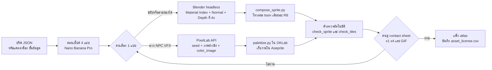

**เครื่องมือหลักและเงื่อนไข (ตรวจ 27 ก.ย. 2026)**

| เครื่องมือ | ใช้กับ | ความสามารถที่ใช้ | ข้อจำกัด | ราคา (USD) และสิทธิ์ | สถานะ |
| --- | --- | --- | --- | --- | --- |
| PixelLab API v2 + MCP | tileset อาคาร map object NPC ท่า NPC เก็บงาน | Wang tileset 16/32 px ได้ 16 ชิ้น (25 ชิ้นเมื่อ transition 1.0) พร้อม `pattern_4x4`, building kit ผนังสูง 1–3 ช่อง, `map-objects`, `reduce-colors`, skeleton-v3, SDK `pip install pixellab` | ถนน autotile ต้องเป็น 32 px, map object ที่สร้างผ่าน MCP ถูกลบใน 8 ชม., outline และ detail เป็นแค่คำแนะนำ | ฟรี 40 gen แล้ววันละ 5 (ภาพ ≤200 px มี API และ MCP แต่ไม่มีเครื่องมือแผนที่), Tier 1 $12/เดือน (รายปี $99) 2,000 gen ภาพ ≤320 px, Tier 2 $24/เดือน 5,000 gen ภาพ ≤512 px, object แบบ Pro ใช้ 20–40 gen ต่อครั้ง ผู้ใช้เป็นเจ้าของผลและขายได้ ห้ามนำผลไปเทรนโมเดล | **ใช้หลัก** |
| Retro Diffusion | ลายพื้นซ้ำ งาน painterly VFX ทางเลือก | `input_palette`, `tile_x/tile_y`, `rd_tile__tileset`, RD Pro รับภาพอ้างอิง 9 ภาพ, MCP 33 tool | ส่วนขยาย Aseprite ทำแอนิเมชันไม่ได้ ใช้โมเดลคนละตัวกับเว็บ และกำลังถูกแทนด้วยโปรแกรมใหม่ การ์ด GTX ต้องมี VRAM 6 GB + RAM 16 GB + ดิสก์ 20 GB (GTX 1660 SUPER ของเครื่องนี้ผ่านพอดี แต่ภาพ 64×64 ใช้ราว 2 นาที) ผู้ก่อตั้งยอมรับว่าคุมจำนวนสีไม่เป๊ะ | API: Pro $0.18, Plus ตั้งแต่ $0.025, Fast ตั้งแต่ $0.015 ต่อภาพตามขนาด tileset $0.10 (บัญชีใหม่มียอดฟรี ดูราคาก่อนสั่งด้วย check\_cost) ท่า $0.07–0.25 ส่วนขยาย $65 (Lite $20) จ่ายครั้งเดียว ผู้ใช้เป็นเจ้าของภาพ โมเดลของส่วนขยายเทรนจากงานที่ศิลปินยินยอม | สำรอง ใช้ทดสอบเทียบ |
| Nano Banana Pro | คอนเซ็ปต์ แผ่นหน้า/ข้าง/หลัง พอร์เทรต ไอคอน | รับภาพอ้างอิง 14 ภาพ คงหน้าคนได้ 5 คน | ห้ามใช้ผลเป็นพิกเซลในเกมตรงๆ Google อาจสร้างภาพคล้ายกันให้คนอื่น | API $0.134/ภาพ (1K–2K) batch $0.067 ไม่มีลายน้ำที่มองเห็นแต่มี SynthID ส่วน Nano Banana 2 ผ่าน API ราคา $0.101/ภาพ 2K ในแอป Gemini ใช้ฟรีแต่มีลายน้ำ Gemini ที่มองเห็น จึงใช้แค่คอนเซ็ปต์ Google AI Ultra ในไทยเริ่ม ฿3,500/เดือน ไม่อยู่ในงบเฟส 0 | **ใช้หลัก** |
| Blender 5.2 LTS | พรีเรนเดอร์สไปรต์ | `blender -b -P`, Cycles 1 sample, Workbench ปิด AA ได้ | API 5.x เปลี่ยนชื่อหลายจุด (ดูตารางค่าตั้ง) | ฟรี ดูแลถึง ก.ค. 2028 | **ใช้หลัก** |
| Aseprite | เก็บงาน แยกชั้น slice แพ็กงานวาดมือ | CLI `-b`, `--script`, `--script-param`, `--sheet`, `--data`, `--split-layers`, `--list-slices`, `--color-mode indexed`, `--palette` | 1 ใบอนุญาตต่อนักพัฒนา แจกไฟล์ที่คอมไพล์เองไม่ได้ | $19.99 (ร้านในไทยแสดง ฿369 + VAT = ฿394.83) จ่ายครั้งเดียว อัปเดตถึง v1.9 ใช้ทำงานขายได้ | **ต้องซื้อ** |
| Tiled 1.12 | แผนที่ | wangset แบบ corner, custom types, ส่งออกด้วย CLI | บน Linux ต้องใช้ Xvfb (Windows ไม่ต้อง) | ฟรี | **ใช้หลัก** |
| pixel-art-fixer | แปลงภาพที่แค่ดูเป็นพิกเซลกลับเป็นกริดจริง | หาขนาดกริด ย่อกลับ native ลดสี มีทั้ง Python และ Rust | – | MIT | ใช้ใน CI |
| free-tex-packer-core | แพ็กงาน RGBA | MaxRects, padding, หาเฟรมซ้ำ, exporter Phaser3/Pixi/Cocos2d | ใช้ Jimp จึงห้ามใช้กับ R8 จนกว่าจะพิสูจน์ว่าค่าไม่เปลี่ยน | MIT | ใช้ |
| PixelOver / Pixel Composer / TexturePacker | – | นำเข้า 3D แล้วหมุนหลายทิศ / VFX แบบโหนด / แพ็ก atlas | PixelOver ไม่มี CLI สายหลักต้องรันซ้ำด้วยสคริปต์ได้ | $19.99 / $15 / $49.99 | ยังไม่ซื้อ |

ราคาและโควตา PixelLab ตรวจจากหน้าราคาทางการเมื่อ 28 ก.ย. 2026 Tier 1 รายปี $99 (จ่ายรายเดือนรวม $144) และรายเดือนลดเมื่อต่ออายุต่อเนื่อง (12 → 10 → 9.5 → 9 USD) Tier 1 สร้างภาพได้ไม่เกิน 320×320 px แต่ map-objects รับได้ถึง 400 px ต้องทดสอบว่าภาพเกิน 320 px ต้องใช้ Tier 2 หรือไม่

**AI 3D และ MCP ของ Blender (ลดบทบาท)**

- AI 3D ใช้แค่ร่างเมชของพร็อพแปลก บอส และเครื่องตีเมือง ที่ 32 px รายละเอียดเมชแทบไม่เหลือ
- เงื่อนไขเดิมยังใช้: Hunyuan3D 2.1 ไม่ครอบคลุม EU, UK และเกาหลีใต้ และห้ามนำผลไปพัฒนาโมเดลอื่น ส่วน Tripo และ Meshy ห้ามใช้แพ็กฟรี (Tripo ฟรีห้ามใช้เชิงพาณิชย์ Meshy ฟรีเป็น CC BY 4.0) เฟส 0 ไม่จ่ายค่า AI 3D ถ้าเฟส 1 ต้องใช้ ให้จ่ายเดือนเดียวแบบที่ถูกสุด เช่น Meshy Starter $10
- ท่าคน retarget จาก Mixamo (ฟรี) หรือ Quaternius Universal Animation Library (Standard ฟรี Pro $9.99 ใช้ในเกมขายได้) ท่าม้าเริ่มจาก Quaternius Ultimate Animated Animal Pack (ฟรี มีม้าพร้อมท่าควบ) ถ้าไม่พอจึงซื้อชุดที่มีใบอนุญาตหรือจ้างคนทำ
- Blender MCP (ทางการและ ahujasid) ใช้สำรวจฉากเท่านั้น ต้องเปิด safe mode และรันในเครื่องที่ไม่มีข้อมูลสำคัญ ข้อ 10 เลือก PixiJS 8 ซึ่งไม่มี editor จึงไม่ต้องมี MCP ของเอนจิน

**โครงไฟล์ใน repo**

```text
art/style_bible.json    พาเลต ดัชนี ramp ขนาด เกณฑ์ตรวจ กฎรูปทรงเงา (แหล่งข้อมูลเดียว)
art/palette/            master.gpl, master.png, sprite_lut.png (256×N)
art/briefs/*.json       บรีฟต่อชิ้น
art/blender/            render_sprites.py, rigs/*.blend, clips/
art/raw/                ผลดิบจาก AI + request JSON (endpoint, seed, gen)
art/src/*.aseprite      ไฟล์เก็บงาน
art/maps/               *.tmx, *.tsx, game.tiled-project
tools/                  pl_client.py, palettize.py, compose_sprite.py,
                        check_sprite.py, check_tiles.py, pack_atlas.py, sheet.py
asset_license.csv
```

**พาเลตและดัชนีสี**

- ฉากใช้ `master` คือพาเลตหลัก 「漆畫64」 ในข้อ 2 ไฟหลักอยู่บน-หน้า เงาเป็น contact shadow ที่โคนผนังและใต้ชายคาตามข้อ 2 และ ramp เงาเข้มลง 1–2 ขั้น
- `palettize.py` จับคู่สีใน OKLab และเป็นตัวตัดสินสุดท้าย สีที่ถูกย้ายเกิน ΔE2000 8 จะติดธงให้คนดู
- ห้าม dither ตัวละคร ordered dither 2×2 หรือ 4×4 ใช้ได้เฉพาะผิวหยาบ (ดิน หิน กำแพงดินอัด) รอยต่อพื้นต่างชนิด หมอก และการจางตามข้อ 2 น้ำใช้วนสีแทน
- ภาพทุกชิ้นเก็บเป็นดัชนี 8 บิต 2 แบบตามตารางนี้ และใช้แถวพาเลตเวลาชุดเดียวกัน สีก๊ก สีย้อม และระดับของสลับด้วยแถว remap ต่อตัว (`sprite_lut.png` 256×N ตามข้อ 6.1)

| ภาพ | ผังดัชนี | ได้สีจาก |
| --- | --- | --- |
| ฉาก พร็อพ VFX NPC วาดมือ ไอคอน | ผังพาเลตโลกในข้อ 2 (1–64 พาเลตหลัก · 65–72 สีทีม · 73–76 ขนม้า · 77–92 วนสี · 93–108 สีร้อน VFX · 109–116 emissive · 117–255 ปลายทาง remap และ overlay) | แถวพาเลตเวลาของแผนที่ |
| สไปรต์จาก 3D | ดัชนีช่องวัสดุ = ช่อง × 4 + ขั้น (63 ช่อง) ตามข้อ 6.1 | แถว remap ต่อตัวแปลงเข้าผังพาเลตโลก แล้วใช้แถวพาเลตเวลาเดียวกัน |

วัดภาพอ้างอิงด้วย OKLab ได้พื้นหินและทรายเฉลี่ย L ≈0.70 และพิกเซลมืดสุดของตัวละครอยู่ราว L 0.25–0.31 จึงตั้งกติกาให้อ่านง่ายดังนี้

- แผนที่กลางวันมีพื้นเฉลี่ย L 0.62–0.78 และช่วง p5–p95 ไม่เกิน 0.20 แผนที่กลางคืนตั้งช่วงแยกใน style\_bible
- ตัวละครต้องมีเส้นขอบ L ≤0.30 และช่วงความสว่างกว้าง ≥0.45

**สคริปต์พรีเรนเดอร์ Blender (`art/blender/render_sprites.py`)** สั่งด้วย `blender -b art/blender/rigs/base_m.blend -P art/blender/render_sprites.py -- --part ARM_T3 --clips walk,atk_spear --dirs S,SE,E,NE,N --out build/exr/`

| ค่า | ค่าตั้งต้น | เหตุผล |
| --- | --- | --- |
| รุ่น | Blender 5.2 LTS ระบุไว้ในสคริปต์และ CI | API ของ 5.x ต่างจาก 4.x |
| กล้อง | ortho หมุนแกน X 60° (มองลง 30°) และอยู่นิ่งตลอด | กล้องที่ขยับทำให้กริดพิกเซลไม่ตรง |
| ทิศ | หมุนตัวละครรอบแกน Z ทวนเข็ม 0/45/90/135/180° = S/SE/E/NE/N | SW/W/NW ได้จาก mirror |
| ไฟ | ไฟหลักอยู่ในระนาบกล้อง (บน-หน้า) | mirror แล้วแสงยังถูก |
| สเกล (px/ม.) | `ppu = 16 ÷ cos30° ≈ 18.5` คงที่ทุกโมเดล และ `ortho_scale = ขนาดเฟรม ÷ ppu` | ความสูงตั้ง 1 ม. = 16 px ตรงกริดโลก (ข้อ 6.1) โมเดลคนสูง 2.0 ม. จึงได้ 32 px ทหาร 1.75 ม. ได้ 28 px เฟรม 64 px ใช้ 3.46 ม. |
| จุดยึด (px) | shift กล้องให้เท้าตกที่ (32,56) ตรวจด้วยหมุด 1 px | pivot คงที่ทุกทิศทุกเฟรม |
| ความละเอียด (px) | 4 เท่าของเฟรม (64 → 256) | เผื่อโหวตย่อ |
| เอนจิน | Cycles 1 sample, pixel filter Box กว้าง 1 px, seed คงที่ | แต่ละพิกเซลได้ค่าเดียว ไม่ผสมรหัสวัสดุ |
| pass | Material Index, Normal, Depth และ Alpha ลง EXR multilayer | ใน 5.x ชื่อ 'Material Index' และ 'Depth' (เดิมคือ 'IndexMA' และ 'Z') |
| สี | `view_transform='Standard'`, `dither_intensity=0`, `film_transparent=True` | AgX เป็นค่าเริ่มต้นตั้งแต่ 4.0 และ dither มีค่าเริ่มต้น 1.0 |
| API ที่เปลี่ยน | engine `BLENDER_EEVEE` (ไม่มี `_NEXT`) และ compositor ใช้ `scene.compositing_node_group` แทน `scene.node_tree` | สคริปต์จาก 4.x จะพัง |
| ทางสำรอง | Workbench สีตามวัสดุ แสง Flat ตั้ง `scene.display.render_aa='OFF'` เพื่อทำรหัสวัสดุ | ใช้เมื่อ Cycles ช้าเกินงบ |

Dead Cells ใช้วิธีเดียวกัน คือเรนเดอร์ขนาดเล็กไม่มี AA ใช้ cel shading และทำ normal map ทุกเฟรม การนำชิ้นโมเดลเดิมมาใช้กับตัวใหม่ช่วยประหยัดงานหลายร้อยชั่วโมง ส่วนการแก้จังหวะท่าทำได้แค่ขยับคีย์ แต่ทีมยอมรับว่ายังมีพิกเซลกะพริบและรายละเอียดน้อย

**ขั้นประกอบ (`tools/compose_sprite.py`, numpy)**

1. โหวตย่อจาก 4× เป็น 1× ทีละบล็อก 4×4 โดยเลือกค่าที่พบมากสุด ชิ้นที่ติดธง `thin` (ด้ามทวน สายธนู) ชนะเมื่อครอบ ≥3/16 ของบล็อก
2. แบ่ง N·L เป็น 3 โทน (เกณฑ์ 0.55 / 0.10) แล้วได้ `ดัชนี = LUT[mat][โทน]`
3. ใส่เส้นขอบ 1 px ด้านในด้วยโทน "ขอบ" ของวัสดุนั้น ตัวละครจึงไม่โตขึ้น เส้นภายในใส่ตรงรอยต่อวัสดุที่ความลึกกระโดดเกินเกณฑ์
4. ลบพิกเซลกำพร้าที่ไม่มีสีเดียวกันใน 4 ทิศ แล้วแทนด้วยสีส่วนใหญ่ใน 8 ทิศ
5. แยกชั้นโดยเทียบ Depth ของชิ้นกับร่างอ้างอิง (ร่างฐาน + เกราะหนาสุด) จะได้ส่วนหน้าและส่วนหลัง ลำดับชั้นต่อทิศต่อเฟรมเขียนลง JSON แบบ COF
6. ส่งออก PNG เทา 8 บิต (R8) ที่ไม่มี chunk สี คู่กับ JSON (pivot, event เฟรมโดน, ลำดับชั้น, ป้าย `asym` และ `no_mirror`) และ normal map สำรอง
7. ทำ contact sheet ×4 และ GIF ×1/×4 ให้ Claude อ่านคัดรอบแรกก่อนส่งถึงคน

กันพิกเซลกะพริบ (Dead Cells เองก็แก้ไม่หมด)

- ไม่ใส่ root motion ตอนเรนเดอร์ ตัวละครจึงอยู่ที่จุดเดิมเสมอ
- คีย์ท่าแบบ stepped ตาม fps เป้า ยืนและเดิน 10–12 fps ส่วนตีและสกิล 16–24 fps
- ทำโมเดล pixel-proxy ที่ขยายแขนขาให้กว้าง ≥3 px และด้ามอาวุธ ≥2 px ที่สเกล 32 px
- `check_sprite.py` มีตัววัด blink ตามเกณฑ์รับงาน

กติกาไฟล์ R8

- ชีตต่อคลิปแพ็กด้วย Aseprite CLI แบบ indexed ตามข้อ 6.1 (`--inner-padding 1 --shape-padding 1`) แล้ว `pack_atlas.py` (MaxRects ที่ Claude เขียนเอง) รวมเป็นหน้า atlas และแปลงเป็นไฟล์ `.idx` ตามข้อ 10 ห้าม premultiply และห้ามลดสี แล้วเทียบค่าทุกพิกเซลกับต้นฉบับ
- แยก atlas ตามกลุ่มท่า ตั้งชื่อ `{ชิ้น}_{ระดับ}__{กลุ่มท่า}.png` + `.json` เช่น `ARM_T3__walk.png`
- ตอนโหลด ตั้ง `UNPACK_COLORSPACE_CONVERSION_WEBGL` เป็น NONE และไม่ premultiply แล้ว sample แบบ nearest เสมอ ค่าดัชนีห้ามผ่าน filter ใดๆ

**สูตรสั่ง PixelLab** งานผลิตสั่งผ่าน `tools/pl_client.py` ที่ใช้ SDK `pixellab` เพื่อบันทึก endpoint, seed และ gen ทุกครั้ง MCP ใช้แค่ตอนสำรวจ ติดตั้งด้วย `claude mcp add pixellab https://api.pixellab.ai/mcp -t http -H "Authorization: Bearer $PIXELLAB_TOKEN"` token เก็บใน env และห้ามเข้า repo ก่อนเขียน client ให้ Claude อ่าน `https://api.pixellab.ai/v2/llms.txt`

| งาน | endpoint | ค่าตั้งต้น | หมายเหตุ |
| --- | --- | --- | --- |
| tileset พื้น | `create-tileset` | tile 16, view `high top-down`, shading basic, `color_image` = master.png, ภาพอ้างอิงเป็น tile ที่ผ่านแล้ว, ลอง 3 seed | Claude แปลง `pattern_4x4` เป็น wangset แบบ corner ใน `.tsx` |
| ชุดอาคาร | `create-tiles-pro` + `tile_feature: building` | `square_topdown`, `building_layout: materials`, ผนังสูง 1–3 ช่อง | ต้องทดสอบว่าได้ tile 16 px หรือไม่ |
| อาคารเดี่ยว น้ำพุ ต้นไม้ | `map-objects` | view `high top-down`, `init_image` = โครงก้อนมวลที่ Claude วาด, `background_image` = ลานเมือง, `color_image` | ด้านละ 32–400 px และพื้นที่ ≤160,000 px |
| แปลงคอนเซ็ปต์ | `image-to-pixelart` | ขนาดออก 1/4 ของขนาดเข้า, `fixer=true`, `init_image_strength` 100–300 | เกิน 300 แทบไม่แปลงภาพ |
| NPC สัตว์เล็ก | `create-character-v3` | view `low top-down`, template `mannequin`/`dog`/`cat`/`horse`, เฟรม 48 px | ใช้ 1–2 gen ต่อตัว เก็บทิศ S, E, N แล้ว mirror E เป็น W |
| ท่า NPC | `characters/animations` | mode `template` (1 gen/ทิศ) หรือ `skeleton-v3` (2–4 gen/ทิศ ต้องมี Tier 1) | skeleton-v3 นิ่งกว่าเพราะขยับตัวละครแทนการวาดใหม่ |
| ดูดพาเลตรวม | `reduce-colors` | `palette_image` = master, dithering none | ส่งทุกเฟรมทุกทิศในครั้งเดียว รวมไม่เกิน 512×512 px |
| เก็บงาน | `correct-pixelart`, `unzoom` | strength 0.1 | `unzoom` ต้องได้ภาพ ≥256 px และคืนภาพทึบบนพื้นขาว |

ห้ามย่อภาพพิกเซล ถ้า NPC ไม่สูงตามเป้า ให้สร้างใหม่ในเฟรมที่ใหญ่ขึ้นแล้วเลือกผลที่พอดี ภาพ RAVENA ที่ผู้ใช้แนบมาเป็นแค่แนวสไตล์ ห้ามส่งเข้า AI เป็นภาพอ้างอิง

**ขั้นตอนต่อประเภทงาน**

- **tileset:** บรีฟ → `create-tileset` 3 seed → palettize → Claude ประกอบแผนที่สุ่ม 24×24 ช่องตามกฎมุม → คนดูที่ ×2 → แก้ใน Aseprite ไม่เกิน 10 นาทีต่อชุด เติม tile แปรผัน 3–4 ชิ้นต่อพื้นเรียบ → `.tsx`
- **blob 47 ชิ้น:** ใช้กับชุดที่ทาสีทีละช่อง เช่น รั้ว พุ่มไม้ ขอบหลังคา วาดแม่แบบ quarter-tile 8×8 แล้วให้สคริปต์ Aseprite ประกอบ
- **อาคาร:** คอนเซ็ปต์หน้าตรง 3/4 จาก Nano Banana Pro 4 แบบ → คนเลือก → Claude วาดโครงก้อนมวลที่ขนาด native (ฐานเป็นจำนวนเต็มช่อง ผนังเมือง 48–64 px) → `map-objects` หรือ `image-to-pixelart` → `reduce-colors` → Aseprite แยกชั้นและทำ slice collision/door → object ใน Tiled
- **ตัวละคร อุปกรณ์ ม้า:** แผ่นหน้า/ข้าง/หลังจาก Nano Banana Pro → ตัวสร้างพาราเมตริกหรือโมเดล chibi สัดส่วน 1:2.5 → โครงร่วม + retarget คลิปที่มีใบอนุญาต → เรนเดอร์ 5 ทิศ → ประกอบ → ตรวจ
- **ทหารและร่างสงคราม:** เรนเดอร์ร่าง เกราะตัวแทน และอาวุธรวมเป็นชั้นเดียวต่อ อาชีพ × ตระกูลอาวุธ × ระดับ ส่วนสีก๊กสลับด้วย LUT
- **พอร์เทรต:** Nano Banana Pro 2K แนววาดกึ่งเหมือนจริง แนบภาพอ้างอิงแยกบทบาท (สไตล์ ≤3 ตัวละคร ≤5 วัตถุ ≤6 รวม ≤14) คือพอร์เทรตต้นแบบ การ์ดพาเลต สไปรต์ขยาย ×8 เรนเดอร์ครึ่งตัวจาก Blender และภาพชุดฮั่นสาธารณสมบัติ ห้ามแนบภาพจากเกมอื่น สร้าง 4 แบบให้คนเลือก → แก้ทีละเรื่อง → เกลามือใน Krita → ครอปจากต้นฉบับ 3:4 (พื้นกระดาษเป็นส่วนของภาพ ไม่ต้องตัดพื้น) → WebP ตามข้อ 2.2

**เกณฑ์รับงาน (ตรวจอัตโนมัติก่อน แล้วคนตรวจรอบสุดท้าย)**

| ประเภท | ตรวจอัตโนมัติ | ตาคน |
| --- | --- | --- |
| tileset 16 px | ใช้แค่สีใน master, ขนาด 16×16 ตรงกริด 1:1, รอยต่อไม่ตรง 0 px, L พื้นตามกติกา | แผนที่สุ่ม 24×24 ช่องที่ ×2 ไม่เห็นลายซ้ำ |
| อาคาร กำแพง น้ำพุ | ฐานเป็นพหุคูณ 16 px, หลังคาแยกอยู่ชั้น overhead, เส้นหนาไม่เกิน 1 px, slice collision และ door ครบ | ทิศแสงตรงกันทั้งเมือง, ตัวละคร 32 px ยืนหน้าประตูแล้วดูเข้าได้, ประตูและหน้าต่างมืด (L ≤0.35) |
| ร่างฐาน | สูง 32±1 px (ทิศ S ท่ายืนเฟรม 0), pivot (32,56) ทุกทิศทุกเฟรม, ≤24 ดัชนีต่อเฟรม, พิกเซลกำพร้า 0, blink 0 (พิกเซลที่สลับ A→B→A ใน 3 เฟรมติดกันในส่วนที่ไม่ขยับ), ท่ายืนเปลี่ยนไม่เกิน 10% ของพิกเซลทึบต่อเฟรม | ดูเงาดำ 32 px ที่ ×1 แล้วคน 3 คนบอกอาชีพถูกภายใน 3 วิ |
| ชั้นอุปกรณ์ | ซ้อนบนร่างทุกเฟรมแล้วไม่มีรูโปร่ง, ไม่มีชั้นทับหน้ายกเว้นหมวก, ตราและอักษรอยู่ชั้น `no_mirror` | สลับ LUT 3 ก๊กแล้วอ่านออก, ระดับของต่างกันที่รูปทรง ไม่ใช่แค่สี |
| อาวุธ | ยาวตามตารางขนาดในข้อ 2 และหนา ≥2 px, พิกเซลอาวุธต่อเฟรม ≥70% ของค่ามัธยฐานในคลิป | ติดป้าย `asym` ถูกชิ้น |
| ม้า + ผู้ขี่ | ม้ายาว 44±2 px (ทิศ E), รวมผู้ขี่สูง 50–52 px ในเฟรม 96×80, ไม่มีช่องว่างระหว่างอานกับผู้ขี่ | ท่าวิ่ง 6–8 เฟรมที่ 12–16 fps ดูมีน้ำหนัก |
| ทหาร | สูง 28 px ในเฟรม 48×48 และเป็นชั้นเดียว | แยกก๊กออกในกลุ่ม 40 ตัว |
| NPC จาก AI | ผ่านกติกาพาเลตและเส้นขอบเดียวกับสไปรต์ 3D และไม่ถูกย่อภาพ | ยืนข้างสไปรต์ 3D แล้วดูเข้ากัน |
| VFX | ชั้นหลักมี alpha แค่ 0/255, glow additive แยกชั้น, ใช้ดัชนีสีร้อน 93–108 ตามผังข้อ 2, เฟรมโดนตรง event | ในศึกจำลอง 60 ตัวยังบอกประเภทดาเมจได้ |
| พอร์เทรต | ไม่มีลายน้ำที่มองเห็นและไม่มีตัวอักษร | แนววาดกึ่งเหมือนจริงเข้าชุดกับพอร์เทรตต้นแบบ, เงาหัว ผม เครา ของประจำตัว และตระกูลเกราะตรงกับสไปรต์, คอเสื้อ 右衽 (สาบซ้ายทับขวา), ไม่คล้าย Koei, Total War, RO และ RAVENA |
| ลิขสิทธิ์และชั้นข้อมูล | `asset_license.csv` มีแถวครบทุกคอลัมน์ | ป้ายประวัติศาสตร์/นิยาย/ตำนาน/แต่งใหม่ตรงกับแคตตาล็อกข้อ 2 |

**สิ่งที่ AI ยังพลาด และวิธีคุม**

| ปัญหา | หลักฐาน | วิธีคุม |
| --- | --- | --- |
| ตัวตนและสีไหลข้ามเฟรมและทิศ | PixelLab ทำ `reduce-colors` มาแก้พาเลตที่เพี้ยนไปทีละเฟรม และบอกว่า skeleton-v3 นิ่งกว่าเพราะไม่วาดใหม่ | ส่งทุกเฟรมเข้า `reduce-colors` ครั้งเดียว แล้ว palettize และวัด blink |
| คุมจำนวนสีไม่เป๊ะ | ผู้ก่อตั้ง RD ยอมรับเอง | palettize ทุกชิ้นโดยไม่มีข้อยกเว้น |
| ทิศหลังและข้างถูกเดา มือที่ถือของ ตรา และลายไม่สมมาตรสลับหรือหาย | โมเดลหมุนจากภาพหันใต้ภาพเดียว | ตัวละครหลักทำจาก 3D ส่วน AI ใช้กับ NPC และต้องตรวจ contact sheet |
| คุณภาพตกที่ขนาดเล็ก | รีวิวจากการใช้งานจริงพบว่าขนาดใหญ่ดีกว่าชัด | ตัวละคร 32 px ไม่พึ่ง AI 2D |
| outline และ detail เป็นแค่คำแนะนำ ภาพอ้างอิงที่ถูกขยายทำให้โมเดลสับสน | เอกสาร PixelLab | ใช้ `unzoom` หรือ pixel-art-fixer ก่อนส่ง |
| มุมหลังคา ความสูงผนัง และประตูไม่ลงกริดเดียวกันทุกอาคาร | – | ใช้โครงก้อนมวลเป็น `init_image` และตรวจกริด |
| สไตล์ไหลเมื่อทำ 50 ชิ้น | – | แนบชิ้นที่ผ่านแล้วเป็นภาพอ้างอิงทุกครั้ง และเก็บ seed |
| 3D → พิกเซล: กะพริบ รายละเอียดน้อย ชิ้นบางหาย | Dead Cells ยอมรับว่ายังมีพิกเซลกะพริบ | โหวตย่อ + pixel-proxy + ตัววัด blink |
| ท่าสัตว์สี่ขา ความสวย จังหวะ hit-stop | – | ใช้ชุดท่าม้าที่มีใบอนุญาต + ตาคน |

**ค่าใช้จ่าย**

| รายการ | ราคา (USD) | รอบจ่าย | ใช้เมื่อ |
| --- | --- | --- | --- |
| Aseprite | 19.99 (ในไทย ฿394.83 รวม VAT) | ครั้งเดียว | ต้องซื้อ |
| PixelLab Tier 1 | 12 | ต่อเดือน | เฟส 0 เป็นต้นไป ใช้แพ็กฟรีตอนเขียน pl\_client.py แล้วจ่ายรายเดือนตอนทำฉากทดสอบ ไม่จ่ายรายปี |
| PixelLab Tier 2 | 24 | ต่อเดือน | เฉพาะเดือนที่ผลิตฉากหนัก |
| เครดิต RD API | 5–10 | เติมครั้งเดียว | ทดสอบเทียบ หลังใช้ยอดฟรีของบัญชีใหม่หมด |
| ส่วนขยาย RD Lite / Full | 20 / 65 | ครั้งเดียว | ไม่ซื้อในเฟส 0: GTX 1660 SUPER ผ่านขั้นต่ำพอดีแต่ภาพ 64×64 ใช้ราว 2 นาที และส่วนขยายกำลังถูกแทนด้วยโปรแกรมใหม่ |
| Pixel Composer | 15 | ครั้งเดียว | ถ้า VFX จากการวาดมือไม่พอ |
| Nano Banana Pro | 0 (Nano Banana 2 ในแอป Gemini มีลายน้ำ ใช้แค่คอนเซ็ปต์) หรือ 0.034–0.134/ภาพผ่าน API (Ultra ไม่อยู่ในงบ) | – | แอปฟรีใช้เลือกแนวและคอนเซ็ปต์ (มีลายน้ำ) ภาพที่เข้าเกมสร้างผ่าน API |
| Blender, Tiled, pixel-art-fixer, free-tex-packer-core | 0 | – | ใช้ |

เฟส 0 มีงบ 100 USD วางแผนใช้ราว $42 (Aseprite, PixelLab Tier 1 หนึ่งเดือน, ภาพพอร์เทรตผ่าน API, เครดิต RD และค่าธรรมเนียม) ที่เหลือเป็นเงินสำรองตามหัวข้องบเฟส 0 หลังจากนั้นราว $12–24 ต่อเดือน ฉากทดสอบเฟส 0 มี tileset 3 ชุด วัตถุและอาคาร 15 ชิ้นทำ 2 รอบ และ NPC 3 ตัว น่าจะอยู่ในโควตา 2,000 gen ของ Tier 1 เดือนเดียว เอกสารไม่ได้บอกค่า gen ของ `create-tileset` และ `map-objects` จึงให้ `pl_client.py` เรียก `GET /balance` ก่อนและหลังทุกครั้งแล้วบันทึก

**บันทึกลิขสิทธิ์ (`asset_license.csv`)** เก็บทีละชิ้น ได้แก่ รหัสชิ้น, เครื่องมือ, endpoint หรือโมเดล, แพ็กเกจที่จ่ายตอนสร้าง, วันที่, seed, prompt, ภาพอ้างอิงพร้อมสิทธิ์ของภาพนั้น, gen ที่ใช้, ไฟล์ก่อนและหลังแก้, ผู้ตรวจ

- เก็บไฟล์ก่อนและหลังแก้ไว้ใน repo เพราะ US Copyright Office คุ้มครองส่วนที่คนแก้ เลือก และจัดวาง แต่ผลจาก prompt อย่างเดียวคุ้มครองอ่อน
- ห้ามนำผลจาก PixelLab, Nano Banana Pro, Hunyuan3D หรือ Mixamo ไปเทรน LoRA ถ้าจะเทรนให้ใช้ภาพที่เราถือสิทธิ์เองเท่านั้น
- ข้อตกลง PixelLab เขียนว่า API มีไว้สำหรับ "vibe coding และสร้างของสดในเกม" จึงต้องอีเมลยืนยันก่อนผลิตจำนวนมาก
- ภาพหลักของแบรนด์ เช่น โลโก้และขุนพลหลัก ต้องมีคนวาดทับหรือแก้เอง เพราะ Google อาจสร้างภาพคล้ายกันให้คนอื่น
- ถ้าลง Steam ต้องเปิดเผยว่ามีเนื้อหา AI แบบสร้างล่วงหน้าที่ผู้เล่นเห็น
- ชิ้นที่มาจากแพ็กฟรีของ Tripo หรือ Meshy ห้ามเข้าเกม และต้องไม่คล้าย Koei, Ragnarok/Gravity หรือภาพ RAVENA

**ทดสอบในเฟส 0 (ต้องผ่านก่อนผลิตจำนวนมาก)**

- ฉาก 「ขุนศึก 1 ชุด 5 ทิศ ยืนหน้าอาคารเมืองทดสอบ + ทหาร 40 ตัว」 บนคอมเครื่องนี้ก่อน (Chrome จำลอง 820×360 DPR 2) แล้วยืนยันบน Redmi 14C ที่ ×2
- ให้ PixelLab กับ RD ทำโจทย์เดียวกัน 3 ชิ้น (tileset, อาคาร, NPC) แล้วตัดสินด้วยต้นทุนต่อชิ้นที่ผ่าน
- เทียบการเรนเดอร์ 1× กับ 4× แล้วโหวตย่อ โดยดูตัววัด blink และจำนวนพิกเซลอาวุธ
- วาง NPC มุม `low top-down` และ `high top-down` ข้างสไปรต์ 30° แล้วเลือกมุมที่เข้ากัน
- จับเวลาเรนเดอร์ต่อเฟรม แล้วคูณจำนวนเฟรมทั้งหมด (\~129 คลิปต่อเพศ × 5 ทิศ × ทุกชิ้นอุปกรณ์)
- ส่ง R8 ผ่านแพ็กเกอร์แล้วโหลดบน PixiJS 8 (ข้อ 10) ทั้งแบบ `.idx` และทางสำรอง PNG เทา ค่าดัชนีต้องตรง 100%

**เวลาที่ต้องใช้ตาคน** ราววันละ 1 ชม. เท่าเดิม

- เลือกคอนเซ็ปต์และตรวจว่าไม่คล้ายผลงานของคนอื่น
- ดู contact sheet ×1/×2/×4 ว่าเป็นตัวเดียวกันทุกทิศ
- ดู GIF ที่ความเร็วจริงบนมือถือ เพื่อตรวจน้ำหนักท่าและพิกเซลกะพริบ
- ดูฉากเต็มจอบน Redmi 14C ว่าตัวละครเด่นจากพื้น ขนาดคนเข้ากับประตู และหลังคาจางถูกต้อง
- ทดสอบเงาดำ 32 px (3 คน ภายใน 3 วิ)
- สลับ LUT 3 ก๊กและจำลองตาบอดสี
- ดู VFX ในศึกจำลอง 60 ตัว และดูพอร์เทรตคู่กับสไปรต์
- ถือเครื่องราคา 3,000–5,000 บาทเล่น 20 นาทีทุกสัปดาห์

แหล่งอ้างอิง: [PixelLab API v2 (OpenAPI)](https://api.pixellab.ai/v2/openapi.json) · [PixelLab MCP](https://www.pixellab.ai/mcp) · [PixelLab Terms of Service](https://www.pixellab.ai/termsofservice) · [Retro Diffusion API examples](https://github.com/Retro-Diffusion/api-examples) · [Retro Diffusion Aseprite extension](https://astropulse.itch.io/retrodiffusion) · [Gemini API pricing](https://ai.google.dev/gemini-api/docs/pricing) · [Aseprite CLI](https://www.aseprite.org/docs/cli/) · [Tiled CLI export options (Tiled Forum)](https://discourse.mapeditor.org/t/can-i-export-maps-with-embedded-tilesets-from-the-command-line/4227) · [Blender 5.0 Python API changes](https://developer.blender.org/docs/release_notes/5.0/python_api/) · [Dead Cells 3D pipeline (Game Developer)](https://www.gamedeveloper.com/production/art-design-deep-dive-using-a-3d-pipeline-for-2d-animation-in-i-dead-cells-i-)

## 2.2 การออกแบบ UI

UI ใช้ **สองสเกล**: โลกเป็นพิกเซลที่ขยายด้วยจำนวนเต็ม s ตามข้อ 2 ส่วนกรอบ ข้อความ และพอร์เทรตเป็นภาพ HD ที่ความละเอียดจริงของจอ UI ยังออกแบบบนจอแนวนอน 1280×720 แบบ Fit Height โครงหน้าจอยืมจากภาพอ้างอิง คือแผงรักดำโปร่งขอบทอง (ผู้ใช้เลือกแทนกรมท่าของภาพอ้างอิง) การ์ดตัวละครซ้ายบน มินิแมพกรอบทองขวาบน และไอคอนพิกเซล สีและลวดลายยังใช้ภาษาภาพ **「漆·銅·簡」 เครื่องรัก สำริด และซีกไม้ไผ่** เดิม ปุ่มต่อสู้ยังเป็นโค้งรอบปุ่ม A แบบ RoV แผงและเมนูที่มีข้อความไทยเป็น DOM วางทับ canvas ส่วน HUD ต่อสู้และป้ายในโลกวาดในเอนจิน ทุกตัวเลขเป็นค่าทดสอบ เก็บใน `ui/tokens/*.tokens.json` และ Google Sheets

**หน่วยและการรองรับจอ**

- ตัวเลขทุกตัวเป็น "px ออกแบบ" (design px) บนจอ 1280×720 แบบ Fit Height ยกเว้นที่เขียนว่า native ซึ่งเป็น px ของโลกพิกเซล
- u คือ px จริงต่อ 1 design px เท่ากับ H ÷ 720
- จอที่แคบกว่า 16:9 เช่น iPad 4:3 ใช้ Fit Width (1280×960) และ u = W ÷ 1280 เพราะ Fit Height เหลือกว้าง 960 แล้วปุ่มทัพตกเข้าโซนจอยสติ๊ก
- W และ H เป็น px จริงของ canvas อ่านจาก `devicePixelContentBoxSize` ของ ResizeObserver
- Safari บน iOS และ macOS ยังไม่มีค่านี้ จึงใช้ `round(contentRect × devicePixelRatio)` แทน DPR ของ iPhone เป็นจำนวนเต็ม ค่าจึงตรง
- UI ไม่ผูกกับ s ของโลก ถ้าผูก จอสูง 1290 px (s = 4) จะได้ UI สูง 1,440 px ล้นจอ แนวเดียวกับ Stardew Valley ที่แยก Zoom 75–200% ออกจาก UI Scale 75–150%
- บนจอสูง 720, 1080 และ 1440 px ได้ u = s ÷ 2 พอดี พิกเซลโลก 1 px จึงเท่ากับ 2 design px และระยะห่างฐาน 4 design px เท่ากับ 2 px native
- พื้นที่แตะต้อง ≥88 design px และห่างกัน ≥12 บน iPhone 14 แนวนอน (สูง 390 pt) ได้ ≈48 pt บน Android จอสูง 360 CSS px ได้ 44 CSS px เท่าเกณฑ์ WCAG 2.5.5 ระดับ AAA
- เบราว์เซอร์ในแอป (LINE, Facebook, TikTok) มีแถบบนกินความสูง บน Redmi 14C เหลือราว 608 px จึงได้ u ≈ 0.84
- ที่ u ≈ 0.84 พื้นที่แตะ 88 เหลือ ≈37 CSS px ยังเกินขั้นต่ำ Apple 28 pt และ WCAG 2.5.8 ที่ 24 CSS px
- safe area: DOM ใช้ `env(safe-area-inset-*)` ซึ่งต้องตั้ง `viewport-fit=cover` เอนจินอ่านค่าเดียวกันจาก element ตรวจค่าที่ซ่อนไว้
- ค่าอ้างอิง: iPhone 14 แนวนอนมี inset ซ้ายขวา 47 pt ล่าง 21 pt ส่วน 14 Pro Max ซ้ายขวา 59 pt

### สิ่งที่เอามาจากภาพอ้างอิง

ภาพอ้างอิงใช้ดูสไตล์เท่านั้น เราเอาโครงหน้าจอกับหลักสองสเกลมา แต่ไม่เอาสี ข้อความ ตรา หรือกริดปุ่ม

| ในภาพอ้างอิง | สิ่งที่เห็น | เกมเรา |
| --- | --- | --- |
| การ์ดตัวละครซ้ายบน | แผงน้ำเงินไล่สี ขอบทองบาง มุมมน พอร์เทรตอนิเมะ ชื่อ ป้าย Lv แถบ HP/SP ลายเส้นจาง | การ์ดนาม 名刺 400×104 แผงรักดำ พอร์เทรตแนววาดกึ่งเหมือนจริงแทนหน้าอนิเมะ แตะแล้วขยายเป็น 謁 |
| แคปซูลสถานะขวาบน | เวลา สัญญาณ FPS ปิง จำนวนคน บนแคปซูลมืดโปร่ง | เวลา ขีดสัญญาณจากปิงจริง เซิร์ฟและช่อง FPS แสดงเมื่อเปิดในตั้งค่า |
| ไอคอนเมนู 4 อัน | รูปขาวแนวพิกเซล มีเงา ป้ายไทยขาวขอบดำ ไม่มีพื้นรอง | ไอคอนพิกเซลขาว 24 native ขอบหมึก 1 px จุดชาด 1 จุด ป้าย Kanit ขอบหมึก |
| มินิแมพกรอบทอง | ภาพย่อแผนที่จริง ป้ายชื่อเมืองในกรอบ | 152×152 กรอบกระจกสำริดลาย TLV ป้ายชื่อเมืองในกรอบล่าง |
| จอยสติ๊กลอยและปุ่ม "เดิน" | วงขาวโปร่ง | จอยสติ๊กลอยตามเดิม ตัดปุ่มเดินออก เพราะระยะลากบอกเดินหรือวิ่งอยู่แล้ว |
| แถบแชทล่างกลาง | "แตะเพื่อพิมพ์แชต" | ย้ายขึ้นบนถัดจากการ์ดนาม เพราะแถวล่างเต็มด้วยโซนจอยและกลุ่มปุ่มต่อสู้ |
| สกิล 10 ช่อง 2×5 ป้าย AUTO ทุกช่อง ปุ่ม Attack สี่เหลี่ยม | ไอคอนพิกเซลในกรอบทองสี่เหลี่ยม | สกิล 4 + ขั้นสุดบนโค้ง ปุ่มกลมทรงกระเบื้องหน้าชายคา ป้าย ↻ เฉพาะโหมดที่ออโต้ได้ |
| ป้าย NPC และชื่อใต้เท้า | กล่องมืดมุมมน ชื่อขาวใต้ตัว | ใช้แบบเดียวกันในชั้น L1 |
| ยาอัตโนมัติและตัวนับยา | "Auto Potion ON" และเลขจำนวนยา | ปุ่มยาด่วนมีเลขจำนวน และป้าย ↻ เมื่อเปิดยาอัตโนมัติ |

- ห้ามลอก: สีน้ำเงินของการ์ด คำว่า "Adventurer's Card" ตราเพชรทองมุมการ์ด ลายมังกร ชื่อชั้นแบบ Base/Job Lv กริด AUTO 2×5 และพอร์เทรตหน้าอนิเมะ
- ปุ่มสี่เหลี่ยมใช้บนโค้งเดิมไม่ได้ สคริปต์ตรวจพบพื้นที่แตะชนกัน 4 คู่ สกิล 2 กับ 3 ซ้อนกัน 12 และ A กับสลับเป้าห่างแค่ 1
- Fantasy Online 2 ที่เป็น MMO พิกเซลบนเว็บและ Android ก็ทำปุ่มสกิลบนมือถือแค่ช่อง 1–3 แทนการยก hotbar ทั้งแถวมา

### ชั้นการวาด

โลก ป้ายในโลก และ HUD ต่อสู้อยู่ในเอนจินบน WebGL context เดียว ส่วนแผง เมนู แชท และ modal เป็น DOM

| ชั้น | ความละเอียด | อยู่ที่ | ของในชั้น |
| --- | --- | --- | --- |
| L0 โลก | render target native × s | เอนจิน | ฉาก สไปรต์ VFX วงเล็งและวงเตือนบนพื้น วงใต้เท้า |
| L1 ของที่ยึดกับโลก | px จริง ใช้ transform เดียวกับตอน blit โลก รวมเศษ subpixel × s แล้วปัดเป็น px จริง | เอนจิน | ชื่อ ป้าย NPC แถบเลือด ป้ายสถานะ ตัวเลขดาเมจ ไอคอนท่าทีกอง |
| L2 HUD ต่อสู้ | px จริง × u | เอนจิน | จอย ปุ่ม A สกิล ขั้นสุด หลบ สลับเป้า บริบท ทัพ วงล้อ ม้า ยาด่วน ออโต้ ตัวนับคอมโบ กรอบเป้า มินิแมพ แถบศึก |
| L3 แผงและเมนู | CSS px (1 design px = u ÷ DPR CSS px) | DOM | การ์ดนาม บัฟ ขุนพลติดตาม เควส แคปซูลสถานะ แถวเมนู แชท แผงเต็มจอ tooltip |
| L4 modal และ toast | CSS px | DOM | ยืนยัน รางวัล ประกาศ คำสั่งแม่ทัพ ข่าวสังหาร จอรอเกิด |

**กติกาสองสเกล**

- ของพิกเซลใน L1 ขยายด้วย s ของขั้นปกติเสมอ แม้อยู่ในมุมแม่ทัพ ตัวเลขและป้ายจึงไม่หดตามโลก
- ป้ายใน L1 ไม่สั่นเทียบกับตัวละคร เพราะใช้เศษ subpixel ชุดเดียวกับโลก
- ของพิกเซลใน L2 และ L3 ใช้ k = max(1, floor(ช่องด้านใน × u ÷ ขนาด native)) แล้ววางกลางช่อง ห้ามขยายแบบเศษส่วน
- ขนาด native ของไอคอนเลือกให้ได้ k ≥ 2 ตั้งแต่ u = 0.84 ขึ้นไป เบราว์เซอร์ในแอปบนจอ 720p จึงยังได้ไอคอนเม็ดละ 2 px
- ใน DOM ไอคอนพิกเซลใส่ `image-rendering: pixelated` ค่านี้ขยายแบบ nearest ถึงเท่าเต็มก่อน แล้วเกลี่ยเฉพาะเศษ จึงกันพังเมื่อ DPR เป็นเศษ
- กรอบแผงและข้อความเป็น HD เสมอ ไอคอนเป็นพิกเซลเสมอ ห้ามทำกรอบแผงเป็นพิกเซล
- จอสั่นกระทบแค่ L0 และ L1 HUD ไม่สั่น

### แบ่งงานเอนจินกับ DOM

ของที่ขยับทุกเฟรมและต้องรับแตะไวที่สุดอยู่ในเอนจิน ส่วนของที่มีข้อความไทยหลายบรรทัดเป็น DOM ด้วย Preact (≈3 kB) และ `@preact/signals`

**เหตุผลที่แผงเป็น DOM**

1. **ตัดคำไทย:** เบราว์เซอร์ตัดบรรทัดไทยด้วยพจนานุกรมเอง W3C ระบุว่าภาษาหลักไม่ต้องพึ่ง U+200B แล้ว
2. **ข้อความใน canvas ต้องตัดเอง:** รายการ BREAKING\_SPACES ของ PixiJS ไม่มี U+200B และ breakWords แยกแค่ระดับกลุ่มอักษร ไม่ใช่ระดับคำ
3. **แชทต้องใช้ input จริง** จึงพิมพ์ไทยด้วยคีย์บอร์ดระบบได้
4. **ขยายตัวอักษรง่าย** ด้วย rem โดยตั้ง `html` font-size = 10 design px
5. **9-slice ด้วย CSS `border-image`** ใช้ได้ทุกเบราว์เซอร์ตั้งแต่ ก.ค. 2015 และจัดวางด้วย flex/grid รองรับ 16:9 ถึง 20:9 และ 4:3
6. **Claude Code ตรวจ DOM ด้วย Playwright ได้แม่น** เลี่ยงปัญหา UUID ของ prefab
7. **มีหลักฐานในวงการ:** Coherent Gameface ทำ UI ด้วย HTML/CSS ให้ Minecraft, Civilization 7, Marvel's Spider-Man 2 และ Black Desert Online และระบุว่าใช้ต่ำกว่า 1 ms ต่อเฟรม

**กติกา DOM บนมือถือ**

- ราก DOM ตั้ง `pointer-events: none` ยกเว้นตัวที่แตะได้ ทัชบน canvas จึงไม่ถูกกิน
- แอนิเมชันใช้แค่ `transform` และ `opacity` เพราะ web.dev ระบุว่ามีสองค่านี้เท่านั้นที่ compositor ทำเองได้
- layer ที่ promote ไม่เกิน 8 ชั้น เพราะทุก layer กินหน่วยความจำ GPU บนเครื่องแรมน้อย
- ห้ามใช้ `backdrop-filter`
- แถบ HP ใช้ `transform: scaleX` ข้อความอื่นอัปเดตไม่เกิน 4 Hz
- เอนจินส่งสถานะเข้า store ไม่เกิน 10 Hz DOM ส่งคำสั่งกลับผ่าน event bus ที่กำหนดชนิดแล้ว
- เปิดแผงเต็มจอที่ทึบแล้ว ให้โลกลดเหลือ 30 fps

**เกณฑ์ผ่านในเฟส 0:** HUD lab บน Redmi 14C ต้องได้ DOM ≤1 ms ต่อเฟรม และ fps ลดไม่เกิน 3 ทั้งใน Chrome และในเบราว์เซอร์ของ LINE ถ้าไม่ผ่าน ให้ย้ายการ์ดนาม บัฟ และแคปซูลเข้าเอนจิน คงแค่แชทและแผงเต็มจอเป็น DOM

**ในเอนจิน PixiJS 8 ที่ข้อ 10 เลือก**

- **PixiJS v8:** มี NineSliceSprite ที่มุมไม่ถูกขยาย มี Text ที่ให้เบราว์เซอร์ shape ไทย และ BitmapText สำหรับตัวเลข ส่วน @pixi/layout v3 (Yoga flexbox) ไม่จำเป็นเมื่อแผงเป็น DOM
- **Phaser 4 (แผนสำรองในข้อ 10):** DOMElement วางได้แค่เหนือหรือใต้ canvas และใช้ได้กับฉากที่มีกล้องเดียว ถ้าย้ายไป Phaser จึงยังใช้ DOM overlay ของเราเอง
- เอนจินที่เขียนด้วยโค้ดล้วน (PixiJS, Phaser) เข้ากับการให้ Claude Code สร้าง UI มากกว่า Cocos Creator ซึ่งข้อ 10 ตัดออกแล้ว

### ที่มาของภาษาภาพ

ทุกองค์ประกอบผูกกับของจริงหนึ่งชิ้น เพื่อเล่าเป็นเกร็ดในเกมได้ และแยกชั้นประวัติศาสตร์กับนิยายให้ชัด

| องค์ประกอบ UI | ต้นแบบ | ชั้นข้อมูล | หลักฐาน | ใช้ในเกม |
| --- | --- | --- | --- | --- |
| พาเลตแผงและปุ่ม | เครื่องรักสุสานจูเหียน (朱然墓漆器) | ประวัติศาสตร์ | สุสานแม่ทัพง่อ ขุดพบ มิ.ย. 1984 ที่หม่าอันซาน ของกว่า 140 ชิ้น เครื่องรักเกินครึ่ง มีถาดภาพ 季札掛劍 และถ้วยหูขอบสำริดปิดทอง | พื้นแผงรักดำ ปุ่มหลักสีชาด ขอบสำริดปิดทอง (ดำกับชาดเป็นสีหลักของเครื่องรักจีนมาแต่โบราณ) ชาดของปุ่มเป็นสี UI ไม่ใช่สีวุย ปุ่มจึงไม่มีรูปตราหรืออักษรก๊ก |
| การ์ดตัวละคร | ป้ายนามไม้และป้ายเข้าพบ (木刺·木謁) สุสานจูเหียน | ประวัติศาสตร์ | ป้ายนามไม้ 14 ชิ้นและป้ายเข้าพบ 3 ชิ้น ป้ายเข้าพบจารึกยศเต็ม 「…節右軍師左大司馬當陽侯丹楊朱然再拜」 | การ์ดนามแบบย่อ 名刺 และแบบขยาย 謁 ที่เรียงยศเต็มแบบป้ายเข้าพบ |
| พื้นอ่านสีอ่อน | ซีกไม้ไผ่ราชการง่อ (走馬樓吳簡) | ประวัติศาสตร์ | ขุดพบ 1996 บ่อ J22 เมืองฉางซา กว่า 140,000 ชิ้น ช่วง ค.ศ. 196–237 เป็นทะเบียนบ้าน บัญชีภาษี คดีความ | แถวเควส จดหมาย บันทึกสงคราม แถวละ 1 ซีก คั่นด้วยเชือกผูก |
| กรอบคำอธิบายไอเทม | ป้ายศิลาในสุสานโจโฉ (曹操高陵石牌) | ประวัติศาสตร์ | 59 ชิ้น มีทรงกุยปลายแหลม 8 ชิ้น จารึก 魏武王常所用挌虎大戟 / 大刀 / 短矛 | tooltip ทรงป้ายปลายแหลม ของระดับตำนานใช้สำนวน "ของที่…ใช้เป็นประจำ" |
| ยศ ขั้นขุนพล ตัวนับคอมโบ | ตราสำหรับที่และสายสะพายตรา (印綬) | ประวัติศาสตร์ | 續漢書·輿服志 กำหนดสีสายตามยศ 漢書·百官公卿表 กำหนดตราเงินและตราสำริดตามชั้นเงินเดือน | ตารางสายสะพายด้านล่าง |
| ตราของผู้ครองเมืองหลวง | ตราหยก (傳國玉璽) | ประวัติศาสตร์ที่ถูกสงสัย + นิยาย | 吳書 ที่ 裴松之 อ้างใน 三國志 卷46 ว่าซุนเกี๋ยนได้ตราจากบ่อ จารึก 「受命於天，既壽永昌」 แต่ 裴松之 สงสัยว่าจริงหรือไม่ | ติดเฉพาะฉายาฮ่องเต้ของผู้ชนะศึกชิงบัลลังก์ (ข้อ 4.3.3) ห้ามขายหรือสุ่ม เกร็ดในเกมต้องบอกว่าบันทึกนี้ถูกสงสัย |
| ระบบคำใบ้ | หนังสือผนึก (錦囊) | นิยาย | 三國演義 回54 ขงเบ้งให้จูล่งถือถุงแผน 3 ถุง ฉบับหน ตอนที่ ๔๕ ว่า "เขียนหนังสือสามฉบับสลักผนึก" | เควสยากมีหนังสือผนึก 3 ฉบับ เปิดทีละฉบับ ฉบับที่ 3 เฉลยตรง |
| หน้าจัดค่ายกล | ค่ายกลแปดประตู (八陣圖) | ประวัติศาสตร์ + นิยาย | 三國志 卷35 「推演兵法，作八陣圖」 ส่วนกองหินขังลกซุนเป็นนิยาย ฉบับหน ตอนที่ ๖๕ ว่า "มีประตูอยู่แปดประตู" | แผนผังทัพบนผ้าไหม คำอธิบายแยกสองชั้น ไอคอนค่ายกลใช้กรอบ 8 ช่อง |
| วงล้อคำสั่งทัพ | สี่สัตว์เทพประจำทิศ (四神) | ประวัติศาสตร์ (ตำราพิธีก่อนสามก๊ก) | 禮記·曲禮上 「前朱鳥而後玄武，左青龍而右白虎」 | ขึ้น = หงส์แดง ลง = เต่าดำ ซ้าย = มังกรเขียว ขวา = เสือขาว (วาดทั้ง 4 ตัวเป็นลายเส้นทองบนรักดำ ไม่ลงแดง เขียว หรือฟ้าเต็มตัว เพื่อไม่ให้อ่านเป็นสีก๊ก) |
| เสียงคำสั่ง | กลองและฆ้อง (金鼓) | ประวัติศาสตร์ (ตำราก่อนสามก๊ก) | 荀子·議兵 「聞鼓聲而進，聞金聲而退」 | บุกใช้กลอง ตั้งมั่นหรือถอยใช้ฆ้อง |
| ปุ่ม "ทัพ" | ป้ายเสือ (虎符) | ประวัติศาสตร์ | ป้ายสำริดผ่าสองซีก ราชสำนักถือซีกขวา แม่ทัพถือซีกซ้าย 後漢書·杜詩傳 ว่า 「舊制發兵，皆以虎符」 | ปุ่มทรงป้ายเสือ สั่งสำเร็จเล่นภาพสองซีกประกบกัน 120 ms |
| วงปุ่มต่อสู้และกรอบป้ายสถานะ | กระเบื้องหน้าชายคา (瓦當) | ประวัติศาสตร์ | ลายเมฆม้วนและลายอักษรมงคลนิยมทั้งสองฮั่น ลายสี่สัตว์เทพพบปลายฮั่นตะวันตกถึงราชวงศ์ซิน | ปุ่ม A สกิล ขั้นสุด และหลบเป็นวงกลมทรง 瓦當 ตราพันธมิตรอักษร 2 ตัวที่ตั้งเอง |
| มินิแมพ | กระจกสำริดลาย TLV (規矩鏡) | ประวัติศาสตร์ + แต่งใหม่ | นิยมราว 200 ปีก่อน ค.ศ. ถึง ค.ศ. 200 ปุ่มกลมกลางแผ่นสี่เหลี่ยม มีเครื่องหมาย T L V | กรอบมินิแมพสี่เหลี่ยมลาย TLV ตัวเราอยู่กลาง สัตว์เทพบอกทิศ 4 จุดเป็นของแต่งใหม่ |
| ไอคอนระบบ | ภาพเขียนบนอิฐสุสานเว่ย-จิ้นที่เจียอวี้กวน (嘉峪關魏晉墓磚壁畫) | ประวัติศาสตร์ (หลังสามก๊กเล็กน้อย) | สุสานกว่า 1,400 หลุม ภาพบนอิฐกว่า 720 ภาพ มีภาพผู้ส่งสารขี่ม้าชูหนังสือ (驛使圖) | ไอคอนพิกเซลขาวรูปทรงตามภาพอิฐ ไอคอนจดหมายเป็นผู้ส่งสารขี่ม้า |
| สีก๊ก | ไม่มีต้นแบบ ผู้ใช้เลือก (ไม่ใช้ธาตุประจำราชวงศ์ 五德 แล้ว) | แต่งใหม่ | ไม่มีหลักฐานว่าก๊กใดใช้ชุดสีนี้ ตาม 五德 ฮั่นตะวันออกใช้ธาตุไฟ วุยและง่อใช้ธาตุดินทั้งคู่ จ๊กตั้งชื่อรัฐว่า 漢 เพื่อสืบฮั่น | วุยแดงครั่ง ◆ จ๊กเขียวมรกต ● ง่อฟ้าใส ▲ (ผู้ใช้เลือก) |

**สายสะพายตรา (綬) ตามต้นฉบับ** ใช้เป็นชิปสีบนการ์ดนาม ป้ายชื่อ และบันไดยศ การผูกสีสายกับยศทหาร บรรดาศักดิ์ และที่นั่งใช้ตารางข้อ 4.3.9 hex ในตารางนี้เป็นสีชิปบน UI ส่วน hex ในข้อ 4.3.9 เป็นสีในพาเลตสไปรต์ สายสีเข้มต้องมีขอบทอง 2 px จึงเห็นบนพื้นดำ

| สีสาย | Hex บนจอ | ตรา | ผู้ใช้ตามต้นฉบับ |
| --- | --- | --- | --- |
| น้ำเงินอมม่วง (青紺綬) | #5A64B0 + ขอบทอง | ไม่มีตรา | ยศทหารขั้น 3 หัวหน้าหมวด (ข้อ 4.3.9) |
| เหลือง (黃綬) | #C9A544 | สำริด | ขุนนางชั้น 200–400 石 |
| ดำ (黑綬) | #2B2622 + ขอบทอง | สำริด | ขุนนางชั้น 600–1,000 石 |
| เขียวคราม (青綬) | #6A8FA0 | เงิน | ขุนนางชั้น 2,000 石 และเสนาบดี (九卿) |
| ม่วง (紫綬) | #A57BD0 | ทอง | กง โหว และแม่ทัพ (公、侯、將軍) |
| เขียว (綠綬) | #A8B070 | ทอง | เสนาบดีสูงสุด (相國) |
| แดง (赤綬) | #E0645A | ทอง | อ๋อง (諸侯王) |
| เหลืองแดงสี่สี (黃赤綬) | ไล่สี 4 สี | หยก | ฮ่องเต้ (乘輿) ใช้ได้เฉพาะผู้ชนะศึกชิงบัลลังก์ข้ามเซิร์ฟ (ผู้ครองลกเอี๋ยงได้สายเขียวของเสนาบดีสูงสุด) |

### โทเคนสี

**สีพื้นฐาน** (คอนทราสต์วัดบน lacquer-800 ทึบตามสูตร WCAG)

| โทเคน | Hex | ใช้ | คอนทราสต์ |
| --- | --- | --- | --- |
| lacquer-900 | #120E0C | พื้นหลังเต็มจอ ขอบหมึกของข้อความและไอคอน | — |
| lacquer-800 | #1C1612 | แผง e1 | — |
| lacquer-700 | #271E18 | popup e2 และสีบนสุดของแผงไล่สี | — |
| lacquer-600 | #352920 | ช่องไอเทม แถวรายการ | — |
| vermilion-500 / 400 / 700 | #B8322A / #D4473A / #8A231D | ปุ่มหลัก / เรือง / กดลง | ข้อความ #FFF4E0 บนปุ่ม 5.5:1 |
| gilt-500 / 400 | #C9A04A / #E2BC62 | ขอบทอง สกุลเงิน | 7.3:1 (gilt-500) |
| bronze-500 | #8C6A43 | ขอบแผงทั่วไป | 3.6:1 (ห้ามใช้กับตัวอักษร) |
| verdigris-500 | #3F7A6E | แท็บที่ยังไม่เลือก | 3.6:1 (ห้ามใช้กับตัวอักษร) |
| slip-100 | #E8D9B5 | พื้นอ่านซีกไม้ไผ่ | ink-900 บนพื้นนี้ 11.3:1 |
| silk-50 | #F4EEDF | การ์ดบนพื้นอ่าน | — |
| ink-900 | #2B211A | ข้อความบนพื้นอ่อน | — |
| text-hi | #F2E8D5 | ข้อความหลักบนพื้นดำ | 14.7:1 |
| text-mid | #BFB19A | ข้อความรอง | 8.5:1 |
| text-off | #6F6558 | disabled เท่านั้น | 3.1:1 |
| jade-400 | #A8E6C4 | สำเร็จ ฮีล ปาร์ตี้ ออโต้ที่เปิดอยู่ | 12.6:1 |
| info | #8F96F5 | พันธมิตร | 6.7:1 |
| warning | #E3A33B | เตือน | 8.2:1 |
| danger | #F0685D | ศัตรู ดาเมจที่รับ | 5.8:1 |

**พื้นผิวโปร่งบนโลก** แผงวางทับฉากพิกเซลที่สว่างได้ถึงพื้นหิมะหรือทราย จึงวัดคอนทราสต์บนสีที่แผงผสมกับหิมะ #F2F2EE สคริปต์ตรวจใช้สีสว่างสุดในพาเลตโลกจริงแทนค่านี้เมื่อพาเลตนิ่ง

| โทเคน | ค่า | ใช้กับ | text-hi | text-mid | gilt-400 |
| --- | --- | --- | --- | --- | --- |
| surface.panel | lacquer-800 ทึบ 88% ไล่จาก #271E18 ลง #1C1612 | ทุกกล่องที่มีข้อความ | 10.7:1 | 6.2:1 | 7.2:1 |
| surface.panel ทึบ 78% (ห้ามใช้) | — | — | 7.7:1 | 4.4:1 ไม่ผ่าน | — |
| surface.glass | lacquer-900 ทึบ 62% | เฉพาะไอคอน หรือตัวขาวที่มีขอบหมึก 2 px | 4.8:1 | ห้ามใช้ | ห้ามใช้ |
| surface.slot | lacquer-600 ทึบ 100% | ช่องไอคอน | — | — | — |
| surface.slip | slip-100 ทึบ 92% | แถวเควส จดหมาย | ink-900 9.6:1 | — | — |

| โทเคนข้อความบนแผงโปร่ง | Hex | บน surface.panel | แทนค่าเดิม |
| --- | --- | --- | --- |
| danger-text | #F58B78 | 5.5:1 | danger 4.2:1 ไม่ผ่าน |
| info-text | #A9AEFA | 6.3:1 | info 4.9:1 ผ่านแบบเฉียด |
| wei-text / shu-text / wu-text | #FF8FA8 / #5DBE7A / #8FE0FF | 6.0 / 5.6 / 8.8:1 | base วุย #BC1A3C 2.1:1 และจ๊ก #4DA469 4.2:1 ไม่ผ่าน |

- border.gilt 2 px #C9A04A และ border.bronze 1 px #8C6A43 ห่างกัน 3 px
- text.onWorld = text-hi หรือขาว บวกขอบหมึก #120E0C 2 px ขอบหมึกเทียบพื้นทราย #D8C29A ได้ 11.1:1
- radius: panel 12 · chip 6 · pill 22 · slot 12 · circle 999
- z: L0 0 / L1 100 / L2 200 / L3 300 / L4 400 / toast 500

**สีเชิงความหมาย** ทุกค่าต้องมีรูปทรงหรือไอคอนคู่ ห้ามสื่อด้วยสีอย่างเดียว

| กลุ่ม | ค่า | สี | สิ่งที่มาคู่กับสี |
| --- | --- | --- | --- |
| ความหายากอุปกรณ์ (ข้อ 6) | ขาว / เขียว / ฟ้า / ม่วง | #D9D4C7 / #6FBF73 / #4FA3E0 / #A57BE0 | ประดับมุมกรอบ 0 / 1 / 2 / 4 มุม |
|  | ส้ม / แดง / ตำนาน | #E2B24A / #E0523F / ไล่สีรุ้ง 6 วิต่อรอบ | กรอบทองลายเมฆม้วน / เพิ่มเปลวหงส์แดง / เพิ่มแสงไหลรอบกรอบ |
| ขั้นขุนพล (ข้อ 4) = วัสดุตรา | N / R / SR / SSR / UR | ไม้ #9A7B55 / สำริด #B07B4A / เงิน #C9D1D6 / ทอง #E2BC62 / หยก #7FD1B9 | ตราวัสดุนั้นที่มุมการ์ด (ไม้เป็นของแต่งใหม่ ที่เหลือตามลำดับตราฮั่น) |
| สีก๊ก (ธง ตรา แผนที่ เงาโครงร่าง) | วุย / จ๊ก / ง่อ | #BC1A3C / #4DA469 / #3BC1FA | รูปตรา ◆ / ● / ▲ อักษร 魏 / 漢 / 吳 (เฉพาะตราขนาดใหญ่) และลายพื้นเส้นทแยง / จุด / คลื่น (ชุดเดียวกับข้อ 2) |
| สีก๊กสำหรับตัวอักษร | วุย / จ๊ก / ง่อ | #FF8FA8 / #5DBE7A / #8FE0FF | ใช้ wei-text / shu-text / wu-text บนแผงโปร่ง และมีรูปตรานำหน้าเสมอ (วุยกับจ๊กในตาบอดสีเขียวห่างแค่ ΔE 8.7) |
| ความสัมพันธ์ในการต่อสู้ | ตัวเรา / ปาร์ตี้ / พันธมิตร / ศัตรู / เป็นกลาง | gilt-400 / jade-400 / info-text / danger-text / text-mid | ศัตรูมีเครื่องหมายกากบาทหนาม ✖ (ไม่ใช้ทรงเพชรเพราะชนตรา ◆ ของวุย) |
| ตัวเลขดาเมจ | ฟัน / แทง / ทุบ / ยิงไกล | #F2F2F2 / #A9BCD3 / #E8892B / #C9DC6A | ไถลเฉียง 8° / พุ่งขึ้นตรง / เด้งบีบตัว / โค้งขึ้น |
|  | ไฟ / เวท / คริ / ฮีล | #FF6A3D / #B48CFF / ตัวใหญ่ขึ้นขั้น ขอบทอง / jade มี "+" | ขยายแล้วจาง / ขยายแล้วจาง / หยุดภาพ 40 ms / ลอยขึ้นช้า |

- ในการต่อสู้ ป้ายชื่อ แถบเลือด และจุดบนมินิแมพใช้สีความสัมพันธ์เสมอ เพราะพันธมิตรในก๊กเดียวกันสู้กันได้ และสีก๊กแดง เขียว ฟ้า ชนกับสีความสัมพันธ์ชุดเดิม จึงใช้ทอง มิ้นต์ ม่วงคราม และแดงปะการัง ซึ่งห่าง base สีก๊กทุกตัว ΔE ≥20 ในตาปกติ (ตาบอดสีต้องพึ่งรูปทรงและโหมดตาบอดสี)
- เงาโครงร่างตัวละครที่ถูกบังใช้สีก๊กตามข้อ 2
- ในจอหนึ่งมีปุ่มสีชาดได้ปุ่มเดียว ปุ่มชาดไม่มีรูปตราหรืออักษรก๊ก (ชาดห่างแดงครั่งของวุยแค่ ΔE 8.3) ขอบทองใช้เฉพาะของสำคัญหรือหายาก
- สีทุกตัวที่ใช้กับไอคอนพิกเซลต้องอยู่ในพาเลตหลักของสไปรต์ (ข้อ 2) ส่วนกรอบ HD ใช้ hex ในตารางนี้

### ตัวอักษร

ฟอนต์ที่ส่งไปกับเกมมีภาษาไทย 3 ตระกูล ทุกตัวใช้ OFL และไม่มีชื่อสงวน (Reserved Font Name) จึงตัดชุดอักษรได้โดยไม่ต้องเปลี่ยนชื่อ อักษรจีนตกแต่งอบเป็นภาพตอนบิลด์ ตัวเลขต่อสู้เป็นฟอนต์พิกเซลที่วาดเอง

| บทบาท | ฟอนต์ | เหตุผล |
| --- | --- | --- |
| ไทยสั้น (ปุ่ม แท็บ ป้าย ชื่อ) | Kanit 500/600/700 (Cadson Demak ไฟล์ static 9 น้ำหนัก + ตัวเอียง) | แบบไม่มีหัว หนา มีกลิ่นเกม ใกล้ตัวไทยในภาพอ้างอิงที่สุด งานวิจัย Typotheque 2024 พบว่าผู้อ่านอายุน้อยอ่านแบบไม่มีหัวที่ขนาดเล็กได้ดีกว่า |
| ไทยย่อหน้า (คำอธิบาย เควส แชท) | Noto Sans Thai Looped 400/600 | งานวิจัยเดียวกันพบว่าแบบมีหัวอ่านย่อหน้าเร็วกว่าเล็กน้อยอย่างมีนัยสำคัญ และผู้อ่านทุกวัยรู้สึกว่าอ่านง่ายกว่า |
| ไทยหัวข้อ (ชื่อหน้าจอ ป้ายชนะ) | Chonburi (Cadson Demak) | แบบมีหัว เส้นหนาบางต่างกันมาก เข้ากับอักษรจีนแบบซ่ง |
| ไทยตัวเลือก "อ่านง่าย" | Noto Sans Thai (variable wght 100–900, wdth 62.5–100) | โหลดเมื่อผู้เล่นเลือกในตั้งค่า และเป็นฟอนต์สำรองของ Kanit |
| อักษรจีนตกแต่งใน UI HD | Noto Serif TC และ LXGW WenKai TC | อบเป็น atlas ด้วย node-canvas ไม่เกิน 600 ตัว |
| อักษรจีนบนป้ายในโลกพิกเซล (ร้าน 酒 藥 ธงก๊ก) | Fusion Pixel Font 12 px รุ่น zh-Hant (OFL 1.1 มี 8/10/12 px ไม่มีไทย) | วาดลง target native ให้เม็ดเท่าฉาก |
| ตัวเลขต่อสู้และตัวเลขที่เปลี่ยนค่าในเอนจิน | ฟอนต์ตัวเลขพิกเซลวาดเองใน Aseprite (0–9 . , + K M × /) ความกว้างเท่ากันทุกตัว | ไม่มีเรื่องสัญญา ตัวเลขนับถอยหลังไม่กระโดด |
| ตัวเลขใน DOM (HP บนการ์ดนาม BP เวลา สกุลเงิน) | Kanit 600 ตั้ง `font-variant-numeric: tabular-nums` | ถ้า Kanit ไม่มีตัวเลขกว้างเท่ากัน ให้ห่อแต่ละหลักในช่องกว้างคงที่ |

- ใช้ `fonttools varLib.instancer` แตก Looped เป็นไฟล์ static 400/600 แล้วตัด Kanit และ Looped เหลือไทย ละตินพื้นฐาน และเครื่องหมาย รวม 6 ไฟล์ WOFF2 เป้า ≤350 KB
- หน้าเครดิตต้องแนบข้อความลิขสิทธิ์และสัญญา OFL ของทุกฟอนต์
- ห้ามใช้ Source Han Serif แบบตัดชุดอักษร เพราะมีชื่อสงวน 'Source' ห้ามใช้ฟอนต์ 方正 หรือ 汉仪 ถ้าไม่ซื้อสัญญาเกม

| โทเคน | ขนาด / สูงบรรทัด (design px) | ฟอนต์ | ใช้ |
| --- | --- | --- | --- |
| display-xl | 72 / 96 | Chonburi หรือภาพอักษรจีน | ป้ายชนะ ขึ้นยศ |
| display | 48 / 72 | Chonburi | หัวหน้าจอ |
| title | 36 / 56 | Chonburi | หัวแผง |
| subtitle | 30 / 48 | Kanit 700 | หัวการ์ด |
| name | 28 / 40 | Kanit 600 | ชื่อบนการ์ดนาม |
| label | 28 / 44 | Kanit 600 | ปุ่ม แท็บ ป้ายเมนู |
| body | 26 / 42 | Looped 400 | ย่อหน้า |
| body-s | 24 / 38 | Looped 400 | รายการ แชท ขั้นต่ำของข้อความไทย |
| world-name | 24 / 30 | Kanit 600 ขอบหมึก 2 px | ชื่อใต้เท้า ป้าย NPC |
| caption | 22 / 34 | Kanit 500 | เวลา และละตินเท่านั้น |
| num-pixel | glyph 12 native × k | ฟอนต์ตัวเลขพิกเซล | คูลดาวน์ ราคาคำสั่ง จำนวนทหาร จำนวนยา ในเอนจิน |
| num-dom | 22–30 | Kanit 600 tabular | HP BP เวลา สกุลเงิน ใน DOM |
| dmg | glyph 12 / คริ 16 / ขั้นสุด 22 native × s | ฟอนต์ตัวเลขพิกเซล ขอบ 1 px | ตัวเลขดาเมจ |

- ข้อความไทยต้องไม่เล็กกว่า max(24 design px, 12 CSS px) เพราะสระบนซ้อนวรรณยุกต์ทำให้ตัวหลักเล็กลง
- ค่า 24 design px ได้ ≈13 pt บน iPhone 14 และ 12 CSS px บน Android จอสูง 360 ผ่านขั้นต่ำ Apple 11 pt แต่ต่ำกว่าค่าเริ่ม 17 pt
- ขั้นต่ำ 12 CSS px ใช้ตอน u < 1 เช่นในเบราว์เซอร์ของแอป ใน DOM เขียนเป็น `font-size: max(2.4rem, 12px)`
- XAG 101 ให้ข้อความมือถือสูงรวมหาง 18 px ที่ 100 DPI แล้วคูณตาม DPI ที่ 260 ppi จึงราว 47 px ค่าเริ่มของเรายังต่ำกว่า จึงต้องมีตัวเลือกขยายตัวอักษร

### กติกาข้อความไทย

1. **ข้อความหลายบรรทัดอยู่ใน DOM เท่านั้น** ใส่ `lang="th"` ให้เบราว์เซอร์ตัดคำด้วยพจนานุกรม ไม่ต้องแทรก U+200B
2. **ข้อความในเอนจินเป็นบรรทัดเดียว** ได้แก่ ชื่อ ป้าย NPC ป้ายปุ่ม ใช้ Text ที่วาดด้วย canvas 2D ซึ่งเบราว์เซอร์ shape สระและวรรณยุกต์ให้ แล้วแคชเป็นเท็กซ์เจอร์ต่อสตริง
3. **ถ้าจำเป็นต้องมีหลายบรรทัดในเอนจิน ให้ตัดเองด้วย ThaiWrap** ใช้ `Intl.Segmenter('th', {granularity: 'word'})` คู่กับ `measureText` ฟอนต์และขนาดเดียวกัน แล้วใส่ `\n` เอง ห้ามพึ่ง U+200B เพราะ PixiJS ไม่ตัดที่ตัวนี้
   - ข้อความคงที่ตัดตอนบิลด์ด้วย Node ที่มี ICU เต็ม
   - ถ้าไม่มี Intl.Segmenter ให้ตัดตามกลุ่มอักษร ห้ามแยกสระหรือวรรณยุกต์ออกจากพยัญชนะ
4. **ห้ามทำ BitmapText หรือ BMFont ภาษาไทย** คำไทยในการต่อสู้ราว 24 คำ (หลบ ต้านทาน ล้ม ลอย เกราะแตก สังหาร ต่อ! ฯลฯ) อบเป็นภาพ HD ขอบหมึกใน atlas ของ HUD
5. **HUD แทบไม่มีข้อความไทย** ปุ่มสกิลเป็นไอคอนล้วน ชื่อสกิลโผล่เมื่อกดค้างเกิน 0.5 วิ Text ไทยในเอนจินที่เปลี่ยนค่าได้ไม่เกิน 12 ตัว
6. **ปุ่มเผื่อความยาวข้อความ** ใน DOM ย่อตัวอักษรได้ไม่ต่ำกว่า 85% ถ้ายังล้นให้แก้คำ ตอนบิลด์ Playwright เรนเดอร์ทุกสตริงด้วยฟอนต์จริงที่ความกว้างช่องจริง แล้วรายงานสตริงที่ล้น
7. **ชื่อผู้เล่น** ยาว 2–12 กลุ่มอักษร ห้ามเครื่องหมายบนหรือล่างซ้อนเกิน 2 ชั้น และตรวจคำไม่สุภาพที่เซิร์ฟเวอร์
8. **วันที่ระบุปฏิทินเสมอ** เพราะ th-TH ใช้ พ.ศ. เป็นค่าเริ่มต้น ตารางกิจกรรมแสดงวันกับเวลา เช่น "ส. 20:00" วันที่เต็มใช้ พ.ศ. ย่อ เช่น "27 ก.ย. 69" log และเซิร์ฟเวอร์ใช้ ISO UTC
9. **ตัวเลข** ใช้เลขอารบิกคั่นหลักพัน BP แสดงเต็ม ดาเมจตั้งแต่ 1 ล้านแสดงเป็น 1.23M
10. **อักษรจีนเป็นของตกแต่ง** มีภาษาไทยคู่เสมอ ภาษาจีนทึบ 40–60% ยกเว้นชื่อยศ ตำแหน่ง และบรรดาศักดิ์ ซึ่งแสดงภาษาไทยล้วน (ข้อ 4.3)
11. **ฟอนต์ไทยอยู่ใน bundle แรก** รอ `document.fonts.load()` เสร็จก่อนสร้าง Text ตัวแรกในเอนจิน กันแคชภาพข้อความที่วาดด้วยฟอนต์ระบบ

### ไอคอน

ไอคอนทุกชิ้นเป็นพิกเซลในพาเลตเดียวกับสไปรต์ ส่วนกรอบ วงคูลดาวน์ และป้ายมุมเป็นชั้นของเอนจินหรือ DOM ไม่อบลงไอคอน ไอคอนจึงเป็นชุดเดียวกันแม้ภาพมาจากหลายแหล่ง

| ชนิด | ขนาด native | ช่องแสดง (design px) | วิธีผลิต |
| --- | --- | --- | --- |
| สกิล | 40×40 ภาพเป็นวงกลม Ø38 | ปุ่ม 104 (ขั้นสุด 120) | Aseprite + PixelLab หรือ Retro Diffusion ไฟซ้ายบน ขอบนอก 1 px #120E0C พื้นรองสีตามประเภทดาเมจ 5 สี |
| อุปกรณ์ | 32×32 | ช่อง 88 ขอบใน 4 | สคริปต์ Blender ชุดเดียวกับสไปรต์: ortho มุม 3/4 ไม่มี AA toon ramp ขอบ 1 px ไอคอนจึงตรงกับของบนตัว (ข้อ 6.1) |
| วัตถุดิบและของใช้ | 32×32 | ช่อง 88 ขอบใน 4 | AI พิกเซลแล้วเก็บงานใน Aseprite |
| บัฟ | 16×16 | ช่อง 44 ขอบใน 2 | วาดมือ วงเวลารอบไอคอน แสดงเลขเมื่อเหลือ <60 วิ |
| ป้ายสถานะ | 12×12 | เหนือหัว × s และในกรอบเป้า ช่อง 40 | รูปทรง 8 แบบตามตารางป้ายสถานะ |
| เมนูและระบบ | 24×24 สีขาว | พื้นที่ไอคอน 60 ในปุ่ม 88 | วาดมือตามภาพอิฐเจียอวี้กวน ขอบหมึก 1 px จุดชาด 1 จุด |
| สิ่งก่อสร้างในศึก | 12×12 | แถบศึก ช่อง 28 | ย่อจากสไปรต์จริงในฉาก แล้วเก็บงานด้วยมือ |
| พอร์เทรต ภาพกาชา แบนเนอร์ แผนที่แผ่นดิน หน้าโหลด | HD | — | Nano Banana Pro ตามคู่มือพอร์เทรตด้านล่าง |

**k ที่ได้จริงตามเครื่อง** (k = floor(ช่องด้านใน × u ÷ native) ตัวเลขในวงเล็บเป็น px จริง)

| จอ | s | u | สกิล 40 | ของ 32 | เมนู 24 | บัฟ 16 | ไทย 24 design |
| --- | --- | --- | --- | --- | --- | --- | --- |
| Redmi 14C 1640×720 | 2 | 1.00 | 2 (80) | 2 (64) | 2 (48) | 2 (32) | 24 px |
| Redmi 14C ในแอป \~1640×608 | 2 | 0.84 | 2 (80) | 2 (64) | 2 (48) | 2 (32) | 24 px (ขั้นต่ำ 12 CSS px) |
| 2400×1080 และ 1920×1080 | 3 | 1.50 | 3 (120) | 3 (96) | 3 (72) | 3 (48) | 36 px |
| iPhone 14 2532×1170 | 3 | 1.63 | 4 (160) | 4 (128) | 4 (96) | 4 (64) | 39 px |
| iPhone 14 Pro Max 2796×1290 | 4 | 1.79 | 4 (160) | 4 (128) | 4 (96) | 4 (64) | 43 px |
| iPad 2048×1536 (Fit Width) | 4 | 1.60 | 4 (160) | 4 (128) | 4 (96) | 4 (64) | 38 px |

**คู่มือไอคอน AI**

- ทำไอคอนต้นแบบ 8 ชิ้นด้วยมือใน Aseprite แล้วอนุมัติด้วยตาคน ใช้เป็นภาพอ้างอิงสไตล์ของทุกรอบ
- เทมเพลตคำสั่ง: "ไอคอนพิกเซล 40×40 วัตถุเดียวกลางภาพ ไฟซ้ายบน 45° พาเลตรักดำ ชาด ทองสำริด + สีเน้น 1 สีตามประเภทดาเมจ ไม่มีตัวหนังสือ พื้นโปร่งใส"
- สคริปต์หลังได้ภาพ: ดูดสีเข้าพาเลตหลักด้วย Aseprite `--palette` แปลงเป็นดัชนีสี ลบพิกเซลกำพร้า ใส่ขอบนอก 1 px #120E0C
- สคริปต์ตรวจ: ภาพเงาดำที่ k = 1 ยังแยกรูปทรงได้, ไม่มีสีนอกพาเลต, ไม่ซ้ำด้วย perceptual hash, ไม่มีตัวอักษร และคนตรวจว่าไม่คล้ายงานของ Koei หรือภาพอ้างอิง
- ไอคอนเก็บเป็น R8 + LUT ชุดเดียวกับสไปรต์ สีก๊กสลับด้วย LUT และสถานะ "ใช้ไม่ได้" สลับเป็น LUT โทนเทา ไม่ต้องมีภาพที่สอง
- atlas ไอคอน 32 px ขนาด 1024² ใส่ได้ 1,024 ชิ้น กิน 1 MB แบบ R8 เทียบกับไอคอน HD 160 px ในแผ่น 2048² ที่ใส่ได้ 144 ชิ้น กิน 16 MB แบบ RGBA
- บันทึกคำสั่ง ภาพอ้างอิง วันที่ เครื่องมือ และรุ่นโมเดลของทุกไอคอนลง `asset_license.csv` และ Google Sheets

### พอร์เทรต

พอร์เทรตเป็นภาพวาด HD แนวกึ่งเหมือนจริง (painterly semi-realistic) ตามที่ผู้ใช้เลือก 28 ก.ย. 2026 สัดส่วนคนจริง ลงสีแบบภาพวาด ไม่ใช่หน้าอนิเมะ cel-shade ภาพถ่าย หรือ 3D เรนเดอร์ เครื่องแต่งกายตามข้อ 4.3.9 เช่น หมวก 冠 ผ้าโพก 幘 และสีสาย 綬 ตัวอย่าง สเปก พรอมต์ และเกณฑ์รับงานอยู่ในหัวข้อ 「ตัวอย่างและสเปกพอร์เทรตกึ่งเหมือนจริง」

- เกมสามก๊กแนวกึ่งเหมือนจริงยังทำตลาดได้: 率土之滨 ของ NetEase เปิดมา 5 ปีและออกหนังสือศิลป์ 290 หน้า (ต.ค. 2020) ส่วน 三国：谋定天下 ของ bilibili ติดอันดับ 3 ชาร์ตขายดี (畅销榜) วันแรก ตาม GamerSky (มิ.ย. 2024)
- Total War: THREE KINGDOMS วาดพอร์เทรตกึ่งเหมือนจริงใน Photoshop เฉลี่ยราว 8 วันต่อตัว ทำ 3 ท่าตามอารมณ์ (ปกติ ดีใจ โกรธ) คนวาดคอนเซ็ปต์นั่งติดคนทำโมเดล 3D ให้สองงานตรงกัน เกมเราใช้หลักเดียวกันผ่านตาราง identity kit
- ผู้เล่นเลือกพอร์เทรตสำเร็จรูปตอนสร้างตัว 4 อาชีพ × 2 เพศ × 6 หน้า = 48 ภาพตอนเปิด ขุนพลมีภาพประจำตัว
- ขนาด: ต้นฉบับแนวตั้ง 3:4 ที่ 2K (1792×2400) → ภาพกาชา 1536×2048 / ครอปครึ่งอก 1:1 → การ์ด 謁 208 และบทสนทนา (ไฟล์ 1024) การ์ดนาม 96 (ไฟล์ 512) / คัตอินสร้างแยกแบบ 21:9 (3168×1344) ใช้ WebP ใน DOM
- ตรวจความตรงกับสไปรต์: สีหลักของพอร์เทรตห่างจากพาเลตสไปรต์ไม่เกิน ΔE 12
- ห้ามคล้ายงานของ Koei (Dynasty Warriors, RTK), Total War: THREE KINGDOMS, เกมสามก๊กจีน และพอร์เทรตในภาพอ้างอิง และห้ามแนบภาพจากเกมเหล่านี้เป็นภาพอ้างอิงใน AI
- พอร์เทรตเป็นตัวแทนตัวตน ไม่ใช่ภาพอุปกรณ์ ของที่ใส่ดูจากสไปรต์จริงขยาย ×4–6 เท่านั้น (กฎ 6.1)
- ภาพจาก Google มีลายน้ำ SynthID ฝังอยู่ ส่วนลายน้ำที่มองเห็นถูกเอาออกสำหรับสมาชิก Ultra

### การ์ดนาม 名刺 และการ์ด 謁

การ์ดนามแบบย่อแทนรูปตัวละครและแถบเลือดเดิมที่ซ้ายบน แตะแล้วเปิดการ์ดขยาย 謁

| ส่วน | ขนาด (design px) | รายละเอียด |
| --- | --- | --- |
| กรอบ | 400×104 surface.panel มุม 12 | ขอบทอง 2 px ขอบสำริดใน 1 px ลายน้ำอักษร 名刺 แนวตั้งทึบ 12% ที่ขอบขวา |
| พอร์เทรต | 96×96 ซ้าย 8 บน 4 | กรอบทอง 2 px ตราก๊กขนาดเล็ก ◆●▲ 28 px (ไม่มีอักษร) ซ้อนมุมขวาล่าง |
| แถว 1 | สูง 28 | ชื่อ Kanit 600 ขนาด 28 และป้าย Lv ทอง |
| แถว 2 | สูง 24 | ชิปสีสาย 綬 16×16 ยศสั้น 24 และ BP สีทองชิดขวา |
| แถว 3 | แถบ 200×12 | HP ไล่ชาด และเลข num-dom 22 ชิดขวา |
| แถว 4 | แถบ 200×6 | เกจฮึกเหิม (戰意) ไล่ชาดไปทอง บนหลังม้าเพิ่มแถบขวัญม้า 200×4 สีอำพันใต้แถบนี้ |
| ขอบล่าง | เส้น 2 px | EXP สี jade-400 ยาวตามเปอร์เซ็นต์ |

**การ์ด 謁 (modal 720×520)**

- พอร์เทรต 208 ซ้าย
- บรรทัดยศเต็มเรียงแบบป้ายเข้าพบ: อาญาสิทธิ์ · ยศทหาร · ที่นั่ง · บรรดาศักดิ์ เป็นภาษาไทยล้วน แตะเพื่อดูชื่อจีนและคำอ่านฉบับหนในทูลทิป
- ค่า BP, EXP, ความดีความชอบสัปดาห์นี้ และกองทหารที่นำ
- ปุ่ม ข้อมูล / อุปกรณ์ / หอยศ ขนาด 200×88

### HUD หลัก

ตำแหน่งทุกชิ้นวัดจากขอบ safe area ปุ่มกลมวัดที่จุดกึ่งกลาง แผงสี่เหลี่ยมวัดที่ขอบ ภาพปุ่มเล็กได้ แต่พื้นที่แตะต้อง ≥88×88 และห่างกัน ≥12 ปุ่มกลมใช้พื้นที่แตะเป็นวงกลม ตำแหน่งทั้งหมดอยู่ใน `hud-layout.json` ไฟล์เดียว ใช้ทั้งเอนจิน DOM และสคริปต์ตรวจ Wd ในสูตรคือความกว้างออกแบบภายใน safe area (1280–1640)

**กลุ่มปุ่มต่อสู้ (ยึดขวาล่าง ไม่เปลี่ยนจากเดิม)** สกิล 1–4 วางบนโค้งรัศมี 235 รอบปุ่ม A ที่มุม 8°, 37°, 66°, 95° (0° = ซ้ายของ A, 90° = เหนือ A)

| ปุ่ม | ภาพ (design px) | ห่างขวา | ห่างล่าง |
| --- | --- | --- | --- |
| โจมตี A | 150 | 130 | 130 |
| สกิล 1 / 2 / 3 / 4 | 104 | 363 / 318 / 226 / 110 | 163 / 271 / 345 / 364 |
| ขั้นสุด (ปลายบนของโค้ง) | 120 | 200 | 480 |
| หลบ/กลิ้ง (ซ้ายล่างของ A) | 92 | 300 | 52 |
| สลับเป้า (ขวาบนของ A) | 64 | 44 | 250 |
| ปุ่มบริบท (ปีนบันได ดันรถ เก็บของ) | 104 | 500 | 196 |
| ทัพ | 96 | 540 | 64 |
| คำสั่งทัพ | 88 | 652 | 60 |
| ปุ่มอาญาสิทธิ์ (เฉพาะสงครามและผู้มีสิทธิ์ ข้อ 4.3.6) | 88 | 652 | 172 |

ระยะนิ้วจาก A ถึงปุ่มขั้นสุด ≈ 32 มม. บน iPhone 14 ยอมรับได้เพราะคูลดาวน์ 90 วิ

**มุมขวาบน**

| ส่วน | ขนาด (design px) | ตำแหน่ง | หมายเหตุ |
| --- | --- | --- | --- |
| มินิแมพกระจกสำริด | 152×152 | ขวา 16–168 บน 16–168 | ป้ายชื่อเมืองสูง 36 อยู่ในกรอบล่าง แตะเปิดแผนที่เต็มจอ |
| แคปซูลสถานะ | 360×44 (ต่อสู้และศึก 100×44) | ขวา 184–544 บน 16–60 | เวลา · ขีดสัญญาณ · เซิร์ฟและช่อง · FPS เมื่อเปิดในตั้งค่า ต่อสู้เหลือปิง |
| แถวเมนู | ปุ่ม 88×88 ห่างกัน 12 | บน 72–160 ปุ่มขวาสุดที่ขวา 188–276 | สำรวจ: กระเป๋า ร้าน สกิล เมนู (+แชทเมื่อไม่มีที่ให้แถบแชท) ต่อสู้และศึก: แชท เมนู |
| ปุ่มออโต้ | ภาพ 88×64 พื้นที่แตะ Ø88 | จุดกลาง ขวา 70 บน 240 | หัวข้อออโต้บน HUD |
| โซนยกเลิกสกิล | Ø150 | จุดกลาง ขวา 86 บน 86 | โผล่เฉพาะตอนลากเล็ง มินิแมพจางเหลือ 15% |

- ไอคอนกิจกรรมรวมอยู่ในปุ่ม "เมนู" ที่เปิดหน้าจวน ปุ่มมีจุดแดงหรือป้าย "ใหม่" ตามกติกาจุดแดง
- ขีดสัญญาณ 3 ขีดคิดจากปิงที่วัดจากซ็อกเก็ตเกม: <80 ms หยก · 80–150 ms เตือน · >150 ms แดง ห้ามอ่านชนิดเครือข่าย เพราะ Network Information API ไม่มีใน Safari บน iOS

**กลุ่มซ้าย**

| ส่วน | ขนาด (design px) | ตำแหน่ง | หมายเหตุ |
| --- | --- | --- | --- |
| การ์ดนาม 名刺 | 400×104 | ซ้าย 16–416 บน 16–120 | แตะเปิด 謁 |
| แถวบัฟ | ช่อง 44 ห่าง 4 แสดง 5 ช่อง ช่องที่ 6 เป็น "+N" | ซ้าย 112–396 บน 128–172 | แตะไม่ได้ รายละเอียดอยู่ใน 謁 |
| ขุนพลติดตาม | Ø56 | จุดกลาง ซ้าย 60 บน 176 | — |
| แถวเควส | 280×88 | ซ้าย 124–404 บน 180–268 | 1 แถว surface.slip แตะเพื่อเดินอัตโนมัติ ต่อสู้เกิน 3 วิจางเหลือ 50% |
| ขึ้นหรือลงม้า | 80 | จุดกลาง ซ้าย 500 บน 236 | อยู่เหนือโซนจอยสติ๊ก |
| ยาหรือไอเทมด่วน | 72 | จุดกลาง ซ้าย 608 บน 236 | เลขจำนวน และป้าย ↻ มุมขวาบนเมื่อเปิดยาอัตโนมัติ |
| จอยสติ๊กลอย | ฐาน Ø200 ปุ่ม 88 | โซนซ้าย 45% × ล่าง 60% ของจอทั้งจอ | ลากสุด 80, dead zone 8 (10%), เกิน 48 (60%) = วิ่ง, ขีด 8 ทิศที่ขอบฐานตรงกับสไปรต์ 8 ทิศ, ตอนว่างเหลือเงาทึบ 25% ที่ซ้าย 220 ล่าง 170 |

**บนกลาง**

| ส่วน | ขนาด (design px) | ตำแหน่ง | สถานะ |
| --- | --- | --- | --- |
| แถบแชท | สูง 44 (แตะ 88) กว้าง min(520, Wd − 1016) | ซ้าย 428 บน 16 | สำรวจ เมื่อกว้างได้ ≥320 ถ้าน้อยกว่านั้นเป็นไอคอนในแถวเมนู แสดงบรรทัดล่าสุดของปาร์ตี้ พันธมิตร และกระซิบ จางใน 4 วิ แชทโลกไม่ขึ้น HUD |
| กรอบเป้า | 400×72 | กลาง บน 16–88 | ต่อสู้ แทนแถบแชท |
| ตัวนับคอมโบ | 200×90 | จุดกลาง ขวา 470 บน 238 | ต่อสู้และศึก (เดิมบน 200 ซึ่งชนแถวเมนูและกรอบเป้าในศึก) |

- แผงทึบที่มีข้อความห้ามล้ำเข้าวงรีกลางจอ 560×320 design (≈280×160 native หรือราว 17.5×10 ม. รอบตัวละคร) ปุ่มกลมโปร่งและตัวเลขล้ำได้
- ปุ่มต่อสู้ทึบ 70% ตอนว่างและ 100% ตอนกด วงเล็งและวงล็อกวาดใน L0 จึงยังเห็นใต้ปุ่มโปร่ง
- ศัตรูนอก safe area PvP 480×300 native ที่เล็งเราแสดงเป็นลูกศรเตือนที่ขอบจอ แตะเพื่อล็อกแข็งผู้ยิงและเลื่อนกล้องไปหา (ข้อ 2, 4.1)
- ผลตรวจด้วยสคริปต์ตรวจผัง (เก็บเป็น `tools/check_hud_layout.py` ใน CI): 6 ขนาดจอ (ความกว้างใน safe area 1280, 1363, 1384, 1600, 1640 และ iPad 1280×960) × 3 สถานะ (สำรวจ ต่อสู้ ศึก) ได้ 0 จุดชน รวมกรอบเป้า แถบศึก ตัวนับคอมโบ และวงรีกลางจอ

**สถานะของ HUD**

| สถานะ | สิ่งที่เปลี่ยน |
| --- | --- |
| สำรวจ | แสดงทุกส่วน แคปซูลเต็ม แถบแชทถ้ามีที่ |
| ต่อสู้ | แถบแชทเปลี่ยนเป็นกรอบเป้า แถวเมนูเหลือแชทกับเมนู แคปซูลเหลือปิง แถวเควสจาง 50% |
| เล็งสกิล | มินิแมพจาง 15% โซนยกเลิกโผล่ กล้องมองนำตามทิศเล็ง (ข้อ 2) |
| บนหลังม้า | สกิลที่ไม่มีป้าย "ใช้บนม้าได้" สลับเป็น LUT เทา ปุ่ม A เปลี่ยนเป็นไอคอนท่าบนม้าของชุดนั้น (ประชิด ธนู หรือพัด) สกิลช่อง 1 เป็นปุ่มพุ่งชนพร้อมวงเกจควบ แถบขวัญม้าโผล่ในการ์ดนาม (ข้อ 6.3) |
| มุมแม่ทัพ ×1.5 | HUD ขนาดเดิม ซ่อนตัวนับคอมโบ ป้ายชื่อเหลือผู้ถือที่นั่ง แม่ทัพ และเป้าที่ล็อก แสดงไอคอนท่าทีสี่สัตว์เทพ 16 native × s บนหัวกองฝ่ายเรา |
| ฉากกล้องสั้นหรือบอสเปิดตัว | HUD จางเหลือ 0 ใน 150 ms เหลือปุ่มข้าม และยังรับคำสั่งควบคุม |

### ปุ่มสกิล เกจ และป้ายสถานะ

| สถานะปุ่มสกิล | ภาพ |
| --- | --- |
| พร้อม | ไอคอนพิกเซลเต็มสีในวง 瓦當 ขอบสำริด |
| คูลดาวน์ | วงพัดทับดำ 60% วาดด้วย mesh ในเอนจิน (ไม่ใช้ mask) เลขพิกเซล 12 native × k เหลือ ≥1 วิแสดงเลขเต็ม <1 วิแสดงทศนิยม 1 ตำแหน่ง จบแล้ววงวาบ 120 ms |
| เรืองทองต่อคอมโบ | วงทอง #F2C14E หนา 6 design px นับ 1.5 วิ ไอคอนสถานะที่จะกิน 12 native × k ที่มุมขวาบน มุมซ้ายบนเป็นไอคอนประเภทดาเมจ มุมซ้ายล่างเป็นชิปสถานะที่ติดให้ |
| แปลงร่างขั้น 2–3 | ไอคอนสลับทันทีพร้อมแสงวาบ 100 ms จุดบอกขั้น ●●○ ที่ขอบบน วงเวลา 1.5 วิ |
| ชาร์จ | วงนอกเติมตามเวลาชาร์จ มีขีดจุดเต็ม สั่นเบาเมื่อเต็ม |
| ใช้ไม่ได้ | สลับ LUT เป็นโทนเทา กดแล้วบอกเหตุผล เช่น "ใช้บนม้าไม่ได้" |
| ลากเล็ง | เส้นหรือวงวาดลง target native สีขาวทึบ 70% นอกระยะเปลี่ยนเป็นแดง |

- ปุ่ม A กดค้างเกิน 0.35 วิ มีวงเติม 0.35 วิ พร้อมรูปท่าปิดหนักของตระกูลอาวุธที่ถือ
- เกจขั้นสุดเป็นวงหนา 8 design px รอบปุ่ม ไล่ชาดไปทอง เต็มแล้วเต้นทุก 1.2 วิ
- ขวัญทัพ 0–100 เป็นวงรอบปุ่มคำสั่งทัพ เลขพิกเซลบนปุ่มแสดงราคาคำสั่ง ขวัญไม่พอปุ่มเป็นสีเทาและมีแถบส่วนที่ขาด
- ตัวนับคอมโบเป็นเลขพิกเซล glyph 16 native × k (k = floor(64u ÷ 16) = 4 ที่ 720p) คู่ภาพอักษร 連 HD ใต้เลขมีแถบสายสะพายยาวตามเวลาที่เหลือจาก 2 วิ
- คอมโบถึง 10 / 30 / 50 ครั้งประทับตราพิกเซลสำริด / เงิน / ทอง ตราตกด้วยสเกลจำนวนเต็ม k+2 → k+1 → k ขั้นละ 60 ms หยุดภาพ 40 ms จอสั่น 2 px native และมีเสียงกลอง

| ป้ายสถานะ (แต่งใหม่) | รูปทรง | สี |
| --- | --- | --- |
| ล้ม | คนล้มเฉียงลง | น้ำตาลดิน #A0703C |
| ลอย | คนกับลูกศรขึ้น | ขาวเมฆ #E6EEF5 |
| เกราะแตก | โล่มีรอยร้าว | เทาเหล็ก #9AA3A8 |
| ติดไฟ | เปลวไฟ | ส้มชาด #FF6A3D |
| ตรึง | ลูกศรปักเท้า | เทาเขียวหิน #7FA0A0 |
| เลือดออก | หยดน้ำ | แดงเลือดสด #F06A78 |
| มึน (ผลคุม ไม่มีจังหวะเรือง) | ดาวหมุนเหนือหัว | เหลืองอ่อน #E8D27A |
| ชะลอ (ผลคุม ไม่มีจังหวะเรือง) | รอยเท้าจม | น้ำตาลเทา #8C7A66 |

ป้ายวาดที่ 12×12 native แสดงเหนือหัวเป้า × s (สูงสุด 3 ป้าย) และในกรอบเป้า × k ช่อง 40 (สูงสุด 6 ป้าย) ป้ายที่เพื่อนร่วมทีมทำไว้มีขอบ jade 1 px เพื่อบอกว่าคอมโบทีมใช้ได้

### วงล้อคำสั่งทัพ

ปุ่ม "ทัพ" เป็นทรงป้ายเสือ ขอบบนแสดงไอคอนท่าทีปัจจุบัน ขอบล่างแสดงจำนวนทหาร เช่น "18/30" ด้วยเลขพิกเซล

- **แตะ:** ทหารบุกเป้าที่ล็อก มีเสียงกลอง 1 ครั้ง
- **กดค้าง 150 ms:** วงล้อรัศมี 150 design px โผล่ ถ้าชิดขอบจอวงจะเลื่อนเข้ามา ลากไปช่องแล้วปล่อยเพื่อเลือก
  - ขึ้น = บุก (หงส์แดง) · ลง = ตั้งมั่น (เต่าดำ เสียงฆ้อง) · ซ้าย = ตามตัวหรือล้อมกัน (มังกรเขียว) · ขวา = กระจายตีรอบตัว (เสือขาว)
  - ทแยงบนซ้ายและขวา = ค่ายกล A และ B มีวงคูลดาวน์ 10 วิ ระหว่างเปลี่ยนแถว 2 วิ แผ่นรองพื้นกองเป็นเส้นประสีส้มกะพริบเตือนว่ารับดาเมจเพิ่ม (ข้อ 4.4)
- **กดค้างเกิน 0.5 วิแล้วลากออกนอกวงเกิน 180 design px:** เปลี่ยนเป็นหมุดธงบนพื้น ปล่อยนิ้วเพื่อส่งทัพไปจุดนั้น
- **ปุ่มคำสั่งทัพ:** ปัดขึ้นหรือลงสลับ 2 คำสั่ง ไอคอนสลับเฟรมแบบกลองหมุน 120 ms คำสั่งแบบพื้นที่ใช้การลากเล็งแบบสกิล

### ออโต้บน HUD

ป้าย AUTO แบบภาพอ้างอิงแสดงเฉพาะโหมดที่นโยบายข้อ 4.1 อนุญาต เซิร์ฟเวอร์ยังปฏิเสธคำสั่งที่มีธง auto ในโหมดห้าม UI เป็นแค่ภาพสะท้อนของกติกา

| โหมด (ข้อ 4.1) | ปุ่มออโต้ | ป้าย ↻ บนปุ่มสกิล | ยาอัตโนมัติ |
| --- | --- | --- | --- |
| ฟาร์มแผนที่ ดันเจี้ยนที่ผ่านแล้ว บอสภาคสนาม | แสดง เปิดแล้วพื้นเป็น jade-400 ไอคอนหมึก กดค้างเปิดแผง "ชุดออโต้" | ↻ 24 design px มุมขวาล่าง เฉพาะสกิลที่ติ๊กไว้ เป็นป้ายบอก กดไม่ได้ จึงไม่แย่งการกดสกิล | ได้ |
| บอสโลก บอสพันธมิตร หอคอย ดันเจี้ยนครั้งแรก | กุญแจสีเทา แตะแล้วบอกเหตุผล | ซ่อน | ได้ |
| อารีนา ศึกตีเมือง PK ที่เราเริ่มเอง | กุญแจสีเทา + toast เช่น "ศึกตีเมือง: สกิลต้องกดเอง" | ซ่อน | ปิด ใช้ยาด่วนกดเอง (รอยืนยันกับข้อ 4.1) |

- แผง "ชุดออโต้" ตั้งได้: สกิลที่ให้ใช้และลำดับ สวิตช์ขั้นสุด เกณฑ์ยา 20–60% และตัวกรองเก็บของ
- ป้าย ↻ ใช้รูปแทนคำ เพราะคำไทย "ออโต้" ต้องใช้อย่างน้อย 24 px ซึ่งใหญ่เกินป้ายบนปุ่ม 104

### HUD สงครามตีเมือง

| ส่วน | ขนาดและตำแหน่ง (design px) | ลักษณะ |
| --- | --- | --- |
| แถบบนกลาง | กว้าง min(560, Wd − 864) สูง 68 บน 16–84 | แถวบน: ชื่อเฟส เวลา และแต้มกลยุทธ์ฝ่ายเรา แถวล่าง: ไอคอนพิกเซล 12 native × k ของสิ่งก่อสร้างจริง เรียงซ้ายไปขวาตามทางบุกล่างขึ้นบน ค่ายหน้า 3 จุด → HP ประตูใหญ่และเชิงเทิน 4 ช่วง → ประตูใน → แถบธง 0–180 สำเร็จแล้วเติมสีก๊กพร้อมลายพื้น |
| ข่าวสังหาร | 1 บรรทัด กว้าง 400 บน 92–116 | ชั้น L4 จางใน 3 วิ บันทึกเต็มอยู่ในแผงสงคราม |
| กรอบเป้า | 400×60 บน 124–184 | แบบย่อ: ชื่อกับป้ายสถานะแถวเดียว และแถบ HP |
| คำสั่งแม่ทัพ | ป้ายชาดกลางจอที่บน 212 | ชั้น L4 แตะทะลุได้ แสดง 3 วิ มีเสียงกลอง |
| การ์ดกลศึก (แม่ทัพและรองแม่ทัพ) | 3 ใบ ใบละ 88 ห่าง 12 ซ้าย 116–404 บน 180–268 | แทนแถวเควส พร้อมเกจแต้มกลยุทธ์ (ข้อ 7.3) |
| ความดีความชอบส่วนตัว | ท้ายแถวบัฟ | เลข num-dom 1 บรรทัด |
| มินิแมพ | 152×152 ตำแหน่งเดิม | แผนที่ยุทธวิธี ฝ่ายบุกล่าง ฝ่ายรับบน จุด HP ประตู แม่ทัพกดค้างปิงได้ 4 แบบ |
| ไอคอนแออัด | 16 native × s เหนือหัวตัวเรา | ไอคอนโซ่ตามข้อ 7.3 |
| ตอนตาย | DOM จอหรี่ 50% | นับถอยหลังตามข้อ 7.1 (12–25 วิ) เลข 72 ปุ่มเลือกจุดเกิด "ค่ายหลวง" หรือค่ายหน้าที่ถืออยู่ 280×96 ปุ่ม "จองที่ลูกเรือ" และสลับชุดสกิลหรือค่ายกลได้ระหว่างรอ |
| มุมแม่ทัพ ×1.5 | ปุ่มสลับหรือบีบนิ้ว | สลับด้วยการตัดหรือเฟด 0.2 วิ HUD ไม่ย่อ |

### ของที่ยึดกับโลก (ชั้น L1)

ชื่ออยู่ใต้เท้าแบบภาพอ้างอิง เพราะเหนือหัวต้องเว้นให้เห็นพู่หมวก 4–8 px และธงหลัง 10–14 px native ตามกฎ 6.1

| ของ | ตำแหน่ง | ขนาดและรูปแบบ | แสดงเมื่อ |
| --- | --- | --- | --- |
| แถบเลือด | ใต้เท้า 2 px native | พิกเซล 24×3 native × s สีความสัมพันธ์ | ตัวเรา ปาร์ตี้ เป้าที่ล็อก สิ่งก่อสร้างในศึก บอสใช้กรอบเป้าแทน |
| ชื่อ | ใต้แถบเลือด | ตรา 12 native × s + ชื่อ Kanit 600 ขนาด 24 ขอบหมึก 2 px สีความสัมพันธ์ ศัตรูมีกากบาทหนาม ✖ | ตามตารางซูมด้านล่าง |
| บรรทัดยศ | ใต้ชื่อ | ยศสั้น 24 สีครีม และแถบสีสาย 綬 หนา 6 แสดงริ้วสี (采) ตามข้อ 4.3.9 กว้างไม่เกิน 240 ยาวเกินใช้ "…" ผู้ถือที่นั่งแสดงไอคอนภาพประจำที่นั่งกรอบทองนำหน้าชื่อยศ | ตัวเรา เป้า ปาร์ตี้ และเมื่อแตะที่ตัว |
| ป้ายสถานะ | เหนือหัว 4 px native | 12 native × s สูงสุด 3 ป้าย | มีสถานะ |
| ป้าย NPC | เหนือหัว | ชื่อ 24 กับหน้าที่ 24 สี text-mid บน surface.panel มุม 8 | อยู่ในระยะ 6 ม. หรือเมื่อแตะ |
| ตัวเลขดาเมจ | เหนือเป้า | ปกติ 12 / คริ 16 / ขั้นสุด 22 native + ขอบ 1 px × s ท่าจากจังหวะเรืองใช้ 14 native คู่คำ "ต่อ!" | เสมอ ตัวเลขของผู้เล่นอื่นแสดงเมื่อเปิดในตั้งค่า |
| วงล็อก | ใต้เท้าใน L0 | ล็อกแข็งเป็นวงแดง ล็อกอ่อนเป็นมุม 4 จุดสีขาว วาดลง target native | มีเป้า |

**ขนาดตัวเลขดาเมจบนจอจริง (px รวมขอบ)**

|  | 720p (s = 2) | 1080p (s = 3) |
| --- | --- | --- |
| ปกติ | 28 | 42 |
| คริ | 36 | 54 |
| ขั้นสุด | 48 | 72 |

- คริเด้งด้วยการสลับเป็น s+1 นาน 60 ms แล้วกลับ ไม่ขยายแบบลื่น พิกเซลจึงคม
- ตัวเลือก "ตัวเลขใหญ่" วาดทุกตัวด้วย s+1
- ตัวเลขเลื่อนทีละ px จริงแบบจำนวนเต็ม การเคลื่อนไหวต่อประเภทดาเมจตามตารางสีเชิงความหมาย
- ดาเมจจากแหล่งเดียวกันภายใน 150 ms รวมเป็นตัวเลขเดียว pool ไม่เกิน 24 ตัว ในสงครามไม่เกิน 12 ตัว (ข้อ 4.1)
- ป้ายชื่อแคช Text ต่อชื่อ ในสงครามป้ายที่เกินเพดานเหลือแค่ชิปตราก๊กขนาดเล็ก 9×9 native × s ขอบหมึก 1 px พื้นสีสัญญาณทัพ 7×7 และรูปทรง ◆●▲ 5×5 (ไม่ใช้สีก๊กอย่างเดียว เพราะวุยกับจ๊กในตาบอดสีเขียวห่างแค่ 16)
- ตัวละครที่ถูกบังแสดงเงาโครงร่างสีก๊ก ป้ายชื่อยังแสดงตามตาราง

| ขั้นซูม (ข้อ 2) | ป้ายชื่อที่แสดง | เพดาน |
| --- | --- | --- |
| ขั้นใกล้ | ทุกคน | 30 |
| ขั้นปกติ | คนในรัศมี 12 ม. ปาร์ตี้ เป้า และผู้ถือที่นั่ง | 30 (สงคราม 15) |
| มุมแม่ทัพ ×1.5 | ไอคอนผู้ถือที่นั่ง ลำแสงแม่ทัพใหญ่ และเป้าที่ล็อกเท่านั้น | 15 |

### โครงเมนูและการปลดฟีเจอร์

เมนูมีไม่เกิน 3 ชั้น และระบบเดียวกันอยู่ที่เดิมทุกครั้ง บทเรียนจาก 燕云十六声 ที่ผู้เล่นบ่นว่าเมนูชั้นสองแบ่งไม่สมเหตุสมผล เช่น เอาข้อมูลตัวละครไปไว้ในเมนูเควส

- ชั้น 1 = ระบบ เปิดเต็มจอ ชั้น 2 = แท็บแนวตั้งซ้าย สูงสุด 6 แท็บ (120×88) ชั้น 3 = แท็บย่อยแนวนอนด้านบน สูงสุด 5 แท็บ
- ปุ่มกลับอยู่ซ้ายบนเสมอ แถบสกุลเงินอยู่ขวาบน ซ้อน popup ได้ไม่เกิน 1 ชั้น
- เมนูหลักเป็นหน้า "จวน" เต็มจอ (ชื่อท้องพระโรงสงวนให้ทำเนียบราชสำนักข้อ 4.3.10) 6 กลุ่ม กลุ่มละไม่เกิน 5 ไอคอน ขนาด 104

| กลุ่ม | ระบบ |
| --- | --- |
| ตัวละคร | อุปกรณ์/กระเป๋า, สกิล, คอกม้า, หอยศ, แฟชั่น |
| ขุนพล | รายชื่อ, ค่ายทัพ 5 ช่อง, พันธะ, สุ่มขุนพล |
| กองทัพ | ทหาร, ค่ายกล, คำสั่งทัพ |
| สังคม | พันธมิตร, ทำเนียบราชสำนัก, เพื่อน, อันดับ, จดหมาย |
| ร้านและกิจกรรม | ร้านค้า, เติมเงิน, Battle Pass, กิจกรรม |
| ระบบ | ตั้งค่า, จัดปุ่ม HUD, ช่วยเหลือ (หนังสือผนึก) |

**ตารางปลดฟีเจอร์** (ตรงกับข้อ 4.1 ที่แก้แล้ว: สกิลใช้งานต่อสาย 5 ท่า ใส่ได้ 4 ช่อง ส่วนค่ายกลและกำลังพลปลดตามยศทหารในข้อ 4.3.1 ไม่ผูกกับเลเวล)

| เลเวล | ปลด |
| --- | --- |
| 1 | ปุ่ม A หลบ สกิลพื้นฐาน 1 (ช่อง 1) กระเป๋า เควส แชท |
| 5 | หอยศ (บรรดาศักดิ์ขั้น 1 ได้อัตโนมัติ ข้อ 4.3.3) |
| 10 | สกิลพื้นฐาน 2 (ช่อง 2) ตีบวก ม้า (เควสม้าพ่อค้า) กองทหารและปุ่มทัพ (เควสเกณฑ์ทหาร ยศขั้น 1) |
| 15 | คำสั่งทัพ 1 |
| 18 | สุ่มขุนพล ขุนพลติดตาม |
| 20 | สกิลพื้นฐาน 3 (ช่อง 3) พาสซีฟ 1 ดันเจี้ยนรายวัน แผนที่แผ่นดิน |
| 25 | พันธมิตร |
| 30 | เลือกสาย สกิลสาย 1 (ช่อง 4) สกิลขั้นสุด ชุดสกิลที่ 2 อารีนา ม้าชั้น 2 ฟรี 1 สาย |
| 35 | ตลาดม้าชายแดน (แลกม้าชั้น 2 สายอื่น ข้อ 6.3) |
| 40 | พาสซีฟ 2 บอสโลก อัญมณี |
| 45 | สกิลสาย 2 (ครบ 5 ท่า เริ่มต้องเลือก 4) |
| 50 | คำสั่งทัพ 2 |
| 60 | พาสซีฟสาย พาสซีฟ 3 |
| 80 | พาสซีฟ 4 |

- ตอนปลดฟีเจอร์ ไอคอนบินจากกลางจอไปช่องของมันใน 600 ms ประทับตรา "เปิดใหม่" และเปิดหนังสือผนึกแนะนำ 1 ฉบับ
- จุดแดงขึ้นเฉพาะเมื่อทำอะไรได้จริง เช่น มีรางวัลรับ สุ่มฟรี หรืออัปได้ด้วยของที่มี ส่งต่อขึ้นไปได้ 1 ชั้น
- โปรโมชันในร้านห้ามใช้จุดแดง ใช้ป้าย "ใหม่" สีทองที่หายเมื่อเปิดดูครั้งแรก

### หน้าจอหลัก 9 หน้า

| หน้าจอ | โครง | จุดที่ต้องมี |
| --- | --- | --- |
| ล็อกอินและเลือกเซิร์ฟ | ฉากพิกเซล native ประตูเมืองยามโพล้เพล้ พารัลแลกซ์ 3 ชั้น โลโก้ HD กลางบน ปุ่ม "เข้าสู่เกม" ชาด 320×96 กลางล่าง | ชิปเซิร์ฟ (ชื่อ สถานะ ปิง) รายการเซิร์ฟเป็น modal แท็บ แนะนำ / ตัวละครของฉัน / ช่วงเซิร์ฟ เครดิตฟอนต์ซ้ายล่าง แตะเริ่มแล้วขอ fullscreen บน Android |
| สร้างตัวละคร | สไปรต์ ×6 กลางบนแท่นเครื่องรัก ปัดเพื่อหมุนครบ 8 ทิศ การ์ดอาชีพ 4 ใบซ้าย ตราก๊กขนาดใหญ่ (มีอักษร) 3 อันขวา แถวพอร์เทรต 6 แบบล่าง | การ์ดบอกประเภทดาเมจที่ถนัด ก๊กคนน้อยติดป้าย EXP +20% ปุ่ม "ชมท่า" เล่นคอมโบ 4 วิ |
| HUD หลัก | ตามหัวข้อ HUD หลัก | 3 สถานะ สำรวจ ต่อสู้ ศึก |
| กระเป๋าและอุปกรณ์ | ซ้าย 40% สไปรต์ ×5 หมุน 8 ทิศ ล้อมด้วยช่อง 10 ช่อง (96) ขวา 60% กริด 6 คอลัมน์ ช่อง 104 ห่าง 12 เป็น virtual list | tooltip ทรงป้ายศิลา BP เทียบของที่ใส่ (+ มิ้นต์ jade-400 / − แดงปะการัง danger พร้อมลูกศร ↑↓) ปุ่ม สวม / ลองสวม / ตีบวก / ขาย "ลองสวม" ไม่ส่งไปเซิร์ฟเวอร์ |
| สุ่มขุนพล | ภาพขุนพล HD หรือ Spine เต็มจอ (ข้อ 10 ตัด Live2D) แท็บซ้าย ตู้ขุนพลเด่น / ตู้ถาวร ปุ่มสุ่ม 1 และ 10 ครั้ง 280×96 | ปุ่ม "อัตรา" ขวาบนต้องมีเสมอ ตัวนับการันตี ผลเปิดเป็นซีกไม้ไผ่คลี่แล้วประทับตราตามวัสดุ ข้ามได้เสมอ |
| หอยศ (官爵) | ซ้ายบันไดยศทหาร กลางสไปรต์ ×6 บนแท่น แตะสลับชุดรบกับชุดราชสำนัก ขวาบันไดบรรดาศักดิ์ | ปุ่ม "เลื่อนยศ" และ "รับเบี้ยหวัด" เลื่อนสำเร็จเล่นพิธีเลื่อนยศ (拜官) ตามข้อ 4.3.10 |
| ค่ายกล | การ์ดค่ายกลที่เรียนแล้วซ้าย แผนผังบนผ้าไหมกลาง ช่อง A/B และตัวอย่างกองพิกเซลเดินเข้าแถวขวา | ค่าพลังและวงแพ้ทางทหาร คำอธิบายแยกประวัติศาสตร์กับนิยาย |
| แผนที่แผ่นดิน | ภาพหมึก HD บนผ้าไหม 13 มณฑล สีก๊กทึบ 35% พร้อมลายพื้น (สีเติม วุย #710626 จ๊ก #5DA200 ง่อ #1E90D8 หลังผสมผ้าไหมห่างกันเอง ΔE ≥24 และ ≥13 ในตาบอดสี และห่างผ้าไหมเปล่า ≥14 และ ≥10 ในตาบอดสี ขุนศึกอิสระไม่เติมสี ใช้ลาย ■) เมืองเป็นหมุดกระเบื้องหน้าชายคา (เมืองหลวง Ø72 เมืองมณฑล Ø56 ด่าน Ø44) | แผงขวาแสดงผู้ครอง บัฟ ปุ่มประกาศศึก (จันทร์ 00:00 ถึงศุกร์ 22:00 ตามข้อ 7) ไทม์ไลน์สัปดาห์ด้านบน เปิดปิดด้วยทรานซิชันม้วนผ้าไหม · มีแท็บเดินทางและแท็บศึกตามแท็บ 「แผนที่โลกยุคฮั่น」 |
| ร้านค้า | แท็บหมวดซ้าย กริด 4×2 การ์ด 240×280 | แฟชั่นและม้าลองบนสไปรต์ของเรา ×4 ทันที ซื้อด้วยเงินจริงต้องกดค้าง 0.6 วิ |

- สไปรต์ที่ขยายในหน้าเหล่านี้ใช้ k จำนวนเต็มบนพื้นหลัง HD และวาดจากชั้นเดียวกับในโลก ของที่ใส่จึงตรงกัน (กฎ 6.1)
- แชท ตั้งค่า และแผงชุดออโต้เป็นแผง DOM ตามโครงเมนู 3 ชั้น

### การเคลื่อนไหวและเสียง

| โทเคน | เวลา | easing | ใช้ |
| --- | --- | --- | --- |
| tap | กดลง 60 ms / คืน 120 ms | quadOut | ปุ่ม HD ย่อ 0.94 เท่าและมืดลง 15% |
| panel-in / panel-out | 200 / 160 ms | cubicOut / cubicIn | เลื่อนจากขวา 48 px พร้อมจาง |
| modal | 220 ms | backOut (1.04) | ขยายจาก 0.96 |
| seal-stamp | 180 ms + หยุดภาพ 40 ms | ขั้นสเกลจำนวนเต็ม | ปลดฟีเจอร์ ขึ้นยศ คอมโบ |
| reward | 480–900 ms | — | ไอคอนบินเข้ากระเป๋า ห่างกันชิ้นละ 60 ms |
| scroll-unroll | 350 ms | — | แผนที่และหน้าโหลด |

- ย่อขยายแบบลื่นใช้ได้กับของ HD เท่านั้น ของพิกเซลเด้งด้วยการสลับสเกลจำนวนเต็ม และเลื่อนทีละ px จริงแบบจำนวนเต็ม
- hit-stop หยุดโลก ป้าย และหน้าต่างเวลาตามกติกาเดิม แต่แอนิเมชันกดปุ่มยังเล่น
- เสียง: ยืนยัน = ไม้ตีซีกไม้ไผ่ · ยกเลิก = ผ้าไหมปัด · บุกและเปิดสงคราม = กลอง · ตั้งมั่นหรือถอย = ฆ้อง · ของหายาก = ระฆังสำริด · นับถอยหลังเปิดสงคราม = กลองรัว 3 วิ
- สั่นเครื่องด้วย `navigator.vibrate` เฉพาะ Android เพราะ Safari บน iOS ไม่รองรับทุกเวอร์ชัน คริสั่น 12 ms ประทับตราสั่น 20 ms

### การเข้าถึง

- ขยายตัวอักษรในแผง DOM และแชทได้ 100 / 115 / 130 / 150% ด้วย rem ทุกแผงต้องผ่านการตรวจข้อความล้นที่ 150% ส่วน HUD ใช้การปรับขนาดปุ่มแทน
- ไม่สื่อด้วยสีอย่างเดียว: ความหายากมีเครื่องประดับกรอบ ก๊กมีอักษรและลายพื้น ป้ายสถานะมีรูปทรง ดาเมจมีการเคลื่อนไหว ศัตรูมีกากบาทหนาม ✖
- โหมดตาบอดสี 3 แบบตั้งแต่วันเปิด สลับพวกเดียวกันกับศัตรูเป็นขาวคราม #EEF0FF กับส้ม #F28C28 (ฟ้าเดิมชนง่อ) และเพิ่มลายพื้นบนแผนที่ Diablo Immortal ไม่มีโหมดนี้ตอนเปิดเกมและต้องเพิ่มทีหลัง
- ไอคอนพิกเซลใช้ LUT จึงสลับสีตามโหมดตาบอดสีได้โดยไม่ต้องมีภาพชุดใหม่
- จัดปุ่ม HUD เอง: ย้ายตำแหน่ง ขนาด 80–130% ความทึบ 50–100% บันทึกในเครื่องและสำรองที่เซิร์ฟเวอร์ ระบบล็อกระยะห่างพื้นที่แตะ 12 จึงวางปุ่มซ้อนกันไม่ได้
- ตัวเลือก "ตัวเลขใหญ่" วาดตัวเลขดาเมจด้วย s+1 และตัวเลือก "อ่านง่าย" สลับฟอนต์ไทยสั้นเป็น Noto Sans Thai
- ลดการเคลื่อนไหว: ปิดจอสั่นและ push-in ของสกิลขั้นสุด แสงวาบไม่เกิน 3 ครั้งต่อวินาทีเสมอ
- ทางเลือกแทนการกดค้าง: ในโหมดที่อนุญาตให้กด A ค้าง ตั้งเป็น "แตะ A สองครั้งเพื่อตีต่อเนื่อง" ได้
- โหมดคอนทราสต์สูง: surface.panel ทึบ 100% ข้อความ #FFFFFF
- ทุกเสียงพูดมีคำบรรยายภาษาไทย
- เมนู DOM ใส่ `aria-label` และลำดับโฟกัส โปรแกรมอ่านจออ่านเมนูได้ ส่วนการต่อสู้ยังทำไม่ได้

### สายการผลิตด้วย Claude Code

Claude Code สร้าง UI จากไฟล์ข้อมูลทั้งหมด และตรวจงานเองจากภาพหน้าจอ โทเคนมีแหล่งเดียวที่ส่งออกให้ทั้ง DOM และเอนจิน

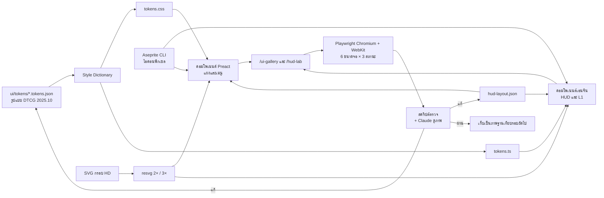

- **โทเคน:** `ui/tokens/*.tokens.json` ใช้รูปแบบ DTCG 2025.10 ที่เป็นรุ่นเสถียรแรก (28 ต.ค. 2025) Style Dictionary สร้าง `tokens.css` (CSS variables) และ `tokens.ts` ให้เอนจิน
- **ระยะห่าง:** ฐาน 4 (4, 8, 12, 16, 24, 32, 48, 64) ขอบ HUD = safe inset + 16 padding แผง 24 ช่องกริด 12
- **ระดับชั้น:** e0 HUD ไม่มีแผ่นรอง ข้อความขอบหมึก 2 px · e1 แผง surface.panel ขอบสำริด 1 px · e2 popup ขอบทอง 2 px · e3 modal และรางวัล ฉากหลังหรี่ 70% มุมทองลายเมฆม้วน
- **กรอบ HD:** Claude เขียน SVG แล้ว resvg แปลงเป็น PNG ที่ 2× และ 3× ใช้กับ CSS `border-image` (มี `fill`) และ NineSlice ในเอนจิน ไม่อบเงาหรือไล่สีหนักลงภาพ
- **ไอคอนพิกเซล:** Aseprite CLI (`--batch --script --sheet --data --list-slices`) สไลซ์ที่มี 9-slice และ pivot ส่งออกลง JSON ได้ในคำสั่งเดียว
- **มินิแมพ:** อบจาก tilemap ตอนบิลด์ที่ 4 px ต่อช่อง ใช้พาเลตเดียวกับฉาก
- **คอมโพเนนต์ DOM:** LacquerPanel, GiltButton (primary / secondary / ghost / danger × L / M / S), IconSlot (คิด k), RarityFrame, SealBadge, TabRailVertical, SegmentTabs, BambooList, StoneTooltip, Modal, Toast, CurrencyBar, RedDot, Countdown, ProgressBar (scaleX), NameCard (名刺/謁), StatusPill, MenuIconButton, ChatBar, QuestRow, AutoSetPanel
- **คอมโพเนนต์เอนจิน:** Joystick, AButton, SkillButton (วงพัดด้วย mesh), UltimateButton, DodgeButton, CommandWheel, AimIndicator, ComboCounter, TargetFrame, Minimap, SiegeBar, NameplatePool, DamageNumberPool, StatusBadgePool, NpcTag, ThaiWrap, SafeAreaProbe
- **หน้าทดสอบ:** `/ui-gallery` วางทุกคอมโพเนนต์ในทุกสถานะ ทำหน้ากระเป๋าเป็นหน้าแรก เพราะมีคอมโพเนนต์กลางมากที่สุด `/hud-lab` มีฉากเมือง ทหาร 40 ตัว และ HUD ครบ 3 สถานะ
- **ตรวจอัตโนมัติ:** ขนาดและระยะห่างพื้นที่แตะจาก DOM rect + `hud-layout.json`, ข้อความล้น (scrollWidth > clientWidth) ที่ 100% และ 150%, คอนทราสต์จากโทเคน, ภาพต่างจากฐานด้วย pixelmatch และสีนอกพาเลตในไอคอน
- **ตรวจบนเครื่องจริงทุกสัปดาห์:** Redmi 14C (Chrome และเบราว์เซอร์ใน LINE) และ iPhone (Safari) inset จำลองด้วยตัวแปร CSS ในโหมดทดสอบ เพราะ Playwright จำลอง `env(safe-area-inset-*)` ไม่ครบ
- **ท่อข้อความ:** Google Sheets → JSON → ตรวจข้อความล้น → อบอักษรจีนเป็น atlas ข้อความหลายบรรทัดไม่ตัดล่วงหน้า เพราะอยู่ใน DOM
- **atlas:** hud-pixel 1024² (R8 + LUT), icons-item และ icons-skill 1024² (R8 + LUT), frames-hd 2× และ 3× (PNG), zh-text 1024² (PNG) padding 2 ห้ามบีบอัดแบบสูญเสียกับภาพพิกเซล พอร์เทรตและภาพกาชาเป็น WebP
- **เฟส 0:** HUD lab ต้องผ่านเกณฑ์ DOM ≤1 ms ต่อเฟรมและ fps ลดไม่เกิน 3 บน Redmi 14C ก่อนสร้างหน้าอื่น
- Figma ใช้แค่ร่างภาพ ไม่ใช่ท่อหลัก

### งบประสิทธิภาพ UI

| รายการ | งบ |
| --- | --- |
| draw call ของ HUD และ L1 ในเอนจิน | ≤12 ห้ามมี mask ใน HUD Text ไทยที่เปลี่ยนค่าได้ ≤12 ตัว |
| โหนด DOM ของ HUD (L3) | ≤120 |
| composited layer | ≤8 |
| เวลา DOM ต่อเฟรมระหว่างต่อสู้ | ≤1 ms |
| draw call ของแผงเต็มจอ | ≤40 (ส่วนที่อยู่ในเอนจิน) |
| หน่วยความจำภาพ UI ที่ค้างอยู่ | ≤32 MB (เดิม 48 MB เพราะไอคอนพิกเซลเล็กลง) อยู่ในงบรวม 300 MB สงคราม 250 MB |
| UI ในโหลดแรก | ≈1.4 MB จากงบ 8 MB: ฟอนต์ไทย ≤0.35 · Preact + โค้ด UI ≈0.1 · atlas HUD พิกเซล ≈0.3 · กรอบ HD 2×/3× ≈0.2 · ฉากล็อกอิน ≈0.4 (ค่าประมาณ ต้องวัดจริง) |
| ระบบอื่นและพอร์เทรต | โหลดเมื่อเปิดระบบนั้น |
| ป้ายชื่อ ตัวเลขดาเมจ ป้ายสถานะ | ใช้ pool ทั้งหมด ห้ามสร้างอ็อบเจกต์ใหม่ระหว่างต่อสู้ |

แหล่งอ้างอิง: [朱然墓 (zh.wikipedia)](https://zh.wikipedia.org/wiki/%E6%9C%B1%E7%84%B6%E5%A2%93) · [Fantasy Online 2 Patch Notes #145](https://blog.fantasyonline2.com/blog/patch-notes-145-molten-abyss-preview) · [Stardew Valley Wiki: Options](https://stardewvalleywiki.com/Options) · [Coherent Gameface](https://coherent-labs.com/products/coherent-gameface/) · [Phaser: DOM Element](https://docs.phaser.io/phaser/concepts/gameobjects/dom-element) · [PixiJS textTokenization.ts](https://github.com/pixijs/pixijs/blob/dev/src/scene/text/canvas/utils/textTokenization.ts) · [W3C: Approaches to line breaking](https://www.w3.org/International/articles/typography/linebreak) · [Xbox Accessibility Guideline 101](https://learn.microsoft.com/en-us/xbox/accessibility/xbox-accessibility-guidelines/101) · [MDN: image-rendering](https://developer.mozilla.org/en-US/docs/Web/CSS/image-rendering) · [caniuse: devicePixelContentBoxSize](https://caniuse.com/mdn-api_resizeobserverentry_devicepixelcontentboxsize)

## 3. Core loop

ลูปหลักคือ ฟาร์ม → แข็งแกร่งขึ้น → ชนกำแพงพลัง → เติมเงินหรือฟาร์มต่อ → ไปแข่งกับคนอื่น ทุกระบบต้องเพิ่มตัวเลข **Battle Power (BP)** ตัวเดียวที่ทุกคนมองเห็น

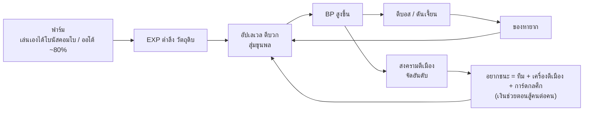

ลูปเริ่มจากฟาร์ม และจบที่การแข่งขันซึ่งเป็นแรงจูงใจให้เติมเงิน

**จังหวะการเล่น**

| รอบ | กิจกรรม |
| --- | --- |
| ทุกครั้งที่เข้าเกม (5 นาที) | เก็บรางวัลออฟไลน์, ทำเควสรายวัน, สุ่มฟรี 1 ครั้ง |
| รายวัน 12:00 / 20:00 | บอสโลก (ทุกคนตีพร้อมกัน, จัดอันดับดาเมจ) |
| รายวัน 21:00 | บอสพันธมิตร / ขนเสบียง |
| อังคาร-พฤหัส 20:30 | ประลองฝีมือ PvP อารีนา |
| เสาร์ 20:00–21:00 | **สงครามตีเมือง** (อีเวนต์ใหญ่สุด) |
| อาทิตย์ 10:00 | 銓敘 จัดที่นั่งขุนพล อ๋อง เสนาบดีสูงสุด ประจำสัปดาห์ (ข้อ 4.3.7) |
| ทุก 30 วัน | ซีซันใหม่ รีเซ็ตอันดับ แจกฉายา |

**ช่วงเลเวล:** 1–60 เร็วมากใน 1–2 วันแรก (ให้รู้สึกเก่ง), 60–100 ช้าลงเป็นสัปดาห์, 100+ ปลดด้วยการ "จุติ/ทะลวงขั้น" ที่ต้องใช้ไอเทมจากบอสหรือร้านค้า

## 4. ตัวละคร อาชีพ และขุนพล

ผู้เล่นสร้างตัวละครของตัวเอง 1 ตัว เลือก 1 ใน 4 อาชีพ และเลือกสังกัดก๊ก จากนั้นสะสมขุนพลสามก๊กมาเป็นผู้ช่วยรบ (ระบบกาชาหลัก)

**สังกัดก๊ก (เลือกตอนเริ่ม ย้ายได้ด้วยไอเทม):** วุย (โจโฉ) สีแดงครั่ง ◆ · จ๊ก (เล่าปี่) สีเขียวมรกต ● · ง่อ (ซุนกวน) สีฟ้าใส ▲ (ข้อ 2 และ 2.2) — ระบบถ่วงดุล: ก๊กที่คนน้อยได้โบนัส EXP +20%

| อาชีพ | บทบาท | อาวุธตามสาย | จุดเด่น |
| --- | --- | --- | --- |
| ขุนศึก | แทงค์ / บุกทะลวง | ทวน (ทะลวงทัพ) · กระบองเหล็ก+โล่ (ป้อมปราการ) | ทุบประตู ยันแนว เจาะแนวทัพ |
| จอมดาบ | ดาเมจประชิด | ดาบถือคู่ (ดวลเดี่ยว) · ง้าว (กวาดล้าง) | คอมโบแรง ล้างทหาร |
| นักธนู | ดาเมจระยะไกล | เกาทัณฑ์ (ซุ่มยิง) · หน้าไม้ (ห่าธนู) | ยิงไกล 18 ม. (ท่าพิเศษซุ่มยิง 20 ม.) คุมพื้นที่ |
| กุนซือ | เวทและซัพพอร์ต | พัดขนนก (ทั้งสองสาย) | ไฟกลยุทธ์ ฮีล บัฟทั้งทัพ |

**ค่าพลัง:** พลังโจมตี, ป้องกัน, RES (ต้านเวท), HP, คริติคอล, หลบ, ความแม่น, เจาะเกราะ, ความเร็วโจมตี, ลดดาเมจ PvP — รวมเป็น BP ตัวเดียว แสดงบนการ์ดนามและหน้าโปรไฟล์ (ข้อ 2.2)

**ระบบขุนพล (ตัวทำเงินหลัก)**

- ขุนพลติดตามตัวออกรบ 1 ตัว + ลงตำแหน่ง "ค่ายทัพ" 5 ตัวเพื่อบัฟค่าพลัง
- ระดับ: N (ทหารทั่วไป) → R → SR (เตียวหุย ฮองตง) → SSR (กวนอู จูล่ง จิวยี่) → UR (ลิโป้ ขงเบ้ง โจโฉ)
- อัปดาวด้วยการได้ตัวซ้ำ (1–10 ดาว) = เหตุผลให้สุ่มซ้ำไม่สิ้นสุด
- **โบนัสเซ็ตพันธะ:** รวบรวมกลุ่มครบได้บัฟใหญ่ เช่น "สามพี่น้องสวนท้อ" (เล่าปี่ กวนอู เตียวหุย) หรือ "ห้าทหารเสือ" (ติดป้ายนิยาย: 演義 ตอน 73 / ฉบับหนตอนที่ ๕๘)
- ขุนพลมีสกิลพิเศษในสงครามตีเมือง เช่น ขงเบ้งขอลมสลาตัน เพิ่มไฟ 30% แต่ขุนพลที่ผูกกับสกิลหรือการ์ดไม่เพิ่มไฟแยกอีกชั้น สกิลขุนพลขงเบ้งไม่ซ้อนกับขั้นสุดขงเบ้งขอลมสลาตัน (ข้อ 4.2) และการ์ด A3 (ข้อ 7.3) ให้ใช้ค่าที่สูงกว่า

**ความสวยงามที่ขายได้:** ชุดแฟชั่น ปีก ฉายาเรืองแสง รัศมีเท้า สกินม้าและเครื่องม้า ลายปักสายตรา และศาสตรานาม (ไม่เพิ่ม BP) ตัวม้าตำนานได้ฟรีจากการเล่น

## 4.1 ระบบต่อสู้ สกิล และการคุมทหาร

การต่อสู้เป็นแอ็กชันคอมโบที่ผู้เล่นกดเองบนจอแนวนอน เซิร์ฟเวอร์ตัดสินผล ส่วนไคลเอนต์เล่นท่าทันทีที่กด ทุกอาชีพมี 2 สายและคุมกองทหารของตัวเองได้ ความสมดุลคุมด้วย "งบพลัง" เดียวกัน ทุกสายต้องฟาร์มได้เร็วใกล้กัน ต่างกันไม่เกิน ±10% ตัวเลขทุกตัวในข้อนี้เป็นค่าตั้งต้นสำหรับทดสอบ และเก็บไว้ใน Google Sheets (ข้อ 10)

**โครงสกิลของทุกอาชีพ**

| ช่อง | จำนวน | ปลดที่เลเวล | หมายเหตุ |
| --- | --- | --- | --- |
| สกิลพื้นฐาน | 3 | 1, 10, 20 | สองสายได้เหมือนกัน เป็นท่าร่างกายที่ไม่ผูกกับอาวุธ |
| สกิลสาย (กดใช้) | 2 | 30, 45 | เลือกสายตอนเลเวล 30 |
| พาสซีฟสาย | 1 | 60 | ทำงานเองตลอด |
| สกิลขั้นสุด | 1 | 30 | ใช้เกจฮึกเหิมแทนคูลดาวน์ |
| คำสั่งทัพ | 2 | 15, 50 | ใช้แต้มขวัญทัพ |
| พาสซีฟทั่วไป | 4 | 20, 40, 60, 80 | แต่ละช่องเลือกได้ 1 จาก 2 |

- บนจอมีช่องสกิล 4 ช่อง ผู้เล่นเลือกใส่ 4 จาก 5 ท่าที่กดใช้ได้
- ตั้งชุดสกิลได้ 2 ชุด (ฟาร์ม/สงคราม) สลับชุดได้เมื่อไม่ได้ตีและไม่ถูกตีครบ 5 วิ
- เปลี่ยนสายได้ฟรีสัปดาห์ละครั้ง ถ้าเปลี่ยนอีกต้องใช้ "ตำราล้างสาย" จากร้านค้า

### ประเภทดาเมจและตระกูลอาวุธ

อาวุธแต่ละตระกูลมีประเภทดาเมจหลักหนึ่งแบบ และท่าปิดหนักประจำตระกูลคือสิ่งที่บอกตัวตนของประเภทนั้น

| ตระกูล (สาย) | อาวุธอ้างอิง | ชั้นข้อมูล | ประเภท | ท่าปิดหนักประจำ | สถานะประจำ | แรงกับ |
| --- | --- | --- | --- | --- | --- | --- |
| ทวน (ทะลวงทัพ) | ทวนของเตียวหุย "ทวนยาวสิบศอก" (丈八點鋼矛) | ประวัติศาสตร์ (矛) + นิยาย (ชื่ออาวุธ) | แทง | แทงทะลุแนว | เกราะแตก, ลอย | เจาะ DEF 20% ในตัว, คนบนม้า ×1.2 |
| กระบองเหล็ก+โล่ (ป้อมปราการ) | กระบองเหล็กสี่เหลี่ยมของอุยกาย (鐵鞭), โล่ (楯) | นิยาย (กระบอง) + ประวัติศาสตร์ (โล่) | ทุบ | ทุบแผ่นดิน ทำให้ล้ม | ล้ม, มึน | เกราะหนัก, การ์ด, ประตูเมือง, แถบทรงตัวบอส ×2 |
| ดาบคู่ (ดวลเดี่ยว) | กระบี่สองเล่มของเล่าปี่ (雙股劍) ทรงดาบด้ามห่วง (環首刀) | นิยาย (ถือคู่) + ประวัติศาสตร์ (環首刀) | ฟัน | พุ่งฟัน ทำให้เลือดออก | เลือดออก | เกราะเบา ×1.25 |
| ง้าว (กวาดล้าง) | ง้าวกวนอู "ยาวสิบเอ็ดศอก หนักแปดสิบสองชั่ง" (大刀 / 青龍偃月刀) และง้าวเกี่ยว (戟) | ประวัติศาสตร์ (戟) + นิยาย (ง้าวกวนอู) | ฟัน+เกี่ยว | เกี่ยวดึงเข้าหาตัว | เลือดออก, ล้ม | เกราะเบา, ดึงคนตกม้า |
| เกาทัณฑ์/หน้าไม้ (ซุ่มยิง, ห่าธนู) | เกาทัณฑ์ (弓), หน้าไม้ (弩) | ประวัติศาสตร์ | ยิงไกล | ยิงชาร์จทะลุแนว | ตรึง, ชะลอ | ระยะไกล, เกราะเบา ×1.15 |
| พัดขนนก (เพลิงกลยุทธ์, เสนาธิการ) | พัดขนนกของขงเบ้ง (羽扇) | ตำนาน (語林) + นิยาย | เวท | ร่ายต่อเนื่อง | ติดไฟ, ชะลอ | ใช้ RES แทน DEF, ไฟ ×1.5 กับไม้ |

- ฉบับหนใช้คำว่า "ง้าว" แปล 刀 ด้ามยาว เช่น ง้าวกวนอูและง้าวฮันต๋ง ส่วน 戟 แปลว่า "ทวน" เช่น ทวนลิโป้และทวนสองเล่มของเตียนอุย ในเกมจัดตระกูลตามรูปหัวอาวุธ (ข้อ 6.2) อาวุธหัว 戟 จึงอยู่ตระกูลง้าวแม้ชื่อชิ้นเป็น "ทวน"
- ท่าเกี่ยวดึงของง้าวเป็นกลไกแต่งใหม่ โดยได้แนวคิดมาจากขอเกี่ยว (戈) ของ 戟
- ง้าวจันทร์เสี้ยว (偃月刀), ทวนลิโป้ (方天畫戟) และลูกขลุบ (流星鎚) เป็นอาวุธยุคหลัง ในหน้า codex ให้ติดป้าย "นิยาย"
- ในตัวบท 三國志 ที่ตรวจ ไม่พบกระบองเลย ที่ใกล้ที่สุดคือเตียนอุยถือขวานใหญ่ (大斧) และเตียนอุยหนีบโจรสองคนฟาดจนตาย
- เวทเป็นชั้นนิยาย ประวัติศาสตร์บันทึกไว้เพียงการเผาและลมแรงตามธรรมชาติ (時風盛猛)
- ทวนม้า (槊) เป็นฐานของท่าแทงบนหลังม้า ส่วนทวนสั้น (手戟) เป็นอาวุธขว้างในสกิลของขุนศึก

**ชั้นเกราะของเป้า** หลักคิดมาจาก 軍策令 ของโจโฉ ซึ่งบอกว่าอ้วนเสี้ยวมีเกราะหมื่นชุดและเกราะม้า 300 ชุด แต่โจโฉมีเกราะใหญ่เพียง 20 ชุด เกราะหนักจึงเป็นของหายาก ในเกมสงวนไว้ให้หัวหน้าและหน่วยพิเศษ

| ชั้น | ใครบ้าง |
| --- | --- |
| เบา | นักธนู, กุนซือ, โจรโพกผ้าเหลือง, ทหารธนูหน้าไม้, ทหารกลยุทธ์ |
| กลาง | จอมดาบ, ทหารตั๋งโต๊ะ, ทหารม้าเบา |
| หนัก | ขุนศึก, ทหารองครักษ์, ขุนพลและบอส, ทหารทวนโล่ |
| ขี่ม้า (คูณเพิ่มจากชั้นเดิม) | ทุกคนที่อยู่บนม้า และทหารม้าอ้วนเสี้ยวในทุ่งกัวต๋อ (หนัก+ขี่ม้า) |
| โล่หน้า | ทหารทวนโล่ตอนตั้งแถว และป้อมปราการตอนยกโล่ (ด้านหน้า 180°) |
| สิ่งก่อสร้าง | ไม้ (ค่าย เรือ รถกระทุ้ง บันได), ไม้หุ้มเหล็ก (ประตูเมือง), หิน/ดิน (กำแพง ป้อม) |

**ตัวคูณประเภทดาเมจ × ชั้นเกราะ (PvE)**

| ประเภท | เบา | กลาง | หนัก | ขี่ม้า | โล่หน้า | ไม้ | ไม้หุ้มเหล็ก | หิน |
| --- | --- | --- | --- | --- | --- | --- | --- | --- |
| ทุบ | 0.90 | 1.00 | 1.25 | 1.00 | 0.80 และลดเกจการ์ด ×2 | 1.25 | 1.50 | 1.00 |
| แทง | 1.00 | 1.10 | 1.10 | 1.20 | 0.60 | 0.60 | 0.50 | 0.30 |
| ฟัน | 1.25 | 1.00 | 0.80 | 1.00 | 0.40 | 0.60 | 0.40 | 0.20 |
| ยิงไกล | 1.15 | 1.00 | 0.85 | 1.00 | 0.30 | 0.40 | 0.30 | 0.10 |
| เวท-ไฟ | 1.00 | 1.00 | 1.00 | 1.00 | 0.80 | 1.50 | 1.00 | 0.30 |
| เวท-อื่น | 1.00 | 1.00 | 1.00 | 1.00 | 0.80 | 0.50 | 0.40 | 0.30 |

- ใน PvP ใช้ค่าจากตารางแค่ครึ่งเดียว คือ ค่าที่ใช้ = 1 + (ค่าในตาราง − 1) × 0.5 เพราะผู้เล่นเปลี่ยนอาวุธกลางศึกไม่ได้
- วงจรแพ้ทางของทหาร 2 ชั้นในข้อ 4.4 ใช้เฉพาะตอนทหารสู้ทหารหรือมอนที่ติดป้ายสาย ไม่คูณซ้อนกับดาเมจของผู้เล่น
- ดาเมจต่อประตู กำแพง หอรบ และเครื่องตีเมืองในสงครามเป็นค่าคงที่ตามข้อ 7.2 ไม่ใช้ตารางนี้และไม่ขึ้นกับ BP คอลัมน์ไม้ ไม้หุ้มเหล็ก และหินใช้กับสิ่งก่อสร้างใน PvE เท่านั้น

**สูตรดาเมจกลาง (แทนสูตรเดิม)**

```latex
\text{DEF}_{\text{eff}} = \text{DEF} \times (1 - \text{เจาะเกราะ}) \times (1 - \text{เกราะแตก})
```

```latex
\text{ดาเมจ} = \text{ATK} \times \text{ตัวคูณสกิล} \times \left(1 - \frac{\text{DEF}_{\text{eff}}}{\text{DEF}_{\text{eff}} + K}\right) \times M_{\text{ประเภท}} \times M_{\text{แพ้ทาง}} \times \text{คริ} \times M_{\text{เรือง}} \times M_{\text{PvP}}
```

- K = 500 × เลเวลเป้าหมาย เท่าเดิม ดาเมจเวทใช้ RES แทน DEF
- M\_ประเภท มาจากตารางด้านบน ส่วน M\_แพ้ทาง คือวงจร 2 ชั้นของข้อ 4.4 ใช้เฉพาะตอนทหารสู้ทหาร
- M\_เรือง = 1.5 เมื่อกดสกิลในจังหวะเรือง ยกเว้นท่าที่กำหนดผลพิเศษไว้แทน
- M\_PvP กำหนดแยกทุกท่า ค่าตั้งต้นคือ ตีเป้าเดียว 0.7, ตีกลุ่ม 0.6, ดาเมจต่อเนื่อง 0.5, ขั้นสุด 0.6, ฮีล 0.6
- ใน PvP ตีครั้งเดียวทำดาเมจได้ไม่เกิน 35% ของ HP สูงสุดของเป้า (ขั้นสุดไม่เกิน 45%)

### สถานะและกติกาคุม

| สถานะ (id) | ผล | PvE | PvP | แต้มคุม | ตัวอย่างท่าที่ติด |
| --- | --- | --- | --- | --- | --- |
| สะดุด (stagger) | ชะงัก และยกเลิกท่าที่ยังไม่ถึงเฟรมตี | 0.3 วิ | 0.25 วิ | 0 | ตีปกติทุกตระกูล |
| กระเด็น (knockback) | ถูกผลักไป 2–4 ม. | 0.5 วิ | 0.5 วิ | 0.5 | A3 กระบอง, H3 ทวน |
| ตรึง (root) | เดินและพุ่งไม่ได้ แต่ยังตีและร่ายได้ | 1.5 วิ | 1.0 วิ | 0.5 | ศรตรึงขื่อ, ลากหางวัว |
| ล้ม (knockdown) | นอนกับพื้น ทำอะไรไม่ได้ | 1.2 วิ | 0.9 วิ | 1 | A4 ง้าว, H4 กระบอง |
| ลอย (launch) | ลอยกลางอากาศ และถูกตีต่อได้ | 0.9 วิ (รวมไม่เกิน 2.5) | 0.8 วิ (รวมไม่เกิน 2.0) | 1 | H2 ของตระกูลประชิดและพัด |
| มึน (stun) | ยืนนิ่ง ทำอะไรไม่ได้ | 1.5 วิ | 1.0 วิ | 1 | สวนโล่, เตียนอุยหนีบโจร |
| เกราะแตก (armorbreak) | DEF ลดลง | −25% นาน 6 วิ | −15% นาน 5 วิ | 0 | H1 ทวน, ทะลวงค่ายโกซุ่น |
| เลือดออก (bleed) | ซ้อนได้ 5 ชั้น ชั้นละ 5 วิ | 5% ATK/วิ ต่อชั้น | 3% ต่อชั้น | 0 | ดาบคู่, ง้าว |
| ติดไฟ (burn) | ซ้อนได้ 3 ชั้น นาน 4 วิ และลามได้ | 7% ATK/วิ ต่อชั้น | 4% ต่อชั้น | 0 | กุนซือ, ห่าเพลิง |
| ชะลอ (slow) | ความเร็วเดินลดลง 25–50% | 2–4 วิ | ซ้อนรวมไม่เกิน 50% | 0 | ระดมยิงดังห่าฝน, ค่ายศิลาแปดประตู |

- **ป้ายคอมโบ:** สกิลกินได้เฉพาะ 6 ป้ายตามกรอบ (ล้ม ลอย เกราะแตก ติดไฟ ตรึง เลือดออก) ส่วนสะดุด กระเด็น มึน และชะลอเป็นผลคุมที่ไม่เปิดจังหวะเรือง ไอคอนทั้งหมดอยู่ในข้อ 2.2
- **การกินสถานะ:** เลือดออก ติดไฟ และเกราะแตก จะหายไปเมื่อถูกกิน แล้วระเบิดเป็นดาเมจตามที่ท่านั้นกำหนด
- **สถานะคุมเมื่อถูกกิน:** ตรึง ล้ม ลอย และมึน ไม่หายไป แต่การติดหนึ่งครั้งให้โบนัสได้ไม่เกิน 2 ครั้ง โดยนับรวมทั้งทีม
- **ต่อลอย:** ทุกครั้งที่ตีโดนเป้าที่ลอยอยู่ เวลาลอยยาวขึ้น 0.15 วิ (ท่าที่ติดป้าย "ต่อลอย" ยาวขึ้น 0.3 วิ) เมื่อถึงเพดาน เป้าตกลงพื้นและลุกขึ้นพร้อมอมตะ 0.5 วิ

**แถบทรงตัว (เฉพาะ PvE)**

- ค่าตั้งต้น: มอนทั่วไป 0 (สะดุดทุกครั้งที่โดน), หัวหน้ากลุ่ม 100, บอส 1,000 (แถบเหลืองใต้แถบ HP)
- ดาเมจทรงตัวต่อครั้ง = ตัวคูณสกิล × 10 × ค่าของประเภท (ทุบ 2.0, แทง 1.0, ฟัน 0.7, ยิงไกล 0.5, เวท 0.8) และท่าปิดหนักคูณ 2 อีกชั้น
- เมื่อแถบหมด บอส "เสียหลัก" 3 วิ รับดาเมจ +30% และทำให้ลอยหรือล้มได้ หลังจากนั้นแถบคืนเต็มภายใน 10 วิ

**สถานะป้องกัน**

| สถานะป้องกัน | กันอะไร | แพ้อะไร | ได้จาก |
| --- | --- | --- | --- |
| ร่างเหล็ก (霸體) | สะดุด กระเด็น ล้ม ลอย มึน แต่ยังรับดาเมจเต็ม | จับทุ่ม, ตรึง | ช่วงง้าง H4, ตวาด, ทะลวงค่าย ท่าละไม่เกิน 1.2 วิ ไม่มีผลตอนขี่ม้า (ยกเว้นขั้นสุด) |
| การ์ดหน้า | ดาเมจ 80% ทุกสถานะ และกระสุนที่มาจากด้านหน้า 180° | จับทุ่ม, ตีจากด้านหลัง, ทุบ (ลดเกจการ์ด ×2) | ยกอานบังนาย, ทหารทวนโล่ |
| อมตะ | ทุกอย่าง | – | หลบ 0.3 วิ, 0.5 วิแรกของขั้นสุด, ลุกจากล้ม 0.5 วิ |
| ตั้งหลัก | สถานะคุมทุกแบบ นาน 5 วิ แต่ดาเมจยังเข้า | – | แต้มคุมสะสมครบ 2.0 |

วงจรชนะทางคือ ร่างเหล็กชนะการคุม จับทุ่มชนะร่างเหล็กและการ์ด และหลบชนะจับทุ่ม ทั้งเกมมีท่าจับทุ่มท่าเดียว (เตียนอุยหนีบโจร) และท่าสวน 2 ท่า (ยกอานบังนาย, ชิงทวนไทสูจู้) เพื่อคุมงบแอนิเมชัน

**กติกาคุมใน PvP (แทนกติกาลดเวลาครึ่งหนึ่งแบบเดิม)**

- แต้มคุมสะสมตามตารางสถานะ ครบ 2.0 เมื่อไรจะได้ "ตั้งหลัก" 5 วิ และมีวงขาวรอบตัว กติกานี้อิง Black Desert ซึ่งครบ 2 แต้มแล้วกันคุม 5 วิ
- Black Desert นับสะดุดและกระเด็นเป็น 0.7 แต้ม เกมนี้ปรับเป็น 0.5 เพื่อให้คำนวณง่าย
- ถ้าไม่ถูกคุมเลยครบ 5 วิ แต้มกลับเป็น 0
- การคุมครั้งที่สองในรอบนับเดียวกันได้เวลาคุม ×0.7
- ท่าดึง ผลัก และเกี่ยว นับแต้มคุมทุกครั้ง
- ปลดคุม: แตะหลบขณะมึน ล้ม หรือตรึง โดยใช้ 2 ชาร์จ ได้อมตะ 0.4 วิ และกลิ้งไป 3 ม. ใช้ตอนลอยไม่ได้
- ทหาร AI ทำให้ผู้เล่นติดได้แค่ชะลอกับสะดุด และไม่เพิ่มแต้มคุม
- สงครามใช้กติกาเดียวกัน และเกิดใหม่แล้วได้ตั้งหลัก 3 วิ

### การกดคอมโบบนจอสัมผัส

การกดทุกแบบใช้ผังปุ่มจอแนวนอนตามกรอบที่ตัดสินแล้ว ได้แก่ ปุ่ม A 150 px, สกิล 4 ปุ่ม ปุ่มละ 104 px, ปุ่มขั้นสุด 120 px และปุ่มหลบ 92 px ที่มี 2 ชาร์จ

| ค่า | ตัวเลข | กติกา |
| --- | --- | --- |
| เฟรมตี | กำหนดแยกทุกท่าในชีต | เป็นจุดเริ่มนับของทุกหน้าต่าง ใช้ทั้งตอนตีโดนและตีวืด |
| ท่าถัดไปออกได้ | เฟรมตี +250 ถึง +600 ms | ถ้าเลย +600 ms ชุดตีเริ่มนับใหม่ |
| บัฟเฟอร์รับคำสั่ง | 180 ms (ปรับได้ 150–200) | กดล่วงหน้าได้ตั้งแต่ +70 ms ช่วงรับการกดจริงจึงยาว 530 ms |
| กดค้างเป็นท่าปิดหนัก | ตั้งแต่ 350 ms | ค้างที่จังหวะ n จะได้ท่า Hn |
| ชาร์จธนูและพัด | 0.3–1.5 วิ | ปล่อยนิ้วเพื่อยิง ถ้าค้างครบ 1.5 วิ ยิงออกเอง |
| hit-stop | ตามประเภทดาเมจ | ทุกหน้าต่างหยุดนับตามเวลาที่ภาพหยุด |
| ความเร็วโจมตี | เร็วขึ้นได้สูงสุด +30% | หน้าต่างสั้นลงตามสัดส่วน แต่ไม่ต่ำกว่า 400 ms |
| จังหวะเรือง / ปุ่มแปลงร่าง | 1.5 วิ | – |

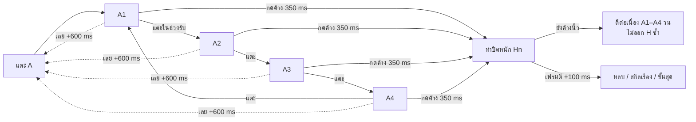

การกด A ค้างต่อหลังท่าปิดหนัก คือ "กด A ค้าง" ที่นโยบายออโต้อนุญาต ในหน้าตั้งค่ามีตัวเลือก "กดค้าง = ตีต่อเนื่องอย่างเดียว" ให้คนที่ไม่ถนัดคอมโบ

**ชุดตีปกติ A1–A4** (รูปแบบ: ท่า · ตัวคูณ ATK · @เฟรมตี ms · สถานะที่ติด)

| ตระกูล | A1 | A2 | A3 | A4 |
| --- | --- | --- | --- | --- |
| ทวน | แทงตรง 4 ม. · 0.8 · @220 | แทงคู่ · 0.45×2 · @200/320 | ปัดด้ามกวาด 150° · 1.0 · @260 · สะดุด | พุ่งแทง 3 ม. · 1.4 · @300 · กระเด็น |
| กระบอง+โล่ | กระแทกโล่ · 0.8 · @240 · สะดุด | ทุบลง · 1.1 · @320 | เหวี่ยงข้าง 150° · 1.2 · @340 · กระเด็น 2 ม. | ทุบสองมือ วง 3 ม. · 1.8 · @420 · ล้ม |
| ดาบคู่ | ฟันไขว้ · 0.35×2 · @160 | ฟันหมุน · 0.4×2 · @180 | เตะแล้วฟัน · 0.9 · @220 · สะดุด | ฟันกากบาท · 0.5×3 · @260 · เลือดออก 1 |
| ง้าว | ฟันเฉียง 150° 4 ม. · 1.0 · @280 | ฟันย้อน · 1.0 · @300 | หมุนง้าวรอบตัว 4 ม. · 1.2 · @360 | ผ่าลงเป็นแนว 5 ม. · 1.7 · @420 · ล้ม |
| เกาทัณฑ์/หน้าไม้ | ยิงเร็ว 18 ม. · 0.7 · @200 | ยิงเร็ว · 0.7 · @200 | ยิงคู่ · 0.5×2 · @260 | ยิงหนัก · 1.3 · @320 · กระเด็นเล็ก |
| พัด | ลูกลม 18 ม. · 0.7 · @240 | ลูกลม · 0.7 · @240 | ลูกลมสามลูก · 0.4×3 · @300 | ระเบิดลมวง 3 ม. · 1.4 · @400 · กระเด็น (สายเพลิงติดไฟ 1 / สายเสนาธิการฮีลเพื่อนในวง 2%) |

**ท่าปิดหนัก H1–H4**

| ตระกูล | H1 | H2 (ทำให้ลอย) | H3 | H4 |
| --- | --- | --- | --- | --- |
| ทวน | แทงทะลุแนว 6 ม. · 1.8 · เกราะแตก | เสยทวน · 1.6 · ลอย | ควงทวนปัดศร 360° · 1.8 · กระเด็น และปัดกระสุนด้านหน้า 0.6 วิ | ทะลวงพุ่ง 6 ม. · 2.4 · ล้ม + เกราะแตก · ร่างเหล็กขณะพุ่ง |
| กระบอง+โล่ | โล่สวน: ยกโล่ 0.8 วิ ถ้าโดนตีจะสวน · 1.5 · มึน | ทุบเสย · 1.6 · ลอย | ทุบเกราะ · 2.0 · เกราะแตก | ทุบแผ่นดินวง 5 ม. · 2.6 · ล้ม · ร่างเหล็กช่วงง้าง 0.5 วิ |
| ดาบคู่ | พุ่งฟันผ่าน 5 ม. · 1.6 · เลือดออก 2 | ฟันเสย · 1.4 · ลอย | พายุใบมีดวง 3 ม. · 0.3×6 · เลือดออก 3 | ฟันตัดคอ · 2.4 · +10% ต่อชั้นเลือดออกบนเป้า (ไม่กินสถานะ) |
| ง้าว | เกี่ยวดึง กรวย 60° 6 ม. · 1.4 · ดึงเข้า 3 ม. และทำให้ตกม้า | เสยง้าว · 1.7 · ลอย | กวาดวงใหญ่ 5 ม. · 2.0 · กระเด็น | ผ่ากลางทัพเป็นแนว 7 ม. · 2.6 · ล้ม |
| เกาทัณฑ์/หน้าไม้ | ศรทะลุแนว 18 ม. · 1.6→3.0 ตามแรงชาร์จ | ศรสามดอกชาร์จ · 1.2×3 · สะดุด | ยิงพู่หมวก · 2.0 · เกราะแตก และเผยตัวคนที่ซ่อน 4 วิ | ศรระเบิดวง 2 ม. · 2.4 · ล้ม |
| พัด | ลำลมร่ายต่อเนื่อง · 0.35×6 · ชะลอ | วงลมยก · 1.6 · ลอย | พายุหมุนรอบตัว · 0.4×5 · กระเด็น | สายเพลิง · 0.5×5 · ติดไฟ 2 (สายเพลิง) / ลำแสงฟื้นฟู ฮีลเป็นแนว 3%×5 (สายเสนาธิการ) |

- ตระกูลประชิดและพัดใช้ H2 เป็นท่าทำให้ลอยทุกตระกูล ผู้เล่นจึงจำกฎได้ง่าย
- ธนูไม่มีท่าทำให้ลอย แต่มีสกิลที่กินสถานะลอย
- ระหว่างร่ายพัดต่อเนื่อง เดินได้ 50% ของความเร็ว
- เกาทัณฑ์กับหน้าไม้ใช้ชุดท่าเดียวกัน ต่างกันแค่โมเดลอาวุธ
- ท่า H3 ยิงพู่หมวกอิงเรื่องฮองตงยิงถูกพู่หมวกกวนอู (นิยาย) ส่วนควงทวนปัดศรอิงเรื่องม้าเฉียวเอาทวนปัดลูกเกาทัณฑ์ (นิยาย)

**จังหวะเรือง (ต่อสกิลด้วยสถานะ)**

- เมื่อเป้าที่ล็อกไว้ หรือเป้าที่ระบบเลือกให้ มีสถานะที่สกิลกินได้ และสกิลนั้นพร้อมใช้ ปุ่มจะเรืองทองพร้อมวงนับเวลา 1.5 วิ
- มุมขวาบนของปุ่มขึ้นไอคอนสถานะที่จะกิน ขนาด 28 px
- แตะในหน้าต่างนี้จะได้ท่าเสริมพลัง ค่าตั้งต้น +50% หรือผลพิเศษที่ท่ากำหนด และฮึกเหิม +3
- สถานะที่เพื่อนทำไว้ก็นับด้วย จึงเกิดคอมโบทีมได้
- ถ้าไม่ได้ล็อกเป้า สกิลที่เรืองทองจะเลือกเป้าที่มีสถานะนั้นก่อน แล้วจึงใช้ลำดับเป้าของโหมด
- ทั้งเกมมีท่าที่รีเซ็ตคูลดาวน์ได้ท่าเดียว คือ กำเหลงปล้นค่าย ใช้ได้ 1 ครั้งต่อ 8 วิ ท่าอื่นได้แค่โบนัส เพื่อกันคอมโบวนไม่จบแบบที่เกิดกับ 露娜 ของ 王者荣耀

**ปุ่มแปลงร่าง**

- เมื่อขั้นแรกโดนเป้า ปุ่มจะพลิกเป็นไอคอนขั้นถัดไป แสดงจุดบอกขั้น ●●○ ที่ขอบบน และวงนับ 1.5 วิ (ข้อ 2.2)
- ถ้าไม่กดภายในเวลา สกิลเข้าคูลดาวน์เต็ม
- คูลดาวน์เริ่มนับหลังใช้ขั้นสุดท้าย หรือเมื่อหมดเวลา
- เวอร์ชันแรกมี 2 สกิลที่แปลงร่างได้ คือ ทะลวงค่ายโกซุ่น และกวนอูแกล้งแพ้ ระบบรองรับได้ถึง 3 ขั้น

**ตัดท่า**

| ตัดจาก | ตัดได้เมื่อ | ตัดเป็น |
| --- | --- | --- |
| ตีปกติ A1–A4 | หลังเฟรมตี | หลบ, สกิลใดก็ได้, ท่าถัดไป, ขั้นสุด |
| ท่าปิดหนัก H | หลังเฟรมตีสุดท้าย +100 ms | หลบ, สกิลที่เรืองทอง, ขั้นสุด |
| สกิล | หลังจุดตัด (ค่าตั้งต้น 65% ของความยาวท่า ตั้งแยกทุกท่าในชีต) | หลบ และสกิลอื่นที่เรืองทองเท่านั้น |
| ช่วงง้างก่อนเฟรมตี | ภายใน 120 ms แรกเท่านั้น โดยกดหลบ (หลอกจังหวะ) | สกิลที่ถูกตัดเสียคูลดาวน์ 50% |
| ขั้นสุด | ตัดท่าอื่นได้ทุกช่วง | ใช้ไม่ได้ขณะถูกคุม |
| หลบ | หลังหลบ 200 ms | ตีสวน: A1 ครั้งถัดไป +30% |

หลบฉิวเฉียดคือหลบพ้นการโจมตีในช่วง 150 ms สุดท้ายก่อนโดน ได้ฮึกเหิม +5 และตีปกติครั้งถัดไป +30% เซิร์ฟเวอร์ตรวจจากเวลาหลบเทียบกับเฟรมตีของศัตรู โดยยอมให้คลาดได้ ±100 ms

**ตัวนับคอมโบ**

- นับทุกครั้งที่ตีปกติหรือสกิลโดน ถ้าแต่ละครั้งห่างกันไม่เกิน 2 วิ ดาเมจต่อเนื่องไม่นับ
- เมื่อถึง 10/30/50 ครั้ง ฮึกเหิมและขวัญทัพเติมเร็วขึ้น +10%/+20%/+30%
- PvE ที่เล่นเองได้ EXP และดรอป +2%/+4%/+6% ตลอดที่ตัวนับยังไม่หลุด ออโต้ไม่ได้โบนัสนี้
- ตัวนับหลุดเมื่อตีห่างกันเกิน 2 วิ หรือเมื่อตัวเราถูกทำให้ล้มหรือมึน

**การล็อกเป้าและวิธีกดสกิล**

| เรื่อง | กติกา |
| --- | --- |
| ล็อกอ่อน (ค่าตั้งต้น) | ระบบเลือกศัตรูที่ใกล้ที่สุดในกรวย 120° ด้านหน้า ภายในระยะตี |
| ลำดับเป้าตามโหมด | PvE = ใกล้สุด · PvP = เลือดน้อยสุดและผู้เล่นก่อน · สงคราม = เพิ่มสวิตช์ "ตีสิ่งก่อสร้าง" |
| ล็อกแข็ง | แตะตัวศัตรู มีวงแดงใต้ตัว หลุดเมื่อเป้าอยู่นอกระยะเกิน 8 วิ หรือเมื่อแตะพื้นว่าง |
| ปุ่มสลับเป้า (64 px) | วนเลือกเป้าตามระยะ |
| แตะปุ่มสกิล | ร่ายใส่เป้าที่ล็อกไว้ หรือเป้าที่ระบบเลือกให้ |
| ลากปุ่มสกิล | เล็งเองโดยมีเส้นหรือวงบนพื้น ปล่อยนิ้วเพื่อร่าย ลากไปโซนยกเลิกเพื่อยกเลิก |
| กดค้างไม่ลาก | ชาร์จ ใช้ได้เฉพาะสกิลที่ติดป้ายชาร์จ |

**เพดานระยะ:** ระยะที่เขียนในท่าคือระยะจริง ท่าทั่วไปไม่เกิน 18 ม. ท่าพิเศษสายซุ่มยิงไม่เกิน 20 ม. บัฟ ค่ายกล หอ เนิน ม้า ศาสตรา และการ์ด เพิ่มระยะของผู้เล่นไม่ได้ โบนัสระยะเดิมเปลี่ยนเป็นผลตามตารางข้างล่าง โบนัสดาเมจตามสถานการณ์ให้บวกกันก่อน แล้วจึงคูณ M\_PvP นอกศึกเป้าต้องห่างในแนวขึ้นลงของจอไม่เกิน 16 ม. (วงเล็งตัดขอบบนและล่างออก) ในศึกใช้ระยะเต็มได้ เพราะทุกคนเปิดมุมแม่ทัพได้ ความคลาดของเซิร์ฟเวอร์ใช้ตามเดิม แต่แนวขึ้นลงคลาดได้ไม่เกิน 0.75 ม. ท่าวางวงนับระยะถึงขอบวง ดาเมจหรือสถานะทุกครั้งที่ลงผู้เล่นต้องผ่านเงื่อนไขนี้ โดยวัดจากตัวผู้ร่ายถึงตัวผู้โดน (ยกเว้นพื้นไฟที่ค้างอยู่บนพื้น) กล้องโฟกัสที่กลางลำตัว แตะลูกศรขอบจอเพื่อล็อกแข็งผู้ยิงและเลื่อนกล้องไปหา ในศึกแตะค้างเพื่อสลับเป็นมุมแม่ทัพ ทหารและเครื่องตีเมืองสั่งจากมุมแม่ทัพและใช้กติกาแยก: ระยะทหารรวมโบนัสแบบบวกได้ไม่เกิน ×1.2 ใช้เต็มกับทหาร สิ่งก่อสร้าง และมอน แต่ยิงผู้เล่นได้ไม่เกิน 18 ม. และอยู่ในกรอบแนวตั้งเดียวกับผู้เล่น เครื่องตีเมืองและหอ NPC ไม่ติดเพดาน แต่ต้องมีวงแดงเตือนก่อนโดน

| แหล่งเดิม | ผลใหม่ |
| --- | --- |
| หอรบ · ยอดหอเกาทัณฑ์ · เนินดิน A6 | ที่สูง: ยิงข้ามเชิงเทินและสิ่งกำบังต่ำได้ ดาเมจยิง +10% ใส่เป้าที่ไม่ได้ยืนบนหอหรือเนิน ไม่ซ้อนกันเอง |
| ขงเบ้งขอลมสลาตัน · การ์ด A3 | ลมสลาตัน: กระสุนเร็ว +40% และขงเบ้งให้ท่ายิงเป้าเดียวทะลุไปโดนอีก 1 เป้า 50% ทหารได้แค่ความเร็ว ไม่ซ้อนกัน ใช้ค่าที่สูงกว่า |
| ม้าเป๊งจิ๋ว | ยิงหรือร่ายขณะม้าวิ่ง ดาเมจ ×0.9 แทน ×0.85 |
| เกาทัณฑ์ยิงเสือ (PvE) | ท่ายิงบนม้าใส่มอนและบอส +15% |
| ห่านบิน (ทหาร) | ระยะยิงทหาร +15% คงเดิม อยู่ในเพดาน ×1.2 |
| พาสซีฟสายไม่เปล่า | ห่างเกิน 6 ม. +5% ทุก 2 ม. สูงสุด +30% (PvP +15% เต็มที่ 12 ม.) |

### เกจฮึกเหิม (戰意) และสกิลขั้นสุด

สกิลขั้นสุดใช้เกจฮึกเหิม 0–100 แทนคูลดาวน์ตายตัว คนที่ต่อคอมโบเก่งจึงได้ใช้บ่อยกว่า

| แหล่งเติม | PvE | PvP / สงคราม |
| --- | --- | --- |
| ตีปกติโดน (นับไม่เกิน 3 เป้า) | +1 ต่อเป้า | ×0.5 |
| สกิลโดน (นับไม่เกิน 3 เป้า) | +2 ต่อเป้า | ×0.5 |
| ถูกตี | +1 ต่อ HP ที่เสียไป 1% | ×0.5 |
| ใช้จังหวะเรือง | +3 | +3 |
| หลบฉิวเฉียด | +5 | +5 |
| ตัวนับคอมโบถึง 10/30/50 | +5/+8/+12 | ×0.5 |

- เติมได้ไม่เกิน 6 ต่อวิ (PvP 4 ต่อวิ)
- เกจเริ่มที่ 0 เมื่อเข้าแผนที่, 50 ในอารีนา และ 30 ในสงคราม เกิดใหม่แล้วค่าเดิมยังอยู่
- ฮึกเหิมปลายเลือด: HP ต่ำกว่า 30% เกจเติมเร็วขึ้น ×1.5 อิงเรื่องแฮหัวตุ้นกลืนลูกตา (นิยาย)
- เกจเต็ม 100 ปุ่มขั้นสุดเรืองเป็นจังหวะ ใช้แล้วล็อกอย่างน้อย 30 วิ (PvE) หรือ 45 วิ (PvP/สงคราม) แม้เกจจะเต็มอีกครั้ง
- ระหว่างใช้ขั้นสุด ได้อมตะ 0.5 วิแรก และร่างเหล็กตลอดท่าแม้อยู่บนม้า
- กล้อง push-in ไม่เกิน 0.6 วิ ด้วยการขยายเศษส่วนแบบ sharp-bilinear แล้วกลับเข้าสเกลเต็ม (ข้อ 2) ในอารีนาและสงครามไม่ซูม ใช้แฟลชขอบจอและจอสั่นจำนวนเต็มแทน ต้องไม่หยุดรับคำสั่งควบคุม และปิดได้ด้วยตัวเลือกลดการเคลื่อนไหว
- ในอารีนา ถ้าไม่ได้สู้ครบ 10 วิ เกจลดลง 2 ต่อวิ
- ความถี่ที่คาดไว้: ฟาร์มกลุ่มทุก 20–30 วิ (ติดล็อก 30 วิ), บอสราว 40 วิ, อารีนาและสงคราม 60–90 วิ
- ก่อนเลเวล 30 เกจเต็มแล้วได้บัฟ "ฮึกเหิม" 8 วิ (ความเร็วโจมตี +20% และร่างเหล็กตอนตีปกติ) ไม่ต้องทำแอนิเมชันเพิ่ม

### บนหลังม้า

ท่าบนหลังม้าเป็นชุดย่อ 3 ชุด เพื่อคุมงบแอนิเมชัน ได้แก่ ประชิด (ขุนศึกกับจอมดาบใช้ร่วมกัน), ธนู และพัด

- ตีปกติบนม้ามี 2 จังหวะ ชุดประชิดแทงแบบทวนม้า (槊) · 0.9 + 1.2 · ประเภทแทง (เวลาและสถานะตามข้อ 6.3)
- ชุดธนูยิงบนม้า (馳射) · 0.8×2 ยิงไปด้านข้างตามทิศจอยได้ อิงเรื่องตั๋งโต๊ะควบม้ายิงได้ทั้งซ้ายและขวา
- ชุดพัดยิงลูกลม · 0.8×2
- พุ่งชน (ทุกอาชีพ สกิลช่อง 1 กลายเป็นปุ่มพุ่งชนขณะขี่): เกจควบเต็มใน 1 วิ พุ่ง 12 ม. · 2.0 × ตัวคูณชั้นม้า · ล้ม · คูลดาวน์ 10 วิ กติกาตั้งมั่นหยุดพุ่งชนอยู่ในข้อ 6.3
- กระโดดลงตีพื้น: โจนหน้า 5 ม. วง 3.5 ม. · 1.6 · ล้ม แล้วลงจากม้าทันที (ข้อ 6.3)
- เรียกม้าใช้เวลา 1 วิ ถ้าถูกตีระหว่างเรียกจะถูกขัด
- ตกม้าเมื่อขวัญม้าหมด ชนแนวตั้งมั่น ถูกทำให้ล้มหรือลอย หรือโดนง้าวเกี่ยว (H1) ม้วนตัว 0.4 วิ แล้วเรียกม้าใหม่ได้หลัง 10 วิ (PvP 20 วิ)
- คนบนม้ารับดาเมจแทง ×1.2 และร่างเหล็กไม่มีผลขณะขี่ ยกเว้นขั้นสุด
- สกิลที่ไม่มีเครื่องหมาย ✓ ในข้อ 4.2 จะเป็นสีเทาขณะขี่

### กองทหารและคำสั่งทัพ

- ทหารเดินตามและตีอัตโนมัติตามท่าทีที่ผู้เล่นสั่ง บนเซิร์ฟเวอร์ทหารหนึ่งกองนับเป็นเอนทิตีเดียว
- กำลังพลที่แสดงและตัวคูณกองขึ้นกับยศทหาร 11 ขั้นในข้อ 4.3.1 (ในสงครามกำลังพลแสดง +50%) ส่วนชั้นทหาร T0–T5 ค่ายกล และวงจรแพ้ทางอยู่ในข้อ 4.4
- ทหารที่ตายเติมด้วยเสบียงทหารส่วนตัว คิดจาก % HP กองที่เสีย × ตัวคูณกอง ได้จากเบี้ยหวัด ฟาร์ม หรือซื้อจากร้าน NPC ด้วยตำลึง จึงเป็นตัวดูดตำลึง และแยกจากเสบียงศึกของพันธมิตรที่ซื้อด้วยตำลึงหรือทองไม่ได้ (ข้อ 7)
- อัปทหารได้ 3 ทาง คือ เลเวลทหาร (ใช้ตำลึง) เลื่อนชั้น T0–T5 ที่ Lv 12/36/56/72/92 (ใช้ตราเลื่อนชั้น) และขั้นเกลา 1–10 (ใช้ "ตราทัพ" +3% ต่อขั้น) ตามข้อ 4.4
- ขวัญทัพ (0–100) ได้จากการที่ทหารฆ่ามอนหรือศัตรู ใช้กดคำสั่งทัพ และเติมเร็วขึ้นตามตัวนับคอมโบ

| การกดปุ่ม "ทัพ" (96 px) | ผล |
| --- | --- |
| แตะ | บุกเป้าที่เราล็อกไว้ |
| กดค้าง ลากขึ้น | บุก ตีเป้าเดียวกับผู้เล่น |
| กดค้าง ลากซ้าย | ตามตัว และล้อมกันผู้เล่น |
| กดค้าง ลากขวา | กระจายตีรอบตัว |
| กดค้าง ลากลง | ตั้งมั่นตรงนี้ |
| กดค้าง ลากทแยงบนซ้าย / บนขวา | สลับเป็นค่ายกล A / B (ข้อ 4.4) |
| กดค้างเกิน 0.5 วิแล้วลากไปวางบนพื้น | ส่งทหารไปจุดนั้น |

- ปุ่ม "คำสั่งทัพ" (88 px) ใช้ขวัญทัพ และปัดเพื่อสลับระหว่าง 2 คำสั่งที่เรียนไว้ คำสั่งแบบพื้นที่ต้องลากเล็งเหมือนสกิล
- ค่ายกลเลือก 2 แบบก่อนเข้าศึก และสลับผ่านวงล้อได้ คูลดาวน์ 10 วิ ระหว่างเปลี่ยนแถว 2 วิ ทหารรับดาเมจ +20% (รายการค่ายกลและการปลดตามยศอยู่ในข้อ 4.4)

**วงจรแพ้ทางของทหาร:** ใช้ 2 ชั้นตามข้อ 4.4 (สายทหาร +20% / −10% และค่ายกล +10% / −10% พร้อมตัวคูณทิศ เพดานรวม 0.75–1.6) ทหารกลยุทธ์อยู่นอกวงจร ดาเมจต่อสิ่งก่อสร้างในสงครามตามข้อ 7.2 ทหารกลยุทธ์ของกุนซืออยู่นอกวงจร แรงต่อสิ่งก่อสร้างแต่เปราะต่อทุกประเภท จึงต้องมีเพื่อนคุ้มกัน

### ออโต้ในการต่อสู้

ออโต้ช่วยประหยัดเวลาในงานซ้ำๆ แต่ไม่ช่วยให้ชนะในกิจกรรมแข่งขัน และห้ามใช้สกิลอัตโนมัติใน PvP ทุกรูปแบบ

- ออโต้ใช้สกิลตามลำดับ 4 ช่องที่ผู้เล่นตั้งไว้ ส่วนขั้นสุดเปิดหรือปิดได้ด้วยสวิตช์
- ออโต้เว้นช่วงแบบสุ่ม 0.3–0.6 วิระหว่างคำสั่ง ไม่รอจังหวะเรือง ใช้แค่ท่า H4 ราว 30% ของรอบ และไม่หลบ
- เป้าหมายคือได้ผลราว 80% ของคนที่เล่นเองคล่อง วัดด้วยบอท 2 ตัว (ออโต้ กับสคริปต์คอมโบที่ดีที่สุด) บนแผนที่ทดสอบเดียวกัน
- ถ้าต้องจูน ให้ปรับช่วงหน่วงก่อน แล้วจึงค่อยแตะตัวคูณ
- ถ้าถูกผู้เล่นอื่นตีระหว่างออโต้ ระบบหยุดใช้สกิล เหลือแค่ตีปกติป้องกันตัว และเด้งเตือน "ถูกโจมตี"
- ทุกคำสั่งที่ส่งไปเซิร์ฟเวอร์มีธง auto และเซิร์ฟเวอร์ปฏิเสธคำสั่งออโต้ในโหมดที่ไม่อนุญาต

| กิจกรรม | เดินอัตโนมัติ | ออโต้ใช้สกิล | ตัวช่วยที่ใช้ได้ |
| --- | --- | --- | --- |
| เดินทางและเควส | ได้ | – | – |
| ฟาร์มมอนในแผนที่ | ได้ | ได้ ผลราว 80% | ครบทุกอย่าง |
| ฟาร์มออฟไลน์ (ไม่เกิน 8 ชม.) | – | เซิร์ฟเวอร์คิดเป็นอัตราคงที่ ราว 50–60% ของออโต้ | – |
| ดันเจี้ยนรายวันและด่านที่ผ่านแล้ว | ได้ | ได้ | กวาดด่านได้เมื่อเคยผ่านเองครบ 3 ดาว |
| บอสภาคสนาม (เปิด PK) | ได้ | ได้ แต่ AI ไม่หลบวงแดง | การ PK ใช้กติกาเดียวกับฟาร์ม |
| บอสโลก บอสพันธมิตร หอคอย และดันเจี้ยนครั้งแรก | ได้ | ไม่ได้ | กด A ค้าง, แตะร่ายใส่เป้าอัตโนมัติ |
| อารีนา PvP | ไม่ได้ | ไม่ได้ | ร่ายใส่เป้าอัตโนมัติ, ลำดับเป้า หลุดการเชื่อมต่อเกิน 10 วิ ตัวละครยืนป้องกัน |
| สงครามตีเมือง | ไปจุดรวมพลหรือธงแม่ทัพ | ไม่ได้ | ร่ายใส่เป้าอัตโนมัติ, ลำดับเป้าพร้อมสวิตช์ตีสิ่งก่อสร้าง, กด A ค้าง |
| PK ที่ผู้เล่นเริ่มโจมตีเอง | ได้ | ไม่ได้ | – |

### เครือข่าย: เซิร์ฟเวอร์ตัดสิน ไคลเอนต์ทำนาย

| เรื่อง | กติกา |
| --- | --- |
| คำสั่งจากไคลเอนต์ | {seq, t\_client, act (A, S1–S4, U, D, สั่งทัพ), phase (tap/hold/release), aim x,z, target id, auto} ขนาดราว 12–20 ไบต์ |
| ไคลเอนต์เล่นทันที | ท่า เสียงเหวี่ยง และเอฟเฟกต์ตอนปล่อยท่า |
| ไคลเอนต์ทำนาย | ประกาย เสียงโดน hit-stop สั้น 40 ms และท่าตอบสนองของมอน แต่ไม่ทำนายการคุมผู้เล่นคนอื่น |
| รอผลจากเซิร์ฟเวอร์ | ตัวเลขดาเมจ สถานะ และ hit-stop เต็ม ใช้เวลา 40–100 ms |
| เซิร์ฟเวอร์ยอมให้คลาด | คูลดาวน์ 120 ms · ระยะ +0.75 ม. + (ปิงครึ่งหนึ่ง × ความเร็วเป้า) รวมไม่เกิน 1.5 ม. · ทิศที่หัน ±20° |
| ย้อนตำแหน่งเป้า (rewind) | ฟิลด์ไม่เกิน 150 ms · อารีนาไม่เกิน 100 ms · สงครามไม่ย้อน ใช้เป้าที่ล็อกกับระยะยอมคลาดแทน |
| ความถี่ | ฟิลด์ 20 Hz · อารีนา 30 Hz · สงครามจำลอง 10 Hz ส่งข้อมูลรอบตัว (AOI) 5 Hz ไม่เกิน 80 ตัว และไม่เกิน 15 KB/s |
| เซิร์ฟเวอร์ปฏิเสธคำสั่ง | ไคลเอนต์ตัดท่า ขึ้นไอคอน "ไม่สำเร็จ" และคืนคูลดาวน์บนปุ่ม เป้าคือทำนายผิดไม่เกิน 2% |
| ถูกคุมระหว่างท่าที่ทำนายไว้ | เลิกท่าในเครื่องแล้วเข้าท่าถูกคุมทันที |
| หลบกับโดนตีห่างกันไม่เกิน 100 ms | ให้หลบชนะ ผู้ป้องกันได้เปรียบ |
| กันโกง | ช่วงห่างขั้นต่ำระหว่างท่า = เฟรมตี ÷ ความเร็วโจมตี − 60 ms · รับคำสั่งไม่เกิน 20 ต่อวิ · อัตราใช้จังหวะเรืองที่ผิดปกติส่งไปตรวจบอท |

### มาตรฐานภาพและ HUD การต่อสู้

ดาเมจแต่ละประเภทต้องดูและฟังต่างกันชัดเจน ผู้เล่นจึงรู้ว่ากำลังใช้ประเภทไหนโดยไม่ต้องอ่านตัวเลข ภาพในโลก (ประกาย เศษ รอยพื้น วงเตือน) เป็นพิกเซล native ที่วาดลง render target ของโลก ส่วน HUD และตัวเลขดาเมจอยู่ชั้น HD ตามข้อ 2.2 ตัวเลข px ในตารางแรกเป็น px native (ขั้นปกติ 1 px = 2 px บนจอ 720p และ 3 px บนจอ 1080p) จอสั่นใช้จำนวนเต็มและไม่หมุนจอ

| ประเภท | hit-stop | จอสั่น (px native) | ประกายและเศษ (flipbook native) | เสียง | สีตัวเลข |
| --- | --- | --- | --- | --- | --- |
| ทุบ | 100 ms (H4 140 ms) | 4 px นาน 150 ms | วงฝุ่น 5 เฟรม กว้าง 32–48 px · เศษหิน 6 ชิ้น ขนาด 2×2 px · รอยร้าวพื้น 32–48 px อยู่ 1.5 วิ | ตึบทุ้ม | ส้มอำพัน #E8892B |
| แทง | 60 ms | 2 px | เส้นแทงทะลุหนา 1 px ยาว 16–24 px · เศษเกราะ 3–4 ชิ้น | แฉ่งโลหะ | เงินเหล็ก #A9BCD3 |
| ฟัน | 40 ms ต่อครั้ง | ไม่มี (ท่าปิดหนัก 2 px) | เฟรม smear โค้งบนอาวุธ · ขีดแดงเข้ม 1–2 px | ฉับ | ขาวเงิน #F2F2F2 |
| ยิงไกล | 0 (ชาร์จเต็ม 50 ms) | ไม่มี | ลูกศรปักยาว 6 px ค้าง 2 วิ · ขนนก 2–3 พิกเซล | ปึก | เขียวมะนาว #C9DC6A |
| เวท | 0 | 2 px ตอนระเบิด | วงยันต์ 48–96 px · ลม · เปลวไฟที่หมุนสีพาเลต | วูบ | ม่วง #B48CFF (ไฟ #FF6A3D) |

- ขั้นมุมแม่ทัพลดจอสั่นครึ่งหนึ่งแล้วปัดขึ้น (ทุบ 4 px เหลือ 2 px) เพดาน 4 px ในขั้นปกติ และ 2 px ในมุมแม่ทัพ
- ผู้ถูกตีขยับ 1 px (ทุบและ H4 ขยับ 2 px) สลับทุก 33 ms ตลอด hit-stop ขยับแนวนอนเมื่ออยู่บนพื้น แนวตั้งเมื่อลอย
- แฟลชขาวตอนโดนตี 60 ms ทำใน shader พาเลตตามข้อ 6.1 ไม่ต้องมีสไปรต์เพิ่ม

| องค์ประกอบ | ตำแหน่ง/ขนาด (จอ 1280×720) | กติกา |
| --- | --- | --- |
| กรอบเป้า | กลางบน 400×72 (ข้อ 2.2) | ชื่อ, HP, แถบทรงตัว 6 px (PvE), ป้ายสถานะ 12 native × k ในช่อง 40 ไม่เกิน 6 อัน (ข้อ 2.2), จุดแต้มคุม 2 จุด (PvP) และวงขาวเมื่อเป้าตั้งหลัก |
| ตัวเรา | ซ้ายบน | HP, เกจฮึกเหิมแบบย่อ, สถานะของตัวเอง |
| ปุ่มสกิลเรืองทอง | 104 px | วงทอง #F2C14E หนา 6 px นับถอยหลัง 1.5 วิ ไอคอนสถานะ 28 px ที่มุมขวาบน และสั่นเบาหนึ่งครั้งตอนเริ่มเรือง |
| ปุ่มแปลงร่าง | 104 px | ไอคอนขั้นถัดไป จุดบอกขั้น ●●○ ที่ขอบบน และวงเวลา 1.5 วิ (ข้อ 2.2) |
| ปุ่มขั้นสุด | 120 px | เกจเป็นวงรอบปุ่ม เต็มแล้วเรืองเป็นจังหวะ ถ้าติดล็อกแสดงวินาทีที่เหลือ |
| ปุ่มหลบ | 92 px | จุดชาร์จ 2 จุด |
| ตัวนับคอมโบ | 200×90 จุดกลางห่างขวา 470 ห่างบน 238 (ข้อ 2.2) | ตัวเลข 64 px คู่อักษร 連 ถึง 10 / 30 / 50 ประทับตราสำริด / เงิน / ทอง และมีแถบนับ 2 วิใต้ตัวเลข |
| ตัวเลขดาเมจ | ชั้น HD เหนือเป้า ตำแหน่ง = จุดหัว native × scale แล้วปัดเป็นจำนวนเต็ม | glyph ปกติ 12 native (บนจอ 720p สูง 28 px รวมขอบ) แสดงพร้อมกันไม่เกิน 24 ชิ้น (สงคราม 12) คริ 16 native ขอบทอง ขั้นสุด 22 native ท่าจากจังหวะเรืองใช้ 14 native (ข้อ 2.2) และคำว่า "ต่อ!" |
| วงล็อกเป้า | ในโลก ชั้นพื้นใต้เท้า | วงรี 2:1 ขนาด 20×10 px เส้น 1 px native ไม่ AA วาดก่อน y-sort |
| วงเตือนบอส | ในโลก บนพื้น | รูปทรงจริงบนกริดพื้น (วงกลมเป็นวงกลม) พื้นในเติมแดงแบบ dither 50% ขอบทึบ 1 px native ไม่ AA |

- ไอคอนสถานะแต่ละแบบมีรูปทรงต่างกัน ไม่ใช้สีเป็นตัวแยกอย่างเดียว
- เกราะแตกขึ้นข้อความเล็ก "เกราะแตก!" พร้อมเศษเกล็ดเกราะ 5 ชิ้นขนาด 2×2 px และสีเกราะของเป้าหมองลง 20% ด้วยแถวพาเลต
- เลือดเป็นขีดแดงเข้ม 1–2 px กับหยด 1 px สวิตช์ "ลดความรุนแรง" สลับแถวพาเลตให้เป็นประกายขาว จึงไม่ต้องมี flipbook ชุดที่สอง
- หน้าข้อมูลสกิลมีแถว ติด / กิน / บทบาท และบรรทัด "ที่มา" พร้อมป้ายชั้นข้อมูล
- ลานฝึกคอมโบมีหุ่นไม้ที่สลับชั้นเกราะได้ แสดงสถานะบนหุ่น และมีโหมดจังหวะเรืองช้าลง 50% ให้มือใหม่
- เฟรมตีของภาพต้องตรงกับค่า @ms ในแท็บ WeaponString ±10 ms ความยาวเฟรมกำหนดเป็น ms รายเฟรมตามข้อ 4.2
- อนุภาคเป็นพิกเซล native 1–3 px: ต่อสกิลไม่เกิน 60 ขั้นสุดไม่เกิน 120 ตัวเลือก "ลดเอฟเฟกต์" ลดเหลือ 25 และ 80 และเปิดเองเมื่อ p95 ของเวลาเฟรมเกินงบติดกัน 5 วิ (ข้อ 2 และ 10)
- รอยบนพื้นพร้อมกันไม่เกิน 16 ชิ้น เป็นสไปรต์ชั้นพื้นใต้ y-sort ไม่มี bloom แสงเรืองเป็นสไปรต์ additive ที่อบไว้และวาดบน target native
- ในสงคราม จอสั่นเฉพาะท่าของเราเอง เอฟเฟกต์ของคนอื่นใช้แบบย่อ (รอยพื้น 1 ชิ้น แฟลช 1 เฟรม อนุภาคไม่เกิน 10) และซ่อนตัวเลขดาเมจของคนอื่น
- เอฟเฟกต์และตัวเลขดาเมจทุกชิ้นใช้ object pool ตั้งแต่ต้น เพื่อกัน GC กระตุกตอนคอมโบ

### ข้อมูลใน Google Sheets

| แท็บ | คอลัมน์หลัก |
| --- | --- |
| DamageType | id, สี, hit-stop ms, จอสั่น, ตัวคูณทรงตัว |
| ArmourMatrix | ประเภท × ชั้นเกราะ, pvp\_compress = 0.5 |
| Status | id, เวลา PvE/PvP, แต้มคุม, จำนวนชั้นสูงสุด, % ต่อวิ, หายเมื่อถูกกินหรือไม่, จำนวนโบนัสต่อการติด = 2 |
| CCRule | เกณฑ์ 2.0, ตั้งหลัก 5 วิ, ตัวคูณครั้งที่สอง 0.7, ปลดคุมใช้ 2 ชาร์จ, อมตะตอนลุก |
| WeaponString | ตระกูล, ขั้น (A1–A4, H1–H4), ตัวคูณ, เฟรมตี ms, ระยะ, รูปทรงพื้นที่, สถานะที่ติด, ช่วงร่างเหล็ก ms, clip\_id |
| Skill | id, อาชีพ, สาย, บทบาท, tags\_apply, tags\_consume, gold\_bonus, cd, ตัวคูณ, pvp\_mult, ระยะ, รูปทรง, cast/hit/recover/cancel ms, SA ms, iframe ms, จำนวนขั้น, ใช้บนม้า, ออโต้อนุญาต, ที่มา, ชั้นข้อมูล |
| UltMeter, ComboCounter, NetTolerance, AutoAI, PvPScale | ค่าทุกตัวในข้อนี้ |

### กติกาถ่วงดุล

| บทบาท | ดาเมจเทียบฐาน | ความอึด | ระยะ | ควบคุม (CC) |
| --- | --- | --- | --- | --- |
| แทงค์ | 70% | 170% | ประชิด | ดึง/ยั่ว/มึน |
| โซโล่เป้าเดียว | 130% (เป้าเดียว) | 100% | ประชิด/ไกล | น้อย |
| ตีกลุ่ม | 60% ต่อตัว × หลายตัว | 80% | กลาง | ชะลอ/ล้ม |
| ซัพพอร์ต | 50% | 90% | ไกล | ฮีล/บัฟ |

ทุกแพตช์ต้องวัดผลจริง 3 อย่าง คือ เวลาฆ่าบอสทดสอบ ความเร็วฟาร์ม EXP/ชั่วโมง และอัตราชนะอารีนา สายไหนเกิน ±10% จากค่ากลาง ให้ปรับตัวคูณ ไม่ต้องปรับกลไก

แหล่งอ้างอิง: [三國志 卷18 (典韋 許褚)](https://zh.wikisource.org/wiki/三國志/卷18) · [三國志 卷36 (關張馬黃趙)](https://zh.wikisource.org/wiki/三國志/卷36) · [三國志 卷06 (麴義 霹靂車)](https://zh.wikisource.org/wiki/三國志/卷06) · [太平御覽 卷356 (軍策令)](https://zh.wikisource.org/wiki/太平御覽/0356) · [戟 (zh.wikipedia)](https://zh.wikipedia.org/zh-tw/戟) · [สามก๊ก ฉบับเจ้าพระยาพระคลัง (หน) ตอนที่ ๑](https://vajirayana.org/%E0%B8%AA%E0%B8%B2%E0%B8%A1%E0%B8%81%E0%B9%8A%E0%B8%81/%E0%B8%95%E0%B8%AD%E0%B8%99%E0%B8%97%E0%B8%B5%E0%B9%88-%E0%B9%91) · [Black Desert PvP (วิกิทางการ)](https://www.naeu.playblackdesert.com/en-US/Wiki?wikiNo=256) · [王者荣耀 露娜](https://pvp.qq.com/web201605/herodetail/146.shtml) · [天涯明月刀手游 移花 (17173)](https://news.17173.com/z/ty/content/12022023/225925759.shtml) · [Diablo Immortal Auto-Battle (Nerdhook, 2026)](https://www.nerdhook.com/2026/04/diablo-immortal-update-auto-battle-legendary-affixes.html)

## 4.2 สกิลแยกตามอาชีพ

แต่ละสายผูกกับประเภทดาเมจหนึ่งแบบ และทุกสกิลตั้งชื่อจากเหตุการณ์สามก๊กโดยติดป้ายชั้นข้อมูลไว้ คู่ที่ออกแบบให้เล่นด้วยกันคือ **ขุนศึกสายป้อมปราการ + กุนซือสายเพลิงกลยุทธ์** (ลากมารวมแล้วเผา = ฟาร์มทีมเร็วที่สุด และต่อสถานะกันได้: ขุนศึกทำให้ล้ม → เพลิงเผาค่ายลกซุนกินล้ม)

| สไตล์ | อาชีพ / สาย | อาวุธ · ประเภท | ฟาร์มเดี่ยว | ฟาร์มทีม | บอส | PvP | สงครามตีเมือง |
| --- | --- | --- | --- | --- | --- | --- | --- |
| ลากม้อน | ขุนศึก / ป้อมปราการ | กระบองเหล็ก+โล่ · ทุบ | กลาง | สูงมาก | สูง | กลาง | พังประตู ยันแนวโล่ |
| บุกทะลวง | ขุนศึก / ทะลวงทัพ | ทวน · แทง | กลาง | กลาง | กลาง | กลาง | เจาะแนว ล่าคนถือธง |
| โซโล่ | จอมดาบ / ดวลเดี่ยว | ดาบคู่ · ฟัน | กลาง | ต่ำ | สูงมาก | สูงมาก | ลอบสังหารแม่ทัพ |
| ตีกลุ่มประชิด | จอมดาบ / กวาดล้าง | ง้าว · ฟัน+เกี่ยว | สูงมาก | กลาง | ต่ำ | กลาง | ล้างทหาร ดึงคนตกม้า |
| ซุ่มยิง | นักธนู / ซุ่มยิง | เกาทัณฑ์ · ยิงไกล | กลาง | กลาง | สูง | สูง | ยิงแม่ทัพและคนถือธงจากไกล |
| ว่าวลากตีกลุ่ม | นักธนู / ห่าธนู | หน้าไม้ · ยิงไกล | สูง | สูง | กลาง | กลาง | ยิงคลุมพื้นที่ |
| ตีกลุ่มเวท | กุนซือ / เพลิงกลยุทธ์ | พัดขนนก · เวท-ไฟ | สูง | สูงมาก | กลาง | กลาง | เผาทัพ เผาค่ายไม้ |
| ซัพพอร์ต | กุนซือ / เสนาธิการ | พัดขนนก · เวท | ต่ำ | สูง | สูง | กลาง | บัฟทั้งทัพ ฮีล ชุบ |

วิธีอ่านตารางสกิล

- **ชั้นข้อมูล:** ประวัติศาสตร์ = ตัวบท 三國志 ของเฉินโซ่ว · ประวัติศาสตร์ (裴注) = อรรถาธิบายของเผยซงจือ ซึ่งน่าเชื่อถือน้อยกว่าตัวบท · นิยาย = 三國演義 และฉบับหน · ตำนาน = เรื่องเล่ายุคหลัง · แต่งใหม่ = กลไกเกม
- **ผล:** ตัวเลขคือเท่าของ ATK ค่า PvP อยู่ในวงเล็บ
- **ม้า:** ✓ = ใช้บนหลังม้าได้

### ขุนศึก — ทหารทวนโล่ · เกราะหนัก

| สกิล | ที่มา · ชั้นข้อมูล | สาย · บทบาท | ติด / กิน | ผล PvE (PvP) | CD | ม้า |
| --- | --- | --- | --- | --- | --- | --- |
| ตวาดสะพานเตียงปันเกี้ยว | เตียวหุยตัดสะพาน ถลึงตา ถือทวนขวาง (據水斷橋，矋目橫矛) · ประวัติศาสตร์ + นิยาย · ฉบับหน "ร้องตวาด…ตัวกูชื่อเตียวหุย" | พื้นฐาน · ตัวเปิด | ติด ชะลอ | ยั่วมอนในวง 8 ม. นาน 6 วิ ไม่เกิน 20 ตัว (ศัตรูในวง 6 ม. ทำดาเมจ −15% นาน 4 วิ และชะลอ 30% นาน 2 วิ) · ร่างเหล็ก 0.4 วิ | 12 วิ | ✓ |
| เคาทูลากหางวัว | เคาทูจับหางวัวลากถอยหลังได้ร้อยกว่าก้าว (一手逆曳牛尾) · ประวัติศาสตร์ | พื้นฐาน · ตัวเปิด | ติด ตรึง 0.6 (0.5) วิ | ขว้างตะขอเป็นกรวย 30° ระยะ 10 ม. ดึงเป้ามาไว้หน้าตัว 1.5 ม. · 0.8 · ดึงได้ 3 ตัว (PvP 1 คน) | 10 วิ | ✗ |
| ขว้างทวนสั้น | ตั๋งโต๊ะขว้างทวนสั้นใส่ลิโป้ และซุนกวนขว้างทวนคู่ใส่เสือ (手戟) · ประวัติศาสตร์ · ฉบับหน "ทวนสั้น" | พื้นฐาน · ตัวเชื่อม | ติด สะดุด / กิน ล้ม, ลอย | ระยะ 14 ม. · 1.2 · ถ้ากินสถานะได้เป็น 1.8 และต่อลอย 0.3 วิ | 7 วิ | ✓ |
| ทะลวงค่ายโกซุ่น (2 ขั้น) | ทัพทะลวงค่าย 700 คนของโกซุ่น ตีที่ไหนแตกที่นั่น (陷陣營) · ประวัติศาสตร์ (裴注 英雄記) | ทะลวงทัพ · ตัวเปิด | ขั้น 1 ติด เกราะแตก / ขั้น 2 ติด ล้ม และกิน ตรึง (+50%) | ขั้น 1 พุ่งทะลุแนว 8 ม. · 2.0 · ร่างเหล็ก 0.4 วิ / ขั้น 2 (ภายใน 1.5 วิ) พุ่งกลับ 6 ม. · 1.5 | 10 วิ | ✓ เฉพาะขั้น 1 (พุ่ง 12 ม.) |
| ควบม้าแทงงันเหลียง | กวนอูควบม้าเข้าไปแทงงันเหลียงกลางทัพหมื่นคน (策馬刺良於萬眾之中) · ประวัติศาสตร์ | ทะลวงทัพ · ตัวปิด | กิน เกราะแตก | แทงเดี่ยว 5 ม. · 3.2 · ถ้ากินได้เป็น 4.8 และฆ่ามอนทั่วไปที่ HP ต่ำกว่า 15% ทันที (กินได้ +50% แต่ไม่เกินเพดาน 35%) | 12 วิ | ✓ (พุ่ง 10 ม.) |
| พาสซีฟ: เลือดเดือด | แต่งใหม่ | ทะลวงทัพ | – | ยิ่ง HP น้อย ดาเมจยิ่งแรง สูงสุด +50% (+25%) | – | – |
| ขั้นสุด: แปดร้อยทะลวงหับป๋า | เตียวเลี้ยวคัดทหารกล้า 800 คน สวมเกราะถือทวนบุกทะลวงถึงใต้ธงซุนกวน (被甲持戟，先登陷陳) · ประวัติศาสตร์ · ฉบับหน "หับป๋า" | ทะลวงทัพ | ติด ล้ม | พุ่ง 3 รอบ รอบละ 25 ม. ตามแนวนอนของจอ · รอบละ 3.0 และทำให้ล้ม (นับแต้มคุมครั้งเดียว) · ปิดท้ายด้วยร้องประกาศชื่อ ขวัญทหารฝ่ายเรา +20 และเพื่อนในวง 15 ม. ATK +10% นาน 8 วิ | เกจ | ✓ |
| ยกอานบังนาย (กดค้าง) | เคาทูใช้มือซ้ายยกอานม้าบังลูกธนูให้โจโฉ (左手舉馬鞍蔽太祖) · ประวัติศาสตร์ | ป้อมปราการ · ตัวเปิด (สวน) | ติด มึน เมื่อสวนสำเร็จ | ยกโล่ค้างได้สูงสุด 3 วิ เป็นการ์ดหน้า เกจการ์ด 30% ของ HP สูงสุด · ถูกตีภายใน 0.3 วิแรกจะสวนโล่ 2.0 และมึน 1.0 (0.7) วิ · ลากไปที่เพื่อนในระยะ 8 ม. จะรับดาเมจแทนเพื่อน 30% นาน 4 วิ | 14 วิ | ✗ |
| เตียนอุยหนีบโจร (จับทุ่ม) | เตียนอุยบาดเจ็บหลายสิบแผล ยังหนีบโจรสองคนไว้ใต้แขนแล้วฟาดจนตาย (雙挾兩賊擊殺之) · ประวัติศาสตร์ | ป้อมปราการ · ตัวปิด | ติด ล้ม + เกราะแตก / กิน เกราะแตก → มึน 1.2 (0.8) วิ แทนล้ม · กิน ลอย ×1.5 | จับเป้าในระยะ 3 ม. ทะลุร่างเหล็กและการ์ด แต่แพ้อมตะ · ฟาดพื้น 3.0 · PvE จับได้ 2 ตัว | 15 วิ | ✗ |
| พาสซีฟ: ยืนหยัดไม่ถอย | แต่งใหม่ | ป้อมปราการ | – | มอนรอบตัว 6 ม. ทำให้ฟื้น HP 1% ต่อตัวต่อวิ สูงสุด 10% (ศัตรูในรัศมี 5 ม. ลดดาเมจที่รับ 2% ต่อคน สูงสุด 10%) · เคาทูลากหางวัวดึงได้ 12 ตัวในรัศมี 15 ม. | – | – |
| ขั้นสุด: เตียนอุยขวางประตูค่าย | เตียนอุยยืนรบที่ประตูค่าย ข้าศึกเข้าไม่ได้ (韋戰於門中，賊不得入) · ประวัติศาสตร์ | ป้อมปราการ | ติด เกราะแตก ใส่คนที่ตีเรา และทำให้ล้ม | 6 วิ: ร่างเหล็ก ยั่วในวง 15 ม. (PvE) รับดาเมจ −40% · ทุกครั้งที่ถูกตีปล่อยคลื่น 3 ม. · 0.8 · กระเด็น (ถี่สุดทุก 0.5 วิ) · วินาทีสุดท้ายทุบพื้นวง 8 ม. · 4.0 · ล้ม · PvE HP ไม่ลดต่ำกว่า 1 | เกจ | ✗ |
| คำสั่ง: ตั้งค่ายกลโล่ | ค่ายกลแน่นหนา 「為不可掇」 (孫臏兵法 數陣) · ประวัติศาสตร์ | คำสั่งทัพ | – | กองเข้าค่ายกลแน่นหนา (數陣) ชั่วคราว 8 วิ แม้ไม่ได้ใส่ในช่อง และลดดาเมจที่พันธมิตรข้างในได้รับ 25% | 30 ขวัญ | – |
| คำสั่ง: ทหารทวนบุกหน้า | แต่งใหม่ | คำสั่งทัพ | – | ทหารพุ่งไปยั่วเป้าหมายแทนผู้เล่น 5 วิ | 20 ขวัญ | – |

### จอมดาบ — ทหารม้าเบา · เกราะกลาง

| สกิล | ที่มา · ชั้นข้อมูล | สาย · บทบาท | ติด / กิน | ผล PvE (PvP) | CD | ม้า |
| --- | --- | --- | --- | --- | --- | --- |
| กำเหลงปล้นค่าย | กำเหลงคัดทหาร 100 กว่าคนบุกปล้นค่ายโจโฉ (裴注 江表傳) และห้อยกระดิ่ง ชาวบ้านได้ยินเสียงก็รู้ว่ากำเหลงมา (負毝帶鈴 ตัวบท) · ประวัติศาสตร์ + นิยาย (百騎劫魏營) · ฉบับหน "ปล้นค่ายโจโฉ" | พื้นฐาน · ตัวเปิด | ติด สะดุด / กิน เลือดออก → คืนคูลดาวน์ 50% (1 ครั้งต่อ 8 วิ) | วาร์ปไปหลังเป้าในระยะ 9 ม. แล้วฟัน · 1.6 · มีเสียงกระดิ่ง | 9 วิ | ✗ |
| ชิงทวนไทสูจู้ | ซุนเซ็กคว้าทวนสั้นที่ต้นคอไทสูจู้ ไทสูจู้คว้าหมวกซุนเซ็กได้ (攬得慈項上手戟，慈亦得策兜鍪) · ประวัติศาสตร์ + นิยาย · ฉบับหน "ต่างคนต่างชิงทวน" | พื้นฐาน · ตัวเชื่อม (สวน) | ติด มึน 0.8 (0.6) วิ | ตั้งท่ารับ 0.45 วิ ถ้าโดนตีประชิดหรือโดนกระสุนจะสวน 2.2 และทำให้มึน · ปุ่ม A ของเป้าใช้ไม่ได้ 1.5 (1.0) วิ ไม่นับแต้มคุม · ถ้าไม่ถูกตีจะฟันเร็ว 1.0 | 12 วิ | ✗ |
| กวนอูแกล้งแพ้ (2 ขั้น) | 拖刀計 · นิยาย · ฉบับหน "กวนอูแกล้งทำเปนแพ้ชักม้าหนี" | พื้นฐาน · ตัวเชื่อม/หนี | ขั้น 2 ติด ล้ม | ขั้น 1 ถอย 5 ม. อมตะ 0.25 วิ / ขั้น 2 (ภายใน 1.5 วิ) เหลียวกลับพุ่งฟัน 6 ม. · 2.4 · ล้ม · ถ้าเป้าเดินเข้าหาเราในช่วง 0.5 วิก่อนหน้าได้ +50% | 11 วิ | ✗ |
| พายุกระบี่สองเล่ม | กระบี่คู่ของเล่าปี่ (雙股劍) · นิยาย · ฉบับหน "กระบี่สองเล่ม" | ดวลเดี่ยว · ตัวเปิด | ติด เลือดออก 1 ชั้นต่อครั้งที่โดน | ฟัน 5 ครั้งใน 0.8 วิ ครั้งละ 0.5 · เดินได้ 50% | 6 วิ | ✗ |
| ฟันเหล็กดุจฟันหยวก | กระบี่ที่จูล่งชิงมาจากแฮหัวอิ๋น (青釭劍 砍鐵如泥) · นิยาย · ฉบับหน "ถ้าจะฟันเหล็กก็ดุจหนึ่งว่าฟันหยวก" | ดวลเดี่ยว · ตัวปิด | กิน เลือดออกทุกชั้น, ลอย | ฟันเดี่ยว · 3.0 · เจาะ DEF 40% · ระเบิดเลือดออกเป็นดาเมจ 150% ของส่วนที่ยังเหลือ · กินลอยได้ +30% | 12 วิ | ✗ |
| พาสซีฟ: นักล่าเจ้าป่า | แต่งใหม่ | ดวลเดี่ยว | – | ดาเมจต่อบอสและผู้เล่น +20% (+10%) | – | – |
| ขั้นสุด: จูล่งฝ่าทัพเตียงปัน | จูล่งอุ้มลูกเล่าปี่และคุ้มกันกำฮูหยินจนรอด (ประวัติศาสตร์) · ชิงทวนม้าสามเล่มและฆ่าขุนพล 50 กว่าคน (นิยายตอนที่ 41) · เลข 7 พาดถึงตำนาน "เจ็ดเข้าเจ็ดออก" (七進七出) ซึ่งไม่มีในตัวบทนิยาย | ดวลเดี่ยว | ติด เลือดออก | พุ่ง 7 ครั้งไปมาระหว่างเป้าในระยะ 12 ม. ครั้งละ 1.4 และเลือดออก 1 ชั้น · อมตะตลอด 2.1 วิ · ปิดด้วยฟันกลับ 3.0 × (1 + 0.1 × จำนวนชั้นเลือดออก) | เกจ | ✗ |
| รบวนดังโคมหมุน | สามพี่น้องล้อมรบลิโป้ วนรอบเหมือนโคมหมุน (轉燈兒般廝殺) · นิยาย | กวาดล้าง · ตัวเปิด | ติด เลือดออก 1 ชั้นต่อวิ | หมุนง้าว 3 วิ รัศมี 6 ม. · 0.45 ทุก 0.3 วิ · ดูดเป้าเข้าหาตัวครั้งละ 0.5 (0.2) ม. · เดินได้ 70% | 10 วิ | ✗ |
| ง้าวฟันขาดสองท่อน | ฉบับหน "กวนอูเอาง้าวฟันเทียอ้วนจี้ตัวขาดออกเปนสองท่อน" · นิยาย | กวาดล้าง · ตัวปิด | กิน ล้ม, ลอย (+60%) / ติด กระเด็น | ฟันกวาด 120° ระยะ 7 ม. · 3.6 | 12 วิ | ✓ |
| พาสซีฟ: ฆ่าต่อเนื่อง | แต่งใหม่ | กวาดล้าง | – | ฆ่าได้ 1 ตัว ลดคูลดาวน์สกิลอื่น 1 วิ (ฆ่าหรือช่วยฆ่าผู้เล่น ลด 3 วิ) | – | – |
| ขั้นสุด: น้ำท่วมทัพอิกิ๋ม | แม่น้ำฮั่นหลากท่วมเจ็ดทัพของอิกิ๋ม (漢水暴溢，七軍皆沒) เป็นน้ำหลากตามธรรมชาติ · ประวัติศาสตร์ + นิยาย (ฉบับหนตอนที่ ๖๒ "กวนอูทำกลอุบายให้น้ำท่วมทหารทั้งปวง") | กวาดล้าง | ติด ล้ม และชะลอ 40% นาน 4 วิ | คลื่นน้ำกวาดตามแนวนอนของจอ 30×8 ม. ใน 1.5 วิ · 5.0 · ทหาร ×2 · ดับไฟและสถานะติดไฟในพื้นที่ จึงแก้ทางสายเพลิงได้ | เกจ | ✗ |
| คำสั่ง: ม้าเบาโอบหลัง | ทหารม้าเสือดาว (虎豹騎) ที่ 曹純 คุม เป็นกำลังชั้นยอดของแผ่นดิน · ประวัติศาสตร์ | คำสั่งทัพ | – | ทหารม้าอ้อมไปตีด้านหลังเป้า ดาเมจ +30% | 25 ขวัญ | – |
| คำสั่ง: ไล่ล่า | แต่งใหม่ | คำสั่งทัพ | – | ทหารม้าวิ่งไล่คนที่หนี ชะลอเป้า 50% | 20 ขวัญ | – |

### นักธนู — ทหารธนูหน้าไม้ · เกราะเบา

| สกิล | ที่มา · ชั้นข้อมูล | สาย · บทบาท | ติด / กิน | ผล PvE (PvP) | CD | ม้า |
| --- | --- | --- | --- | --- | --- | --- |
| ยิงซ้ายขวาบนหลังม้า | ตั๋งโต๊ะสะพายซองธนูสองซอง ควบม้ายิงได้ทั้งซ้ายและขวา (雙帶兩鞬，左右馳射) · ประวัติศาสตร์ | พื้นฐาน · ตัวเปิด | ติด สะดุด | ยิง 3 ดอกเป็นพัด 60° ระยะ 18 ม. ดอกละ 0.9 | 5 วิ | ✓ |
| รบพลางหนีพลาง | สำนวนฉบับหน (ตอนที่ ๑๓) · แต่งใหม่ (กลไก) | พื้นฐาน · ตัวเชื่อม/หนี | ติด ชะลอ 30% นาน 2 วิ | ตีลังกาถอย 6 ม. อมตะ 0.2 วิ แล้วยิง · 1.2 | 8 วิ | ✗ |
| ศรตรึงขื่อไทสูจู้ | ไทสูจู้ยิงทะลุมือโจรติดขื่อหอเมือง (矢貫手著棼) · ประวัติศาสตร์ | พื้นฐาน · ตัวเปิด | ติด ตรึง 1.5 (1.0) วิ ถ้าเป้าอยู่ห่างกำแพงหรือสิ่งกีดขวางไม่เกิน 1.5 ม. เป็น 2.5 (1.6) วิ | ระยะ 18 ม. · 1.0 | 12 วิ | ✗ |
| ลิโป้ยิงปลายทวน (ชาร์จ) | ลิโป้ยิงถูกกิ่งเล็กของทวนที่ประตูค่ายเพื่อห้ามศึก (布舉弓射戟，正中小支) · ประวัติศาสตร์ + นิยาย · ฉบับหน "ยิงเกาทัณฑ์ไปถูกปลายทวน" | ซุ่มยิง · ตัวปิด | กิน ตรึง, ลอย (+60%) | ง้าง 0.3–1.5 วิ ระยะ 20 ม. · 2.0→4.0 · เจาะเกราะ 50% · ชาร์จเต็มคริแน่นอน และขัดการชาร์จหรือการร่ายต่อเนื่องของเป้า (แต้มคุม 0.5) | 10 วิ | ✗ |
| ลิบองแปลงเป็นลูกค้า | ลิบองซ่อนทหารในเรือ ให้คนแต่งชุดพ่อค้าแจวเรือไปยึดเกงจิ๋ว (白衣渡江: 使白衣搖櫓，作商賈人服) · ประวัติศาสตร์ · ฉบับหน "ลิบองแกล้งแปลงเปนลูกค้า" | ซุ่มยิง · ตัวเชื่อม | – | ล่องหน 5 (3) วิ เดินเร็ว +20% · ดอกแรกหลังออกจากล่องหนคริ ×1.5 · หลุดล่องหนเมื่อทำหรือรับดาเมจ · ระหว่างล่องหนถือธงหรือยึดจุดไม่ได้ | 20 วิ | ✗ |
| พาสซีฟ: สายไม่เปล่า | ไทสูจู้ยิงไม่เคยพลาด (弦不虛發) · ประวัติศาสตร์ | ซุ่มยิง | – | ห่างเป้าเกิน 6 ม. ได้ดาเมจ +5% ทุก 2 ม. สูงสุด +30% (+15%) | – | – |
| ขั้นสุด: ฮองตงตีเขาเตงกุนสัน (ชาร์จ) | ฮองตงนำทัพบุก เสียงกลองสะเทือนฟ้า สังหารแฮหัวเอี๋ยนในศึกเดียว (金鼓振天，一戰斬淵) · ประวัติศาสตร์ (เหตุการณ์) + แต่งใหม่ (กลไกยิง) · ฉบับหน "เขาเตงกุนสัน" | ซุ่มยิง | ติด ล้ม | ง้าง 1.5 วิ (ร่างเหล็ก) แล้วยิงแนวตรง 20 ม. · เป้าแรก 8.0 เป้าอื่น 5.0 · +30% กับแม่ทัพ คนถือธง และบอส · กลองศึก: เพื่อนในวง 15 ม. เดินเร็ว +15% นาน 5 วิ | เกจ | ✗ |
| ระดมยิงดังห่าฝน | สำนวนฉบับหน "ระดมยิงเกาทัณฑ์ไปดังห่าฝน" และหน้าไม้ของ 麴義 ยิงดังฟ้าผ่า โดนใครก็ล้ม (彊弩雷發，所中必倒) · ประวัติศาสตร์ (裴注 英雄記) + นิยาย | ห่าธนู · ตัวเปิด | ติด ชะลอ 25% / กิน ติดไฟ → กลายเป็น "ห่าเพลิง" +40% และติดไฟ 1 ชั้นทุกตัวในวง | วางบนพื้นในระยะ 10 ม. รัศมี 8 ม. (ขอบวงไม่เกิน 18 ม.) นาน 4 วิ ตก 8 ครั้ง ครั้งละ 0.5 | 10 วิ | ✗ |
| หน้าไม้สิบลูก | ขงเบ้งปรับปรุงหน้าไม้ยิงต่อเนื่อง (損益連弩 ตัวบท) ชื่อ 元戎 หน้าไม้หนึ่งคันปล่อยลูกสิบดอกพร้อมกัน (一弩十矢俱發) · ประวัติศาสตร์ (裴注 魏氏春秋) | ห่าธนู · ตัวปิด | กิน ลอย, ตรึง → ดอกที่โดนเป้านั้น +50% และถ้าโดน 3 ดอกขึ้นไปทำให้ล้ม | ปล่อย 10 ดอกพร้อมกันเป็นกรวย 20° ระยะ 18 ม. ดอกละ 0.4 · ดอกละ +30% กับเป้าที่เกราะแตก | 12 วิ | ✗ |
| พาสซีฟ: ลูกศรแตกกระจาย | แต่งใหม่ | ห่าธนู | – | ลูกศรที่โดนเป้าแตกไปโดนตัวข้างเคียงอีก 2 ตัว | – | – |
| ขั้นสุด: ห่าเกาทัณฑ์หมื่นดอก | โจโฉสั่งระดมยิงธนูและหน้าไม้ใส่เรือซุนกวนจนเรือเอียง (公使弓弩亂發) · ประวัติศาสตร์ (裴注 魏略) | ห่าธนู | ติด ชะลอ 30% | วงรอบตัว รัศมี 18 ม. นาน 6 วิ ตก 12 ครั้ง ครั้งละ 0.6 · กระสุนของทหารฝ่ายเราในวง +30% | เกจ | ✗ |
| คำสั่ง: ยิงพร้อมกัน | 麴義 ให้หน้าไม้พันคันยิงพร้อมกัน (彊弩千張) · ประวัติศาสตร์ (裴注 英雄記) | คำสั่งทัพ | – | ทหารธนูยิงเป้าที่ผู้เล่นเล็ง ดาเมจรวม ×2 | 25 ขวัญ | – |
| คำสั่ง: แนวหน้าไม้ | แต่งใหม่ | คำสั่งทัพ | – | ทหารตั้งแถวยิงกดดัน ศัตรูที่เดินเข้ามาถูกชะลอ | 20 ขวัญ | – |

### กุนซือ — ทหารกลยุทธ์ · เกราะเบา RES สูง

| สกิล | ที่มา · ชั้นข้อมูล | สาย · บทบาท | ติด / กิน | ผล PvE (PvP) | CD | ม้า |
| --- | --- | --- | --- | --- | --- | --- |
| ลูกไฟพัดขนนก | ขงเบ้ง "ขึ้นเกวียนถือพัดขนนก" (ฉบับหนตอนที่ ๔๔) · นิยาย + แต่งใหม่ | พื้นฐาน · ตัวเปิด | ติด ติดไฟ 1 | ระยะ 18 ม. · 1.5 | 3 วิ | ✓ |
| สายลมหนุน | ลมแรง ไฟลามไหม้ค่ายบนฝั่ง (時風盛猛，悉延燒岸上營落) · ประวัติศาสตร์ (ลมธรรมชาติ) + แต่งใหม่ | พื้นฐาน · ตัวเชื่อม | ติด กระเด็น / กิน ติดไฟ → ไฟลาม 1 ชั้นไปยังศัตรูทุกตัวในวง 4 ม. รอบเป้า | เพื่อนในวง 10 ม. เดินเร็ว +30% นาน 5 วิ และลมกรวย 6 ม. · 0.8 · ผลัก 3 ม. | 15 วิ | ✓ |
| ยันต์คุ้มกาย | เตียวก๊กเรียนตำรา "เรียกลมเรียกฝนได้สาระพัด" (ฉบับหนตอนที่ ๑) · นิยาย | พื้นฐาน · ป้องกัน | – | โล่ดูดซับ 15% ของ HP สูงสุด นาน 6 วิ ให้ตัวเองหรือเพื่อน · โล่แตกแล้วผลักศัตรูรอบตัว 3 ม. | 12 วิ | ✓ |
| เพลิงเผาค่ายลกซุน | ลกซุนสั่งทหารถือหญ้าคนละกำแล้วเผา ตีค่ายเล่าปี่แตก 40 กว่าค่าย (乃敕各持一把茅，以火攻拔之) · ประวัติศาสตร์ | เพลิงกลยุทธ์ · ตัวเปิด | ติด ติดไฟ 2 / กิน ล้ม → เป้าที่ล้มติดไฟ 3 ชั้นทันที | แนวไฟ 15×3 ม. นาน 5 วิ · 0.4 ทุก 0.5 วิ · สิ่งก่อสร้างไม้ ×1.5 | 9 วิ | ✗ |
| โซ่ร้อยเรือ | เรือโจโฉจอดหัวท้ายติดกัน (首尾相接 ประวัติศาสตร์) และบังทองลวงให้ล่ามโซ่ (นิยาย) · ฉบับหน "ลวงโจโฉให้เอาโซ่ร้อยเรือรบ" | เพลิงกลยุทธ์ · ตัวเชื่อม/ปิด | กิน ติดไฟ → ระเบิดทุกตัวในโซ่ 150% ของดาเมจไฟที่เหลือ แล้วติดไฟ 1 ชั้นใหม่ | โยงศัตรูได้สูงสุด 6 ตัวในวง 8 ม. นาน 6 วิ · ดาเมจและสถานะจากสกิลลามถึงกันทั้งโซ่ 40% | 14 วิ | ✗ |
| พาสซีฟ: เชื้อเพลิงสะสม | อุยกายบรรทุกฟืนหญ้าราดน้ำมันในเรือ (實以薪草，膏油灌其中) · ประวัติศาสตร์ | เพลิงกลยุทธ์ | – | เป้าที่ติดไฟรับดาเมจไฟ +25% (+15%) | – | – |
| ขั้นสุด: เรือเชื้อเพลิงเซ็กเพ็ก | 周瑜傳 บันทึกเรือรบหลายสิบลำจุดไฟพร้อมกัน (ประวัติศาสตร์) นิยายตอนที่ 49 เป็นเรือไฟ 20 ลำ · ฉบับหน "คุมเรือเชื้อเพลิงยี่สิบลำไปตำบลเซ็กเพ็ก" | เพลิงกลยุทธ์ | ติด ติดไฟ 3 และกระเด็น | เรือไฟ 5 ลำกวาดตามแนวนอนของจอ 30×10 ม. ใน 2 วิ ลำละ 1.6 · พื้นไหม้ต่ออีก 6 วิ | เกจ | ✗ |
| ตำรับหมอฮัวโต๋ | ฮัวโต๋เป็นหมอในประวัติศาสตร์ (三國志 卷29) แต่ตอนรักษาจิวท่ายเป็นนิยาย · ฉบับหน "หมอเอกหาผู้ใดเสมอมิได้" | เสนาธิการ · สนับสนุน | – | ฮีลเพื่อน 5 คน คนละ 12% ของ HP และทหารของเขาอีก 12% · แตะศพเพื่อนที่ตายไม่เกิน 10 วิ ชุบกลับมาที่ 30% HP (เฉพาะ PvE และสงคราม ได้ 1 ครั้งต่อ 90 วิ) | 10 วิ | ✓ |
| ค่ายศิลาแปดประตู | ขงเบ้งคิดค้น 八陣圖 (ประวัติศาสตร์) และค่ายหินแปดประตูที่ลกซุนหลงเข้าไป (นิยายตอนที่ 84) · ฉบับหน "มีประตูอยู่แปดประตู" | เสนาธิการ · ตัวเปิด (พื้นที่) | ติด ชะลอ 40% | วง 12 ม. นาน 8 วิ · ศัตรูในวงพุ่งหรือวาร์ปได้แค่ครึ่งระยะ · มอนหลงทิศเดินมั่ว 1.5 วิ (ครั้งเดียว) · เพื่อนในวงรับดาเมจ −15% | 25 วิ | ✗ |
| พาสซีฟ: ปราชญ์ผู้วางแผน | แต่งใหม่ | เสนาธิการ | – | บัฟของตัวเองแรงขึ้น 20% และส่งผลถึงทหารทุกกองในทีม | – | – |
| ขั้นสุด: ขงเบ้งขอลมสลาตัน | ขงเบ้งตั้งแท่นเจ็ดดาวทำพิธีขอลม (七星壇諸葛祭風) · นิยาย (ประวัติศาสตร์มีแค่ลมแรงตามธรรมชาติ) · ฉบับหน "ลมสลาตัน" | เสนาธิการ | – | 10 วิ เพื่อนในวง 25 ม. ดาเมจ +15% ไฟ +50% กระสุนเร็ว +40% ท่ายิงเป้าเดียวทะลุอีก 1 เป้า 50% (ทหารได้แค่ความเร็ว) เดินเร็ว +15% · ไฟลามเองทุก 2 วิ · ตอนร่ายรีเซ็ตแต้มคุมของเพื่อนเป็น 0 หนึ่งครั้ง · ไม่ซ้อนกับสกิลขุนพลขงเบ้งและการ์ดแท่นเจ็ดดาว (A3 ข้อ 7.3) ใช้ค่าที่สูงกว่า | เกจ | ✗ |
| คำสั่ง: จักรยนตร์ | โจโฉสร้างจักรยนตร์ทำลายหอของอ้วนเสี้ยว (ฉบับหนตอนที่ ๒๗ "ชักสายยนตร์") ทหารอ้วนเสี้ยวเรียกว่ารถฟ้าผ่า (發石車 / 霹靂車) · ประวัติศาสตร์ | คำสั่งทัพ | – | ทหารกลยุทธ์ยิงหินใส่จุดที่ลากเล็ง ในสงครามดาเมจต่อสิ่งก่อสร้างเท่าจักรยนตร์ตามข้อ 7.2 (PvE ×4) | 30 ขวัญ | – |
| คำสั่ง: สวดเสริมขวัญ | แต่งใหม่ | คำสั่งทัพ | – | ทหารทุกกองในทีม ATK +15% นาน 10 วิ | 25 ขวัญ | – |

### ตัวอย่างคอมโบ

**คอมโบเดี่ยว**

- ทะลวงทัพ: A → ค้าง (H2 เสยทวน ลอย) → ขว้างทวนสั้น (เรือง ต่อลอย) → ทะลวงค่ายโกซุ่นขั้น 1 (เกราะแตก) → ขั้น 2 (ล้ม) → ควบม้าแทงงันเหลียง (เรือง กินเกราะแตก)
- ป้อมปราการ: ยกอานบังนาย สวนสำเร็จ (มึน) → A, A, ค้าง (H3 ทุบเกราะ) → เตียนอุยหนีบโจร (เรือง มึน 1.2 วิ) → A, A, A, ค้าง (H4 ทุบแผ่นดิน)
- ดวลเดี่ยว: กำเหลงปล้นค่าย → พายุกระบี่สองเล่ม (เลือดออก 5 ชั้น) → A → ค้าง (H2 ลอย) → ฟันเหล็กดุจฟันหยวก (เรือง กินทั้งเลือดออกและลอย)
- กวาดล้าง: รบวนดังโคมหมุน → A ×4 (A4 ล้ม) → ง้าวฟันขาดสองท่อน (เรือง)
- ซุ่มยิง: ศรตรึงขื่อไทสูจู้ → ลิโป้ยิงปลายทวน ชาร์จเต็ม (เรือง)
- ห่าธนู: ระดมยิงดังห่าฝน → ศรตรึงขื่อไทสูจู้ → หน้าไม้สิบลูก (เรือง ล้ม)
- เพลิงกลยุทธ์: ลูกไฟพัดขนนก → เพลิงเผาค่ายลกซุน → สายลมหนุน (เรือง ไฟลาม) → โซ่ร้อยเรือ (เรือง ระเบิด)

**คอมโบทีม**

- ขุนศึก H2 (ลอย) → นักธนูลิโป้ยิงปลายทวน (เรือง ใช้สิทธิ์ครั้งที่ 1) → จอมดาบง้าวฟันขาดสองท่อน (เรือง ใช้สิทธิ์ครั้งที่ 2)
- กุนซือเพลิงเผาค่ายลกซุน → นักธนูระดมยิง (กลายเป็นห่าเพลิง) → เสนาธิการขอลมสลาตัน → โซ่ร้อยเรือระเบิด
- สงคราม: ป้อมปราการยกโล่หน้าแนวกันห่าธนูฝั่งศัตรู → ทะลวงทัพทะลวงค่าย (แนวศัตรูเกราะแตก) → หน้าไม้สิบลูก (+30% ต่อดอก) → กวาดล้างใช้น้ำท่วมทัพอิกิ๋มดับไฟของฝ่ายตรงข้าม

### งบแอนิเมชันและลำดับการทำ

ความเสี่ยงใหญ่ที่สุดของระบบนี้ยังเป็นงบแอนิเมชัน ทุกคลิปคีย์ท่าบนโครงกระดูก 3D ใน Blender แบบออฟไลน์ แล้วพรีเรนเดอร์เป็นสไปรต์ 5 ทิศตามข้อ 6.1 หน่วยงบจึงเป็น คลิป × เฟรม × 5 ทิศ × ชั้น และแบ่งทำตามเฟสของข้อ 12

| กลุ่มคลิป | วิธีนับ | คลิปต่อเพศ | เฟรมต่อคลิป (fps) | เฟรมต่อทิศ |
| --- | --- | --- | --- | --- |
| ชุดตีอาวุธ | 6 ตระกูลแอนิเมชัน × (A1–A4 + H1–H4) | 48 | A 6–8 · H 8–10 (16–24) | 378 |
| สกิลพื้นฐาน | 4 อาชีพ × 3 ท่า ที่ไม่ผูกอาวุธ | 12 | 9 (20) | 108 |
| สกิลสาย | 8 สาย × 2 ท่า + ขั้นที่สองของสกิลแปลงร่าง 2 ท่า | 18 | 10 (20) | 180 |
| ขั้นสุด | 8 สาย | 8 | 14 (20–24) | 112 |
| บนหลังม้า | นั่งนิ่ง นั่งควบ + ตีปกติ 3 ชุด × 2 + พุ่งชน + กระโดดลงตี + ตกม้า (ข้อ 6.3) | 11 | 4–8 (12–20) | 72 |
| ท่าเคลื่อนที่ตามท่าจับ | ยืน เดิน วิ่ง หลบ × 5 ท่าจับ (ด้ามยาว, มือเดียว+โล่, ดาบคู่, ธนู, พัด) | 20 | ยืน 4 (10) · เดิน 6 (12) · วิ่ง 6 (12) · หลบ 6 (20) | 110 |
| ท่าร่วม | สะดุด กระเด็น ล้ม+ลุก ลอย+ตก มึน ตรึง ตาย ขึ้นม้า ลงม้า เรียกม้า | ราว 12 | 3–8 (12–16) | 47 |
| **รวม** | – | **ราว 129** | – | **ราว 1,010** |

- 5 ทิศได้ราว 5,050 ช่องต่อชั้นต่อเพศ (ช่อง = รูป 1 เฟรม 1 ทิศ 1 ชั้น)
- ตัวเราใช้แค่ท่าจับ ตระกูล และสายของตัวเอง ราว 240 เฟรมต่อทิศต่อสาย (ราว 1,200 ช่องต่อชั้น)
- ความยาวเฟรมกำหนดเป็น ms รายเฟรม เฟรมตีต้องเริ่มตรงค่า @ms ในแท็บ WeaponString ±10 ms เช่น A1 ทวน @220 ใช้เฟรม 70+70+80 ms แล้วเฟรมที่ 4 คือเฟรมตี
- ความเร็วโจมตีที่เพิ่มขึ้นใช้วิธีย่อ ms ทุกเฟรมตามสัดส่วน ไม่ตัดเฟรม และแต่ละเฟรมไม่สั้นกว่า 33 ms
- คีย์แบบ pose-to-pose ด้วย stepped interpolation แบบ Dead Cells เติมเฟรมค้างก่อนหรือหลังคีย์ ไม่เติมเฟรมระหว่างคีย์ ถ้าเพิ่มเฟรมภายหลังให้สคริปต์เรนเดอร์ใหม่ทั้งชุด
- เฟรม smear 1 เฟรมต่อจังหวะตี สร้างอัตโนมัติจากการเรนเดอร์ 3 จังหวะย่อยระหว่างคีย์ (ข้อ 6.1)
- ขั้นสุดยาว 14 เฟรมเกินช่วงปกติ 6–10 เฟรม เพราะเป็นท่าโชว์
- H3 และ H4 ยืมคลิปสกิลมาใช้ด้วยตัวคูณที่ต่ำกว่าได้ ลดงานได้ราว 10–14 คลิป (ราว 90–130 เฟรมต่อทิศ)
- ทำครบเพศแรกก่อน แล้ว retarget ไปอีกเพศ และตรวจตำแหน่งมือจับอาวุธกับการแยกหน้าและหลังร่างของชั้นอาวุธทุกคลิป
- ท่าร่วมเริ่มจาก Mixamo ได้ (ตรวจสิทธิ์ตามข้อ 2.1) แล้ว retarget เข้าโครงสัดส่วน 2.5 หัว ส่วนท่าอาวุธต้องทำหรือปรับ keyframe เอง เพราะต้องคุมเฟรมตีและจุดตัดท่าระดับมิลลิวินาที
- หลังเรนเดอร์ สคริปต์ลบพิกเซลกำพร้าและพิกเซลกะพริบให้ก่อน คนดูแค่ชีตรวม (contact sheet) ต่อคลิป

| เฟส (ข้อ 12) | สิ่งที่ทำ | คลิป | เฟรมต่อทิศ (ราว) | ช่องต่อชั้นต่อเพศ (ราว) |
| --- | --- | --- | --- | --- |
| 0 ต้นแบบ | ตระกูลทวน + ท่าร่วม + ท่าเคลื่อนที่ด้ามยาว และระบบ A/H จังหวะเรือง หลบ และการทำนายผลบนไคลเอนต์ | ราว 24 | 130 | 650 |
| 1 MVP | ขุนศึก + กุนซือ ครบ 3 ตระกูล (ทวน, กระบองเหล็ก+โล่, พัด) ได้ แทง ทุบ และเวท | ราว 75 (รวมเฟส 0) | 560 | 2,800 |
| 2 สังคมและเงิน | นักธนู (เกาทัณฑ์/หน้าไม้ ชุดตี 8 + สกิล 9 + ท่าเคลื่อนที่ 4 + ม้า 2) | +23 | +190 | +950 |
| 3 สงคราม | จอมดาบ (ดาบคู่ + ง้าว ชุดตี 16 + สกิล 10 + ท่าเคลื่อนที่ 8) | +34 | +275 | +1,375 |

ทุกชิ้นที่สวมได้ต้องเรนเดอร์ครบคลิปที่ผู้สวมเล่นได้ เวลาคนจึงยังอยู่ที่การคีย์ท่า ส่วนการเรนเดอร์เป็นงานของเครื่อง ตัวเลขทั้งหมดเป็นค่าตั้งต้นสำหรับทดสอบ เก็บใน Google Sheets ตามข้อ 10 เพื่อจูนบาลานซ์โดยไม่แก้โค้ด

แหล่งอ้างอิง: [三國志 卷07 (呂布 陷陣營)](https://zh.wikisource.org/wiki/三國志/卷07) · [三國志 卷17 (張遼 合肥)](https://zh.wikisource.org/wiki/三國志/卷17) · [三國志 卷35 (連弩 八陣圖)](https://zh.wikisource.org/wiki/三國志/卷35) · [三國志 卷49 (太史慈)](https://zh.wikisource.org/wiki/三國志/卷49) · [三國志 卷54 (周瑜 呂蒙)](https://zh.wikisource.org/wiki/三國志/卷54) · [三國志 卷55 (甘寧 周泰)](https://zh.wikisource.org/wiki/三國志/卷55) · [三國演義 第041回](https://zh.wikisource.org/wiki/三國演義/第041回) · [三國演義 第049回](https://zh.wikisource.org/wiki/三國演義/第049回) · [สามก๊ก ฉบับหน ตอนที่ ๔๔](https://vajirayana.org/%E0%B8%AA%E0%B8%B2%E0%B8%A1%E0%B8%81%E0%B9%8A%E0%B8%81/%E0%B8%95%E0%B8%AD%E0%B8%99%E0%B8%97%E0%B8%B5%E0%B9%88-%E0%B9%94%E0%B9%94) · [สามก๊ก ฉบับหน ตอนที่ ๖๐](https://vajirayana.org/%E0%B8%AA%E0%B8%B2%E0%B8%A1%E0%B8%81%E0%B9%8A%E0%B8%81/%E0%B8%95%E0%B8%AD%E0%B8%99%E0%B8%97%E0%B8%B5%E0%B9%88-%E0%B9%96%E0%B9%90)

## 4.3 บรรดาศักดิ์และตำแหน่งขุนนาง

เกมใช้ **สองบันไดยศขนานกัน** คือ ยศทหาร (軍職) กับบรรดาศักดิ์ (爵) ตามแบบราชสำนักฮั่นจริง ราชสำนักฮั่นแยกตำแหน่งที่รับเบี้ยหวัดตามชั้น (秩) ออกจากฐานันดรที่กินภาษีครัวเรือน (食邑)

- **ยศทหาร:** ขึ้นด้วยความดีความชอบ (軍功) อย่างเดียว ซื้อไม่ได้ทุกช่องทาง เป็นบันไดยศทหารเดียวของทั้งเกม กำหนดกำลังพล ตัวคูณกอง ค่ายกลที่ปลด (ข้อ 4.4) และอาญาสิทธิ์ในสงคราม
- **บรรดาศักดิ์:** ขึ้นด้วยเลเวล ความดีความชอบ ตำลึง และการครองเมือง ให้ค่าพลังรวมไม่เกินราว 7% ศักดินารายวัน และเครื่องยศบนตัว
- **ขั้นล่างถาวร ขั้นบนเป็นที่นั่งจำกัด:** ที่นั่งจัดใหม่ทุกวันอาทิตย์ (銓敘) สงครามเสาร์จึงมีเดิมพันทุกสัปดาห์
- **อ่านยศได้ด้วยตาทุกระยะซูม:** ใช้สีสายตรา (綬) จำนวนริ้วสี (采) และรูปหัวตรา (紐) ตามบันทึกเครื่องยศฮั่น (輿服志)
- **ชื่อทุกขั้นเป็นตำแหน่งจริง:** ของจากนิยายติดป้าย "นิยาย" ในเกม ส่วนกลไกทั้งหมดเป็นของแต่งใหม่ ชื่อที่ผู้เล่นเห็นเป็นภาษาไทยที่แปลความหมายจากตำแหน่งจีน ไม่มีอักษรจีนหรือคำอ่านฉบับหนบนจอ ชื่อจีนและคำอ่านฉบับหนอยู่ในทูลทิปและสารานุกรม

### 4.3.1 บันไดยศทหาร (軍職)

ยศทหารมี 11 ขั้น ไล่ตามโครงกองทัพใน 續漢書 百官志 ต้นฉบับระบุ 校尉 "比二千石" 軍司馬 "比千石" 軍候 "比六百石" และ 屯長 "比二百石"

| ขั้น | ยศบนป้าย (ชื่อจีนอยู่ในทูลทิป) | ที่มาชื่อไทย | ที่มา | ชั้นต้นฉบับ (秩) | 軍功 สะสม | เลเวลขั้นต่ำ | กำลังพลแสดง ปกติ / สงคราม (นาย) | ตัวคูณกอง | เบี้ยหวัด (斛/วัน) | ปลดล็อก |
| --- | --- | --- | --- | --- | --- | --- | --- | --- | --- | --- |
| 1 | หัวหมู่ (伍長) | แต่งใหม่ | ประวัติศาสตร์ | ไม่ระบุ | 0 | 10 | 5 / 8 | 1.00 | 8\* | ได้พร้อมกองทหารเมื่อผ่านเควสเกณฑ์ทหาร · ปุ่ม "ทัพ" และวงล้อ |
| 2 | หัวหมู่สิบ (什長) | แต่งใหม่ | ประวัติศาสตร์ | ไม่ระบุ | 300 | 15 | 10 / 15 | 1.10 | 11\* | คำสั่งทัพช่องที่ 1 (Lv 15 ตามข้อ 4.1) |
| 3 | หัวหน้าหมวด (隊率) | แปลความหมาย | ประวัติศาสตร์ | ไม่ระบุ | 1,500 | 20 | 50 / 75 | 1.25 | 16\* | ค่ายกลจัตุรัสและงูฉางซาน ใส่ได้ 1 ช่อง |
| 4 | หัวหน้ากอง (屯長) | แปลความหมาย | ประวัติศาสตร์ | 比二百石 | 4,000 | 30 | 100 / 150 | 1.40 | 27 | ค่ายกลวงกลมและกระจาย |
| 5 | หัวหน้ากองใหญ่ (軍候) | แปลความหมาย | ประวัติศาสตร์ | 比六百石 | 8,000 | 40 | 200 / 300 | 1.55 | 50 | ช่องค่ายกลที่ 2 · หัวลิ่มและห่านบิน · ค่ายกลบังโล่เฉพาะสงคราม |
| 6 | รองนายค่าย (軍司馬) | แปลความหมาย | ประวัติศาสตร์ | 比千石 | 15,000 | 50 | 400 / 600 | 1.70 | 80\* | อาญาสิทธิ์ขั้นต้น (假節) |
| 7 | นายค่าย (校尉) | แปลความหมาย | ประวัติศาสตร์ | 比二千石 | 30,000 | 60 | 800 / 1,200 | 1.85 | 100 | ค่ายกลปีกตะขอและแน่นหนา · ลงชิงที่นั่ง เป็นแม่ทัพใหญ่ได้ |
| 8 | ขุนพลองครักษ์ (中郎將) | แปลความหมาย | ประวัติศาสตร์ | – | 50,000 | 70 | 1,000 / 1,500 | 1.95 | 120\* | ค่ายกลธงลวง |
| 9 | ขุนพลช่วย (裨將軍) | แต่งใหม่ | ประวัติศาสตร์ | – | 75,000 | 80 | 1,200 / 1,800 | 2.05 | 150\* | ธงกองแสดงอักษรแซ่ |
| 10 | รองขุนพล (偏將軍) | วิกิพีเดียไทย | ประวัติศาสตร์ | – | 105,000 | 90 | 1,500 / 2,250 | 2.15 | 165\* | ค่ายกลแปดทิศ (ต้องผ่านด่านอิปักโป้) |
| 11 | ขุนพลนามเกียรติ (雜號將軍) | แปลความหมาย (ฉบับหนเรียก "…จงกุ๋น" อยู่ในทูลทิป) | ประวัติศาสตร์ | – | 140,000 | 100 | 2,000 / 3,000 | 2.25 | 180\* | เลือกนามจริง 1 นาม |

- `*` คือค่าที่เกมตั้งเอง ต้นฉบับไม่ระบุชั้นของ 伍長 什長 隊率 ตารางเบี้ยหวัดต้นฉบับไม่มีชั้น 比千石 จึงใช้ค่าชั้น 千石 คือ 80
- **กำลังพล** เป็นตัวเลขบนแถบ HP ของกอง เครือข่ายยังนับกองเป็น 1 entity ตามข้อ 4.1
- **พลังจริง** มาจากตัวคูณกอง ไม่ใช่จำนวนหัว ค่าเสบียงเติมทหารคิดจาก % HP กองที่เสีย × ตัวคูณกอง
- **ขั้นย่อย:** ขั้น 3–8 แบ่งเป็น 3 ขั้นย่อย (一/二/三階) แต่ละขั้นย่อยเพิ่มกำลังพล 1 ใน 3 ของช่วง รวม 23 ขั้นถาวร
- **ตัวที่วาดจริง** ไม่ขึ้นกับยศ ตารางนี้เป็นค่าหลักของข้อ 2, 4.4 และ 7.4 ในสงครามรวมทั้งจอไม่เกิน 300 ตัว ไม่มีระดับกราฟิก เครื่องที่ช้าลดชั้นฝูงชนก่อน (ข้อ 7.5)

| กองของใคร | แผนที่ปกติ (ตัว) | สงคราม (ตัว) |
| --- | --- | --- |
| กองตัวเอง | 12 (ลดเอฟเฟกต์ 8) | 6 |
| กองคนอื่น | 4 | 3 (ลดเอฟเฟกต์ 2) |

- **อารีนา:** ไม่มีกองทหาร (ข้อ 4.4) และปิดผลของที่นั่งทั้งหมด

**นามเกียรติขั้น 11 (ตั้งต้น 11 นาม ซ้ำกับคนอื่นได้ เพิ่มในชีต honor\_names)**

| นาม (ชื่อจีนอยู่ในทูลทิป) | ที่มาชื่อไทย / คำอ่านในทูลทิป | ผู้เคยได้รับ | ที่มา |
| --- | --- | --- | --- |
| ขุนพลปราบโจร (盪寇將軍) | วิกิพีเดียไทย | กวนอู | ประวัติศาสตร์ |
| ขุนพลพิชิตไพรี (征虜將軍) | แปลความหมาย (แก้คำแปลวิกิพีเดียไทย 虜 = ข้าศึก) | เตียวหุย | ประวัติศาสตร์ |
| ขุนพลปราบข้าศึก (討虜將軍) | แต่งใหม่ | ฮองตง ซุนกวน | ประวัติศาสตร์ |
| ขุนพลเสริมทัพ (翊軍將軍) | แต่งใหม่ | จูล่ง | ประวัติศาสตร์ |
| ขุนพลประตูค่าย (牙門將軍) | แต่งใหม่ | จูล่ง | ประวัติศาสตร์ |
| ขุนพลลือยุทธ์ (揚武將軍) | แปลความหมาย · ทูลทิป: เอียงปูจงกุ๋น (ฉบับหน ตอน ๒๐) | เตียวสิ้ว | นิยาย |
| ขุนพลสำแดงเดช (奮威將軍) | วิกิพีเดียไทย | ลิโป้ | ประวัติศาสตร์ |
| ขุนพลสร้างคุณธรรม (建德將軍) | แปลความหมาย · ทูลทิป: เกียนเต๊กจงกุ๋น (ฉบับหน ตอน ๑๑) | โจโฉ | ประวัติศาสตร์ |
| ขุนพลปลุกเดช (振威將軍) | แปลความหมาย · ทูลทิป: จิวหวุยจงกุ๋น (ฉบับหน ตอน ๕๓) | เล่าเจี้ยง | ประวัติศาสตร์ |
| ขุนพลค้ำแผ่นดิน (輔國將軍) | แต่งใหม่ | ลกซุน | ประวัติศาสตร์ |
| ขุนพลคุมทัพ (鎮軍將軍) | แต่งใหม่ | จูล่งหลังถูกลดยศ | ประวัติศาสตร์ |

### 4.3.2 ที่นั่งขุนพล: 24 ที่ต่อก๊กต่อเซิร์ฟ

ที่นั่งขุนพลเลียนโครงจริง คือ 四平 四安 四鎮 四征 และ 前後左右 กลุ่มละ 4 ทิศ บวก 衛 車騎 驃騎 大將軍 อย่างละ 1 百官志 ระบุว่า "比公者四：第一大將軍，次驃騎將軍，次車騎將軍，次衞將軍"

| ชั้น | ที่นั่ง (ชื่อจีนอยู่ในทูลทิป) | ที่มาชื่อไทย | คำอ่านฉบับหน (ทูลทิป) | ที่มา | จำนวน | วิธีได้ | ตัวคูณกองเพิ่ม | กำลังพลเพิ่ม | อาญาสิทธิ์ | เบี้ยหวัด (斛/วัน) |
| --- | --- | --- | --- | --- | --- | --- | --- | --- | --- | --- |
| S1 | ขุนพลสยบภาค (四平將軍) | วิกิพีเดียไทย | เปงตังจงกุ๋น (平東 ตอน ๑๕) | ประวัติศาสตร์ | 4 | อันดับ 21–24 ในก๊ก | +0.03 | +10% | อาญาสิทธิ์ (持節) | 200\* |
| S2 | ขุนพลธำรงภาค (四安將軍) | แต่งใหม่ | อันไสจงกุ๋น (安西 ตอน ๘๑) | ประวัติศาสตร์ | 4 | อันดับ 17–20 | +0.04 | +12% | อาญาสิทธิ์ (持節) | 220\* |
| S3 | ขุนพลคุมภาค (四鎮將軍) | แปลความหมาย (วิกิพีเดียไทยใช้พิทักษ์ภาค) | – | ประวัติศาสตร์ | 4 | อันดับ 13–16 | +0.05 | +14% | อาญาสิทธิ์ (持節) | 250\* |
| S4 | ขุนพลโจมตีภาค (四征將軍) | วิกิพีเดียไทย | เจงไสจงกุ๋น (征西 ตอน ๘๕) | ประวัติศาสตร์ | 4 | อันดับ 9–12 | +0.06 | +16% | อาญาสิทธิ์ (持節) | 280\* |
| S5 | ขุนพลทัพหน้า / ขุนพลทัพหลัง / ขุนพลทัพซ้าย / ขุนพลทัพขวา (前後左右將軍) | วิกิพีเดียไทย ปรับเป็นชุดเดียวกัน | ฮอจงกุ๋น (後 ตอน ๘) อิ้วจงกุ๋น (右 ตอน ๗๓) | ประวัติศาสตร์ | 4 | อันดับ 5–8 | +0.08 | +20% | อาญาสิทธิ์เต็ม (使持節) | 300\* |
| S6 | ขุนพลพิทักษ์ (衛將軍) | วิกิพีเดียไทย | – | ประวัติศาสตร์ | 1 | อ๋องแต่งตั้ง | +0.09 | +22% | อาญาสิทธิ์เต็ม (使持節) | 320\* |
| S7 | ขุนพลทหารม้ารถศึก (車騎將軍) | วิกิพีเดียไทย | กีกี้จงกุ๋น (ตอน ๖๓) | ประวัติศาสตร์ | 1 | อ๋องแต่งตั้ง | +0.10 | +24% | อาญาสิทธิ์เต็ม (使持節) | 330\* |
| S8 | ขุนพลทหารม้าทะยาน (驃騎將軍) | วิกิพีเดียไทย | เพียวกี๋จงกุ๋น (ตอน ๑๑) | ประวัติศาสตร์ | 1 | อ๋องแต่งตั้ง | +0.11 | +27% | อาญาสิทธิ์เต็ม (使持節) | 340\* |
| S9 | มหาขุนพล (大將軍) | วิกิพีเดียไทย | ไต้จงกุ๋น (ตอน ๘๑) | ประวัติศาสตร์ | 1 | อ๋องแต่งตั้ง | +0.12 | +30% | อาญาสิทธิ์เต็ม (使持節) | 350 |

- **คุณสมบัติ:** ยศ ≥ นายค่าย (校尉) และเข้าสงครามเสาร์อย่างน้อย 1 ครั้งใน 2 สัปดาห์ล่าสุด
- **เซิร์ฟใหม่:** 銓敘 สองรอบแรกลดเกณฑ์เป็นยศ ≥ รองนายค่าย (軍司馬)
- **คะแนนจัดอันดับ:** "軍功 4 สัปดาห์" ถ่วงน้ำหนัก 40 / 30 / 20 / 10% ไม่ใช้คำว่าซีซัน เพื่อไม่ปนกับรอบ 30 วันในข้อ 3
- **S6–S9:** อ๋องแต่งตั้งภายใน 24 ชม. จาก 10 อันดับแรก ห้ามตั้งตัวเอง ถ้าไม่ตั้งหรือก๊กไม่มีอ๋อง ระบบเติมตามอันดับ
- **ทิศ (東西南北):** ผู้ได้ที่นั่งเลือกทิศตามลำดับคะแนน ชื่อบนจอต่อท้ายว่า ตะวันออก / ตะวันตก / แดนใต้ / แดนเหนือ เช่น ขุนพลสยบตะวันออก ขุนพลโจมตีแดนใต้ (ไม่ใช้คำว่าภาคใต้ ภาคเหนือ เพราะชนกับชื่อภาคของไทย)
- **หลุดที่นั่ง:** สัปดาห์ที่ได้ 軍功 = 0 จะหลุดในรอบถัดไป ได้ฉายา "อดีต…" จนจบซีซัน
- **ตัวอย่างจริงของการลดยศ:** ขงเบ้งถูกลดเป็นขุนพลทัพขวา (右將軍) ว่าการอัครมหาเสนาบดี (行丞相事) ฉบับหนเขียนว่า "ตํ่าศักดิ์ลงมาสามสถาน ให้เปนแต่ที่อิ้วจงกุ๋น"
- **ห้ามควบ:** ผู้ถือ S6–S9 ถือที่นั่งราชสำนักพร้อมกันไม่ได้
- ค่าที่ติด `*` เกมตั้งเอง ค่า 350 斛 ของมหาขุนพลตรงกับต้นฉบับ "大將軍、三公奉，月三百五十斛"

### 4.3.3 บันไดบรรดาศักดิ์ (爵)

บรรดาศักดิ์มี 16 ขั้นจากสามชั้นข้อมูลจริง

- **ขั้น 1–8:** ยี่สิบขั้นศักดิ์ความชอบ (二十等爵) ของฉินและฮั่น ซึ่ง 漢書 บันทึกว่า "皆秦制，以賞功勞"
- **ขั้น 9–13:** ระบบที่โจโฉตั้งปี 215 "始置名號侯至五大夫…以賞軍功"
- **ขั้น 14–16:** โหวครองแดน (列侯) สามชั้น ตามต้นฉบับ "功大者食縣，小者食鄉、亭"

| ขั้น | บรรดาศักดิ์บนจอ (ชื่อจีนอยู่ในทูลทิป) | ที่มาชื่อไทย / คำอ่านเดิม | ที่มา | เงื่อนไข | ค่าเลื่อน (ตำลึง) | ศักดินา (ครัวเรือน) | ค่าพลัง | เครื่องยศ |
| --- | --- | --- | --- | --- | --- | --- | --- | --- |
| 1–8 | สามัญชนมียศขั้น 1–8 (公士 → 公乘) | แปลความหมาย | ประวัติศาสตร์ | ได้อัตโนมัติที่ Lv 5, 10 … 40 หรือจากพระราชทานยศ (賜民爵) | 0 | – | HP +0.25% ต่อขั้น | ไม่มี ป้ายชื่อสะอาด |
| 9 | ขุนนางชั้นต้น (五大夫) | แปลความหมาย · คำอ่านเดิม โหงวไต้หู (แต่งเอง ไม่ขึ้นจอ) | ประวัติศาสตร์ | Lv45 + 軍功 8,000 | 100,000 | 0 | ATK +0.5% | สายดำ ตราทองแดงหัวห่วง หมวกจิ้นเสียน 1 สัน |
| 10 | โหวนอกด่าน (關外侯) | แปลความหมาย · คำอ่านเดิม กวนหงั่วเฮา (แต่งเอง ไม่ขึ้นจอ) | ประวัติศาสตร์ | Lv55 + 20,000 | 250,000 | 0 | ATK +0.5% | สายดำ ตราทองแดงหัวเต่า |
| 11 | โหวกลางด่าน (關中侯) | แปลความหมาย · คำอ่านเดิม กวนต๋งเฮา (แต่งเอง ไม่ขึ้นจอ) | ประวัติศาสตร์ | Lv65 + 40,000 | 500,000 | 0 | ATK +0.5% | สายม่วงครั้งแรก ตราทองหัวเต่า 2 สัน |
| 12 | โหวนามเกียรติ (名號侯) | แปลความหมาย | ประวัติศาสตร์ | Lv75 + 70,000 | 1,000,000 | 0 | ATK +0.5% | สายม่วง |
| 13 | โหวในด่าน (關內侯) | แปลความหมาย · คำอ่านเดิม กวนไหล่เฮา (แต่งเอง ไม่ขึ้นจอ) | ประวัติศาสตร์ | Lv85 + 110,000 | 2,000,000 | 200 | ATK +0.75% | สายม่วง |
| 14 | โหวตำบล\[ชื่อ\] (亭侯) | แปลความหมาย · ทูลทิป: แต่งเฮา (ฉบับหน ตอน ๒๓) | ประวัติศาสตร์ | Lv95 + 160,000 + วันครองเมืองสะสม 14 วัน | 4,000,000 | 500 | ATK +0.75% | 3 สัน |
| 15 | โหวแขวง\[ชื่อ\] (鄉侯) | แปลความหมาย · คำอ่านเดิม เฮียงเฮา (แต่งเอง ไม่ขึ้นจอ) | ประวัติศาสตร์ | ที่นั่ง 10 + 3 × ด่านหรือเมืองเล็กที่ก๊กครอง | – | 1,500 | ATK +0.75% | 3 สัน |
| 16 | โหวอำเภอ\[ชื่อ\] (縣侯) | แปลความหมาย · คำอ่านเดิม ก้วนเฮา (แต่งเอง ไม่ขึ้นจอ) | ประวัติศาสตร์ | ที่นั่ง 3 + 2 × เมืองมณฑลที่ก๊กครอง | – | 3,000 | ATK +1% | 3 สัน |

- **เพดานพลัง:** รวมทุกขั้น HP +2% และ ATK +5.25% ส่วนที่ถาวร (ไม่รวมที่นั่ง) คือ HP +2% และ ATK +3.5%
- **ต้นฉบับเครื่องยศ:** 魏書 ที่ 裴松之 ยกมาบันทึกว่า "置名號侯爵十八級，關中侯爵十七級，皆金印紫綬；又置關內外侯十六級，銅印龜紐墨綬；五大夫十五級，銅印環紐，亦墨綬"
- **ชั้นวุย (通典 魏官品):** 縣侯 ขั้น 3 · 鄉侯 ขั้น 4 · 亭侯 ขั้น 5 · "諸關內名號侯爵" ขั้น 6
- **ตัวอย่างจริง:** จูล่ง 永昌亭侯 · ขงเบ้ง 武鄉侯 · เตียวหุย 西鄉侯 · 張遼 晉陽侯 "並前二千六百戶"
- **คำอ่าน 亭侯 ในฉบับหน** มีหลายแบบ: แต่งเฮา (ตอน ๒๓) เตงเฮา (ตอน ๓๓) เดงเฮา (ตอน ๑๕) บนจอใช้ "โหวตำบล" ส่วนคำอ่านฉบับหนทั้งสามแบบอยู่ในทูลทิปและสารานุกรม
- **ก้วน (縣):** ฉบับหนใช้พยางค์นี้แทน 縣 (เก็บไว้ในทูลทิป บนจอใช้คำว่าอำเภอ) เช่น "เมืองอันห้อก้วน" (安喜縣)
- **เร่งด้วยเงิน:** ขั้น 9–12 เร่งด้วยไหมสายตรา (綬絲) ได้ ขั้น 13 ขึ้นไปต้องใช้ 軍功 และการครองเมืองจริงเท่านั้น
- **爵分 สำหรับจัดที่นั่ง 15–16:** 軍功 4 สัปดาห์ + (วันครองเมืองของพันธมิตร × 500) + (เลเวล × 100)
- **ชื่อฐานันดร:** เลือกจากชื่อสถานที่จริงในแผนที่ 13 มณฑล ห้ามซ้ำในเซิร์ฟ บนจอแสดงเป็น โหว + ระดับแดน + ชื่อสถานที่ตามคำอ่านไทยในชีต place\_names เช่น โหวตำบลหั้นสือ

**ทยอยถวายค่าเลื่อน** ค่าเลื่อนขั้น 9–14 ลดครึ่งหนึ่งตามที่เจ้าของเกมตัดสิน (2026-09-29) ถวายทยอยได้ตั้งแต่ 10 เลเวลก่อนเงื่อนไขเลเวลของขั้นนั้น (ขั้น 9 ต้อง Lv 45 จึงเริ่มถวายได้ที่ Lv 35) เงินที่ถวายถูกทำลายทันทีและไม่คืน รายละเอียดอยู่แท็บ "เศรษฐกิจและการค้า" ข้อ 5.3

**ที่นั่งบนสุด**

| ที่นั่ง (ชื่อจีนอยู่ในทูลทิป) | ที่มาชื่อไทย | ที่มา | จำนวน | ผู้ได้ | สิทธิ์และผล | เครื่องยศ |
| --- | --- | --- | --- | --- | --- | --- |
| วุยอ๋อง / ฮันต๋งอ๋อง / ง่ออ๋อง (魏王 / 漢中王 / 吳王) | ฉบับหน "เจ้าวุยอ๋อง แปลภาษาไทยว่าเจ้าต่างกรม" อีกสองชื่อสร้างตามแบบเดียวกัน | ประวัติศาสตร์ | 1 ต่อก๊ก | หัวหน้าพันธมิตรที่ครองเมืองมณฑลมากสุดในก๊ก เสมอกันดูวันครองรวม | แต่งตั้ง S6–S9 และราชสำนัก 3 ที่ · พระราชทานยศสัปดาห์ละครั้ง · EXP +3% ทั้งก๊ก · ศักดินา 100,000 | สายแดง 4 ริ้ว ตราทองหัวอูฐ หมวกเอี๋ยนอิ้ว |
| เสนาบดีสูงสุด (相國) | แปลความหมาย · ทูลทิป: เซียงก๊ก (ฉบับหน ตอน ๓) ไม่ใช้คำแปลพระยามหาอุปราช เพราะเป็นบรรดาศักดิ์ไทย | ประวัติศาสตร์ | 1 ต่อเซิร์ฟ | หัวหน้าพันธมิตรที่ครองลกเอี๋ยง | บัฟทั้งเซิร์ฟ ภาษีตลาด 5% (ข้อ 7) คุ้มครอง NPC พระเจ้าเหี้ยนเต้ | สายเขียว 3 ริ้ว ตราทองหัวเต่า หมวกจิ้นเสียน 3 สัน |
| ฮ่องเต้ (皇帝) | ทั่วไป | ประวัติศาสตร์ | 1 ต่อซีซันข้ามเซิร์ฟ | ผู้ชนะศึกชิงบัลลังก์ | ฉายาโชว์ล้วน | สายเหลืองแดง 4 ริ้ว ตราหยก\* หมวกทงเทียน |

- **ชื่ออ๋องตายตัวตามก๊ก:** โจโฉเป็น 魏王 ปี 216 เล่าปี่เป็น 漢中王 ปี 219 ซุนกวนเป็น 吳王 ปี 221
- **ไม่ทำ 公 เป็นที่นั่ง:** ช่วงสามก๊กมีแค่วุยก๋ง (魏公) ของโจโฉ ใช้เป็นฉากรับเก้าบำเหน็จ (九錫) ในเควสหลักแทน
- **พระราชทานยศ (賜民爵):** ผู้เล่นในก๊กที่ต่ำกว่า 公乘 ขึ้น 1 ขั้น อิง 漢書 文帝紀 "其赦天下，賜民爵一級"
- **ก๊กไม่มีเมืองมณฑล:** ไม่มีอ๋อง ที่นั่ง S6–S9 เติมตามอันดับ ราชสำนักว่าง

### 4.3.4 ราชสำนักและตำแหน่งตามเมือง

ราชสำนักมี 3 ที่ต่อก๊ก อ๋องเป็นผู้แต่งตั้ง หน้าที่เหมือนกันทุกก๊ก แต่ใช้ชื่อตามประวัติศาสตร์ของแต่ละก๊ก

- **คุณสมบัติ:** บรรดาศักดิ์ ≥ โหวกลางด่าน (關中侯) ถ้าไม่มีใครผ่าน ใช้ 10 อันดับ 爵分
- **ชื่อไทย:** 丞相 ใช้ "อัครมหาเสนาบดี" เป็นชื่อหลัก ใส่ "มหาอุปราช (ฉบับหน)" ในทูลทิป เพราะเชิงอรรถ th.wikisource ระบุว่ามหาอุปราชปกติหมายถึงวังหน้า

| หน้าที่ | วุย (魏) | จ๊ก (漢) | ง่อ (吳) | คำสั่งราชการ (政令) |
| --- | --- | --- | --- | --- |
| ทัพ | เสนาบดีกลาโหม (太尉) | อัครมหาเสนาบดี (丞相) | มหาเสนาบดีกลาโหม (大司馬 · คำอ่านเดิม ไต้สุมา) | "討伐令" เลือกเมืองศัตรู 1 เมือง ฝ่ายเราตีเมืองนั้นได้ 軍功 +20% ทั้งสัปดาห์ |
| ราษฎร์ | เสนาบดีฝ่ายราษฎร์ (司徒) | เสนาบดีฝ่ายราษฎร์ (司徒) | อัครมหาเสนาบดี (丞相) | บัฟทั้งก๊ก EXP หรือตำลึง +5% นาน 24 ชม. สัปดาห์ละ 2 ครั้ง |
| ราชการ | เสนาบดีโยธา (司空) | หัวหน้าราชเลขา (尚書令) | หัวหน้าราชเลขา (尚書令) | ลดราคาเสบียงศึกของจักรยนตร์ รถกระทุ้ง และบันไดเมฆ 10% ในสงครามสัปดาห์นั้น |

- **หลักฐานชื่อวุย:** ปี 220 "改相國為司徒，御史大夫為司空" และ 賈詡 เป็น 太尉
- **หลักฐานชื่อจ๊ก:** ขงเบ้งเป็น 丞相 · 許靖 เป็น 司徒 (ฉบับหน: "เคาเจ้งเปนเสนาบดีผู้ใหญ่") · 法正 "為尚書令、護軍將軍"
- **หลักฐานชื่อง่อ:** 顧雍 และลกซุนเป็น 丞相 · 呂岱 "孫亮即位，拜大司馬" · 顧雍 "領尚書令"
- ที่มาของทุกชื่อในตารางเป็นประวัติศาสตร์ ชื่อไทยของ 太尉 มาจากวิกิพีเดียไทย ที่เหลือแต่งใหม่

**ตำแหน่งในพันธมิตรตามเมืองที่ครอง** (แทน "เจ้าเมือง / รองเจ้าเมือง / แม่ทัพ 4 คน" ในข้อ 7)

| บทบาท | ตำแหน่ง (ชื่อจีนอยู่ในทูลทิป) | ที่มาชื่อไทย | ที่มา |
| --- | --- | --- | --- |
| หัวหน้า ครองด่านหรือเมืองเล็ก | เจ้าเมือง (太守) | ฉบับหน และวิกิพีเดียไทย | ประวัติศาสตร์ |
| หัวหน้า ครองเมืองมณฑล | เจ้ามณฑล (州牧) | วิกิพีเดียไทย | ประวัติศาสตร์ |
| หัวหน้า ครองลกเอี๋ยง | เสนาบดีสูงสุด (相國) | แปลความหมาย · ทูลทิป: เซียงก๊ก (ฉบับหน) | ประวัติศาสตร์ |
| รองหัวหน้า 2 คน | ผู้ช่วยเจ้าเมือง (長史) | แต่งใหม่ | ประวัติศาสตร์ |
| นายทัพ 4 คน | นายทัพ (司馬) | แต่งใหม่ | ประวัติศาสตร์ |

ตำแหน่งในพันธมิตรไม่ใช่ยศทหารส่วนตัว ออกจากพันธมิตรแล้วหายทันที

### 4.3.5 ความดีความชอบ (軍功)

軍功 เป็นแต้มจากการรบและภารกิจเท่านั้น แนวคิดตรงกับกฎของซางยาง "斬一首者爵一級" ที่ 韓非子 บันทึกไว้

| กิจกรรม | 軍功 | กติกา |
| --- | --- | --- |
| เควสหลัก | 100–1,500 ต่อบท รวมราว 8,000 ถึง Lv40 | ได้ครั้งเดียว |
| บอสภาคสนาม | 30–150 ตามอันดับดาเมจ | ออโต้ได้น้อยกว่า เพราะ AI ไม่หลบวงแดง |
| PK ศัตรูต่างก๊กในแผนที่ | 10 ต่อครั้ง | เป้าเดิมนับ 3 ครั้งต่อวัน · เป้าเลเวลต่ำกว่า 10 ขึ้นไปได้ 0 · คนร่วมก๊กได้ 0 |
| บอสโลก | 100–600 | ตามอันดับ |
| บอสพันธมิตร | 80 | – |
| ขนเสบียง | คุ้มกันสำเร็จ 150 · ปล้นสำเร็จ 200 | – |
| อารีนา | 0 | ได้เหรียญเกียรติยศแทน |
| สงคราม: ฆ่าผู้เล่น | 20 · ช่วยฆ่า 10 | ช่วยฆ่า = ฮีล บัฟ หรือติดสถานะให้ภายใน 5 วิก่อนเป้าตาย |
| สงคราม: ฆ่าผู้ถือที่นั่ง | 60 | – |
| สงคราม: ฆ่าแม่ทัพใหญ่ฝ่ายตรงข้าม | 500 และทุกคนในรัศมี 30 ม. ได้ 100 | – |
| สงคราม: ทำลายทหาร | 1 ต่อ 10 นาย | นับจากกำลังพลที่แสดง |
| สงคราม: สิ่งก่อสร้างและเครื่อง | รถกระทุ้ง 150 · ประตูใหญ่หรือประตูใน 300 · หอรบ 200 | แบ่งตามสัดส่วนดาเมจ |
| สงคราม: ยืนในลานธงจวน | 5 ต่อ 10 วิ | – |
| สงคราม: ได้เป้าหมาย (ค่ายหน้า เชิงเทิน ประตู) | 50 ให้ทุกคนในรัศมี 30 ม. | – |
| สงคราม: งานที่ไม่ต้องใช้ BP | ตามตารางบทบาทข้อ 7.4 | – |
| สงคราม: แม่ทัพกดการ์ดกลศึก | 50 ต่อใบ | – |
| สงคราม: จบศึก | ชนะ 1,000 · แพ้ 300 | ต้องอยู่ในสนาม ≥ 5 นาที |

- **เพดานต่อศึก:** 6,000 นับหลังตัวคูณกลองศึกสุดท้าย ×1.5 และโบนัสฝ่ายคนน้อยกว่าในข้อ 7
- **ฆ่าเป้าเดิมในศึกเดียว:** ครั้งที่ 4–5 ได้ 50% หลังจากนั้นได้ 0
- **นอกสงคราม:** ได้เต็มถึง 10,000 ต่อสัปดาห์ ส่วนเกินได้ 25%
- **กฎเหล็ก:** 軍功 ไม่อยู่ในแพ็ก VIP บัตรเดือน กาชา หรือร้านใดเลย

**ความเร็วที่คาด** (ผู้เล่นฟรีที่ขยัน ราว 14,000 ต่อสัปดาห์ บวกเควสหลัก)

| ยศ | ถึงเมื่อ |
| --- | --- |
| หัวหน้ากองใหญ่ (軍候) | วันที่ 2 |
| รองนายค่าย (軍司馬) | สิ้นสัปดาห์แรก |
| นายค่าย (校尉) เริ่มชิงที่นั่ง | สัปดาห์ที่ 2 |
| ขุนพลองครักษ์ (中郎將) | สัปดาห์ที่ 3 |
| ขุนพลช่วย (裨將軍) | สัปดาห์ที่ 5 |
| รองขุนพล (偏將軍) | สัปดาห์ที่ 7 |
| ขุนพลนามเกียรติ (雜號將軍) | สัปดาห์ที่ 10 |

จังหวะนี้ตรงกับรอบรวมเซิร์ฟ 30–60 วันในข้อ 9

### 4.3.6 อาญาสิทธิ์ในสงคราม (節 และ 黃鉞)

อาญาสิทธิ์มีสามระดับตาม 晉書 職官志 "使持節為上，持節次之，假節為下" ผู้มีระดับสูงใช้ความสามารถของระดับต่ำกว่าได้ทั้งหมด

| ระดับ (ชื่อจีนอยู่ในทูลทิป) | ใครได้ | ผล | วิธีกดปุ่มอาญาสิทธิ์ |
| --- | --- | --- | --- |
| อาญาสิทธิ์ขั้นต้น (假節) | ยศ ≥ รองนายค่าย (軍司馬) | ปักหมุด "集火" ให้ปาร์ตี้ 5 คนเห็น คูลดาวน์ 15 วิ | แตะ ปักที่เป้าที่ล็อกไว้ ถ้าไม่มีเป้า ปักที่สิ่งก่อสร้างใกล้สุดในกรวย 120° |
| อาญาสิทธิ์ (持節) | ที่นั่ง S1–S4 | ปักธงแม่ทัพ (牙旗) 1 ธง อยู่ 60 วิ คูลดาวน์ 60 วิ | กดค้างเกิน 0.5 วิแล้วลากไปวางบนพื้น ลากเข้าโซนยกเลิกเพื่อยกเลิก |
| อาญาสิทธิ์เต็ม (使持節) | ที่นั่ง S5–S9 | 軍令 รัศมี 25 ม. ใช้ขวัญทัพตัวเอง 50 ทุก 3 นาที เลือก บุกทะลวง (突擊) วิ่ง +10% 8 วิ หรือ ตั้งมั่น (堅守) ลดดาเมจที่รับ 8% 8 วิ | กดค้างไม่ถึง 0.5 วิแล้วลาก เปิดวงล้อคำสั่ง |
| แม่ทัพใหญ่ถือขวานทอง (假黃鉞 大都督) | 1 คนต่อฝ่ายต่อศึก ยศ ≥ นายค่าย (校尉) | บุกพร้อมกัน (總攻): ดาเมจสิ่งก่อสร้างทั้งฝ่าย +5% 20 วิ คูลดาวน์ 5 นาที · ตีฆ้องถอยทัพ (鳴金): ฝ่ายเราในรัศมี 40 ม. วิ่ง +20% 6 วิ คูลดาวน์ 3 นาที | ปุ่มอาญาสิทธิ์เปลี่ยนเป็นไอคอนขวานทอง วงล้อเพิ่ม 2 ช่อง |

- **ปุ่มอาญาสิทธิ์:** ขนาด 88 px (ห่างขวา 652 ห่างล่าง 172 ตามผัง HUD ข้อ 2.2) อยู่เหนือปุ่ม "คำสั่งทัพ" โผล่เฉพาะในสงครามและเฉพาะผู้มีสิทธิ์ ท่ากดเลียนแบบปุ่ม "ทัพ" ของผังควบคุม
- **ธงแม่ทัพ (牙旗):** เพื่อนร่วมฝ่ายกดป้าย "ไปธง" แล้วเดินอัตโนมัติไปได้ ตรงกับนโยบายออโต้ในสงครามข้อ 8
- **เลือกแม่ทัพใหญ่:** 10 นาทีก่อนเริ่ม หัวหน้าพันธมิตรที่ประกาศศึก (ฝ่ายบุก) หรือเจ้าของเมือง (ฝ่ายรับ) เลือก 1 คนในห้อง ไม่เลือกภายในเวลา ระบบเลือกผู้ถือที่นั่งสูงสุดในห้อง พร้อมกันนั้นเลือกรองแม่ทัพ 2 คน (ค่าตั้งต้นคือรองหัวหน้าพันธมิตร) แม่ทัพใหญ่กับรองแม่ทัพกดการ์ดกลศึกในข้อ 7.3 ได้
- **ภาพของแม่ทัพใหญ่:** สะพายขวานทอง มีลำแสงทองสูง 8 ม. (128 px native) เห็นได้ในมุมแม่ทัพที่วิวกว้างราว 60–77 ม. มีไอคอนบนมินิแมปทั้งสองฝ่าย
- **ราคาของการตาย:** แม่ทัพใหญ่เกิดใหม่ 25 วิ (ปกติ 15 วิ) และขวัญทัพทุกคนในฝ่าย −20 และฝ่ายนั้นกดการ์ดกลศึกไม่ได้ 30 วิ (ข้อ 7.1)
- **ที่มา:** ลกซุนเป็น "大都督、假節" ที่ศึกอิเหลง (夷陵) และ "假黃鉞，為大都督" ที่ 石亭 ปี 228 · 晉書 "宣帝征蜀，加號大都督" · กวนอู "拜為前將軍，假節鉞"

### 4.3.7 รอบจัดที่นั่งรายสัปดาห์ (銓敘)

ที่นั่งทุกประเภทจัดใหม่ทุกวันอาทิตย์ 10:00 หลังสงครามเสาร์ เลี่ยงบอสโลก 12:00 ในข้อ 3

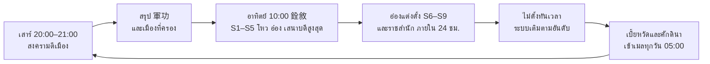

ประกาศผลเป็นแถบข่าวทั้งเซิร์ฟ และส่งเมลสรุปที่นั่งพร้อมเบี้ยหวัดให้ผู้ได้รับ

### 4.3.8 เบี้ยหวัด (俸) และศักดินา (食邑)

เบี้ยหวัดใช้ตัวเลข 斛 จากตาราง "百官受奉例" ของ 續漢書 เป็นดัชนี และจ่ายครึ่งเงินครึ่งเสบียงตามต้นฉบับ "凡諸受奉，皆半錢半穀"

- **เบี้ยหวัดรายวัน** = ค่า 斛 ของยศหรือที่นั่ง (ใช้ค่าที่สูงกว่า) × 100 ตำลึง จ่ายเป็นตำลึง 50% และเสบียงทหารผูกตัว 50% (斛 ละ 1 ห่อ)
- **ตัวอย่าง:** มหาขุนพล 350 斛 = ตำลึง 17,500 + เสบียงทหาร 350 ห่อ (มูลค่า 17,500 ตำลึง) ต่อวัน
- **ศักดินารายวัน** = ครัวเรือน × 10 ตำลึง: โหวในด่าน 2,000 · โหวตำบล 5,000 · โหวแขวง 15,000 · โหวอำเภอ 30,000 · อ๋อง 1,000,000
- **รับของ:** เข้าเมล 05:00 ทุกวัน ค้างได้ 3 วัน ไม่ลงโทษคนที่ไม่ได้เข้าทุกวัน
- **เป้าจูน:** ผู้เล่นระดับกลาง (校尉 + 名號侯) ได้รวมราว 25–35% ของตำลึงจากเควสรายวันเลเวลเดียวกัน ผู้ถือที่นั่งสูงสุดได้ราว 100–150%

ค่าที่ใช้จริงของเบี้ยหวัด ที่นั่ง ศักดินา และค่าเลื่อนบรรดาศักดิ์แบบทยอยถวาย อยู่แท็บ เศรษฐกิจและการค้า ข้อ 4.5 และ 5.3

### 4.3.9 เครื่องยศบนตัวละคร (มาตรฐานภาพ)

เครื่องยศใช้สามอย่างร่วมกัน คือ สีสายตรา จำนวนริ้วสี และรูปหัวตรา ทุกค่ามาจาก 輿服志 และ 漢舊儀 ยกเว้นค่าที่ติด `*` ตัวละครในโลกสูงแค่ 32 px native จึงแบ่งหน้าที่ดังนี้ **ในโลก** อ่านยศจากสีสายกับความยาวสาย ส่วน **ชั้น HD** (ป้ายชื่อ โปรไฟล์ พอร์เทรต หอยศ ทำเนียบ) แสดงจำนวนริ้วและรูปหัวตราครบ

**สายตรา (綬)**

| สาย (จีน) | สีหลัก (hex เสนอ) | ริ้วสี (采) ตามต้นฉบับ | ยาวต้นฉบับ | ยาวในโลก (px native = 尺 ÷ 3) | ความถี่ลายทอ (首) ในแถบ HD | ตรา / หัวตรา | ใช้กับ |
| --- | --- | --- | --- | --- | --- | --- | --- |
| สายน้ำเงินอมม่วง (青紺綬) | #26306B | 1 | 1 丈 2 尺 | 4 | 40\* | ไม่มี | หัวหน้าหมวด |
| สายเหลือง (黃綬) | #C9A227 | 1 (淳黃) | 1 丈 5 尺 | 5 | 60 | ทองแดง หัวจมูก\* | หัวหน้ากอง |
| สายดำ (黑綬 / 墨綬) | #2B2B2B | 3: 青 赤 紺 | 1 丈 6 尺 | 5 | 80 | ทองแดง หัวจมูก · 五大夫 หัวห่วง · 關外侯 หัวเต่า | หัวหน้ากองใหญ่ รองนายค่าย ขุนนางชั้นต้น โหวนอกด่าน |
| สายเขียวน้ำเงิน (青綬) | #1F6F78 | 3: 青 白 紅 | 1 丈 7 尺 | 6 | 120 | เงิน หัวเต่า | นายค่าย ขุนพลองครักษ์ |
| สายม่วง (紫綬) | #6B2E83 | 2: 紫 白 | 1 丈 7 尺 | 6 | 180 | ทอง หัวเต่า | ขุนพลขั้น 9 ขึ้นไป ที่นั่งขุนพล โหวกลางด่านขึ้นไป ราชสำนัก |
| สายเขียว (綠綬) | #556B3A | 3: 綠 紫 紺 | 2 丈 1 尺 | 7 | 240 | ทอง หัวเต่า | เสนาบดีสูงสุด |
| สายแดง (赤綬) | #B8562E | 4: 赤 黃 縹 紺 | 2 丈 1 尺 | 7 | 300 | ทอง หัวอูฐ | อ๋อง |
| สายเหลืองแดง (黃赤綬) | #D8A21E + #B8562E | 4: 黃 赤 縹 紺 | 2 丈 9 尺 9 寸 | 10 | 500 | หยก\* | ฮ่องเต้ |

- ความยาวในโลกเทียบสัดส่วนจากความยาวต้นฉบับ สายยิ่งยาวยิ่งสูงศักดิ์ คนตาบอดสีจึงยังอ่านได้ สายที่ยาวเท่ากันแยกด้วยสี
- สายกว้าง 2 px (สีหลัก + ขอบเข้มจากช่องพาเลตสายตรา) วาดตอนรันจากจุด `waist_l` รายเฟรม เป็นโซ่ 3 ข้อที่แกว่งแบบลูกตุ้มแล้วปัดลงกริด px native จึงไม่ใช้พื้นที่ atlas และใช้ได้ทุกคลิปรวมถึงบนหลังม้า ลำดับหน้าหรือหลังร่างอยู่ใน JSON ของคลิป (ข้อ 6.1)
- ริ้วสี (采) กว้างไม่พอที่ 2 px จึงแสดงในแถบสีสายหนา 6 px ใต้ป้ายชื่อ HD (ข้อ 4.3.10) และในหน้าโปรไฟล์ ค่า 首 กำหนดความถี่ลายในแถบนั้น
- ถ้ายศทหารกับบรรดาศักดิ์ให้สีต่างกัน แสดงสีที่สูงกว่า
- **ห้ามขายสีหลักและจำนวนริ้ว** ขายได้เฉพาะลายปัก เช่น ไหมทอง หยกห้อย พู่ ในโลกลายปักเป็นพู่ปลายสาย 1–2 px สีทองหรือหยก ส่วนชั้น HD แสดงลายเต็ม
- ภาพอ้างอิงตราจริง: ตราทองหัวเต่า "鎮南將軍章" ขุดพบปี 1991 ในสุสาน劉弘 (西晉) ที่อำเภออันเซียง มณฑลหูหนาน

**หมวก (冠) สวมเฉพาะชุดราชสำนัก**

| หมวก (จีน) | ที่มา | ใช้กับ | สไปรต์ (ยึดจุดหัว 5 ทิศ × 3 ท่าหัว) |
| --- | --- | --- | --- |
| หมวกขุนศึก (武冠) | ประวัติศาสตร์ "諸武官冠之" | ยศ 3–7 | ฐานร่วม กว้าง 10 px สูง 6–7 px |
| หมวกขนไก่ฟ้า (鶍冠) | ประวัติศาสตร์ "五中郎將…皆冠鶍冠" | ยศ 8 | ขนหางตั้งสองข้าง ข้างละ 2×6 px อ่านจากเงาได้ที่ 32 px |
| หมวกขุนศึกประดับจักจั่นหางเซเบิล (武冠 + 貂蟬) | แต่งใหม่ ต้นฉบับเป็นของ 侍中 และ 中常侍 | ที่นั่ง S5–S9 | ต่อยอดจาก 武冠 จักจั่นทอง 2×2 px หางเซเบิล 2×5 px |
| หมวกจิ้นเสียน (進賢冠) 1 / 2 / 3 สัน | ประวัติศาสตร์ "公侯三梁…皆一梁" | 1 สัน: บรรดาศักดิ์ 9–10 · 2 สัน: 11–13 · 3 สัน: 14 ขึ้นไป ราชสำนัก เสนาบดีสูงสุด | 3 สไปรต์ต่างจำนวนสัน สันละ 2 px เว้นช่อง 1 px |
| หมวกเอี๋ยนอิ้ว (遠遊冠) | ประวัติศาสตร์ "諸王所服" | อ๋อง | ทรงสูง 8 px |
| หมวกทงเทียน (通天冠) | ประวัติศาสตร์ "乘輿所常服" | ฮ่องเต้ และ NPC พระเจ้าเหี้ยนเต้ | สูงที่สุด 9 px |

- ชุดราชสำนักแสดงในเมืองหลักของก๊ก หน้าโปรไฟล์ ห้องแต่งตัว พิธีเลื่อนยศ และทำเนียบ จึงมีแค่คลิปเมือง (ยืน เดิน วิ่ง + คำนับ 1 คลิป) ราว 120 ช่องต่อเพศต่อชุด
- ในสนามรบใช้หมวกเกราะตามข้อ 6.1 ผู้เล่นเลือกเองว่าจะโชว์สาย 武冠 หรือสาย 進賢冠

**งบสไปรต์**

- **สายตราและถุงตรา:** ไม่ใช้พื้นที่ atlas ถุงตรา (鉞囊) เป็นจุด 2×2 px ที่ `waist_l` สีตามวัสดุหัวตรา (ทองแดง เงิน ทอง หยก)
- **หมวก:** 8 สไปรต์ × 15 ช่อง = 120 ช่องต่อเพศ (ราว 25 KB) ยึดจุดหัวและเลขท่าหัวรายเฟรม ใช้ได้ทุกอาชีพ เฟรมที่แขนหรืออาวุธอยู่หน้าหัว ใช้แพตช์หน้าหัวที่วาดทับหมวกตามข้อ 6.1
- **ธงหลังผู้ถือที่นั่ง (靠旗, ตำนาน: ขนบงิ้ว):** ชั้นของหลังสูง 10–14 px เป็นธงคู่ 2 ผืนขอบทอง ต่างจากธงหลังผืนเดียวของคนทั่วไป จึงอ่านได้จากรูปทรง ในโลกไม่มีอักษร ไอคอนภาพประจำที่นั่งแสดงบนป้ายชื่อ HD 24 px (ข้อ 4.3.10) และเป็นไอคอน HD เหนือหัวในมุมแม่ทัพ
- **ธงหลังคนทั่วไป:** ลายพันธมิตร 2 สี (พื้น + ขอบ) จากแถวพาเลต + ตราก๊กขนาดเล็ก 7×7 px (พื้นสีก๊กกับรูปทรง ◆●▲ 5×5 ไม่มีอักษร) เป็นชั้นซ้อนที่ไม่ mirror ตราพันธมิตรอักษร 2 ตัวย้ายไปป้ายชื่อ HD เพราะอักษรจีนอ่านไม่ออกบนธงสูง 10–14 px
- **ธงแม่ทัพ (牙旗):** วัตถุในโลกสูง 40–48 px ผืน 16×20 px ขอบฟันเลื่อย 2 px สีก๊กพร้อมรูปตรา ปักเป็นพร็อพหรือแบกบนหลังผู้ถือ 持節
- **ขวานทอง (黃鉞):** ชั้นของหลังของแม่ทัพใหญ่ ยาว 16 px ramp ทอง แสดงแทนธงหลังเฉพาะระหว่างสงคราม
- **ไอคอนยศ:** atlas HD 512×512 เดียว มีหัวตรา 5 ทรง × วัสดุ 3 แบบ + หยก วงสีสาย 8 แบบ และไอคอนภาพประจำที่นั่ง 12 แบบ
- **งบตอนรบ:** ร่างสงครามของผู้เล่นอื่นตัดสายตราและถุงตราออก ธงหลังทุกคนแสดงลายพันธมิตร ส่วนผู้ถือที่นั่งแสดงธงคู่ขอบทองแทน
- **ตรวจ:** ภาพเงาดำ 32 px ×1 ผู้ทดสอบต้องแยกธงคู่ขอบทองจากธงผืนเดียวได้ ≥ 90% และแยกสายยาว 4 / 6 / 10 px ได้ในภาพจำลองตาบอดสี

### 4.3.10 UI (ออกแบบที่ 1280×720 แบบ Fit Height)

ทุกหน้าจัดตาม safe area ปุ่มทุกปุ่มกว้าง ≥ 88 px ข้อความไทยหลายบรรทัดอยู่ใน DOM ที่ใส่ lang=th ส่วนข้อความบน canvas ตัดด้วย ThaiWrap ตามข้อ 2.2 ตัวละครในหน้า UI เป็นสไปรต์ชุดเดียวกับในโลก ขยายเป็นจำนวนเต็มเท่าบนพื้นหลัง HD ตามข้อ 6.1

**ป้ายชื่อใต้เท้า (ตามข้อ 2.2)**

- **บรรทัด 1:** ตรา 12 native × s และชื่อผู้เล่น Kanit 600 ขนาด 24 ขอบหมึก 2 px ใต้แถบเลือด
- **บรรทัด 2:** ยศสั้น 24 px สีครีม มีแถบสีสายหนา 6 px ใต้ข้อความ กว้างไม่เกิน 240 px ยาวเกินใช้ "…"
- **ตำแหน่ง:** ป้ายอยู่ชั้น HD ยึดจุดเท้าของสไปรต์ (px native × scale) แล้วปัดเป็นจำนวนเต็ม ป้ายจึงเลื่อนตรงจังหวะกับตัวละคร
- **เหตุผลของขนาด:** จอสูง 390 px ย่อภาพลง 0.54 เท่า ตัว 24 px จึงเหลือราว 13 px ตามขั้นต่ำข้อความไทยในข้อ 2.2
- **ลำดับเมื่อมีหลายยศ:** ที่นั่ง > บรรดาศักดิ์ > ยศทหาร
- **ผู้ถือที่นั่ง:** กรอบทองและไอคอนภาพประจำที่นั่ง 24 px (12 แบบ ไม่มีตัวอักษร) ต่อด้วยชื่อไทยที่ตัดคำ "ขุนพล" นำหน้าออก เช่น "คุมตะวันออก" ส่วนอักษรประจำที่นั่ง (征 鎮 安 平 前 後 左 右 衛 車 驃 大) อยู่ในทูลทิป
- **ตัวละครที่ถูกบัง:** แสดงเงาโครงร่างสีก๊กตามกรอบกล้อง ป้ายชื่อยังแสดงตามตารางด้านล่าง

| ขั้นซูม (ข้อ 2) | ป้ายที่แสดง |
| --- | --- |
| ใกล้ (scale + 1) | ทุกคน |
| ปกติ (วิว native ราว 640–820 × 360 px) | คนในรัศมี 12 ม. ปาร์ตี้ เป้า และผู้ถือที่นั่ง (เพดาน 30 สงคราม 15) |
| มุมแม่ทัพ (วิว × 1.5) | ไอคอนผู้ถือที่นั่ง ลำแสงแม่ทัพใหญ่ และเป้าที่ล็อกเท่านั้น |

**หน้า "หอยศ" (官爵)**

- **คอลัมน์ซ้าย 340 px:** รางยศทหารแนวตั้ง มีไอคอนตราและสีสายทุกขั้น ขั้นปัจจุบันเรืองแสง
- **กลางจอ (≥ 400 px):** สไปรต์ตัวเราขยาย ×6 (ตัวสูง 192 px) บนแท่นภาพ HD ปัดซ้ายขวาเพื่อหมุนทีละ 45° ครบ 8 ทิศ แตะเพื่อสลับชุดรบกับชุดราชสำนัก
- **คอลัมน์ขวา 340 px:** บันไดบรรดาศักดิ์ เช็กลิสต์เงื่อนไข และปุ่ม "ตั้งชื่อฐานันดร" เมื่อถึงโหวตำบล (ขั้น 14)
- **แถบบน 72 px:** ความดีความชอบสะสม · ความดีความชอบ 4 สัปดาห์และอันดับในก๊ก · นับถอยหลังถึงรอบจัดที่นั่ง
- **แถบล่าง:** ปุ่ม "เลื่อนยศ" และ "รับเบี้ยหวัด" ขนาด 220×88 px ปุ่มรับมีจุดแดงเมื่อมีของค้าง
- **ชื่อยศ:** บนจอแสดงเฉพาะชื่อไทยที่แปลความหมาย เช่น "โหวตำบลหั้นสือ" แตะหรือชี้ที่ชื่อเพื่อเปิดทูลทิป ซึ่งแสดงชื่อจีน (漢壽亭侯) · คำอ่านฉบับหนถ้ามี (หั้นสือแต่งเฮา) · คำอธิบายหนึ่งบรรทัด และลิงก์ไปสารานุกรม

**หน้า "ทำเนียบราชสำนัก" (朝堂)**

- แท็บ วุย / จ๊ก / ง่อ แถบบนสุดแสดงเสนาบดีสูงสุดประจำเซิร์ฟ
- พื้นหลังท้องพระโรง 1 ภาพ 2048×1024 เป็น WebP ใน DOM โหลดเมื่อเปิดหน้า (ภาพ HD ชั้น UI บีบอัดแบบสูญเสียได้ ต่างจากภาพ index ในโลก)
- การ์ดที่นั่ง 120×160 px ประกอบชั้นสไปรต์ของเจ้าของที่นั่งขยาย ×3 (สูง 96 px) ลง canvas ครั้งเดียวต่อ 銓敘 แล้วแคช ถ้าชีตยังโหลดไม่เสร็จใช้ไอคอนอาชีพ
- ลำดับบนลงล่าง: อ๋อง → ราชสำนัก 3 ที่ → S9–S6 → S5 → S4–S1
- หน้าแต่งตั้งของอ๋อง: ลากการ์ดจากรายชื่อ 10 อันดับไปวางบนที่นั่ง เป้าวางกว้าง ≥ 120 px
- แตะการ์ดเพื่อดูโปรไฟล์และชุดตามข้อ 6.1

**พิธีเลื่อนยศ (拜官)**

- เล่นเฉพาะนอกการต่อสู้ ถ้าเลื่อนระหว่างศึกจะเข้าคิวจนจบศึก ไม่หยุดเกม แตะเพื่อข้ามได้
- **ขั้นทั่วไป 2.5 วิ:** กล่องตราเปิด ตราหมุนเข้าจอ สายตราคลี่ตามสีและริ้ว (Spine ถ้าซื้อใบอนุญาตตามข้อ 10 ไม่เช่นนั้นใช้แอนิเมชัน CSS) แล้วขึ้นประกาศสำนวนฉบับหน เช่น "พระราชทานตราสำหรับที่ ให้ \[ชื่อ\] เปนโหวตำบล\[ชื่อตำบล\]" ชื่อจีนและคำอ่านฉบับหนอยู่ในทูลทิปของประกาศ
- **ขั้นที่นั่ง 3.5 วิ:** เพิ่มเสียงกลองศึกและแถบข่าวทั้งเซิร์ฟ

### 4.3.11 ย้ายก๊ก: "ผนึกทรัพย์ คืนตรา" (掛印封金)

การย้ายก๊กมีราคาเหมือนกวนอูคืนตราโจโฉ

- **เสียทันที:** ทุกที่นั่ง และตำแหน่งในพันธมิตร
- **ถอยลง:** บรรดาศักดิ์ที่สูงกว่าโหวตำบลถอยเป็นโหวตำบล ชื่อฐานันดรเดิมถูกปล่อยให้คนอื่นใช้
- **รีเซ็ต:** 軍功 4 สัปดาห์กลับเป็น 0 ส่วน 軍功 สะสมและยศทหารยังอยู่
- **หน้ายืนยัน:** ภาพหีบทรัพย์ลั่นกุญแจกับตราแขวนบนผนัง ติดป้าย "นิยาย"
- **ที่มา:** ประวัติศาสตร์ "羽盡封其所賜，拜書告辭" · นิยายตอน 26 "懸漢壽亭侯印於堂上" · ฉบับหน ตอน ๒๔ "เอาตราสำหรับที่ กับทรัพย์สิ่งของซึ่งโจโฉให้นั้น ใส่หีบลั่นกุญแจ"

### 4.3.12 ความต่างของแต่ละก๊ก

แต่ละก๊กต่างกันแค่ชื่อ ลำดับ และของโชว์ ไม่ต่างกันที่พลัง

| ก๊ก | ชื่อที่ต่าง | ของโชว์เฉพาะก๊ก | ที่มาของโชว์ |
| --- | --- | --- | --- |
| วุย (魏) | ราชสำนัก เสนาบดีกลาโหม (太尉) เสนาบดีฝ่ายราษฎร์ (司徒) เสนาบดีโยธา (司空) · อ๋องชื่อวุยอ๋อง | เกรด 9 ขั้นในโปรไฟล์ แสดงเป็น "ชั้น 1–9" (ชื่อจีน 上上–下下 อยู่ในทูลทิป) คิดจาก 軍功 สัปดาห์ก่อน อิงระบบคัดคนเก้าขั้น (九品官人法) ของ 陳群 ปี 220 | ประวัติศาสตร์ |
| จ๊ก (漢) | สลับชื่อ S3 กับ S4 (ในจ๊ก ขุนพลคุมภาค 四鎮 สูงกว่าขุนพลโจมตีภาค 四征 — จูล่งเลื่อนจากขุนพลโจมตีแดนใต้ 征南 เป็นขุนพลคุมตะวันออก 鎮東) · อ๋องชื่อฮันต๋งอ๋อง | ฉายาอีเวนต์ "ห้าทหารเสือ" (五虎大將) ให้ 5 คนที่ 軍功 สัปดาห์สูงสุดในบรรดาผู้ถือที่นั่ง | นิยาย: ตอน 73 "封關羽、張飛、趙雲、馬超、黃忠為五虎大將軍" ฉบับหน ตอน ๕๘ "…เปนทหารเสือ" |
| ง่อ (吳) | S9 ชื่อ มหาขุนพลสูงสุด (上大將軍 — ลกซุน "拜上大將軍、右都護") · อ๋องชื่อง่ออ๋อง | ธงกองลายตระกูลแทนอักษรแซ่ อิงระบบมอบทหารสืบตระกูล (授兵 / 世襲領兵) | ประวัติศาสตร์ |

### 4.3.13 ข้อมูล ระบบหลังบ้าน และลำดับสร้าง

ระบบยศทั้งหมดขับด้วยตารางใน Google Sheets ตามข้อ 10 โค้ดไม่ฝังตัวเลข

- **แท็บในชีต:** rank\_military · rank\_substep · rank\_seat · rank\_noble · court\_office · merit\_source · merit\_cap · salary · insignia (hex ริ้ว 首 ความยาว หัวตรา) · caps · place\_names (亭/鄉/縣 จริงตามแผนที่ 13 มณฑล พร้อมคำอ่านไทย) · honor\_names ทุกชีตยศมีคอลัมน์ name\_th (บนจอ) · name\_zh · reading\_novel (ทูลทิปและสารานุกรม)
- **เซิร์ฟเวอร์:** ห้องสงครามส่งเหตุการณ์ 軍功 เข้าคิว บันทึกทุกรายการลงตาราง merit\_log ใน PostgreSQL เพื่อตรวจโกง
- **อันดับ:** Redis sorted set ต่อก๊กสำหรับ 軍功 4 สัปดาห์และ 爵分
- **งานตั้งเวลา:** 銓敘 อาทิตย์ 10:00 (UTC+7) เบี้ยหวัดทุกวัน 05:00
- **เครือข่าย:** แพ็กเก็ตรูปลักษณ์ตามข้อ 10 เพิ่ม 6 ไบต์ ได้แก่ ยศทหาร 1 ที่นั่ง 1 บรรดาศักดิ์ 1 ชื่อฐานันดร 2 นามเกียรติ 1
- **รวมเซิร์ฟ:** ล้างที่นั่งทั้งหมด จัดใหม่อาทิตย์ถัดไป ชื่อฐานันดรซ้ำ ให้คนที่ได้ก่อนเก็บไว้ อีกคนได้บัตรเปลี่ยนชื่อฟรี

| เฟส (ข้อ 12) | ส่วนของระบบยศที่ต้องเสร็จ |
| --- | --- |
| 0. ต้นแบบ | สายตราวาดตอนรัน 1 ชิ้น (โซ่ 3 ข้อจากจุด waist\_l ข้อ 4.3.9) ป้ายชื่อ HD 2 บรรทัดใต้เท้า ทดสอบการอ่านที่ขั้นปกติ มุมแม่ทัพ และขั้นใกล้บนมือถือจริง |
| 1. MVP | ยศทหารขั้น 1–6 · 軍功 จากเควส บอส และ PK · หน้าหอยศ · พิธีเลื่อนยศ |
| 2. สังคมและเงิน | บรรดาศักดิ์ขั้น 1–13 · เบี้ยหวัด · ไหมสายตรา · ลายปักสายตรา |
| 3. สงคราม | 軍功 สงคราม · ยศ 7–11 · ที่นั่ง 24 ที่ · 節 และแม่ทัพใหญ่ · 銓敘 · อ๋อง เสนาบดีสูงสุด ราชสำนัก · โหวตำบลถึงโหวอำเภอ |
| 5. SEA | ฉายาฮ่องเต้ข้ามเซิร์ฟ |

ตัวเลขทั้งหมดเป็นค่าตั้งต้นสำหรับทดสอบ จูนใน Google Sheets ตามข้อ 10

แหล่งอ้างอิง: [續漢書 百官志一 (後漢書 卷114)](https://zh.wikisource.org/wiki/後漢書/卷114) · [續漢書 百官志五 (後漢書 卷118)](https://zh.wikisource.org/wiki/後漢書/卷118) · [續漢書 輿服志下 (後漢書 卷120)](https://zh.wikisource.org/wiki/後漢書/卷120) · [漢書 百官公卿表 (卷19)](https://zh.wikisource.org/zh-hans/漢書/卷019) · [三國志 卷1 武帝紀](https://zh.wikisource.org/wiki/三國志/卷01) · [三國志 卷36 關張馬黃趙傳](https://zh.wikisource.org/wiki/三國志/卷36) · [通典 卷36 魏官品](https://zh.wikisource.org/zh-hant/通典/卷036) · [晉書 卷24 職官志](https://zh.wikisource.org/wiki/晉書/卷024) · [太平御覽 卷683 (อ้าง 漢舊儀)](https://zh.wikisource.org/wiki/太平御覽/0683) · [สามก๊ก ฉบับเจ้าพระยาพระคลัง (หน) ตอนที่ ๒๓](https://vajirayana.org/สามก๊ก/ตอนที่-๒๓)

## 4.4 ค่ายกลและกองทหาร

ทหารของผู้เล่น 1 กองคือ 1 เอนทิตีบนเซิร์ฟเวอร์ ส่วนค่ายกลคือรูปทรงของกองที่มองเห็นได้ พร้อมตัวปรับค่าและการแพ้ทาง ชื่อค่ายกลมาจาก《孫臏兵法》《孫子》และบันทึกเรื่องขงเบ้ง ไม่ใช้ชุดชื่อ 魚鱗 鶴翼 鋒矢 偃月 เพราะเป็นชื่อที่ตั้งในญี่ปุ่นสมัยเฮอัน และเป็นชุดที่เกมของ Koei ใช้

**หลักการ**

- ทหารแต่ละนายเป็นแค่ภาพบนเครื่องผู้เล่น เซิร์ฟเวอร์รู้แค่ตำแหน่งกอง HP รวม ขวัญ ท่าที และค่ายกล
- ค่ายกลต้องอ่านออกด้วยตาในมุมแม่ทัพ (วิว ×1.5) ไม่ใช่บัฟตัวเลขเล็กๆ
- แพ้ทางมี 2 ชั้น สายทหารเลือกก่อนศึก ส่วนค่ายกลสลับกลางศึกและวัดฝีมือ
- ค่ายกลมีผลกับทหารเท่านั้น ยกเว้นวงกลมที่ช่วยกันการยิงให้ผู้เล่นที่ยืนในวง
- อารีนา PvP ไม่มีทหาร ทหารใช้ในแผนที่ฟาร์ม ดันเจี้ยนบางด่าน และสงคราม
- ทหารเอกทุกแบบมีงบพลังเท่ากัน ต่างกันแค่กลไก ของที่ขายได้มีแค่สกินกองและธง
- ทุกชื่อมีป้ายที่มาในการ์ดความรู้: ประวัติศาสตร์ / นิยาย / ตำนาน / แต่งใหม่
- ชื่อไทยใช้ตามฉบับเจ้าพระยาพระคลัง (หน) เมื่อมี ที่เหลือเป็นชื่อเสนอ

### ยศบังคับทหาร

ยศทหารใช้บันได 11 ขั้นในข้อ 4.3.1 เป็นแกนเดียวของทั้งเกม ยศกำหนดกำลังพลที่แสดง ตัวคูณกอง และค่ายกลที่ปลดได้ ข้อนี้ไม่ตั้งชื่อยศซ้ำ

| ยศ (ข้อ 4.3.1) | ค่ายกลที่ปลด | ช่องค่ายกล |
| --- | --- | --- |
| 3 หัวหน้าหมวด (隊率) | จัตุรัส, งูฉางซาน | 1 |
| 4 หัวหน้ากอง (屯長) | วงกลม, กระจาย | 1 |
| 5 หัวหน้ากองใหญ่ (軍候) | หัวลิ่ม, ห่านบิน | 2 |
| 7 นายค่าย (校尉) | ปีกตะขอ, แน่นหนา | 2 |
| 8 ขุนพลองครักษ์ (中郎將) | ธงลวง | 2 |
| 10 รองขุนพล (偏將軍) | แปดทิศ (ต้องผ่านด่านอิปักโป้) | 2 |

- กองทหารปลดด้วยเควสเกณฑ์ทหารที่ Lv 10 พร้อมยศขั้น 1 หัวหมู่ (伍長)
- ความดีความชอบ (軍功) ได้ตามตารางข้อ 4.3.5 และซื้อไม่ได้ทุกช่องทาง
- แม่ทัพใหญ่และรองแม่ทัพเป็นบทบาทในศึก (ข้อ 4.3.6 และ 7) ไม่ใช่ยศ

### โครงสร้างกอง

กองทหารเป็นตัวเสริม ผู้เล่นยังเป็นตัวเอกของการต่อสู้

| ค่า | ค่าตั้งต้น | หมายเหตุ |
| --- | --- | --- |
| HP รวมกองเต็ม | 150% ของ HP ผู้เล่นเลเวลเดียวกัน | ที่ชั้น T1 ขั้นเกลา 0 |
| DPS รวมกอง | 40% ของผู้เล่น | ที่ชั้น T1 ขั้นเกลา 0 |
| ตัวคูณชั้น | T0 0.6 · T1 1.0 · T2 1.25 · T3 1.5 · T4 1.8 · T5 2.1 | คูณทั้ง HP และ DPS และคูณกับตัวคูณกองตามยศ (ข้อ 4.3.1) ผลคูณรวมหนีบไว้ไม่เกิน ×3.5 |
| เลเวลทหาร | ไม่เกินเลเวลผู้เล่น | ใช้ตำลึงตามข้อ 4.1 เดิม |
| ขั้นเกลา 1–10 | +3% ต่อขั้น | ใช้ตราทัพ ติดไปทุกชั้น |
| กำลังพลที่แสดง (นาย) | กำลังพลเต็มตามยศ (ข้อ 4.3.1) × % HP กอง | จำนวนตัวที่วาดจริงตามตารางข้อ 4.3.1 ทหารตายเติมด้วยเสบียงทหารนอกการต่อสู้ |
| ขวัญทัพ | 0–100 | ต่ำกว่า 20 = หวั่น: ATK −15% และปิดผลกันล้มของค่ายกลแน่นหนา |
| ดาเมจทหารใส่ผู้เล่น | 60% ของที่ทำกับทหาร | ทหารเลือกตีกองทหารก่อน ยกเว้นสั่งบุกเป้าที่ล็อก |

สถานะบนกองใช้ชุดเดียวกับสกิลผู้เล่น

- ล้ม: หยุดตี 0.8 วิ
- เกราะแตก: DEF −20% และปิดโบนัสค่ายกล 4 วิ
- ติดไฟ ตรึง เลือดออก: ทำงานเหมือนบนตัวผู้เล่น
- ลอย: กองทหารไม่ลอย ระบบแปลงเป็นล้มแทน เพราะชีตทหารมีแค่ 6 คลิปและไม่มีท่าลอย (ข้อ 4.4)
- สถานะที่กองของเราทำให้ศัตรูติด นับให้คอมโบสกิลของเราและเพื่อน (คอมโบทัพ-ขุนพล) เช่น ม้าหัวลิ่มชาร์จจนล้ม แล้วจอมดาบกดสกิลที่กินสถานะล้ม

### สายทหารและการเลื่อนชั้น

ทหารมี 4 สายตามอาชีพ เลื่อนชั้น 5 ครั้งที่ Lv 12/36/56/72/92 ตามจังหวะของเกมอ้างอิง แต่หยุดที่ชั้นทหารเอก T5 เพื่อคุมงานอาร์ต

| สาย | อาชีพ | ดาเมจหลัก | ระยะตี (ม.) | ความเร็ว (ม./วิ) | แพ้ทาง |
| --- | --- | --- | --- | --- | --- |
| ทวนโล่ | ขุนศึก | แทง | 3 | 5.0 | ชนะม้า แพ้ธนู |
| ม้า | จอมดาบ | ฟัน + ชาร์จ | 2.5 | 8.4 | ชนะธนู แพ้ทวนโล่ |
| ธนู/หน้าไม้ | นักธนู | ยิง | 22 | 5.0 | ชนะทวนโล่ แพ้ม้า |
| กลยุทธ์ | กุนซือ | ไฟ + ทุบ (หิน) | 18 (จักรยนตร์ 45) | 4.5 | นอกวง: รับดาเมจ +15% ดาเมจต่อสิ่งก่อสร้างในสงครามตามข้อ 7.2 |

| ชั้น | Lv | ทวนโล่ | ม้า | ธนู/หน้าไม้ | กลยุทธ์ | ภาพที่เปลี่ยน |
| --- | --- | --- | --- | --- | --- | --- |
| T0 | 10 | ทหารเกณฑ์ (募兵) ใช้ร่วมทุกสาย | ใช้ร่วม | ใช้ร่วม | ใช้ร่วม | ผ้าพื้น ไม่มีเกราะ |
| T1 | 12 | ทหารทวน (長矛兵) | ม้าเบา (輕騎) | พลธนู (弓手) | พลกลองธง (鼓旗手) | ผ้า + ผ้าโพกสีก๊ก |
| T2 | 36 | ทหารเกราะ (甲士) | ม้าศึก (騎士) | พลหน้าไม้ (弩手) | พลเครื่องกล (器械兵) | เกราะหนัง |
| T3 เลือก 1 | 56 | โล่ใหญ่ (楯士) / ง้าวเกี่ยว (戟士) | ม้าทะลวง (突騎) / ม้ายิงธนู (騎射) | หน้าไม้หนัก (彊弩) / ธนูไฟ (火矢) | พลจักรยนตร์ (發石) / นักพรต (方士) | เกราะเกล็ด + อาวุธตามกิ่ง |
| T4 | 72 | กองเดินเท้าหลวง (步兵營) | ม้าหลวง (越騎) | พลธนูฟังเสียง (射聲士) | กองช่างศึก (器械營) | หมวกพู่ + ธงทหารหลวง |
| T5 | 92 | ทหารเอกประจำก๊กหรือแคว้น | ทหารเอก | ทหารเอก | ทหารเอก | ชุดทหารเอกเต็มชุด |

- ชื่อ T4 สามสายแรกมาจากกองทหารหลวง 北軍五校 ใน《百官志》 ส่วนกองช่างศึก (器械營) เป็นชื่อแต่งใหม่
- ชั้น T0 ใช้คำ 募兵 ที่มีในบันทึกยุคนั้น ไม่ใช้ 鄉勇 ซึ่งเป็นคำสมัยหมิง-ชิง
- นักพรต (方士) ติดป้ายนิยาย เพราะเวทในสนามรบเป็นชั้นนิยาย
- เลื่อนชั้นใช้เลเวล + เควส 1 ด่าน + ตราเลื่อนชั้น (T2 1 อัน, T3 3 อัน, T4 6 อัน, T5 10 อัน)
- เปลี่ยนกิ่ง T3 ได้ฟรีเมื่อเปลี่ยนสายสกิล
- ทุกชั้นใช้โมเดลฐานเดียวต่อสายใน Blender สลับหมวก อาวุธ โล่ ธง แล้วเรนเดอร์เป็นชีตชั้นเดียว สีก๊กมาจากแถว remap ของพาเลต (ข้อ 6.1)

### ค่ายกล 10 แบบ

ค่ายกลที่เล่นได้มี 10 แบบ 8 แบบมาจาก《孫臏兵法·十陣》 อีก 2 แบบคืองูฉางซานจาก《孫子》และแปดทิศของขงเบ้ง ตำราบอกหน้าที่ของค่ายกลไว้สั้นๆ เกมจึงแปลงหน้าที่นั้นเป็นกลไก

| ค่ายกล (จีน) | กลุ่ม | ยศ | คำจากตำรา | รูปทรง / ระยะห่าง (ม.) | ผลดี | ผลเสีย | ความหนาแน่น | ที่มา |
| --- | --- | --- | --- | --- | --- | --- | --- | --- |
| จัตุรัส (方陣) | ตั้งรับ | 3 | 「方陣者，所專也」 กลางบางขอบหนา ผู้บัญชาการอยู่หลัง | ตาราง 1.2 | DEF +10%, รับดาเมจด้านหน้า −10% | วิ่ง −5% | 1.0 | ประวัติศาสตร์ |
| งูฉางซาน (常山蛇勢) | เดินทัพ | 3 | 「擊其首則尾至，擊其尾則首至」 | แถวตอน 3 นาย | วิ่ง +25%, เปลี่ยนเข้าออก 1 วิ, ด้านหลังนับเป็นด้านข้าง | DEF −20%, ตีไม่ได้ขณะวิ่ง | 0.8 | ประวัติศาสตร์ (ชื่อ) + แต่งใหม่ (รูปทรง) |
| วงกลม (圓陣) | ตั้งรับ | 4 | 「圓陣者，所以團也」 | วงแหวนรอบผู้เล่นหรือธง | ไม่มีด้านข้างและหลัง, ผู้เล่นในวงรับดาเมจยิง −15% | วิ่ง −20%, ชาร์จไม่ได้ | 1.1 | ประวัติศาสตร์ |
| กระจาย (疏陣) | กระจาย | 4 | 「其甲寡而人之少也，是故堅之」 | ตาราง 2.4 | ดาเมจพื้นที่ −35%, ไฟไม่ลามในกองนี้ | ประชิด +15%, โดนชาร์จ +25% | 0.6 | ประวัติศาสตร์ |
| หัวลิ่ม (錐行之陣) | บุกทะลวง | 5 | 「所以決絕也」 เหมือนดาบ ปลายไม่แหลมก็แทงไม่เข้า | สามเหลี่ยม 1-2-3-4 | ชาร์จดาเมจ +25% และล้ม 0.8 วิ | ด้านข้างและหลังรับเพิ่มอีก +20% | 1.0 | ประวัติศาสตร์ |
| ห่านบิน (雁行之陣) | ยิง | 5 | 「所以接射也」 | แถวเฉียงขั้นบันได | ระยะยิง +15% (ยิงผู้เล่นติดเพดานข้อ 4.1), ดาเมจยิง +10% | ประชิด +15% | 0.75 | ประวัติศาสตร์ |
| ปีกตะขอ (鉤行之陣) | โอบล้อม | 7 | 「前列必方，左右之和必鉤」 | แนวหน้าตรง ปีกงอ 45° | ตีด้านข้างและหลัง +20%, ศัตรูในโค้ง 8 ม. ช้าลง 15% | DEF ด้านหน้า −10% | 0.9 | ประวัติศาสตร์ |
| แน่นหนา (數陣) | ตั้งรับ | 7 | 「為不可掇」「積刃而伸之」 | ตาราง 0.9 โล่แถวหน้า | DEF +20%, ตั้งมั่นแล้วไม่ล้ม ไม่ถูกผลัก ไม่ถูกดึง, สะท้อนดาเมจชาร์จ 10% | วิ่ง −30%, ดาเมจพื้นที่ +20% | 1.25 | ประวัติศาสตร์ |
| ธงลวง (玄襄之陣) | พิเศษ | 8 | 「所以疑眾難故也」「必多旌旗羽旄」 | จัตุรัส + ธง 6 ผืน | ศัตรูในรัศมี 12 ม. ATK −10% ขวัญขึ้นช้าลง 30%, ศัตรูเห็นจำนวนทหารเราเป็นเครื่องหมายคำถาม | DEF −10% | 1.0 | ประวัติศาสตร์ |
| แปดทิศ (八陣) | พิเศษ | 10 + ด่านอิปักโป้ | 「推演兵法，作八陣圖」; 晉書「壘石為八行」 | 8 กลุ่มย่อยรอบจุดกลาง | ไม่มีด้านข้างและหลัง, ไม่โดนแพ้ทางชั้นค่ายกล, ดาเมจ +5% | เปลี่ยนเข้า 3 วิ, คูลดาวน์ 20 วิ | 0.9 | ประวัติศาสตร์ (ชื่อ) + แต่งใหม่ (กลไก) |

- 《孫臏兵法》มาจากแผ่นไม้ไผ่ที่ตัวอักษรขาดหาย ประโยคหน้าที่ของค่ายกลกระจายหายไป เกมจึงใช้ประโยคจากหัวข้อวิธีตั้งค่ายกลแทน
- ค่ายกลจัตุรัสมีใช้จริงในยุคนั้น ที่ศึกเจี้ยเฉียว (界橋) กองซุนจ้าน「步兵三萬餘人爲方陣，騎爲兩翼」
- กลไกจริงของแปดทิศไม่มีบันทึก《三國志》มีแค่ชื่อ ส่วน《晉書》บอกว่าเป็นกองหิน 8 แถว ห่างกันแถวละ 2 จั้ง
- ค่ายกลเฉพาะแผนที่ในเฟส 5 มี 2 แบบ: เพลิง (火陣)「所以拔也」ให้กองกลยุทธ์วางแนวเชื้อเพลิงตามคำว่า「五步積薪」 และวารี (水陣)「必眾其徒而寡其車」ให้บัฟเมื่ออยู่บนเรือหรือน้ำตื้น

### กติการ่วมของค่ายกล

ค่ายกลกับท่าทีแยกกัน ท่าทีบอกว่า AI ทำอะไร ส่วนค่ายกลบอกรูปทรงและตัวเลข

- ทิศการโจมตี: ด้านหน้า ±60° ปกติ, ด้านข้าง 60–120° รับเพิ่ม +15%, ด้านหลังเกิน 120° รับเพิ่ม +25%
- ชาร์จ: ต้องตั้งท่าทีบุกและวิ่งตรงอย่างน้อย 8 ม. ที่ความเร็วอย่างน้อย 80% เซิร์ฟเวอร์ตรวจจากประวัติความเร็วของกอง
- สลับค่ายกล: เลือก 2 แบบก่อนศึก สลับแล้วคูลดาวน์ 10 วิ ระหว่างเปลี่ยนแถว 2 วิ กองรับดาเมจ +20% ชาร์จไม่ได้ และโบนัสค่ายกลปิด
- แปดทิศเป็นข้อยกเว้น ใช้เวลาเปลี่ยน 3 วิ และคูลดาวน์ 20 วิ
- คู่ที่เสริมกัน: หัวลิ่ม + บุก = ชาร์จได้, แน่นหนา + ตั้งมั่น = ไม่ล้ม, วงกลม + ตาม = ล้อมผู้เล่น
- ออโต้ฟาร์มใช้ค่ายกลช่อง A ตลอดและไม่สลับเอง ในสงครามผู้เล่นต้องสลับเองทั้งหมดตามกฎออโต้
- มอนสเตอร์ทุกตัวติดป้ายสาย (ทวนโล่ / ม้า / ธนู / ไม่มี) วงแพ้ทางชั้นสายจึงใช้ใน PvE ด้วย ส่วนชั้นค่ายกลใช้เฉพาะกองตีกอง
- ผลล้ม ตรึง และสถานะคุมอื่นจากกองทหารและคำสั่งทัพใช้เต็มค่ากับกองทหารและมอน ต่อผู้เล่นแปลงเป็นสะดุดหรือชะลอและไม่เพิ่มแต้มคุม ตามข้อ 4.1

### วงจรแพ้ทาง 2 ชั้น

แพ้ทางแบ่งเป็นชั้นสายทหารกับชั้นค่ายกล และมีเพดานรวม เพื่อไม่ให้การเลือกก่อนศึกตัดสินผลแทนฝีมือ

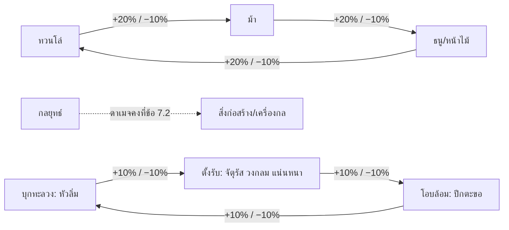

- ชั้นสายทหาร: ฝ่ายได้เปรียบทำดาเมจ +20% และรับดาเมจ −10% กลยุทธ์ตีทหาร −10% ส่วนดาเมจต่อสิ่งก่อสร้างในสงครามเป็นค่าคงที่ตามข้อ 7.2 (ทหารกลยุทธ์ 60 ต่อวิ ทหารทั่วไป 20 ต่อวิ) ตัวคูณสิ่งก่อสร้าง ×2 ×2.5 ×3 ในข้อนี้ใช้เฉพาะ PvE
- ชั้นค่ายกล: ฝ่ายได้เปรียบ +10% / −10% ค่ายกลกระจาย ห่านบิน งูฉางซาน ธงลวง และแปดทิศอยู่นอกวง
- หัวลิ่มชนะตั้งรับตามหน้าที่「所以決絕也」 คือตัดแนว
- ปีกตะขอชนะหัวลิ่มตาม《孫臏兵法·十問》 ที่สอนตีค่ายกลแหลมด้วยการแบ่งทัพเป็นสามแล้ว「延而衡」 คือแผ่แนวโอบ
- ตั้งรับชนะปีกตะขอเป็นกติกาเกม เพราะแนวตั้งรับไม่มีช่องให้โอบ และปีกตะขอเสีย DEF ด้านหน้า
- เพดาน: ผลคูณของสาย × ค่ายกล × ทิศ ถูกหนีบไว้ที่ 0.75–1.6
- ค่าเดิม +25% ถูกลดลง เพราะถ้าซ้อนกับค่ายกลและทิศจะเกิน ×1.8 เกมเทียบ 三國志·戰略版 ผู้เล่นคำนวณไว้ราว 15% ต่อทาง

```latex
\text{ดาเมจกองตีกอง} = \text{ATK}_{\text{กอง}} \times \text{ตัวคูณท่า} \times \left(1 - \frac{\text{DEF}}{\text{DEF} + K}\right) \times M_{\text{สาย}} \times M_{\text{ค่ายกล}} \times M_{\text{ทิศ}} \times D
```

K ใช้ค่าเดียวกับสูตรกลางข้อ 4.1 และ D คือความหนาแน่นในตารางค่ายกล ใช้คูณเฉพาะดาเมจพื้นที่ ดาเมจเป้าเดียวใช้ D = 1

### ทหารเอกประจำก๊ก (T5, Lv 92)

ทหารเอกทุกแบบมีตัวคูณ 2.1 เท่ากัน ต่างกันแค่ลักษณะพิเศษ 1 อย่างกับคำสั่งพิเศษ 1 คำสั่ง ก๊กที่ไม่มีหน่วยตรงสายในบันทึก ใช้หน่วยจริงที่ใกล้ที่สุดแล้วติดป้ายแต่งใหม่ที่ส่วนที่ดัดแปลง

| ก๊ก | สาย | ทหารเอก (จีน) | ที่มา | หลักฐาน | ลักษณะพิเศษ | คำสั่งพิเศษ (ขวัญ) |
| --- | --- | --- | --- | --- | --- | --- |
| วุย | ทวนโล่ | ทหารเฉงจิ๋ว (青州兵) | ประวัติศาสตร์ + นิยาย | 武帝紀「收其精銳者，號為青州兵」 และแตกหนีเมื่อม้าลิโป้บุก | ทหาร +20%, เติมเสบียงถูกลง 30%, ขวัญต่ำกว่า 30 เสียโบนัสชนะม้า | รวบรวมเชลย (收編) 25: ภายใน 8 วิ ถ้ากองศัตรูในรัศมี 15 ม. แตก ฟื้นทหาร 10% |
| วุย | ม้า | ทหารม้าเสือดาว (虎豹騎) | ประวัติศาสตร์ | 曹純傳 注引《魏書》「皆天下驍銳」 ไม่มีในนิยาย | ระยะชาร์จ +30%, ดาเมจใส่เป้าที่ถอยหนี +25% | ไล่ตะลุย (長驅) 25: พุ่ง 25 ม. ใส่เป้าที่ล็อก ชนแรกล้ม 1.2 วิ |
| วุย | ธนู | กองแปดร้อยของจ๊กยี่ (麴義 先登八百) | ประวัติศาสตร์ (ย้ายจากอ้วนเสี้ยวมาวุย = แต่งใหม่) | 英雄記「義兵皆伏楯下不動…彊弩雷發，所中必倒」 | ตั้งมั่นแล้วรับดาเมจชาร์จ −50% ม้าที่ชาร์จเข้ามาติดตรึง 1 วิ | หมอบโล่ยิงพร้อม (伏楯齊發) 30: หมอบ 2 วิ รับดาเมจยิง −70% แล้วยิง ×2 ในแนว 25 ม. |
| วุย | กลยุทธ์ | กองจักรยนตร์ (霹靂車) | ประวัติศาสตร์ | 袁紹傳「太祖乃為發石車，擊紹樓，皆破，紹眾號曰霹靂車」 | ยิงไกล 45 ม. (ใกล้สุด 10 ม.), ในสงครามดาเมจต่อหอรบ เครื่อง และประตูเท่าจักรยนตร์ตามข้อ 7.2 (PvE ×2.5), ตั้งยิง 3 วิ | สายฟ้า (霹靂) 35: หิน 3 ลูกในวง 8 ม. ทำให้ล้ม |
| จ๊ก | ทวนโล่ | ทหารพู่ขาว (白毦兵) | ประวัติศาสตร์ | จดหมายขงเบ้ง「先主帳下白眊，西方上兵也」 ใน《諸葛亮集》ฉบับรวบรวมสมัยชิง | ผู้เล่น HP ต่ำกว่า 40% กองล้อมวงเอง 5 วิ ผู้เล่นรับดาเมจประชิด −30% (คูลดาวน์ 60 วิ) | คุ้มนาย (護主) 20: ยั่วศัตรูรอบผู้เล่น 8 ม. มาตีกอง 4 วิ |
| จ๊ก | ม้า | ทหารม้าขาวอาสา (白馬義從) | ประวัติศาสตร์ (ย้ายจากกองซุนจ้านมาจ๊ก = แต่งใหม่) | 英雄記「選騎射之士，號為白馬義從」 ที่界橋เป็นกองกลาง「左射右，右射左」 | ยิงขณะวิ่ง 15 ม., วิ่ง +10%, ไม่มีชาร์จล้ม | ม้าขาวนำทัพ (白馬先鋒) 20: กองม้าพันธมิตรในรัศมี 20 ม. วิ่ง +15% 6 วิ |
| จ๊ก | ธนู | พลหน้าไม้กล (連弩士) | ประวัติศาสตร์ | 華陽國志「發其勁卒三千人為連弩士」 และหน้าไม้元戎「一弩十矢俱發」 | ชุดยิงที่ 4 ทุกรอบยิง 10 ดอกพร้อมกัน, ระยะสั้นลงเหลือ 18 ม. | หน้าไม้สิบลูก (元戎) 30: ยิงรัว ×3 นาน 3 วิ |
| จ๊ก | กลยุทธ์ | วัวไม้ม้าเลื่อน (木牛流馬) | ประวัติศาสตร์ + นิยาย | 諸葛亮傳「木牛流馬，皆出其意」 นิยายขยายเป็นกลไกอัศจรรย์ | กองพันธมิตรในรัศมี 15 ม. ฟื้นทหาร 2% ทุก 5 วิ (เพดาน 30% ต่อศึกต่อกอง) ขวัญ +1 ต่อวิ | ขนเสบียง (運糧) 30: วางคลังเสบียง 20 วิ |
| ง่อ | ทวนโล่ | ทหารเสือข้างราชรถ (車下虎士) | ประวัติศาสตร์ | 甘寧傳「唯車下虎士千餘人…從權逍遙津北」 | อยู่ห่างผู้เล่นไม่เกิน 6 ม. DEF +20%, รับดาเมจชาร์จแทนผู้เล่น 50% | คุ้มราชรถ (護駕) 25: วิ่งมาตั้งค่ายกลแน่นหนารอบผู้เล่น 5 วิ |
| ง่อ | ม้า | กองคลายกังวล (解煩軍) | ประวัติศาสตร์ (เป็นทหารม้า = แต่งใหม่) | 胡綜傳「立解煩兩部」「輕行掩襲」 | อยู่ในงูฉางซานและห่างศัตรูเกิน 20 ม. จะไม่ขึ้นแผนที่ย่อศัตรู การตีแรก +30% และเกราะแตก | ร้อยม้าปล้นค่าย (百騎劫營) 30: พุ่ง 30 ม. ใส่ค่ายหรือเครื่องกล ดาเมจ ×2 |
| ง่อ | ธนู | กองใบเรือแพรของกำเหลง (錦帆) | ประวัติศาสตร์ + นิยาย | 甘寧傳「負毦帶鈴，民聞鈴聲，即知是寧」; 吳書「以繒錦維舟」; ชื่อ 錦帆賊 มาจากนิยายตอน 38 | ศัตรูในรัศมี 20 ม. ได้ยินกระดิ่ง ขวัญขึ้นช้าลง 30%, คริระยะไกล +15%, ขึ้นเรือได้ | ยิงแม่น (善射) 25: ยิงเป้าเดียว ×3 ทะลุเกราะ 50% |
| ง่อ | กลยุทธ์ | เรือไฟมงชง (蒙衝火船) | ประวัติศาสตร์ + นิยาย | 周瑜傳「取蒙沖鬥艦數十艘，實以薪草，膏油灌其中」「時風盛猛」 | ทุกการโจมตีทำให้ติดไฟ ไฟลามไปกองที่ห่างไม่เกิน 2 ม. | เรือไฟ (火船) 35: ลากเล็งแนว 20 ม. ปล่อยเรือหรือรถไฟวิ่งชนแล้วระเบิด |

- ร้อยม้าปล้นค่าย: บันทึก《江表傳》บอกว่ากำเหลงนำ「健兒百餘人」 ไม่ได้บอกว่าขี่ม้า คำว่าร้อยม้า (百騎) มาจากชื่อนิยายตอน 68
- ทหารเอกของ 3 ก๊กเปลี่ยนตามก๊กเมื่อย้ายก๊ก ความคืบหน้าเลื่อนชั้นไม่หาย

### ทหารเอกแคว้น

ทหารเอกแคว้นเป็นทางเลือกแทน T5 ใช้ได้ทุกก๊กในสายเดียวกัน ปลดถาวรได้ 2 ทาง คือผ่านดันเจี้ยนแคว้นนั้นแบบ 3 ดาว หรือมีแต้มร่วมรบตอนพันธมิตรยึดเมืองนั้นได้ การถือเมืองไม่เพิ่มพลังต่อเนื่อง ปล่อยเดือนละ 1 แบบ

| ทหารเอก (จีน) | สาย | แคว้น / ด่าน | ที่มา | หลักฐาน | ลักษณะพิเศษ |
| --- | --- | --- | --- | --- | --- |
| กองทะลวงค่ายของโกซุ่น (陷陣營) | ทวนโล่ | แห้ฝือ (下邳) | ประวัติศาสตร์ | 呂布傳 注引《英雄記》「所將七百餘兵，號為千人…名為陷陣營」 | ทหาร −20%, DEF +20%, ปะทะแรกทำให้เกราะแตก (คูลดาวน์ 15 วิ) |
| ทหารง้าวใหญ่ (大戟士) | ทวนโล่ | เงียบกุ๋น (鄴) แคว้นกิจิ๋ว | ประวัติศาสตร์ | 英雄記「惟帳下彊弩數十張，大戟士百餘人自隨」 | ตีแล้วเกี่ยวดึงศัตรู 1.5 ม., ชนะม้าเพิ่มอีก +10% |
| ชาวโล่กระดาน (板楯蠻) | ทวนโล่ | แคว้นปา (巴) | ประวัติศาสตร์ | 後漢書「天性勁勇，初為漢前鋒，數陷陳」 และที่มาของระบำ《巴渝舞》 | หลังชาร์จเต้นรำศึก 2 วิ กองพันธมิตรในรัศมี 15 ม. ATK +10% 8 วิ |
| ทหารตันเอี๋ยง (丹楊兵) | ทวนโล่ | ตันเอี๋ยง (丹楊) | ประวัติศาสตร์ | 先主傳「謙以丹楊兵四千益先主」; 諸葛恪傳「山出銅鐵，自鑄甲兵。俗好武習戰」 | ปีนบันไดกำแพงเร็วขึ้น 50%, ไม่ช้าลงในภูเขาและป่า |
| ทหารตีนกะเป๋ง (藤甲兵) | ทวนโล่ | อีเวนต์เจ็ดจับเจ็ดปล่อย | นิยาย | นิยายตอน 90「刀箭皆不能入」「見火必著」 ฉบับไทยตอน 69 เรียกทหารตีนกะเป๋งของลุดตัดกุด เมืองออโกก๊ก | ดาเมจยิงและฟัน −40%, ไฟ +100%, เดินข้ามน้ำตื้นได้ |
| ม้าหมาป่าเป๊งจิ๋ว (并州狼騎) | ม้า | เป๊งจิ๋ว (并州) | ตำนาน | ไม่พบคำ 狼騎 ใน《三國志》卷7 และในนิยาย มีแค่ลิโป้「便弓馬，膂力過人」 | ดาเมจใส่เป้าที่ไม่มีพวกในระยะ 10 ม. +20% |
| ทัพเหินไร้ผู้ต้าน (無當飛軍) | ธนู | ฮันต๋ง (漢中) | ประวัติศาสตร์ (อาวุธหน้าไม้ = แต่งใหม่) | 華陽國志「為五部，所當無前，號為飛軍」; 漢晉春秋「無當監何平」 | ไม่ช้าลงในที่ขรุขระ, ยิงจากที่สูง +15% |

### หน่วยจากบันทึกที่ใช้เป็นศัตรูหรือ NPC

หน่วยที่ไม่เหมาะเป็นทหารของผู้เล่นใช้เป็นศัตรูหรือตัวประกอบ เพื่อให้เนื้อหาอิงบันทึกโดยไม่เพิ่มงานบาลานซ์

- องครักษ์ทหารเสือ (虎士) ของเคาทู และองครักษ์ของเตียนอุย: เป็น NPC รอบบอสเคาทูในบอสโลกหรือสงคราม อิง許褚傳「諸從褚俠客，皆以為虎士」 และ典韋「將親兵數百人，常繞大帳」
- ชาวเขาซานเยว่ (山越): มอนสเตอร์ในแผนที่ฝั่งง่อ ถือเกราะที่หลอมเอง อิง諸葛恪傳 และเป็นเนื้อเรื่องเควสปลดทหารตันเอี๋ยง
- บกลกไต้อ๋อง (木鹿大王): บอสอีเวนต์เจ็ดจับเจ็ดปล่อย ขี่ช้างเผือก เรียกเสือ หมาป่า และงูมาเป็นลูกสมุน ติดป้ายนิยาย ไม่ทำเป็นกองทหารช้างให้ผู้เล่น

### คำสั่งทัพ

ปุ่มคำสั่งทัพ 88 px ใส่คำสั่งได้ 2 ช่อง เลือกจากคลัง 4 คำสั่ง คือคำสั่งอาชีพ 2 คำสั่งเดิม (ปลดที่ Lv 15 และ 50) คำสั่งกิ่ง T3 1 คำสั่ง และคำสั่งทหารเอก 1 คำสั่ง เปลี่ยนช่องได้เฉพาะนอกการต่อสู้

| กิ่ง T3 | คำสั่ง (จีน) | ขวัญ | ผล | ที่มา |
| --- | --- | --- | --- | --- |
| โล่ใหญ่ | หมอบหลังโล่ (伏楯) | 20 | 3 วิ รับดาเมจยิง −60% แล้วการตีครั้งต่อไป +40% | ประวัติศาสตร์ (英雄記「伏楯下不動」) |
| ง้าวเกี่ยว | ขอเกี่ยว (鉤鐮) | 20 | ดึงศัตรูในโค้งหน้า 4 ม. เข้ามา 2 ม. และตรึง 0.5 วิ | แต่งใหม่ |
| ม้าทะลวง | ชาร์จทะลุแนว (衝陣) | 25 | ชาร์จทะลุ 15 ม. กองที่ถูกผ่านล้มทั้งหมด | แต่งใหม่ |
| ม้ายิงธนู | วนยิง (游射) | 20 | วนยิงรอบเป้า 5 วิ | แต่งใหม่ |
| หน้าไม้หนัก | หน้าไม้ดั่งฟ้าผ่า (彊弩雷發) | 25 | ยิงระดมแนว 20 ม. เป้าที่โดน 3 ครั้งล้ม 0.8 วิ | ประวัติศาสตร์ (英雄記「彊弩雷發，所中必倒」) |
| ธนูไฟ | ห่าธนูไฟ (火矢) | 25 | วง 6 ม. ทำให้ติดไฟ | แต่งใหม่ |
| พลจักรยนตร์ | หินต่อเนื่อง (連石) | 30 | หิน 3 ลูกเรียงแนว 15 ม. แต่ละลูกนับเป็นจักรยนตร์ 1 ลูกตามข้อ 7.2 | แต่งใหม่ |
| นักพรต | ยืมลม (借風) | 30 | 8 วิ ไฟลามไกลขึ้นอีก 1 ม. | นิยาย (ตอน 49 七星壇祭風) |

- คำสั่ง ตั้งค่ายกลโล่ ของขุนศึกในข้อ 4.2 เปลี่ยนเป็นเรียกค่ายกลแน่นหนาชั่วคราว 8 วิ แม้ไม่ได้ใส่ไว้ในช่อง

### การควบคุมบนจอ

การสั่งทหารใช้ปุ่มทัพกับปุ่มคำสั่งทัพตามผังปุ่มจอแนวนอนที่ตัดสินแล้ว ค่ายกลเพิ่มแค่ 2 ช่องทแยงในวงล้อ ไม่เพิ่มปุ่มบนจอ

- ปุ่มทัพ 96 px แตะ: ทหารบุกเป้าที่ล็อก
- ปุ่มทัพ กดค้าง 150 ms: เปิดวงล้อ 6 ช่อง รัศมี 150 px บน = บุก, ซ้าย = ตามตัวหรือล้อมกัน, ขวา = กระจายตีรอบตัว, ล่าง = ตั้งมั่น, ซ้ายบน = ค่ายกล A, ขวาบน = ค่ายกล B ปล่อยนิ้วในช่องเพื่อเลือก
- ช่องค่ายกลมีวงนับคูลดาวน์ 10 วิ และเป็นสีเทาเมื่อยังคูลดาวน์
- ส่งกองไปจุด: กดค้างเกิน 0.5 วิแล้วลากออกนอกวงเกิน 180 px วงล้อจะเปลี่ยนเป็นหมุดธงบนพื้น ปล่อยนิ้วเพื่อส่งกอง (ข้อ 2.2)
- ปุ่มคำสั่งทัพ 88 px: ปัดขึ้นหรือลงเพื่อสลับ 2 คำสั่ง คำสั่งแบบพื้นที่ใช้ลากเล็งแบบสกิล
- ตัวเลือกในตั้งค่า: ปุ่มค่ายกลแยก 88 px ข้างปุ่มทัพ แตะเพื่อสลับ A/B สำหรับคนที่ไม่ถนัดลากทแยง

### มาตรฐานภาพและ UI

ทุกองค์ประกอบของค่ายกลต้องอ่านออกใน **ขั้นมุมแม่ทัพ** (วิว native × 1.5 เช่น 960×540) ซึ่งทหารสูง 28 px เหลือราว 37 px บนจอ 720p และ 56 px บนจอ 1080p ของในโลกเป็นพิกเซล native ส่วนตัวเลขและป้ายเป็นชั้น HD บนจอออกแบบ 1280×720

| องค์ประกอบ | ขนาด / ค่า | กติกา |
| --- | --- | --- |
| แผ่นรองพื้นกอง | วาดเส้นรูปค่ายกลของทุกกองลง target native ทุกเฟรมในชุดคำสั่งเดียว (1 draw call รวม) หมุนเป็น 8 ทิศตามทิศกอง เส้นจึงคมเสมอ | ขอบ 2 px native สีก๊กแบบ dither 50% ภายในเป็นลาย dither 1 ใน 8 พิกเซล (แทนความจาง 10%) ระหว่างเปลี่ยนค่ายกลเป็นเส้นประ 2 px เว้น 2 px สีส้ม กะพริบ 2 วิ |
| การแสดงแผ่นรองพื้น | ทุกขั้นซูม | กองเราแสดงเสมอ กองศัตรูแสดงเฉพาะในสงครามและดันเจี้ยนที่มีกอง |
| ธงกองกลางกอง | ธงแซ่ผืน 16×24 px บนเสาสูง 40 px สีทีม ≥15% (ข้อ 2) พร้อมรูปทรงค่ายกล 7×7 px · ตราอักษรจีนแบบตราประทับ 1 ตัวเป็นป้าย HD 32 px ลอยเหนือธง (atlas HD 10 ตรา ตราละ 128×128) | ป้าย HD แสดงเฉพาะกองเรา เป้าที่ล็อก และในมุมแม่ทัพ ซึ่งขยายป้าย 1.3 เท่า |
| ขอบธงกองศัตรู | ↑ มิ้นต์ / = เทา / ↓ ส้ม ที่มุมป้าย HD (ไม่ใช้ ▲ ● ซึ่งเป็นตราก๊ก) | ↑ คือเราได้เปรียบ = คือเสมอ ↓ คือเราเสียเปรียบ คิดรวม 2 ชั้น สัญลักษณ์ชุดเดียวกับกรอบเป้าหมายข้อ 6.2 |
| ไอคอนปะทะ | ชั้น HD แสดง 1.5 วิตอนเริ่มปะทะ | ดาบไขว้ระหว่างสองกอง พร้อมตัวเลขรวม เช่น ↑ +30% สีมิ้นต์ หรือ ↓ −10% สีส้ม |
| ตอนเปลี่ยนค่ายกล | 2 วิ | กลองศึก 3 จังหวะ ฝุ่นวงรัศมี 6 ม. (96 px) เป็น flipbook native 6 เฟรม ทหารวิ่งเข้าช่องใหม่ด้วยคลิปวิ่งเดิม ไม่ทำท่าใหม่ |
| ตอนชาร์จ | ตลอดแนวชาร์จ | เส้นฝุ่น native ตามแนวม้า จอสั่น 1–2 px เฉพาะเครื่องเรา ฝ่ายที่โดนเล่นคลิปล้ม |
| ข้อมูลกองบน HUD | บนปุ่มทัพตามผังข้อ 2.2 | ขอบบนแสดงไอคอนท่าที ขอบล่างแสดงกำลังพล ตราค่ายกลที่ใช้อยู่ติดมุมปุ่ม ขวัญทัพเป็นวงรอบปุ่มคำสั่งทัพ แตะค้างที่ตัวเลขแล้วกล้องเหลือบไปที่กอง 0.4 วิ |
| หน้าเตรียมทัพ | ตามหน้าค่ายกลในข้อ 2.2 | ซ้าย: การ์ดค่ายกลที่เรียนแล้ว กลาง: ผังค่ายกลบนผ้าไหม ขวา: ช่อง A/B และสไปรต์กองจริงขยาย ×3 บนพื้น HD ปัดเพื่อหมุนทีละ 45° ครบ 8 ทิศ |
| การ์ดความรู้ | 1 ใบต่อค่ายกลหรือทหารเอก | ชื่อไทยและจีน คำจากตำรา 1 บรรทัด ป้ายที่มาชุดเดียวกับข้อ 6.2: ประวัติศาสตร์ (史) ตราชาด, นิยาย (演) ม้วนคัมภีร์คราม, ตำนาน (傳) เมฆม่วง, แต่งใหม่ (創) ป้ายเทา |
| หน้าเลื่อนชั้น | เส้นทางแนวนอน T0 ถึง T5 | แตกกิ่งที่ T3 มีปุ่มลองชุดชั้นถัดไปบนกองของตัวเอง (สลับชีตทหารทันที) |
| ฉากเลื่อนเป็นทหารเอก | 2.5 วิ เล่นเฉพาะเครื่องเรา | ธงคลี่เป็น flipbook native 8 เฟรม สลับเข้าขั้นใกล้ด้วยการตัดหรือเฟด 0.2 วิ (เครื่องที่ไม่มีขั้นใกล้ใช้ push-in เศษส่วน ≤ 0.6 วิ) กดข้ามได้ ไม่หยุดเกม |

**สไปรต์ทหาร**

- ทหารสูง 28 px ช่องเฟรม 48×48 (ทหารม้า 64×64 ม้ายาว 40 px) เรนเดอร์ 5 ทิศแล้ว mirror ตามข้อ 6.1
- 1 สาย × 1 ชั้น = 1 ชีต ที่อบหมวก อาวุธ โล่ และธงรวมเป็นชั้นเดียว สีก๊กมาจากแถวพาเลต
- สิ่งที่เปลี่ยนตามชั้นต้องอ่านได้จากเงาดำที่ 28 px: T0 ผ้าพื้นไม่มีเกราะ · T1 ผ้าโพกสีก๊ก · T2 เกราะหนัง · T3 เกราะเกล็ด + อาวุธตามกิ่ง · T4 หมวกพู่ + ธงทหารหลวงเล็ก · T5 ชุดทหารเอกเต็มชุด

### ด่านที่ผูกกับค่ายกล

ด่านเนื้อเรื่อง 4 ด่านสอนระบบค่ายกลทีละขั้น และใช้เป็นฉากโชว์กราฟิก

| ด่าน (จีน) | ที่มา | เปิดเมื่อ | กลไก | รางวัล |
| --- | --- | --- | --- | --- |
| ปักบุนคิมโชตี๋น (八門金鎖陣) | นิยาย (ตอน 36, ฉบับไทยตอน 32) | ได้ยศ 4 | โจหยินตั้งค่ายกล 8 ประตู ผู้เล่นสั่งกองเข้าด้านใต้แล้วฝ่าออกประตูตะวันตกตามฉบับไทย เข้าผิดประตูทหารติดตรึง | บทเรียนแรกของวงล้อทัพ |
| ศึกเจี้ยเฉียว (界橋) | ประวัติศาสตร์ (英雄記) + นิยาย (ตอน 7) | ได้ยศ 5 | ผู้เล่นคุมกองแปดร้อยของจ๊กยี่ หมอบหลังโล่รอม้าขาวของกองซุนจ้านชาร์จ แล้วลุกยิงพร้อมกัน | สอนท่าทีตั้งมั่นกับการแพ้ทางม้า ปลดคำสั่งหมอบหลังโล่ |
| ค่ายศิลาแปดประตู ตำบลอิปักโป้ (八陣圖 魚腹浦) | นิยาย (ตอน 84, ฉบับไทยตอน 65) | ได้ยศ 10 | เขาวงกตหิน 8 ประตู หมอกหนา หินสลับที่ทุก 20 วิ เข้าประตูตายแล้ววนกลับจุดเดิม ฮองเสงหงันชี้ทางออกประตูเป็น | ปลดค่ายกลแปดทิศ และใช้เป็นฉากในคลิปโฆษณา |
| เจ็ดจับเจ็ดปล่อย (七擒七縱) | ประวัติศาสตร์ (華陽國志「凡七虜、七赦」) + นิยาย (ตอน 87–90) | อีเวนต์เฟส 5 | บอสบกลกไต้อ๋องขี่ช้างเผือกเรียกสัตว์ร้าย และกองตีนกะเป๋งที่แพ้ไฟ | สอนคอมโบสถานะติดไฟ ปลดทหารตีนกะเป๋ง |

### จังหวะศึกตีเมือง

ค่ายกลทำให้สงครามแต่ละช่วงมีตัวเลือกที่ต่างกัน ตารางนี้เป็นเป้าหมายในการทดสอบ ไม่ใช่บทบังคับ

| ช่วง (ตามลำดับข้อ 7) | ฝ่ายบุก (เดินจากล่างขึ้นบนจอ) | ฝ่ายรับ |
| --- | --- | --- |
| เดินทัพ | งูฉางซาน พอเข้าระยะหอธนูสลับเป็นกระจาย | ห่านบินบนกำแพง |
| ประชิดกำแพง | กองจักรยนตร์และพลจักรยนตร์ยิงหอรบจาก 45 ม. ทวนโล่ตั้งแน่นหนาหรือบังโล่คุ้มรถกระทุ้ง | เรือไฟหรือธนูไฟเผาเครื่องกล ไฟลามแรงในกองที่ยืนแน่น |
| ประตูแตก | ม้าสลับเป็นหัวลิ่มชาร์จทะลวง | ปีกตะขอโอบ หรือแน่นหนาอุดประตู |
| กำแพงชั้นในและชิงธงจวน | ผู้มียศขั้น 10 ขึ้นไปใช้แปดทิศกันถูกโอบ แล้วตั้งวงกลมรอบคนปักธง | ธงลวงกดขวัญฝ่ายบุก |

### เครือข่ายและประสิทธิภาพ

ค่ายกลเป็นแค่ตารางตำแหน่งบนเครื่องผู้เล่นกับตัวปรับค่าบนเซิร์ฟเวอร์ จึงไม่เพิ่มข้อมูลที่ส่งต่อทหาร 1 นาย

- ข้อมูลต่อกอง 5 Hz ส่งเฉพาะส่วนที่เปลี่ยน: id 2 B, พิกัด x/y บนพื้น 2D 4 B (หน่วย 10 ซม.), ทิศ 1 B, จำนวน 1 B, HP% 1 B, ขวัญ 1 B, ท่าที + ค่ายกล + กำลังเปลี่ยนแถว + กำลังชาร์จ 1 B, สถานะ 1 B รวม 12 B
- ถ้า AOI ทั้ง 80 เอนทิตีเป็นกองทหาร จะใช้ราว 4.8 KB/s จากงบ 15 KB/s
- ตารางตำแหน่งยืน: คำนวณล่วงหน้า 10 ค่ายกล × จำนวนตัวที่วาด {2, 3, 4, 6, 8, 12} ตามตารางข้อ 4.3.1 เก็บเป็น JSON ไคลเอนต์วางทหารตามช่องและหลบชนกันเอง
- ดาเมจพื้นที่ใส่กอง: จำนวนนายที่โดน = min(จำนวน, ปัดเศษ(จำนวน × สัดส่วนพื้นที่ที่ทับกรอบค่ายกล × ความหนาแน่น))
- ดาเมจเป้าเดียวใส่กอง: ส่วนเกินตัดที่ 1.5 เท่าของ HP ต่อนาย สกิลเดียวจึงลบทั้งกองไม่ได้
- เรนเดอร์ทหาร: ชีตสไปรต์ต่อสาย × ชั้น 5 ทิศ + mirror ท่า 6 คลิป (ยืน เดิน วิ่ง ตี โดนตี ตาย และทหารม้าเพิ่มควบกับพุ่ง) ราว 33 เฟรมต่อทิศ ≈ 165 ช่อง ≈ 0.08 MB แบบ R8 (ทหารม้า ≈ 0.36 MB) ไม่ผสมท่า
- ชีตทหารอยู่ใน atlas R8 ร่วม วาดใน batch เดียวกับตัวละครอื่นหลัง y-sort ที่เท้า สีก๊กเป็นเลขแถวพาเลตที่ส่งต่อ vertex (ข้อ 6.1)
- เงาเป็นวงรี 2:1 ใต้เท้า วาดในชั้นพื้นก่อน y-sort ไม่มีเงาจริง
- งบบนจอ: แผนที่ปกติรวมไม่เกิน 60 ตัว สงครามวาดทหารจริงไม่เกิน 300 ตัวโดยไม่แบ่งระดับกราฟิก ถ้า fps ตกให้ลดชั้นฝูงชนก่อน (ข้อ 7.5)
- ระยะในสงคราม: ไม่เกิน 25 ม. (400 px) แสดงเต็ม, 25–45 ม. แสดงครึ่งเดียวโดย HP ยังนับครบ, เกิน 45 ม. เหลือธงกับแผ่นรองพื้น

### ขอบเขตตามเฟส

ระบบทหารโตตามโร้ดแมปข้อ 12 และเริ่มจากสายของ 2 อาชีพแรก

| เฟส | ทหารและค่ายกล | เกณฑ์ผ่าน |
| --- | --- | --- |
| 0 ต้นแบบ | กองทวนโล่ T1 1 กอง (วาด 12 ตัว) ค่ายกลจัตุรัสและหัวลิ่ม ซิงก์ 2 เครื่อง | ผ่านเกณฑ์ฉากทดสอบของข้อ 2 (ขุนศึก 1 ชุด 5 ทิศ หน้าอาคารเมือง + ทหาร 40 ตัว) |
| 1 MVP | 2 สายของ 2 อาชีพแรก ชั้น T0–T3 ยศ 1–6 ค่ายกล 5 แบบ (จัตุรัส งูฉางซาน วงกลม กระจาย หัวลิ่ม) ด่านปักบุนคิมโชตี๋นและเจี้ยเฉียว | ผู้ทดสอบบอกได้ว่ากองไหนได้เปรียบโดยไม่อ่านคู่มือ |
| 3 สงคราม | ชั้น T4–T5 ยศ 7–11 สายทหารของนักธนู (เข้าเฟส 2) และจอมดาบ ชั้น T0–T3 ค่ายกลห่านบิน ทหารเอก 6 แบบ (2 สายแรก × 3 ก๊ก) ค่ายกลปีกตะขอ แน่นหนา ธงลวง แปดทิศ ด่านอิปักโป้ ร่างสงครามและระยะแสดงผลในสงคราม | ทหารจริง 300 ตัว + ฝูงชน 600 ตัวบนจอ ไม่ต่ำกว่า 30 fps บน iPhone RAM 3 GB |
| 5 SEA | ทหารเอกอีก 6 แบบ (สายนักธนูและจอมดาบ) ทหารเอกแคว้นเดือนละ 1 แบบ ค่ายกลเพลิงและวารี อีเวนต์เจ็ดจับเจ็ดปล่อย | ไม่มีทหารเอกแบบใดถูกเลือกเกิน 40% ของสายนั้น |

งานอาร์ตส่วนใหญ่เป็นการสลับชิ้นบนโมเดลฐาน 4 สาย แล้วเรนเดอร์เป็นชีตชั้นเดียวตามข้อ 6.1 ทหารเอกรวม 19 ชุด ประเมินชุดละราว 1 วันรวมเวลาเครื่อง

แหล่งอ้างอิง: [孫臏兵法 十陣และ十問 (zh.wikisource)](https://zh.wikisource.org/zh-hant/孫臏兵法) · [三國志 卷35 諸葛亮傳 (zh.wikisource)](https://zh.wikisource.org/zh-hant/三國志/卷35) · [三國志 卷06 袁紹傳และ注引英雄記 (zh.wikisource)](https://zh.wikisource.org/wiki/三國志/卷06) · [晉書 卷98 桓溫傳 (zh.wikisource)](https://zh.wikisource.org/wiki/晉書/卷098) · [後漢書 百官志一 (zh.wikisource)](https://zh.wikisource.org/wiki/後漢書/卷114) · [後漢書 百官志四 北軍五校 (zh.wikisource)](https://zh.wikisource.org/wiki/後漢書/卷117) · [三國演義 第84回 (zh.wikisource)](https://zh.wikisource.org/zh-hant/三國演義/第084回) · [สามก๊ก ฉบับเจ้าพระยาพระคลัง (หน) ตอนที่ ๓๒ (vajirayana)](https://vajirayana.org/สามก๊ก/ตอนที่-๓๒) · [Phaser 4 SpriteGPULayer](https://phaser.io/news/2026/05/phaser4-spritegpulayer-performance) · [陣形 (ja.wikipedia)](https://ja.wikipedia.org/wiki/陣形)

## 5. PvE: เก็บเลเวล มอนสเตอร์ และบอส

การต่อสู้เป็นแบบ **แอ็กชันคอมโบกดเองบนจอแนวนอน** เซิร์ฟเวอร์ตัดสินผล ไคลเอนต์เล่นท่าทันทีและทำนายผลตามข้อ 4.1 นโยบายออโต้รายกิจกรรมอยู่ในข้อ 4.1 บอสทุกตัวมีแถบทรงตัวและวงเตือนแดง มอนทุกตัวติดป้ายสายทหาร (ข้อ 4.4)

**แผนที่ฟาร์ม (อิงเส้นทางสามก๊ก)**

| เลเวล | แผนที่ | มอนสเตอร์ | บอส / ด่านเรื่องราว |
| --- | --- | --- | --- |
| 1–20 | เมืองตุ้นก้วน (涿) | โจรโพกผ้าเหลือง | เตียวก๊ก (ดรอปไม้เท้าเก้าข้อ) · ศึกซีหัว Lv 15 |
| 20–40 | ด่านเฮาโลก๋วน | ทหารตั๋งโต๊ะ | ฮัวหยง · ข้ามแม่น้ำเปี้ยนซุย Lv 30 · ด่านปักบุนคิมโชตี๋น |
| 40–60 | ลกเอี๋ยง | ทหารองครักษ์ | ลิโป้ (บอสยาก ดรอปขนแผงเซ็กเธาว์) · ศึกอ้วนเซีย (宛城) Lv 45 · ยิงทวนประตูค่าย · โจนข้ามแม่น้ำตันเข Lv 58 |
| 60–80 | ทุ่งกัวต๋อ | ทหารอ้วนเสี้ยว | งันเหลียง บุนทิว · ศึกเจี้ยเฉียว · สะพานเสียวเกียว Lv 62 |
| 80–100 | ผาแดง (เซ็กเพ็ก) | ทัพเรือโจโฉ | เรือธงโจโฉ |
| 100+ | ที่ราบอู่จั้งหยวน / ดินแดนปีศาจ | มอนสเตอร์แฟนตาซี | บอสในตำนานหมุนเวียน · ค่ายศิลาแปดประตู อิปักโป้ · อีเวนต์เจ็ดจับเจ็ดปล่อย (บกลกไต้อ๋อง) |

แผนที่ฟาร์มทั้ง 6 แผนที่ผูกกับมณฑล ประตูที่ใช้เข้า และรอบที่เปิดไว้ในแท็บ แผนที่โลกยุคฮั่น ด่านเรื่องราวในตารางนี้เป็นอินสแตนซ์ที่เข้าจากกระดานเควส จึงเล่นได้ก่อนภูมิภาคของฉากนั้นเปิด

แผนที่ฝั่งง่อมีชาวเขาซานเยว่เป็นมอน ทางเดินหลักทุกแผนที่วางตามแนวนอนหรือแนวทแยงของจอ

**ระบบเก็บเลเวล**

- ออโต้ฟาร์มในแผนที่ + ฟาร์มออฟไลน์สูงสุด 8 ชั่วโมง (บัตรรายเดือนขยายเป็น 12–24 ชั่วโมง)
- เควสหลักพาเดินเรื่องสามก๊ก เควสรายวันให้ EXP ก้อนใหญ่
- ยาเพิ่ม EXP ×1.5 / ×2 (แจกฟรีบางส่วน ขายในร้าน)

**ประเภทบอส**

1. **บอสภาคสนาม:** เกิดทุก 1–2 ชั่วโมงในแผนที่ ใครตีครั้งสุดท้ายได้ของดีสุด (PK แย่งกันได้ = สร้างดราม่าและการเติม)
2. **บอสโลก:** วันละ 2 รอบ ทุกคนตีร่วมกัน รางวัลตามอันดับดาเมจ
3. **บอสพันธมิตร:** ต้องสมาชิกช่วยกันเปิด ดรอปเข้าคลังพันธมิตรให้หัวหน้าแจก
4. **ดันเจี้ยนทีม 3–5 คน:** รายวัน มีจำนวนรอบจำกัด ซื้อรอบเพิ่มด้วยทอง (รอบแรก 100 รอบที่สอง 200 ไม่เกิน 2 รอบต่อวัน)
5. **หอคอยท้าทาย:** ชั้นละบอส วัด BP ล้วน ใช้โชว์ความเทพ

**อัตราดรอป:** ของระดับส้มดรอป 0.5–2% จากบอส ของแดง/ตำนานดรอปจากบอสโลกอันดับ 1–3 เท่านั้น ทุกบอสมี "แต้มสะสม" แลกของได้เมื่อดวงไม่ดีนาน (pity) กันผู้เล่นท้อ

## 6. ไอเทมและอุปกรณ์

อุปกรณ์ 10 ช่อง (อาวุธ หมวก เกราะ ถุงมือ เข็มขัด รองเท้า สร้อย แหวน×2 เครื่องราง) แต่ละช่องมีระบบอัปหลายชั้นซ้อนกัน ยิ่งซ้อนมาก ยิ่งมีที่ให้ใช้วัตถุดิบและเงิน ช่องเครื่องรางเดิมชื่อ "ตราประจำตัว" เปลี่ยนชื่อเพื่อไม่ให้สับสนกับตราของระบบยศ (ข้อ 4.3.9) โล่ของสายป้อมปราการอยู่ในช่องอาวุธ

**ระดับความหายาก:** ขาว → เขียว → ฟ้า → ม่วง → ส้ม → แดง → ตำนาน (สีรุ้ง)

| ระบบอัป | ทำอะไร | วัตถุดิบมาจาก | จุดทำเงิน |
| --- | --- | --- | --- |
| ตีบวก +1 ถึง +20 | เพิ่มค่าพื้นฐาน | หินตีบวก (ฟาร์ม) | +10 ขึ้นไปมีโอกาสล้มเหลว ขายหินกันแตก/กันลดขั้น |
| อัญมณี | ใส่ 3–5 เม็ดต่อชิ้น | บอส ดันเจี้ยน | รวมเม็ดระดับสูงต้องใช้จำนวนมาก |
| สุ่มค่าพิเศษ | สุ่มออปชันเพิ่ม 1–4 บรรทัด | หินสุ่ม | ล็อกบรรทัดที่ชอบด้วยตำลึง |
| หลอมเซ็ต | ครบ 2/4/6 ชิ้นได้บัฟเซ็ต | ชิ้นส่วนจากบอสโลก | ร้านอีเวนต์ขายชิ้นส่วน |
| ทะลวงขั้น | ปลดเพดานเลเวลอุปกรณ์ | วัตถุดิบบอสพันธมิตร | แพ็กเกจเร่ง |

**ม้าศึก:** ดูข้อ 6.3 (5 ชั้น ม้าตำนานได้ฟรีจากการเล่น ไม่มีกาชาม้า)

**ศาสตรานาม:** อาวุธจากนิยายและตำนานเป็นรูปลักษณ์สวมทับ ค่าพลังมาจากอาวุธจริง มีแค่โบนัสคลังศาสตรา ATK รวมไม่เกิน +3% และผลพิเศษเฉพาะ PvE ที่ไม่นับ BP ดูข้อ 6.2

**การซื้อขายระหว่างผู้เล่น:** ซื้อขายของได้เสรีด้วยตำลึง 2 ทาง คือ ตลาดกลาง (แผงร้านในลานตลาดเป็นหน้าร้านของตลาดเดียวกัน) และแลกของต่อหน้า · ตลาดกลางเก็บค่าลงขาย 1% + ภาษีการค้า 9% แลกของเก็บ 11% ของตำลึงที่ใส่ เงินภาษีถูกทำลาย · ของบอสพันธมิตรหัวหน้าแจกจากคลังของพันธมิตร ไม่ใช่ช่องซื้อขาย · อุปกรณ์เทรดได้เสรีทุกชิ้น แม้สวม ตีบวก หรือใส่อัญมณีแล้ว · ของจากร้าน NPC ร้านทอง หรือสุ่มขุนพล ผูกตัว · ทองย้ายระหว่างผู้เล่นได้ทางกระดานแลกทองของระบบเท่านั้น · ห้ามแลกกลับเป็นเงินจริง · กติกาเต็มอยู่แท็บ "เศรษฐกิจและการค้า" ข้อ 7–9 และราคาทุกชิ้นอยู่แท็บ "ราคาและของดรอป"

## 6.1 ระบบแสดงผลอุปกรณ์บนตัวละคร

ตัวละครใช้ **สไปรต์พิกเซลแบบประกอบชั้น (paper-doll)** ที่พรีเรนเดอร์จากโมเดล 3D ใน Blender 5 ทิศ แล้ว mirror อีก 3 ทิศ และลงสีตอนรันด้วยพาเลต ของที่สวมทุกชิ้นจึงเปลี่ยนบนตัวทันทีโดยไม่ต้องวาดใหม่ ลำดับชั้นต่อทิศต่อเฟรมใช้แนวไฟล์ COF ของ Diablo II ส่วนหัวและหมวกยึดจุดแบบ Ragnarok Online ข้อนี้แทนระบบโมเดล 3D ประกอบชิ้นเดิม เรื่องอาวุธใช้ข้อ 6.2 และเรื่องม้าใช้ข้อ 6.3 เมื่อขัดกัน ตัวเลขทุกตัวเป็นค่าทดสอบ เก็บในแท็บ `sprites` ของ Google Sheets แล้ว export เป็น `style_bible.json`

**กฎเหล็ก: อาวุธ เกราะ ชุดแฟชั่น ปีก และม้าทุกชนิดที่ใส่ ต้องเปลี่ยนภาพบนตัวละครทันที** ทั้งในแผนที่ สงคราม หน้าโปรไฟล์ และตอนผู้เล่นอื่นกดดู เพราะความ "เห็นแล้วอยากได้" คือแรงจูงใจให้ฟาร์มและเติมเงินที่แรงที่สุดของเกมแนวนี้

**ช่องอุปกรณ์กับชั้นภาพ**

| ช่องอุปกรณ์ | สิ่งที่เห็นบนตัว | วิธีทำ | ช่องพาเลต (จำนวน) |
| --- | --- | --- | --- |
| อาวุธ | ชั้นอาวุธ แยกเป็นส่วนหลังร่าง ส่วนหน้าร่าง และแพตช์หน้าหัว | พรีเรนเดอร์รายเฟรมตามคลิปของตระกูลอาวุธ (ข้อ 6.2) | อาวุธ 6 |
| มือรอง / โล่ | ชั้นโล่ แยกหน้าและหลังเหมือนอาวุธ | พรีเรนเดอร์รายเฟรม | โล่ 2 |
| เกราะ | ชั้นเกราะทับร่าง รวมถุงมือ เข็มขัด และรองเท้าไว้ในชุดเดียว | พรีเรนเดอร์รายเฟรมตามคลิปของอาชีพ | เกราะ 12 |
| หมวก | ชิ้นแข็งยึดจุดหัว หมวกเต็มหัวซ่อนผม (`hide_hair`) | 5 ทิศ × 3 ท่าหัว = 15 ช่อง ใช้ได้ทุกอาชีพและทุกคลิป | หมวก 4 |
| ถุงมือ เข็มขัด รองเท้า | ไม่แสดงแยก เพราะเล็กกว่า 2 px ที่ตัวสูง 32 px (ผู้ใช้ยอมรับแล้ว) | ค่าพลังนับตามปกติ | – |
| สร้อย แหวน ตรา | ไม่แสดงบนตัว ใช้ออร่าเท้าตามระดับแทน | ออร่าเป็น flipbook native ในชั้นพื้น | วนสี |
| ชุดแฟชั่น | แทนชั้นเกราะทั้งชั้น ค่าพลังยังมาจากเกราะจริง ผู้เล่นเลือกปิดหรือเปิดได้ | พรีเรนเดอร์ครบคลิปทุกอาชีพ | เกราะ 12 |
| ของหลัง (ปีก ธงหลัง ผ้าคลุม) | ชั้นของหลัง แยกหน้าและหลังร่างตามทิศ | พรีเรนเดอร์รายเฟรม อักษรและตราเป็นชั้นซ้อนที่ไม่ mirror | ของหลัง 4 |
| รัศมีเท้า / ฉายา | รัศมีอยู่ชั้นพื้น ฉายาเป็นป้ายชั้น HD | flipbook native / ภาพ HD | วนสี |
| ม้า + เกราะม้า | ม้าส่วนหลังและส่วนหน้าประกบผู้ขี่ ตัวละครเปลี่ยนเป็นคลิปขี่ | ตามข้อ 6.3 | ขนม้า แผงคอ กีบ เกราะม้า |
| เครื่องยศ (สายตรา ถุงตรา) | สายยาว 4–10 px จากจุด `waist_l` | วาดตอนรัน ไม่ใช้พื้นที่ atlas (ข้อ 4.3.9) | สายตรา 1 |

**กล้องและสเกลเรนเดอร์ (ค่าคงที่ของทุกชิ้นที่มาจาก 3D)**

| ค่า | ค่าตั้งต้น | เหตุผล |
| --- | --- | --- |
| กล้อง | orthographic มองลง 30° จากแนวราบ | ตามกรอบภาพ เห็นหน้า หมวก บ่า อาวุธ และหลังม้า |
| สเกล (px ต่อ ม.) | 18.5 บนระนาบภาพ ความสูงตั้ง 1 ม. จึงสูงบนจอ 16 px (× cos 30°) | ความสูงตรงกับกริดโลก ผนังสูง 3–4 ม. = 48–64 px |
| ความสูงโมเดล (ม.) | ผู้เล่นและขุนพล 2.0 (32 px) · ทหาร 1.75 (28 px, สเกล 0.875) | ขนาดตามกรอบภาพ |
| ม้า (ม.) | ยาว 2.4 (44 px) · สูงไหล่ 1.4 (22 px) | ขนาดม้ายุคฮั่น |
| สัดส่วนคน | semi-chibi สูง 2.5 หัว หัวกว้าง 12–13 px | ใกล้ภาพอ้างอิง และยังเห็นเกราะอกกับบ่า |
| ทิศที่เรนเดอร์ | S SE E NE N (หมุนโมเดล 0° 45° 90° 135° 180° รอบแกนตั้ง) | mirror เป็น SW W NW ประหยัด atlas 37.5% |
| ไฟ | ไฟหลัก 1 ดวงในระนาบตั้งของกล้อง (บน-หน้า) + ไฟเติมจากทิศกล้อง | เงาไม่กลับด้านเมื่อ mirror |
| แอนติเอเลียส | ไม่มี | พิกเซลคมแบบ Dead Cells |
| ช่องเฟรม (px) | ผู้เล่น 64×64 (ท่าใหญ่ 96×96) · ทหาร 48×48 · ม้า + ผู้ขี่ 96×80 · ทหารม้า 64×64 · บอส 128²–192² | ตัดที่ว่างทิ้งตอนแพ็ก |
| จุดเท้า | (กว้าง ÷ 2, สูง − 8) เช่นช่อง 64×64 ได้ (32, 56) | ใช้ทั้ง y-sort และวางเงา |

- โมเดลฐานคนต้องปรับเป็นสัดส่วน 2.5 หัว ตัวสร้างเกราะพาราเมตริกในข้อ 2.1 จึงต้องปรับพารามิเตอร์ตามร่างใหม่
- ความยาวอาวุธยึดตาราง px ในข้อ 6.2 ไม่ยึดความยาวจริง เช่น ทวน 2.8 ม. จะยาว 52 px จึงย่อโมเดลต้นทางเหลือราว 2.3 ม.
- พื้นโลกเป็นแปลนตรง แต่สไปรต์มองลง 30° ของที่วางราบบนพื้นในสไปรต์จึงดูสั้นลงครึ่งหนึ่ง (sin 30°) ยอมรับได้แบบเกมแนวเดียวกัน
- วงที่มีผลต่อเกม (วงสกิล วงเตือน) วาดเป็นวงกลมจริงบนกริดพื้น ส่วนเงาและวงใต้เท้าเป็นวงรี 2:1

**ลำดับวาดต่อตัวละคร** (เลขน้อยวาดก่อน ทุกชั้นของตัวหนึ่งอยู่ใน y-sort เดียวกันที่เท้า)

| ลำดับ | ชั้น |
| --- | --- |
| 0 | ชั้นพื้น วาดก่อน y-sort ทั้งโลก: เงาวงรี ออร่าเท้า วงล็อกเป้า |
| 1 | ม้าส่วนหลัง → เกราะม้าส่วนหลัง |
| 2 | ส่วนหลังร่างของ ของหลัง → โล่ → อาวุธ |
| 3 | ร่าง (ผิว ผ้าชั้นใน) |
| 4 | เกราะ หรือชุดแฟชั่น |
| 5 | สายตราและถุงตรา |
| 6 | หัว (หน้า ผม) → หมวก |
| 7 | ม้าส่วนหน้า → เกราะม้าส่วนหน้า |
| 8 | ส่วนหน้าร่างของ ของหลัง → โล่ → อาวุธ (รวมเฟรม smear) |
| 9 | แพตช์หน้าหัว คือส่วนของแขนหรืออาวุธที่ยกผ่านหน้าหัว |
| 10 | ชั้นซ้อนที่ไม่ mirror (ตราบนธงหลัง) และเอฟเฟกต์ระดับของ |
| 11 | ชั้น HD: ป้ายชื่อ แถบ HP ตัวเลขดาเมจ |

ตารางนี้เป็นลำดับตั้งต้น สคริปต์เรียงลำดับจริงต่อทิศต่อเฟรมจากความลึกกลางของแต่ละชิ้น แล้วเก็บลง JSON ของคลิป runtime วาดตาม JSON เสมอ

**สายผลิตสไปรต์ (Claude Code เขียนสคริปต์ทั้งหมดและเก็บใน repo)**

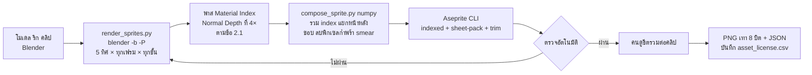

| ขั้น | ทำอะไร | ค่า |
| --- | --- | --- |
| 1 เรนเดอร์ | Cycles 1 sample แบบ headless ตามค่าตั้งในข้อ 2.1 วนทุกคลิป ทุกทิศ ทุกเฟรม ทีละชั้น | 1 ภาพต่อชั้นต่อเฟรม ที่ 4 เท่าของช่องเฟรม แล้วโหวตย่อเป็น 1 เท่า |
| 2 ช่องพาเลต | วัสดุแต่ละตัวตั้ง pass index = เลขช่อง แล้วอ่านจาก pass Material Index | ไม่มี UV และเท็กซ์เจอร์ ลายใช้ mask สลับช่อง |
| 3 ขั้นแสง | คิด N·L จาก pass Normal แล้วแบ่ง 3 ขั้นใน numpy (เกณฑ์ 0.55 / 0.10 ตามข้อ 2.1) | ขั้น 0 มืด · 1 กลาง · 2 สว่าง |
| 4 รวม index | index = ช่อง × 4 + ขั้น | ขั้น 3 เป็นขอบเข้ม ใส่ในขั้นที่ 6 |
| 5 แยกหน้า/หลัง | เทียบความลึกของชั้นกับเปลือกร่าง (ร่าง + เกราะที่พองที่สุดของอาชีพ) และทรงกลมหัว | ได้ส่วนหลังร่าง ส่วนปกติ และแพตช์หน้าหัว |
| 6 เส้นขอบ | พิกเซลที่ติดพื้นโปร่งใสเปลี่ยนเป็นขั้น 3 ของช่องตัวเอง | หนา 1 px |
| 7 เก็บพิกเซล | ลบพิกเซลกำพร้าที่ไม่มีเพื่อนช่องเดียวกันใน 8 ทิศ และพิกเซลที่โผล่เฟรมเดียวในส่วนที่ไม่ขยับ | Dead Cells ยังต้องเก็บพิกเซลกะพริบด้วยมือ จึงทำเป็นสคริปต์ |
| 8 smear | เรนเดอร์ 3 จังหวะย่อยระหว่างคีย์ตี รวมเป็นมาสก์ใบอาวุธ ลงช่อง "เทรล" | 1 เฟรมต่อจังหวะตี |
| 9 แพ็ก | `aseprite -b <ไฟล์> --color-mode indexed --sheet-pack --trim --inner-padding 1 --shape-padding 1 --sheet <png> --data <json>` | ขอบว่าง 1 px ไว้ให้ขอบเรือง |
| 10 ส่งออก | PNG เทา 8 บิต ค่าเทา = index ตัด chunk gAMA iCCP sRGB + JSON | – |

- Cycles 1 sample กับ pixel filter Box กว้าง 1 px ให้ค่าเดียวต่อพิกเซลจึงไม่ผสมเลขช่อง สคริปต์ยังตรวจว่าทุกพิกเซลเป็นเลขช่องที่ใช้จริง
- ลดจาก 4 เท่าด้วยค่าฐานนิยมต่อบล็อก 4×4 ชิ้นที่ติดธง `thin` (ด้ามทวน สายธนู) ชนะเมื่อครอบ ≥3/16 ของบล็อก (ข้อ 2.1)
- เวลาเครื่องต่อเกราะ 1 ชุด ต้องวัดจริงในเฟส 0 ค่าประเมินคือ 10–40 นาที

**JSON ต่อคลิป (แนวไฟล์ COF ของ Diablo II)**

```json
{"clip": "spear_A1", "sex": "m", "grip": "polearm", "asym": false,
 "dirs": {"S": [
   {"ms": 70,
    "order": ["back.b", "wpn.b", "body", "armor", "sash", "head", "hat", "wpn.f", "armor.h"],
    "anchor": {"feet": [32, 56], "head": [31, 29], "head_pose": 0, "hand_r": [38, 40],
               "hand_l": [26, 41], "tip": [52, 18], "base": [30, 44], "waist_l": [27, 46], "back": [32, 34]},
    "ev": ["step"]}
 ]}}
```

- `ms` คือความยาวเฟรมรายเฟรม ใช้คุมเฟรมตีให้ตรงค่า @ms ในแท็บ WeaponString (ข้อ 4.2)
- `ev` มี `hit` `step` `fx` `cancel` ส่วน `.b` `.f` `.h` คือส่วนหลังร่าง ส่วนหน้าร่าง และแพตช์หน้าหัว
- หัว ผม และหมวกวางที่ `head` ตามท่าหัว `head_pose` (0 ตรง 1 ก้ม 2 เงย) คลิปที่หัวแข็งเกินไปติดป้าย `head_baked` แล้วเรนเดอร์หัวรายเฟรมเฉพาะคลิปนั้น

**พาเลตและสี**

| ช่วง index | ใช้กับ |
| --- | --- |
| 0 | โปร่งใส |
| 1–3 | ขอบดำหมึก · แฟลชขาว · เงา |
| 4–255 | 63 ช่อง × 4 ขั้น (มืด กลาง สว่าง ขอบเข้ม) |

| กลุ่มช่อง | จำนวนช่อง |
| --- | --- |
| ผิว · ตา · ผม · ผ้าชั้นใน | 2 · 1 · 2 · 1 |
| เกราะหรือชุดแฟชั่น · หมวก | 12 · 4 |
| อาวุธ (ใบ 2 ด้าม 2 ขลิบ 1 เทรล 1) · โล่ · ของหลัง | 6 · 2 · 4 |
| ขนม้า · แผงคอและหาง · กีบ · เกราะม้า | 2 · 1 · 1 · 4 |
| ก๊ก (หลัก รอง สัญญาณ) · สายตรา | 3 · 1 |
| วนสี (16 index) | 4 |
| **รวมที่ใช้ / สำรอง** | **50 / 13** |

- แยกช่องตามชนิดชั้น ชั้นที่ซ้อนกันจึงใช้แถวสีเดียวกันได้โดยสีไม่ชน แนวเดียวกับมาสก์สีชุดของ Tibia
- มอนและบอสเป็นชั้นเดียว จึงใช้ทั้ง 63 ช่องได้อิสระในแถวของตัวเอง
- **แถว remap** เป็น texture R8 256×256 (64 KB) ตัวละคร 1 ตัวใช้ 1 แถว แปลงดัชนีช่อง (ช่อง × 4 + ขั้น) เป็นดัชนีในผังพาเลตโลกของข้อ 2 แล้ว shader อ่านสีจากแถวพาเลตเวลาของแผนที่ ตัวละครจึงเปลี่ยนตามกลางวัน เย็น และค่ำเหมือนฉาก แถวนี้ ประกอบตอนรันจากสีของชิ้นที่สวม สีก๊ก ระดับของ สีย้อม และสีผม แล้วแคชด้วย hash คนที่ชุดสีเหมือนกันใช้แถวเดียวกัน
- เลขแถวและธงสถานะส่งเป็น attribute ต่อ vertex (ใช้ช่อง tint ของเอนจินได้) ทุกก๊กจึงอยู่ใน batch เดียวกัน

```glsl
float i = floor(texture(uAtlas, vUv).r * 255.0 + 0.5);
if (i < 0.5) discard;
float p = floor(texelFetch(uRemap, ivec2(int(i), vRow), 0).r * 255.0 + 0.5);
fragColor = mix(texelFetch(uPal, ivec2(int(p), uRowA), 0), texelFetch(uPal, ivec2(int(p), uRowB), 0), uT);
```

| เอฟเฟกต์ที่ได้จากพาเลต (ไม่ต้องมีเฟรมเพิ่ม) | วิธี |
| --- | --- |
| สีก๊ก (แนว Age of Empires II) และสีระดับของ (แนว colormap ของ Diablo II) | สลับสีในแถว |
| ย้อมสีชุดแฟชั่นและผม | สลับสีในแถว |
| เกราะแตก | สีเกราะหมองลง 20% |
| แฟลชขาวตอนโดนตี 60 ms | ธงใน vertex แทนทุก index ด้วย index 2 |
| สวิตช์ "ลดความรุนแรง" | แถวเลือดเปลี่ยนเป็นประกายขาว |
| ละลายเป็นหมึกตอนตาย 0.6 วิ | dither Bayer 4×4 ตามเวลา |
| ติดไฟ | ขอบ 1 px สีส้ม |
| ไฟ สายฟ้า แผงคอเซ็กเธาว์ | remap เข้าช่องวนสี 77–92 ของพาเลตโลก (ข้อ 2) ใช้หน่วยความจำ 0 ไบต์ |

**กติกา texture**

- ห้ามบีบอัด ASTC ETC2 หรือ Basis กับภาพ index เพราะค่าจะเพี้ยน ใช้ nearest และไม่มี mipmap
- ไฟล์ที่ส่งถึงเครื่องเป็นดัชนีดิบ `.idx` บีบ gzip แล้วอัปโหลดเป็น `r8unorm` ตามข้อ 10 ทางสำรองคือ PNG เทาที่อัปโหลดด้วย `createImageBitmap(blob, {colorSpaceConversion: 'none', premultiplyAlpha: 'none'})` (Safari 15 ขึ้นไป) แล้ว `texImage2D` แบบ R8 / RED / UNSIGNED\_BYTE สเปก WebGL 2 กำหนดให้ภาพเทา 1 ช่องได้ R = ค่าเทา
- ตอนเปิดเกม อัปโหลดภาพทดสอบ 16×16 ที่มีค่า 0–255 แล้วอ่านกลับ ถ้ามีค่าเพี้ยน สลับไปถอดรหัส PNG เองใน Web Worker แล้วอัปโหลดจาก Uint8Array
- ขอบเรืองคำนวณใน shader จาก 4 พิกเซลข้างเคียง จึงต้องมีขอบว่าง 1 px ทั้งในเฟรมและระหว่างเฟรม

**ระดับความหายากต้องมองออกด้วยตา** (ข้อ 6.2 ขยายรายละเอียดของอาวุธ)

| ระดับ | สิ่งที่เห็นบนตัวละคร |
| --- | --- |
| ขาว–ฟ้า | ทรงเรียบ ramp เหล็กหรือหนังสีพื้น |
| ม่วง | ชิ้นประดับเพิ่ม (พู่ ขอบโลหะ) ramp สำริดและรัก |
| ส้ม | ทรงใหญ่ขึ้น 2–4 px ลายทอง ขอบเรือง 1 px จาง 20–40% |
| แดง | ชีตเฉพาะ วนสีบนใบอาวุธ อนุภาค 1–2 px ไม่เกิน 8 |
| ตำนาน | ซิลูเอตเฉพาะ วนสี halo additive 2 px ที่อบไว้ smear ลายเซ็น อนุภาคไม่เกิน 16 |
| ตีบวก +10 / +15 / +20 | ขอบ 1 px ขาวอมฟ้า 30% / + ประกายวิ่งตามใบทุก 1.5 วิ / + halo 2 px ซ้อนทับระดับของชิ้น |

**สิ่งที่โหลดตามสถานการณ์** (MB เป็นขนาดบน GPU แบบ R8 รวมเผื่อขอบและการจัดวาง 30%)

| ใคร / ที่ไหน | โหลดอะไร | MB |
| --- | --- | --- |
| ตัวเรา | ทุกคลิปของอาชีพตัวเองทั้ง 2 สาย ทุกชั้น ม้า เกราะม้า และชุดแฟชั่นที่ใส่ | ราว 9 (งบ ≤ 12) |
| ผู้เล่นอื่นในเมือง | ยืน เดิน วิ่ง 16 เฟรม × 5 ทิศ = 80 ช่องต่อชั้น | ราว 0.2 ต่อชุดที่ไม่ซ้ำ ชิ้นซ้ำใช้ร่วมกัน |
| ผู้เล่นอื่นในสนาม | + ชุดตีของตระกูลเมื่อสู้ในรัศมี 15 ม. จากเรา ระหว่างโหลดแสดงร่างสงคราม | + ราว 0.3 ต่อชิ้นอาวุธ |
| ผู้เล่นอื่นในสงคราม | ร่างสงครามอบรวมต่อ อาชีพ×ตระกูล (8) × รูปทรงเกราะ 3 ขั้น × 2 เพศ = 48 แผ่น | ราว 0.3 ต่อแผ่น รวม ≤ 20 |
| ทหาร | 1 ชีตต่อสาย × ชั้น อบเป็นชั้นเดียว (ข้อ 4.4) | เดินเท้า 0.08 · ทหารม้า 0.36 |

- ร่างสงครามยังเก็บช่องพาเลตของเกราะและอาวุธ แถวพาเลตจึงบอกสีก๊ก สีระดับเกราะ และสีโลหะอาวุธของแต่ละคนได้ ธงหลังเป็นชั้นซ้อนเล็กที่ไม่ mirror และตัดสายตราออก
- งบสไปรต์บน GPU: เมือง ≤ 30 · สนาม ≤ 35 · สงคราม ≤ 64 MB (แผน 3D เดิมในสงครามใช้ 125 MB)
- หน้า atlas ขนาด 2048² R8 (4 MB) แบ่งตามอายุใช้งาน: ตัวเรา · ผู้เล่นอื่น (ทิ้งตามลำดับใช้ล่าสุด) · ร่างสงคราม · ทหาร · VFX ล้างทั้งหน้าตอนเปลี่ยนฉาก
- ชั้นโลกต้องวาดได้ใน ≤ 30 draw call ด้วย PaletteBatcher ของ PixiJS 8 (ข้อ 10) ที่ batch ได้หลาย texture ต่อ draw call
- ไม่มีระดับกราฟิกต่ำ กลาง สูง มีแค่ตัวเลือก "ลดเอฟเฟกต์" ที่ลดอนุภาคและเปิดเองเมื่อ fps ตก (ข้อ 4.1)

**ข้อมูลรูปลักษณ์ที่ส่ง** เซิร์ฟเวอร์ส่งรหัสชิ้นเมื่อผู้เล่นเข้า AOI และเมื่อเปลี่ยนของ ไม่ส่งซ้ำทุกเฟรม

| ฟิลด์ | ไบต์ |
| --- | --- |
| อาชีพ + เพศ · ก๊ก + สีสายยศ | 1 · 1 |
| หัว ทรงผม สีผม | 2 |
| เกราะ · แฟชั่น · หมวก · อาวุธ · มือรอง · ของหลัง | 2 ต่อช่อง = 12 |
| ระดับของต่อชิ้น (3 บิตต่อช่อง) · ตีบวกอาวุธ | 3 · 1 |
| ม้า · เกราะม้า · สกิน · สถานะขี่ (ข้อ 6.3) | 5 |
| **รวม** | **25** |

ชิ้นที่ยังโหลดไม่เสร็จแสดงชุดพื้นฐานของอาชีพไปก่อน ในสงครามใช้ร่างสงครามทันที

**มาตรฐานชิ้นงาน 3D ต้นทาง (ส่งให้ Skill บน Blender ทุกครั้ง)**

- ใช้โครงกระดูกหลักเดียวต่อเพศ ห้ามเพิ่มกระดูกหลักเอง เพิ่มได้เฉพาะกระดูกรองของผ้าคลุม พู่ และธงหลัง
- จุดยึดตายตัว: มือขวา มือซ้าย หลัง หัว เอวซ้าย เท้า และอานม้า สคริปต์ส่งออกเป็นพิกัด px รายเฟรม พร้อม `tip` และ `base` ของอาวุธ
- วัสดุ 1 ตัวต่อช่องพาเลต ไม่ใช้ UV หรือเท็กซ์เจอร์ ลายใช้ mask สลับช่อง ห้ามลายเล็กกว่า 2 px ที่สเกลเรนเดอร์ (ราว 11 ซม.)
- สามเหลี่ยมมีผลแค่ความเร็วเรนเดอร์ออฟไลน์: อาวุธ ≤ 600 · หัว ≤ 600 · ลำตัว ≤ 1,500 · แขน ≤ 600 · ขา ≤ 800 · ม้า ≤ 3,000
- ชิ้นที่ไม่สมมาตรมาก เช่น ซองธนูเฉียงหลัง ติดป้าย `asym` แล้วเรนเดอร์ครบ 8 ทิศ ไม่เกิน 5% ของแคตตาล็อก เพราะกินพื้นที่เพิ่ม 60%
- ชุดแฟชั่นต้องอยู่ในเปลือกร่างของอาชีพ เกินได้ไม่เกิน 1 px ถ้าเกินติดป้าย `oversize` แล้วสร้างเปลือกร่างเฉพาะชุด
- อาวุธสลับมือเมื่อ mirror ยอมรับได้ Age of Empires II ก็เก็บ 5 ทิศแล้วพลิกภาพทั้งตัวแบบเดียวกัน ส่วนอักษรและตราห้าม mirror

**เช็กลิสต์รับงานสไปรต์ (สคริปต์ตรวจก่อน คนตรวจรอบสุดท้าย)**

| ข้อ | เกณฑ์ |
| --- | --- |
| index | ทุกพิกเซลอยู่ในช่องของชั้นนั้นตามตารางพาเลต |
| ความคม | ไม่มีค่ากลางจากการเกลี่ย ไม่มีพิกเซลกำพร้า |
| กะพริบ | พิกเซลที่โผล่เฟรมเดียวในส่วนที่ไม่ขยับ ≤ 2 ต่อเฟรม |
| ขนาด | ความสูงตรงตาราง ±1 px และไม่ล้นช่องเฟรม |
| รูปทรงเงา | ภาพเงาดำ 32 px ×1 คน 3 คนบอกอาชีพหรือตระกูลอาวุธถูกภายใน 3 วิ |
| เวลา | เฟรมตีตรงค่า @ms ในแท็บ WeaponString ±10 ms |
| mirror | ชั้นที่ mirror ไม่มีอักษรหรือตรา |
| หน่วยความจำ | ต่อชิ้นอยู่ในงบของตารางด้านบน |
| ลิขสิทธิ์ | บันทึกใน `asset_license.csv` ตามข้อ 2.1 |

**ต้นทุนต่อชิ้น: วาดมือเทียบพรีเรนเดอร์** (ช่อง = รูป 1 เฟรม 1 ทิศ 1 ชั้น)

| ชิ้น | ช่อง (2 เพศ) | วาดมือ (ประเมิน 20–40 นาทีต่อช่อง) | พรีเรนเดอร์ (เวลาคน) |
| --- | --- | --- | --- |
| เกราะ 1 ชุดต่ออาชีพ | ราว 3,600 | 1,200–2,400 ชม. | ราว 1 วัน |
| อาวุธ 1 ชิ้นครบคลิปตระกูล | ราว 2,400 | 800–1,600 ชม. | 2–4 ชม. |
| ชุดแฟชั่นข้ามอาชีพ | ราว 10,100 | ทำไม่ได้จริง | ราว 1 วัน |
| หมวก ทรงผม หรือ 冠 แบบยึดจุด | 30 | 10–20 ชม. | 30 นาที |
| ม้า 1 ทรง 9 คลิป | 260 | 90–170 ชม. | ราว 2 ชม. |

- ของที่มีทั้งท่าและหลายชั้นต้องพรีเรนเดอร์ ได้แก่ ร่าง เกราะ แฟชั่น อาวุธ โล่ ของหลัง ม้า ทหาร มอน บอส และเครื่องตีเมือง
- หัว ผม หมวก NPC ประจำจุด และสัตว์เล็กวาดใน Aseprite หรือร่างด้วย PixelLab แล้วเก็บงานได้ เพราะมีแค่ 15–30 ช่องต่อชิ้น

**จุดขายที่ได้จากระบบนี้**

- ปุ่ม "ลองสวม" ในร้านค้าและหน้ากาชา ห้องแต่งตัว และหน้าโปรไฟล์ที่คนอื่นกดดูชุดได้ ผู้เล่นจึงอวดของกันเอง
- ทุกหน้าใช้สไปรต์ตัวเดียวกับในโลก ขยาย ×4–6 บนพื้นหลัง HD คู่พอร์เทรต HD ปัดเพื่อหมุนทีละ 45° และกด "ดูท่า" เพื่อเล่น H4 ลายเซ็น 1 รอบ

**ลำดับทำ (ข้อ 12)**

| เฟส | งาน | เกณฑ์ผ่าน |
| --- | --- | --- |
| 0 ต้นแบบ | `render_sprites.py` + `compose_sprite.py` + ตัวโหลด R8 และ shader พาเลต · ขุนศึก 1 เพศ ร่าง เกราะ หมวก ทวน และธงหลัง 5 ทิศ ยืนหน้าอาคารเมืองทดสอบ + ทหาร 40 ตัว | ผู้ทดสอบ 4 ใน 5 คนบอกว่าตัวละครเข้ากับฉากและไม่ดูเป็น 3D · วัดหน่วยความจำ R8 จริงบน Redmi 14C และ iPhone RAM 3 GB |
| 1 MVP | ขุนศึก + กุนซือ 2 เพศ เกราะ 3 ระดับรูปทรง หมวก 6 แบบ ทรงผม 6 แบบ ลองสวม ห้องแต่งตัว | เปลี่ยนของแล้วภาพบนตัวเปลี่ยนภายใน 1 เฟรมเมื่อชีตอยู่ในเครื่อง |
| 2 สังคมและเงิน | นักธนู ชุดแฟชั่นชุดแรก ย้อมสี ธงหลังพันธมิตร | ชุดแฟชั่น 1 ชุดใช้เวลาคนไม่เกิน 1 วัน |
| 3 สงคราม | จอมดาบ ร่างสงคราม 48 แผ่น ชีตทหารทุกสาย | สไปรต์ในสงครามใช้ ≤ 64 MB |

แหล่งอ้างอิง: [Dead Cells 3D pipeline for 2D animation (Game Developer)](https://www.gamedeveloper.com/production/art-design-deep-dive-using-a-3d-pipeline-for-2d-animation-in-i-dead-cells-i-) · [Extracting Diablo II Animations (archive.org)](https://archive.org/stream/ExtractingDiabloIIAnimations/Extracting%20Diablo%20II%20Animations_djvu.txt) · [Ragnarok ACT format](https://github.com/rdw-archive/RagnarokFileFormats/blob/master/ACT.MD) · [openage: SLP files (AoE2)](https://github.com/SFTtech/openage/blob/master/doc/media/slp-files.md) · [Tibia outfit color masks (OTLand)](https://otland.net/threads/adding-new-outfits-looktypes-detailed-free-samples.84412/page-5) · [WebGL 2.0 Specification](https://registry.khronos.org/webgl/specs/latest/2.0/) · [MDN: createImageBitmap](https://developer.mozilla.org/en-US/docs/Web/API/Window/createImageBitmap) · [Aseprite CLI](https://www.aseprite.org/docs/cli/)

## 6.2 อาวุธสามก๊ก

อาวุธแบ่งเป็น 6 ตระกูลตามประเภทดาเมจ ได้แก่ ทวน ง้าว ดาบ กระบองเหล็ก ธนู และพัด ตระกูลกำหนดปุ่ม A ท่าปิดหนัก และสถานะที่ติดให้เป้า ตระกูลผูกกับสายตามข้อ 4.2 ส่วนสถานะ ตัวคูณเกราะ และกติกาคอมโบอยู่ในข้อ 4.1 ที่เดียว ชุดท่า A1–A4 และ H1–H4 ของแต่ละตระกูลอยู่ในตารางชุดท่าของข้อนี้ อาวุธจากนิยายและตำนานเป็น "ศาสตรานาม" คือรูปลักษณ์สวมทับ ค่าพลังมาจากอาวุธจริงที่สวมอยู่ (มีแค่โบนัสคลังศาสตรา ATK รวมไม่เกิน +3%) ข้อนี้ใช้แทนประเภทอาวุธในข้อ 4 และ 6.1 เมื่อขัดกัน ตัวเลขทุกตัวเป็นค่าทดสอบ จูนใน Google Sheets

### ป้ายที่มา

ทุกอาวุธบอกที่มาบนการ์ด เพราะเกมสัญญาว่าอิงข้อมูลสามก๊กจริง และต้นทุนมีแค่ข้อความ

| ป้าย | ใช้เมื่อ | ตราบนการ์ด | ตัวอย่าง |
| --- | --- | --- | --- |
| ประวัติศาสตร์ (史) | มีใน 三國志 หรือ 後漢書 ถ้ามาจากบันทึกประกอบของ 裴松之 ต่อท้ายด้วย "注" | ตราชาดสี่เหลี่ยม | ทวนสองคมของกองซุนจ้าน |
| นิยาย (演) | มีใน 三國演義 หรือสามก๊กฉบับเจ้าพระยาพระคลัง (หน) | ม้วนคัมภีร์สีคราม | ง้าวของกวนอู |
| ตำนาน (傳) | อยู่นอกสองชั้นแรก เช่น 古今刀劍錄 語林 บันทึกนอกพงศาวดาร งิ้ว | เมฆสีม่วง | ดาบ "หมื่นคน" ของกวนอู |
| แต่งใหม่ (創) | ออกแบบขึ้นในเกม | ป้ายเทา | ของดรอปทั่วไป |

- ของที่มีหลายชั้นแสดงหลายป้าย เช่น ทวนของเตียวหุย = ประวัติศาสตร์ + นิยาย
- ป้ายประวัติศาสตร์ใช้กับตัววัตถุเท่านั้น ผลในเกมเป็น "แต่งใหม่" เสมอ เช่น ไม้เท้าเก้าข้อ
- แท็บ "ที่มา" แสดงต้นฉบับจีนไม่เกิน 20 อักษร คำแปลไทย ข้อความฉบับไทยคลาสสิก (ถ้ามี) และหมายเหตุยุค
- น้ำหนักแสดงตามต้นฉบับ เช่น "แปดสิบสองชั่ง" ไม่แปลงเป็นกิโลกรัม เพราะหน่วยชั่งต่างกันตามยุค

### ตระกูลอาวุธ

แต่ละตระกูลมีท่าปิดหนักและสถานะของตัวเอง ตรงกับกรอบการควบคุม (แตะ A 4 จังหวะ กดค้างเป็นท่าปิด)

| ตระกูล | อาวุธจริงที่อิง | ประเภทดาเมจ (ข้อ 4.1) | ท่าปิดหนักประจำ | สถานะประจำ | สายที่ใช้ (ข้อ 4.2) |
| --- | --- | --- | --- | --- | --- |
| ทวน | ทวน (矛) ทวนม้า (槊) | แทง | แทงทะลุแนว | เกราะแตก, ลอย | ขุนศึก / ทะลวงทัพ |
| กระบองเหล็ก | กระบองเหล็ก (鐵鞭) ขวาน (斧) ถือคู่โล่ (楯) | ทุบ | ทุบแผ่นดิน ทำให้ล้ม | ล้ม, มึน | ขุนศึก / ป้อมปราการ |
| ดาบ | ดาบหัวแหวน (環首刀) กระบี่ (劍) ถือคู่ | ฟัน | พุ่งฟัน ทำให้เลือดออก | เลือดออก | จอมดาบ / ดวลเดี่ยว |
| ง้าว | ง้าวเกี่ยว (戟) ใบมีดด้ามยาว (大刀) | ฟัน (กวาดเกี่ยว) | เกี่ยวดึงเข้าหาตัว | เลือดออก, ล้ม | จอมดาบ / กวาดล้าง |
| ธนู | เกาทัณฑ์ (弓) หน้าไม้ (弩) | ยิงไกล | ยิงชาร์จทะลุแนว | ตรึง, ชะลอ | นักธนู / ซุ่มยิง (เกาทัณฑ์) และห่าธนู (หน้าไม้) |
| พัด | พัดขนนก (羽扇) ไม้เท้าเก้าข้อ (九節杖) | เวท (ไฟ/ลม) | ร่ายต่อเนื่อง | ติดไฟ, ชะลอ | กุนซือ / ทั้งสองสาย |

- **แบบย่อย 2 แบบ:** หน้าไม้ (ตระกูลธนู) และไม้เท้ายันต์ (ตระกูลพัด) ใช้ชุดท่าเดียวกับตระกูลหลัก ต่างแค่โมเดลและเอฟเฟกต์ ไม่ใช่ตระกูลใหม่
- **จัดตระกูลตามรูปหัวอาวุธ:** หัวแหลมอย่างเดียว = ทวน · มีใบข้างหรือใบมีดบนด้ามยาว = ง้าว · ด้ามสั้นมีคม = ดาบ · หัวทื่อ เหลี่ยม มีหนาม หรือเป็นขวาน = กระบองเหล็ก
- **ชื่อชิ้นใช้คำฉบับไทยคลาสสิก:** ฉบับไทยเรียก 戟 ว่า "ทวน" และเรียก 槊 กับ 大刀 ว่า "ง้าว" ดังนั้นทวนลิโป้ (方天畫戟) อยู่ตระกูลง้าว การ์ดแสดงทั้งชื่อและตระกูล
- **สมดุล:** ตัวคูณรวมของชุด A ต่อวินาทีเท่ากับ 1.60 ต่อเป้าเดียว ±5% ตระกูลตีหลายเป้าคูณ 0.8 ตระกูลระยะไกลคูณ 0.9 เพื่อรักษากติกา ±10% ในข้อ 4.1

### อาวุธประจำอาชีพ

แต่ละสายใช้ตระกูลเดียวตามข้อ 4.2 สกิลพื้นฐาน 3 ท่าของอาชีพไม่ผูกอาวุธ จึงใช้คลิปร่วมทั้งสองสาย

| อาชีพ | ตระกูลของสาย 1 | ตระกูลของสาย 2 | ท่าจับ | ชั้นเกราะ (ข้อ 4.1) | อาวุธทหาร |
| --- | --- | --- | --- | --- | --- |
| ขุนศึก | ทวน (ทะลวงทัพ) | กระบองเหล็ก + โล่ (ป้อมปราการ) | ด้ามยาวสองมือ / มือเดียว + โล่ | หนัก | ทวนหรือง้าวเกี่ยว + โล่ |
| จอมดาบ | ดาบถือคู่ (ดวลเดี่ยว) | ง้าว (กวาดล้าง) | ดาบคู่ / ด้ามยาวสองมือ | กลาง | ดาบหัวแหวน (ทหารม้าเบา) |
| นักธนู | เกาทัณฑ์ (ซุ่มยิง) | หน้าไม้ (ห่าธนู) | ท่าเล็งยิง | เบา | หน้าไม้ |
| กุนซือ | พัด (ทั้งสองสาย) | ไม้เท้ายันต์ (รูปลักษณ์) | มือเดียวถือของร่าย | เบา (RES สูง) | ไม้เท้ายันต์ (นักพรต) |

ตระกูลอาวุธผูกกับสาย เปลี่ยนสายแล้วอาวุธที่ใช้ได้เปลี่ยนตาม (เปลี่ยนสายฟรีสัปดาห์ละครั้งตามข้อ 4.1) โล่เป็นส่วนของชุดกระบองเหล็ก+โล่ ไม่เพิ่มช่องอุปกรณ์ ชั้นเกราะผูกกับอาชีพ ผู้เล่นจึงไม่ต้องเปลี่ยนชุดตามคู่ต่อสู้

### สถานะ 6 ชนิด: ต้นเรื่องสำหรับการ์ดความรู้

ค่า PvE/PvP กติกาแต้มคุม และการกินสถานะอยู่ในข้อ 4.1 ไอคอนและสีอยู่ในข้อ 2.2 ตารางนี้เก็บเฉพาะต้นเรื่อง

| สถานะ | ต้นเรื่อง |
| --- | --- |
| เกราะแตก | แต่งใหม่ (อิงกวนอู 「刺良」) |
| ล้ม | เงียมเหิงฟาดด้ามทวนหัก (卷15 注 魏略) |
| ลอย | แต่งใหม่ |
| ตรึง | ไทสูจู้ 「矢貫手著棼」 (卷49) |
| เลือดออก | แต่งใหม่ |
| ติดไฟ | ผาแดง 「時風盛猛，悉延燒岸上營落」 (卷54) |

**คอมโบทีมที่แนะนำ (สกิลตามข้อ 4.2 ปุ่ม A ไม่กินสถานะ)**

- ขุนศึก H2 เสยทวน (ลอย) → นักธนูลิโป้ยิงปลายทวน (เรือง) → จอมดาบฟันเหล็กดุจฟันหยวก (เรือง)
- ขุนศึก H4 ทุบแผ่นดิน (ล้ม) → กุนซือเพลิงเผาค่ายลกซุน (เรือง) หรือจอมดาบง้าวฟันขาดสองท่อน (เรือง)
- กุนซือลูกไฟพัดขนนก (ติดไฟ) → นักธนูระดมยิงดังห่าฝนกลายเป็นห่าเพลิง (เรือง)
- นักธนูศรตรึงขื่อไทสูจู้ (ตรึง) → ขุนศึกทะลวงค่ายโกซุ่นขั้น 2 หรือหน้าไม้สิบลูก (เรือง)
- กติกาคุม PvP ใช้แต้มคุมและตั้งหลักในข้อ 4.1 บอสใช้แถบทรงตัว 1,000 ในข้อ 4.1
- **เครือข่าย:** สถานะส่งเป็นบิตแมสก์ 1 ไบต์ + เวลาที่เหลือ 1 ไบต์ต่อสถานะ ดาเมจต่อเนื่องคิดทุก 0.5 วิ ในสงครามคิดทุก 1 วิ

### ตัวคูณดาเมจ

ตัวคูณประเภทดาเมจ × ชั้นเกราะ สูตรดาเมจ การบีบค่าใน PvP ใช้ตาราง ArmourMatrix ในข้อ 4.1 ที่เดียว ตระกูลง้าวใช้แถวฟัน ดาเมจต่อสิ่งก่อสร้างในสงครามเป็นค่าคงที่ตามข้อ 7.2

### ชุดท่าตามตระกูล

ทุกตระกูลมีปุ่ม A 4 จังหวะ และท่าปิด H1–H4 ที่ออกเมื่อกด A ค้างเกิน 0.35 วิ ในจังหวะนั้น ช่วงรับจังหวะถัดไปเปิดที่เฟรมโดน +0.25 วิ ถึง +0.6 วิ (กระบองถึง +0.7 วิ) บวกบัฟเฟอร์ 0.2 วิ ช่วงกดที่ได้ผลจึงยาว 0.55 วิ ผ่านเกณฑ์ขั้นต่ำ 0.4 วิ หลังเฟรมโดนตัดท่าด้วยหลบหรือสกิลได้ ศาสตรานามเปลี่ยนได้แค่ภาพ เทรล และเสียงของท่าเหล่านี้ ตารางนี้เป็นข้อมูลตั้งต้นของแท็บ WeaponString (ข้อ 4.1)

| ตระกูล | ปุ่ม A: เวลา (ms) · ตัวคูณ | H1 | H2 | H3 | H4 |
| --- | --- | --- | --- | --- | --- |
| ทวน | 480/480/560/760 · 0.70/0.70/0.85/1.40 | ขวางทวนหน้าสะพาน: กวาดขวาง ผลัก 2 ม. มอนชะงัก 0.5 วิ ×1.1 | แทงหน้ากระทุ้งหลัง ×0.8 + 0.8 | ฝ่าวงล้อม: พุ่ง 5 ม. ×1.3 | แทงกลางหมื่นทัพ: ทะลุแนว 8 ม. เกราะแตก ×2.4 ใส่บอสหรือแม่ทัพ +20% |
| ง้าว | 520/520/600/820 · 0.60/0.60/0.75/1.20 ต่อเป้า | ปัดเกี่ยว: ดึงเข้า 2 ม. ×1.0 | ขว้างง้าวสั้น: 3 เล่มรูปพัด 10 ม. ×0.6 ต่อเล่ม | รำง้าวคู่: หมุน 360° 1.2 วิ รัศมี 3 ม. เดินได้ 50% ×0.4 × 4 | เกี่ยวยกฟ้า: กวาดครึ่งวงแล้วทำให้ลอย ×2.2 |
| ดาบ | 380/380/420/620 · 0.55/0.55/0.68/1.10 | ดาบ+โล่: ปัดป้อง 0.4 วิ แล้วสวน ×1.5 · ดาบคู่: ฟันไขว้ ×1.2 | เปิดแผล: เลือดออก 2 ชั้น ×1.1 | ก้าวตัด: พุ่งทะลุ 4 ม. ×1.2 | ร้อยหลอม: ฟัน 5 ครั้ง เลือดออก 3 ชั้น ×0.45 × 5 |
| กระบองเหล็ก | 600/600/700/900 · 0.95/0.95/1.15/1.43 | ทุบเกราะ: ลดเกจทรงตัวบอส 25 ×1.3 | ฟาดด้ามหัก: ทุบหัว ล้ม ×1.5 | เหวี่ยงรอบตัว: 360° 3 ม. ผลัก 3 ม. ×1.2 | ทุบธรณี: กระโดดทุบวง 3.5 ม. ล้ม รอยแตกเป็นทาง 6 ม. ×2.6 |
| ธนู | 450 × 4 · 0.55/0.55/0.55/0.94 (A4 สองดอกรวม) | ง้างเต็มสาย: ปล่อยช่วง 0.35–0.8 วิ ×1.6 ค้างถึง 0.8 วิ ×2.2 ทะลุ 3 เป้า | ยิงติดคาน: ตรึง ×1.2 | ยิงพู่หมวก: ขัดการร่ายของมอนและบอส ×1.0 | ยิงทวนประตูค่าย: 18 ม. คริแน่นอนเมื่อเป้าไกลเกิน 12 ม. ×2.4 |
| หน้าไม้ (แบบย่อย) | 350/350/350/700 · 0.50/0.50/0.50/1.02 (A4 สามดอกรวม) | ใช้ H1 ของธนู | ใช้ H2 ของธนู | ใช้ H3 ของธนู | ห่าลูกสิบดอก: 10 ดอกรูปพัด 30° ×0.3 ต่อดอก |
| พัด | 500/500/500/800 · 0.70/0.70/0.70/1.21 | โบกลม: กรวย 6 ม. ผลัก 3 ม. ×0.8 | ลูกไฟแตก: ติดไฟ ระเบิด 2 ม. ×1.3 | ลำเพลิง: 12 ม. 1.5 วิ เดินได้ 30% ×0.35 × 6 | พายุเพลิง: วง 4 ม. 2 วิ ติดไฟ ×2.4 |
| ไม้เท้ายันต์ (แบบย่อย) | ใช้ A ของพัด | ใช้ H1 ของพัด | ยันต์ตรึง: ตรึง ×1.0 | ใช้ H3 ของพัด | วงยันต์: ฮีลทีม 8% HP รัศมี 6 ม. |

ผลชะงักของ H1 ทวน และการขัดร่ายของ H3 ธนู ใช้กับผู้เล่นไม่ได้ ชื่อ H4 พัดตั้งไม่ให้ชนกับสกิลขั้นสุด "ขอลมสลาตัน" ในข้อ 4.2

### บนหลังม้า

บนม้าใช้ชุดท่าย่อ 3 ชุด (ประชิด ธนู พัด) ตามข้อ 4.1 และตัวเลขตามข้อ 6.3 บูลเล็ตด้านล่างใช้เป็นแนวคิดเท่านั้น

- **กลุ่มประชิด** (ทวน ง้าว ดาบ กระบองเหล็ก): A 2 จังหวะ ระยะเท่าบนพื้น +1 ม. ทวนได้อีก +1 ม. ใช้คลิปตามท่าจับด้ามยาวหรือด้ามสั้น
- **กลุ่มระยะไกล** (ธนู หน้าไม้ พัด): ยิงหรือร่ายขณะม้าวิ่ง 2 จังหวะ ดาเมจ ×0.85 อิงลิโป้ 「便弓馬」 และโจผี 「馳射常百步」
- **ทั้งสองกลุ่ม:** ท่าพุ่งชน 1 ท่า และกระโดดลงตีพื้น 1 ท่า ไม่มีท่าปิดหนัก กด A ค้างเป็นท่าพุ่งชนแทน

### แคตตาล็อก: อาวุธพื้นฐาน

อาวุธพื้นฐานใช้รูปทรงโบราณคดียุคฮั่น เป็นโมเดลระดับขาว–ส้มของทุกตระกูล ชื่อที่มี \* เป็นชื่อไทยที่ตั้งใหม่ ยังไม่พบในฉบับไทยคลาสสิก

| อาวุธ | ตระกูล | ที่มา | หลักฐาน | ใช้ในเกม |
| --- | --- | --- | --- | --- |
| ทวน (矛) | ทวน | ประวัติศาสตร์ | 卷36 เตียวหุย 「矋目橫矛」 · 卷55 เทียเภา 「以矛突賊」 | โมเดลพื้นฐานตระกูลทวน |
| ง้าวเกี่ยว\* (戟) | ง้าว | ประวัติศาสตร์ | 卷17 เตียวเลี้ยว 「被甲持戟，先登陷陳」 | โมเดลพื้นฐานตระกูลง้าว หัวรูปตัว 卜 |
| ทวนสั้น (手戟) | ง้าว (รูปหัว) | ประวัติศาสตร์ | 卷7 ตั๋งโต๊ะ 「拔手戟擲布」 · 卷49 ซุนเซ็กคว้าทวนสั้นจากคอไทสูจู้ · ฉบับหนเรียก "ทวนสั้น" | สกิลขว้างทวนสั้นของขุนศึก (ข้อ 4.2) |
| ทวนคู่ (雙戟) | ง้าว | ประวัติศาสตร์ (注) | 卷55 注 吳書 กำเหลง 「寧能雙戟舞」 · 卷2 注 典論 「俗名雙戟爲坐鐵室」 | ศาสตรานามถือคู่ของตระกูลง้าว ใช้ท่าตามข้อ 4.1 |
| ดาบหัวแหวน\* (環首刀) | ดาบ | ประวัติศาสตร์ | แทนที่ 劍 เป็นอาวุธสั้นหลักของกองทัพปลายฮั่นตะวันออก | โมเดลพื้นฐานตระกูลดาบ ถือคู่ใช้โมเดลนี้ซ้ำ |
| โล่ (楯) | กระบองเหล็ก (มือซ้าย) | ประวัติศาสตร์ (注) | 卷55 注 吳書 ลิบอง 「操刀持楯」 | ชุดกระบองเหล็ก+โล่ของสายป้อมปราการ การ์ดหน้าตามข้อ 4.1 |
| กระบี่ (劍) | ดาบ | ประวัติศาสตร์ (注) | 卷2 注 典論 โจผี 「余又學擊劍」 | รูปทรงของศาสตรานามกระบี่เท่านั้น |
| กระบองเหล็ก (鐵鞭) | กระบองเหล็ก | นิยาย | 第5回 อุยกาย 「使鐵鞭」 · ไทย ตอนที่ ๔ "กระบองเหล็กสี่เหลี่ยม" | โมเดลพื้นฐาน การ์ดบอกว่า 鐧 ทรงใกล้กันเริ่มพบสมัยจิ้น |
| เกาทัณฑ์ (弓) | ธนู | ประวัติศาสตร์ | 卷7 ลิโป้ 「便弓馬」 · 卷49 ไทสูจู้ 「猿臂善射，弦不虛發」 | โมเดลพื้นฐานตระกูลธนู ยิงบนม้าได้ |
| หน้าไม้ (弩) | ธนู | ประวัติศาสตร์ | ไกหน้าไม้สำริดของวุย ปี 228 (พิพิธภัณฑ์พระราชวังไทเป) · 卷35 「損益連弩」 | แบบย่อย ไกสำริดสีทองเป็นจุดเด่นของซิลูเอต |
| พัดขนนก (羽扇) | พัด | ตำนาน + นิยาย | 語林 สมัยจิ้น 「持白羽扇，指麾三軍」 · ไทย ตอนที่ ๗๕ "ถือพัดขนนกขี่เกวียนน้อย" · ไม่พบใน 三國志 | โมเดลพื้นฐานตระกูลพัด |
| ไม้เท้าเก้าข้อ\* (九節杖) | พัด | วัตถุ: ประวัติศาสตร์ (注) · ผล: แต่งใหม่ | 卷8 注 典略 「師持九節杖為符祝」 | แบบย่อยไม้เท้ายันต์ของสายเสนาธิการ |

### แคตตาล็อก: ศาสตรานามชุดเปิดตัว

ชุดเปิดตัวมี 10 ชิ้น ครอบคลุมทุกตระกูลและทุกชั้นที่มา ศาสตรานามเปลี่ยนโมเดล เทรล เสียง เอฟเฟกต์ H4 และไอคอนปุ่ม A ส่วนค่าพลังมาจากอาวุธจริงที่สวมอยู่

| # | ศาสตรานาม | ตระกูล | ที่มา | หลักฐาน | ลายเซ็น / ผลพิเศษ | ได้จาก | เฟส |
| --- | --- | --- | --- | --- | --- | --- | --- |
| 1 | ง้าวของกวนอู (青龍偃月刀) | ง้าว | นิยาย | 第1回 「重八十二斤」 · ไทย ตอนที่ ๑ "ยาวสิบเอ็ดศอกหนักแปดสิบสองชั่ง" · ทรงนี้เริ่มพบสมัยซ่ง หลังกวนอูกว่า 700 ปี | เทรลเขียว เงาซ้อนที่ H4 มุมพงศาวดารแสดงฉากแทงงันเหลียง 「策馬刺良於萬眾之中」 | เควสเรื่องราว / อีเวนต์ | 0 |
| 2 | ทวนสองคมของกองซุนจ้าน\* (兩刃矛) | ทวน | ประวัติศาสตร์ | 卷8 「自持矛，兩頭施刃，馳出刺胡」 | H2 แทงหน้ากระทุ้งหลัง เทรลสองปลาย | เควสด่านชายแดนเหนือ | 1 |
| 3 | ทวนสองเล่มของเตียนอุย (大雙戟) | ง้าว | ประวัติศาสตร์ | 卷18 「提一雙戟八十斤」 | H4 ประกายเหล็กหนัก ฝุ่นกระแทก | ด่านเรื่องราวศึกอ้วนเซีย (宛城) | 3 |
| 4 | พัดขนนกของขงเบ้ง (羽扇) | พัด | ตำนาน + นิยาย | 語林 「持白羽扇」 · ไทย ตอนที่ ๗๕ | H4 พายุเพลิงเป็นขนนกไฟ | ออกคู่ขุนพลขงเบ้ง | 1 |
| 5 | ไม้เท้าเก้าข้อของไท่ผิงเต้า\* (九節杖) | พัด (ไม้เท้า) | วัตถุ: ประวัติศาสตร์ (注) · ผล: แต่งใหม่ | 卷8 注 典略 「太平道者，師持九節杖」 | H4 วงยันต์สีเหลือง | ดรอปจากบอสเตียวก๊ก (แผนที่ 1–20) | 1 |
| 6 | เกาทัณฑ์ของลิโป้\* (射戟之弓) | ธนู | ประวัติศาสตร์ + นิยาย | 卷7 「布舉弓射戟，正中小支」 · ไทย ตอนที่ ๑๔ ปักทวน "ไกลประมาณห้าเส้น" | H4 เส้นทองเส้นเดียว เสียงกังวานโลหะ | ด่านเรื่องราวยิงทวนประตูค่าย | 2 |
| 7 | หน้าไม้สิบลูก (元戎) | ธนู (หน้าไม้) | ประวัติศาสตร์ (注) + นิยาย | 卷35 注 魏氏春秋 「一弩十矢俱發」 · ไทย ตอนที่ ๗๘ "ยิงได้ทีละสิบลูก" | H4 ห่าลูกสิบดอก และเป็นธีมคำสั่งทัพทหารหน้าไม้ | อีเวนต์ฝ่ายจ๊ก | 2 |
| 8 | ดาบห้าเล่มของโจโฉ\* (寶刀五枚) | ดาบ | ประวัติศาสตร์ (เอกสารร่วมสมัย) | 曹植 寶刀賦 「造寶刀五枚，三年乃就」 ตรา 龍 虎 熊 馬 雀 | 5 ลายบนโมเดลเดียว ครบ 5 ได้กรอบพิเศษในคลัง | ร้านเหรียญเกียรติยศ | 3 |
| 9 | กระบี่กีเทนเกี้ยม (青釭劍) | ดาบ | นิยาย | 第41回 「砍鐵如泥」 · ไทย ตอนที่ ๓๗ "ฟันเหล็กก็ดุจหนึ่งว่าฟันหยวก" | PvE: ฟันใส่เกราะเหล็กได้ตัวคูณ 1.0 แทน 0.8 ปิดใน PvP ไม่นับ BP | อีเวนต์ | 3 |
| 10 | กระบองเหล็กสี่เหลี่ยมของอุยกาย (鐵鞭) | กระบองเหล็ก | นิยาย | 第5回 「使鐵鞭」 · ไทย ตอนที่ ๔ "อุยกายถือกระบองเหล็กสี่เหลี่ยม" | H4 รอยแตกเป็นทางพร้อมคลื่นฝุ่น | เควสสายซุนเกี๋ยน | 1 |

### ศาสตรานามรอบหลังและเครื่องยศ

ชิ้นรอบหลังออกตามปฏิทินขุนพล UR รายเดือนและเทศกาลในข้อ 9 เครื่องยศไม่ใช่อาวุธต่อสู้ แต่ผูกกับระบบบรรดาศักดิ์

| ชิ้น | ตระกูล | ที่มา | หลักฐาน | ใช้ในเกม |
| --- | --- | --- | --- | --- |
| ทวนของเตียวหุย (丈八蛇矛) | ทวน | ประวัติศาสตร์ + นิยาย | 卷36 「瞋目橫矛」 · 第1回 「丈八點鋼矛」 · ไทย ตอนที่ ๑ "ยาวสิบศอกหนักแปดสิบห้าชั่ง" | เอฟเฟกต์ตวาดตอนออก H1 (ภาพและเสียงเท่านั้น) ออกคู่ขุนพลเตียวหุย |
| ทวนของลิโป้ (方天畫戟) | ง้าว | นิยาย | 第5回 「手持畫戟」 · ไทย ตอนที่ ๕ "ลิโป้เอาทวนแทง" · 方天戟 ส่วนใหญ่เป็นเครื่องพิธีในยุคหลัง | ออกคู่ขุนพลลิโป้ UR |
| กระบี่สองเล่มของเล่าปี่ (雙股劍) | ดาบ (คู่) | นิยาย | 第1回 「打造雙股劍」 · ไทย ตอนที่ ๑ "กระบี่สองเล่มสำหรับถือ" | ลายสามพี่น้องเมื่อปาร์ตี้มีทวนและง้าว (ภาพเท่านั้น) |
| ทวนของเทียเภา (鐵脊蛇矛) | ทวน | ประวัติศาสตร์ + นิยาย | 卷55 「以矛突賊」 · 第5回 「鐵脊蛇矛」 · ไทย ตอนที่ ๔ "เทียเภาถือทวน" | ชุดฝ่ายง่อ |
| ง้าวใหญ่ของซุนเกี๋ยน (古錠刀) | ง้าว | นิยาย | 第5回 「橫古錠刀」 · ไทย ตอนที่ ๔ "ถือง้าวใหญ่" | คู่กับผ้าโพกแดง (赤幘) ในชุดแฟชั่น |
| เกาทัณฑ์ของฮองตง (二石弓) | ธนู | นิยาย | 第53回 「能開二石力之弓」 · ไทย ตอนที่ ๔๔ ยิงพู่หมวกกวนอู · พงศาวดารไม่มีเรื่องธนูของฮองตง | H3 ยิงพู่หมวกแบบลายเซ็น |
| เกาทัณฑ์ยิงเสือของซุนกวน\* | ธนู | ประวัติศาสตร์ | 卷52 「常乘馬射虎」 และรถยิงเสือ 「射虎車」 | ท่ายิงบนม้าใส่มอนและบอส +15% |
| ดาบองครักษ์ของซุนฮูหยิน\* | ดาบ (คู่) | ประวัติศาสตร์ + นิยาย | 卷37 「侍婢百餘人，皆親執刀侍立」 · 第54回 「侍婢皆佩劍懸刀」 | ชุดตัวละครหญิง + ทหารองครักษ์หญิง |
| ด้ามทวนหัก\* (折矛) | กระบองเหล็ก | ประวัติศาสตร์ (注) + นิยาย | 卷15 注 魏略 「以折矛撾超項」 · 第59回 เคาทู 「拗斷槍桿」 | รูปลักษณ์อีเวนต์ "ครึ่งด้ามทวนของเคาทู" |
| ขวานใหญ่ของซิหลง (大斧) | กระบองเหล็ก | นิยาย | 第13回 「一將手執大斧」 | แบบขวานของตระกูลกระบองเหล็ก |
| ดาบ "หมื่นคน" ของกวนอู\* (萬人刀) | ดาบ (คู่) | ตำนาน | 古今刀劍錄 「為二刀，銘曰萬人」 | อีเวนต์ซีซัน การ์ดบอกว่าต่างจากง้าวในนิยาย |
| ดาบซินแต่งเฮาของเตียวหุย\* (新亭侯刀) | ดาบ | ตำนาน | 古今刀劍錄 「銘曰新亭侯蜀大將也」 | ปลดเมื่อได้บรรดาศักดิ์ขั้น 14 โหวตำบล (亭侯) ตามข้อ 4.3.3 |
| อาวุธจารึกประจำก๊ก\* | ดาบ | ตำนาน | 古今刀劍錄: ซุนกวนทำ 「千口劍，萬口刀」 จารึก 「大吳」 · เล่าปี่หล่อ 8 เล่ม · โจโฉได้กระบี่จารึก 「孟德」 | แจกฟรีจากเควสสังกัด ลายสีก๊กช่วยแยกฝ่ายในสงคราม |
| ดาบสามพันเล่มของโผวหงวน\* (蒲元刀) | ดาบ | ตำนาน (บันทึกนอกพงศาวดาร) | 蒲元別傳 ใน 類書: หล่อดาบ 3,000 เล่มที่ 斜谷 ชุบน้ำ 「蜀江爽烈」 | ธีมอีเวนต์ตีบวก "ชุบน้ำเสฉวน" |
| ขวานทอง (黃鉞) | เครื่องยศ | ประวัติศาสตร์ | 卷1 「天子假太祖節鉞」 · 九錫 「錫君鈇鉞各一」 | แสดงเฉพาะแม่ทัพใหญ่ระหว่างสงครามตามข้อ 4.3.6 (ชั้นของหลังยาว 16 px ramp ทอง ตามข้อ 4.3.9) |
| ธนูแดง\* (彤弓) | เครื่องยศ | ประวัติศาสตร์ | 卷1 九錫 「彤弓一，彤矢百」 | รูปลักษณ์ธนูเครื่องยศ ไม่เพิ่มค่าพลัง |

กติกาศาสตรานาม: สวมได้กับอาวุธตระกูลเดียวกันทุกระดับ ผลพิเศษจากตัวบทใช้เฉพาะ PvE และไม่นับ BP คลังศาสตราให้ ATK +0.5% ทุก 5 ชิ้น เพดานรวม +3%

### ข้อมูลใน Google Sheets

ข้อมูลอาวุธมี 2 แท็บของตัวเอง และใช้แท็บ WeaponString, Status, ArmourMatrix ของข้อ 4.1 ร่วมกัน export เป็น JSON ตามข้อ 10 Claude Code อ่านแท็บเหล่านี้ก่อนเขียนโค้ดต่อสู้ทุกครั้ง

- `weapon_families`: family\_id (spear, halberd, sword, mace, bow, fan), subtype (dual, shield, crossbow, staff), dmg\_type, branch\_id, trail\_style, grip (เวลา ตัวคูณ ช่วงรับ และ hit-stop อยู่ในแท็บ WeaponString ข้อ 4.1)
- `weapons`: weapon\_id, name\_th, name\_zh, family\_id, subtype, rarity, prov\_tags (HIS, NOV, LEG, NEW), evidence\_zh, evidence\_ref, thai\_classic\_text, era\_note, is\_skin, h4\_fx\_id, trail\_id, pve\_only\_effect, obtain, phase
- สถานะและตัวคูณเกราะใช้แท็บ Status และ ArmourMatrix ของข้อ 4.1 ไม่มีแท็บซ้ำในข้อนี้

### มาตรฐานภาพ

ผู้เล่นต้องอ่านตระกูลอาวุธได้จากเงาดำของสไปรต์สูง 32 px native ที่ขยาย ×1 ขั้นปกติบนจอ 720p ตัวละครสูง 64 px ส่วนมุมแม่ทัพราว 43 px อาวุธวาดใหญ่เกินจริงตามกฎรูปทรงเงาในข้อ 2 และไม่มีรุ่นหยาบสำหรับระยะไกล

| ตระกูล | ยาวในสไปรต์ (px native) | บนจอ 720p ขั้นปกติ / มุมแม่ทัพ (px) | ซิลูเอต (รายละเอียดเล็กสุด 2 px) |
| --- | --- | --- | --- |
| ทวน | 40–44 | 80–88 / 53–59 | เส้นยาวหนา 2 px หัวแหลม 4 px |
| ง้าว | 36–42 | 72–84 / 48–56 | ยาว มีใบข้างรูปตัว 卜 4–6 px |
| ดาบ | 12–16 | 24–32 / 16–21 | สั้น แหวนปลายด้าม 2×2 px |
| กระบองเหล็ก + โล่ | 10 + โล่ 12 | 20 + 24 / 13 + 16 | สั้น หนา 3 px เหลี่ยม |
| ธนู | 18–20 | 36–40 / 24–27 | โค้ง สาย 1 px |
| หน้าไม้ | 12–14 | 24–28 / 16–19 | รูปตัว T ไกสำริดสีทอง 2×2 px |
| พัด | 8–10 (ขยาย ×1.3) | 16–20 / 11–13 | พัดขาวมีพู่ 2 px |
| ไม้เท้ายันต์ | 26–30 | 52–60 / 35–40 | ตรง มีปล้องที่เห็นได้ 3 ปล้อง (แทน 9 ข้อ) ยันต์ห้อย 2×4 px |

เกณฑ์ทดสอบ: ภาพเงาดำ 32 px ×1 ผู้ทดสอบ 10 คนบอกตระกูลถูก ≥ 90% วัสดุเป็นช่องพาเลต: ใบเหล็กดำอมน้ำเงิน ด้ามลงรักดำแดง ทองสำริดใช้เฉพาะไกหน้าไม้และเครื่องประดับ

**ระดับความหายาก (ขยายตารางในข้อ 6.1)**

| ระดับ | รูปทรง (ชีตอาวุธ) | สี (แถวพาเลต) | เรืองแสง | เทรล (เฟรม smear) | อนุภาคค้าง (พิกเซล) | ตอนตีโดน |
| --- | --- | --- | --- | --- | --- | --- |
| ขาว–ฟ้า | รูปทรงพื้นของตระกูล | ramp เหล็ก | ไม่มี | smear สีของตัวอาวุธ ไม่ใช้สีเทรล | 0 | ประกายตามชนิดเกราะ |
| ม่วง | + ชิ้นประดับ (พู่ แหวนสลัก) | ramp สำริดและรัก | ไม่มี | เหมือนขาว–ฟ้า | 0 | ประกายตามชนิดเกราะ |
| ส้ม | ใหญ่ขึ้น 10% (+2–4 px) ลายทอง | ramp ทอง | ขอบ 1 px สีทองจาง 20–40% เป็นจังหวะหายใจ 2 วิ | smear สีทองเฉพาะ A4 และท่าปิด ค้างนานขึ้น 1 เฟรม | 0 | + ประกายทอง |
| แดง | ชีตเฉพาะ | ramp ธาตุ + วนสี 4 index | ขอบ 1 px สีธาตุ + วนสีบนใบ | smear สีธาตุทุกจังหวะ | ≤ 8 | ตามธาตุ |
| ตำนาน / ศาสตรานาม | ซิลูเอตเฉพาะ | ramp ลายเซ็น + วนสี 8 index | ขอบ + วนสี + halo additive 2 px ที่อบไว้ | smear ลายเซ็นทุกจังหวะ + เงาซ้อน 2 ชั้น dither 50% ที่ H4 | ≤ 16 | เอฟเฟกต์ลายเซ็น |

แสงเรืองจากตีบวกซ้อนทับตามข้อ 6.1: +10 ขอบ 1 px ขาวอมฟ้า 30% · +15 เพิ่มประกายวิ่งตามใบทุก 1.5 วิ · +20 เพิ่ม halo 2 px ทั้งหมดวาดบน target native ไม่มี bloom

**ภาษาภาพตามประเภทดาเมจ**

รูปเทรลและสีใช้ตารางเอฟเฟกต์ตามประเภทดาเมจในข้อ 2 เสียงและ hit-stop ใช้ตารางความรู้สึกในข้อ 4.1 (ฟัน 40 · แทง 60 · ทุบ 100 / H4 140 · ยิงไกลและเวท 0)

- **ประกายตามชนิดเกราะ** (flipbook native 4–6 เฟรม ขนาด 8–16 px): เหล็ก = ประกายไฟส้ม · หนัง = ฝุ่นและเศษหนัง · ผ้า = เศษผ้า · ไม้ = เสี้ยนไม้ · หิน = เศษหิน
- **หยุดภาพ:** เล่นเฉพาะบนเครื่องเรา ไม่หยุดเวลาเซิร์ฟเวอร์ ใน PvP คูณ 0.6 เพดาน 70 ms (ข้อ 2)
- **จอสั่น:** แรงสุดที่ H4 กระบอง 4 px native นาน 150 ms ท่าอื่นไม่เกิน 2 px มุมแม่ทัพลดครึ่งแล้วปัดขึ้น มีตัวเลือกปิด
- **ตัวเลขดาเมจ:** ขนาดและสีตามข้อ 2.2 (glyph ปกติ 12 · คริ 16 · ขั้นสุด 22 native × s) ท่าเสริมพลังใช้ glyph 14 native ขอบทองพร้อมไอคอนสถานะที่ถูกกินและคำว่า "ต่อ!" (ข้อ 4.1) · ตัวคูณ ≥ 1.1 มีลูกศร ↑ ตัวคูณ ≤ 0.9 มี ↓
- สีก๊กสงวนไว้สำหรับเส้นขอบและเงาโครงร่าง อาวุธจึงไม่ใช้ช่องสีก๊ก ไอคอนสถานะต้องอ่านออกจากรูปทรงด้วย เผื่อผู้เล่นตาบอดสี

### งบ H5

งบนี้ต้องวัดจริงในเฟส 0 บน iPhone RAM 3 GB และ Redmi 14C ด้วย WebGL2 (MB เป็นขนาดบน GPU แบบ R8 รวมเผื่อขอบ 30%)

| รายการ | งบ |
| --- | --- |
| ชีตอาวุธ | ต่อชิ้นต่อเพศครบคลิปของตระกูลราว 240 เฟรมต่อทิศ × 5 ทิศ ≈ 1,200 ช่อง แยกส่วนหน้าและหลังร่าง ≈ 1.1 MB (โหลดเต็มเฉพาะของเรา) · ชุดยืน เดิน วิ่ง 80 ช่อง ≈ 70 KB (ผู้เล่นอื่นในเมือง) · ชุด A1–A4 / H1–H4 ≈ 0.3 MB โหลดเมื่อเจ้าของต่อสู้ใกล้เรา ระหว่างโหลดแสดงร่างสงคราม |
| จุดยึด | ทุกเฟรมทุกทิศใน JSON มีจุด `tip` และ `base` ไว้วางประกาย จุดเกิดกระสุน และตรวจแนว smear |
| เทรล | เฟรม smear อบในชีตอาวุธ ลงสีด้วยช่องพาเลต "เทรล" เปลี่ยนสีตามระดับด้วยแถวพาเลต ไม่มี ribbon mesh และไม่เพิ่ม draw call · เงาซ้อนของตำนาน PvE ≤ 8 ชิ้นบนจอ · สงคราม ≤ 6 (ของเรา 1 + ศาสตรานามในรัศมี 15 ม. หรือ 240 px ≤ 5) |
| ประกายตอนโดน | object pool · PvE ≤ 24 · สงคราม ≤ 40 ของผู้เล่นอื่นเหลือแฟลช 1 เฟรมขนาด 5×5 px |
| อนุภาคค้าง | ในสงคราม ของผู้เล่นอื่นเป็น 0 |
| เท็กซ์เจอร์ | atlas R8 หน้าละ 2048² (4 MB) + แถว remap R8 256×256 (64 KB) + แถวพาเลตเวลา ตามกติกา texture ในข้อ 6.1 · ห้ามบีบอัด ASTC/ETC2 · nearest ไม่มี mipmap · โหลดเฉพาะตระกูลที่อยู่ในฉาก · สงคราม: อาวุธของคนอื่นอยู่ในร่างสงครามแล้ว ระดับของดูจากสีในแถวพาเลต |
| ฟอนต์จีน | BMFont เฉพาะอักษรที่ใช้ราว 600 ตัว หน้าเดียว 1024² อยู่ชั้น HD โหลดเมื่อเปิดการ์ดหรือคลัง ไม่รวมในไฟล์โหลดแรก 8 MB |

เทรลทุกแบบเป็นพิกเซลในชีต ไม่สร้างเมชตอนรัน ขอบเรืองคำนวณใน shader พาเลตจาก 4 พิกเซลข้างเคียง จึงต้องส่งออกชีตด้วย `--inner-padding 1 --shape-padding 1`

### UI

ทุกหน้าจอออกแบบที่ 1280×720 แนวนอนตามกรอบการควบคุม ตัวละครและอาวุธในหน้า UI เป็นสไปรต์ชุดเดียวกับในโลก ขยายเป็นจำนวนเต็มเท่าบนพื้น HD (ข้อ 6.1)

- **ปุ่ม A (150 px):** ไอคอนตระกูล จุดนับจังหวะ 4 จุดขนาด 12 px เรียงโค้งเหนือปุ่ม วงชาร์จหนา 6 px เต็มใน 0.35 วิ ธนูและพัดมีวงชั้นสองนับการชาร์จ 0.3–1.5 วิตามข้อ 4.1 บนม้าไอคอนเปลี่ยนเป็นท่าบนม้าของชุดนั้น
- **ปุ่มสกิล (104 px):** ไอคอนประเภทดาเมจ 28 px มุมซ้ายบน ชิปสถานะที่ติดให้ 24 px มุมซ้ายล่าง และไอคอนสถานะที่จะกิน 28 px มุมขวาบนเฉพาะช่วงจังหวะเรือง (ข้อ 4.1)
- **กรอบเป้าหมาย (กลางบน):** ชื่อ HP ไอคอนชนิดเกราะ 24 px ตัวบอกได้เปรียบ (↑ มิ้นต์ / = เทา / ↓ ส้ม) แถวสถานะไม่เกิน 6 ช่องพร้อมเวลา บอสมีเกจทรงตัวใต้ HP
- **การ์ดอาวุธ:** ซ้าย 58% เป็นสไปรต์ตัวเราถืออาวุธขยาย ×5 บนพื้น HD ปัดเพื่อหมุนทีละ 45° ครบ 8 ทิศ ปุ่ม "ดูท่า" เล่น A1–A4 และ H1–H4 จากชีตจริง ขวา 42% มีชื่อไทย 32 px ชื่อจีน 20 px ป้ายที่มา ตระกูล แท็บ \[ค่าพลัง | ท่า | ที่มา\] ปุ่ม "ลองสวม" และ "ดูในคลังศาสตรา"
- **คลังศาสตรา:** ตาราง 6 คอลัมน์ตามตระกูล ชิ้นที่ยังไม่มีแสดงเป็นเงาดำ สวิตช์ "พงศาวดาร ⇄ นิยาย" สลับคำบรรยายและภาพประกอบ แนวคิดเดียวกับโหมด Records/Romance ของ Total War: Three Kingdoms
- **ลองสวม:** มีในร้าน หน้ากาชา และหน้าอีเวนต์ โหลดชุดตีของชิ้นนั้น (ราว 0.3 MB) แล้วเล่น H4 ลายเซ็น 1 รอบบนตัวผู้เล่นเอง
- **สงคราม:** ซ่อนตัวเลขดาเมจของผู้เล่นอื่น และรวมตัวเลขของเราทุก 0.25 วิ

### งบแอนิเมชันและโมเดล

งบคลิปแอนิเมชันของทุกตระกูลอาวุธใช้ตารางในข้อ 4.2 ที่เดียว (ราว 129 คลิป ราว 1,010 เฟรมต่อทิศต่อเพศ) ทั้งสองเพศใช้ชุดคลิปเดียวกัน ชื่อและลำดับกระดูกตรงกัน ต่างกันแค่สัดส่วน โมเดล 3D ของอาวุธเป็นต้นทางเรนเดอร์สไปรต์แบบออฟไลน์เท่านั้น ในเกมไม่มีโมเดล

โมเดลตอนเปิดตัวมี 37 ชิ้น คือรูปทรงพื้นฐาน 9 แบบ (ทวน ง้าว ดาบ กระบองเหล็ก ธนู หน้าไม้ พัด ไม้เท้า โล่) × 3 ระดับรูปทรง (ขาว–ฟ้า ม่วง ส้ม) รวม 27 ชิ้น บวกศาสตรานาม 10 ชิ้น

- **สายการผลิต:** ชีตภาพด้านข้างพื้นขาวจาก Gemini พร้อมภาพอ้างอิงโบราณคดี → Skill บน Blender → จุดจับอยู่ที่ origin แกน +Y ชี้ปลาย → ≤ 600 tris → วัสดุ 1 ตัวต่อช่องพาเลต ไม่มี UV → สคริปต์ `blender -b -P` เรนเดอร์ตามคลิปของตระกูลทั้ง 2 เพศ × 5 ทิศ ด้วยกล้อง ortho มุมก้ม 30° ไม่มี AA พร้อมแยกส่วนหน้าและหลังร่าง → สร้าง smear → ลบพิกเซลกำพร้า → Aseprite CLI → PNG เทา + JSON (`tip` `base` ลำดับชั้น ms รายเฟรม) ตามข้อ 6.1
- **ต้นทุนต่อชิ้น:** ราว 2,400 ช่อง (2 เพศ) เครื่องเป็นผู้เรนเดอร์ คนใช้ราว 2–4 ชม. (ปั้น ตรวจชีตรวม แก้พิกเซลกะพริบ) ถ้าวาดมือแบบ native จะใช้ราว 800–1,600 ชม. ต่อชิ้น
- **ของที่ไม่ต้องมีชีตใหม่:** ระดับสีและตีบวกใช้แถวพาเลตกับขอบเรือง ศาสตรานามที่ต่างแค่สีเทรลใช้ชีตรูปทรงเดิมได้
- **ตรวจลิขสิทธิ์:** อาวุธดรอปใช้รูปทรงยุคฮั่น (ดาบหัวแหวน ง้าวรูปตัว 卜 ไกหน้าไม้สำริด) ห้ามอิงหน้าตาอาวุธจาก Dynasty Warriors ตามข้อ 13

### ลำดับเฟส

อาวุธออกตามอาชีพในโร้ดแมปข้อ 12 และต้องครบทุกประเภทดาเมจก่อนเปิดสงคราม

| เฟส | อาวุธที่ต้องเสร็จ | เกณฑ์ผ่าน |
| --- | --- | --- |
| 0 ต้นแบบ | ทวน ง้าว และศาสตรานามง้าวกวนอู (ครบ "สลับอาวุธ 3 แบบ") เรนเดอร์ครบคลิปทวน 5 ทิศ สถานะเกราะแตกและลอย เทรลแบบ smear หยุดภาพ | ทดสอบซิลูเอต ≥ 90% · ฉากทดสอบใช้หน่วยความจำ ≤ 300 MB บน iPhone RAM 3 GB |
| 1 MVP | ขุนศึก (ทวน, กระบองเหล็ก+โล่) + กุนซือ (พัด ไม้เท้ายันต์) ศาสตรานาม #2, #4, #5, #10 ตารางเกราะตามข้อ 4.1 | คอมโบคู่ "ขุนศึกทำให้ล้ม → กุนซือเพลิงเผาค่ายลกซุน (เรือง)" ใช้ได้จริงที่ปิง 80 ms |
| 2 สังคมและเงิน | นักธนู (ธนู หน้าไม้) ศาสตรานาม #6–#7 คลังศาสตรา | วงคอมโบ ง้าว → ธนู ใช้ได้ในทีม |
| 3 สงคราม | จอมดาบ (ดาบถือคู่ ง้าว) ย้ายจากเฟส 5 ศาสตรานาม #3, #8, #9 | ครบ ทุบ แทง ฟัน ยิงไกล เวท ก่อนสงครามรอบแรก |

แหล่งอ้างอิง: [三國志 卷36](https://zh.wikisource.org/wiki/三國志/卷36) · [三國志 卷18](https://zh.wikisource.org/wiki/三國志/卷18) · [三國志 卷07](https://zh.wikisource.org/wiki/三國志/卷07) · [三國志 卷35](https://zh.wikisource.org/wiki/三國志/卷35) · [三國演義 第001回](https://zh.wikisource.org/wiki/三國演義/第001回) · [三國演義 第005回](https://zh.wikisource.org/wiki/三國演義/第005回) · [古今刀劍錄](https://zh.wikisource.org/wiki/古今刀劍錄) · [สามก๊ก ตอนที่ ๔](https://vajirayana.org/สามก๊ก/ตอนที่-๔) · [สามก๊ก ตอนที่ ๑๔](https://vajirayana.org/สามก๊ก/ตอนที่-๑๔) · [SLYNYRD Pixelblog 9: melee attacks](https://www.slynyrd.com/blog/2018/9/8/pixelblog-9-melee-attacks)

## 6.3 ม้าศึกและสัตว์ขี่

ม้าใช้ระบบ 5 ชั้นบนโครงกระดูกเดียว และในศึกกับผู้เล่นม้าทุกตัววิ่งเร็วเท่ากัน ข้อนี้แทนบรรทัด "ม้าศึก" ในข้อ 6 และเรื่องม้าทั้งหมดในข้อ 6.1 ตัวเลขทุกตัวเป็นค่าทดสอบ เก็บใน Google Sheets แท็บ `mounts` ตามข้อ 10

**หลักการ**

- ม้าทุกตัวติดป้ายที่มา 4 แบบ: ประวัติศาสตร์ (三國志, 後漢書 และ 裴注) · นิยาย (三國演義, ฉบับเจ้าพระยาพระคลัง (หน)) · ตำนาน (拾遺記, 古今注) · แต่งใหม่
- ในศึกกับผู้เล่นทุกม้าวิ่ง 8.4 ม./วิ เงินซื้อความเร็วใน PvP ไม่ได้
- ม้าต่างชั้นต่างกันแค่ขวัญม้าและแรงพุ่งชน ห่างกันไม่เกิน 20%
- ม้าตำนานต้องได้ฟรีอย่างน้อย 1 ทาง เงินจริงซื้อได้แค่หน้าตา ไม่มีกาชาม้า
- ม้าทุกตัวใช้โครงกระดูก ท่า และ mesh ฐานชุดเดียว ม้ามีชื่อต่างกันที่สีขน เครื่องม้า และเอฟเฟกต์
- ม้าตำนานต้องจำได้ที่มุมแม่ทัพ ซึ่งตัวม้ายาวแค่ราว 59 px

ชื่อที่มี \* เป็นชื่อถอดเสียงที่เสนอเอง ยังไม่พบในฉบับหน ชื่อไทยอื่นตรวจกับฉบับหนแล้ว

### ชั้นม้า

| ชั้น | ตัวอย่าง | ความเร็ว PvE (ม./วิ) | ขวัญม้า (% HP สูงสุดผู้ขี่) | ตัวคูณพุ่งชน | HP ผู้ขี่ | ได้จาก |
| --- | --- | --- | --- | --- | --- | --- |
| 1 ม้าพ่อค้า | ม้าจากเตียวสิเผง (張世平) | 8.4 | 30 | ×1.00 | – | เควส Lv 10 |
| 2 ม้าศึกตามถิ่น | 7 สาย ตามตารางถัดไป | 9.0 | 31.5 | ×1.05 | +1% | Lv 30 เลือกฟรี 1 สาย ที่เหลือแลกที่ตลาดม้าชายแดน |
| 3 ชุดทหารม้าชั้นยอด | ทหารม้าขาวอาสา\* (白馬義從) | 9.3 | 33 | ×1.10 | +2% | ยศทหาร (ข้อ 4.3.1) + เหรียญเกียรติยศ |
| 4 ม้ามีชื่อ | ม้าเต๊กเลา (的盧) | 9.6 | 34.5 | ×1.15 | +3% | ด่านเนื้อเรื่อง อีเวนต์ สมุดม้า |
| 5 ตำนาน | ม้าเซ็กเธาว์ (赤兔) | 9.9 | 36 | ×1.20 | +4% | บอสลิโป้ หรือเส้นทางสงครามซีซัน |

- วิ่งด้วยเท้า 6.0 ม./วิ เป็นค่ากลางของทั้งเกม ข้อ 7.1 ใช้ค่าเดียวกัน
- "ในศึกกับผู้เล่น" คือ สงคราม, PK และ 5 วิหลังตีหรือโดนผู้เล่น ช่วงนี้ทุกชั้นวิ่ง 8.4 ม./วิ
- ขั้นดาว ★1–★10 ให้ HP +0.4% และ ATK +0.2% ต่อดาว ใช้ "หญ้าม้า" จากฟาร์มกับ "ตราม้า" จากชิ้นซ้ำหรือร้านอีเวนต์
- ค่าพลังชั้นและดาวนับจากม้าประจำตัวที่เลือกไว้ 1 ตัว
- สมุดม้าให้ HP +0.1% ต่อม้าที่ต่างกัน เพดาน +3%
- ม้าเพิ่มได้สูงสุด HP +11% และ ATK +2% จึงเป็นส่วนเล็กของ BP

### ชั้น 2 ม้าศึกตามถิ่น

แต่ละสายเปลี่ยนแนวการเล่น ไม่ได้แรงกว่ากัน

| สาย | ป้าย | หลักฐาน | ลักษณะเด่น | ฟรีตอน Lv 30 |
| --- | --- | --- | --- | --- |
| ม้าเสเหลียง (涼州馬) | ประวัติศาสตร์ | 魏書: 「關西兵彊，習長矛」 · 後漢書 鄭太傳: 「天下彊勇…有并、涼之人」 | พุ่งชน +8% | จ๊ก |
| ม้าศึกแดนใต้ (南中戰馬) | ประวัติศาสตร์ | 三國志 李恢傳: 「賦出叟、濮耕牛戰馬」 | ไม่ช้าลงในป่า โคลน ทางเขา | จ๊ก |
| ม้าออหวน (烏丸馬) | ประวัติศาสตร์ | 三國志 卷30: 「三郡烏丸爲天下名騎」 | เลี้ยวไวขึ้น 20% | วุย |
| ม้าเซียนเปย\* (鮮卑馬) | ประวัติศาสตร์ | 軻比能 「驅牛馬七萬餘口交市」 | ขวัญม้าฟื้นเร็วขึ้น 25% | วุย |
| ม้าข้ามทะเล (海路馬) | ประวัติศาสตร์ | 吳書: 「宏船小，載馬八十匹而還」 · 士壹 「貢馬凡數百匹」 | ข้ามน้ำตื้นไม่ช้าลง | ง่อ |
| ม้าเป๊งจิ๋ว (并州馬) | ประวัติศาสตร์ | ลิโป้ 「便弓馬」 · เต๊งหงวน 「善騎射」 | ยิงหรือร่ายขณะม้าวิ่ง ดาเมจ ×0.9 แทน ×0.85 | ทุกก๊ก |
| ม้าต้าหวาน\* (大宛馬) | ประวัติศาสตร์ + นิยาย | ฎีกาโจสิด 「大宛紫騂馬」 · 演義 ตอน 16 「大宛良馬」 | เดินทาง PvE เร็วขึ้น 3% | ไม่มี ตลาดเท่านั้น |

- ตลาดม้าชายแดนอิงเรื่อง 軻比能 ต้อนม้ามาค้า เปิดทุกวันพุธ
- แลกสายอื่นด้วยตำลึงและ "ตราม้าถิ่น" จากเควสรายวัน จึงเป็นตัวดูดตำลึงอีกทาง
- ง่อมีสายท้องถิ่นแค่สายเดียว ตรงกับหลักฐานว่าง่อขาดม้าจนต้องขนทางเรือ

### ชั้น 3 ชุดทหารม้าชั้นยอด

ทุกชุดค่าพลังเท่ากัน ผู้เล่นทุกก๊กได้ ป้ายบอกว่าหน่วยเดิมเป็นของใคร

| ชุด | ป้าย | หลักฐาน | หน้าตา | ปลดด้วย |
| --- | --- | --- | --- | --- |
| ทหารม้าขาวอาสา\* (白馬義從) | ประวัติศาสตร์ | 後漢書 公孫瓒傳: กองซุนจ้านกับนักยิงธนู 「皆乘白馬…自號白馬義從」 | ม้าขาว พู่ขาว ผู้ขี่ถือธนู | ยศทหารขั้น 7 นายค่าย (校尉) ชั้นเดียวกับ 騎都尉 (比二千石) |
| ทหารม้าเสือดาว (虎豹騎) | ประวัติศาสตร์ | 三國志 卷9: โจซุน 「督虎豹騎」 | 馬鎧 ครึ่งตัว ผ้าคลุมลายเสือ | ยศทหารขั้น 9 ขุนพลช่วย (裨將軍) ขึ้นไป |
| ทหารม้าออหวน (烏丸騎) | ประวัติศาสตร์ | 魏書: 「俗善騎射」 และ 「悉髡頭以爲輕便」 | ม้าทุ่งเตี้ยล่ำ ผู้ขี่โกนหัว | เหรียญเกียรติยศ |
| ทหารม้าเหล็กเสเหลียง (西涼鐵騎) | แต่งใหม่ | ชื่อยุคหลัง ไม่พบใน 三國志 · 演義 ตอน 58 มีแค่ 「龐德先引鐵騎千餘」 | ผ้าสักหลาดกับหนัง ทวนยาว (矛) | เหรียญเกียรติยศ |

### ชั้น 4 ม้ามีชื่อ

ม้ามีชื่อแต่ละตัวมีความสามารถเฉพาะ 1 อย่าง ใน PvP ใช้ได้แค่ความสามารถด้านเคลื่อนที่และแบบได้อย่างเสียอย่าง แบบป้องกันตัวอัตโนมัติใช้เฉพาะ PvE

| ม้า | ป้าย | หลักฐานสั้น | ได้จาก | ความสามารถ | หน้าตา | เฟส |
| --- | --- | --- | --- | --- | --- | --- |
| ม้าเทาด่างของซุนเกี๋ยน (孫堅驄馬) | ประวัติศาสตร์ | 吳書: ม้าวิ่งกลับค่าย 「踣地呼鳴」 จนทหารตามไปพบซุนเกี๋ยน | ด่าน "ศึกซีหัว\* (西華)" Lv 15 | ม้ากลับค่าย (PvE): ผู้ขี่ตายในดันเจี้ยน ม้าปักธงที่ศพ เพื่อนชุบเร็วขึ้น 30% | เทาปนขาว | 1 |
| ม้าแปะฮก\* (白鵠) | ตำนาน | 拾遺記: 「惟覺耳中風聲，足似不踐地」 พาโจโฉกับโจหองข้าม 汴水 | ด่าน "ข้ามแม่น้ำเปี้ยนซุย\*" แผนที่เฮาโลก๋วน Lv 30 | ข้ามน้ำตื้นไม่ช้าลง (หลังเปิด: ขี่คู่ 1 คนนอกการต่อสู้) | ขาวล้วน กีบลอย 3 ซม. มีเส้นลม | 1 |
| ม้าจ๊วดเอ๋ง\* (絕影) | ประวัติศาสตร์ | 魏書: 「公所乘馬名絕影，爲流矢所中」 · ฉบับหนตอนที่ ๑๕ ว่าถูกเกาทัณฑ์สามดอกมิได้ล้ม | ด่าน "ศึกเมืองอ้วนเซีย (宛城)" Lv 45 | ทนศร (PvE): ขวัญม้าแตกครั้งแรกในรอบ 60 วิ ยังไม่ตกม้า และเร็วขึ้น 30% นาน 1.5 วิ | ดำ มีเงาซ้อน 3 ชั้น | 1 |
| ม้าเต๊กเลา (的盧) | ประวัติศาสตร์ (裴注 ถูกแย้ง) + นิยาย | 世語: 「一踴三丈」 แต่ 孫盛 ว่า 「世俗妄說」 · ฉบับหนตอนที่ ๓๑ | ด่าน "โจนข้ามแม่น้ำตันเข" Lv 58 | โจนจุดกระโดดกว้างไม่เกิน 7 ม. (ทุกโหมด) · ช่วยนาย (PvE): HP ต่ำกว่า 20% ดีดถอย 7 ม. ทุก 120 วิ | ขนสีเข้ม แถบขาวหน้าผากลงถึงปาก | 1 |
| ม้าของซุนกวน (孫權駿馬) | ประวัติศาสตร์ + นิยาย | 江表傳: สะพาน 「丈餘無版」 谷利 หวดแส้ให้ม้าโจน · ฉบับหนตอนที่ ๕๕ | ด่าน "สะพานเสียวเกียว" Lv 62 | โจนจุดกระโดด และเร็วขึ้น 20% นาน 1 วิหลังลงพื้น | น้ำตาลแดง ผ้าอานสีง่อ | 3 |
| ม้าขาวของบังเต๊ก (龐德白馬) | ประวัติศาสตร์ | 三國志 卷18: 「德常乘白馬，羽軍謂之白馬將軍，皆憚之」 | เส้นทางรางวัลสงครามซีซัน (นับ 軍功 ที่ได้ในซีซัน ไม่หักแต้ม) | ฆ่าในสงครามได้ 軍功 +10% (ยังอยู่ใต้เพดานต่อศึก) แต่ศัตรูเห็นไอคอนเราบนแผนที่ย่อ | ขาว พู่แดง | 3 |
| ม้าเกียฮวน\* (驚帆) | ตำนาน | 古今注: ม้าเร็วของโจจิ๋น 「如烈風之舉帆疾」 | ร้านแต้มพันธมิตร | เร็วขึ้น 15% นาน 5 วิ เฉพาะนอกการต่อสู้ คูลดาวน์ 30 วิ | เทาเงิน ผ้าแพรพลิ้วเหมือนใบเรือ | 2 |
| ม้าเจ๊าหองฮุยเตียน\* (爪黃飛電) | นิยาย | 演義 ตอน 20 โจโฉขี่ไปล่าสัตว์ที่ 許田 ต้นฉบับไม่บรรยายรูปร่าง | อีเวนต์ "ประพาสป่า" Lv 50 | ดูดของดรอปรัศมี 6 ม. เฉพาะแผนที่ฟาร์ม | กีบทอง สายฟ้าเหลืองที่กีบ | หลังเปิด |
| ม้าเซ็กเธาว์ขนหยิก (卷毛赤兔馬) | นิยาย | 演義 ตอน 87 และ 90 ม้าของเบ้งเฮ็กกับนางจกหยง | อีเวนต์ "เจ็ดจับเบ้งเฮ็ก" | ไม่ช้าลงในป่า โคลน น้ำตื้น | แดง แผงคอหยิก เครื่องประดับแดนใต้ | หลังเปิด |
| ม้าจื่อเส็ง\* (大宛紫騂馬) | ประวัติศาสตร์ | ฎีกาโจสิดใน 太平御覽 卷894: ฝึกให้คำนับและ 「行與鼓節相應」 | สมุดม้าครบ 12 ตัว | ท่าทางม้าคำนับ และเดินตามจังหวะกลอง | แดงอมม่วง สูงโปร่ง | หลังเปิด |

- จุดโจนเป็นวัตถุบนแผนที่ กว้างไม่เกิน 7 ม. (3 丈 ≈ 6.9 ม. ที่ 1 尺 ≈ 23 ซม.) ม้าอื่นต้องเดินอ้อม

### ชั้น 5 ม้าเซ็กเธาว์ (赤兔)

ม้าเซ็กเธาว์ได้ฟรีจากบอสลิโป้ ส่วนเงินจริงซื้อได้แค่สกิน

- **ป้าย** ประวัติศาสตร์ + นิยาย
- **ประวัติศาสตร์** เป็นม้าของลิโป้เท่านั้น 三國志 卷7: 「布有良馬曰赤兔」 · 後漢書 卷75 เขียน 赤菟 และว่า 「能馳城飛塹」
- **นิยาย** ตั๋งโต๊ะให้ลิโป้ (ฉบับหนตอนที่ ๓) → โจโฉ → กวนอู (演義 ตอน 25) → ม้าต๋ง (馬忠) แล้วม้าไม่กินหญ้าจนตาย (ฉบับหนตอนที่ ๖๑)
- **ทางฟรี** บอสลิโป้ที่ลกเอี๋ยงดรอป "ขนแผงเซ็กเธาว์" ผู้ทำดาเมจ 10 อันดับแรกได้แน่ คนอื่นได้ 25% ครบ 40 ชิ้นแลกม้า (ผู้เล่นขยันราว 6–10 สัปดาห์)
- **ทางฟรีที่สอง** เส้นทางรางวัลสงครามซีซัน (นับจาก 軍功 ที่ได้ในซีซัน)
- **ทางเงิน** อันดับเติมเงินได้สกิน "เซ็กเธาว์เพลิงถ่าน" ค่าพลังเท่าตัวปกติ
- **ความสามารถ "โจนคู" (馳城飛塹)** ไม่ช้าลงในคูเมืองและสนามเพลาะ และโจนข้ามคูกว้างไม่เกิน 7 ม.
- ฝ่ายบุกถมคูด้วยกระสอบดิน (ข้อ 7.2) ให้รถข้ามได้ และทุกคนลุยคูได้แม้ช้าลง ม้าตัวนี้จึงไม่ผูกขาดการข้ามคู คูเมืองในแผนที่ศึกกว้าง 7 ม. ให้ตรงกับระยะโจน
- **ภาพ** 「渾身上下，火炭般赤，無半根雜毛」 (演義 ตอน 3) แดงถ่านไฟทั้งตัว แผงคอเป็นประกายไฟ ทิ้งรอยถ่านแดงบนพื้น 1.2 วิ

### สัตว์ขี่อื่นและพาหนะ

| สิ่ง | ป้าย | หลักฐาน | ใช้ในเกม | เฟส |
| --- | --- | --- | --- | --- |
| โคยนตร์ (木牛流馬) | ประวัติศาสตร์ + นิยาย | 三國志 卷35: 「以木牛運」 「以流馬運」 · ฉบับหนตอนที่ ๗๗ "พลิกลิ้นโคยนตร์" | เกวียนภารกิจขนเสบียงพันธมิตร ผู้คุ้มกันกดค้าง 1.5 วิที่เกวียนที่ถูกยึดเพื่อพลิกลิ้น ล็อกเกวียน 20 วิ | 2 |
| ช้างเผือกของบกลกไต้อ๋อง (木鹿大王白象) | นิยาย | 演義 ตอน 90 「身騎白象」 · ฉบับหนตอนที่ ๖๙ "ขี่ช้างเผือก" | บอสอีเวนต์ รางวัลเป็นพาหนะแห่ในเมืองหลักและแผนที่ฟาร์ม ความเร็วเท่าชั้น 1 ห้ามเข้าสงครามและดันเจี้ยน | หลังเปิด |
| ช้างที่ซุนกวนส่งให้โจโฉ (孫權巨象) | ประวัติศาสตร์ | 三國志 卷20: 「孫權曾致巨象」 โจฉอง\* ชั่งด้วยเรือ | เควสมินิเกม "ชั่งช้าง" ที่ฮูโต๋ ขี่ไม่ได้ | หลังเปิด |
| สัตว์ร้ายของบกลกไต้อ๋อง (虎豹豺狼) | นิยาย | 演義 ตอน 90 「虎豹豺狼，毒蛇猛獸，乘風而出」 | มอนสเตอร์และกลไกบอส ไม่ใช่พาหนะ | หลังเปิด |
| รูปสัตว์ร้ายทำด้วยไม้ (木刻巨獸) | นิยาย | ฉบับหนตอนที่ ๖๙: "ใส่ดินปะสิวแลลูกพลุ มีล้อ" | คำสั่งทัพของกุนซือ ติดสถานะติดไฟ | หลังเปิด |
| เรือเร็ว "ม้าวิ่ง" (赤馬/馳馬) | ตำนาน | 古今注: 「孫權時名舸為赤馬…又以舟名馳馬」 | แผนที่ผาแดง ลงน้ำลึกแล้วม้าเปลี่ยนเป็นเรือเอง 8.4 ม./วิ เท่ากันทุกคน ง่อได้สกินเรือ | หลังเปิด |
| ม้าแคระใต้ต้นผลไม้ (果下馬) | ประวัติศาสตร์ | 三國志 卷30 และ 裴注 「果下馬高三尺」 (ราว 69 ซม.) | สกินขำขันช่วงสงกรานต์ เท้าผู้ขี่ลากพื้น ความเร็วชั้น 1 | หลังเปิด |

- ไม่ทำเสือหรือกิเลนเป็นพาหนะ เพราะไม่มีใครขี่ในต้นฉบับ ถ้าจะทำต้องติดป้าย แต่งใหม่

### เกร็ดที่ห้ามเขียนผิด

การ์ดในสมุดม้าต้องแยกความเชื่อออกจากต้นฉบับ เพื่อกันผู้เล่นที่รู้เรื่องดีทักว่าผิด

| ความเชื่อที่พบบ่อย | ต้นฉบับว่าอย่างไร | สิ่งที่เกมทำ |
| --- | --- | --- |
| เซ็กเธาว์ตกถึงกวนอู | มีแต่ในนิยาย ประวัติศาสตร์บันทึกแค่ม้าของลิโป้ | แยกการ์ดประวัติศาสตร์กับการ์ดนิยาย |
| บังทองตายเพราะขี่ม้าเต๊กเลา | 演義 ตอน 63 เล่าปี่ให้ "ม้าขาว" ไม่ได้บอกว่าเป็นเต๊กเลา · ฉบับหนตอนที่ ๕๑ เกิดที่ลกห้องโห | ระบุว่าต้นฉบับไม่ได้บอก |
| ม้าขาวของจูล่งชื่อ 照夜玉獅子 | ชื่อมาจาก 水滸傳 ตอน 60 เป็นม้าของ 「大金王子」 · 演義 ไม่ได้ตั้งชื่อม้าจูล่ง | ไม่ทำม้ามีชื่อนี้ ถ้าทำเป็นสกิน "ม้าขาวทัพหลวง" ป้าย แต่งใหม่ |
| เต๊กเลาเป็นม้าขาว | 相馬經 นิยามแค่แถบขาว 「白額入口至齒」 | ขนสีเข้ม แถบขาวเด่น |
| เซ็กเธาว์เป็นม้าต้าหวาน (汗血馬) | ไม่พบหลักฐาน | ไม่เขียนในคำบรรยาย |

### เครื่องม้าและเกราะม้า

เกราะม้าเป็นหน้าตาล้วน ค่าพลังม้ามาจากชั้นและดาวเท่านั้น

| ระดับ | สิ่งที่เห็นบนม้า | ป้ายและหลักฐาน |
| --- | --- | --- |
| ขาว–ฟ้า | บังเหียนเชือก ผ้ารองอานสักหลาด ไม่มีเกราะ | – |
| ม่วง | เกราะอกหนัง พู่หัว เครื่องประดับทองเหลือง | แต่งใหม่ |
| ส้ม | เกราะม้า (馬鎧) เกล็ดคลุมคอ อก สะโพก | ประวัติศาสตร์: 軍策令 「本初馬鎧三百具，吾不能有十具」 |
| แดง | แบบส้ม + อนุภาคที่กีบ | – |
| ตำนาน | เอฟเฟกต์ร่องรอยเฉพาะตัว | – |
| ชุดแฟชั่นเกราะม้าเต็มตัว (甲騎具裝) | คลุมทั้งตัว | ยุคหลัง: แพร่หลายในหมู่เซียนเปยต้นศตวรรษที่ 4 ต้องติดป้าย "ยุคหลัง" |
| อานหยกเขียวของซุนเกี๋ยน (孫文臺青玉馬鞍) | ชิ้นแต่งอาน เรืองเขียวอ่อน | ตำนาน: 中華古今註 「其光照於衢路」 |

- ไม่ใส่โกลนโลหะ หลักฐานแรกคือโกลนข้างเดียวไว้ขึ้นม้า ค.ศ. 302 และโกลนคู่ ค.ศ. 322 ซึ่งหลังยุคสามก๊ก
- ใช้ห่วงหนังเล็กซ่อนใต้ผ้าอานแทน ขาผู้ขี่จะไม่ห้อยลอยตอนควบ

### การขี่

```mermaid
flowchart LR
    A[เดินเท้า] -->|แตะปุ่มม้า| B[เรียกม้า 1 วิ]
    B -->|โดนตีหรือกดหลบ| A
    B --> C[ขี่]
    C -->|ควบต่อเนื่อง 1 วิ| D[เกจควบเต็ม]
    D -->|สกิลช่อง 1| E[พุ่งชน 12 ม.]
    E --> C
    D -->|ปุ่มม้าในการต่อสู้| F[กระโดดลงตีพื้น]
    F --> A
    C -->|ขวัญม้าหมด ชนแนวตั้งมั่น ล้ม ลอย หรือโดนเกี่ยว| G[ตกม้า ม้วนตัว 0.4 วิ]
    G -->|เรียกใหม่ได้หลัง 10 วิ (PvP 20 วิ)| A
    C -->|ปุ่มม้านอกการต่อสู้ 0.3 วิ| A
```

- **ปุ่มม้า** ภาพ 80 px แต่พื้นที่แตะ 88 px ตามกฎขนาดปุ่มขั้นต่ำ ปุ่มยา 72 px ปุ่มสลับเป้าและปุ่มออโต้ 64 px ใช้หลักเดียวกัน
- **เรียกม้า** 1.0 วิ ระหว่างเรียกเดินช้าได้ โดนตีหรือกดหลบจะถูกขัด และต้องรอ 2 วิจึงเรียกใหม่ได้
- ที่ค่ายเกิดในสงคราม เรียกม้าได้ทันที
- **ขวัญม้า** ม้าไม่มี HP แยก ดาเมจที่ผู้ขี่รับจะลดขวัญม้าพร้อมกันตามตัวคูณ
- ตัวคูณขวัญม้า: แทง ×1.5 · ทุบ ×1.2 · ฟัน ×1.0 · ยิงไกล ×1.0 · เวท ×0.8 · ดาเมจวงกว้าง ×0.5 · ป้อมธนู ×1.5
- ไม่โดนตี 3 วิ ขวัญม้าฟื้น 15% ต่อวิ
- **ตกม้า** ผู้ขี่ม้วนตัว 0.4 วิ ไม่นับเป็นสถานะคุมและไม่เข้า DR จากนั้นกดสกิลได้ทันที
- **เขตห้ามขี่** อารีนา ดวล วงบอสระยะใกล้ ดันเจี้ยนในอาคาร บนกำแพง บันไดเมฆ หอเกาทัณฑ์เคลื่อนที่ หอรบ และในอุโมงค์ ขี่เข้าไปจะลงม้าเองใน 0.3 วิ ในสงครามเหนือแนวกำแพงนอกเรียกม้าใหม่ไม่ได้ (ข้อ 7.4)
- **เขตชะลอ** คูเมือง สนามเพลาะ โคลน และป่าทึบ ม้าช้าลง 40% เว้นม้าที่มีลักษณะเด่นยกเว้นไว้

### ชุดท่าบนหลังม้า

ชุดท่าบนม้ามี 3 ชุดตามข้อ 4.1 คือ ประชิด (แทงแบบทวนม้า 2 จังหวะ ขุนศึกและจอมดาบใช้ร่วม) ธนู (ยิงบนม้า 2 จังหวะ) และพัด (ลูกลม 2 จังหวะ) บวกพุ่งชนและกระโดดลงตีพื้นที่ใช้ร่วมทุกสาย

| ท่า | ปุ่ม | ตัวเลข | สถานะที่ติด / กิน |
| --- | --- | --- | --- |
| แทงบนม้า | A | จังหวะ 1 ใช้ 0.45 วิ จังหวะ 2 ใช้ 0.55 วิ ระยะ 3.5 ม. กรวย 70° ดาเมจ 0.9× และ 1.2× ATK ช่วงรับจังหวะถัดไป 0.25–0.6 วิหลังตีโดน + บัฟเฟอร์ 150–200 ms กดค้างคือแทงต่อเนื่อง ไม่มีท่าปิดหนัก | จังหวะ 2: เกราะแตก (ทวน ง้าว) หรือเลือดออก (ดาบ) ชุดธนูและชุดพัดใช้ตัวคูณ 0.8×2 ตามข้อ 4.1 ไม่ติดสถานะ |
| พุ่งชน | สกิลช่อง 1 เปลี่ยนเป็นปุ่มพุ่งชนขณะขี่ | เกจควบเต็มใน 1.0 วิ เกจเต็ม: 12 ม. ใน 0.6 วิ ดาเมจ 2.0× ATK × ตัวคูณชั้น ทะลุมอน 5 ตัวหรือผู้เล่น 2 คน เกจไม่เต็ม: 8 ม. ดาเมจ 50% ไม่ทำให้ล้ม คูลดาวน์ 10 วิ เป็นดาเมจแทงถ้าถืออาวุธด้ามยาว นอกนั้นเป็นทุบ | ติดล้ม 1.2 วิกับมอน 0.5 วิกับผู้เล่น (เข้า DR) · กินตรึง ได้ "เหยียบทะลวง" ดาเมจ +40% ไกลขึ้น 4 ม. |
| กระโดดลงตีพื้น | ปุ่มม้า ขณะควบในการต่อสู้อย่างน้อย 1.0 วิ | โจนหน้า 5 ม. วงรัศมี 3.5 ม. ดาเมจ 1.6× ATK ใช้คูลดาวน์ปุ่มม้า 8 วิ จบท่าแล้วยืนบนพื้น | ติดล้ม 1.0 วิกับมอน 0.5 วิกับผู้เล่น · กินลอย ได้ "ตบลงพื้น" ดาเมจ +50% ล้มนานขึ้น 0.5 วิ |
| เบี่ยงม้า | ปุ่มหลบ | ขยับข้าง 4 ม. ใน 0.25 วิ อมตะ 0.15 วิ ใช้ 1 ชาร์จ ปลดคุมบนม้าใช้ 2 ชาร์จและตกม้าแบบม้วนตัว | – |

- **ตัวต้านพุ่งชน** พุ่งชนเข้าทหารทวนหรือโล่ที่อยู่ในท่า "ตั้งมั่น" หรือขุนศึกสายป้อมปราการที่กำลังยกอานบังนาย (การ์ดหน้า) จะหยุดทันที
- เมื่อถูกต้านพุ่งชน ขวัญม้าเป็น 0 ผู้ขี่ตกม้าและล้ม 0.8 วิ ตรงกับวงจร "ทหารทวนชนะทหารม้า" ในข้อ 4.4
- การตีบนม้านับในตัวนับคอมโบ และต่อคอมโบทีมได้ เช่น เพื่อนทำลอยแล้วเรากระโดดลงตบ
- ขั้นสุด "แปดร้อยทะลวงหับป๋า" ของขุนศึกสายทะลวงทัพ (ข้อ 4.2) ใช้ได้ทั้งบนม้าและเดินเท้า ขณะขี่ใช้คลิปพุ่งชนของม้า ไม่ต้องทำม้าผี

**สกิลที่ติดป้าย "ใช้บนม้าได้"**

| อาชีพ | สกิล |
| --- | --- |
| ขุนศึก | ตวาดสะพานเตียงปันเกี้ยว · ขว้างทวนสั้น · ทะลวงค่ายโกซุ่น (เฉพาะขั้น 1) · ควบม้าแทงงันเหลียง · ขั้นสุด แปดร้อยทะลวงหับป๋า |
| จอมดาบ | ง้าวฟันขาดสองท่อน |
| นักธนู | ยิงซ้ายขวาบนหลังม้า |
| กุนซือ | ลูกไฟพัดขนนก · สายลมหนุน · ยันต์คุ้มกาย · ตำรับหมอฮัวโต๋ |
| ทุกอาชีพ | ปุ่ม "ทัพ" และคำสั่งทัพทุกคำสั่ง |

- สกิลอื่นเป็นสีเทา แตะแล้วขึ้น "ลงม้าก่อน" และปุ่มม้ากะพริบ
- นักธนูยิงบนม้าได้เพราะมีหลักฐาน 騎射 ชัด เช่น ตั๋งโต๊ะ 「雙帶兩鞬，左右馳射」 (三國志 卷6)
- ทหารเดินเท้าในท่า "ตามตัว" วิ่ง 7.5 ม./วิ เมื่อผู้เล่นขี่ม้า ห่างเกิน 30 ม. นาน 5 วิ จะไปรวมที่ธงแม่ทัพ
- ทหารม้าเบาของจอมดาบตามทันเสมอ จอมดาบจึงเคลื่อนทัพเร็วที่สุดในสงคราม

### กล้อง ออโต้ สงคราม และเครือข่าย

- ขณะควบ กล้องมองนำหน้า 48 px (3 ม.) ตามทิศวิ่ง (เดินเท้า 24–32 px) ตามทันใน 0.25 วิ ไม่เกินเพดานลากเล็ง 128 px ของกรอบกล้อง
- วิวปกติกว้าง 40–53 ม. แต่สูงแค่ราว 19–24 ม. ม้า 8.4 ม./วิ ข้ามครึ่งจอแนวนอนใน 2.4–3.2 วิ แต่แนวตั้งใช้แค่ราว 1.1–1.4 วิ ม้าที่พุ่งเข้าหาจากนอกจอจึงแสดงเป็นลูกศรที่ขอบจอตามกติกา PvP ของกรอบกล้อง
- ม้าไม่เพิ่มฉากกล้อง พุ่งชนโดนเป้าใช้ hit-stop 60 ms เฉพาะเครื่องเรา
- ในสงคราม ม้าของผู้เล่นอื่นใช้ชีตม้าร่วมคู่กับร่างสงครามทั้งขั้นปกติและมุมแม่ทัพ (ข้อ 6.1) จึงไม่ต้องสลับตอนเปลี่ยนขั้น
- ออโต้เดินไกลกว่า 40 ม. จะเรียกม้าให้เอง เข้าการต่อสู้แล้วลงม้า
- AI ออโต้ไม่ใช้พุ่งชนและกระโดดลงตี ใน PvP ทุกท่าบนม้าต้องกดเอง
- ในสงคราม ทหารม้ามีหน้าที่สกัดทีมแบกบันไดหรือเข็นรถกระทุ้ง คุมปีก และไล่คนหนี ม้าไม่ได้ดาเมจเพิ่มกับประตู
- ฝ่ายบุกเดินจากล่างขึ้นบน ผู้เล่นจึงเห็นม้าฝ่ายตัวเองจากทิศ N และ NE/NW (หันหลังให้กล้อง) เป็นหลัก ต้องตรวจทรงม้า 3 ทิศนี้ก่อน
- ข้อมูลรูปลักษณ์เพิ่ม 5 ไบต์ต่อคน: รหัสม้า 2 · เกราะม้า 1 · สกิน 1 · สถานะขี่/ควบ/พุ่งชน 1
- พุ่งชนส่งเป็นเหตุการณ์ (จุดเริ่ม ทิศ เวลาเริ่ม) ไคลเอนต์จำลองเส้นทาง 0.6 วิเอง เซิร์ฟเวอร์ตรวจเส้นทางและผลชน จึงคงอัตราส่ง 5 Hz ได้

### มาตรฐานภาพ

ทรงม้าใช้หุ่นสำริดจากสุสานเหลยไถ เมืองอู่เวย (涼州) ราว ค.ศ. 200 เป็นแบบ สุสานนี้พบรูปคน ม้า และรถสำริดกว่า 200 ชิ้น ต้องเก็บภาพอ้างอิงก่อนปั้น ม้าต้าหวานและจื่อเส็งทรงสูงโปร่ง (ขายาวขึ้น 2 px) ม้าออหวนและเซียนเปยเตี้ยล่ำ (ขาสั้นลง 2 px ลำตัวหนาขึ้น 2 px)

ม้าหันข้างยาว 44 px native สูงไหล่ 22 px หัวม้าสูงราว 30 px รวมผู้ขี่สูง 50–52 px ช่องเฟรม 96×80

| ขั้นซูม | ม้ายาวบนจอ 720p (เช่น 1640×720) (px) | ม้ายาวบนจอ 1080p (px) |
| --- | --- | --- |
| ใกล้ (scale + 1 เฉพาะเครื่องที่ได้ ≥ 270 แถว) | ไม่มี (×3 ได้แค่ 240 แถว) | ×4 = 176 |
| ปกติ | ×2 = 88 | ×3 = 132 |
| มุมแม่ทัพ (วิว × 1.5) | ×1.333 = 59 | ×2 = 88 |

- ม้าตำนานต้องจำได้ที่ 44 px native ×1 (เท่ากับ 59 px ในมุมแม่ทัพบนจอ 720p) จากสีขนหลัก 1 สี + องค์ประกอบใหญ่ 1 ชิ้น + สีเอฟเฟกต์ที่กีบ ทดสอบด้วยภาพเงาดำ
- ในสงคราม ผ้าคลุมอานและพู่หัวม้าเป็นสีประจำก๊กจากแถวพาเลต เพื่อแยกฝ่ายเมื่อใช้ร่างสงคราม
- ห้ามรายละเอียดเล็กกว่า 2 px native
- ตรวจทรงม้าจากกล้อง ortho มุมก้ม 30° ใน 5 ทิศที่เรนเดอร์ (S SE E NE N) และ 3 ทิศที่ mirror เพราะม้าหันได้ 8 ทิศ
- ฝุ่นเกิดจาก event `step` ในคลิปม้าตอนกีบกระทบพื้น แยกแบบตามพื้น ดิน หญ้า หิน น้ำ หิมะ เป็น flipbook native 4 เฟรม
- อนุภาคต่อก้าว: ม้าเราและเป้าที่ล็อก 5 · ม้าอื่น 2 · ร่างสงครามของคนอื่น 0 pool รวมทั้งจอไม่เกิน 300 พุ่มฝุ่นตอนควบเฉพาะม้าเราและเป้าที่ล็อก ทุก 2 ก้าว
- **เอฟเฟกต์ม้ามีชื่อ (พิกเซลทั้งหมด)**
  - เซ็กเธาว์: ถ่านแดง 1–2 px + แผงคอวนสีพาเลต ไม่ใช้ shader บิดภาพ
  - เต๊กเลา: แถบขาว 2 px จากหน้าผากลงถึงปาก และวงน้ำตอนลงพื้น
  - จ๊วดเอ๋ง: เงาซ้อน 3 ชั้น dither 50%
  - แปะฮก: เส้นลม และกีบลอยห่างพื้น 1 px
  - เจ๊าหองฮุยเตียน: สายฟ้าเหลืองที่กีบด้วยการวนสี
  - เกียฮวน: แพรพลิ้ว
- พุ่งชนมีเส้นความเร็วหนา 1 px และคลื่นฝุ่นรูปลิ่มด้านหน้า

### งบเทคนิคและสายการผลิต

ม้าทุกตัวพรีเรนเดอร์เป็นสไปรต์จากโครงกระดูกและ mesh ฐานชุดเดียว ด้วยกล้องและพาเลตชุดเดียวกับตัวละครในข้อ 6.1

| รายการ | ค่า |
| --- | --- |
| โครงกระดูกม้า (ออฟไลน์ใน Blender) | ชุดเดียวทุกม้า กระดูกหลักไม่เกิน 35 + รองหาง 3 และแผงคอ 2 ช้างใช้โครงแยก |
| จุดยึดผู้ขี่ | จุด `saddle` รายเฟรมรายทิศใน JSON ของคลิปม้า ผู้ขี่วางตามจุดนี้ ทรงม้าที่ต่างกันจึงใช้ชีตผู้ขี่ชุดเดียว |
| ลำดับชั้น | ม้าส่วนหลัง → เกราะม้าส่วนหลัง → ผู้ขี่ทุกชั้น → ม้าส่วนหน้า (ขาใกล้ คอ และหัวเมื่อหัน S SE E) → เกราะม้าส่วนหน้า แยกด้วยความลึกเทียบผู้ขี่ เก็บลำดับต่อทิศต่อเฟรมใน JSON |
| ทรงม้า | 3 ทรง (มาตรฐาน / สูงโปร่ง / เตี้ยล่ำ) + ม้าแคระหลังเปิด สีขนทุกพันธุ์มาจากแถวพาเลต (ขน 2 ช่อง แผงคอ 1 กีบ 1) ม้ามีชื่อเพิ่มชั้นเครื่องประดับเฉพาะ 1 ชั้น |
| ขนาด | ช่องเฟรม 96×80 ม้ายาว 44 px · ทหารม้าช่อง 64×64 ม้ายาว 40 px |
| แอนิเมชันม้า (ใช้ร่วม) | ยืน 4 · เดิน 6 · ควบ 6 · ควบพุ่งชน 6 · หยุดกะทันหัน 5 · ยกขาหน้า 7 · โจน 8 · สะดุ้ง 3 · ล้ม 7 = 9 คลิป 52 เฟรมต่อทิศ ≈ 260 ช่อง ≈ 0.5 MB R8 ต่อทรง (สะดุ้งเดิมเป็น additive เปลี่ยนเป็นคลิปสั้น 3 เฟรม) |
| แอนิเมชันผู้ขี่ (ต่อเพศ) | นั่งนิ่ง นั่งควบ ตีปกติ 3 ชุด × 2 จังหวะ พุ่งชน กระโดดลงตี ตกม้า = 11 คลิป ราว 72 เฟรมต่อทิศ ส่วนขึ้นม้า ลงม้า เรียกม้าอยู่ในท่าร่วมของข้อ 4.2 · จังหวะกระเด้งของผู้ขี่มาจากจุด `saddle` ของม้า |
| เกราะม้า | ชั้นรูปทรง 4 แบบต่อทรงม้า (ม่วง: เกราะอกหนังและพู่ / ส้ม: เกราะม้าเกล็ด / แดง: แบบส้ม + อนุภาคที่กีบ / แฟชั่นเต็มตัว 甲騎具裝) ≈ 0.27 MB ต่อชุด ตำนานใช้ชั้นเอฟเฟกต์เฉพาะตัว อานหยกของซุนเกี๋ยนเป็นชั้นเครื่องประดับ |
| สงคราม | ม้าคนอื่นและทหารม้าใช้ชีตม้าชุดเดียวกัน (สไปรต์ ไม่มี skinning) + แถวพาเลตก๊ก ม้าตำนานของคนอื่นแสดงสีขนและเอฟเฟกต์กีบ ไม่มีชั้นเครื่องประดับ |
| หน่วยความจำ | ม้าทั้งหมดในสงคราม ≤ 6 MB R8 (3 ทรง ≈ 1.5 + เกราะม้า ≈ 3.3 + ชั้นม้ามีชื่อของเรา) |
| เสียง | กีบ 5 พื้น × 3 แบบ · ร้องตอนเรียก 3 แบบ · ม้าตำนานตัวละ 1 เสียง |

- Mixamo ใช้กับม้าไม่ได้ เพราะริกอัตโนมัติและคลังท่ารองรับแค่มนุษย์สองขา
- ทางแนะนำ: ซื้อม้าที่ริกและมีท่าแล้ว 1 ตัวเป็นโครงกลาง สัญญาต้องใช้เชิงพาณิชย์ได้ เช่น Sketchfab Standard ห้ามสัญญา Editorial
- Sketchfab Standard เป็นสิทธิ์แบบที่นั่งเดียว ห้ามแจกจ่ายไฟล์โมเดลแบบเดี่ยว และงานที่ได้ต้องต่างจากต้นฉบับพอเป็นงานใหม่ สไปรต์ที่เรนเดอร์ใหม่ทั้งหมดน่าจะผ่าน แต่ต้องอ่านสัญญาจริงก่อนซื้อ แล้วบันทึกใน `asset_license.csv`
- ทางสำรอง: ใช้ meta-rig Horse สำเร็จรูปของ Rigify ใน Blender แล้วให้ Claude Code เขียนสคริปต์คีย์ท่า 9 คลิป
- ม้าทุกตัวใช้ mesh ฐาน topology เดียว สัดส่วนต่างกันที่ mesh ไม่ใช้ scale กระดูก ท่าชุดเดียวจึงเรนเดอร์ได้ทุกทรง

### UI

- ปุ่มม้ามี 5 สถานะ: ว่าง · กำลังเรียก (วงเติมเต็มใน 1 วิ) · ถูกขัด (กะพริบแดง) · ขี่ในการต่อสู้ (ไอคอนกระโดดตี) · คูลดาวน์
- แถบขวัญม้าเป็นเส้นโค้งทองบางใต้แถบ HP แสดงเฉพาะตอนขี่ กะพริบเมื่อต่ำกว่า 30%
- สกิลช่อง 1 ขณะขี่เป็นปุ่มพุ่งชน มีวงเกจควบ เต็มแล้วขอบเป็นทอง
- หน้าคอกม้า (1280×720): ซ้ายเป็นรายการม้าพร้อมตัวกรองชั้นและป้ายที่มา กลางเป็นสไปรต์ม้าพร้อมผู้ขี่ขยาย ×4 บนพื้น HD ปัดเพื่อหมุนทีละ 45° ครบ 8 ทิศ และปุ่ม "ลองขี่" ขวาเป็นค่าพลัง ความสามารถ และการ์ดที่มา ล่างเป็นแท็บเกราะม้า สกิน พู่
- การ์ดที่มามีข้อความจีนสั้น คำแปลไทย และตอนในฉบับหน เช่น "ม้านี้ชื่อเต๊กเลา ลักษณร้ายให้โทษแก่เจ้าของ" (ตอนที่ ๓๑)
- สมุดม้าแสดงช่องที่ยังไม่ได้เป็นเงาดำพร้อมคำใบ้ เช่น "ด่านโจนข้ามแม่น้ำตันเข"
- ข้อความไทยในแผง DOM ใส่ lang=th ส่วนบน canvas ตัดด้วย ThaiWrap ตามข้อ 2.2

### การได้มาและรายได้

| ช่องทาง | ได้อะไร |
| --- | --- |
| เนื้อเรื่อง | ชั้น 1 (Lv 10) · ม้าเทาด่างซุนเกี๋ยน (Lv 15) · แปะฮก (Lv 30) · จ๊วดเอ๋ง (Lv 45) · เต๊กเลา (Lv 58) · ม้าของซุนกวน (Lv 62) |
| Lv 30 | ชั้น 2 ฟรี 1 สาย |
| ตลาดม้าชายแดน (พุธ) | ชั้น 2 สายอื่น |
| ยศทหาร (ข้อ 4.3.1) + เหรียญเกียรติยศ | ชุดชั้น 3 · ม้าขาวของบังเต๊ก |
| ร้านแต้มพันธมิตร | เกียฮวน |
| อีเวนต์ | เจ๊าหองฮุยเตียน · เซ็กเธาว์ขนหยิก · ช้างเผือก · ม้าแคระ |
| บอสลิโป้ + สงครามซีซัน | เซ็กเธาว์ |
| เงินจริง | สกินสีขน เกราะแฟชั่น พู่ · สกินเซ็กเธาว์เพลิงถ่านจากอันดับเติมเงิน · แพ็กเร่งหญ้าม้า |

- ไม่มีกาชาม้า เพราะกาชาขุนพลเป็นตัวทำเงินหลักอยู่แล้ว และลดความเสี่ยงกฎหมายการพนันตามข้อ 8
- วันที่ 4 ของอีเวนต์เปิดเซิร์ฟ (ข้อ 9) จัดอันดับ "คะแนนคอกม้า" จากดาวรวมและสมุดม้า รางวัลเป็นสกิน

### เกมอ้างอิง

| เกม | สิ่งที่นำมาใช้ |
| --- | --- |
| Diablo IV | ท่าลงม้าโจมตีเป็นวงของแต่ละอาชีพ เช่น Druid ทุบพื้นให้ล้ม 2.5 วิ และเกราะม้ากับถ้วยรางวัลเป็นหน้าตาล้วน |
| Black Desert | ม้าชั้นเดียวกันถนัดต่างกัน T8-5 เร็ว 136% เลี้ยว 112% ส่วน T8-6 เร็ว 128% เลี้ยว 137% จึงให้ชั้น 2 ต่างแนวไม่ต่างแรง |
| Mount & Blade II: Bannerlord | แทงทวนบนม้าต้องควบเร็วพอ ความเร็วม้าบวกดาเมจ และแนวหอกหยุดม้าได้ จึงมีเกจควบและกติกาตั้งมั่น |
| TS Online Mobile | เซ็กเธาว์ได้จากเควสสู้ลิโป้ ซื้อหรือแลกไม่ได้ จึงให้เซ็กเธาว์ได้ฟรีจากบอส |

### ลำดับทำตามโร้ดแมป (ข้อ 12)

| เฟส | งานม้า |
| --- | --- |
| 0 ต้นแบบ | โครงกระดูกม้า ม้าชั้น 1 หนึ่งตัว ท่าม้า 9 คลิป ท่าผู้ขี่ชุดประชิด 7 คลิป (1 เพศ) เรนเดอร์เป็นชีต 5 ทิศพร้อมแยกหน้าและหลังผู้ขี่ ชุดท่าบนม้า ขวัญม้า |
| 1 MVP | ชั้น 2 สองสาย · ชั้น 4 สี่ตัวจากเนื้อเรื่อง Lv 15–58 · จุดโจน · หน้าคอกม้า · สมุดม้า |
| 2 สังคมและเงิน | โคยนตร์ในภารกิจขนเสบียง · เกียฮวน |
| 3 สงคราม | พุ่งชนและกติกาตั้งมั่น · ชีตม้าในร่างสงครามและชีตทหารม้า · ชุดชั้น 3 สองชุด · ม้าขาวของบังเต๊ก · ม้าของซุนกวน · ลุยคูและโจนคู (ข้อ 7.2) |
| 4 เปิดไทย | ม้าเซ็กเธาว์ + ดรอปขนแผงจากบอสลิโป้ |
| หลังเปิด | ช้าง เรือ ม้าแคระ ขี่คู่ของแปะฮก อีเวนต์ประพาสป่าและเจ็ดจับเบ้งเฮ็ก จื่อเส็ง |

แหล่งอ้างอิง: [三國志 卷7 呂布傳](https://zh.wikisource.org/wiki/三國志/卷07) · [三國志 卷32 先主傳](https://zh.wikisource.org/wiki/三國志/卷32) · [三國志 卷30 烏丸鮮卑東夷傳](https://zh.wikisource.org/wiki/三國志/卷30) · [太平御覽 卷356](https://zh.wikisource.org/wiki/太平御覽/0356) · [สามก๊ก ตอนที่ ๓๑](https://vajirayana.org/สามก๊ก/ตอนที่-๓๑) · [สามก๊ก ตอนที่ ๖๑](https://vajirayana.org/สามก๊ก/ตอนที่-๖๑) · [Stirrup (Wikipedia)](https://en.wikipedia.org/wiki/Stirrup) · [Sketchfab Licenses](https://sketchfab.com/licenses) · [Blender Rigify meta-rigs](https://docs.blender.org/manual/en/2.81/addons/rigging/rigify.html) · [Mixamo limits (Cinevva)](https://app.cinevva.com/guides/free-character-animations-rigging)

## 7. พันธมิตรและสงครามตีเมือง

สงครามตีเมืองคือหัวใจของเกม และเมืองต้องแตกด้วยทีมกับเครื่องตีเมือง ไม่ใช่ด้วย BP ตำลึง หรือทอง พันธมิตรคือหน่วยที่ประกาศศึก ครองเมือง และรับรางวัล รายละเอียดสนามรบอยู่ในข้อ 7.1–7.5

**หลักออกแบบ**

- ดาเมจต่อประตู กำแพง และหอรบเป็นค่าคงที่ต่อครั้ง ไม่ขึ้นกับ BP แนวเดียวกับค่าตีเมือง (攻城值) ของ 三國志·戰略版 ที่ขึ้นกับชนิดหน่วย ไม่ขึ้นกับเลเวลหรือจำนวนทหาร
- วาฬยังได้เปรียบตอนฆ่ากัน แต่ใช้เงินซื้อความคืบหน้าของเป้าหมายไม่ได้
- เครื่องบุกทุกชิ้นมีของแก้ที่มีบันทึกจริง ต้นแบบหลักคือศึกตันฉอง (陳倉) ที่เฮ็กเจียว (郝昭) มีทหารพันเศษ ต้านทัพหลายหมื่นได้กว่า 20 วัน
- แม่ทัพกดการ์ดกลศึกที่ติดป้ายที่มา ศึกจึงมีจุดพลิกหลายครั้ง
- สกิลและคำสั่งทหารกดเองทั้งหมด ตามนโยบายออโต้ของกรอบควบคุม

**พันธมิตร (กองทัพ)**

- สมาชิกเริ่ม 30 คน อัปเลเวลพันธมิตรได้ถึง 100 คน พันธมิตรหนึ่งอยู่ได้ก๊กเดียว
- ตำแหน่ง: หัวหน้า 1 รองหัวหน้า 2 นายทัพ 4 และสมาชิก ชื่อตำแหน่งตามเมืองที่ครองอยู่ในข้อ 4.3.4 (太守 / 州牧 / 相國 · 長史 · 司馬) ไม่ใช่ยศทหารส่วนตัว
- ในศึก หัวหน้าเลือกแม่ทัพใหญ่ 1 คน (ยศ ≥ นายค่าย (校尉) ค่าตั้งต้นคือหัวหน้าเอง ตามข้อ 4.3.6) และรองแม่ทัพ 2 คน (ค่าตั้งต้นคือรองหัวหน้า) ทั้งสามคนกดการ์ดกลศึกได้ นายทัพคุมแนวรบละหนึ่งแนว
- งานประจำ: ภารกิจพันธมิตร บริจาคตำลึง ร้านค้าพันธมิตร บอสพันธมิตร ขนเสบียง
- พันธมิตรก๊กเดียวกันผูก “สัมพันธมิตร” ได้ไม่เกิน 3 กลุ่ม เพื่อบุกเมืองเดียวกัน

**เสบียงศึก** เป็นคลังของพันธมิตร ใช้จ่ายค่าประกาศศึกและสร้างเครื่องตีเมือง ได้จากขนเสบียงและภารกิจพันธมิตรเท่านั้น (เพดานคนละ 100 เสบียงศึกต่อสัปดาห์) บริจาคตำลึงได้แค่ EXP และแต้มพันธมิตร ซื้อด้วยตำลึงหรือทองไม่ได้ และแยกจากเสบียงทหารส่วนตัวในข้อ 4.1 · กำแพงกันเงินซื้อผลสงครามอยู่แท็บ "เศรษฐกิจและการค้า" ข้อ 5.7

**แผนที่แผ่นดิน** แบ่งตาม 13 มณฑล (州) ปลายราชวงศ์ฮั่น มีเมืองสามระดับ

| ระดับเมือง | ตัวอย่าง | จำนวน | ผู้เล่นต่อฝ่าย (คน) | เพดานค่าพลังในศึก | ค่าประกาศศึก (เสบียงศึก) | ผู้ครองได้ |
| --- | --- | --- | --- | --- | --- | --- |
| เมืองหลวง | ลกเอี๋ยง (洛陽) | 1 | 150 | ไม่กด | 2,000 | หัวหน้าพันธมิตรได้ที่นั่งเสนาบดีสูงสุด (相國) ตามข้อ 4.3.3 บัฟทั้งเซิร์ฟ ภาษีตลาด 5% |
| เมืองมณฑล | ฮูโต๋ (許都) เซงโต๋ (成都) เกี๋ยนเงียบ (建業) | 12 | 100 | ค่ากลาง BP ของ 100 อันดับแรก × 1.25 | 1,000 | บัฟ EXP/ดรอปทั้งก๊ก รางวัลรายวัน |
| ด่าน/เมืองเล็ก | ด่านเกียมก๊ก (劍閣) ด่านตงก๋วน (潼關) ด่านเฮาโลก๋วน (虎牢關) | 24 | 60 | ค่ากลาง BP ของ 100 อันดับแรก | 500 | วัตถุดิบพิเศษ และเป็นทางผ่านไปเมืองใหญ่ |

- เพดานค่าพลังเป็นแบบนุ่ม: ค่าพลังส่วนที่เกินเพดานนับแค่ 30% ในห้องศึก แนวคิดมาจากการจำกัดค่าพลังตามระดับพื้นที่ของ Black Desert
- เมืองที่ยังไม่มีเจ้าของใช้กองรักษาเมือง NPC เป็นฝ่ายรับ

รายชื่อเมืองศึก 37 เมือง ตำแหน่งบนกราฟประตู แม่แบบห้องศึก และรอบที่เปิด อยู่ในแท็บ แผนที่โลกยุคฮั่น เมืองที่ "ติดดินแดน" ในรอบประกาศศึกให้นับตามกราฟประตูในแท็บนั้น ฤดูศึกแรกตอนเปิดไทยเปิด 7 เมือง

**รอบสัปดาห์**

| เวลา | สิ่งที่เกิด |
| --- | --- |
| จันทร์ 00:00 – ศุกร์ 22:00 | ประกาศศึกเมืองที่ติดดินแดนตัวเอง และจ่ายค่าประกาศศึก |
| ศุกร์ 22:00 | ปิดรับ ถ้าหลายกลุ่มประกาศเมืองเดียวกัน กลุ่มที่ครองเมืองติดกันมากกว่าได้สิทธิ์ ถ้าเท่ากันดูเสบียงศึกที่ลงเพิ่ม กลุ่มที่ไม่ได้สิทธิ์ได้คืน 80% |
| เสาร์ 19:45 | เปิดล็อบบี้ โหลดแผนที่ศึกล่วงหน้า เลือกชุดสกิลสงคราม ค่ายกล 2 แบบ และการ์ดกลศึก |
| เสาร์ 20:00–21:00 | ทุกเมืองรบพร้อมกัน เมืองละหนึ่งห้อง (ข้อ 7.1) |
| อาทิตย์ 00:00 | เปลี่ยนเจ้าของเมือง บัฟและภาษีเริ่มนับ |

- ประกาศศึกได้เฉพาะเมืองของก๊กอื่นหรือเมือง NPC ส่วนลกเอี๋ยงเปิดให้ทุกพันธมิตร รวมถึงก๊กเดียวกัน
- เมืองหนึ่งถูกบุกได้สัปดาห์ละครั้ง และมีฝ่ายบุกได้ 1 กลุ่ม (พันธมิตรหลักกับสัมพันธมิตร)
- ผู้เข้าศึกต้องเลเวล 40 ขึ้นไป และอยู่ในพันธมิตรมาแล้ว 48 ชม. กันการย้ายค่ายมาเฉพาะวันศึก

**รางวัล**

| ใคร | ได้อะไร |
| --- | --- |
| ทุกคนที่อยู่ในศึกเกิน 15 นาที | หีบสงครามตามแต้มความดีความชอบ (軍功) |
| 10 อันดับแรกของแต้มในห้อง | ของแดงตามข้อ 6 |
| พันธมิตรที่ครองเมือง | บัฟทั้งสัปดาห์ ฉายาเรืองแสง และภาษีตามระดับเมือง |
| ฝ่ายที่คนน้อยกว่า | แต้ม 軍功 × (1 + 0.5 × (1 − คนฝ่ายเรา ÷ คนฝ่ายตรงข้าม)) เพิ่มได้สูงสุด 50% ไม่มีบัฟพลังรบ ตามแบบ Outnumbered ของ Guild Wars 2 |

- 軍功 สะสมใช้เลื่อนยศทหาร บรรดาศักดิ์ขั้น 9 ขึ้นไป และจัดที่นั่งรายสัปดาห์ (ข้อ 4.3) ตารางแต้มและเพดานอยู่ในข้อ 4.3.5
- **ศึกชิงบัลลังก์ (ข้ามเซิร์ฟ หลังเปิด 60 วัน):** เจ้าเมืองหลวงจากหลายเซิร์ฟแข่งกันบนแผนที่เมืองหลวง 150 ต่อ 150 เป็นรางวัลใหญ่ที่สุดของเกม ผู้ชนะได้ฉายาฮ่องเต้ (ข้อ 4.3.3) เปิดในเฟส 5

แหล่งอ้างอิง: [三國志 卷03 (魏略 ศึกตันฉอง)](https://zh.wikisource.org/wiki/%E4%B8%89%E5%9C%8B%E5%BF%97/%E5%8D%B703) · [三國志·戰略版: 攻城值](https://forum.gamer.com.tw/C.php?bsn=36815&snA=377) · [Black Desert: Node War](https://www.naeu.playblackdesert.com/en-US/Wiki?wikiNo=56) · [Guild Wars 2: Outnumbered](https://wiki.guildwars2.com/wiki/Outnumbered) · [Conqueror's Blade: Territory War Adjustment Plan](https://www.conquerorsblade.com/es/news/1359/) · [สามก๊ก ฉบับหน ตอนที่ 27](https://vajirayana.org/%E0%B8%AA%E0%B8%B2%E0%B8%A1%E0%B8%81%E0%B9%8A%E0%B8%81/%E0%B8%95%E0%B8%AD%E0%B8%99%E0%B8%97%E0%B8%B5%E0%B9%88-%E0%B9%92%E0%B9%97)

## 7.1 สนามศึก: ห้อง แผนที่ และลำดับเฟส

ศึกหนึ่งเมืองคือห้องแยกยาว 60 นาที มี 4 เฟส ฝ่ายบุกชนะเมื่อแถบธงจวนเต็ม ถ้าไม่เต็มเมื่อหมดเวลา ฝ่ายรับชนะ

**ห้องศึก**

| ค่า | ด่าน/เมืองเล็ก | เมืองมณฑล | เมืองหลวง |
| --- | --- | --- | --- |
| ผู้เล่นสูงสุดต่อฝ่าย (คน) | 60 | 100 | 150 |
| ช่องที่พันธมิตรเดียวใช้ได้ก่อน T−10 นาที | 60% | 60% | 60% |
| คิวสำรองต่อฝ่าย (คน) | 20 | 20 | 20 |
| HP ประตูใหญ่ | 40,000 | 60,000 | 80,000 |
| กำแพงชั้นใน (重牆) | ไม่มี (ข้ามเฟส 3) | มี | มี |
| กองรักษาเมือง NPC ที่เติมให้ฝ่ายรับเมื่อคนน้อยกว่า 50% ของฝ่ายบุก (กอง) | ≤20 | ≤20 | ≤20 |

- หลังเวลา T−10 นาที ช่องที่ยังว่างเปิดให้ทุกพันธมิตรในฝ่ายนั้น
- ผู้เล่นที่หลุดเกิน 60 วิ เสียช่องให้คิวสำรอง และกลับเข้ามาได้เมื่อมีช่องว่าง
- กอง NPC ฝ่ายรับเฝ้าโรงเสบียงและลานธงก่อน ไม่ไล่ศัตรู ใช้บทเรียนจาก Conqueror's Blade ที่ทีมเล็กยึดเมืองว่างได้ในไม่กี่นาที

**แผนที่แม่แบบ “ด่านตันฉอง” (陳倉)** กว้าง 200 ม. (แกน X) ลึก 280 ม. (แกน Y) กล้องล็อกทิศตามกรอบกล้อง ฝ่ายบุกเริ่มที่ขอบล่างของจอ กำแพงอยู่ด้านบน ฝ่ายรับใช้ทิศกล้องเดียวกัน

| โซน | Y (ม.) | สิ่งที่อยู่ในโซน |
| --- | --- | --- |
| จุดเกิดฝ่ายรับ | 270–280 | จุดเกิดหลังกำแพงชั้นใน |
| ลานธงจวนเจ้าเมือง | 230 | วงรัศมี 12 ม. |
| กำแพงชั้นใน (重牆) | 190 | ยาว 100 ม. ประตูใน 1 บาน ช่องพาดบันได 4 ช่อง |
| ลานในเมือง | 160–185 | กว้างไม่น้อยกว่า 30 ม. มีโรงเสบียง 2 หลัง และจักรยนตร์ฝ่ายรับ 2 เครื่อง |
| กำแพงนอก | 150 | ยาว 160 ม. สูง 10 ม. เชิงเทิน 4 ช่วง (A–D) หอรบ 4 หอ ประตูใหญ่ และประตูลับ 2 บาน (X = 25 และ 175) |
| คูเมือง | 135 | กว้าง 7 ม. (เท่าระยะโจนของม้าข้อ 6.3) แบ่ง 3 ช่วง เว้นทางดินหน้าประตู |
| แนวขวาก | 115 | ขวากเขากวาง 12 ชิ้นที่ฝ่ายรับวางเอง |
| ค่ายหน้า 3 จุด | 70 | X = 40 / 100 / 160 ค่ายขวามีปากอุโมงค์ |
| กลองศึกและแท่นร่าย | 45 | กลองฝ่ายบุก 2 จุด และแท่นเจ็ดดาวเมื่อเลือกการ์ด A3 |
| ค่ายหลวงฝ่ายบุก | 0–10 | จุดเกิด และคลังเสบียงศึก |

- ขั้นปกติเห็นกว้าง 40–53 ม. (ราว 1 ใน 4–5 ของกำแพงนอก) มุมแม่ทัพ (วิว ×1.5) เห็นกว้าง 60–77 ม. ราว 1 ใน 3 ผังจึงแบ่งเป็น 3 แนวรบ กว้างแนวละ 55–65 ม.
- มุมแม่ทัพ (วิว ×1.5) เปิดให้ทุกคนในศึก ผู้เล่นอื่นใช้ร่างสงครามอบรวมทั้งขั้นปกติและมุมแม่ทัพ (ข้อ 7.5) จึงไม่ต้องสลับตอนเปลี่ยนขั้น
- ความเร็วอ้างอิงคือวิ่ง 6 ม./วิ และม้าในศึก 8.4 ม./วิ เท่ากันทุกม้า (ข้อ 6.3) ค่ายหน้าถึงกำแพงยาว 80 ม. จึงวิ่งราว 13 วิ ขี่ม้าราว 10 วิ
- กำแพงสูง 10 ม. ในกติกา แต่ภาพหน้ากำแพงวาดสูง 3–4 ช่อง (48–64 px ตามข้อ 2) จึงบังพื้นหลังแนวกำแพงลึกราว 3–4 ม. ห้ามวางเป้าหมายในแถบนี้
- เมื่อตัวละครอยู่หลังกำแพง กำแพงจางแบบ dither เหลือ 30% ตามกรอบกล้อง
- วาดเฉพาะหน้ากำแพงด้านนอก (ด้านใต้ที่หันเข้าจอ) กับทางเดินบนกำแพง ด้านในไม่ถูกเห็นในมุมบนเฉียงจึงไม่ต้องวาด

**ลำดับเฟส**

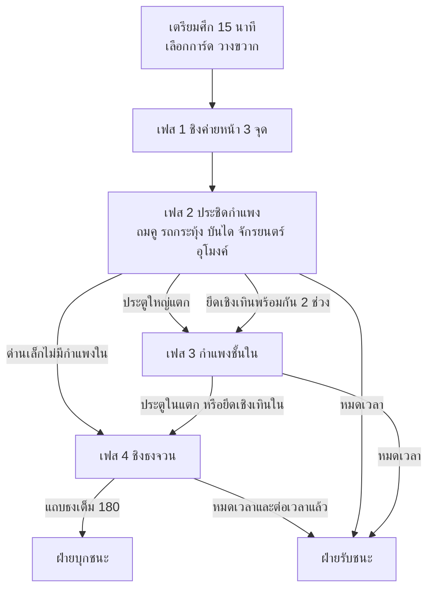

| เวลา (นาที) | เฟส | ฝ่ายบุก | ฝ่ายรับ | จุดเปลี่ยน |
| --- | --- | --- | --- | --- |
| −15 ถึง 0 | เตรียมศึก | แม่ทัพเลือกการ์ด 3 ใบ และแบ่งหน่วยช่าง | วางขวาก 12 ชิ้น และเลือกการ์ด 3 ใบ | ทุกคนเลือกชุดสกิลสงครามและค่ายกล 2 แบบ |
| 0 ถึง \~8 | 1 ชิงค่ายหน้า | ยืนในวง 20 วิ เพื่อยึดค่าย (นับสูงสุด 3 คน) | ออกทางประตูลับไปแย่งหรือเผาค่าย | ค่ายที่ยึดได้เป็นจุดเกิดและโรงช่าง |
| \~8 ถึง \~30 | 2 ประชิดกำแพง | ถมคู ดันรถ พาดบันได ตั้งจักรยนตร์ ขุดอุโมงค์ (เปิดนาทีที่ 10) | ทิ้งศิลา ผลักบันได ซ่อมประตู ขุดสกัด | ประตูใหญ่แตก หรือยึดเชิงเทินพร้อมกัน 2 ช่วง |
| \~25 ถึง \~45 | 3 กำแพงชั้นใน | พังประตูใน หรือพาดบันไดที่กำแพงใน | ถอยมาตั้งรับ และใช้การ์ดพลิกเกม | จุดเกิดฝ่ายรับย้ายไปหลังกำแพงใน และโรงเสบียงเปิดให้เผา |
| \~40 ถึง 60 | 4 ชิงธงจวน | ปักธง 10 วิ แล้วคุมลานจนแถบเต็ม | ขัดการปักธง และถอนธง 6 วิ | แถบเต็มเมื่อใด ฝ่ายบุกชนะทันที |

**กติกาเป้าหมาย**

- เชิงเทิน: ฝ่ายบุกยืนบนจุดยึด 45 วิ โดยไม่มีฝ่ายรับอยู่ (นับสูงสุด 3 คน) หอรบของช่วงนั้นหยุดยิงและบันไดลงเมืองเปิด ฝ่ายรับยึดคืนได้ด้วยกติกาเดียวกัน
- ถ้าเข้าเฟส 3 ทางเชิงเทิน รถกระทุ้งยังเข้าเมืองไม่ได้จนกว่าประตูใหญ่แตก
- แถบธง 0–180: เพิ่ม 1/วิ เมื่อมีแต่ฝ่ายบุกในลาน หยุดเมื่อมีทั้งสองฝ่าย และลด 2/วิ เมื่อมีแต่ฝ่ายรับ
- ลานธงนับไม่เกิน 5 คนต่อฝ่าย ต้องยืนบนพื้น คนบนม้าไม่นับ
- ถ้าฝ่ายรับถอนธงสำเร็จ แถบลดลงครึ่งหนึ่ง และฝ่ายบุกต้องปักใหม่
- ถ้าลานธงยังมีการแย่งกันตอน 60:00 ต่อเวลาได้ไม่เกิน 120 วิ
- Lineage W ให้ถือมงกุฎ 20 นาที ซึ่งยาวเกินไปสำหรับศึก 60 นาที เกมนี้จึงใช้แถบ 180 วิ

**เกิดใหม่และเหตุการณ์ตามเวลา**

| เรื่อง | ค่า |
| --- | --- |
| เกิดใหม่พื้นฐาน | 15 วิ ที่ค่ายหน้าที่ถืออยู่ หรือ 12 วิ ที่ค่ายหลวงซึ่งไกลกว่า |
| ค่ายหน้าถูกเผาหรือถูกยึดคืน | ต้องไปเกิดที่ค่ายหลวง ตามแบบธงของ Lineage 2 ที่ถูกทำลายแล้วต้องเกิดไกล |
| ฝ่ายที่ถือเป้าหมายน้อยกว่า | เกิดเร็วขึ้น 3 วิ |
| นาทีที่ 15 และ 35 | เหตุการณ์อากาศตามแผนที่ (ลมเปลี่ยนทิศหรือฝน) ประกาศล่วงหน้า 60 วิ |
| นาทีที่ 30 | ฝ่ายที่ตามหลังได้แต้มกลยุทธ์ +25 |
| นาทีที่ 50 “กลองศึกสุดท้าย” | ทั้งสองฝ่ายเกิดเร็วขึ้น 5 วิ และแต้ม 軍功 × 1.5 |
| แม่ทัพใหญ่ตาย | ศึกไม่จบ แต่ฝ่ายนั้นกดการ์ดไม่ได้ 30 วิ แม่ทัพใหญ่เกิดใหม่ 25 วิ และขวัญทัพทุกคนในฝ่าย −20 (ข้อ 4.3.6) |

แหล่งอ้างอิง: [三國志 卷03 (魏略 ศึกตันฉอง)](https://zh.wikisource.org/wiki/%E4%B8%89%E5%9C%8B%E5%BF%97/%E5%8D%B703) · [三國演義 第097回](https://zh.wikisource.org/wiki/%E4%B8%89%E5%9C%8B%E6%BC%94%E7%BE%A9/%E7%AC%AC097%E5%9B%9E) · [สามก๊ก ฉบับหน ตอนที่ 74](https://vajirayana.org/%E0%B8%AA%E0%B8%B2%E0%B8%A1%E0%B8%81%E0%B9%8A%E0%B8%81/%E0%B8%95%E0%B8%AD%E0%B8%99%E0%B8%97%E0%B8%B5%E0%B9%88-%E0%B9%97%E0%B9%94) · [Conqueror's Blade: Territory War Adjustment Plan](https://www.conquerorsblade.com/es/news/1359/) · [Lineage W: Kent Castle Siege](https://jplaygame.com/2026/08/18/siege-kent-castle-updated-in-lineage-w-the-battle-for-royal-authority-begins/) · [Lineage 2: Castle Sieges](https://en.wikibooks.org/wiki/Lineage_2/Castle_Sieges) · [Total War: Three Kingdoms siege guide](https://segmentnext.com/total-war-three-kingdoms-siege-guide-how-to-siege-outcomes/)

## 7.2 เครื่องตีเมือง สิ่งก่อสร้าง และดาเมจ

เครื่องบุกทุกชิ้นมีของแก้คู่กันตามบันทึกศึกตันฉองใน 魏略 ผู้เล่นเป็นลูกเรือของเครื่อง และห้ามซื้อเครื่องด้วยตำลึงหรือทอง เลขตอนของฉบับหนในตารางอิง vajirayana.org ส่วนเลขตอนของนิยาย (演義) อิงฉบับ 120 ตอน

**เครื่องฝ่ายบุก** ฝ่ายบุกนำเสบียงศึกเข้าศึกได้ไม่เกิน 1,000 และได้เพิ่ม 10 ต่อนาทีต่อค่ายหน้าที่ถืออยู่

| เครื่อง | ที่มา | หลักฐาน | ราคา (เสบียงศึก) / สร้าง (วิ) | มีพร้อมกัน | ลูกเรือ (คน) | HP | ผลในเกม | ของแก้ |
| --- | --- | --- | --- | --- | --- | --- | --- | --- |
| รถกระทุ้ง (衝車) | ประวัติศาสตร์ + นิยาย | 魏略: เฮ็กเจียวใช้ 繩連石磨 ทับจนรถหัก / 演義 ตอน 97 | 150 / 45 | 2 | 2–4 (เร็ว 1.5 / 2.0 / 2.5 ม./วิ) | 12,000 | ตีประตู 800 ทุก 3 วิ แตะ A ในวงเรือง ×1.5 หลังคาลดดาเมจธนู 70% | ศิลาผูกเชือก 3,000 ต่อครั้ง ไฟ ×1.5 |
| บันไดเมฆ (雲梯) | ประวัติศาสตร์ + นิยาย | 魏略: 以火箭逆射其雲梯 / ฉบับหน ตอน 74 “ทำบันไดแลเชือก” | 30 / 10 | 8 | คนแบก 1 (ช้าลง 30% ตีไม่ได้) | 2,000 | พาด 3 วิ ที่ช่องเรืองแสง 12 ช่อง ปีน 4 วิ ระหว่างปีนรับดาเมจ ×1.5 | ไฟ ×3 / ผลักบันไดด้วยการกดค้าง 3 วิ คนบนบันไดล้มและเสีย 20% HP |
| หอเกาทัณฑ์เคลื่อนที่ (井闌) | ประวัติศาสตร์ | 魏略: 井闌百尺 ฝ่ายรับแก้ด้วย 重牆 | 200 / 60 | 2 | ผู้ดัน 4 + พลธนูบนยอด 4 | 15,000 | พลธนูบนยอดได้สถานะที่สูง (ข้อ 4.1) ชิดกำแพงช่วงที่ถมคูแล้วครบ 10 วิ จะปล่อยสะพาน 3 เลน | ไฟ ×2 / จักรยนตร์ฝ่ายรับ / กำแพงชั้นใน |
| จักรยนตร์ (霹靂車) | ประวัติศาสตร์ + นิยาย | 袁紹傳: 太祖乃為發石車 / ฉบับหน ตอน 27 “ชักสายยนตร์พร้อมกัน” | 120 / 30 | 4 | คนเล็ง 1 + คนชักเชือก 1–3 (ถ้ามีคนเดียว ยิงช้าลงครึ่ง) | 6,000 | ระยะ 30–70 ม. ยิงทุก 10 วิ วงแดงเตือน 1.5 วิ ก่อนตก (ดาเมจดูตารางถัดไป) | หนังวัวชุบน้ำ −50% / ทหารม้าหรือจอมดาบบุกถึงตัว |
| อุโมงค์ (地道) | ประวัติศาสตร์ + นิยาย | 英雄記: เผาเสาค้ำใต้หอจนหอล้ม (易京) / 魏略: 城內穿地橫截之 / ฉบับหน ตอน 27 และ 74 | 250 / ปากอุโมงค์ 20 | 1 (สำเร็จได้ 2 ครั้งต่อศึก) | คนขุดไม่เกิน 8 (กด A ค้าง) | — | ขุด 300 หน่วย คนละ 0.1/วิ (8 คนใช้ราว 6 นาที 15 วิ) สำเร็จแล้วเลือก (ก) โค่นหอรบพร้อมกำแพง 20 ม. นับเป็นยึดเชิงเทิน 1 ช่วง หรือ (ข) ส่ง 12 คนโผล่ในเมืองภายใน 60 วิ | ขุดถึง 50% ฝ่ายรับได้ยินเสียง ขึ้นวง 20 ม. ที่มีจุดฟัง 3 จุด (จุดจริง 1) ขุดสกัดครบ 20 วิ อุโมงค์พังและคนขุดมึน 3 วิ |
| ถมคู (土丸填壍) | ประวัติศาสตร์ | 魏略: 以土丸填壍，欲直攀城 | กระสอบรับฟรีที่ค่ายหน้า | — | คนแบก 1 (ช้าลง 30%) | — | คู 1 ช่วงใช้ 20 กระสอบ | ฝ่ายรับขุดคืนได้ 1 กระสอบทุก 5 วิ |

- ทุก 20 วิ ของการขุด มีจังหวะ “เจอหิน” ให้แตะปุ่มบริบทภายใน 3 วิ ถ้าพลาด การขุดหยุดจนกว่าจะแตะ กันการถ่วงปุ่มและบอท
- อัปเกรดขั้นสูงผ่านเทคพันธมิตร (หลังเปิดไทย): จักรยนตร์กงล้อ ยิงชุดละ 3 ลูก อิงข้อเสนอของม้าจวิน (馬鈞) ใน 傅玄序 ซึ่งทดลองด้วยกระเบื้องแต่ไม่เคยใช้รบจริง ใน codex ต้องติดป้ายว่าเป็นข้อเสนอ

**สิ่งก่อสร้างฝ่ายรับ**

| สิ่งก่อสร้าง | ที่มา | หลักฐาน | จำนวน | ค่า | หมายเหตุ |
| --- | --- | --- | --- | --- | --- |
| ประตูใหญ่ | แต่งใหม่ (ตัวเลข) | — | 1 | HP 40,000 / 60,000 / 80,000 ตามระดับเมือง | ภาพ 3 ขั้นอบไว้: สมบูรณ์ / ร้าวที่ 50% / แตก |
| กำแพงชั้นใน (重牆) | ประวัติศาสตร์ | 魏略: 昭又於內築重牆 | 1 แนว | ประตูใน HP 30,000 | ปิดเมื่อเข้าเฟส 3 ใช้แทน甕城ซึ่งผิดยุค |
| หอรบ (樓櫨) | ประวัติศาสตร์ + นิยาย | 袁紹傳: 擊紹樓，皆破 / ฉบับหน ตอน 73 ใช้คำว่า “หอรบ” | 4 | HP 30,000 | ทหาร NPC บนหอยิง 3% HP ทุก 3 วิ ในระยะ 35 ม. และหยุดยิงเมื่อ HP ต่ำกว่า 30% ผู้เล่นบนหอได้สถานะที่สูง (ข้อ 4.1) |
| ศิลาผูกเชือก (繩連石磨) | ประวัติศาสตร์ + นิยาย | 魏略 / 演義 ตอน 97 衝車皆被打折 / ฉบับหน ตอน 74 “เอาก้อนศิลามาผูกเชือก” | 3 (เหนือประตู) | 3,000 ต่อรถ | คนคุม 1 คูลดาวน์ 45 วิ คนที่อยู่ใต้ประตูเสีย 15% HP และล้ม |
| หน้าไม้สิบลูก (元戎) | ประวัติศาสตร์ + นิยาย | 魏氏春秋: 一弩十矢俱發 / ฉบับหน ตอน 80 ยิงจากหอรบ “ยิงทีเดียวได้สิบลูก” | 4 | ยิง 10 ดอกเป็นกรวย 20 ม. ทุก 6 วิ ดอกละ 2% HP | คนคุม 1 ดาเมจต่อกองทหาร ×2 |
| จักรยนตร์ฝ่ายรับ | ประวัติศาสตร์ | โจโฉใช้ตั้งรับที่กัวต๋อ (袁紹傳) | 2 ตั้งประจำที่ | ระยะ 40–90 ม. | ใช้ตอบหอเกาทัณฑ์และเนินดิน |
| หนังวัวชุบน้ำ (濕牛皮) | ประวัติศาสตร์ | 傅玄序: 樓邊縣濕牛皮，中之則墮 | ทุกหอ | ลดดาเมจหิน 50% นาน 60 วิ | ใช้ด้วยการกดค้าง 3 วิ คูลดาวน์ 90 วิ |
| ขวากเขากวาง (鹿角) | ประวัติศาสตร์ | 徐晃傳: 圍塹鹿角十重 | 12 | HP 3,000 ต่อชิ้น | ขี่ม้าข้ามแล้วเสีย 20% HP และล้ม ถอนออกด้วยการกดค้าง 3 วิ |
| คูเมือง (塹) | ประวัติศาสตร์ | 袁紹傳: 長塹 / 公孫瓚傳: 圍塹十重 | 3 ช่วง | — | กันรถและหอเกาทัณฑ์ ยกเว้นทางดินหน้าประตู |
| โรงเสบียง | ประวัติศาสตร์ + นิยาย | โจโฉเผาเสบียงที่อัวเจ๋า (烏巢) / ฉบับหน ตอน 27 | 2 | HP 15,000 รับดาเมจจากไฟเท่านั้น | ไหม้ครบ 2 โรง ฝ่ายรับซ่อมช้าลง 50% และเกิดช้าลง 5 วิ |
| ประตูลับ | แต่งใหม่ | — | 2 | ใช้ได้เฉพาะฝ่ายรับ | ทางออกของการ์ด D2 |

**ดาเมจต่อสิ่งก่อสร้างและเครื่อง (ค่าคงที่ ไม่ขึ้นกับ BP)**

| แหล่งดาเมจ | ต่อประตู (ต่อครั้ง) | ต่อหอรบ (ต่อครั้ง) | ต่อเครื่องตีเมือง (ต่อครั้ง) | หมายเหตุ |
| --- | --- | --- | --- | --- |
| ตีปกติของผู้เล่น | 5 | 5 | 30 | — |
| สกิลของผู้เล่น | 15 | 15 | 80 | — |
| ท่าปิดหนักตระกูลทุบ H3 และ H4 (ขุนศึก/ป้อมปราการ) | 600 | 600 | 300 | นับได้ครั้งละ 1 ต่อ 18 วิต่อคน |
| ขั้นสุดแปดร้อยทะลวงหับป๋า (ขุนศึก/ทะลวงทัพ) | 2,000 | 2,000 | 1,000 | ขั้นสุดสายอื่นนับเป็นสกิลของผู้เล่น |
| จักรยนตร์ คำสั่งจักรยนตร์ของกุนซือ และหินของกองจักรยนตร์ (ต่อลูก) | 375 | 1,500 | 1,500 | ต่อผู้เล่น 10% HP ในรัศมี 4 ม. และ 5% ถึงรัศมี 8 ม. ต่อกองทหาร 15% |
| รถกระทุ้ง (ทุก 3 วิ) | 800 (×1.5 ในวงเรือง) | — | — | — |
| กองทหารทั่วไป (ต่อวิ) | 20 | 20 | 40 | — |
| ทหารกลยุทธ์ของกุนซือ (ต่อวิ) | 60 | 60 | 60 | ใช้ค่านี้แทนตัวคูณสิ่งก่อสร้างในข้อ 4.4 |
| ตัวคูณไฟ | ×2 กับประตูไม้ | ×2 | รถ ×1.5 / หอเกาทัณฑ์ ×2 / บันไดและหุ่นฟาง ×3 | กำแพงดินอัดไม่รับดาเมจไฟ |

- สิ่งก่อสร้างหนึ่งชิ้นนับดาเมจจากแหล่งที่แรงที่สุดไม่เกิน 12 แหล่งต่อวินาที
- กำแพงดินอัดพังได้ด้วยอุโมงค์เท่านั้น หินไม่ทำดาเมจกำแพง
- การซ่อม: ฝ่ายรับแบกไม้ซ่อมได้ 100 HP ทุก 3 วิต่อคน ซ่อมชิ้นเดียวกันพร้อมกันได้ไม่เกิน 3 คน และซ่อมไม่ได้ 10 วิหลังโดนเครื่องตีเมือง

**มาตรฐานภาพ (ยุคปลายฮั่น)**

| วัตถุ | ต้องเป็นแบบนี้ | ห้าม | ขนาดสไปรต์ (px native) | ทิศและภาพ |
| --- | --- | --- | --- | --- |
| กำแพงเมือง | ดินอัด (夯土) เห็นชั้นดินหนาราว 10 ซม. ด้านบนมีใบเสมาและทางเดินไม้ | กำแพงอิฐเต็มแบบสมัยหมิง (อิฐหุ้มใช้ได้แค่เมืองหลวงเป็นกรณีพิเศษ) | tile 16 หน้าสูง 48–64 ทางเดินบน 32 (ข้อ 2) | ไม่มีทิศ วาดเฉพาะหน้าด้านใต้ |
| ประตูใหญ่และหอประตู | ประตูไม้หุ้มแผ่นโลหะ หอประตูไม้ 2 ชั้น มี闕คู่หน้าประตู | กำแพงวงล้อมประตู (甕城) ซึ่งเกิดหลังยุคนี้ | ช่องประตู 48×48 หอประตูฐาน 8×3 ช่อง สูง ≤128 (ข้อ 2) | ภาพ 3 ขั้นพัง + ชุดแตก 14 เฟรมพรีเรนเดอร์ |
| หอรบ | หอไม้บนฐานดินอัด หลังคากระเบื้อง | — | ฐาน 3×3 ช่อง สูง ≤128 หลังคาเป็นชั้น overhead | ไม่มีทิศ ภาพ 3 ขั้นพัง |
| จักรยนตร์ | แบบคนชักเชือก (traction) แขนไม้ยาว มีสลิงใส่หิน | แบบถ่วงน้ำหนัก (counterweight) ซึ่งเข้าจีนราวปี 1268–1273 | สูง ≤96 ช่อง ≤128² | 5 ทิศ + mirror (ข้อ 6.1) |
| รถกระทุ้ง | ซุงหัวโลหะแขวนเชือกใต้หลังคาไม้หุ้มหนัง ล้อ 4–6 ล้อ | — | ยาว ≤96 ช่อง ≤128² | 5 ทิศ + mirror |
| บันไดเมฆ | บันไดพับบนฐานล้อ มีแผ่นไม้บังหน้า | — | พาดแล้วสูงเท่าหน้ากำแพง 48–64 ช่อง ≤96² | 5 ทิศ + mirror |
| หอเกาทัณฑ์เคลื่อนที่ | หอไม้มีล้อ ผนังไม้บังธนู สูงเท่ากำแพง | — | สูง ≤128 ช่อง ≤192² | 5 ทิศ + mirror |
| ไฟและเรือไฟ | ฟางและฟืนราดน้ำมัน ควันดำ | ระเบิดหรือดินปืนทุกชนิด | เปลว flipbook 12×16 วนสี 4 ดัชนี อนุภาค ≤300 ต่อจุด | ไม่มีทิศ |
| ทหารจำลอง (ชั้นฝูงชน) | เกราะหนังสีฝ่าย ถือทวนหรือโล่ | — | สูง 28 ชีตทหารชุดเดียวกับทหารจริง (ข้อ 7.5) | 5 ทิศ + mirror 4 ท่า |

- ท่าลูกเรือใช้ร่วมกันทุกเครื่อง 5 ท่า (ดัน ชักเชือก แบก ขุด ตีกลอง) × 2 เพศ รวม 10 คลิป
- รูปทรงอ้างอิงจากภาพจำลองทางโบราณคดีหรือของในพิพิธภัณฑ์ ไม่อ้างอิงเกมของ Koei
- ชื่อที่มาจากฉบับหน: จักรยนตร์ ศิลาผูกเชือก เกาทัณฑ์เพลิง หอรบ เชิงเทิน คูเมือง ขวาก อุโมงค์ ทำนบ ส่วนชื่อที่ตั้งใหม่: รถกระทุ้ง บันไดเมฆ หอเกาทัณฑ์เคลื่อนที่ ขวากเขากวาง หนังวัวชุบน้ำ หน้าไม้สิบลูก กำแพงชั้นใน

แหล่งอ้างอิง: [三國志 卷03 (魏略)](https://zh.wikisource.org/wiki/%E4%B8%89%E5%9C%8B%E5%BF%97/%E5%8D%B703) · [三國志 卷06 (袁紹傳)](https://zh.wikisource.org/wiki/%E4%B8%89%E5%9C%8B%E5%BF%97/%E5%8D%B706) · [三國志 卷08 (公孫瓚傳)](https://zh.wikisource.org/wiki/%E4%B8%89%E5%9C%8B%E5%BF%97/%E5%8D%B708) · [三國志 卷29 (傅玄序)](https://zh.wikisource.org/wiki/%E4%B8%89%E5%9C%8B%E5%BF%97/%E5%8D%B729) · [三國志 卷35 (元戎)](https://zh.wikisource.org/wiki/%E4%B8%89%E5%9C%8B%E5%BF%97/%E5%8D%B735) · [สามก๊ก ฉบับหน ตอนที่ 27](https://vajirayana.org/%E0%B8%AA%E0%B8%B2%E0%B8%A1%E0%B8%81%E0%B9%8A%E0%B8%81/%E0%B8%95%E0%B8%AD%E0%B8%99%E0%B8%97%E0%B8%B5%E0%B9%88-%E0%B9%92%E0%B9%97) · [สามก๊ก ฉบับหน ตอนที่ 80](https://vajirayana.org/%E0%B8%AA%E0%B8%B2%E0%B8%A1%E0%B8%81%E0%B9%8A%E0%B8%81/%E0%B8%95%E0%B8%AD%E0%B8%99%E0%B8%97%E0%B8%B5%E0%B9%88-%E0%B9%98%E0%B9%90) · [杭侃: 中国古代城墙的用砖问题](https://ygx.sxu.edu.cn/static/xzts/2/%E4%B8%AD%E5%9B%BD%E5%8F%A4%E4%BB%A3%E5%9F%8E%E5%A2%99%E7%9A%84%E7%94%A8%E7%A0%96%E9%97%AE%E9%A2%98_%E6%9D%AD%E4%BE%83.pdf) · [维基百科: 瓮城](https://zh.wikipedia.org/wiki/%E7%93%AE%E5%9F%8E) · [Wikipedia: Trebuchet](https://en.wikipedia.org/wiki/Trebuchet)

## 7.3 การ์ดกลศึกและกลไกพลิกเกม

แม่ทัพใช้แต้มกลยุทธ์กดการ์ดกลศึก 3 ใบที่เลือกไว้ก่อนศึก การ์ดทุกใบติดป้ายที่มาในเกม คือ 史 (ประวัติศาสตร์) 演 (นิยาย) หรือ 傳 (ตำนาน)

**แต้มกลยุทธ์ (0–100)**

- ได้ 10 ต่อนาทีเป็นพื้นฐาน ยึดค่ายหน้า ยึดเชิงเทิน หรือพังหอรบได้ +10 และทำลายเครื่องได้ +5
- ฝ่ายที่ตามหลังได้แต้ม ×1.5 วัดจากดัชนีเป้าหมาย: ค่ายหน้า 1 เชิงเทินหรือหอรบ 2 ประตูนอก 4 ประตูใน 4
- คนที่กดได้คือแม่ทัพใหญ่กับรองแม่ทัพ 2 คน ใช้แต้มก้อนเดียวกัน
- ใบหนึ่งใช้ได้ 1 ครั้ง ยกเว้นใบที่ราคาไม่เกิน 35 ใช้ได้ 2 ครั้ง
- การ์ดแบบเปิดเผยขึ้นแถบเตือนให้ฝ่ายตรงข้ามเห็น 5 วิ ส่วนการ์ดลวง (A1 และ A4) ไม่มีแถบเตือน
- ขุนพลกาชาที่ผูกกับการ์ดเปลี่ยนได้แค่ภาพ เสียงพากย์ และแอนิเมชันตอนร่าย ไม่ลดราคาและไม่เพิ่มพลัง

**การ์ด 13 ใบ**

| รหัส | การ์ด | ฝ่าย | ที่มา | หลักฐาน | แต้ม | ผล | ทางแก้ |
| --- | --- | --- | --- | --- | --- | --- | --- |
| A1 | จดหมายสวามิภักดิ์ปลอมของอุยกาย (詐降書) | บุก | ประวัติศาสตร์ (ตัวเสริมเป็นนิยาย) | 周瑜傳: 先書報曹公，欺以欲降 / ฉบับหน ตอน 41 อุยกายถูกตีห้าสิบที | 60 | เลือกกองทหารฝ่ายเราได้สูงสุด 5 กอง ฝ่ายรับเห็นเป็นสีฝ่ายตัวเอง 25 วิ หรือจนกว่ากองนั้นจะโจมตี ถ้าถึงประตูได้ ไฟลุกท่วมประตู 5,000 และติดไฟ 10 วิ ตัวเสริม “ทุกข์กาย” (演): จ่ายขวัญทัพ 30 เพื่อยืดเวลาอีก 10 วิ | ธงสอดแนม หรือสกิลเปิดเผยของนักธนูซุ่มยิง |
| A2 | โซ่ร้อยเรือ (連環計) | บุก | นิยาย (รากประวัติศาสตร์: เรือจอด 首尾相接) | 演義 ตอน 47 บังทอง / ฉบับหน ตอน 41 “เอาสายโซ่ร้อยให้ชิดเข้าไว้” | 40 | วงรัศมี 15 ม. นาน 12 วิ ศัตรูในวงติดสถานะ “ผูกโซ่” เดินช้าลง 30% และไฟลามระหว่างผู้ติดโซ่ที่ห่างกันไม่เกิน 4 ม. | กลิ้งหลบออกจากวง (ใช้ 1 ชาร์จ) หรือกระจายตัว |
| A3 | แท่นเจ็ดดาวขอลมสลาตัน (東南風) | บุก | ประวัติศาสตร์ (ลม) + นิยาย (การเรียกลม) | 江表傳: 時東南風急 / 演義 ตอน 49 七星壇 / ฉบับหน ตอน 41 ร้านสามชั้นบนเขาลำปินสาน | 70 | ยืนร่ายที่แท่นเจ็ดดาว 5 วิ (ถูกขัดได้) แล้วได้ผล 90 วิ: ไฟแรงขึ้น 50% ลามไกลขึ้น 2 เท่า และกระสุนของฝ่ายบุกทั้งผู้เล่นและทหารที่ยิงเข้าหาเมืองเร็วขึ้น 40% ไม่ซ้อนกับขั้นสุดขงเบ้งขอลมสลาตัน (ข้อ 4.2) ใช้ค่าที่สูงกว่า | ส่งจอมดาบไปขัดตอนร่าย และใช้หนังวัวชุบน้ำ |
| A4 | ลวงตะวันออก ตีตะวันตก (聲東擊西) | บุก | ประวัติศาสตร์ (ชื่อกลตั้งภายหลัง) | 武帝紀: ซุนฮิว (荀攸) ให้แสร้งยกไป延津 แล้วส่งทัพเบาตีแปะแบ๊ (白馬) | 30 | วางไอคอนทัพลวง 30 กองบนแผนที่ย่อของข้าศึก พร้อมเสียงกลอง 40 วิ ผู้เล่นฝ่ายเราที่อยู่อีกแนวหายจากแผนที่ย่อของข้าศึก 15 วิ | สิ่งที่หอรบมองเห็นจริงในระยะ 35 ม. ไม่ถูกหลอก |
| A5 | ทดน้ำ (決水灌城) | บุก | ประวัติศาสตร์ + นิยาย | 武帝紀: 決泗、沂水以灌城 (แห้ฝือ) และ 決漳水灌城 (เงียบกุ๋น) / ฉบับหน ตอน 29 ทำทำนบกั้นแม่น้ำเจียงโห | 80 | ใช้ได้เฉพาะแผนที่ริมน้ำ ต้องยึดทำนบก่อน และใช้หลังนาทีที่ 30: ลานในเมืองโซนต่ำน้ำท่วม 60 วิ ฝ่ายรับเดินช้าลง 40% ซ่อมไม่ได้ และเกิดช้าลง 10 วิ | ยึดทำนบคืนก่อนนาทีที่ 30 |
| A6 | เนินดินหอยิง (土山高櫨) | บุก | ประวัติศาสตร์ + นิยาย | 袁紹傳: 紹為高櫨，起土山 / ฉบับหน ตอน 27 ถมเนินรอบค่ายห้าสิบเนิน | 35 | สร้างเนินที่จุดกำหนดใน 8 วิ พลธนูบนเนินได้ไม่เกิน 10 คน ได้สถานะที่สูง 120 วิ (ยิงข้ามเชิงเทิน ดาเมจยิง +10% ข้อ 4.1) | จักรยนตร์ฝ่ายรับ |
| A7 | ยืมเกาทัณฑ์ (草船借箭) | บุก | นิยาย (รากประวัติศาสตร์: เรือซุนกวนที่濡須) | 演義 ตอน 46 / ฉบับหน ตอน 40 เรือฟาง 20 ลำ / 魏略: 箭均船平 | 30 | หุ่นฟาง 6 ตัวดึงการยิงของหอรบไว้ 20 วิ ทุก 10 ดอกที่หุ่นรับ พลธนูฝ่ายเรายิงเร็วขึ้น 1% (สูงสุด 20%) นาน 60 วิ | เกาทัณฑ์เพลิงเผาหุ่น (ไฟ ×3) |
| D1 | ค่ายร้าง (空營 / 空城計) | รับ | ประวัติศาสตร์ (จูล่ง) + นิยาย (ขงเบ้ง) | 趙雲別傳: 更大開門，偃旗息鼓 / 演義 ตอน 95 / ฉบับหน ตอน 73 เมืองเสเสีย | 50 | เปิดประตูใหญ่ 20 วิ (ถ้ายังไม่แตก) ฝ่ายรับในรัศมี 30 ม. หายจากแผนที่ย่อและซ่อนป้ายชื่อ กองทหาร AI ฝ่ายบุกไม่เข้าประตู และการตีครั้งแรกจากที่ซุ่มแรงขึ้น 30% | ผู้เล่นที่กล้าบุกเข้าไปเอง ครบเวลาประตูจะปิด และคนที่เข้าไปแล้วอยู่ในเมืองต่อได้ |
| D2 | ตีสวนหับป๋า (張遼 八百) | รับ | ประวัติศาสตร์ | 張遼傳: 得八百人…衝壘入，至權麾下 ที่หับป๋า (合肥) | 60 | ปลดเมื่อตามหลังเท่านั้น (ประตูนอกแตก หรือฝ่ายบุกถือค่ายหน้าครบ 3 จุดนาน 5 นาที) เปิดประตูลับ 45 วิ ออกไปได้สูงสุด 30 คน ได้ความเร็ว +25% ลดดาเมจ 20% ดาเมจต่อเครื่อง ×3 และขวัญทัพ +30 | ตั้งกองรับรอบเครื่อง หรือใช้เนินดินปิดทาง |
| D3 | เผาค่ายเจ็ดร้อยลี้ (火燒連營) | รับ | ประวัติศาสตร์ + นิยาย | 陸遜傳: 各持一把茅…破其四十餘營 / 文帝紀: 樹柵連營七百餘里 / 演義 ตอน 84 | 70 | ค่ายหน้าของฝ่ายบุกทุกจุดติดไฟ 30 วิ เครื่องที่กำลังสร้างถูกทำลาย ค่ายเสีย 30% HP ทุก 10 วิ ถ้าไหม้หมด ค่ายนั้นกลับเป็นกลาง | ตักน้ำดับ (กดค้าง 3 วิต่อจุดไฟ) และไม่รวมเครื่องไว้ค่ายเดียว |
| D4 | ทัพหนุนซิหลง (徐晃救至) | รับ | ประวัติศาสตร์ | 曹仁傳: 徐晃救至…仁得潰圍出 ที่เมืองอ้วนเสีย (樊城) | 80 | ใช้ได้หลังนาทีที่ 40: กองหนุน NPC 4 กองเข้าทางปีก ล่าเครื่องตีเมือง 60 วิ และฝ่ายรับเกิดเร็วขึ้น 5 วิ นาน 90 วิ | ส่งนักธนูหรือขุนศึกไปดักที่ปีก |
| D5 | จดหมายขีดฆ่า (反間) | ทั้งสองฝ่าย | ประวัติศาสตร์ + นิยาย | 武帝紀: 與遂書，多所點竄 (หันซุย) / 演義 ตอน 45 เจียวก้านขโมยหนังสือ | 40 | เปิดดูการ์ดที่เหลือของข้าศึก ถ้าข้าศึกกดการ์ดภายใน 60 วิ ใบนั้นถูกยกเลิกและได้แต้มคืน 50% | รอให้ครบ 60 วิแล้วค่อยกด |
| D6 | เกาทัณฑ์เพลิงระดม (火箭) | รับ | ประวัติศาสตร์ + นิยาย | 魏略: 以火箭逆射其雲梯 / 演義 ตอน 97 | 35 | 20 วิ การโจมตีระยะไกลทั้งหมดของฝ่ายรับกลายเป็นไฟ (×3 ต่อบันไดและหุ่นฟาง ×2 ต่อเครื่องไม้) | ค่ายกลบังโล่รอบเครื่อง และกระจายเครื่องออกจากกัน |

- หน้า codex ของทุกการ์ดแสดงหลักฐานประวัติศาสตร์คู่กับฉบับนิยาย เช่น ลมของ江表傳คู่กับแท่นเจ็ดดาว
- codex ของ D1 ต้องบอกว่าเรื่องขงเบ้งเปิดเมืองใน 裴注 มาจาก郭沖 เกิดที่陽平 และ裴松之แย้งไว้แล้ว

**กลไกพลิกเกม**

- ฝ่ายที่ตามหลังได้แต้มกลยุทธ์ ×1.5
- การ์ด D2 ปลดได้เฉพาะตอนตามหลัง และ D4 ใช้ได้เฉพาะช่วงท้ายศึก
- “ทัพฮึกเหิม” ของฝ่ายบุก: ถ้าเป้าหมายไม่คืบหน้าติดกัน 6 นาที เครื่องจะถูกลงและสร้างเร็วขึ้น 30% จนกว่าจะได้เป้าหมายถัดไป
- “เมืองอดอยาก” (อิงศึกเงียบกุ๋น ที่ 城中餓死者過半): ถ้าฝ่ายบุกถือค่ายหน้าครบ 3 จุดติดกัน 10 นาที ฝ่ายรับซ่อมช้าลง 50% จนกว่าจะแย่งคืนได้ 1 จุด กติกานี้บังคับให้ฝ่ายรับออกมาสู้
- ฝ่ายที่ถือเป้าหมายน้อยกว่าเกิดเร็วขึ้น 3 วิ
- แถบธงลดทีละ 2 ต่อวิ ไม่รีเซ็ตทันที ทั้งสองฝ่ายจึงยังมีเวลาตีกลับ
- นาทีที่ 50 มี “กลองศึกสุดท้าย”
- ฝ่ายที่คนน้อยกว่าได้แต้ม 軍功 เพิ่ม แต่ไม่ได้บัฟพลังรบ

**กติกากันทัพมหึมา**

| กติกา | ค่า |
| --- | --- |
| คนต่อฝ่าย | 60 / 100 / 150 ตามระดับเมือง พันธมิตรเดียวใช้ช่องได้ไม่เกิน 60% |
| เพดานค่าพลัง | ส่วนที่เกินเพดานนับ 30% (เมืองหลวงไม่กด) |
| ดาเมจต่อสิ่งก่อสร้าง | ค่าคงที่ และนับไม่เกิน 12 แหล่งต่อวินาทีต่อชิ้น |
| จุดยึด (ค่ายหน้า เชิงเทิน ลานธง) | นับ 3–5 คน และต้องยืนบนพื้น |
| สกิลวงกว้างของผู้เล่น | โดนผู้เล่นได้ไม่เกิน 8 คนต่อครั้ง ส่วนไฟลาม หิน และศิลาไม่จำกัดจำนวนเป้า |
| สถานะ “แออัด” | ฝ่ายเดียวกันเกิน 20 คนอยู่ในรัศมี 10 ม. นานเกิน 5 วิ ทั้งกลุ่มรับดาเมจไฟและเครื่องตีเมืองเพิ่ม 15% และขึ้นไอคอนโซ่ (บทเรียนเรือผูกโซ่ที่เซ็กเพ็ก) |
| ฮีลซ้อน | ได้ฮีลจากเกิน 3 คนใน 5 วิ ส่วนที่เกินลดลง 50% |
| ฆ่าคนเดิมซ้ำในศึกเดียว | ตามข้อ 4.3.5: ครั้งที่ 1–3 ได้เต็ม ครั้งที่ 4–5 ได้ 50% หลังจากนั้น 0 |

แหล่งอ้างอิง: [三國志 卷54 (周瑜傳 และ 江表傳)](https://zh.wikisource.org/wiki/%E4%B8%89%E5%9C%8B%E5%BF%97/%E5%8D%B754) · [三國志 卷01 (武帝紀)](https://zh.wikisource.org/wiki/%E4%B8%89%E5%9C%8B%E5%BF%97/%E5%8D%B701) · [三國志 卷02 (文帝紀)](https://zh.wikisource.org/wiki/%E4%B8%89%E5%9C%8B%E5%BF%97/%E5%8D%B702) · [三國志 卷58 (陸遜傳)](https://zh.wikisource.org/wiki/%E4%B8%89%E5%9C%8B%E5%BF%97/%E5%8D%B758) · [三國志 卷17 (張遼傳 于禁傳 徐晃傳)](https://zh.wikisource.org/wiki/%E4%B8%89%E5%9C%8B%E5%BF%97/%E5%8D%B717) · [三國志 卷09 (曹仁傳)](https://zh.wikisource.org/wiki/%E4%B8%89%E5%9C%8B%E5%BF%97/%E5%8D%B709) · [三國志 卷36 (趙雲別傳)](https://zh.wikisource.org/wiki/%E4%B8%89%E5%9C%8B%E5%BF%97/%E5%8D%B736) · [三國志 卷35 (郭沖 และ裴松之)](https://zh.wikisource.org/wiki/%E4%B8%89%E5%9C%8B%E5%BF%97/%E5%8D%B735) · [三國志 卷47 (魏略 濡須)](https://zh.wikisource.org/wiki/%E4%B8%89%E5%9C%8B%E5%BF%97/%E5%8D%B747) · [สามก๊ก ฉบับหน ตอนที่ 41](https://vajirayana.org/%E0%B8%AA%E0%B8%B2%E0%B8%A1%E0%B8%81%E0%B9%8A%E0%B8%81/%E0%B8%95%E0%B8%AD%E0%B8%99%E0%B8%97%E0%B8%B5%E0%B9%88-%E0%B9%94%E0%B9%91)

## 7.4 บทบาท การควบคุม และ HUD ในศึก

ทุกสายมีงานชัดเจนในศึก และผู้เล่นพลังต่ำมีบทบาทที่ไม่ต้องใช้ BP แต่ทำแต้มติดอันดับได้จริง

**บทบาทของ 8 สาย**

| สาย | ฝ่ายบุก | ฝ่ายรับ | ปรับเฉพาะในศึก |
| --- | --- | --- | --- |
| ขุนศึก / ป้อมปราการ | ทุบประตูด้วยท่าปิดหนักตระกูลทุบ (600 ต่อครั้ง ข้อ 7.2) คุ้มรถกระทุ้งด้วยค่ายกลบังโล่ และยกอานบังนายรับศรแทนลูกเรือ | ยืนคอประตูหลังประตูแตก และใช้ตวาดสะพานเตียงปันเกี้ยวกดคนที่ปีนขึ้นมา | “ตวาดสะพานเตียงปันเกี้ยว” ต่อผู้เล่นใช้ค่า PvP ในข้อ 4.2 (ลดดาเมจ 15% และชะลอ ไม่ยั่ว) |
| ขุนศึก / ทะลวงทัพ | ทะลวงค่ายโกซุ่นเจาะแนวหลังประตูแตก ล่าคนปักธง และใช้ขั้นสุดแปดร้อยทะลวงหับป๋าทำ 2,000 ต่อสิ่งก่อสร้าง | ออกทางประตูลับไปพังเครื่อง | — |
| จอมดาบ / ดวลเดี่ยว | ขึ้นบันไดก่อน ล่าคนคุมศิลาและหน้าไม้ และขัดคนขุดสกัด | ล่าลูกเรือจักรยนตร์ และขัดแม่ทัพที่แท่นเจ็ดดาว | “กำเหลงปล้นค่าย” วาร์ปข้ามกำแพง ขึ้นเชิงเทิน หรือเข้าเขตที่ยังไม่มีทางเดินถึงไม่ได้ |
| จอมดาบ / กวาดล้าง | ล้างกองทหารบนเชิงเทิน และยึดลานธง | ล้างคนที่ปีนขึ้นเชิงเทิน | — |
| นักธนู / ซุ่มยิง | ยิงคนคุมป้อมด้วยท่าพิเศษระยะ 20 ม. ยืนริมคูนอกยิงถึงเชิงเทิน | ยิงลูกเรือรถกลางทาง และเปิดโปงกองปลอมตัวของการ์ด A1 | — |
| นักธนู / ห่าธนู | ใช้ห่าธนูกดเชิงเทินให้พาดบันไดได้ และขึ้นยิงบนหอเกาทัณฑ์หรือเนินดิน | ยิงห่าธนูใส่ลูกเรือ และเผาบันได | ห่าเพลิง (ระดมยิงดังห่าฝนที่กินติดไฟ) นับเป็นไฟ ×3 ต่อบันไดและหุ่นฟาง ×2 ต่อเครื่องไม้ |
| กุนซือ / เพลิงกลยุทธ์ | เผาโรงเสบียงและหอรบ ต่อคอมโบกับการ์ดโซ่ร้อยเรือ | เผาเครื่องตีเมือง บันได และหุ่นฟาง | สกิล “โซ่ร้อยเรือ” โยงเครื่องตีเมืองที่ห่างกันไม่เกิน 4 ม. ได้ |
| กุนซือ / เสนาธิการ | ฮีลลูกเรือ บัฟทั้งทัพ และใช้ค่ายศิลาแปดประตูคุมทางเข้า | ชุบชีวิตคนคุมป้อม และตั้งค่ายกลหน้าประตูที่แตก | — |

**บทบาทที่ไม่ต้องใช้ BP** (แนวคิดจากคลังเครื่องตีเมืองของ Conqueror's Blade ที่ให้คนพลังต่ำช่วยงานขนส่ง)

| บทบาท | งาน | แต้ม 軍功 |
| --- | --- | --- |
| ช่างกล | ดันรถ ตีจังหวะ ชักเชือกจักรยนตร์ | 1 ต่อวิ ขณะเครื่องทำงานในระยะเป้า |
| กองเสบียง | แบกกระสอบถมคู แบกบันได ขนไม้ซ่อม | 15 ต่อกระสอบหรือบันไดที่วางสำเร็จ / 1 ต่อ 100 HP ที่ซ่อม |
| นักขุด | ขุดอุโมงค์หรือขุดสกัด | 0.5 ต่อวิ และโบนัส 100 เมื่อสำเร็จ |
| มือกลอง | ตีกลองศึกตามจังหวะ (อิง 雷鼓震天 ของจูล่ง) พันธมิตรในรัศมี 25 ม. ตีเร็วขึ้น 10% และได้ขวัญทัพ +5 ทุก 10 วิ | 0.5 ต่อวิ |
| หน่วยสอดแนม | ปักธงสอดแนม มองเห็นรัศมี 20 ม. นาน 60 วิ ใช้หากองปลอมตัวและจุดฟังอุโมงค์ | 20 ต่อการเปิดโปงหนึ่งครั้ง |
| พลประจำป้อม (ฝ่ายรับ) | คุมศิลา หน้าไม้ หนังวัว และผลักบันได | 30 ต่อรถที่โดน / 15 ต่อบันไดที่ผลัก |

- แต้มฆ่า ช่วยฆ่า สิ่งก่อสร้าง และจบศึกใช้ตาราง 軍功 ในข้อ 4.3.5 (ฆ่า 20 ช่วยฆ่า 10) ได้เป้าหมายให้ทุกคนในรัศมี 30 ม. คนละ 50 และแม่ทัพกดการ์ดได้ 50 ต่อใบ ทุกแหล่งอยู่ใต้เพดาน 6,000 ต่อศึก
- ประจำรถที่ประตู 1 นาทีได้ 60 แต้ม เท่ากับฆ่า 3 คน ลูกเรือจึงติด 10 อันดับแรกได้จริง

**ออโต้ในศึก** (ตามนโยบายออโต้ข้อ 8 ของกรอบควบคุม)

| ใช้ได้ | ใช้ไม่ได้ |
| --- | --- |
| เดินอัตโนมัติไปจุดรวมพลหรือธงแม่ทัพ ร่ายใส่เป้าอัตโนมัติ ลำดับเป้าพร้อมสวิตช์ “ตีสิ่งก่อสร้าง” และกด A ค้าง (รวมการดันรถ ขุด และชักเชือก) | ใช้สกิลอัตโนมัติ ใช้คำสั่งทัพอัตโนมัติ และคอมโบกดปุ่มเดียว |

- ถ้าไม่มีอินพุตอื่นนอกจากกด A ค้างเกิน 90 วิ แต้มหยุดนับ และถ้าเกิน 180 วิ ถูกย้ายไปคิวสำรอง

**ม้า ค่ายกล และกองทหารในศึก**

- ม้าใช้ได้นอกกำแพงและผ่านประตูที่แตกแล้ว ถ้าจะขึ้นบันได หอเกาทัณฑ์ หรือเข้าอุโมงค์ ต้องลงม้า (ลงอัตโนมัติ 0.3 วิ ตามข้อ 6.3)
- เหนือแนวกำแพงนอกเรียกม้าใหม่ไม่ได้ และขี่ม้าข้ามขวากเขากวางแล้วเสีย 20% HP และล้ม
- ค่ายกลเลือก 2 แบบตามกรอบควบคุม (คูลดาวน์ 10 วิ เปลี่ยนแถว 2 วิ)
- ค่ายกลเฉพาะศึก “บังโล่” (蒙楯 จาก 營中皆蒙楯 ที่กัวต๋อ) ปลดที่ยศทหารขั้น 5 หัวหน้ากองใหญ่ (軍候) เป็นค่ายกลเฉพาะแผนที่แบบเดียวกับเพลิงและวารีในข้อ 4.4 ใช้ได้เฉพาะในสงคราม: กองที่คุ้มเครื่องในรัศมี 5 ม. ลดดาเมจธนูให้เครื่องและลูกเรือ 40% แต่เดินช้าลง 20%
- กองทหารหนึ่งกองเป็น 1 เอนทิตี จำนวนตัวที่วาดตามตารางข้อ 4.3.1 (กองตัวเอง 6 ตัว กองคนอื่น 2–3 ตัว) ส่วนกำลังพลแสดงเป็นตัวเลขบนธงกองและบนปุ่มทัพ

**การควบคุมเครื่อง**

| สถานการณ์ | ปุ่ม | ผล |
| --- | --- | --- |
| อยู่ในระยะ 3 ม. จากเครื่องหรือจุดงาน | ปุ่มบริบท 104 px (ห่างขวา 500 ห่างล่าง 196 ตามผัง HUD ข้อ 2.2) | ประจำเครื่อง / พาดบันได / ขุด / ตีกลอง / แบก |
| โหมดลูกเรือ | A | ดัน ชักเชือก บรรจุ หรือขุด (กดค้างได้) |
| โหมดลูกเรือ | สกิลช่อง 1 | เล็งยิง จักรยนตร์ใช้การลากเล็งและมีวงบนพื้นแสดงจุดตก |
| โหมดลูกเรือ | ปุ่มหลบ | ออกจากเครื่อง |
| โหมดลูกเรือ | สกิลช่องอื่น | เป็นสีเทา |
| รถกระทุ้ง | จอยซ้าย | ใช้ได้เฉพาะคนดันหัวแถวเพื่อเลือกทาง คนอื่นกด A ค้างเพื่อออกแรงดัน |
| จังหวะเรือง | วงหดรอบปุ่ม A ทุก 3 วิ | ช่วงเรืองกว้าง 0.45 วิ (ไม่ต่ำกว่า 400 ms ตามกรอบ) เซิร์ฟเวอร์ตัดสินจาก timestamp เผื่อความคลาด ±150 ms |
| แม่ทัพ | แถบการ์ด 3 ใบ ใบละ 88 px | แตะการ์ดแล้วกล้องสลับเข้าขั้นมุมแม่ทัพ (วิว ×1.5 เฟด 0.2 วิ) และเปิดการลากเล็งบนพื้น |
| แม่ทัพ | กดค้างที่แผนที่ย่อ | ปิง 4 แบบ: บุก / ถอย / รวมพล / ระวัง |

**HUD (ออกแบบที่ 1280×720 แบบ Fit Height)**

| องค์ประกอบ | ตำแหน่ง | ขนาด (px) |
| --- | --- | --- |
| แผนที่ย่อ | ขวาบนตามผัง HUD ข้อ 2.2 | 152×152 แตะแล้วเปิดแผนที่ยุทธวิธีเต็มจอ (ไม่หยุดเกม) |
| เวลา ชื่อเฟส และแถบเป้าหมาย | กลางบน (แถบเดียวกับ HUD สงครามข้อ 2.2) | กว้าง min(560, Wd − 864) สูง 68 สองแถว แสดงค่ายหน้า 3 จุด HP ประตู เชิงเทิน 4 ช่วง ประตูใน และแถบธง |
| การ์ดแม่ทัพ | ซ้ายบนแทนที่ตัวติดตามเควส (ซ้าย 116–404 บน 180–268) | 3 × 88 พร้อมเกจแต้มกลยุทธ์ |
| ประกาศสงคราม | 1 บรรทัดที่บน 92 แถวเดียวกับข่าวสังหาร (ข้อ 2.2) | ตัวอักษร 24 หายใน 3–4 วิ บันทึกเต็มอยู่ในแผงสงคราม |
| แต้ม 軍功 | ใต้แถวบัฟซ้ายบน (ข้อ 2.2) | 1 บรรทัด |
| ปุ่มออโต้ | ขวาบน (จุดกลาง ขวา 70 บน 240) | ภาพ 88×64 แตะ Ø88 เป็นกุญแจสีเทา แตะแล้วขึ้น toast “ศึกตีเมือง: สกิลต้องกดเอง” |
| ไอคอนแออัด | เหนือหัวตัวเอง (แถบเลือดอยู่ใต้เท้าตามข้อ 2.2) | 16 native × s |

- สีฝ่าย: วงใต้เท้าและป้ายชื่อใช้สีความสัมพันธ์ในข้อ 2.2 (ตัวเราทอง ปาร์ตี้เขียวมิ้นต์ พวกเดียวกันม่วงคราม ข้าศึกแดงปะการังพร้อมกากบาทหนาม ✖) ส่วนเงาโครงร่างหลังกำแพงยังใช้สีก๊กตามกรอบกล้อง
- หน้ารอเกิด: เลือกจุดเกิดบนแผนที่ มีปุ่ม “จองที่ลูกเรือ” ที่กันที่ไว้ให้ 10 วิ และสลับชุดสกิลได้ที่หน้านี้

**ฉากอลังการ** (เล่นเฉพาะบนเครื่องเรา ไม่หยุดเกม ไม่หยุดรับคำสั่ง ภาพทั้งหมดเป็นพิกเซล native บน target ของโลก)

| ฉาก | ตัวกระตุ้น | ภาพและเสียง |
| --- | --- | --- |
| ประตูแตก | HP ประตูเป็น 0 | สลับสไปรต์ประตู 3 ขั้นที่เรนเดอร์จาก Blender + ชิ้นแตก 10 ชิ้นเป็นสไปรต์ native วิ่งตามวิถีที่อบไว้ ฝุ่น flipbook 2 ชุด อนุภาคไม่เกิน 300 นาน 2.5 วิ จอสั่น 2 px สำหรับคนในรัศมี 60 ม. (960 px) แบนเนอร์ HD ขึ้นทุกคน และเสียงฆ้อง |
| หอถล่มจากอุโมงค์ | อุโมงค์สำเร็จแบบ (ก) | flipbook พรีเรนเดอร์ 12 เฟรม: พื้นยุบ เสาค้ำติดไฟ (วนสีพาเลต) หอทรุดใน 2 วิ ตามบันทึกหอคอยกองซุนจ้าน (易京) |
| ลมสลาตัน | การ์ด A3 หรือขั้นสุดขงเบ้งขอลมสลาตัน | ธงทุกผืนสลับเป็นคลิปธงลมแรงตามทิศลม ทั้งฉาก crossfade ไปแถวพาเลตเวลาของเหตุการณ์ลม 5 วิ (ข้อ 2) สไปรต์ไฟสลับเป็นรุ่นใหญ่ 1.5 เท่าที่วาดไว้ |
| น้ำท่วม | การ์ด A5 หรือเหตุการณ์ฝน | ชั้น tile น้ำขยายเข้าเขตน้ำท่วมทีละแถวใน 6 วิ กติกาน้ำลึก 0.8 ม. ภาพบังขาตัวละครล่าง 6 px ด้วยมาสก์ระลอกน้ำ ไม่มีเงาสะท้อน |
| ตีสวนหับป๋า | การ์ด D2 | กลองรัวและเสียงโห่ ประตูลับเปิด ผู้ร่วมมีรอยแสงที่หลัง (สไปรต์ additive 2 px) |
| ปักธง | เริ่มปักและเมื่อแถบเต็ม | ธงสีก๊กขึ้นเสา (flipbook) ลำแสง native สูงถึงขอบบนจอ และไอคอน HD บนแผนที่ย่อให้เห็นทั้งแผนที่ |
| เรือไฟ (แผนที่ทางน้ำ) | การ์ด A1 บนน้ำ | เรือ 5 ลำวิ่งตามราง ไฟใช้การวนสีพาเลต ควันดำเป็น flipbook |

- ฉากระดับทั้งแผนที่เล่นพร้อมกันได้ไม่เกิน 3 ฉาก ที่เกินให้เข้าคิว
- เซิร์ฟเวอร์ส่งฉากละ 1 อีเวนต์ แล้วแต่ละเครื่องเล่นกล้องของตัวเอง ในศึกไม่ซูม ใช้จอสั่นจำนวนเต็มไม่เกิน 2 px (ขั้นมุมแม่ทัพ) กับแฟลชขอบจอแทน

แหล่งอ้างอิง: [Conqueror's Blade: Territory War Adjustment Plan](https://www.conquerorsblade.com/es/news/1359/) · [三國志 卷06 (蒙楯 ที่กัวต๋อ)](https://zh.wikisource.org/wiki/%E4%B8%89%E5%9C%8B%E5%BF%97/%E5%8D%B706) · [三國志 卷17 (鹿角)](https://zh.wikisource.org/wiki/%E4%B8%89%E5%9C%8B%E5%BF%97/%E5%8D%B717) · [三國志 卷36 (雷鼓震天)](https://zh.wikisource.org/wiki/%E4%B8%89%E5%9C%8B%E5%BF%97/%E5%8D%B736) · [三國志 卷08 (易京)](https://zh.wikisource.org/wiki/%E4%B8%89%E5%9C%8B%E5%BF%97/%E5%8D%B708) · [Color cycling (Wikipedia)](https://en.wikipedia.org/wiki/Color_cycling) · [openage: SLP files (สีทีมตอนถูกบัง)](https://github.com/SFTtech/openage/blob/master/doc/media/slp-files.md)

## 7.5 เครือข่าย ประสิทธิภาพ และขอบเขตตามเฟส

ห้องศึกต้องอยู่ในงบ AOI ไม่เกิน 80 เอนทิตี ส่ง 5 Hz และไม่เกิน 15 KB/วิ ต่อคน ภาพทัพหลายร้อยคนได้จากชั้นฝูงชนจำลองที่แทบไม่ใช้เน็ต

**เอนทิตีต่อห้อง (กรณีเมืองหลวง)**

| ประเภท | จำนวนสูงสุด | วิธีส่ง |
| --- | --- | --- |
| ผู้เล่น | 300 | สถานะต่อเอนทิตี 5 Hz |
| กองทหาร (กองละ 1 เอนทิตี) | 300 | สถานะต่อเอนทิตี 5 Hz |
| เครื่องตีเมือง | 32 | สถานะต่อเอนทิตี 5 Hz |
| NPC (กองรักษาเมือง ทัพหนุน) | 24 | สถานะต่อเอนทิตี 5 Hz |
| สิ่งก่อสร้าง | ราว 40 | อีเวนต์เมื่อ HP เปลี่ยนทีละ 1% |
| ลูกหิน ลูกไฟ เรือไฟ | ไม่จำกัด | อีเวนต์ (จุดเริ่ม จุดตก เวลา) แล้วไคลเอนต์คำนวณวิถีเอง |

**ลำดับ AOI ต่อไคลเอนต์ (ตัดที่ 80):** ตัวเองกับกองของตัวเอง → ปาร์ตี้ 5 คนกับกองของเขา → เป้าที่ล็อก → ศัตรูที่ล็อกหรือตีเราใน 5 วิ → แม่ทัพและคนปักธง → เครื่องตีเมืองในระยะ 60 ม. → ศัตรูที่ใกล้ที่สุดในระยะ 35 ม. → พวกเดียวกันที่ใกล้ที่สุด → กองทหารอื่น

**ชั้นฝูงชนจำลอง**

- ทุก 1 วิ เซิร์ฟเวอร์ส่งตารางความหนาแน่นช่องละ 10×10 ม. (20×28 = 560 ช่อง × 2 ฝ่าย × 4 บิต ≈ 560 ไบต์) ส่งเฉพาะช่องที่เปลี่ยน ราว 150 ไบต์/วิ
- ไคลเอนต์วาดทหารจำลองช่องละไม่เกิน 6 ตัว รวมไม่เกิน 600 ตัว (ตัวเลือก "ลดเอฟเฟกต์" เหลือ 150 เครื่องที่ fps ต่ำลดเองจนถึง 0) เฉพาะบริเวณที่ไม่มีเอนทิตีจริง และทหารจำลองเป็นเป้าไม่ได้
- ทหารจำลองใช้ชีตทหารชุดเดียวกับทหารจริง จึงไม่มีหน่วยความจำเพิ่ม มีแค่ท่าเดิน วิ่ง ตี และตาย วาดด้วยเลเยอร์ GPU แบบบัฟเฟอร์คงที่ (ParticleContainer ของ PixiJS 8 ตามข้อ 10 ซึ่งให้ทุกตัวใช้ texture ฐานเดียวและรับ shader เองได้ จึงใช้ shader พาเลตตัวเดียวกันโดยส่งเลขแถว remap ผ่านค่า tint) 1 draw call ต่อหน้า atlas เรียงตามแถว y ตอนสร้าง และวาดใต้ชั้นเอนทิตีที่ y-sort
- กองทหารจริง ผู้เล่น และม้าใช้สไปรต์ปกติที่ y-sort ร่วมกันที่เท้า และ batch หลายหน้า atlas ใน draw call เดียว (WebGL2 ทุกเครื่องมี texture unit ≥ 16) ชั้นโลกในศึกจึงใช้ราว 10–20 draw call

**แบนด์วิดท์โดยประมาณต่อคน**

| ส่วน | ค่า (KB/วิ) |
| --- | --- |
| เอนทิตี 80 ตัว × \~10 ไบต์ × 5 Hz (ส่งเฉพาะที่เปลี่ยนและบีบค่าตำแหน่ง) | \~4 |
| ชั้นฝูงชน | \~0.15 |
| อีเวนต์ (ฉาก ลูกหิน ดาเมจ) | 1–3 |
| รวม | 6–8 (เพดาน 15) |

**เซิร์ฟเวอร์**

- จำลองที่ 10 Hz ส่งที่ 5 Hz และใช้ตาราง AOI ช่องละ 20 ม.
- ใช้ Colyseus จัดการห้องและล็อบบี้ แต่ส่งสถานะศึกผ่านช่องข้อความไบนารีที่เขียนเอง เพราะเอกสาร Colyseus เตือนว่า StateView ยังไม่ได้ปรับให้รองรับข้อมูลจำนวนมาก
- กองทหารจำลองบนเซิร์ฟเวอร์เป็นก้อนเดียวที่มี HP รวมกับจำนวนหัว
- ศึกแต่ละเมืองเป็นห้องแยก ถ้ามีหลายเมืองรบพร้อมกัน ให้แยกโปรเซสละ 1–2 ห้อง
- เซิร์ฟเวอร์ตัดสินดาเมจ ระยะ และจังหวะเรืองทั้งหมด ไคลเอนต์ส่งแค่คำสั่ง

**ไคลเอนต์**

| งบ | ค่า |
| --- | --- |
| หน่วยความจำรวมในศึก | ไม่เกิน 250 MB โดยสไปรต์บน GPU ไม่เกิน 64 MB (R8: ตัวเรา ≤ 12 · ร่างสงคราม ≤ 20 · ทหาร ≤ 6 · ม้า ≤ 6 · เครื่องตีเมือง ≤ 8 · VFX ≤ 8) และต้องรับมือ webglcontextlost ด้วยการอัปโหลด atlas ใหม่จากแคช |
| ไฟล์แผนที่ศึก | ไม่เกิน 60 MB โหลดล่วงหน้าตอนเปิดล็อบบี้ 19:45 รวมร่างสงคราม 48 แผ่น (PNG ราว 3–5 MB ต้องวัดจริง) |
| draw call | ชั้นโลกไม่เกิน 30 และ HUD กับชั้น HD ในเอนจินไม่เกิน 12 (ข้อ 2.2) |
| quad บนจอ | ไม่เกิน 2,600 (สไปรต์ 1,200 + ชั้นฝูงชน 600 + อนุภาค 800 ตามงบข้อ 2) |
| เฟรมเรต | 30 fps บนเครื่องราคา 3,000–5,000 บาท |
| ตัวเรนเดอร์ | WebGL2 เป็นค่าเริ่มต้นบน PixiJS 8 (ข้อ 10) เพราะต้องใช้ texture R8 และ texture unit ≥ 16 WebGPU เปิดภายหลังเมื่อทดสอบเครื่องจริงแล้ว |
| ร่างสงคราม | ผู้เล่นอื่นใช้ร่างสงครามอบรวมทั้งขั้นปกติและขั้นมุมแม่ทัพ จึงไม่ต้องสลับตอนเปลี่ยนขั้น แสดงตระกูลอาวุธ สีก๊ก ม้า ธงหลัง และสีระดับเกราะกับอาวุธผ่านแถวพาเลต (ข้อ 6.1) |

**ขอบเขตตามโร้ดแมป**

| เฟส | สิ่งที่ต้องเสร็จ |
| --- | --- |
| 3 สงคราม (MVP) | แผนที่ด่านตันฉอง 1 แผนที่ และฉบับย่อสำหรับด่าน (ไม่มีกำแพงใน) เครื่อง 4 ชนิด (รถกระทุ้ง บันไดเมฆ จักรยนตร์ ถมคู) สิ่งก่อสร้างฝ่ายรับครบ การ์ด 6 ใบ (A1 A4 A6 D1 D2 D6) ชั้นฝูงชน และทดสอบโหลดห้องเดียว 100 ต่อ 100 ด้วยบอท |
| หลังเปิดไทย | อุโมงค์ หอเกาทัณฑ์ การ์ดที่เหลือ แผนที่เมืองอ้วนเสีย (樊城 ฝนและทดน้ำ) และแผนที่หับป๋า |
| 5 SEA และข้ามเซิร์ฟ | แผนที่ทางน้ำเซ็กเพ็ก (เรือไฟ ลมสลาตัน โซ่ร้อยเรือเต็มรูปแบบ) และเมืองหลวง 150 ต่อ 150 |

- ตัวเลขทั้งหมดในข้อ 7 เป็นค่าทดสอบ เก็บใน Google Sheets ตามข้อ 10
- ก่อนทดสอบกับคนจริง ต้องจำลองด้วยสคริปต์ให้ประตูแตกราวนาทีที่ 20–28 เมื่อสองฝ่ายสูสี

แหล่งอ้างอิง: [Phaser 4 SpriteGPULayer](https://phaser.io/news/2026/05/phaser4-spritegpulayer-performance) · [PixiJS ParticleContainer API](https://pixijs.download/release/docs/scene.ParticleContainer.html) · [web3dsurvey: MAX\_TEXTURE\_IMAGE\_UNITS](https://web3dsurvey.com/webgl2/parameters/MAX_TEXTURE_IMAGE_UNITS) · [WebGL 2.0 Specification](https://registry.khronos.org/webgl/specs/latest/2.0/) · [Colyseus: StateView](https://docs.colyseus.io/state/view)

## 8. เศรษฐกิจเกมและระบบเติมเงิน

รายได้มาจาก 3 กลุ่ม: คนจ่ายน้อยจำนวนมาก (บัตรรายเดือน แพ็กถูก), คนจ่ายกลาง (Battle Pass อีเวนต์), และ "วาฬ" ส่วนน้อยที่สร้างรายได้ 50–70% (อันดับเติม กาชา UR) ทุกชั้นต้องมีของให้ซื้อ

ตำลึงเป็นเงินเดียวในเกม ใช้ตั้งแต่ร้าน NPC ภาษี เบี้ยหวัด ศักดินา จนถึงบรรดาศักดิ์ · ทองคือเงินเติม (฿1 ได้ 10 ทอง) ใช้ในร้านทอง สุ่มขุนพล และบัตรผ่านซีซัน · ทองผูกคือทองที่ขายต่อและโอนไม่ได้ ได้จากโบนัสเติมเงิน บัตรรายเดือน กิจกรรม และการซื้อด้วยตำลึงบนกระดาน ใช้ในร้านทองได้เกือบทุกอย่าง · ทองย้ายระหว่างผู้เล่นได้ทางเดียวคือกระดานแลกทองของระบบ ค่าธรรมเนียม 6% ต่อฝั่ง มีช่วงรอ ระดับบัญชี และเพดานรายวันกัน RMT · ของซื้อขายเสรีด้วยตำลึง โดยมีภาษีและค่าธรรมเนียมกันปั่นราคาและกันค้าเงินจริง · รายละเอียดอยู่แท็บ เศรษฐกิจและการค้า และตารางราคากับของดรอปอยู่แท็บ ราคาและของดรอป

**สกุลเงิน** (กติกาเต็มอยู่แท็บ เศรษฐกิจและการค้า ข้อ 2 · ราคาทุกชิ้นอยู่แท็บ ราคาและของดรอป)

| สกุล | ได้จาก | ใช้ทำ |
| --- | --- | --- |
| ตำลึง | ฟาร์ม เควส ออฟไลน์ ขายของให้ NPC เบี้ยหวัดและศักดินา (ข้อ 4.3.8) · ขายของหรือทองให้ผู้เล่นอื่น | ตีบวกและอัปเกรด ร้าน NPC บริการ บรรดาศักดิ์ บริจาคพันธมิตร ภาษีการค้าและค่าธรรมเนียมกระดาน (ตำลึงที่จ่ายให้ผู้เล่นอื่นไม่ใช่ตัวดูด) |
| ทองผูก | โบนัสแพ็กเติม บัตรรายเดือน บัตรผ่านซีซันสายฟรี ปฏิทินเข้าเกม กิจกรรม (ฟรีไม่เกิน 1,650 ต่อ 30 วัน) และซื้อด้วยตำลึงบนกระดาน | ร้านทองเกือบทุกอย่าง ใช้ก่อนทองเสมอ · ลงกระดาน โอน และนับแต้ม VIP ไม่ได้ |
| ทอง | เติมด้วยเงินบาทเท่านั้น (฿1 ได้ 10 ทอง) | ร้านทอง สุ่มขุนพล บัตรผ่านซีซัน · ขายเป็นตำลึงได้ทางกระดานแลกทองของระบบเท่านั้น · ซื้อเครื่องตีเมือง เสบียงศึก และความดีความชอบไม่ได้ |
| เหรียญเกียรติยศ | สงคราม PvP | ร้านสงคราม |

**จุดขายหลัก**

| ระบบ | ราคา (฿ หรือทอง · ฿1 = 10 ทอง) | กลไก |
| --- | --- | --- |
| เติมครั้งแรก | 29 บาท | ได้อาวุธม่วง + ขุนพล SR ทันที (อัตราแปลงผู้จ่ายสูงสุด) |
| บัตรรายเดือน | 149 บาท | ทอง 1,490 ทันที + ทองผูกวันละ 60 นาน 30 วัน + ออฟไลน์ 12 ชม. |
| บัตรตลอดชีพ | 699 บาท | ทอง 6,990 + ช่องตั้งค่าออโต้เพิ่ม 2 ชุด + ข้ามฉาก (ไม่เพิ่มตำลึง ดรอป หรือชั่วโมงออฟไลน์) |
| Battle Pass ซีซัน | 2,990 / 5,990 ทอง | ชั้นรางวัลพรีเมียม |
| กาชาขุนพล | 300 ทองต่อครั้ง / 3,000 ทองต่อ 10 ครั้ง | UR 0.8%, การันตี UR ที่ 100 ครั้ง |
| แพ็กเกจเด้งตามจังหวะ | 100–19,990 ทอง | เด้งเมื่อตีบวกพลาดที่ +13 ขึ้นไป แพ้ PvP หรือเลเวลตัน |
| เติมสะสม / เติมรายวัน | ตามยอด | รางวัลขั้นบันได รีเซ็ตทุกอีเวนต์ |
| อันดับเติมเงินเซิร์ฟ | ตามยอด | อันดับ 1 ได้สกินเซ็กเธาว์เพลิงถ่าน (ค่าพลังเท่าตัวปกติ) และฉายาพิเศษ (ตัวดึงวาฬ) |

**ของขายเพิ่ม:** ไหมสายตรา (綬絲) เร่งบรรดาศักดิ์ขั้น 9–12, ลายปักสายตรา, สกินกองทหารและธง, สกินเครื่องตีเมืองและเสียงกลอง, ศาสตรานามคู่ขุนพล UR

**VIP 0–15:** ปลดตามยอดเติมสะสม (VIP1 = 100 บาท, VIP15 = 200,000 บาท) ปลดรอบดันเจี้ยนเพิ่ม ข้ามฉาก ความเร็วออโต้ และกล่องของขวัญ VIP แต่ละระดับ ประกาศทั่วเซิร์ฟเมื่อมีคนขึ้น VIP สูง ความเร็วออโต้ของ VIP และช่องออโต้เพิ่มของบัตรตลอดชีพต้องไม่เปิดออโต้สกิลในโหมดที่ห้าม และไม่ทำให้ผลออโต้เกินราว 80% ของคนเล่นเอง (ข้อ 4.1)

**กลไกจิตวิทยาที่ใช้กันทั่วไปในเกมแนวนี้:** ของจำกัดเวลานับถอยหลัง, ส่วนลดครั้งแรกของแต่ละแพ็ก, ประกาศชื่อคนสุ่มได้ UR ทั้งเซิร์ฟ, ตารางเทียบ BP กับศัตรูก่อนสงคราม (ตารางต้องบอกว่า BP ไม่ได้ตัดสินความคืบหน้าของประตู เพราะดาเมจต่อประตูเป็นค่าคงที่ตามข้อ 7.2)

**เส้นที่ไม่ควรข้าม (ป้องกันเกมพังและปัญหากฎหมาย):** เปิดเผยอัตรากาชาชัดเจนในเกม, ไม่ให้แลกไอเทมกลับเป็นเงินจริง (เสี่ยงผิดกฎหมายการพนัน), ไม่มีกาชาม้า, เครื่องตีเมืองและเสบียงศึกซื้อด้วยตำลึงหรือทองไม่ได้, ความดีความชอบไม่อยู่ในแพ็ก VIP บัตรเดือน กาชา หรือร้านใดเลย, ตั้งเพดานเติมต่อวันสำหรับบัญชีที่ระบุอายุต่ำกว่า 20, และคุมไม่ให้ช่อง BP ระหว่างคนจ่ายกับคนฟรีกว้างจนคนฟรีเลิกเล่น เพราะคนฟรีคือ "เนื้อ" ที่ทำให้วาฬมีคนให้เอาชนะ

## 9. Live ops และวงจรเซิร์ฟเวอร์

เกมแนวนี้ทำเงินส่วนใหญ่ในช่วง 7–30 วันแรกของแต่ละเซิร์ฟ จึงต้อง **เปิดเซิร์ฟใหม่เป็นรอบ** (เช่น ทุก 1–2 สัปดาห์) และรวมเซิร์ฟเก่าที่คนเบาบาง

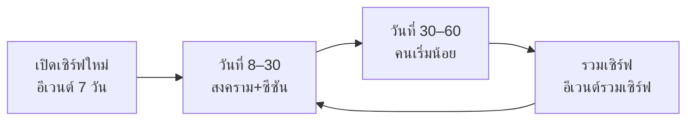

ทุกครั้งที่รวมเซิร์ฟคือโอกาสขายรอบใหม่ เพราะผู้เล่นเจอคู่แข่งหน้าใหม่

**กติการวมเซิร์ฟ:** ล้างที่นั่งขุนพลทั้งหมด (ข้อ 4.3.2) แล้วจัดใหม่ในอาทิตย์ถัดไป ชื่อฐานันดรที่ซ้ำให้คนที่ได้ก่อนเก็บไว้ อีกคนได้บัตรเปลี่ยนชื่อฟรี และรีเซ็ตเจ้าของเมืองกับคลังเสบียงศึก (ข้อ 7)

**อีเวนต์เปิดเซิร์ฟ 7 วัน:** แต่ละวันมีธีมแข่งอันดับ (วัน 1 เลเวล, วัน 2 ตีบวก, วัน 3 ขุนพล, วัน 4 ม้า จัดอันดับด้วยคะแนนคอกม้า คือดาวรวมกับสมุดม้า รางวัลเป็นสกิน, วัน 5 อัญมณี, วัน 6 BP, วัน 7 เติมเงิน) รางวัลอันดับ 1 ของแต่ละวันต้องแรงพอให้คนแข่ง

**ปฏิทินประจำ**

- รายสัปดาห์: อีเวนต์สุ่มขุนพลเรทอัป, ร้านลดราคา, สงครามเสาร์
- รายเดือน: ขุนพล UR ตัวใหม่ 1 ตัว, ชุดแฟชั่นใหม่, Battle Pass ซีซันใหม่
- เทศกาล: สงกรานต์ ลอยกระทง ตรุษจีน รอมฎอน (สำหรับมาเลเซีย/อินโดฯ) — ชุดและอีเวนต์เฉพาะประเทศ

**เครื่องมือหลังบ้าน (GM Panel) ต้องมีตั้งแต่วันแรก:** ตั้งอีเวนต์และแพ็กเกจโดยไม่ต้องอัปโค้ด, ส่งเมลแจกของ, แบน/ปิดเสียงแชท, ดูยอดเติมและ KPI รายเซิร์ฟ, สั่งเปิด/รวมเซิร์ฟ

## 10. Tech stack และสถาปัตยกรรม

ไคลเอนต์ใช้ **TypeScript + PixiJS 8 (ล็อก 8.21.x) บน WebGL2 + ชั้นเกมที่เขียนเอง + UI แบบ DOM (Preact)** ส่วนเซิร์ฟเวอร์ใช้ **Node.js + Colyseus 0.18** ตามเดิม ผู้ใช้ยืนยัน PixiJS 8 แล้ว (28 ก.ย. 2026) ตัด Cocos Creator ออก และเก็บ Phaser 4 ไว้เป็นแผนสำรองเท่านั้น

**เหตุผล**

- ท่อพิกเซลในข้อ 2 ต้องคุมการเรนเดอร์ระดับล่าง ได้แก่ render target native ขอบ 1 px, การเลื่อน subpixel, sharp-bilinear, พาเลต R8+LUT และภาพสองความละเอียดในจอเดียว
- Pixi ทำทั้งหมดนี้ได้ด้วย API ที่มีเอกสาร และ PoC ผ่านแล้ว
- Pixi v8 ใช้งานจริงมาตั้งแต่ มี.ค. 2024 และออกรุ่นย่อยเกือบทุกเดือน ส่วน Phaser 4.0 เพิ่งออก 10 เม.ย. 2026 พร้อมตัวเรนเดอร์ที่เขียนใหม่ทั้งหมด
- วัดเองด้วย esbuild 0.28 (minify + gzip -9): Pixi ชุดที่เราใช้ ≤186 KB รวมทุก chunk ส่วน Phaser 4.2.1 เต็มชุด 369 KB
- งานทั้งหมดเป็นโค้ดล้วน ไม่มีไฟล์ฉากของ editor และ Pixi มี AI skills ทางการ 25 ชุดใน `node_modules/pixi.js/skills` ตั้งแต่รุ่น 8.19
- เดิมตัด Phaser เพราะเป็น 2D เหตุผลนี้หมดไปแล้ว ส่วนจุดแข็งของ Cocos (3D, บิลด์ native, mini-game จีน) เราก็ไม่ได้ใช้แล้ว
- โค้ดจำลอง เครือข่าย และ UI ไม่ผูกกับเอนจิน ถ้าต้องย้ายไป Phaser จะแก้แค่โฟลเดอร์ `render/`

### เทียบเอนจิน (ข้อมูล ณ 27 ก.ย. 2026)

| เอนจิน | รุ่น / วันที่ / สัญญา | JS (KB gzip, วัดเอง) | ท่อพิกเซล | แผนที่ Tiled | ข้อความไทยบน canvas | ข้อเสียหลัก |
| --- | --- | --- | --- | --- | --- | --- |
| **PixiJS (เลือก ยืนยันแล้ว)** | 8.21.0 / 17 ก.ย. 2026 / MIT | ≤186 | ประกอบเองได้ครบ: RenderTexture, nearest, `roundPixels`, Batcher แบบ extension | ไม่มีตัวอ่านในตัว | เบราว์เซอร์จัดรูปอักษรให้ แต่ตัวตัดบรรทัดไม่รู้จัก U+200B | ต้องเขียนตัวอ่านแผนที่ กล้อง และเสียงเอง รวมราว 1,000–1,500 บรรทัด |
| Phaser (สำรอง) | 4.2.1 / 9 ก.ค. 2026 / MIT | 369 | `pixelArt` (nearest + roundPixels), `smoothPixelArt`, `vertexRoundMode` ต่อชิ้น | อ่านได้ในตัว + TilemapGPULayer (ใช้ tileset เดียว สูงสุด 4096² ไทล์) | Text ตัดบรรทัดด้วย `split(' ')` ต้องเขียน `wordWrapCallback` เอง | ตัวเรนเดอร์อายุ 5.5 เดือน ใหญ่กว่า Pixi ราว 2 เท่า และยังไม่ได้ทดลองท่อ RT native |
| Cocos Creator (ตัดออก) | 3.8.8 / 16 ธ.ค. 2025 และ COCOS 4 เป็น MIT ตั้งแต่ 4 ม.ค. 2026 | ไม่ได้วัด | ทำได้ | อ่าน TMX ในตัว | Label ตัดคำไทยผิด (ข้อ 2.2 เดิม) | ต้องพึ่ง editor และ UUID, SUD ซื้อกิจการ พ.ย. 2025 และกำลังแยก editor ไป IDE ใหม่ชื่อ PinK, issue #197 รายงานไฟล์ engine 33 MB ในเกม 2D |
| Excalibur | 0.32.0 | 126 | `pixelArt` เปิด shader sub-pixel + blended filtering + MSAA ขัดกฎกริด native | มีปลั๊กอินทางการ | canvas text | ยังไม่ถึงรุ่น 1.0 |
| Godot 4 (เว็บ) | 4.3 ขึ้นไป | wasm 5,000 (brotli) | — | — | — | ใช้งบโหลดแรก 8 MB ไปเกินครึ่ง |
| Kaplay | — | — | — | — | — | สไปรต์ 10,000 ตัวได้ 3 fps |

- ความเร็ววาดไม่ใช่ตัวตัดสิน: เบนช์ Shirajuki (สไปรต์ 10,000 ตัว บน Ryzen 5 4500U และ Edge 109) ได้ Pixi 47 fps และ Phaser 43 fps
- ภาระของเกมเราต่ำกว่านั้นมาก คือเมืองไม่เกิน 600 quad และศึกไม่เกิน 2,600 quad
- Pixi v8 วาดสไปรต์ที่ขยับ 100,000 ตัวโดยใช้ CPU 15 ms และ GPU 2 ms บนเดสก์ท็อป ส่วน ParticleContainer วาดได้ 1 ล้านตัวที่ 60 fps
- ตัวเลขทั้งหมดต้องยืนยันซ้ำบน Redmi 14C (Mali-G52) ในเฟส 0

### สแตก

| ส่วน | เลือกใช้ | เหตุผล / กติกา |
| --- | --- | --- |
| ภาษาและบิลด์ | TypeScript 7 + Vite 8.3 + pnpm workspace (`shared` `client` `server` `tools`) | Pixi 8.21 รองรับ TS 5, 6 และ 7 ถ้าเครื่องมือใดยังไม่รองรับ TS 7 ให้ใช้ TS 6 |
| ตัวเรนเดอร์ | PixiJS 8.21.x ตั้ง `preference:'webgl'`, `antialias:false`, `roundPixels:true`, `resolution:1` เท็กซ์เจอร์ทุกตัวใช้ nearest และปิด mipmap | Safari iOS รองรับ WebGL2 ตั้งแต่รุ่น 15 ครอบคลุม 96.4% ทั่วโลก WebGPU ค่อยเปิดหลังทดสอบเครื่องจริง |
| ท่อพิกเซล | `PixelStage` เขียนเอง | ดูหัวข้อท่อเรนเดอร์ต่อเฟรม |
| ตัวละครแยกชั้น + สีก๊ก | `PaperDoll` + `PaletteBatcher` (extension `ExtensionType.Batcher`) | เท็กซ์เจอร์ดัชนี R8 + LUT กว้าง 256 × N แถว ส่งแถวพาเลตเป็น vertex attribute |
| แผนที่ | Tiled 1.12 เก็บเป็น `.tmj` ในรีโป → `tools/map-compiler` | ได้แผนที่บีบอัดและกริดชน 16 px ที่เซิร์ฟเวอร์ใช้ร่วม ตอนรันอบพื้นเป็น chunk 256×256 px ลง RT แบบ LRU ราว 24 chunk |
| ไทล์ที่ขยับ (น้ำ ธง ไฟ) | @pixi/tilemap 5.0.2 (6.6 KB gzip) | ใช้เฉพาะชั้นที่ขยับ |
| ฝูงชนและอนุภาค | ParticleContainer | particle ทุกตัวในคอนเทนเนอร์เดียวต้องใช้ texture source เดียว ทหารจำลองจึงใช้ชีตทหาร R8 หน้าเดียวต่อคอนเทนเนอร์กับ shader พาเลต โดยส่งเลขแถว remap ผ่านค่า tint (ParticleContainer ของ 8.21 รับ `shader` เองได้ ต้องยืนยันใน PoC เฟส 0 ถ้าไม่ผ่านให้อบ atlas RGBA ก๊กละ 1 หน้า) |
| VFX | flipbook วาดลง RT native + ชั้น additive | ตามกติกา mixel ของข้อ 2 |
| แผงและเมนู (HUD ต่อสู้อยู่ในเอนจินตามข้อ 2.2) | DOM overlay: Preact 10.29 + @preact/signals 2.11 (รวม 8 KB gzip) ใช้ CSS variables ที่สร้างจาก `ui-tokens.json` และ Fit Height ด้วย `--u = min(H/720, W/1280)` | คมที่ความละเอียดจอ เบราว์เซอร์ตัดคำไทยให้ safe-area ใช้ `env()` ได้ตรง และ Playwright หา element ได้ |
| ของที่ผูกกับโลก | ชั้น HD ใน Pixi: ป้ายชื่อ (Text + pool), แถบเลือดบนหัว, ตัวเลขดาเมจ (BitmapText เลขล้วน) ส่วนคำไทยในการต่อสู้เป็นภาพอบ | ถ้าทำเป็น DOM 80 ชิ้นที่ขยับทุกเฟรมจะหนักเกินไปบนเครื่องล่าง |
| อนิเมชันหน้าสุ่มขุนพล | spine-pixi-v8 4.3.x (60 KB gzip) **ตัด Live2D** | Spine Runtimes ต้องมีใบอนุญาต Spine Editor ส่วน pixi-live2d-display ค้างที่ 0.4.0 (ก.ย. 2022) และรองรับแค่ Pixi 6 |
| เสียง | `AudioBus` บน WebAudio เขียนเองราว 200 บรรทัด | Howler ออกรุ่นล่าสุด ก.ย. 2023 และ @pixi/sound ก.ค. 2024 ส่วนเสียงถูกตัดบน iOS ก็ต้องแก้เองอยู่ดี (Phaser #5390) |
| เครือข่ายไคลเอนต์ | @colyseus/sdk 0.18 (54 KB gzip) | ต่อใหม่อัตโนมัติได้ตั้งแต่ 0.17 ส่วนศึกใช้ช่องไบนารีของข้อ 7.5 |
| Game server | Node.js LTS + Colyseus 0.18.8 | รุ่น 0.18 มี `Predict` (ทำนายฝั่งไคลเอนต์) และ `allowRewindState` + `maxRewindMs` (ย้อนตำแหน่ง) ในตัว encoder ของ schema เร็วขึ้นราว 2.4 เท่า |
| API / ร้านค้า / ล็อกอิน | Node.js (Fastify 5) | แยกจากเซิร์ฟเกม |
| ฐานข้อมูล | PostgreSQL | ตัวละคร ไอเทม ธุรกรรมเงิน |
| แคช / คิว / อันดับ | Redis | อันดับ เซสชัน pub/sub ข้ามเซิร์ฟ |
| โฮสต์ | สิงคโปร์ (AWS / DigitalOcean / Vultr) | ปิงทั่ว SEA 20–60 ms |
| CDN | Cloudflare | JS, atlas, แผนที่, ฟอนต์ |
| ข้อมูลเกม | Google Sheets → JSON ตรวจด้วย schema zod ตอนบิลด์ | จูนค่าไอเทม สกิล ดรอปได้โดยไม่แก้โค้ด |
| ทดสอบ | Vitest 5 + Playwright 1.63 + เครื่องจริง | ดูหัวข้อการทดสอบ |

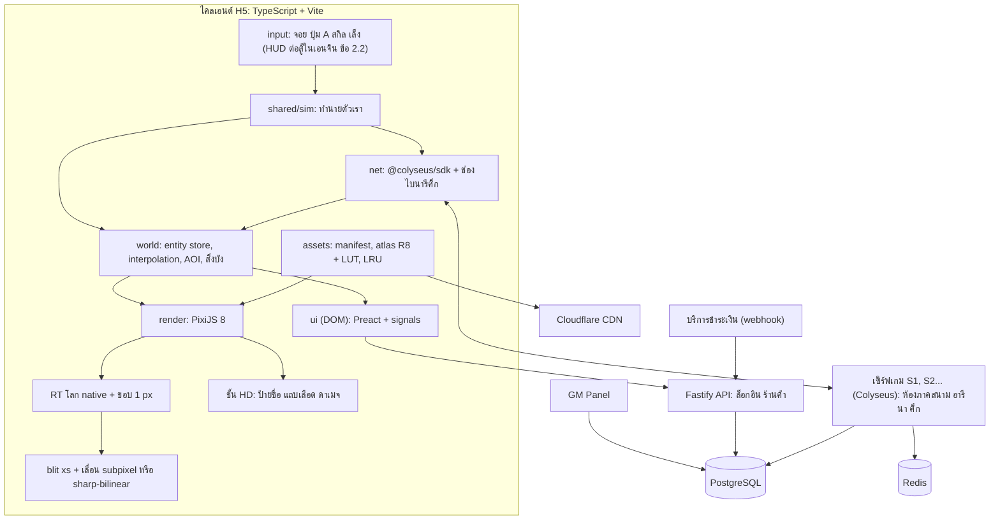

- เซิร์ฟเกมแต่ละตัวเป็นโปรเซสแยก ใช้ DB ร่วมกันโดยแยกด้วย server\_id การเปิดหรือรวมเซิร์ฟจึงเป็นแค่การย้ายข้อมูล
- ศึกแต่ละเมืองเป็นห้องแยก ถ้ามีหลายเมืองรบพร้อมกันให้แยกโปรเซสละ 1–2 ห้อง

### ท่อเรนเดอร์ต่อเฟรม

1. เดินโค้ดจำลองแบบ fixed step (ภาคสนาม 20 Hz อารีนา 30 Hz ศึก 10 Hz ตามข้อ 4.1) แล้วคิดค่า alpha สำหรับ interpolation
2. อัปเดตกล้องตามข้อ 2 แล้วบวกจอสั่นเป็นจำนวนเต็ม px native ได้ `camI = floor(cam)` และ `frac = cam − camI` ภาพโลกและป้ายที่ยึดกับโลกจึงสั่นไปพร้อมกัน
3. ปัดตำแหน่งเอนทิตีทุกตัวเป็น px native จำนวนเต็ม
4. y-sort ที่เท้าด้วย insertion sort เพราะลำดับแทบไม่เปลี่ยนระหว่างเฟรม
5. ทำชั้น overhead ที่ผู้เล่นอยู่ใต้ให้จางแบบ dither เหลือ 30%
6. วาดโลกลง RT ขนาด (วิวกว้าง + 2) × (วิวสูง + 2) โดยเลื่อนโลกไป `−camI + 1`
7. วาด RT ขึ้นจอที่ `off + round(−(1 + frac) × s)` โดย `off` คือเศษจอที่จัดไว้กลาง
8. วาดชั้น HD ที่ `off + round((pos − cam) × s)` ในหน่วย px จอ
9. DOM อัปเดตผ่าน signals และรวบงานไว้ใน rAF เดียว

- ขนาด canvas W×H อ่านจาก `devicePixelContentBoxSize` ถ้าไม่มีให้ใช้ `round(clientSize × devicePixelRatio)` เพราะ Safari ถึงรุ่น 27.2 ไม่รองรับ
- `platform/viewport.ts` คำนวณ s และขนาดวิวตามกติกา integer ในข้อ 2 และต้องผ่าน unit test ครบทั้ง 7 จอในตารางตัวอย่าง
- PoC บน Pixi 8.21 รันส่วนเหล่านี้ได้แล้ว: RT ขอบ 1 px, blit แบบเลื่อน subpixel, อบพื้นด้วย `cacheAsTexture`, y-sort 600 ตัว, ตัดวิวที่ 864 px และป้ายไทยในชั้น HD
- ต้องตรวจในเฟส 0 ว่าตัวเราสั่นไม่เกิน 1 px native หรือไม่ ขณะที่กล้องสปริงไล่ตาม

### โหมดการเรนเดอร์

| โหมด | Render target (px native) | ขยายขึ้นจอ | ใช้เมื่อ | หมายเหตุ |
| --- | --- | --- | --- | --- |
| 1. ปกติ | วิวตามกติกา (≤864×432) + ขอบ 1 px | ×s แบบ nearest + เลื่อน subpixel | ทุกโหมด | ส่วนที่เกินกรอบเป็นพื้น CSS ลายรักดำ-ทอง |
| 2. มุมแม่ทัพ | วิว × 1.5 (เช่น 1230×540) | s ÷ 1.5 ด้วย shader sharp-bilinear (720p ได้ ×1.333, 1080p ได้ ×2) | สงคราม โหมดชม | ป้ายชื่อเหลือแค่ปาร์ตี้ เป้าที่ล็อก และแม่ทัพ จอสั่นสูงสุด 2 px |
| 3. ใกล้ | วิวที่สเกล s+1 | ×(s+1) แบบ nearest | บอสเปิดตัว ดวล | ใช้ได้เมื่อ `floor(H/(s+1)) ≥ 270` |
| 4. push-in สกิลขั้นสุด | RT เดิม | ซูมเศษส่วนไม่เกิน 0.6 วิ ด้วย sharp-bilinear | สกิลขั้นสุด | ปิดเมื่อเลือกลดการเคลื่อนไหว |
| 5. ห้องแต่งตัว | 96×96 ต่อตัว | ×4–6 แบบ nearest บนพื้น HD | ลองสวม | ใช้แทนโหมดโชว์ 3D |
| 6. เมนูเต็มจอ | หยุดวาดโลก ค้างภาพเฟรมสุดท้าย | — | กระเป๋า ร้านค้า | ประหยัดแบต |
| 7. ลดเอฟเฟกต์ (ประหยัดพลังงาน) | เหมือนโหมด 1 | — | แบตต่ำ เครื่องร้อน หรือผู้เล่นเลือกเอง | `ticker.maxFPS = 30` อนุภาค ×0.5 ทหารจำลองเหลือ 150 ตัว ไม่มีการลดความละเอียด |
| 8. กู้ context | — | — | เกิด `webglcontextlost` | หยุด ticker แจ้งผู้เล่นผ่าน DOM แล้วอัปโหลดเท็กซ์เจอร์ใหม่จาก Cache Storage |

- ระดับกราฟิก ต่ำ/กลาง/สูง แบบเดิม (WebGPU, เงา, bloom) ตัดออกทั้งหมด
- ถ้า p95 ของเวลาเฟรมเกินงบของโหมดนั้น (ข้อ 2) ติดกัน 5 วิ ให้ลดตามลำดับของข้อ 2 (สไปรต์แสง → อนุภาค P3 → ชั้นฝูงชน) แล้วเข้าโหมด 7 เอง และถ้ายังเกินให้ปิดทหารจำลอง (0 ตัว)

### atlas พาเลต และหน่วยความจำ

- atlas โลกเก็บเป็นไฟล์ดัชนีดิบ 8 บิต (`.idx`) บีบ gzip คู่กับ JSON ที่มี pivot, ลำดับชั้นต่อเฟรมแบบ COF และเฟรมโดน
- ตอนโหลด: fetch → `DecompressionStream('gzip')` → `Uint8Array` → `BufferImageSource` แบบ `r8unorm` วิธีนี้ไม่ผ่านการถอดรหัส PNG และไม่ต้องอ่านค่ากลับจาก canvas
- `DecompressionStream` มีบน Safari iOS 16.4 ขึ้นไป ทางสำรองคือ PNG เทาผ่าน `createImageBitmap` ที่ตั้ง `colorSpaceConversion:'none'` และ `premultiplyAlpha:'none'` เพื่อกันค่าดัชนีเพี้ยน
- แถว remap เป็นเท็กซ์เจอร์ R8 กว้าง 256 px แถวละ 1 ตัวละครหรือชุดสี (≤256 แถว ข้อ 6.1) ชี้เข้าผังพาเลตโลก ส่วนสีจริงอยู่ในแถวพาเลตเวลา RGBA 256 × ≤8 ต่อแผนที่ (ข้อ 2)
- หน้า atlas ไม่เกิน 2048² (R8 ใช้ 4 MB ต่อหน้า)
- batch หนึ่งใช้เท็กซ์เจอร์ได้ราว 16 หน่วยแล้วแต่ฮาร์ดแวร์ และแถว remap กับแถวพาเลตกินไป 2 หน่วย จึงพยายามแพ็กชั้นของตัวเดียวกันไว้ในหน้าเดียวกัน
- แยก atlas ตามกลุ่มท่า ได้แก่ เดิน / ตีตามตระกูลอาวุธ / สกิล / บนม้า / ร่างสงคราม และโหลดเฉพาะกลุ่มที่ใช้
- atlas ของ UI เป็น WebP/PNG ที่ DOM ใช้ตรง จึงไม่ต้องใช้ ASTC หรือ ETC2 อีก

### ข้อความไทย

กติกานี้ตรงกับกติกาข้อความไทยในข้อ 2.2 เช่น ขนาดขั้นต่ำ 24 px, ปฏิทิน, ตัวเลข และการโหลดฟอนต์ผ่าน FontFace ให้เสร็จก่อนสร้าง Text ตัวแรก

| ที่แสดง | วิธี | เหตุผล |
| --- | --- | --- |
| DOM (เมนู แชท เควส tooltip) | ใส่ `lang="th"` แล้วให้เบราว์เซอร์ตัดบรรทัดเอง | เบราว์เซอร์หลักตัดคำไทยตามพจนานุกรม (Firefox ใช้ ICU4X) จึงไม่ต้องใส่ U+200B และไม่ต้องมีคอมโพเนนต์ ThaiLabel |
| canvas (ป้ายชื่อ ป้าย NPC) | Pixi Text + `ThaiWrap` (Intl.Segmenter แบบ word + measureText แล้วใส่ `\n` เอง) | เบราว์เซอร์จัดรูปอักษรให้ สระและวรรณยุกต์จึงวางถูก (ยืนยันใน PoC) แต่ตัวตัดบรรทัดของ Pixi ไม่ถือ U+200B เป็นจุดตัด และ `breakWords` ตัดกลางคำ |
| ข้อความคงที่ | ตัดคำตอนบิลด์ด้วย Node ที่มี ICU เต็ม | ไม่เสียเวลาตอนรัน |
| ตัวเลขดาเมจและ HUD | BitmapText เลขล้วน | ฟอนต์บิตแมปวางวรรณยุกต์ซ้อนสระบนไม่ถูก |
| คำไทยในการต่อสู้ (หลบ ล้ม เกราะแตก ฯลฯ) | ภาพคำที่อบไว้ใน atlas HUD | ตามข้อ 2.2 |

- อีกทางหนึ่งคือ override `CanvasTextMetrics.wordWrapSplit` ด้วย Intl.Segmenter ซึ่งเอกสารเปิดให้แก้ได้ ให้ลองถ้า ThaiWrap ช้า

### เครือข่ายและเซิร์ฟเวอร์

| ห้อง | จำลอง (Hz) | ส่งสถานะ (Hz) | AOI (ตัว) | งบ (KB/วิ ต่อคน) | ย้อนตำแหน่งเป้า |
| --- | --- | --- | --- | --- | --- |
| ภาคสนาม | 20 | 20 | — | — | ไม่เกิน 150 ms |
| อารีนา | 30 | 30 | — | — | ไม่เกิน 100 ms |
| ศึก | 10 | 5 | ไม่เกิน 80 | ไม่เกิน 15 (ปกติ 6–8) | ไม่ย้อน ใช้เป้าที่ล็อกกับระยะยอมคลาด |

- ห้องภาคสนามและอารีนาใช้ state sync ของ Colyseus ส่วนห้องศึกใช้ Colyseus จัดห้องกับล็อบบี้ แล้วส่งสถานะผ่านช่องไบนารีที่เขียนเอง เพราะ StateView ยังไม่เหมาะกับข้อมูลจำนวนมาก (ข้อ 7.5)
- ในเฟส 0 ให้ลอง `Predict` และ `allowRewindState` ของ 0.18 กับห้องภาคสนามก่อน ถ้าไม่พอให้ใช้โค้ดทำนายใน `shared/sim` ตามข้อ 4.1
- หลุดการเชื่อมต่อ: เซิร์ฟเวอร์เรียก `allowReconnection` ใน `onDrop` ค่าทดสอบคือภาคสนาม 30 วิ ศึก 60 วิ
- ไคลเอนต์ทิ้งคำสั่งต่อสู้ที่ค้างในคิวนานเกิน 500 ms เพราะ SDK เข้าคิวคำสั่งระหว่างหลุดให้อัตโนมัติ
- ข้อมูลรูปลักษณ์: เซิร์ฟเวอร์ส่งแค่รหัสชิ้น + ระดับตีบวก + รหัสม้า + แถวพาเลต รวมไม่กี่สิบไบต์ต่อคน
- ไคลเอนต์โหลดกลุ่ม atlas ของชิ้นนั้นจาก CDN แล้วประกอบ paper-doll เอง ระหว่างที่ชิ้นยังโหลดไม่เสร็จให้แสดงชุดพื้นฐาน
- ในเมือง ผู้เล่นคนอื่นโหลดแค่ชุดท่าเดิน ในศึกใช้ร่างสงครามที่อบรวมตามข้อ 2

### งบไคลเอนต์

ทุกค่าในตารางเป็นค่าทดสอบ ต้องยืนยันในเฟส 0

| รายการ | งบ |
| --- | --- |
| JS โหลดแรก (MB gzip) | ≤0.8 = Pixi 0.19 + Preact 0.01 + Colyseus 0.05 + โค้ดเกม ≤0.5 เพื่อเหลืองบให้ฟอนต์ UI แผนที่แรก และ atlas ≥7 MB จากงบ 8 MB |
| draw call ต่อเฟรม | ชั้นโลก: เมือง ≤25 ภาคสนาม ≤30 ศึก ≤30 · HUD และชั้น HD ในเอนจิน ≤12 (ข้อ 2 และ 2.2) |
| quad ต่อเฟรม | เมือง ≤400 ภาคสนาม ≤600 ศึก ≤2,600 (สไปรต์ 1,200 + ฝูงชน 600 + อนุภาค 800 ตามข้อ 2) |
| ทหารจำลอง (ตัว) | ปกติ 600 ลดเอฟเฟกต์ 150 ต่ำสุด 0 |
| หน่วยความจำภาพ (MB) | เท็กซ์เจอร์โลกในศึก ≤70 (สไปรต์ R8 ≤64 + tile และ render target ตามข้อ 2) UI + HD ≤32 (ข้อ 2.2) รวมทั้งเกม ≤300 และในศึก ≤250 |
| DOM HUD (L3) | ≤120 โหนด ≤8 composited layer อนิเมชันใช้แค่ transform/opacity ห้ามใช้ backdrop-filter ข้อความอัปเดต ≤4 Hz และสถานะจากเอนจิน ≤10 Hz (ข้อ 2.2) จอย ปุ่มสกิล และวงคูลดาวน์อยู่ในเอนจิน |
| เวลาเฟรม p95 (ms) บน Redmi 14C | ภาคสนาม ≤16.7 (60 fps) ศึก ≤33 (30 fps) |
| ไฟล์แผนที่ศึก (MB) | ≤60 โหลดล่วงหน้าตอนเปิดล็อบบี้ (ข้อ 7.5) |

### โครงรีโป

```
game3k/
  packages/
    shared/src/   protocol/ (รหัสข้อความ codec ไบนารี) · sim/ (เดิน ชน grid16 จังหวะสกิล) · data/ (schema zod) · const.ts (TILE=16)
    client/src/
      boot/       main.ts · featureDetect.ts · fonts.ts · startGate.ts (แตะเริ่ม: fullscreen ล็อกจอ ปลดเสียง)
      platform/   viewport.ts · safeArea.ts · orientation.ts · inApp.ts · visibility.ts · contextLoss.ts
      render/     PixelStage.ts · sharpBilinear.ts · camera.ts · layers.ts
                  tilemap/ (tmjLoader chunkBaker animatedTiles)
                  sprites/ (PaperDoll cofOrder PaletteBatcher r8Texture dir8)
                  vfx/ (flipbook additive hitstop) · crowd/CrowdLayer.ts
                  hd/ (NameplatePool DamageNumberPool ThaiWrap Showcase) · hud/ (Joystick AButton SkillButton UltimateButton CommandWheel ComboCounter TargetFrame Minimap SiegeBar)
      world/      EntityStore.ts · interpolate.ts · aoi.ts · occlusion.ts
      net/        client.ts · predict.ts · warChannel.ts
      input/      aim.ts · inputBus.ts · keyboard.ts
      ui/         tokens.css · kit/ · hud/ · screens/ · i18n/
      audio/      AudioBus.ts
      assets/     manifest.ts · loader.ts · lru.ts · bundles.ts
      debug/      perfHud.ts · testHooks.ts (window.__g เฉพาะบิลด์ dev/test)
    client/tests/ unit/ · e2e/ · baselines/
    server/src/   rooms/ (field arena war) · api/ · db/
    tools/        map-compiler · packer · palette · blender/ · aseprite/ · thai-prewrap · tokens-codegen และสคริปต์อาร์ตของข้อ 2.1 (pl_client palettize compose_sprite check_sprite check_tiles pack_atlas sheet)
  assets-src/     ui/ (ต้นฉบับอาร์ตอยู่ที่ art/ ตามโครงข้อ 2.1 แผนที่เก็บเป็น .tmx แล้วส่งออก .tmj)
```

### การทดสอบที่ Claude Code ทำเอง

| ชั้น | เครื่องมือ | ทดสอบอะไร |
| --- | --- | --- |
| หน่วย | Vitest | `shared/sim` ต้องได้ผลเดิมทุกครั้ง, codec เข้ารหัสแล้วถอดกลับครบ, ตารางสเกล 7 จอ (เช่น 1640×720 ได้ ×2 และวิว 820×360), ThaiWrap เทียบ snapshot |
| UI และลำดับหน้าจอ | Playwright ที่ `?render=off` | ใช้ locator กับ DOM ไม่ต้องใช้ WebGL |
| ภาพ | Playwright `toHaveScreenshot` ที่ `?seed=1&freeze=1` | แยกภาพฐานตามเบราว์เซอร์และ OS |
| WebGL บนเครื่องไม่มี GPU | Chrome + `--use-gl=angle --use-angle=swiftshader-webgl --enable-unsafe-swiftshader` | Chromium เลิก fallback อัตโนมัติไปแล้ว (เตือนตั้งแต่ Chrome 130) ยืนยันแล้วว่าใช้ได้บน Chrome 153 |
| context loss | extension `WEBGL_lose_context` | โหมด 8 กู้เท็กซ์เจอร์ได้ครบ |
| ประสิทธิภาพ | Remote debugging บน Redmi 14C และ Safari Web Inspector บน iPhone | เก็บ trace 10 นาทีในฉากทดสอบเมือง + ทหาร 40 ตัว |

- โหมด headless ใช้ virtual time ทำให้ `performance.now` ไม่เดิน จึงวัดความเร็วได้บนเครื่องจริงเท่านั้น

### ความแปลกของเบราว์เซอร์มือถือ

| เรื่อง | ปัญหา | ทางแก้ |
| --- | --- | --- |
| ขนาด canvas | Safari iOS ถึงรุ่น 27.2 ไม่มี `devicePixelContentBoxSize` | ใช้ `round(clientSize × devicePixelRatio)` (DPR ของ iOS เป็น 2 หรือ 3 จึงได้ค่าตรง) |
| ล็อกจอแนวนอน | Safari iOS ถึงรุ่น 27.2 ไม่มี `screen.orientation.lock` | Android ขอ fullscreen แล้วล็อกตอนแตะเริ่ม ส่วน iOS ถ้าถือแนวตั้งให้หยุดเกมแล้วขึ้นหน้าบอกให้หมุนจอ |
| Fullscreen | iOS รองรับบางส่วน และ in-app browser อาจไม่ยอม | เล่นได้ในความสูงที่เหลือ (กติกา H/300 รองรับแล้ว) |
| LINE | เปิดลิงก์ในเบราว์เซอร์ของแอป | ลิงก์ที่แชร์ใส่ `?openExternalBrowser=1` (ใช้ไม่ได้กับ LIFF) |
| เสียง iOS | AudioContext เป็น `interrupted` หลังมีสายเข้าหรือสลับแอป | ปลดล็อกที่แตะแรก และ unlock ใหม่ทุกครั้งที่กลับมา focus |
| สัมผัส | แตะสองครั้งแล้วซูม และลากแล้วหน้าเด้ง | `touch-action:none` และ `overscroll-behavior:none` |
| แท็บถูกซ่อน | rAF หยุด | เมื่อเกิด `visibilitychange` ให้หยุด ticker แต่ไม่ตัดการเชื่อมต่อ |
| ความจำ | iOS ปิดแท็บเงียบๆ เมื่อความจำเกิน | อยู่ในงบ 300 MB และมี LRU ของ atlas |

### กฎเหล็กกันโกงและต้นทุน

- เซิร์ฟเวอร์ตัดสินทุกอย่าง (ดาเมจ ดรอป เงิน ตีบวก) ไคลเอนต์ส่งแค่คำสั่ง
- การเติมเงินยืนยันผ่าน webhook เท่านั้น และเก็บ log ธุรกรรมไอเทมทุกชิ้น
- จำกัดอัตราคำสั่งและตรวจท่าตามกติกาข้อ 4.1
- `testHooks.ts` และ `window.__g` ต้องไม่อยู่ในบิลด์จริง ให้ CI ตรวจทุกครั้ง
- ต้นทุนเซิร์ฟเวอร์เริ่มต้นราว 1,500–5,000 บาท/เดือน ยังไม่รวม CDN ซึ่งเพิ่มตามจำนวน atlas แล้วค่อยขยายตามรายได้

### ผลต่อข้ออื่น

| ข้อ | สิ่งที่ต้องแก้ |
| --- | --- |
| 2.2 | ตัด SafeAreaWeb, ThaiLabel และกฎ Label CHAR/BMFont ของ Cocos, เปลี่ยนการสร้าง prefab ผ่าน MCP เป็นคอมโพเนนต์ Preact ที่สร้างจากสเปก YAML แล้วตรวจด้วยภาพหน้าจอ Playwright, แผงและเมนูใช้งบ DOM ส่วน HUD ต่อสู้อยู่ในเอนจินงบ ≤12 draw call (ทำแล้วในข้อ 2.2 ฉบับนี้) |
| 7.5 | ทำแล้วในข้อ 7.5 ฉบับนี้:เปลี่ยน GPU instancing แบบ baked animation เป็น ParticleContainer กับร่างสงครามที่อบรวม |
| 12 | เฟส 0 เพิ่ม PoC PaletteBatcher และวัดบน Redmi 14C |
| 13 | คำถามเรื่องโค้ดร่วมกับเกมซามูไร H5 ตอบง่ายขึ้น เพราะเป็น TS + Pixi ล้วน |

แหล่งอ้างอิง: [PixiJS releases](https://github.com/pixijs/pixijs/releases) · [PixiJS: ParticleContainer v8](https://pixijs.com/blog/particlecontainer-v8) · [PixiJS: Performance Tips](https://pixijs.com/8.x/guides/concepts/performance-tips) · [Phaser 4 Pixel Art Guide](https://github.com/phaserjs/phaser/blob/master/docs/Phaser%204%20Pixel%20Art%20Guide/Phaser%204%20Pixel%20Art%20Guide.md) · [Colyseus 0.18](https://colyseus.io/blog/colyseus-018-is-here/) · [Colyseus: Reconnection](https://docs.colyseus.io/room/reconnection) · [cocos4 issue #197](https://github.com/cocos/cocos4/issues/197) · [David Holland: 3D Pixel Art Rendering](https://www.davidhol.land/articles/3d-pixel-art-rendering/) · [caniuse: devicePixelContentBoxSize](https://caniuse.com/mdn-api_resizeobserverentry_devicepixelcontentboxsize) · [Chromium: SwiftShader](https://github.com/chromium/chromium/blob/main/docs/gpu/swiftshader.md)

## 11. ตลาดไทย/SEA และการชำระเงิน

ข้อได้เปรียบใหญ่ของ H5 คือ **รับเงินผ่านเว็บโดยตรง ไม่ต้องเสียค่าธรรมเนียมสโตร์ 15–30%** เหลือแค่ค่าธรรมเนียม payment gateway ราว 2–4%

**ลำดับการเปิดตลาด:** ไทยก่อน (ทดสอบและจูนระบบเงิน) → เวียดนาม/ฟิลิปปินส์ → อินโดนีเซีย/มาเลเซีย แยกเซิร์ฟตามภาษา เพื่อให้แชทและพันธมิตรคุยกันรู้เรื่อง

| ประเทศ | ภาษา | ช่องทางจ่ายยอดนิยม |
| --- | --- | --- |
| ไทย | ไทย | PromptPay QR, TrueMoney, บัตร, Rabbit LINE Pay |
| เวียดนาม | เวียดนาม | MoMo, ZaloPay, บัตรเติมเงินมือถือ |
| ฟิลิปปินส์ | อังกฤษ | GCash, Maya |
| อินโดนีเซีย | อินโดนีเซีย | DANA, OVO, GoPay, ShopeePay |
| มาเลเซีย | อังกฤษ/มาเลย์ | Touch 'n Go, FPX |

**Gateway ที่รวมหลายประเทศในที่เดียว:** Xendit, 2C2P, Omise (ต้องตรวจเงื่อนไขว่ารับธุรกิจเกม/สินค้าดิจิทัลหรือไม่ก่อนสมัคร)

**การดึงผู้เล่น (ใช้จุดแข็งเรื่องคอนเทนต์ที่คุณทำอยู่)**

- คลิปสั้น TikTok/Reels: ฉากสงครามตีเมืองคนหลายร้อย, สุ่มได้ UR, ดาเมจเด้งล้าน — ใช้ Znap ช่วยผลิตคลิปจำนวนมากได้
- โฆษณา Facebook/TikTok Ads ลิงก์ตรงเข้าเกม (ไม่ต้องผ่านสโตร์ = วัดผลแม่นกว่า)
- ระบบชวนเพื่อน: ลิงก์เชิญ ได้รางวัลเมื่อเพื่อนถึงเลเวล 30/50/70
- จ้างสตรีมเมอร์สายเกมออโต้/สามก๊กเปิดเซิร์ฟร่วมกัน (เซิร์ฟ "ของสตรีมเมอร์")
- ชุมชน: กลุ่ม Facebook + LINE OpenChat + Discord ต่อประเทศ

## 12. โร้ดแมปพัฒนา (คนเดียว + AI)

MMO เป็นงานใหญ่ที่สุดในวงการเกม ทำคนเดียวได้ถ้า **ตัดขอบเขตให้แคบและเปิดให้เล่นเร็ว** แล้วค่อยเติมระบบตามรายได้ ประมาณรวม 9–12 เดือนถึงเปิดตัวไทย

| เฟส | ระยะเวลา | สิ่งที่ต้องเสร็จ | เกณฑ์ผ่าน |
| --- | --- | --- | --- |
| 0. ต้นแบบ | 1 เดือน | ท่อเรนเดอร์พิกเซลบน PixiJS 8 (render target native + integer scale + เลื่อน subpixel), ฉากทดสอบลานประตูเมืองลกเอี๋ยง, สคริปต์พรีเรนเดอร์ Blender ตัวละคร 3D ขุนศึกตระกูลทวน 1 ชุด 5 ทิศ + mirror, จอแนวนอน, ระบบ A/H จังหวะเรือง หลบ ทำนายผล, สลับอาวุธ 3 แบบ, ม้าชั้น 1 จำนวน 1 ตัว, กอง T1 จำนวน 1 กอง + ทหาร 40 ตัว, HUD lab (DOM + เอนจิน) ThaiWrap, เซิร์ฟซิงก์ 2 เครื่อง (ทดสอบเป็น 2 หน้าต่างบน localhost ยังไม่เช่าเซิร์ฟเวอร์), ทดสอบบนคอมเครื่องนี้ก่อนด้วย Chrome จำลอง 820×360 DPR 2 (= 1640×720) + CPU throttle ระดับมือถือ, งบ 100 USD ตามหัวข้องบเฟส 0 | ผ่านฉากทดสอบประตูเมืองลกเอี๋ยงในข้อ 2 บนคอมเครื่องนี้ก่อน (p95 ≤16.7 ms ที่ CPU throttle มือถือระดับกลาง และ ≤33.3 ms ที่ระดับล่าง) แล้วยืนยันบนมือถือ Android จริง 1 เครื่อง (Redmi 14C หรือชิปเดียวกัน ซื้อหรือยืม) ก่อนปิดเฟส ใช้เงินไม่เกิน 100 USD ไม่รวมมือถือ และห้ามผลิตอาร์ตจำนวนมากก่อนผ่าน |
| 1. MVP | 3 เดือน | 2 อาชีพ ขุนศึก + กุนซือ (แทง ทุบ เวท), เลเวล 1–60, 3 แผนที่, ยศ 1–6, ค่ายกล 5 แบบ, ม้าชั้น 1–2 และชั้น 4 สี่ตัว, ออโต้/ออฟไลน์ตามนโยบาย, ลานฝึกคอมโบ, อุปกรณ์+ตีบวก (เปลี่ยนภาพบนตัวละครทุกชิ้น), เควส, บอสภาคสนาม, ล็อกอิน, ร้านค้า + PromptPay (โหมดทดสอบของ gateway ยังไม่รับเงินจริง), ตำลึง + บัญชีคู่ (ledger), ร้าน NPC และรับซื้อคืน | เพื่อน 30–50 คนเล่นต่อเนื่อง 1 สัปดาห์ |
| 2. สังคมและเงิน | 2 เดือน | + นักธนู (ยิงไกล), บรรดาศักดิ์ 1–13, เบี้ยหวัด, พันธมิตร, บอสโลก/พันธมิตร, กาชาขุนพล, VIP (นับแต้มใน ledger · สิทธิ์และกล่องเปิดเฟส 4), บัตรรายเดือน, แลกของ + ระดับบัญชี 0–2, รับเงินจริงทาง PromptPay และโอนธนาคาร, GM Panel, แชท | ปิดเบต้า 300–500 คน มีคนจ่ายจริง |
| 3. สงคราม | 2 เดือน | + จอมดาบ (ฟัน), แผนที่แผ่นดิน, ทุ่งกัวต๋อและโซนเชื่อม 3 ภูมิภาคตามแท็บ 「แผนที่โลกยุคฮั่น」 (Lv 60–80 เปิดไทยถึง Lv 80), สงครามตีเมืองบนแผนที่ด่านตันฉอง, เครื่องตีเมือง 4 ชนิด, การ์ดกลศึก 6 ใบ, ยศ 7–11, ที่นั่ง 24 ที่, อาญาสิทธิ์, อารีนา PvP, ตลาดกลาง + ภาษีเมือง, กระดานแลกทองในเบต้าปิด, อีเวนต์เปิดเซิร์ฟ 7 วัน | ห้องเดียว 100 ต่อ 100 (บอท) ≥30 fps บนเครื่อง 3,000–5,000 บาท, ≤15 KB/วิ, ≤250 MB |
| 4. เปิดไทย | 1 เดือน | ทดสอบโหลด, ขัดเกลา UI, ยิงแอด, แผงร้าน, รับบัตรพร้อม 3DS, กระดานแลกทอง (เปิดวันที่ 4 ของเซิร์ฟ), เปิดเซิร์ฟ S1 ที่ Lv 1–80 | D1 ≥ 35% |
| 5. SEA | ต่อเนื่อง | แปลภาษา, gateway ต่างประเทศ, ข้ามเซิร์ฟ, ศึกชิงบัลลังก์และฉายาฮ่องเต้, ภาษีเมืองหลวง 0–5%, แผนที่ผาแดง (เซ็กเพ็ก), ทหารเอกชุดที่เหลือ | LTV > ค่าหาผู้เล่น |

**วิธีใช้ AI ให้คุ้มที่สุด**

- Claude Code เขียนระบบฝั่งเซิร์ฟเวอร์และเครื่องมือหลังบ้าน (งานโค้ดเยอะสุด)
- Claude Code เขียนสคริปต์อาร์ตทั้งหมด (พรีเรนเดอร์ Blender, Aseprite CLI, palettize, ตัวตรวจพิกเซล) AI พิกเซลสร้างฉาก ส่วนคนตรวจด้วยตาวันละราว 1 ชม. (ข้อ 2.1)
- เก็บ "เอกสารกฎเกม" ไว้ใน repo ให้ AI อ่านก่อนเขียนทุกครั้ง บาลานซ์จะไม่เพี้ยน
- ให้ AI สร้างตาราง EXP/ดรอป/ราคาเป็นสูตร แล้วจำลองด้วยสคริปต์ว่าคนฟรีใช้กี่วันถึงเลเวล 100 ก่อนเปิดจริง
- สิ่งที่ควรจ้างคนช่วยแม้ทำคนเดียว: ทดสอบความปลอดภัยระบบเงิน และคนแปลภาษาเจ้าของภาษาช่วงเปิด SEA

**สิ่งที่ตัดทิ้งได้ในเวอร์ชันแรก:** แต่งงาน/คู่รัก, สัตว์เลี้ยง, บ้าน, ข้ามเซิร์ฟ, แผงร้านและช่วงประกาศขาย (ตลาดกลางทำหน้าที่แทน) (อาชีพที่ 3–4 ย้ายเข้าเฟส 2–3 แล้ว) ถ้าเวลาไม่พอ ทางถอยแรกคือเลื่อนจอมดาบกลับไปหลังเปิดไทย

## 13. ความเสี่ยงและ KPI

ความเสี่ยงอันดับ 1 คือ **ขอบเขตใหญ่เกินไปจนไม่ได้เปิดเกม** รองลงมาคือระบบเงินรั่ว/โดนโกง และคนฟรีเลิกเล่นเพราะช่องว่างพลังกว้างเกิน

| ความเสี่ยง | ผลกระทบ | ทางป้องกัน |
| --- | --- | --- |
| ขอบเขตบาน | ไม่ได้เปิดเกม | ยึดโร้ดแมปเฟส, ตัดฟีเจอร์ตามรายการข้อ 12 |
| ช่องโหว่เงิน/ไอเทม | เศรษฐกิจพัง | เซิร์ฟเวอร์ตัดสินทุกอย่าง, log ธุรกรรม, จำกัดอัตราคำสั่ง |
| บอท/ออโต้เถื่อน | ป่วนตลาด | ออโต้ในตัวเกมอยู่แล้ว ลดแรงจูงใจทำบอท, ตรวจพฤติกรรมผิดปกติ |
| ลิขสิทธิ์ | โดนฟ้อง/ถอดโฆษณา | ตัวละครสามก๊กเป็นสาธารณสมบัติ แต่ห้ามลอกภาพ/ดีไซน์จากเกมอื่น เช่น Dynasty Warriors |
| ลิขสิทธิ์เครื่องมือ AI และฟอนต์ | ต้องถอดของ | บันทึกทุกชิ้นใน asset\_license.csv, ห้ามใช้แพ็กฟรีของ Tripo/Meshy, สัญญา Hunyuan ไม่ครอบคลุม EU/UK/เกาหลีใต้, ใช้ฟอนต์ OFL ที่ไม่มีชื่อสงวน |
| อาวุธดรอปคล้าย Dynasty Warriors | โดนฟ้อง | อาวุธดรอปใช้รูปทรงโบราณคดียุคฮั่น, ห้ามอิงหน้าตาอาวุธของ Koei |
| กฎหมายการพนัน | ปิดระบบ/บัญชีรับเงินโดนระงับ | ห้ามแลกไอเทมเป็นเงินจริง, เปิดเผยอัตรากาชา |
| ภาษีและนิติบุคคล | ปัญหากับสรรพากร | จดบริษัท, ออกใบเสร็จ, ปรึกษานักบัญชีเรื่อง VAT ดิจิทัลแต่ละประเทศ |
| มือถือถูกเล่นไม่ลื่น | คนเลิกตั้งแต่วันแรก | ทดสอบบนเครื่องราคา 3,000–5,000 บาททุกเฟส |
| ตัวละครพรีเรนเดอร์ดูเป็น 3D หรือพิกเซลกะพริบ | ภาพไม่เข้ากับฉากแบบภาพอ้างอิง | toon 3 ขั้น พาเลตล็อก เส้นขอบ 1 px ท่าคีย์แบบ 2D สคริปต์ flicker\_check และต้องผ่านฉากทดสอบเฟส 0 ก่อนผลิตจำนวนมาก (ข้อ 2, 6.1) |
| หน่วยความจำ atlas เกินบน iOS | แท็บถูกปิดเงียบ | เก็บ R8 + แถว remap แยก atlas ตามกลุ่มท่า ผู้เล่นอื่นโหลดแค่ชุดเดินหรือร่างสงคราม สไปรต์ในศึก ≤64 MB รวม ≤250 MB (ข้อ 6.1, 7.5) |
| ขนาดดาวน์โหลดโตตามจำนวนชิ้นอุปกรณ์ | โหลดช้าบน 4G ค่า CDN สูง | ชุดเริ่ม ≤8 MB โหลดกลุ่มท่าเมื่อใช้ แคช LRU ไฟล์ .idx บีบ gzip และวัดขนาดต่อชิ้นทุกบิลด์ (ข้อ 10) |
| ระยะยิงไกลเกินวิวแนวตั้ง (เดิม 30 ม. เทียบวิวสูงราว 22.5 ม.) | ถูกยิงจากนอกจอ PvP ไม่เป็นธรรม | ระยะที่ต้องเห็นออกแบบใน safe area 480×300 (30×18.75 ม.) ระยะท่าคงที่ 18 ม. (ท่าพิเศษซุ่มยิง 20 ม.) โบนัสไม่เพิ่มระยะ นอกศึกแนวขึ้นลงไม่เกิน 16 ม. กล้องโฟกัสกลางลำตัวและเลื่อนนำตามทิศเล็ง แตะลูกศรขอบจอเพื่อล็อกแข็งผู้ยิงและเลื่อนกล้องไปหา (ข้อ 2, 4.1) |
| เวลาเรนเดอร์และเวลาคนต่อชิ้นเกินคาด | ของใหม่ออกช้า | จับเวลาเรนเดอร์ต่อเฟรมในเฟส 0 ทหารและร่างสงครามอบชั้นเดียว ระดับสีและตีบวกใช้แถวพาเลตแทนชีตใหม่ (ข้อ 2.1, 6.1) |
| งบแอนิเมชันเกินกำลัง (ราว 129 คลิปต่อเพศ) | เปิดช้า | แบ่งทำตามเฟส, ทำเพศแรกก่อนแล้ว retarget, ยืมคลิปสกิลมาทำท่าปิดหนัก |
| ปิงและการทำนายผิด | คอมโบไม่ลื่น | ช่วงรับ ≥400 ms, บัฟเฟอร์ 180 ms, เป้าทำนายผิด ≤2% |
| เซิร์ฟเวอร์ห้องศึกรับไม่ไหว | สงครามพัง | ทดสอบโหลดตั้งแต่ต้นเฟส 3, จำกัดคนต่อฝ่ายตามระดับเมือง |
| ข้อความไทยตัดคำผิดหรือวรรณยุกต์หลุด | อ่านไม่ออก | แผง DOM ใส่ lang=th ข้อความบน canvas ตัดด้วย ThaiWrap (Intl.Segmenter) และสคริปต์ตรวจข้อความล้นตอนบิลด์ (ข้อ 2.2) |

**KPI ที่ต้องวัดตั้งแต่เบต้า (ตัวเลขเป้าหมายอ้างอิงเกมแนวเดียวกัน)**

| ตัวชี้วัด | เป้าหมาย |
| --- | --- |
| Retention D1 / D7 / D30 | 35–40% / 15–20% / 5–8% |
| อัตราผู้จ่าย (ต่อผู้เล่นรายวัน) | 3–6% |
| อัตราเติมครั้งแรกภายใน 3 วัน | 5–10% ของผู้เล่นใหม่ |
| ARPPU ต่อเดือน | 500–1,500 บาท |
| LTV 30 วัน เทียบค่าหาผู้เล่น (CPI) | LTV ≥ 1.5 เท่าของ CPI |
| เวลาโหลดครั้งแรก | ต่ำกว่า 10 วินาทีบน 4G |

**คำถามที่ยังเปิดอยู่**

- [ ] ชื่อเกมจริงและโลโก้
- [ ] จะใช้โครงสร้างโค้ดร่วมกับเกมซามูไร H5 ที่วางแผนไว้หรือไม่ (เอนจินและเซิร์ฟเวอร์เดียวกันจะประหยัดเวลามาก)
- [ ] งบยิงโฆษณาช่วงเปิดตัว
