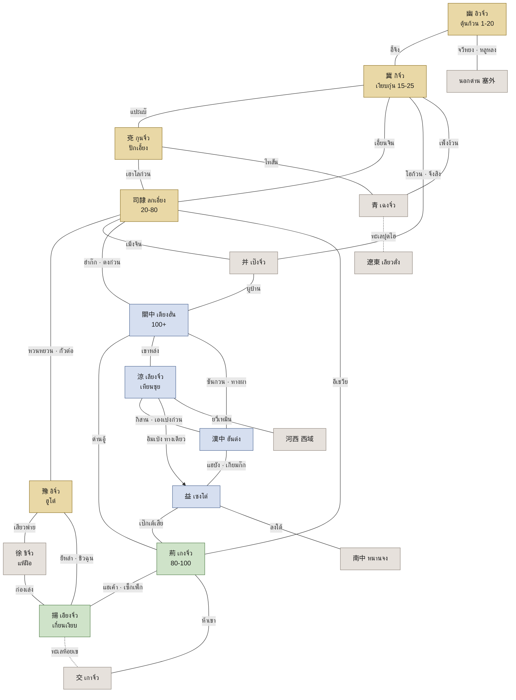

# แผนที่โลกยุคฮั่น

โลกของเกมใช้ 13 มณฑล (州) ปลายฮั่นตะวันออกราว ค.ศ. 190–220 ตาม 續漢書·郡國志 และข้ามภูมิภาคได้ทางประตูเท่านั้น ประตูแต่ละบานคือด่าน ท่าข้าม ทางผา หรือทางทะเลที่มีบันทึกจริง แพตช์ใหม่เปิดภูมิภาคด้วยข้อมูลล้วน คือแผนที่ Tiled ชุดใหม่กับธงเปิดประตู

**ป้ายในแท็บนี้**

- ชื่อไทยที่ไม่มีวงเล็บป้ายต่อท้าย พบในเนื้อความสามก๊ก ฉบับเจ้าพระยาพระคลัง (หน) บน vajirayana.org (ค้นครบ 87 ตอน)
- **(ด)** พบเฉพาะในบัญชี "ชื่อภูมิประเทศในเรื่องสามก๊ก" ของสมเด็จฯ กรมพระยาดำรงราชานุภาพ
- **(ใหม่)** ทับศัพท์ชั่วคราวจากเสียงจีนกลาง ต้องให้ผู้รู้ตรวจก่อนใช้จริง
- ป้ายที่มาใช้ชุดเดียวกับข้อ 6.2: ประวัติศาสตร์ (三國志 後漢書 續漢書) · นิยาย (三國演義 และฉบับหน) · ตำนาน (裴注) · แต่งใหม่

## 1. ขอบเขตเปิดไทยและรอบแพตช์

เปิดไทยเปิด 5 ภูมิภาคทางภาคเหนือ บางภูมิภาคเปิดแค่บางเขต ครอบเลเวล 1–80 และเนื้อเรื่อง ค.ศ. 184–200 ภูมิภาคที่เหลือเปิดแพตช์ละ 1–2 ภูมิภาค

| รอบ | ภูมิภาคที่เปิด PvE | เลเวล | เมืองศึกที่เปิดสะสม (เมือง) | ของเด่น |
| --- | --- | --- | --- | --- |
| MVP (เฟส 1) | ตุ้นก้วน · ด่านเฮาโลก๋วน · ลกเอี๋ยง | 1–60 | 0 | 3 แผนที่ตามข้อ 12 |
| เปิดไทย (เฟส 4) | + อิวจิ๋วเขต 涿郡 · กิจิ๋วตอนใต้ · กุนจิ๋วฝั่งตะวันตก · อิจิ๋ว · ทุ่งกัวต๋อ | 1–80 | 7 | ศึกกัวต๋อ และฤดูศึกแรก |
| P1 | เกงจิ๋ว (รวมท่าลกเค้า) · ไฉซงของเอียงจิ๋ว | 80–100 | 14 | ผาแดง และบอสโลกเรือไฟ |
| เฟส 5 | เปิดศึกเมืองหลวงลกเอี๋ยง | – | 15 | ศึกชิงบัลลังก์ตามข้อ 7 |
| P2 | กวนต๋ง · เลียงจิ๋วฝั่งตะวันออก | 100–110 | 21 | ด่านตงก๋วน และอู่จั้งหยวน |
| P3 | ฮันต๋ง · เอ๊กจิ๋ว | 110–120 | 27 | ทางผา และด่านเกียมก๊ก |
| P4 | ชีจิ๋ว · เอียงจิ๋วฝั่งเหนือและเขตกังตั๋ง | 120–130 | 30 | ปากน้ำยี่สู และแห้ฝือ |
| P5 | เป๊งจิ๋ว · เฉงจิ๋ว · ส่วนที่เหลือของอิวจิ๋ว กิจิ๋ว กุนจิ๋ว | 130+ | 36 | ด่านโฮก้วน |
| P6 ขึ้นไป | เกาจิ๋ว · นอกด่าน · เลียวตั๋ง · หนานจง · 河西–西域 | อีเวนต์ | 37 | แผนที่ทะเลทราย |

**ทำไมเปิดไทยเล็ก**

- **งานคนเดียว:** 5 ภูมิภาคแรกเป็นที่ราบภาคเหนือเหมือนกัน ใช้ชุดไทล์ T1 T2 T10 ร่วมกัน ประหยัดเวลาและเครดิต PixelLab กับ Retro Diffusion ในงบเฟส 0 ที่มี 100 USD
- **ความหนาแน่น:** ผู้เล่นเซิร์ฟ S1 อยู่รวมกันไม่กี่โซน บอสสนาม การแย่งบอส และตลาดจึงคึกคัก ถ้าเปิด 13 มณฑลพร้อมกัน โลกจะดูร้าง
- **เนื้อเรื่อง:** เหตุการณ์ ค.ศ. 184–200 เกิดในภาคเหนือทั้งหมด และทั้ง 3 ก๊กมีค่ายที่มีหลักฐานอยู่ในเขตนี้ (ข้อ 4)
- **ศึก:** ฤดูศึกแรกมี 7 เมือง พอดีกับจำนวนพันธมิตรช่วงเปิดเซิร์ฟ
- **โหลด:** โหลดแรกไม่เกิน 8 MB เพราะมีแค่แพ็กตุ้นก้วน
- **Live ops:** ทุกแพตช์มีภูมิภาค เมืองศึก และบอสโลกใหม่ให้ทำตลาดตามวงจรข้อ 9

**ผลต่อส่วนอื่น**

- **ยืนยันแล้วในข้อ 12:** ข้อ 12 วาง MVP ไว้ 3 แผนที่ Lv 1–60 เฟส 3 เพิ่มทุ่งกัวต๋อ (Lv 60–80) กับโซนเชื่อม 3 ภูมิภาคแล้ว เปิดไทยจึงครอบ Lv 1–80 งานนี้ใช้ชุดไทล์เดิมทั้งหมด
- **เลเวลเกิน 100:** การเพิ่มเพดานแพตช์ละ 10 เลเวลเป็นข้อเสนอ ต้องเพิ่มค่า EXP ใน Google Sheets ให้ตรงกัน
- **ทะเลทราย:** ภาคกลางไม่มีทะเลทรายแบบภาพอ้างอิง ทะเลทรายที่อิงประวัติศาสตร์ได้คือแถบ 河西 ของเลียงจิ๋ว ต่อไปถึงด่านยวี่เหมิน (玉門關) ที่ฮั่นอู่ตี้ตั้งไว้ จึงอยู่ในรอบ P6 ขึ้นไป

แหล่งอ้างอิง: [續漢書·郡國志 一 司隸 (後漢書 卷109)](https://zh.wikisource.org/wiki/後漢書/卷109) · [玉門關 (zh.wikipedia)](https://zh.wikipedia.org/wiki/玉門關) · [สามก๊ก ฉบับหน ตอนที่ ๑](https://vajirayana.org/สามก๊ก/ตอนที่-๑)

## 2. ภูมิภาค 13 มณฑล

ภูมิภาคในเกมยึดเขตมณฑลของ 郡國志 ซึ่งระบุเมืองที่ว่าการด้วยคำว่า 「刺史治」 ไว้เอง เขตราชธานี (司隸) กับเอ๊กจิ๋วแบ่งเป็น 2 ภูมิภาค เพราะเป็นแอ่งภูมิประเทศคนละแอ่งที่มีด่านคั่น

| รหัส | มณฑล (州) | ชื่อไทย | ที่ว่าการราว 190–220 (ประวัติศาสตร์) | เมืองหลักในเกม | ภูมิประเทศ → ชุดไทล์ | เลเวล | เปิด PvE |
| --- | --- | --- | --- | --- | --- | --- | --- |
| `he` | 司隸校尉部 ฝั่งตะวันออก (河南尹 河內) | เขตราชธานี (ใหม่) | 雒陽 ที่ตั้ง 司隸校尉 · ปี 196 ราชสำนักย้ายไป 許 | ลกเอี๋ยง | ที่ราบดินเหลืองริมฮองโห เขาปักคูสาน (北邙, ด) → T1 T2 T10 | 20–80 | MVP (เฮาโลก๋วน ลกเอี๋ยง) · เปิดไทย (กัวต๋อ) |
| `gz` | 司隸 ฝั่งตะวันตก (京兆 馮翊 扶風 弘農 河東) | กวนต๋ง (關中) | 長安 เมืองหลวงสมัยตั๋งโต๊ะ ค.ศ. 190–195 | เตียงอั๋น | ลุ่มแม่น้ำอุยซุย (渭) ที่ราบสูงดินเหลือง เชิงเทือกฉินหลิ่ง (秦嶺, ใหม่) → T3 | 100–110 | P2 |
| `yu` | 豫州 | อิจิ๋ว | 譙 (刺史治) · กรมพระยาดำรงฯ ว่าครั้งสามก๊ก "ไม่ได้ตั้งที่ว่าการมณฑลเปนยุติ" · 許 เป็นเมืองหลวงฮั่น ค.ศ. 196–220 | ฮูโต๋ · เสียวพ่าย | ที่ราบลุ่มแม่น้ำห้วยซุย (淮, ด) นาทหาร (屯田) → T1 T10 | 30–70 (เควสรองเมืองยีหลำ) | เปิดไทย |
| `yan` | 兗州 | กุนจิ๋ว | 昌邑 (刺史治) · ปี 194 ฝ่ายโจโฉรักษา 鄄城 ส่วนลิโป้ 「西屯濮陽」 | ปักเอี้ยง (濮陽) | ที่ราบริมฮองโห เขาไทสันทางตะวันออก → T1 T2 | 20–30 · 60–80 | เปิดไทย (陳留 東郡) · ที่เหลือ P5 |
| `ji` | 冀州 | กิจิ๋ว | 高邑 (刺史治) → 鄴 (ปี 190 「馥在鄴」 แล้วเป็นฐานอ้วนเสี้ยว) | เงียบกุ๋น (鄴) | ที่ราบดินเหลือง บึง เชิงเขาไท่หาง (太行, ใหม่) → T1 T2 | 15–25 | เปิดไทย (河間 鉅鹿 魏郡) · ที่เหลือ P5 |
| `you` | 幽州 | อิวจิ๋ว | 薊 (刺史治) | ตุ้นก้วน (涿) ตอนเปิด · เมืองอิวจิ๋ว (薊) ภายหลัง | ที่ราบเหนือ เขาเยียนซาน (燕山, ใหม่) ทุ่งหญ้าชายแดน → T1 T8 | 1–20 | เปิดไทย (涿郡) · ส่วนเหนือ P5 |
| `bing` | 并州 | เป๊งจิ๋ว | 晉陽 (刺史治) | เมืองเป๊งจิ๋ว (晉陽) | ที่ราบสูงดินเหลือง เขาไท่หาง ทุ่งหญ้าชายแดน → T3 T8 | 130+ | P5 |
| `qing` | 青州 | เฉงจิ๋ว | 臨菑 (刺史治) | ลิมฉี (臨菑) | ที่ราบ เขาไทสัน ชายทะเลนาเกลือ → T1 T9 | 130+ | P5 |
| `xu` | 徐州 | ชีจิ๋ว | 郯 (刺史治) · เล่าปี่และลิโป้ใช้ 下邳 เป็นฐาน ค.ศ. 194–198 (อนุมาน) | แห้ฝือ (下邳) | ที่ราบลุ่มแม่น้ำ 泗 และ 沂 ชายทะเล → T1 T9 | 120–130 | P4 |
| `liang` | 涼州 | เลียงจิ๋ว | 隴 (刺史治) · ยุควุยย้ายไป 姑臧 (แหล่งรอง) | เทียนซุย (天水 หรือ 漢陽郡) | ที่ราบสูงดินเหลืองตะวันตก ทุ่งหญ้า · 河西 เป็นโกบีและโอเอซิส → T3 T8 | 100–110 | P2 (ฝั่งตะวันออก) · 河西 P6 ขึ้นไป |
| `hz` | 益州 เขต 漢中郡 | ฮันต๋ง | 南鄭 · เตียวฬ่อครองจนปี 215 | ฮันต๋ง | แอ่งแม่น้ำฮันซุยที่มีเขาและทางผาล้อม → T4 | 110–115 | P3 |
| `shu` | 益州 แอ่งเสฉวน | เอ๊กจิ๋ว | 雒 (刺史治) → 綿竹 → 成都 (เล่าเอี๋ยน 「徙居成都」 ปี 194) | เซงโต๋ | แอ่งดินแดง นาขั้นบันได ป่าไผ่ → T6 | 115–120 | P3 |
| `jing` | 荊州 | เกงจิ๋ว | 漢壽 (刺史治) → 襄陽 (เล่าเปียว 「理兵襄陽」 ค.ศ. 190–208) | ซงหยง · กังเหลง | ลุ่มแม่น้ำแยงซีและฮันซุย บึง นาข้าว → T5 | 80–100 | P1 |
| `yang` | 揚州 | เอียงจิ๋ว | 歷陽 (刺史治) → 壽春 สมัยอ้วนสุด → 合肥 ปี 200 (เล่าฮก 劉馥) · ฝ่ายซุนกวนย้ายไป 秣陵 ปี 211 และเปลี่ยนชื่อเป็น 建業 ปี 212 | เกี๋ยนเงียบ · ไฉซง (柴桑, ใหม่) | ลุ่มแยงซีตอนล่าง ทะเลสาบ บึง ชายทะเล → T5 T9 | 90–100 (ไฉซง) · 120–130 | P1 (ไฉซง) · P4 |
| `jiao` | 交州 | เกาจิ๋ว | 廣信 (กรมพระยาดำรงฯ และ zh.wikipedia) · ย้ายไป 番禺 ช่วงปลายยุค (แหล่งรอง) | เมืองเกาจิ๋ว (番禺) | ป่าร้อนชื้น เขาหินปูน ชายทะเล → T7 T9 | อีเวนต์ | P6 ขึ้นไป |
| `saiwai` | นอกด่าน (塞外 烏桓 鮮卑) | นอกด่าน (ใหม่) | – | หลิวเซีย (柳城) | ทุ่งหญ้า → T8 | อีเวนต์ | P6 ขึ้นไป |
| `liaodong` | 遼東 เขตนอกของอิวจิ๋วที่ 公孫度 ตั้งตัว | เลียวตั๋ง | 襄平 | – | ชายทะเล ป่าเหนือ → T9 | อีเวนต์ | P6 ขึ้นไป |
| `nanzhong` | 南中 (益州郡 永昌 牂柯 越巂) | หนานจง (ใหม่) | – | – | ป่าเขาทางใต้ → T7 | อีเวนต์ | P6 ขึ้นไป |
| `xiyu` | 河西–西域 | (ใหม่ ยังไม่ตั้งชื่อ) | – | – | โกบี โอเอซิส หอไฟสัญญาณ (烽燧) → T8 | อีเวนต์ | P6 ขึ้นไป |

- 郡國志 ใช้คำ 「刺史治」 กับ 11 มณฑล ส่วน 司隸 มี 司隸校尉 ที่ 雒陽 และ 交州 ไม่มีคำนี้
- 揚州: หมายเหตุ 劉昭 ใต้ 壽春 อ้าง 漢官 ว่าเป็นที่ว่าการ และเขียนว่า 「與志不同」
- เมืองอิวจิ๋ว เมืองเป๊งจิ๋ว และเมืองเกาจิ๋ว ใช้ชื่อมณฑลเรียกเมืองที่ว่าการ เพราะไม่พบชื่อ 薊 晉陽 และ 番禺 ในฉบับหน
- ฉบับหนเรียก 壽春 3 แบบ คือฉิวฉุน (ตอน ๑๒–๑๙) ซิวฉุน (ตอน ๖๖ ๗๔) และชิวฉุน (ตอน ๘๑–๘๓) แท็บนี้ใช้ชิวฉุนซึ่งพบบ่อยที่สุด
- ฉบับหนเรียกฐานของซุนกวนรวมว่าเมืองกังตั๋ง (江東) จึงไม่มีชื่อไทยของ 柴桑
- เลเวลของแต่ละภูมิภาคเป็นข้อเสนอ ต้องจูนใน Google Sheets ตามข้อ 10

### ชุดไทล์ตามภูมิประเทศ (16 px)

เปิดไทยใช้ชุดไทล์แค่ T1 T2 T10 เพราะ 5 ภูมิภาคแรกเป็นที่ราบภาคเหนือเหมือนกัน

| ชุด | ภูมิประเทศ | ของเด่น | ใช้ที่ | ต้องมีตอน |
| --- | --- | --- | --- | --- |
| T1 | ที่ราบดินเหลือง | ไร่ข้าวฟ่างและข้าวสาลีเป็นแถวทุก 4 px ตามข้อ 2 ทางดินอัด ต้นหลิว ต้นเอล์ม ต้นพุทราจีน หมู่บ้านดินอัด | 幽 冀 兗 豫 司隸 | MVP |
| T2 | ริมฮองโห | น้ำสีดินโคลนแบบวนสี ดงอ้อ สันทราย ท่าเรือข้ามฟาก | แปะแบ๊ เอี้ยนจิน กัวต๋อ เมิ่งจิน | เปิดไทย |
| T3 | ที่ราบสูงดินเหลือง | หน้าผาดินเหลืองเป็นชั้น ร่องน้ำ ป้อมบนเนิน | 關中 并 涼 | P2 |
| T4 | เขาสูงและทางผา (棧道) | ทางไม้เกาะหน้าผา หุบลึก ต้นสน หมอก | ฮันต๋ง ทางเข้าเสฉวน เกียมก๊ก สามผา (三峽) | P3 |
| T5 | ลุ่มแยงซีและบึง | นาข้าวที่มีคันนา 1 px ตามข้อ 2 ดงอ้อ ทะเลสาบ ป่าไผ่ ท่าเรือรบ | 荊 揚 | P1 |
| T6 | แอ่งดินแดงเสฉวน | นาขั้นบันได ป่าไผ่ 闕 คู่ | 益 | P3 |
| T7 | ป่าร้อนชื้นทางใต้ | ต้นกล้วย เขาหินปูน ป่าทึบ | 交 南中 | P6 |
| T8 | ทุ่งหญ้าและโกบี | หญ้าแห้ง ทรายกรวด โอเอซิส หอไฟสัญญาณ | 涼 ตะวันตก · 并 เหนือ · 幽 เหนือ · นอกด่าน | P5–P6 |
| T9 | ชายทะเล | หาดโคลน นาเกลือ เรือสำเภา | 青 徐 揚 遼東 交 | P4–P5 |
| T10 | ชุดเมืองฮั่น | กำแพงดินอัด 城樓 闕 ตลาด ยุ้งฉาง ตามข้อ 2 | ทุกภูมิภาค | MVP |

แหล่งอ้างอิง: [郡國志 一 司隸 (卷109)](https://zh.wikisource.org/wiki/後漢書/卷109) · [郡國志 二 豫 冀 (卷110)](https://zh.wikisource.org/wiki/後漢書/卷110) · [郡國志 三 兗 徐 (卷111)](https://zh.wikisource.org/wiki/後漢書/卷111) · [郡國志 四 青 荊 揚 (卷112)](https://zh.wikisource.org/wiki/後漢書/卷112) · [郡國志 五 益 涼 并 幽 交 (卷113)](https://zh.wikisource.org/wiki/後漢書/卷113) · [三國志 卷01 武帝紀](https://zh.wikisource.org/wiki/三國志/卷01) · [後漢書 卷74下 劉表傳](https://zh.wikisource.org/wiki/後漢書/卷74下) · [後漢書 卷75 劉焉傳](https://zh.wikisource.org/wiki/後漢書/卷75) · [三國志 卷15 劉馥傳](https://zh.wikisource.org/wiki/三國志/卷15) · [三國志 卷47 吳主傳](https://zh.wikisource.org/wiki/三國志/卷47) · [交州 (zh.wikipedia)](https://zh.wikipedia.org/wiki/交州) · [凉州 (古代) (zh.wikipedia)](https://zh.wikipedia.org/wiki/凉州_%28古代%29) · [ชื่อภูมิประเทศในเรื่องสามก๊ก (กรมพระยาดำรงราชานุภาพ)](https://vajirayana.org/ตำนานหนังสือสามก๊ก/ชื่อภูมิประเทศในเรื่องสามก๊ก)

## 3. ประตูเชื่อมดินแดน

ภูมิภาคต่อกันด้วยประตู 39 บาน ทุกบานมีบันทึกจริง หรือระบุไว้ว่าเป็นการตีความเส้นทาง ประตูที่เป็นเมืองศึกให้บัฟและภาษีแก่ผู้ครองตามข้อ 7 แต่ปิดทางเดินของผู้เล่นฝ่ายอื่นไม่ได้ ผู้เล่นใหม่และคนไม่เติมเงินจึงไม่ติดอยู่

**บทบาทของประตู**

- **ประตู:** ใช้เดินทางข้ามภูมิภาค
- **เมืองศึก:** เป็นเมืองศึกในข้อ 7 ด้วย
- **ดันเจี้ยนเรื่อง:** อินสแตนซ์ของเควสหลัก
- **บอสโลก:** จุดเกิดบอสโลกวันละ 2 รอบตามข้อ 5

| # | ประตู (ไทย · จีน) | ชนิด | เชื่อม | หลักฐานและป้ายที่มา | บทบาท | เปิด |
| --- | --- | --- | --- | --- | --- | --- |
| 1 | ป้อมอี้จิง · ข้ามน้ำอี้ (易京 · 易水, ใหม่) | ป้อมและท่าข้าม | 幽 涿郡 ↔ 冀 河間 | ประวัติศาสตร์: 郡國志 ใต้ 河間國 「易，故屬涿」 · ปี 199 อ้วนเสี้ยว 「悉軍圍之」 ขุดอุโมงค์ใต้หอ แล้วกองซุนจ้านฆ่าตัวตาย (公孫瓚傳) · ฉบับหน ตอน ๑๙: "หอคอยสูงยี่สิบวา" | ประตู · เมืองศึก · ดันเจี้ยนหอคอยกองซุนจ้าน | เปิดไทย (ช่วง MVP ใช้ "ทางเดินทัพ" จากตุ้นก้วนไปค่ายตันลิวแทน) |
| 2 | ค่ายเมืองกงจ๋ง (廣宗) ในเขตกิลกกุ๋น (鉅鹿) | ดันเจี้ยนในภูมิภาค | ใน 冀 | ประวัติศาสตร์: 皇甫嵩 ตีค่ายแตก ส่วนเตียวก๊ก 「角先已病死」 (後漢書 皇甫嵩傳) · ฉบับหน ตอน ๑: โลติดรบเตียวก๊กที่ "ตำบลเมืองกงจ๋ง" และ "เตียวก๊กตายก่อนแล้ว" | ดันเจี้ยนเรื่อง Lv 20 ปิดภาคโพกผ้าเหลือง · ห้องบอสเตียวก๊กของข้อ 5 (แต่งใหม่) | MVP (อินสแตนซ์จากกระดานเควส) |
| 3 | ท่าแปะแบ๊ (白馬津) ฝั่งเหนือคือ 黎陽 | ท่าข้าม | 冀 魏郡 ↔ 兗 東郡 | ประวัติศาสตร์: ปี 200 งันเหลียงตี 白馬 และกวนอู 「刺良於萬眾之中」 (關羽傳) · ฉบับหน ตอน ๒๓ "ตำบลแปะแบ๊" | ประตูเรือ · เมืองศึก · บอสสนามงันเหลียง | เปิดไทย |
| 4 | ท่าเอี้ยนจิน (延津, ด) | ท่าข้าม | 冀 ↔ 司隸 ทุ่งกัวต๋อ | ประวัติศาสตร์: ทัพอ้วนเสี้ยว 「至延津南」 แล้วทัพม้าโจโฉ 「斬醜」 (武帝紀) · นิยาย ฉบับหน ตอน ๒๓: กวนอูฆ่าบุนทิว | ประตูเรือ · บอสโลกบุนทิว (ป้ายนิยาย) | เปิดไทย |
| 5 | ด่านเฮาโลก๋วน · ด่านกิสุยก๋วน (虎牢 · 汜水 หรือ 成皋) | ด่าน | 兗 陳留 (ค่ายหัวเมืองรวมทัพ) ↔ 司隸 | ประวัติศาสตร์: ปี 190 โจโฉยกจาก 酸棗 「將據成臯」 แล้วแตกที่ 汴水 (武帝紀) · 華雄 ถูกซุนเกี๋ยนฆ่าที่ 陽人 (孫堅傳) · นิยาย ฉบับหน ตอน ๔–๕: ฮัวหยงรักษากิสุยก๋วน ลิโป้รักษาเฮาโลก๋วน · กรมพระยาดำรงฯ ว่าทั้งสามชื่อคือด่านเดียวกัน | แผนที่ฟาร์ม Lv 20–40 · เมืองศึก · บอสโลก "สามพี่น้องรบลิโป้" (นิยาย) | MVP |
| 6 | ด่านหวนหยวน (轘轅關, ใหม่) | ด่านเขา | 司隸 ↔ 豫 (潁川 และ 許) | ประวัติศาสตร์: 1 ใน 8 ด่านที่ตั้งปี 184 (靈帝紀) · ปี 196 「車駕出轘轅而東」 ย้ายราชสำนักไปฮูโต๋ (武帝紀) | ประตู · เควสเชิญเสด็จ | เปิดไทย |
| 7 | ทางกัวต๋อ–ฮูโต๋ (官渡 → 許) | ทางบก | 司隸 ทุ่งกัวต๋อ ↔ 豫 | ประวัติศาสตร์: ปี 199 โจโฉ 「分兵守官渡」 (武帝紀) | ประตู | เปิดไทย |
| 8 | ทางเสียวพ่าย–แห้ฝือ ผ่านเพงเสีย (彭城, ด) | ทางบก | 豫 ↔ 徐 | ประวัติศาสตร์: เล่าปี่ 「屯小沛」 (先主傳) · ปี 198 โจโฉ 「決泗、沂水以灌城」 ตีแห้ฝือแตก (武帝紀) | ประตู | P4 (เปิดไทยยังปิด) |
| 9 | ทางยีหลำ–ชิวฉุน (汝南 → 壽春) | ทางบก | 豫 ↔ 揚 ฝั่งเหนือแม่น้ำห้วยซุย | ประวัติศาสตร์: 「袁公路近在壽春」 (先主傳) | ประตู | P4 (เมืองศึกชิวฉุนเปิดตั้งแต่ P1) |
| 10 | ท่าเมิ่งจิน (孟津 และ 小平津, ใหม่) | ท่าข้าม | 司隸 ↔ 河內 → 并 | ประวัติศาสตร์: 1 ใน 8 ด่าน (靈帝紀) · หมายเหตุ 劉昭 ใต้ 河陽 อ้าง 杜預 「縣南孟津」 | ประตูเรือ | P5 (เปิดไทยยังปิด) |
| 11 | ด่านฮำก๊ก (函谷關, ด) → ด่านตงก๋วน (潼關) | ด่านคู่ | 司隸 → 弘農 → 關中 | ประวัติศาสตร์: 郡國志 ใต้ 穀城 「有函谷關」 · 潼關 ตั้งปี 196 (แหล่งรอง) · ปี 211 「超等屯潼關」 (武帝紀) · นิยาย ฉบับหน ตอน ๔๘: โจโฉตัดหนวดหนีม้าเฉียว | ฮำก๊กเป็นประตู · ตงก๋วนเป็นเมืองศึกและดันเจี้ยน "ตัดหนวดทิ้งเสื้อ" (นิยาย) | P2 |
| 12 | ด่านอีเชวีย (伊闕, ใหม่) → หลู่หยาง (魯陽, ใหม่) | ด่านเขา | 司隸 ↔ 荊 南陽 (อ้วนเซีย) | ประวัติศาสตร์: 1 ใน 8 ด่าน · อ้วนสุด 「屯魯陽」 (後漢書 劉表傳) · ซุนเกี๋ยน 「前到魯陽，與袁術相見」 (孫堅傳) | ประตู | P1 |
| 13 | ด่านอู้ (武關, ด) | ด่านเขา | 關中 京兆 商縣 ↔ 荊 南陽 | ประวัติศาสตร์: หมายเหตุ 劉昭 ใต้ 商 อ้าง 杜預 「縣東之武關」 · กรมพระยาดำรงฯ นับด่านอู้เป็นด่านหนึ่งที่ล้อมกวนต๋ง | ประตู | P2 |
| 14 | ทางข้ามเขาหล่ง (隴山, ใหม่) | ทางเขา | 關中 扶風 ↔ 涼 เทียนซุย | ประวัติศาสตร์: 郡國志 ใต้ 隴 「有大坂名隴坻」 · แนวเส้นทางเป็นการตีความ | ประตู | P2 |
| 15 | ด่านซันกวน · ตันฉอง (散關 · 陳倉) | ด่านและเมือง | 關中 扶風 ↔ ฮันต๋ง (ทาง 故道) | ประวัติศาสตร์: ปี 215 「自陳倉以出散關」 (武帝紀) · ปี 228 เฮ็กเจียวต้านขงเบ้งที่ตันฉอง (魏略 ใน 明帝紀) · ฉบับหน ตอน ๔๑ ๗๕ (ซันกวน) ตอน ๗๔ ๗๕ (ตันฉอง) | ตันฉองเป็นเมืองศึกบนแผนที่แม่แบบข้อ 7.1 · ซันกวนเป็นประตูไปฮันต๋ง | P2 (ฝั่ง 關中) · P3 (ทะลุถึงฮันต๋ง) |
| 16 | ทางผาเซียก๊ก · ล่อก๊ก · จูงอก๊ก (褒斜 · 億駱 · 子午) | ทางผา (棧道) | 關中 ↔ ฮันต๋ง | ประวัติศาสตร์: ปี 234 ขงเบ้ง 「由斜谷出…據武功五丈原」 (諸葛亮傳) · นิยาย ฉบับหน ตอน ๘๔: เกียงอุยแบ่งทัพเดินทั้ง 3 ทาง | ทางเดียวแบบอีเวนต์ เป็นทางลัดที่เสี่ยงถูกซุ่ม | P3 |
| 17 | ด่านเองเปงก๋วน (陽平關) และเขาเตงกุนสัน (定軍山) | ด่าน | ฮันต๋ง ↔ 涼 武都 | ประวัติศาสตร์: ปี 215 張衛 「據陽平關」 (武帝紀) · ปี 219 เล่าปี่ 「於定軍山勢作營」 (先主傳) · ฉบับหน ตอน ๕๔ ๕๘ (เองเปงก๋วน) ตอน ๕๕–๕๘ (เตงกุนสัน) | เมืองศึก · บอสโลกศึกเขาเตงกุนสัน | P3 |
| 18 | เขากิสาน · เกเต๋ง (祁山 · 街亭) | ทางเขา | 涼 เทียนซุย ↔ ฮันต๋ง (ทาง 祁山) | ประวัติศาสตร์: ปี 228 ม้าเจ๊ก 「與郃戰于街亭」 แล้วแตก (諸葛亮傳) · ฉบับหน ตอน ๗๒ | 2 เมืองศึก · ดันเจี้ยนรักษาเกเต๋ง | P2 (ศึก) · P3 (ทะลุถึงฮันต๋ง) |
| 19 | ด่านแฮบังก๋วน (葡萌關) | ด่าน | ฮันต๋ง ↔ เสฉวน 廣漢 | ประวัติศาสตร์: 霍峻 รักษาเมือง 葡萌 「兵才數百人」 ถูกล้อม 「且一年，不能下」 (霍峻傳) · นิยาย ฉบับหน ตอน ๕๓: เตียวหุยรบม้าเฉียว | เมืองศึก · ดันเจี้ยน "ดวลใต้คบไฟ" (นิยาย) | P3 |
| 20 | ด่านเกียมก๊ก (劍閣) | ด่านผา | แฮบังก๋วน ↔ 梓潼 → เซงโต๋ (ทาง 金牛) | ประวัติศาสตร์: ปี 263 เกียงอุย 「退保劍閣以拒會」 (姜維傳) · ฉบับหน ตอน ๔๙ ๗๖ ๘๑ (ตอน ๗๖ ๗๗ ๘๕ ๘๖ สะกดเกียมโก๊ะ) | เมืองศึก | P3 |
| 21 | ทางอิมเป๋ง (陰平道) | ทางลับทางเดียว | 涼 陰平 → 江油 → 綿竹 | ประวัติศาสตร์: ปี 263 เตงงาย 「自陰平道行無人之地七百餘里」 (鄧艾傳) · ฉบับหน ตอน ๘๕ | อีเวนต์ทางเดียวที่อ้อมด่านเกียมก๊ก | P3 ขึ้นไป |
| 22 | เป๊กเต้เสีย (白帝城 ที่ 魚復 หรือเมืองเองอั๋น 永安) | ด่านริมแม่น้ำ | เสฉวน 巴郡 ↔ 荊 อิเหลง (ผ่านสามผา) | ประวัติศาสตร์: ปี 214 「溯流定白帝」 · ปี 222 「改魚复縣曰永安」 (先主傳) · ฉบับหน ตอน ๖๔ ๗๘ | เมืองศึก · ดันเจี้ยน "ฝากโอรส" | P3 |
| 23 | ท่าฮันจิ๋น · สะพานเตียงปัน (漢津 · 長坂) | ท่าข้าม | ใน 荊 (當陽 → 江夏) | ประวัติศาสตร์: เตียวหุย 「據水斷橋」 จูล่ง 「身抱弱子」 (張飛傳 趙雲傳) เล่าปี่ 「斜趋漢津」 (先主傳) · นิยาย ฉบับหน ตอน ๓๗ เพิ่มฉากจูล่งฝ่าทัพ | ดันเจี้ยนคุ้มกัน · บอสโลกเตียงปัน | P1 |
| 24 | แฮเค้า · ผาเซ็กเพ็ก · ลกเค้า (夏口 · 赤壁 · 陸口) | ทางแม่น้ำ | 荊 江夏 ↔ 揚 ไฉซง | ประวัติศาสตร์: เล่าปี่ 「進住夏口」 ทัพจิวยี่ 「遇於赤壁」 (周瑜傳) · โลซก 「屯陸口」 (吳主傳) · 「時權擁軍在柴桑」 (諸葛亮傳) · ตำแหน่งผาแดงจริงยังถกเถียงกันอยู่ | แฮเค้าเป็นเมืองศึก · เซ็กเพ็กเป็นแผนที่ฟาร์ม Lv 80–100 และบอสโลกเรือไฟ · ลกเค้าเป็นท่าเรือฝั่ง 荊 | P1 |
| 25 | ปากน้ำยี่สู (濡須口) | ปากแม่น้ำ | 揚 ฝั่งเหนือ ↔ 江東 (เกี๋ยนเงียบ) | ประวัติศาสตร์: ปี 212 「作濡須塢」 ปี 213 「曹公攻濡須」 (吳主傳) · ฉบับหน ตอน ๕๐ ๕๔ | เมืองศึกทางน้ำ | P4 |
| 26 | หับป๋า (合肥) | เมืองด่าน | ชิวฉุน ↔ ยี่สู | ประวัติศาสตร์: ปี 200 劉馥 「單馬造合肥空城，建立州治」 · ปี 208 ซุนกวนล้อม 「百餘日」 ไม่แตก (劉馥傳) · ปี 215 เตียวเลี้ยว 「得八百人」 (張遼傳) · ฉบับหน ตอน ๕๕ | เมืองศึก (แผนที่หับป๋าในข้อ 7.5) · บอสโลก "เตียวเลี้ยว 800" | ศึก P1 · PvE P4 |
| 27 | ด่านโฮก้วน (壺關) | ด่านเขา | 冀 魏郡 และ 河內 ↔ 并 上黨 | ประวัติศาสตร์: ปลายปี 205 高幹 「舉兵守壺關口」 ปี 206 โจโฉ 「圍壺關三月」 (武帝紀) · ฉบับหน ตอน ๓๐ | เมืองศึก · ประตู | P5 |
| 28 | ช่องเขาจิ่งสิง (井陘, ใหม่) | ช่องเขา | 冀 常山 ↔ 并 太原 | ช่องที่ 5 ใน 太行八陘 และเป็นทางลัดที่สุดจาก 并 ออกตะวันออก (แหล่งรอง) | ประตู | P5 |
| 29 | ด่านจวีหยง (居庸關, ใหม่) | ด่าน | 幽 薊 ↔ นอกด่าน | ประวัติศาสตร์: ปี 193 劉虞 「北奔居庸縣」 กองซุนจ้าน 「三日城陷」 · หมายเหตุ 「居庸縣屬上谷郡，有關」 (後漢書 劉虞傳) | เมืองศึก · ประตูสู่นอกด่าน | P5 (ฝั่งนอกด่าน P6) |
| 30 | ด่านหลูหลง (盧龍塞, ใหม่) → เมืองหลิวเซีย (柳城) | ด่าน | 幽 右北平 ↔ นอกด่าน (烏桓) | ประวัติศาสตร์: ปี 207 「引軍出盧龍塞…東指柳城」 และ 「登白狼山」 (武帝紀) · ฉบับหน ตอน ๓๐ (หลิวเซีย) | ดันเจี้ยนเรื่องตีอูหวน | P6 |
| 31 | ท่าผูป่าน (蒲阪津, ใหม่) | ท่าข้าม | 河東 ↔ 關中 馮翊 | ประวัติศาสตร์: ปี 211 「潛遣徐晃、朱靈等夜渡蒲阪津」 (武帝紀) | ประตูเรือ | P5 |
| 32 | เขาไทสัน (泰山) | ทางเขา | 兗 ↔ 青 | ประวัติศาสตร์: กลุ่ม 臧霸 แห่ง 太山 (武帝紀) · ฉบับหน ตอน ๑๗: นายโจร "อยู่ณเขาไทสัน" | ประตู | P5 |
| 33 | เมืองเพ็งง้วน (平原) | ทางบก | 冀 ↔ 青 | ประวัติศาสตร์: เล่าปี่ 「試守平原令，後領平原相」 (先主傳) · ฉบับหน ตอน ๒๙ ๓๐ | ประตู | P5 |
| 34 | ก่องเล่ง (廣陵) → แม่น้ำแยงซี | ทางน้ำ | 徐 ↔ 揚 江東 | ฉบับหน ตอน ๔ มี "เจ้าเมืองก่องเล่ง" · แนวเส้นทางเป็นการตีความ | ประตูเรือ | P4 |
| 35 | ทะเลปุดไฮ (渤海) | ทะเล | 青 東萊 ↔ เลียวตั๋ง | ประวัติศาสตร์: 公孫度 「越海收東萊諸縣」 (公孫度傳) · ฉบับหนใช้ปุดไฮเป็นชื่อเมืองของอ้วนเสี้ยว (ตอน ๓–๕) | ประตูเรือ | P6 |
| 36 | ทะเลห้อยเข–เกาจิ๋ว (會稽 → 交州) | ทะเล | 揚 ↔ 交 | ประวัติศาสตร์: 許靖 「浮涉滄海，南至交州」 (許靖傳) | ประตูเรือ | P6 |
| 37 | เทือกห้าเขา (五嶺, ใหม่) | ทางเขา | 荊 桂陽 ↔ 交 | ตีความเส้นทาง | ประตู | P6 |
| 38 | ทางลงใต้สู่หนานจง (南中, ใหม่) | ทางเขา | เสฉวน ↔ 南中 | ประวัติศาสตร์: ปี 225 「亮率眾南征，其秋悉平」 (諸葛亮傳) · นิยาย: เจ็ดจับเจ็ดปล่อยเบ้งเฮ็ก (ฉบับหน ตอน ๖๗–๖๙) | ประตู · ภาคเรื่องเบ้งเฮ็ก | P6 |
| 39 | ด่านยวี่เหมิน (玉門關, ใหม่) | ด่านทะเลทราย | 涼 敦煌 ↔ 西域 | ด่านชายแดนตะวันตกที่ฮั่นอู่ตี้ตั้ง (แหล่งรอง) | ประตูสู่แผนที่ทะเลทราย | P6 ขึ้นไป |

**เส้นทางเรื่องเล่าในเขตเปิดไทย (ไม่ใช่ประตูข้ามภูมิภาค)**

- **ห้าด่านของกวนอู (นิยาย):** ฉบับหน ตอน ๒๔ เรียงเป็นฮูโต๋ → ด่านตังเหลงก๋วน → ลกเอี๋ยง → ด่านกิสุยก๋วน → เมืองเอี๋ยงหยง → ท่าข้ามฮองโห ใช้ทำดันเจี้ยนต่อกัน 5 ห้อง วิ่งผ่านประตู #6 #5 และ #3 ส่วนประวัติศาสตร์บันทึกแค่ว่ากวนอู 「奔先主於袁軍」 (關羽傳)
- **บ่อตราหยก:** ซุนเกี๋ยน 「前入至雒，修諸陵」 (孫堅傳 ประวัติศาสตร์) ส่วนเรื่องได้ตราหยกจากบ่อมาจาก 裴注 (ตำนาน) และนิยาย ใช้เป็นจุดเควสในลกเอี๋ยง

แหล่งอ้างอิง: [後漢書 卷8 靈帝紀 (八關)](https://zh.wikisource.org/wiki/後漢書/卷8) · [後漢書 卷71 皇甫嵩傳](https://zh.wikisource.org/wiki/後漢書/卷71) · [後漢書 卷73 劉虞傳](https://zh.wikisource.org/wiki/後漢書/卷73) · [後漢書 卷74下 劉表傳](https://zh.wikisource.org/wiki/後漢書/卷74下) · [郡國志 卷109](https://zh.wikisource.org/wiki/後漢書/卷109) · [郡國志 卷110](https://zh.wikisource.org/wiki/後漢書/卷110) · [郡國志 卷113](https://zh.wikisource.org/wiki/後漢書/卷113) · [三國志 卷01 武帝紀](https://zh.wikisource.org/wiki/三國志/卷01) · [卷03 明帝紀 (魏略)](https://zh.wikisource.org/wiki/三國志/卷03) · [卷08 公孫瓚 公孫度](https://zh.wikisource.org/wiki/三國志/卷08) · [卷15 劉馥傳](https://zh.wikisource.org/wiki/三國志/卷15) · [卷17 張遼傳](https://zh.wikisource.org/wiki/三國志/卷17) · [卷28 鄧艾傳](https://zh.wikisource.org/wiki/三國志/卷28) · [卷32 先主傳](https://zh.wikisource.org/wiki/三國志/卷32) · [卷35 諸葛亮傳](https://zh.wikisource.org/wiki/三國志/卷35) · [卷36 關張趙傳](https://zh.wikisource.org/wiki/三國志/卷36) · [卷38 許靖傳](https://zh.wikisource.org/wiki/三國志/卷38) · [卷41 霍峻傳](https://zh.wikisource.org/wiki/三國志/卷41) · [卷44 姜維傳](https://zh.wikisource.org/wiki/三國志/卷44) · [卷46 孫堅傳](https://zh.wikisource.org/wiki/三國志/卷46) · [卷47 吳主傳](https://zh.wikisource.org/wiki/三國志/卷47) · [卷54 周瑜傳](https://zh.wikisource.org/wiki/三國志/卷54) · [潼關](https://zh.wikipedia.org/wiki/潼關) · [虎牢關](https://zh.wikipedia.org/wiki/虎牢關) · [太行八陘](https://zh.wikipedia.org/wiki/太行八陘) · [玉門關](https://zh.wikipedia.org/wiki/玉門關) (zh.wikipedia) · [ชื่อภูมิประเทศในเรื่องสามก๊ก](https://vajirayana.org/ตำนานหนังสือสามก๊ก/ชื่อภูมิประเทศในเรื่องสามก๊ก) · สามก๊ก ฉบับหน [ตอนที่ ๑](https://vajirayana.org/สามก๊ก/ตอนที่-๑) [๔](https://vajirayana.org/สามก๊ก/ตอนที่-๔) [๕](https://vajirayana.org/สามก๊ก/ตอนที่-๕) [๑๗](https://vajirayana.org/สามก๊ก/ตอนที่-๑๗) [๑๙](https://vajirayana.org/สามก๊ก/ตอนที่-๑๙) [๒๓](https://vajirayana.org/สามก๊ก/ตอนที่-๒๓) [๒๔](https://vajirayana.org/สามก๊ก/ตอนที่-๒๔) [๓๐](https://vajirayana.org/สามก๊ก/ตอนที่-๓๐) [๓๗](https://vajirayana.org/สามก๊ก/ตอนที่-๓๗) [๔๘](https://vajirayana.org/สามก๊ก/ตอนที่-๔๘) [๕๐](https://vajirayana.org/สามก๊ก/ตอนที่-๕๐) [๕๓](https://vajirayana.org/สามก๊ก/ตอนที่-๕๓) [๕๕](https://vajirayana.org/สามก๊ก/ตอนที่-๕๕) [๖๔](https://vajirayana.org/สามก๊ก/ตอนที่-๖๔) [๗๒](https://vajirayana.org/สามก๊ก/ตอนที่-๗๒) [๗๕](https://vajirayana.org/สามก๊ก/ตอนที่-๗๕) [๘๔](https://vajirayana.org/สามก๊ก/ตอนที่-๘๔) [๘๕](https://vajirayana.org/สามก๊ก/ตอนที่-๘๕)

## 4. ผูกกับข้อ 5 และข้อ 7

### แผนที่ฟาร์มในข้อ 5

แผนที่ฟาร์ม 6 แผนที่ของข้อ 5 อยู่ในภูมิภาคตามตารางนี้ 4 แผนที่แรกเปิดตอนเปิดไทย ผาแดงเปิด P1 และอู่จั้งหยวนเปิด P2

| เลเวล | แผนที่ในข้อ 5 | จีน | มณฑลและโซน | เข้าทาง | เปิด | หมายเหตุบอสและป้ายที่มา |
| --- | --- | --- | --- | --- | --- | --- |
| 1–20 | เมืองตุ้นก้วน · เริ่มที่บ้านเล่าซองฉุน | 涿郡 樓桑村 | 幽 · ตุ้นก้วน | จุดเริ่ม | MVP | ฉบับหน ตอน ๑ เขียนว่าเตียวก๊ก "ตายก่อนแล้ว" ตรงกับ 皇甫嵩傳 บอสเตียวก๊กจึงติดป้ายแต่งใหม่ และสู้ในห้องค่ายกงจ๋ง (ประตู #2) · บอสสนามใช้เทียอ้วนจี้ (程遠志, นิยาย ตอน ๑) ได้ |
| 20–40 | ด่านเฮาโลก๋วน | 虎牢 (汜水 成皋) | 司隸 · โซนด่าน | ค่ายหัวเมืองรวมทัพที่ตันลิว (酸棗 ใน 陳留) | MVP | ฮัวหยงรักษากิสุยก๋วน ซึ่งเป็นด่านเดียวกัน (นิยาย) · ประวัติศาสตร์ว่าตายที่ 陽人 · ด่านเรื่อง "ข้ามแม่น้ำเปี้ยนซุย" ตรงกับ 汴水 ใน 武帝紀 |
| 40–60 | ลกเอี๋ยง | 雒陽 | 司隸 · ลกเอี๋ยง | เฮาโลก๋วน | MVP | ลิโป้ บอสยาก · จุดเควสบ่อตราหยก |
| 60–80 | ทุ่งกัวต๋อ (รวมบึงอัวเจ๋า และฝั่งแปะแบ๊–เอี้ยนจิน) | 官渡 烏巢 | ริมฮองโห ระหว่าง 司隸 กับ 兗 | เฮาโลก๋วน · หวนหยวน · ท่าแปะแบ๊ | เปิดไทย | งันเหลียง (ประวัติศาสตร์) · บุนทิว (ประวัติศาสตร์ว่าตายจากทัพม้าโจโฉ นิยายให้กวนอูฆ่า) |
| 80–100 | ผาแดง (เซ็กเพ็ก) | 赤壁 | 荊 江夏 | อีเชวีย → อ้วนเซีย → ฮันจิ๋น → แฮเค้า | P1 | เรือธงโจโฉ (ประวัติศาสตร์: 周瑜傳) |
| 100+ | ที่ราบอู่จั้งหยวน (ใหม่) · ดินแดนปีศาจเป็นอินสแตนซ์แยก | 五丈原 | 關中 扶風 (武功) | ฮำก๊ก → ตงก๋วน หรือด่านซันกวน | P2 | บอสหมุนเวียน · ประตู "เจ็ดโคม" พาเข้าดินแดนปีศาจ (แต่งใหม่ จากฉากขงเบ้งจุดโคมต่ออายุ ฉบับหน ตอน ๗๘) |

- 五丈原 เป็นที่ราบบนเนิน (原) ไม่ใช่ด่าน และไม่พบชื่อนี้ในฉบับหนทั้ง 87 ตอน จึงใช้คำทับศัพท์ "อู่จั้งหยวน" พร้อมป้ายใหม่
- **ด่านเรื่องราวในข้อ 5 เป็นอินสแตนซ์:** เข้าจากกระดานเควส จึงเล่นได้ก่อนภูมิภาคของฉากนั้นเปิด เช่น ศึกอ้วนเซีย (宛城 ใน 荊) Lv 45 สะพานเสียวเกียว (逍遙津 ที่หับป๋า) Lv 62 และค่ายศิลาแปดประตู (益)
- ช่วง MVP ยังไม่มีโซนกิจิ๋วและกุนจิ๋ว ประตู "ทางเดินทัพ" จึงพาผู้เล่นจากตุ้นก้วนไปค่ายตันลิวในครั้งเดียว พอเปิดไทยจึงใช้ประตู #1 และ #3 จริง

### ค่ายของแต่ละก๊กช่วงเปิดไทย

ทั้ง 3 ก๊กมีค่ายที่มีหลักฐานในเขตเปิดไทย แล้วย้ายเมืองหลวงตามแพตช์

| ก๊ก | ค่ายช่วงเปิดไทย | หลักฐาน (ประวัติศาสตร์) | ย้ายตามแพตช์ |
| --- | --- | --- | --- |
| วุย | ฮูโต๋ (許) | 「車駕出轘轅而東」 และ 「始興屯田」 (武帝紀) | อยู่ที่ฮูโต๋ |
| จ๊ก | เสียวพ่าย (小沛) | 「謙表先主為豫州刺史，屯小沛」 (先主傳) | P1 ไปซินเอ๋ย (「使屯新野」) · P3 ไปเซงโต๋ |
| ง่อ | ค่ายซุนเกี๋ยนในลกเอี๋ยง | 「堅乃前入至雒，修諸陵」 (孫堅傳) | P1 ไปไฉซง · P4 ไปเกี๋ยนเงียบ |

### เมืองศึก 37 เมืองในข้อ 7

เมืองศึก 37 เมืองวางบนกราฟประตูนี้ เมืองที่ "ติดดินแดน" ในรอบประกาศศึก คือเมืองที่มีประตูเชื่อมตรงหรืออยู่ภูมิภาคเดียวกัน ห้องศึกใช้แผนที่แม่แบบ เมืองศึกจึงเปิดก่อนภูมิภาค PvE ได้ เช่นหับป๋าตามข้อ 7.5

| # | ระดับ | เมือง | มณฑล | ตำแหน่งบนกราฟประตู | แม่แบบห้องศึก | เปิดศึก |
| --- | --- | --- | --- | --- | --- | --- |
| 1 | เมืองหลวง | ลกเอี๋ยง 洛陽 | 司隸 | กลางวง 8 ด่าน | เมืองหลวง 150 ต่อ 150 | เฟส 5 (ข้อ 7.5) |
| 2 | มณฑล | ฮูโต๋ 許 | 豫 | ปลายทางหวนหยวนและทางกัวต๋อ | ตันฉองเต็ม | เปิดไทย |
| 3 | มณฑล | ปักเอี้ยง 濮陽 | 兗 | ชุมทางแปะแบ๊–เฮาโลก๋วน | ตันฉองเต็ม | เปิดไทย |
| 4 | มณฑล | เงียบกุ๋น 鄴 | 冀 | หลังท่าแปะแบ๊และเอี้ยนจิน | ตันฉองเต็ม แล้วเปลี่ยนเป็นแม่แบบทดน้ำ (ปี 204 「決漳水灌城」) | เปิดไทย |
| 5 | มณฑล | ซงหยง 襄陽 | 荊 | ชุมทางอีเชวีย ด่านอู้ และฮันซุย | ตันฉองเต็ม | P1 |
| 6 | มณฑล | เทียนซุย (冀城) | 涼 | ปลายทางเขาหล่ง ต้นทางกิสาน | ตันฉองเต็ม | P2 |
| 7 | มณฑล | เซงโต๋ 成都 | 益 | หลังด่านเกียมก๊ก | ตันฉองเต็ม | P3 |
| 8 | มณฑล | เกี๋ยนเงียบ 建業 | 揚 | หลังปากน้ำยี่สู | ตันฉองเต็มกับทางน้ำ | P4 |
| 9 | มณฑล | แห้ฝือ 下邳 | 徐 | ปลายทางเสียวพ่าย | แม่แบบทดน้ำ (ปี 198 「決泗、沂水以灌城」) | P4 |
| 10 | มณฑล | ลิมฉี 臨菑 | 青 | หลังเขาไทสันและเพ็งง้วน | ตันฉองเต็ม | P5 |
| 11 | มณฑล | เมืองอิวจิ๋ว (薊) | 幽 | ชุมทางด่านจวีหยง | ตันฉองเต็ม | P5 |
| 12 | มณฑล | เมืองเป๊งจิ๋ว (晉陽) | 并 | หลังด่านโฮก้วนและจิ่งสิง | ตันฉองเต็ม | P5 |
| 13 | มณฑล | เมืองเกาจิ๋ว (番禺) | 交 | ปลายทางทะเลห้อยเขและเทือกห้าเขา | ตันฉองเต็มกับทางน้ำ | P6 |
| 14 | เล็ก | ด่านเฮาโลก๋วน 虎牢 | 司隸 | ประตู 兗–司隸 | ตันฉองย่อ | เปิดไทย |
| 15 | เล็ก | ตำบลแปะแบ๊ 白馬 | 兗 | ท่าข้าม 冀–兗 | ตันฉองย่อริมน้ำ | เปิดไทย |
| 16 | เล็ก | เสียวพ่าย 小沛 | 豫 | ประตู 豫–徐 | ตันฉองย่อ | เปิดไทย |
| 17 | เล็ก | ป้อมอี้จิง 易京 | 冀 | ประตู 幽–冀 | ตันฉองย่อกับหอคอยและอุโมงค์ | เปิดไทย |
| 18 | เล็ก | อ้วนเซีย 宛 | 荊 | ปลายทางอีเชวีย | ตันฉองย่อ | P1 |
| 19 | เล็ก | อ้วนเสีย 樊城 | 荊 | ริมฮันซุยตรงข้ามซงหยง | อ้วนเสีย (ฝนและทดน้ำ ข้อ 7.5) | P1 |
| 20 | เล็ก | กังเหลง 江陵 | 荊 | ปลายทางฮันจิ๋น | ตันฉองย่อ | P1 |
| 21 | เล็ก | แฮเค้า 夏口 | 荊 | ประตูแม่น้ำ 荊–揚 | ตันฉองย่อริมน้ำ แล้วเปลี่ยนเป็นทางน้ำเซ็กเพ็กในเฟส 5 | P1 |
| 22 | เล็ก | ชิวฉุน 壽春 | 揚 | ปลายทางยีหลำ | ตันฉองย่อ | P1 |
| 23 | เล็ก | หับป๋า 合肥 | 揚 | ระหว่างชิวฉุนกับยี่สู | หับป๋า (ข้อ 7.5) | P1 |
| 24 | เล็ก | เตียงอั๋น 長安 | 司隸 (關中) | ชุมทางตงก๋วน ซันกวน และด่านอู้ | ตันฉองย่อ | P2 |
| 25 | เล็ก | ด่านตงก๋วน 潼關 | 司隸 | ประตู 河洛–關中 | ตันฉองย่อ | P2 |
| 26 | เล็ก | ตันฉอง 陳倉 | 司隸 | ประตู 關中–漢中 | ตันฉองย่อ | P2 |
| 27 | เล็ก | เขากิสาน 祁山 | 涼 | ทาง 涼–漢中 | ตันฉองย่อ | P2 |
| 28 | เล็ก | เกเต๋ง 街亭 | 涼 | ทาง 涼–關中 | ตันฉองย่อ | P2 |
| 29 | เล็ก | ฮันต๋ง 漢中 (南鄭) | 益 | ชุมทางฮันต๋ง | ตันฉองย่อ | P3 |
| 30 | เล็ก | ด่านเองเปงก๋วน 陽平關 | 益 | ประตู 漢中–涼 | ตันฉองย่อ | P3 |
| 31 | เล็ก | ด่านแฮบังก๋วน 葡萌關 | 益 | ประตู 漢中–蜀 | ตันฉองย่อ | P3 |
| 32 | เล็ก | ด่านเกียมก๊ก 劍閣 | 益 | ประตูสุดท้ายก่อนเซงโต๋ | ตันฉองย่อบนผา | P3 |
| 33 | เล็ก | เป๊กเต้เสีย 白帝城 | 益 | ประตูแม่น้ำ 蜀–荊 | ตันฉองย่อริมน้ำ | P3 |
| 34 | เล็ก | ปากน้ำยี่สู 濡須口 | 揚 | ประตูฝั่งเหนือแม่น้ำ–江東 | ตันฉองย่อทางน้ำ | P4 |
| 35 | เล็ก | ปักไฮ 北海 | 青 | ใน 青 | ตันฉองย่อ | P5 |
| 36 | เล็ก | ด่านโฮก้วน 壺關 | 并 | ประตู 冀–并 | ตันฉองย่อ | P5 |
| 37 | เล็ก | ด่านจวีหยง 居庸關 | 幽 | ประตูนอกด่าน | ตันฉองย่อ | P5 |

- **จำนวนต่อมณฑล:** 益 6 · 司隸 5 · 荊 5 · 揚 4 · 涼 3 · 豫 兗 冀 幽 并 青 มณฑลละ 2 · 徐 และ 交 มณฑลละ 1 รวม 37
- **เปิดศึกสะสม:** เปิดไทย 7 → P1 14 → เฟส 5 15 → P2 21 → P3 27 → P4 30 → P5 36 → P6 37
- **เตียงอั๋น:** โครง 12 เมืองมณฑลคือมณฑลละ 1 เมือง ไม่นับ 司隸 ที่มีเมืองหลวงแล้ว เตียงอั๋นจึงอยู่ชั้นเมืองเล็ก ถ้าจะยกขึ้นชั้นมณฑล ต้องแก้ข้อ 7 เป็น 13 เมืองมณฑล

แหล่งอ้างอิง: [三國志 卷01 武帝紀](https://zh.wikisource.org/wiki/三國志/卷01) · [卷32 先主傳](https://zh.wikisource.org/wiki/三國志/卷32) · [卷46 孫堅傳](https://zh.wikisource.org/wiki/三國志/卷46) · [卷54 周瑜傳](https://zh.wikisource.org/wiki/三國志/卷54) · [後漢書 卷71 皇甫嵩傳](https://zh.wikisource.org/wiki/後漢書/卷71) · สามก๊ก ฉบับหน [ตอนที่ ๑](https://vajirayana.org/สามก๊ก/ตอนที่-๑) [๔](https://vajirayana.org/สามก๊ก/ตอนที่-๔) [๒๓](https://vajirayana.org/สามก๊ก/ตอนที่-๒๓) [๒๔](https://vajirayana.org/สามก๊ก/ตอนที่-๒๔) [๗๘](https://vajirayana.org/สามก๊ก/ตอนที่-๗๘) [๘๒](https://vajirayana.org/สามก๊ก/ตอนที่-๘๒)

## 5. แผนภาพภูมิภาคและประตู

แผนภาพนี้แสดงภูมิภาคและประตูหลักระหว่างกัน สีบอกรอบที่เปิด ป้ายบนเส้นคือชื่อประตูในข้อ 3

สีทองคือเปิดไทย · สีเขียวคือ P1 · สีฟ้าคือ P2–P3 · สีเทาคือ P4 ขึ้นไป (สีในแผนภาพนี้บอกเฟส ไม่ใช่สีก๊ก) · เส้นประคือทางทะเล

แหล่งอ้างอิง: [續漢書·郡國志 (後漢書 卷109)](https://zh.wikisource.org/wiki/後漢書/卷109) · [ชื่อภูมิประเทศในเรื่องสามก๊ก](https://vajirayana.org/ตำนานหนังสือสามก๊ก/ชื่อภูมิประเทศในเรื่องสามก๊ก)

## 6. ระบบเทคนิคของโลก 2D

โลก 2D แบ่งเป็นภูมิภาค แต่ละภูมิภาคมีหลายโซนจากไทล์ 16 px ใน Tiled ผู้เล่นข้ามภูมิภาคได้ทางประตูที่เซิร์ฟเวอร์ตรวจเท่านั้น

### หน้าจอแผนที่โลก

- ใช้ภาพ "แผนที่แผ่นดิน" ของข้อ 2.2 (ภาพหมึก HD บนผ้าไหม 13 มณฑล) แผ่นเดียวกัน แล้วเพิ่มแท็บ **เดินทาง | ศึก** ด้านบน
- แผนที่แผ่นดินปลดที่ Lv 20 ตามข้อ 2.2 ตรงกับตอนที่ผู้เล่นออกจากตุ้นก้วนพอดี
- **ชั้นเดินทาง:** หมุดภูมิภาค ไอคอนประตูตามชนิด (หอด่าน เรือข้ามฟาก ทางผา ใบเรือ) และเส้นทางที่เดินได้
- ภูมิภาคที่ยังไม่เปิดคลุมด้วย "หมอกหมึก" พร้อมป้าย "เปิดในแพตช์" ส่วนประตูที่ยังปิดแสดงรูปแม่กุญแจ
- **ชั้นศึก:** ใช้ข้อมูลเดิมของข้อ 7 คือสีก๊ก ผู้ครอง ปุ่มประกาศศึก และหมุดเมือง Ø72 / Ø56 / Ø44 ตามข้อ 2.2
- ภาพผ้าไหมวาดครบ 13 มณฑลครั้งเดียว ตำแหน่งหมุดและรูปหมอกอยู่ในข้อมูล จึงไม่ต้องแก้ภาพทุกแพตช์
- ภาพนี้ไม่อยู่ในโหลดแรก โหลดตอนเปิดแผนที่ครั้งแรก ขนาดราว 2048×1152 WebP หรือ 1024 px สำหรับเครื่องสเปกต่ำ (ประมาณการ ต้องวัดจริง)

### แผนที่ภูมิภาคจากไทล์ 16 px

- 1 ภูมิภาคมีหลายโซน เก็บเป็น `maps/<region>/<zone>.tmj` คู่กับไฟล์ `<region>.world` ของ Tiled ที่บอกตำแหน่ง x y ของแต่ละโซน
- เปิด `onlyShowAdjacentMaps` ในไฟล์ `.world` ตอนแก้แผนที่ ค่านี้ต้องมี `width` และ `height` ของแต่ละแผนที่เป็นพิกเซล
- โซนหนึ่งกว้างไม่เกิน 320×320 ช่อง (320 ม.) วิ่ง 6 ม./วิ ใช้ราว 53 วิจากขอบถึงขอบ และเท่ากับ 20×20 chunk ขนาด 256 px ตามข้อ 10
- ภาพโลกกว้างสุด 864×432 px เห็นไม่เกิน 5×3 = 15 chunk จึงอยู่ในแคช LRU 24 chunk ของข้อ 10
- `tools/map-compiler` แปลง `.tmj` เป็นชั้นไทล์บีบอัดกับกริดชน 16 px ที่เซิร์ฟเวอร์ใช้ร่วมตามข้อ 10
- ประตูเป็น object คลาส `Gate` มีค่า `gate_id` `side` (a/b) และ `spawn` ส่วนทางต่อระหว่างโซนในภูมิภาคเดียวกันใช้คลาส `ZoneEdge`

### เดินทางผ่านประตูเท่านั้น

1. ผู้เล่นเข้าใกล้ประตูในระยะ 30 ม. ไคลเอนต์เริ่มโหลดแพ็กโซนปลายทางล่วงหน้าแบบลำดับต่ำ
2. ผู้เล่นกดใช้ประตู ไคลเอนต์ส่ง `useGate(gate_id)`
3. เซิร์ฟเวอร์ตรวจ 4 อย่าง: ตำแหน่งจริงอยู่ในกรอบประตู `gate_state.open` เป็นจริง ผ่านเงื่อนไขเลเวลและเควส และไม่ได้อยู่ระหว่างต่อสู้
4. เซิร์ฟเวอร์จองที่ในห้องโซนปลายทางด้วย `matchMaker.reserveSeatFor(room, clientOptions, authData)` ของ Colyseus 0.18 ห้องโซนแบ่งแชนเนลตามจำนวนคน
5. ไคลเอนต์เล่นทรานซิชันปาดหมึก 1.5–3 วิ ระหว่างนั้นเรียก `consumeSeatReservation()` แล้วไปเกิดที่ `spawn` คู่ของประตู
6. ถ้าไม่ผ่าน ขึ้นข้อความ เช่น "ด่านปิด — ทัพหน้ายังไปไม่ถึง"

- **ม้าเร็ว (驛, กลไกแต่งใหม่):** เดินทางเร็วระหว่างจุด 驛 ที่เคยไปแล้ว แต่ต้องวิ่งตามกราฟผ่านประตูที่เปิดอยู่ ค่าตำลึงคิดตามจำนวนประตูที่ผ่าน และข้ามประตูที่ปิดไม่ได้
- **ตอประตู:** ประตูทุกบานที่ขอบเขตเปิดไทยสร้างไว้ในแผนที่ตั้งแต่แรก (#8 #9 #10 #11 #12 #27 #33 และทางไปเมืองอิวจิ๋ว) มีทหาร NPC เฝ้าพร้อมป้ายปิด วันแพตช์เปลี่ยนแค่ธง ไม่ต้องแก้แผนที่เก่า

### สตรีมทีละภูมิภาค

| ส่วน | ค่า (ประมาณการ ต้องวัดจริง) |
| --- | --- |
| แพ็กภูมิภาค (MB) | ชุดไทล์ R8 ต่อภูมิประเทศ 0.15–0.4 · atlas ของของประกอบฉาก 0.3–0.8 · แผนที่โซนที่คอมไพล์แล้ว 0.1–0.2 ต่อโซน · สไปรต์มอน 6–10 แบบ 0.5–1.5 · รวม 1.5–3 |
| โหลดแรก (MB) | ≤ 8 มีเอนจิน UI และแพ็กตุ้นก้วนอย่างเดียว |
| แคช | Cache Storage ตั้งชื่อไฟล์ด้วย hash และมี `world_manifest.json` บอกเวอร์ชัน |
| หน่วยความจำ (MB) | ย้ายภูมิภาคแล้วปล่อย texture ของภูมิภาคเก่า เก็บแค่ชุดเมือง T10 กับ UI ให้อยู่ในงบ iOS ราว 300 |

### ข้อมูลโลก (Google Sheets → JSON ตรวจด้วย zod ตามข้อ 10)

| แท็บ | ฟิลด์หลัก |
| --- | --- |
| `regions` | id, name\_th, name\_zh, biome\[\], lv\_min, lv\_max, pve\_phase, pin\_xy บนผ้าไหม, mist\_polygon |
| `zones` | id, region\_id, tmj, size, edges\[\], bgm |
| `gates` | id, name\_th, name\_zh, kind, a{zone,spawn}, b{zone,spawn}, oneway, req{lv,quest}, role\[\], pve\_phase, war\_node\_id, source\_label |
| `war_nodes` | id, tier, region\_id, template, war\_phase |
| `gate_state` (ฐานข้อมูลเซิร์ฟเวอร์) | gate\_id, open, open\_at, maintenance |

CI ต้องตรวจ 3 อย่าง:

- ประตูทุกบานมี 2 ฝั่งที่มีอยู่จริงในแผนที่
- ในทุกรอบ ภูมิภาคที่เปิดทุกภูมิภาคเดินถึงได้จากตุ้นก้วนผ่านประตูที่เปิดอยู่
- เมืองศึกทุกเมืองมีแม่แบบห้องศึก

### แพตช์เปิดภูมิภาคใหม่ด้วยข้อมูลล้วน

1. วาดโซนใหม่ใน Tiled ด้วยชุดไทล์ที่มีอยู่ หรือชุดใหม่ที่เป็นงานอาร์ต ไม่ใช่โค้ด แล้ววาง object `Gate` ให้ตรงกับตอประตูเดิม
2. เพิ่มแถวในแท็บ `regions` `zones` `gates` `spawns` `drops` และ `war_nodes`
3. รัน map-compiler อัปโหลดแพ็กขึ้น CDN แล้วเพิ่มเวอร์ชันใน `world_manifest.json`
4. ตั้ง `gate_state.open_at` เป็นเวลาเปิดแพตช์ ส่วน `war_phase` ตั้งแยก
5. ไคลเอนต์รุ่นเดิมโหลดภูมิภาคใหม่ได้เลย เพราะตัววาดอ่านจากข้อมูลทั้งหมด

ต้องเขียนโค้ดเพิ่มเฉพาะกลไกใหม่ ได้แก่ เรือและน้ำใน P1 (เซ็กเพ็ก) ทางผาทางเดียวใน P3 และน้ำท่วมในแม่แบบทดน้ำ

แหล่งอ้างอิง: [Tiled: Working with Worlds](https://doc.mapeditor.org/en/stable/manual/worlds/) · [Colyseus: Match-maker API](https://docs.colyseus.io/matchmaker)
